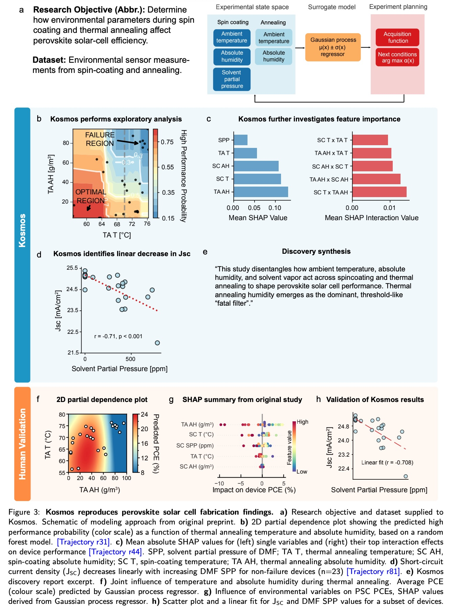
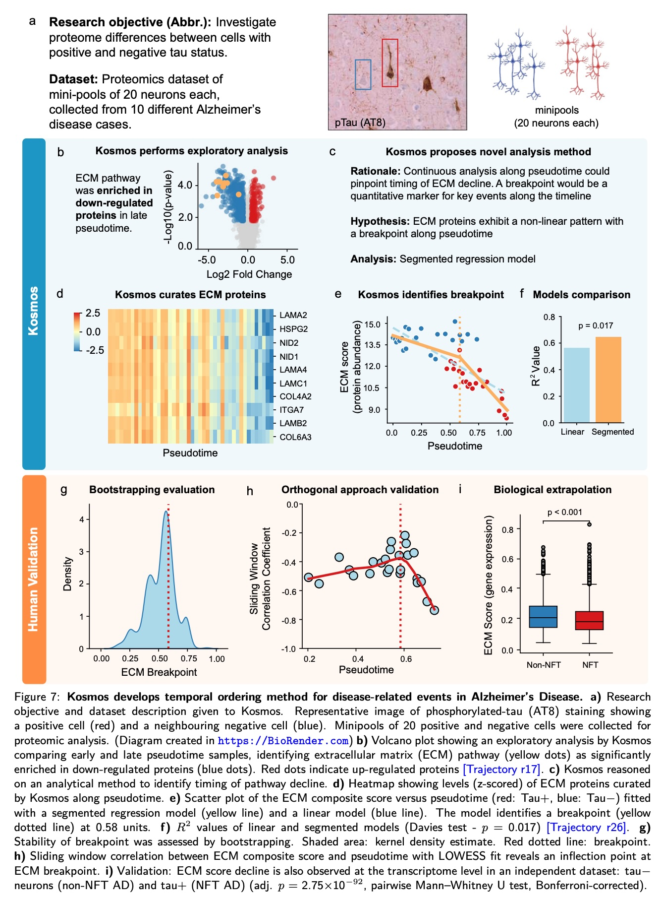
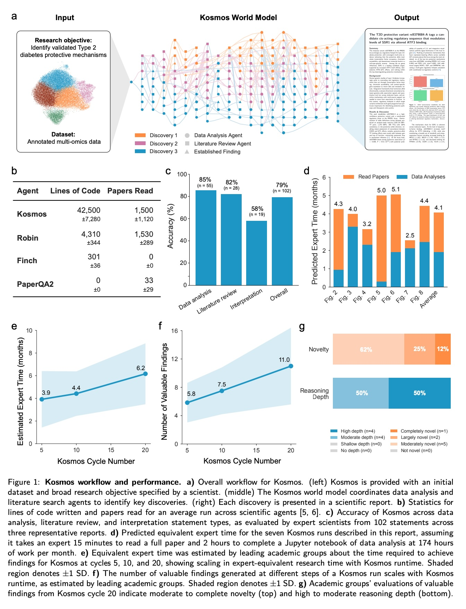
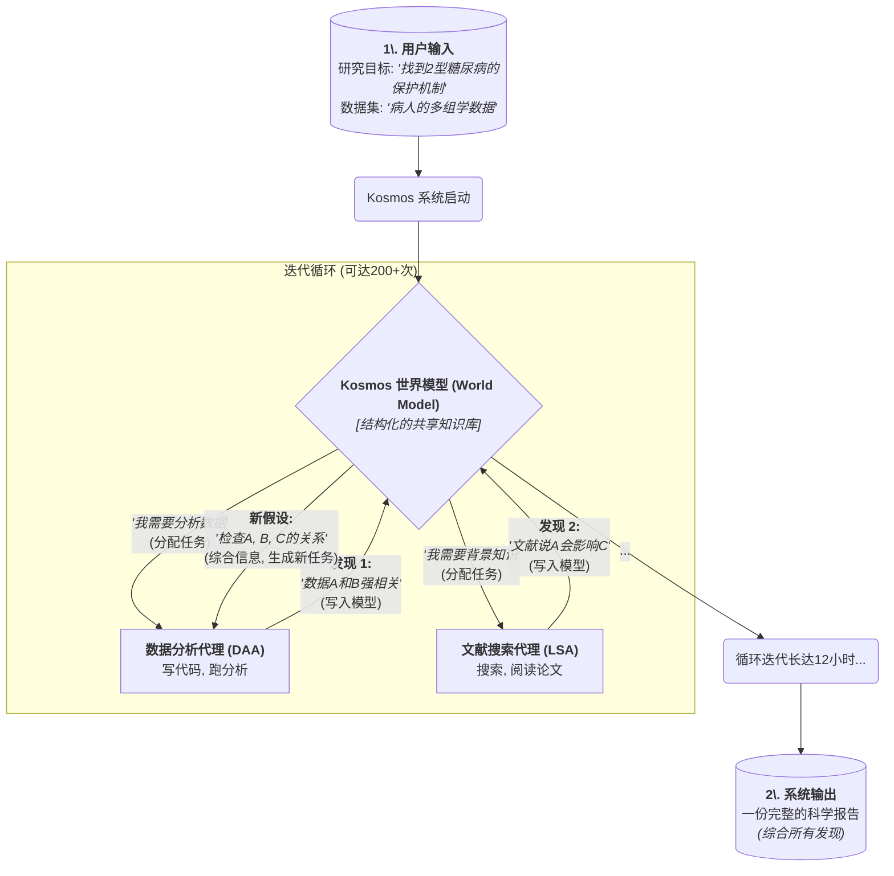
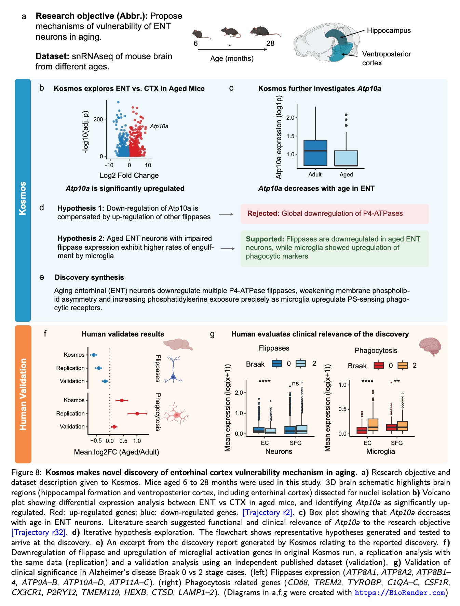

## AI论文解读 | Kosmos: An AI Scientist for Autonomous Discovery
        
### 作者        
digoal        
        
### 日期        
2025-11-18        
        
### 标签        
PostgreSQL , PolarDB , DuckDB , AI , 论文解读        
        
----        
        
## 背景  
      
https://arxiv.org/pdf/2511.02824        
  
提示:          
```          
读懂《Kosmos: An AI Scientist for Autonomous Discovery》这篇论文需要提前掌握哪些基础知识, 请使用中文通熟易懂的讲解这些基础知识, 可以引用论文中的图、表或使用Markdown支持的图形(text,mermaid等)增加解释性. 
  
使用中文通熟易懂的解读《Kosmos: An AI Scientist for Autonomous Discovery》这篇论文, 其中的关键内容请着重讲解, 可以引用论文中的图、表或使用Markdown支持的图形(text,mermaid等)增加解释性. 
  
提取《Kosmos: An AI Scientist for Autonomous Discovery》这篇论文中的重要术语, 使用中文对这些术语进行通熟易懂的讲解, 可以引用论文中的图、表或使用Markdown支持的图形(text,mermaid等)增加解释性. 
```     
  
## 1 前置知识 
  
你好！要完全读懂这篇关于 Kosmos 的论文，你需要一个跨学科的知识背景。这篇论文介绍了一个“AI 科学家” ，它能自主进行数据驱动的科学发现 。

简单来说，Kosmos 就像一个既懂编程、又会读文献、还能自主思考的“AI 科研助理”团队。你给它一个宏观的研究目标和一个数据集（比如“请分析这份病人数据，找出与老年痴呆症相关的机制”），它就能自己“肝”上12个小时，阅读上千篇论文，执行几万行代码 ，最后交给你一份图文并茂、有理有据的“科学报告” 。

为了帮助你理解它是如何做到这一点的，以及它发现的成果（比如在神经科学、材料学上的7个新发现 ）有多大意义，你需要掌握以下几个方面的基础知识：

### 1\. 🧠 人工智能 (AI) 与大语言模型 (LLM) 基础

这是理解 Kosmos “如何工作”的核心。

  * **AI 代理 (Agent):**
    你需要知道什么是“AI 代理”。你可以把它理解为一个能自主行动的智能程序。它有**目标**（比如“分析数据”），能**感知**环境（读取文件），能**推理**（决定下一步做什么），并能**行动**（写代码、搜索文献）。Kosmos 系统就是由两个这样的核心代理组成的：一个“数据分析代理”和一个“文献搜索代理” 。

  * **大语言模型 (Large Language Model, LLM):**
    这是 AI 代理的“大脑”。你需要了解 LLM (比如 GPT-4 或 Gemini) 不仅仅能聊天，它们还非常擅长**跨学科推理**和**编程** 。Kosmos 正是利用了 LLM 的这些能力来生成假设、编写和执行代码 。

  * **世界模型 (World Model):**
    这是这篇论文的**关键创新点** 。你需要理解这个概念。在 Kosmos 中，“世界模型”不是用来模拟物理世界的，而是更像一个“**结构化的共享知识库**”或一个“动态更新的科研笔记”。

    想象一下，数据分析代理（A）和文献搜索代理（B）在协同工作：

    1.  A 通过分析数据发现“X 蛋白”水平异常。
    2.  A 把这个发现写入“世界模型”（共享笔记）。
    3.  B 看到笔记更新，马上去搜索“X 蛋白与该疾病的关系”，并把搜到的文献摘要也写回笔记 。
    4.  A 看到 B 的笔记，受到启发，设计了新的代码来验证这个联系。

    这个“世界模型”确保了两个代理不会“精神分裂”或“失去 coherence” ，使它们能朝着同一个目标（你设定的研究目标）进行长达数百步的深度探索 。

    下面是一个简化的流程图，展示了世界模型的作用 ：

    ```mermaid
    graph TD
        subgraph Kosmos 系统
            Input[(" 1\. 输入: <br> 宏观研究目标 + 数据集 ")] -- 启动 --> WM
            WM[(" <b>Kosmos 世界模型</b> <br> (结构化知识库) ")]
            DAA["Data Analysis Agent <br> (数据分析代理)"]
            LSA["Literature Search Agent <br> (文献搜索代理)"]

            WM -- 分配任务/共享信息 --> DAA
            WM -- 分配任务/共享信息 --> LSA
            DAA -- 执行代码/分析数据 <br> 更新发现 --> WM
            LSA -- 搜索/阅读文献 <br> 更新发现 --> WM
            WM -- 综合所有发现 --> Output[(" 2\. 输出: <br> 科学报告 ")]
        end
    ```

### 2\. 🧬 科学研究与生物信息学基础

这是理解 Kosmos “发现了什么”的核心。论文中的7个案例研究  涉及了非常专业的领域。要理解这些案例的意义，你至少需要对以下领域有基本概念：

  * **多组学 (Multi-omics):**
    这是现代生物学研究的基石。你需要知道“组学”就是大规模地测量某一类生物分子。论文中提到了：

      * **代谢组学 (Metabolomics):** 测量所有的小分子代谢物（案例一 ）。
      * **转录组学 (Transcriptomics):** 测量所有的 RNA（案例七 ）。
      * **蛋白质组学 (Proteomics):** 测量所有的蛋白质（案例六 ）。
        Kosmos 的工作就是从这些高维度的数据中找出规律 。

  * **统计遗传学 (Statistical Genetics):**
    案例四  和案例五  严重依赖这个领域的知识。

      * **GWAS (全基因组关联研究):** 你需要知道这是一种“大海捞针”的方法，通过比较大量人群的基因数据，找出哪些基因变异（叫作 SNP）与某种疾病（比如 2 型糖尿病 ）相关。
      * **孟德尔随机化 (Mendelian Randomization, MR):** 这是一个非常重要的高级概念（案例四 ）。简单说，它是一种利用基因变异作为“天然的随机对照试验”的方法，来判断两件事之间是否有**因果关系**，而不仅仅是相关性。比如，判断“SOD2 蛋白水平”是否**导致**了“心肌纤维化”。

  * **神经科学 (Neuroscience):**
    案例三、六、七都与大脑相关。

      * **连接组学 (Connectomics):** 研究大脑的“线路图”（案例三 ）。
      * **阿尔茨海默病 (AD):** 你需要知道这是一种神经退行性疾病，与 tau 蛋白积累有关（案例六  和案例七 ）。Kosmos 在这个领域做出了一个新颖的发现，即“翻转酶 (flippase)”的减少可能导致了神经元被小胶质细胞“吃掉” 。

### 3\. 📊 数据科学与统计学知识

这是理解 Kosmos “如何评估”以及它所用分析方法的基础。

  * **模型可解释性 (SHAP 值):**
    在材料科学的案例二中 ，Kosmos 使用了 SHAP 值 （见图 3c ）。你需要知道这是一种“模型归因”技术，它能告诉你 AI 模型做出某个预测时，**哪个输入特征（因素）最重要**。比如，它发现“热退火湿度”是影响太阳能电池性能的“致命过滤器” 。    

  * **统计分布 (Log-normal vs. Power-law):**
    在案例三中 ，Kosmos 重新发现了人类科学家的一个结论：神经元的连接数（度）更符合**对数正态分布 (log-normal)**，而不是之前认为的幂律分布 (power-law) 。你需要对这两种分布有基本概念，它们描述了事物在群体中是如何分布的（是像身高一样中间多两头少，还是像财富一样极少数人占有绝大多数）。

  * **回归分析 (Segmented Regression):**
    在案例六中 ，Kosmos **独立开发**了一种新的分析方法 ：**分段回归** （见图 7e, 7f ）。你需要知道这是一种统计模型，它能在一个趋势中找到一个“**断点 (breakpoint)**” 。Kosmos 用它来精确地定位在阿尔茨海默病的过程中，细胞外基质 (ECM) 是从**哪个时间点开始**崩溃的 。    

-----

### 总结

要读懂这篇论文，你需要：

1.  **AI 基础（必选）：** 知道 AI 代理 (Agent) 和 LLM 是什么，并重点理解作为“共享知识库”的“世界模型 (World Model)”  是如何协调不同代理工作的。
2.  **科研流程（必选）：** 了解“数据驱动的发现”  是一个“假设-分析-验证”的循环过程（如图 1a 所示 ）。    
3.  **生物/统计（可选，但推荐）：** 了解“多组学”、“GWAS”、“孟德尔随机化 (MR)”  和“回归”等概念。

如果你不具备生物或统计背景，你仍然可以理解 Kosmos 的**系统架构和AI层面的创新**。但如果你想深入理解它所取得的**科学成就**（比如案例四  和案例七  的重要性），那么这些专业知识就是必不可少的。

希望这个导读对你有帮助！你是否想让我更详细地解释一下“孟德尔随机化 (MR)”或“世界模型 (World Model)”的具体工作方式？
  
## 2 解读论文 
  
你好！很高兴为你解读这篇非常重磅的论文《Kosmos: An AI Scientist for Autonomous Discovery》。

简单来说，这篇论文介绍了一个名为 **Kosmos** 的“AI 科学家”系统 。它不是一个单一的聊天机器人，而是一个**能自主进行科学研究的自动化系统**。

你可以把它想象成一个由 AI 驱动的“科研团队”：你给它一个宏观的研究目标（比如“请找出导致这种疾病的机制”）和一个数据集（比如一份病人的基因数据），Kosmos 就能“接管”后续工作。它会**连续运行长达12个小时** ，在此期间自主地**阅读数千篇文献**、**编写并执行数万行代码**来分析数据、不断提出并验证假设，最后自动为你生成一份包含新发现的科学报告 。

这篇论文的**核心价值**在于，它展示了 Kosmos 不仅能“复现”人类已知的科学发现，甚至能**做出人类科学家尚未发现的、具有临床意义的全新贡献** 。

-----

下面，我将为你着重讲解这篇论文的三个关键内容：

### 关键内容一：Kosmos 的“世界模型” (核心架构)

这是 Kosmos 能够实现长时间、复杂研究的**最大创新点**。

**1. 它要解决什么问题？**
以前的 AI 代理（Agent）在执行科研任务时，最大的问题是 **“失去连贯性” (losing coherence)** 。它们可能分析几步数据，或者看几篇文献，就“忘记”了最初的目标，或者无法把数据发现和文献知识有效结合起来。

**2. Kosmos 的解决方案：**
Kosmos 由两个主要的“AI 代理”组成：

  * **数据分析代理 (Data Analysis Agent):** 负责“动手”，即编写和执行代码（如 Python）来分析你给的数据集 。
  * **文献搜索代理 (Literature Search Agent):** 负责“动脑”，即搜索和阅读海量科学文献，提供理论背景和佐证 。

而连接这两个代理的“胶水”，就是这篇论文的核心——**世界模型 (World Model)** 。

**3. 什么是“世界模型”？**
在这里，“世界模型” **不是** 指模拟物理世界的模型，而是更像一个“**结构化的共享知识库**”，或者一个“**动态更新的科研白板**” 。

它的工作流程可以用下面这个图来理解：



通过这个“世界模型”，数据代理的每一个发现（“我发现A和B相关”）和文献代理的每一个见解（“我读到A会影响C”）都会被**结构化地记录和共享** 。这使得 Kosmos 能够连贯地追求一个目标超过200个“回合”(rollouts)，平均执行**42,000行代码**和阅读**1,500篇论文** ，而不会“跑偏”。

-----

### 关键内容二：Kosmos 的惊人成果 (性能与发现)

Kosmos 到底有多强？论文用**图1 (Figure 1)** 和 **7个真实的科学案例** 给了我们答案。    

**1. 性能指标 (Figure 1)**

  * **规模 (Figure 1b):** Kosmos 产生的数据分析代码量 (42,500行) 和阅读的论文量 (1,500篇) 远远超过了以前的系统（例如 Robin 只有 4,310 行代码）。
  * **效率 (Figure 1e):** 论文邀请了人类科学家评估 Kosmos 的工作。科学家们报告说，Kosmos 一次20周期的运行（约12小时），所完成的研究工作量，**平均相当于一个专家6个月的研究时间** 。
  * **准确率 (Figure 1c):** 这一点非常关键！Kosmos 并非完美无缺。
      * 它生成的“数据分析”类结论，准确率约为 **85%** 。
      * 它生成的“文献综述”类结论，准确率约为 **82%** 。
      * 但是，它生成的“**综合解读**”类结论（即结合数据和文献进行推理），准确率**只有 58%** 。
      * **这说明：** Kosmos 擅长执行具体任务（分析、查找），但在“像科学家一样进行深度思考和解读”方面，还存在明显短板 。

**2. 七个真实的科学发现**
Kosmos 在**代谢组学、材料科学、神经科学、统计遗传学**等多个领域完成了7个真实的研究项目 。这些发现被分为五类，我为你重点介绍其中最震撼的一个：

#### 案例七：独立做出人类尚未发现的全新贡献 

  * **研究目标 (Figure 8a):** 为什么在大脑衰老和阿尔茨海默病 (AD) 中，“内嗅皮层 (ENT)”的神经元总是最先受损和死亡？    

  * **Kosmos 的自主发现过程：**

    1.  **数据分析:** Kosmos 比较了脆弱的 ENT 区和坚韧的 CTX 区的神经元基因 。
    2.  **发现:** 它注意到一个叫 `Atp10a` 的基因在脆弱的 ENT 区表达量很高  (见 Figure 8b)。
    3.  **文献搜索:** Kosmos 立刻去查文献，发现 `Atp10a` 是一种“**翻转酶 (flippase)**” 。
    4.  **深入分析:** Kosmos 接着分析发现，虽然这个基因在 ENT 区很多，但随着小鼠变老，它的表达量**反而显著下降了**  (见 Figure 8c)。
    5.  **Kosmos 的“灵光一闪” (提出假设):** 翻转酶（如 `Atp10a`）的工作是把一种叫“磷脂酰丝氨酸 (PS)”的分子从细胞膜外翻转回细胞内 。PS 是一个著名的“**吃我 (eat-me)**”信号 。
    6.  **Kosmos 推理：** 脆弱的 ENT 神经元 → 衰老导致 `Atp10a` (翻转酶) 崩溃 → “吃我”信号 (PS) 暴露在细胞膜外 → 引发大脑中的免疫细胞 (小胶质细胞) 来**吞噬 (phagocytosis) 这些“异常”的神经元** 。
    7.  **验证:** Kosmos 立即分析了小胶质细胞的数据，**证实了这一假设**：在神经元中“翻转酶”基因普遍下降的同时，小胶质细胞中的“吞噬”基因**确实上调了**  (见 Figure 8f)。

  * **案例意义:** Kosmos 独立发现了一个**全新的、具有临床意义的神经元脆弱性机制** ，而这个机制是最初收集数据的人类科学家都没有注意到的 。

-----

### 关键内容三：局限性与“人机协同”的未来

这篇论文非常诚实地指出了 Kosmos 的局限性，并强调它不是用来“取代”科学家的 。

**1. 局限性 (Limitations)**

  * **“品味”很差：** 如前所述，它在“综合解读”上准确率仅有 58% 。它常常**混淆“统计上的显著”和“科学上的价值”** ，缺乏科学家的“品味”和“直觉”。
  * **数据类型限制：** 目前只能处理约 5GB 以下的表格数据，还不能分析原始图像或原始测序文件 。
  * **无法主动访问外部数据：** 它不能自己去公共数据库（如 GEO）下载新的数据来做交叉验证 。
  * **随机性：** 你用同样的数据和目标跑两次 Kosmos，它可能会探索不同的路径，得出不同的发现 。

**2. 未来：“科学家在环” (Scientist-in-the-loop)**
论文强调，Kosmos 的真正价值在于“人机协同” 。

  * **人类负责：** 提出有价值的研究问题、提供高质量和规范化的数据 、以及（最关键的） **评估和解读** Kosmos 产出的海量结果 。
  * **AI 负责：** 大规模、无偏见地探索所有可能的路径 ，充当一个永不疲倦的“科研加速器”。

### 总结

《Kosmos》这篇论文的真正突破在于，它提供了一个 **可扩展的、连贯的 AI 架构（世界模型）** ，使 AI 第一次能够自主执行**长达数月工作量**的复杂科研任务，并真正做出了**全新的科学发现** 。它标志着 AI 在科学领域中的角色，正在从“工具”和“助手”，转变为一个真正的“研究合作者”。
  
## 3 术语 
  
你好！这篇论文《Kosmos: An AI Scientist for Autonomous Discovery》确实包含了一些非常关键且新颖的术语。要理解 Kosmos 是如何工作的，以及它为什么如此重要，我们需要先理解这些“黑话”。

以下是这篇论文中最重要的几个术语，我会用最通俗易懂的中文为你讲解：

-----

### 💬 核心 AI 与系统架构术语

#### 1\. AI Scientist (AI 科学家)

  * **通俗讲解：**
    这就是论文对 Kosmos 系统的核心称呼 。它不是一个像 ChatGPT 那样“你问我答”的工具，而是一个能**自主完成整个科研流程**的 AI 系统 。

  * **它能做什么：**
    你给它一个宏观的研究目标（比如“分析这份数据，找出老年痴呆的成因”）和一个数据集，它就能像一个真正的人类科学家团队一样，**自主地**、**迭代地**去工作 ：

    1.  **读文献** (Literature Search) 
    2.  **提假设** (Hypothesis Generation) 
    3.  **写代码分析数据** (Data Analysis) 
    4.  **最后写出报告** 

#### 2\. World Model (世界模型)

  * **通俗讲解：**
    这是 Kosmos 系统**最最核心的创新点** 。

    **请注意：** 这里的“世界模型” **不是** 指“模拟物理世界的 AI”。在这篇论文里，它更像是一个“**结构化的共享知识库**”或一个“**中央作战指挥室**” 。

  * **它如何工作：**
    Kosmos 系统里有很多并行的 AI 助手（见下一个术语“AI 代理”）。“世界模型”就是连接它们的中枢。

    1.  数据分析代理A 发现：“X 蛋白在数据里看起来很重要”。
    2.  它把这个发现 **写入“世界模型”** （共享知识库）。
    3.  “世界模型”看到这个新信息，立刻给文献搜索代理B 分配一个新任务：“快去查查 X 蛋白和这个病有啥关系” 。
    4.  代理B 查完文献，也把结果写回“世界模型” 。
    5.  系统再根据知识库里的所有信息，生成下一轮的数据分析任务 。

    这个机制确保了 Kosmos 在执行成百上千步复杂任务时，依然能**保持专注**，不会“跑偏”。

    ```mermaid
    graph TD
        A[("<b>1\. 用户输入</b><br>研究目标 + 数据集")] --> B{"<b>Kosmos 世界模型 (World Model)</b><br><i>[结构化的共享知识库]</i>"}
        B -- "分配任务/共享信息" --> C["<b>数据分析代理 (DAA)</b><br><i>(写代码, 分析数据)</i>"]
        B -- "分配任务/共享信息" --> D["<b>文献搜索代理 (LSA)</b><br><i>(读论文, 查资料)</i>"]
        C -- "更新发现 (如: 'X蛋白异常')" --> B
        D -- "更新发现 (如: '文献说X蛋白...') " --> B
        B -- "综合所有信息<br>生成新任务" --> C & D
        B --> E[("<b>2\. 系统输出</b><br>包含新发现的科学报告")]
    ```

#### 3\. AI Agent (AI 代理)

  * **通俗讲解：**
    这就是 Kosmos 系统里的“**智能工作单元**”或“**AI 助手**” 。Kosmos 系统主要由两种代理组成：

      * **数据分析代理 (Data Analysis Agent):** 专门负责“动手”，比如用 Python 写代码、跑统计、做图表 。
      * **文献搜索代理 (Literature Search Agent):** 专门负责“动脑”，比如搜索和阅读海量科学文献，提供理论背景和佐证 。

    Kosmos 之所以强大，是因为它能**同时启动并管理（coordinate）数百个**这样的代理 。

#### 4\. Losing Coherence (失去连贯性)

  * **通俗讲解：**
    这是这篇论文要解决的核心问题。它指的是以前的 AI 代理在执行复杂、长期的任务时，**很容易“跑偏”或“忘记最初的目标”** 。

  * **举个例子：**
    你让一个普通 AI 去分析数据，它可能分析两三步，就陷入了某个细节，完全忘了总的研究目标是什么。
    而 Kosmos 通过使用“世界模型”来不断同步信息 ，使其能够连续执行 200 多个“回合”（见下一条）依然保持连贯，始终围绕着最终目标在工作 。

#### 5\. Agent Rollouts (代理部署/回合)

  * **通俗讲解：**
    这个词可以理解为 AI 代理执行任务的“**工作回合**”或“**部署次数**”。

  * **规模有多大：**
    Kosmos 在一次典型的12小时运行中，会执行约 **200 个“回合”** 。其中，数据分析代理部署了 166 次（平均执行了 **42,000 行代码**），文献搜索代理部署了 36 次（平均阅读了 **1,500 篇论文**）。

#### 6\. Traceable / Traceability (可追溯性)

  * **通俗讲解：**
    这是 Kosmos 产出的科学报告的一个关键特性：**透明且可验证**。

  * **它如何实现：**
    报告中的**每一句话**、**每一个结论**，都必须强制引用支持它的**原始出处** 。这个出处要么是：

    1.  它自己生成的**数据分析代码**（Jupyter notebook）。
    2.  它读过的**原始科学文献** 。

    这确保了人类科学家可以轻松核实 Kosmos 得出结论的每一步推理过程，这对于严谨的科学发现至关重要。

-----

### 🔬 关键科学发现与方法术语

以下是 Kosmos 在7个案例研究中用到或发现的关键术语，也是理解它“科研能力”的钥匙。

#### 7\. Mendelian Randomization (MR) (孟德尔随机化)

  * **通俗讲解：**
    这是一种高级的统计遗传学方法，在**案例四**中被使用 。

  * **它解决什么问题：**
    我们都知道“相关性不等于因果性”。比如，数据显示“喝咖啡”和“得癌症”相关，但我们不知道是喝咖啡“导致”了癌症，还是因为爱熬夜的人（他们本身就易得癌症）更爱喝咖啡。

  * **MR 的“骚操作”：**
    MR 利用**基因变异**（这是我们一出生就**随机**分配的，没法改）作为一种“天然的随机对照试验” 。
    Kosmos 用这个方法来推断：某个蛋白质水平（暴露）和心肌纤维化（结果）之间是否存在**真正的因果关系**，而不只是简单的相关 。

#### 8\. Pseudotime (伪时间)

  * **通俗讲解：**
    这个术语出现在**案例六**（阿尔茨海默病研究）中 。

  * **它是什么：**
    在生物学中，我们很难真正“实时”观察一个细胞是如何从健康一步步“生病”的。因此，科学家们发明了“伪时间”这个概念。
    它是一种数据分析方法，通过分析在同一时间点收集到的大量单个细胞的数据，将它们**按照生物过程的进展（比如疾病的严重程度）进行重新排序** 。
    Kosmos 正是利用这个排好序的“伪时间”轴，来分析在疾病恶化的过程中，不同的生物事件是按什么**先后顺序**发生的 。

#### 9\. Segmented Regression / Breakpoint (分段回归 / 断点)

  * **通俗讲解：**
    这是 Kosmos 在**案例六**中**自主开发的一种新颖分析方法** 。

  * **它是什么：**
    普通的线性回归是试图画一条“直线”来拟合数据。而“分段回归”则是画一条“**折线**”来拟合数据 。
    Kosmos 用这个方法来分析一个关键生物通路（ECM）的得分随“伪时间”的变化，并成功找到了一个“**断点 (Breakpoint)**”（即折线的拐点） 。
    这个“断点”精确地指出了该生物通路在疾病进展到**哪个时刻（0.58 伪时间单位）突然开始加速崩溃**，这是一个非常新颖且重要的发现 。

#### 10\. Flippase / "Eat-me" Signal (翻转酶 / “吃我”信号)

  * **通俗讲解：**
    这是 Kosmos 在**案例七**（大脑衰老研究）中做出的**全新科学发现**的核心术语 。这个发现连最初收集数据的人类科学家都没有注意到。

  * **它们的关系：**

    1.  **Flippase (翻转酶):** 是一种蛋白质，它的工作就像“细胞的守门员”，负责把一种叫 PS 的分子（磷脂酰丝氨酸）从细胞膜的“外面” **翻转** 回“里面” 。
    2.  **"Eat-me" Signal (吃我”信号):** 这个 PS 分子一旦暴露在细胞膜的“外面”，就等于向外界的免疫细胞发出了一个“**我快不行了，快来吃我**”的信号 。
    3.  **Kosmos 的全新发现:** 它发现，在大脑最脆弱的区域（ENT），神经元在衰老时，它们的“翻转酶”集体“罢工”了（基因表达量显著下降） 。这导致大量“吃我”信号暴露在细胞表面，进而引来大脑中的免疫细胞（小胶质细胞）把这些神经元给“**吃掉**”了（即吞噬作用，phagocytosis）。

希望这些解释能帮助你更好地理解这篇论文！
  
## 参考        
         
https://arxiv.org/pdf/2511.02824    
        
<b> 以上内容基于DeepSeek、Qwen、Gemini及诸多AI生成, 轻微人工调整, 感谢杭州深度求索人工智能、阿里云、Google等公司. </b>        
        
<b> AI 生成的内容请自行辨别正确性, 当然也多了些许踩坑的乐趣, 毕竟冒险是每个男人的天性.  </b>        
  
    
#### [PolarDB 学习图谱](https://www.aliyun.com/database/openpolardb/activity "8642f60e04ed0c814bf9cb9677976bd4")
  
  
#### [PostgreSQL 解决方案集合](../201706/20170601_02.md "40cff096e9ed7122c512b35d8561d9c8")
  
  
#### [德哥 / digoal's Github - 公益是一辈子的事.](https://github.com/digoal/blog/blob/master/README.md "22709685feb7cab07d30f30387f0a9ae")
  
  
#### [About 德哥](https://github.com/digoal/blog/blob/master/me/readme.md "a37735981e7704886ffd590565582dd0")
  
  

  
