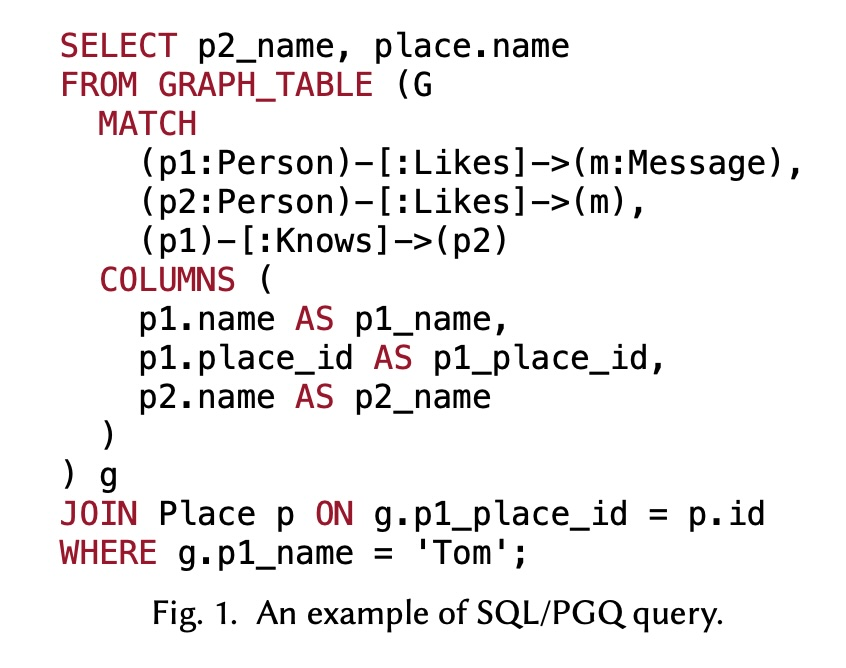
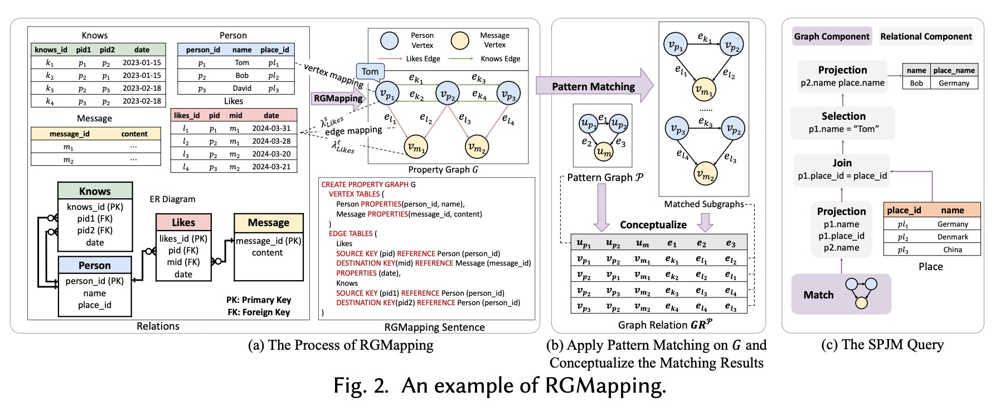
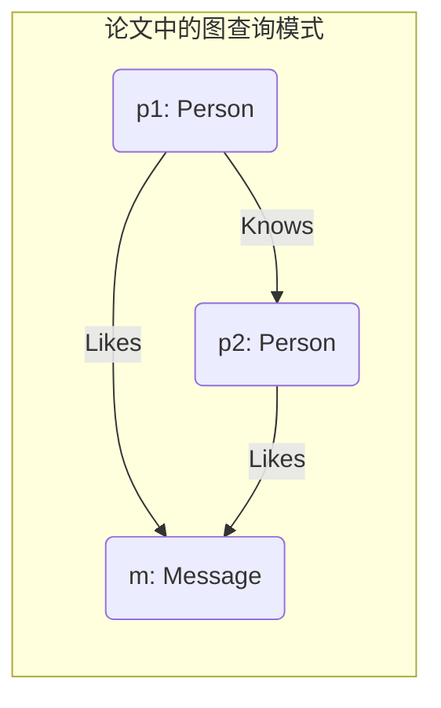
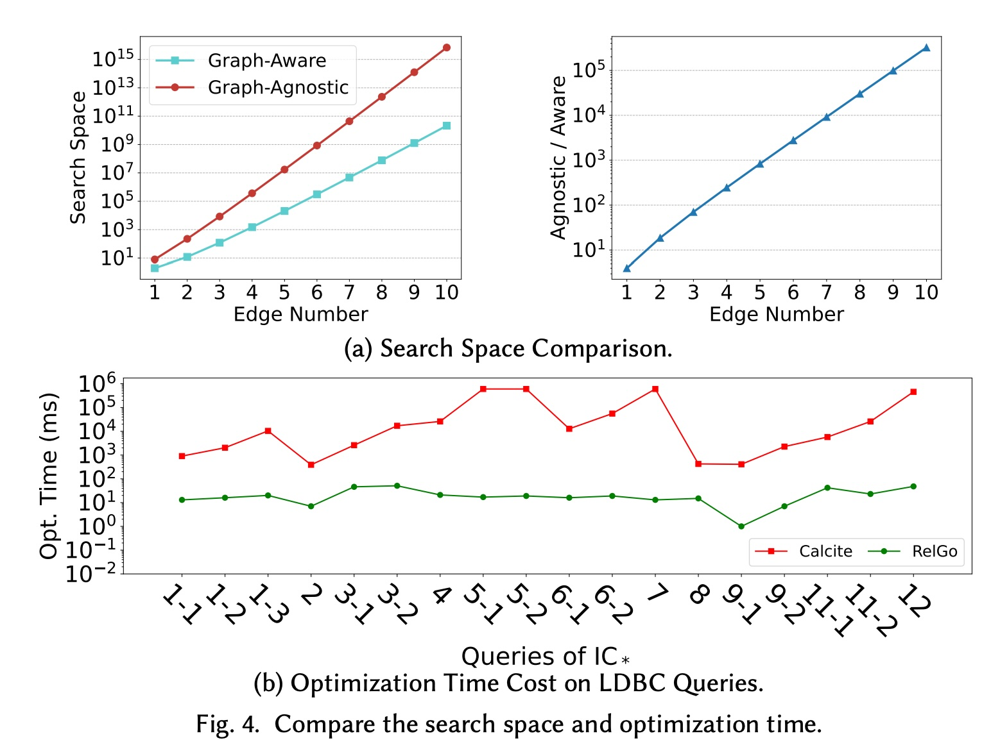
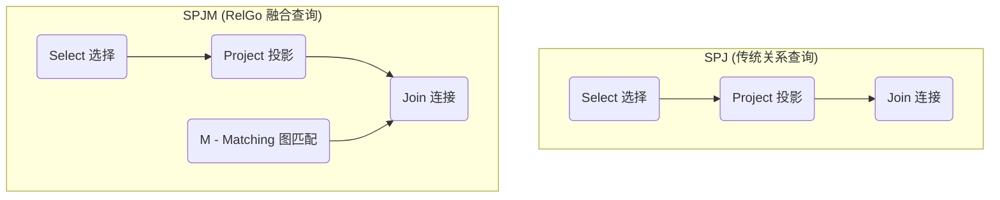
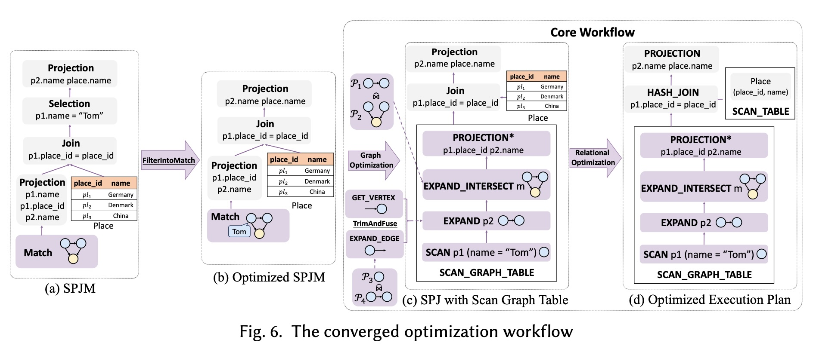
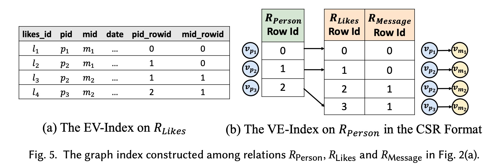
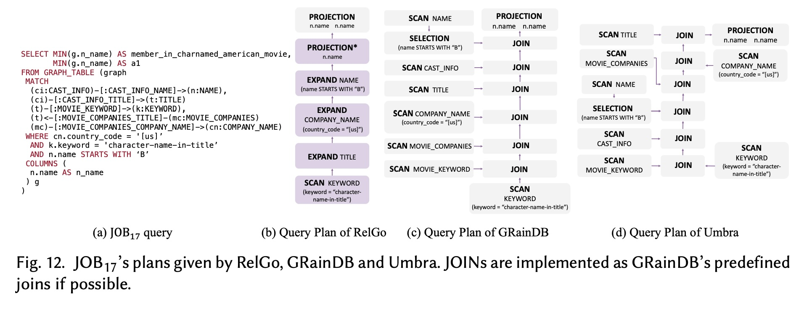
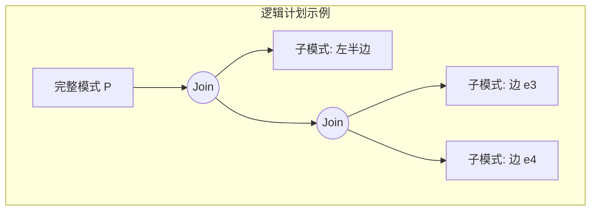
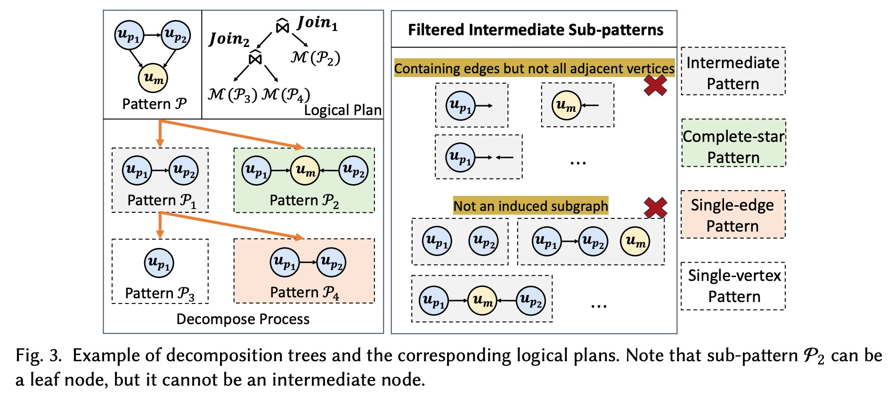

## AI论文解读 | Towards a Converged Relational-Graph Optimization Framework
        
### 作者        
digoal        
        
### 日期        
2025-11-18        
        
### 标签        
PostgreSQL , PolarDB , DuckDB , AI , 论文解读        
        
----        
        
## 背景  
      
https://arxiv.org/pdf/2408.13480        
  
提示:          
```          
读懂《Towards a Converged Relational-Graph Optimization Framework》这篇论文需要提前掌握哪些基础知识, 请使用中文通熟易懂的讲解这些基础知识, 可以引用论文中的图、表或使用Markdown支持的图形(text,mermaid等)增加解释性. 
  
使用中文通熟易懂的解读《Towards a Converged Relational-Graph Optimization Framework》这篇论文, 其中的关键内容请着重讲解, 可以引用论文中的图、表或使用Markdown支持的图形(text,mermaid等)增加解释性. 
  
提取《Towards a Converged Relational-Graph Optimization Framework》这篇论文中的重要术语, 使用中文对这些术语进行通熟易懂的讲解, 可以引用论文中的图、表或使用Markdown支持的图形(text,mermaid等)增加解释性. 
```     
  
## 1 前置知识 
  
读懂这篇论文《Towards a Converged Relational-Graph Optimization Framework》（迈向一个融合的关系-图优化框架），你需要一些跨领域的知识储备。这篇论文的核心是关于**如何让传统的关系型数据库（像 MySQL, PostgreSQL）高效地处理新型的图查询（Graph Queries）** 。

想象一下，你是一个城市的交通总指挥。你非常擅长调度公路上的汽车（关系型数据），但现在城市里新建了高铁（图数据），并且出现了大量“先坐汽车、再换高铁”的混合出行需求（混合查询）。你的任务就是设计一套新的调度系统（优化框架 RelGo），让这种混合出行变得最高效 。

要理解这套新系统，你需要掌握以下几个方面的基础知识：

### 🚗 知识点一：关系型数据库与 SQL (公路汽车系统)

这是最基础的知识。你需要明白：

  * **基本概念**：什么是**关系 (Relation)** 或**表 (Table)** 、**元组 (Tuple)** (即行)、**属性 (Attribute)** (即列) 。
  * **SQL 语言**：这是在关系型数据库中查询数据的标准语言 。你至少需要熟悉最核心的 **SPJ 查询**，即：
      * **S - Select (选择)**：对应 `WHERE` 子句，用于过滤数据。
      * **P - Project (投影)**：对应 `SELECT` 子句，用于选择需要的列。
      * **J - Join (连接)**：对应 `JOIN` 子句，用于把多个表按条件拼接起来 。

### 🕸️ 知识点二：图数据库与图查询 (高铁网络系统)

这是论文的另一个主角。你需要了解：

  * **属性图 (Property Graph)**：这是当今图数据库的主流模型。你需要知道图由以下元素构成 ：
      * **V - 顶点 (Vertices)**：代表实体，例如“人 (Person)”、“消息 (Message)”。
      * **E - 边 (Edges)**：代表关系，例如 (人)-[:Likes]-\>(消息) 。
      * **标签 (Label)**：顶和边都可以有类型，比如 "Person" 标签 。
      * **属性 (Property)**：顶点和边都可以有自己的属性，比如 "Person" 有 "name" 属性 。
  * **图模式匹配 (Graph Pattern Matching)**：这是图查询的核心 。它不是像 SQL 那样一行行地查，而是在整个数据图中“寻找一个特定的子图结构”。
      * 例如，论文的 **图 1**  和 **图 2**  中的 `MATCH` 部分就在寻找一个模式：      
        `(p1:Person)` 认识 `(p2:Person)`，并且他们俩都 `Likes` 同一个 `(m:Message)` 。
      * 你需要理解什么是**同态 (Homomorphism)** ，这是图匹配的一种常见语义，简单说就是允许多个模式中的顶点映射到数据图中的同一个顶点。




### 🌉 知识点三：SQL/PGQ (新型混合换乘站)

这是连接上述两个世界的桥梁，也是这篇论文要解决的“新问题”。

  * **SQL/PGQ**：这是 ISO SQL:2023 标准中新增的一部分，全称是 "SQL/Property Graph Queries" 。
  * 它允许你在一个 SQL 查询中，同时使用 `MATCH` 语句（来自图查询）和 `SELECT...FROM...JOIN` 语句（来自关系查询）。
  * **图 1**  就是一个完美的例子：  
    1.  `MATCH` 部分先在图 `G` 中找到匹配模式的人 `p1` 和 `p2` 。
    2.  `COLUMNS` 部分把图匹配的结果（如图中的 `p1.name`, `p1.place_id`）"拍平"成一个临时的关系表 `g` 。
    3.  `JOIN` 和 `WHERE` 部分再把这个临时表 `g` 和一个普通的关系表 `Place` 进行连接和过滤 。

**理解了这个混合查询的结构，你就理解了论文要优化的对象。**

### 🚦 知识点四：查询优化基础 (交通调度策略)

这是论文最核心的技术点。你需要知道什么是“查询优化器” (Query Optimizer)。

  * **执行计划 (Execution Plan)**：对于一个查询，数据库可以有很多种执行方式（比如先 Join A 和 B，再 Join C；或者先 Join B 和 C，再 Join A）。“执行计划”就是数据库最终决定的执行步骤。优化器的目标就是找到最快（成本最低）的那个执行计划。
  * **Graph-Agnostic (图不可知) vs. Graph-Aware (图可知)**：
      * **图不可知**：这是一种“笨办法”。把图查询 `MATCH` 里的每一个匹配（如 `(p1)-[:Knows]->(p2)`）都强行翻译成一个 SQL `JOIN` 。这篇论文证明了这种方法虽然可行 ，但效率很低，因为它不理解图的特性，可能导致“搜索空间爆炸” (exponentially larger search space) 。
      * **图可知**：这是论文 **RelGo** 框架采用的“聪明办法” 。它知道哪部分是图，并对图的部分使用专门的图优化技术 。
  * **SPJM 查询**：为了实现“图可知”，论文提出了 **SPJM** 模型 。它在经典 SPJ 的基础上，增加了一个 `M` (Matching) 算子，专门用来代表图模式匹配操作。
  * **启发式规则 (Heuristic Rules)**：这是优化的“捷径”。比如论文提到的 `FilterIntoMatchRule` ：如果 SQL 的 `WHERE` 子句（例如 `g.p1_name = 'Tom'` ）实际上是针对图中的一个顶点属性，那么就应该在图匹配（`M`）的一开始就进行过滤，而不是等图匹配完成后再过滤 。

### 🛠️ 知识点五：高级优化技术 (黑科技)

要深入理解论文的实现，你还需要了解一些更高级的概念，它们是“图可知”优化的具体实现手段：

  * **分解树 (Decomposition Tree)**：这是图优化中的常用技术 。它将一个复杂的图模式（如三角形）递归地分解为更小的部分（如先匹配一条边，再匹配另一个顶点）的组合 。
  * **WCO Joins (最坏情况最优连接)**：这是图（或复杂 Join）查询优化领域的一个重要概念 。它指的是一种能保证在最坏数据分布下，中间结果大小也不会“爆炸”的 Join 算法。
  * **图索引 (Graph Index)**：在关系型数据库上跑图查询，最慢的操作就是“找邻居”（例如，从 `p1` 出发找到所有 `p1` `Knows` 的 `p2`）。“图索引”是一种像 **GRainDB**  那样的技术，它通过预计算或物化邻接表 ，将这个昂贵的 `JOIN` 操作变成一次快速的索引查找 。

-----

### 总结

要读懂这篇论文，你需要：

1.  **懂 SQL** (知道 SPJ) 。
2.  **懂图查询** (知道属性图和模式匹配) 。
3.  **懂 SQL/PGQ** (理解 图 1 中的混合查询) 。    
4.  **懂优化的基本思想** (知道什么是执行计划、图可知 vs 图不可知) 。

如果你掌握了前三点，就能理解论文**要解决什么问题**。如果你还掌握了第四点和第五点，就能理解论文是**如何解决这个问题的**。

希望这份指南对你有帮助！你希望我为你详细解释一下论文中的 "SPJM" 查询模型吗？
  
## 2 解读论文 
  
这是一篇关于**数据库查询优化**的重磅论文。它的核心思想是：随着新的 SQL 标准（SQL:2023）开始正式支持“图查询”（SQL/PGQ），我们不能再用老办法（只懂关系表）去优化查询了，必须设计一个**能同时理解“关系表”和“图”的融合优化框架**，才能真正实现高效查询。

这篇论文提出的新框架叫做 **RelGo**，实验证明它比传统方法平均快了 **21.9 倍** 。

下面，我将用通俗易懂的方式为你详细解读这篇论文的关键内容。

### 🚗 1. 问题的起点：为什么需要新框架？

想象一下，你有一个传统的数据库（比如 MySQL），里面存着几张表：`Person` (人), `Place` (地点), `Likes` (点赞), `Knows` (认识)。

现在，你想查询一个“混合”问题，就像论文中的 **图 1** 所示 ：

> “找到一个名叫 'Tom' 的人 (p1)，他认识的某个人 (p2)，并且 p1 和 p2 都点赞了同一条消息 (m)，最后，请告诉我 p2 的名字和他所在的地点名称。”

这个查询非常“混合”：

1.  **图的部分**：`(p1)-[:Knows]->(p2)`，`(p1)-[:Likes]->(m)`，`(p2)-[:Likes]->(m)`。这部分是在寻找一个复杂的**图模式 (Graph Pattern)**。
2.  **关系的部分**：查询 `p1` 的名字必须是 `'Tom'` (过滤)，并且需要把 `p1` 的 `place_id` 和 `Place` 表进行**连接 (Join)** 来获取地点名称 。

 

新的 SQL:2023 标准通过 SQL/PGQ 语法，让你可以像上面这样写查询 。**但问题是**，数据库的“大脑”——**查询优化器 (Query Optimizer)**——并不知道如何高效地执行它 。

### ⚔️ 2. 核心挑战：两种思路的对决

面对这个新的 `MATCH`（图匹配）命令，优化器有两种截然不同的处理思路：

#### 思路 A: "图不可知" (Graph-Agnostic) - 笨办法

这是最直接的办法：把 `MATCH` 里的图模式**翻译**成一大堆传统的关系 `JOIN` 。

例如，`(p1)-[:Knows]->(p2)` 就被翻译成 `Person AS p1 JOIN Knows ON p1.id = Knows.pid1 JOIN Person AS p2 ON Knows.pid2 = p2.id`。

**这个办法的致命缺陷：**

1.  **错失优化**：它完全无视了图的结构特性，无法使用任何过去几十年为图查询设计的专属优化技术 。
2.  **搜索空间爆炸**：一个复杂的图模式会被拆成一大堆零散的 Join。优化器为了寻找“最佳 Join 顺序”，需要分析的可能组合会呈指数级增长 。如 **图 4a** 所示，"Graph-Agnostic"（红色）的搜索空间比"Graph-Aware"（蓝色）要大得多 。    

#### 思路 B: "图可知" (Graph-Aware) - 聪明办法

这是 RelGo 框架采用的办法：**从一开始就承认 `MATCH` 是一个特殊的“图匹配”操作**，而不是把它打散。

1.  **引入新模型**：论文首先扩展了经典的 **SPJ**（Select-Project-Join）查询模型，加入了 `M` (Matching)，提出了新的 **SPJM** 查询模型 。
2.  **专业分工**：用专业的**图优化器**去处理 `M` (图匹配) 部分，用传统的关系优化器去处理 `SPJ` (关系) 部分 。




这个 `M` 算子  就是关键，它保留了图的完整语义，为后续的专门优化提供了可能。

### 🚀 3. 核心贡献：RelGo 融合优化框架

RelGo 框架的核心是一个**融合的工作流**，如 **图 6** 所示 。它像一个智能分发中心：    

1.  **第一站：图优化 (Graph Optimization)** 
      * RelGo 拿到 SPJM 查询后，首先把 `M` (图匹配) 部分丢给一个**图优化器** 。
      * 这个优化器使用图的专属技术（如 GLogS  和分解树 ）来寻找执行图匹配的最佳方式。
2.  **第二站：封装 (Encapsulation)**
      * 图优化器产出的最佳“图计划”，被封装成一个叫 `SCAN_GRAPH_TABLE` 的新操作符 。
3.  **第三站：关系优化 (Relational Optimization)** 
      * 现在，查询变成了“`SCAN_GRAPH_TABLE`（一个看起来像普通表的黑盒）”和“其他关系表”之间的 `SPJ` 查询。
      * RelGo 把这个新任务丢给一个**关系优化器**（如 Calcite）。
      * 关系优化器从不关心 `SCAN_GRAPH_TABLE` 内部是怎么运行的 ，它只管优化外部的 Join、Filter 等操作。

 

### 🔧 4. RelGo 的“黑科技”：两大关键技术

光有框架还不够，RelGo 还引入了两个关键技术来打通“图”和“关系”的壁垒：

#### 黑科技 1: 图索引 (Graph Index)

在关系表上模拟“图”查询，最慢的操作是什么？是“找邻居”。例如，从 'Tom' 出发找到所有他 `Likes` 的 `Message`，在关系表中意味着一次代价高昂的 `JOIN`。

RelGo 借鉴了 GRainDB 的思想 ，在关系表上创建了**图索引** 。

  * 如 **图 5** 所示，它创建了两种索引 ：    
      * **VE-Index (点到边)**：在 `Person` 表（顶点）上创建一个索引，直接指向它在 `Likes` 表（边）中的所有相关行 。
      * **EV-Index (边到点)**：在 `Likes` 表（边）上创建索引，直接指向它对应的 `Person` 和 `Message`（顶点）。

 

有了这个索引，"找邻居"（如 `EXPAND_EDGE` 操作）就从一次 `JOIN` 变成了一次**极快的索引查找** 。

#### 黑科技 2: 启发式规则 (Heuristic Rules)

RelGo 还引入了跨越图和关系边界的智能优化规则 ：

  * **FilterIntoMatchRule (过滤下推规则)** 
      * 这是最重要的规则之一。回到 **图 1** 的例子，那个 `WHERE g.p1_name = 'Tom'`  按常规思路是：先把**所有**的 `(p1)-[:Knows]->(p2)-[:Likes]->(m)` 模式都找到，最后再把 `p1` 不是 'Tom' 的结果扔掉。    
      * 这太浪费了！  
      * `FilterIntoMatchRule` 规则会把 `'Tom'` 这个条件**下推**到图匹配（`M`）操作的**第一步** 。
      * **图 6(b)** 就展示了这一过程：优化器直接从 'Tom' 这个点开始在图中进行搜索，而不是从全图开始 。这极大地减少了计算量。    
  * **TrimAndFuseRule (修剪与融合规则)** 
      * 这是一个辅助规则。如果查询只关心邻居的“顶点”信息（比如 `p2` 的名字），而不需要“边”的信息（比如 `Knows` 关系的日期）。
      * 此规则会“修剪”掉边的属性，并将“获取边”和“获取邻居顶点”两个操作“融合”成一个，提高效率 。

### 📊 5. 实验效果：RelGo 为什么快？

论文的实验结果非常有说服力：

1.  **RelGo vs. 笨办法 (Graph-Agnostic)**：RelGo 平均快 **21.90 倍** 。
2.  **RelGo vs. 笨办法+图索引 (GRainDB)**：即使给“笨办法”也配上图索引，RelGo 依然能快 **5.4 倍** 。

为什么会这样？**图 12** 的案例分析给出了答案 ：    

  * **RelGo** 的计划（图 12b）非常清晰：它利用图索引，从 `KEYWORD` 表开始，一步步“扩展” (Expand) 到邻居 `TITLE`，再到 `COMPANY_NAME`... 。这完全符合图的遍历逻辑。
  * **GRainDB** 和 **Umbra**（图 12c, 12d）的计划则很混乱 。它们虽然也用了索引，但由于它们的优化器是为关系表设计的，它们可能会先去 Join 两个不直接相关的表，导致无法连续使用图索引，计划变得非常低效 。

**一言以蔽之**：RelGo 不仅有“图索引”这个利器，它还有一个“图可知”的优化器大脑，知道如何*最好地*使用这个利器。

### 总结

《Towards a Converged Relational-Graph Optimization Framework》这篇论文，为 SQL:2023 时代下，如何在传统关系型数据库上高效运行新型图查询（SQL/PGQ）提供了第一个完整的、高性能的解决方案 (RelGo)。

它的核心贡献是：

1.  提出了 **SPJM** 查询模型，用 `M` 算子来代表图匹配。
2.  设计了 **RelGo** 融合框架，让**图优化器**和**关系优化器**协同工作。
3.  利用 **Graph Index** 将昂贵的 Join 变为快速查找。
4.  利用 **FilterIntoMatchRule** 等启发式规则，将关系侧的过滤条件智能下推到图匹配中。

这项工作证明了“图不可知”的简单翻译路线是行不通的，只有“融合优化”才是未来。
  
## 3 术语 
  
这份论文介绍了一个名为 **RelGo** 的框架，旨在解决如何在关系型数据库（如 DuckDB）中高效执行图查询（SQL/PGQ）的问题 。

为了让你更直观地理解这篇论文的核心贡献，我提取了其中的关键术语，并用通俗易懂的语言进行解释，配合图表辅助理解。

-----

### 1\. 核心背景与数据模型

#### **SQL/PGQ (SQL Property Graph Queries)**

  * **学术定义：** ISO SQL:2023 标准中采纳的一种查询方式，允许在关系型数据库中直接进行类似图（Graph）的模式匹配查询 。
  * **通俗解释：** 想象你常用的 SQL 主要是用来查“表格”的。SQL/PGQ 就像是给 SQL 加了一个“插件”，让你可以用画图的方式来查数据。比如，你可以很容易地写出“查找 A 的朋友的朋友是 B”这样的查询，而不需要写一堆复杂的 JOIN 语句 。

#### **RGMapping (Relations-to-Graph Mapping)**

  * **学术定义：** 将关系型数据结构（表）转换为属性图模型的过程，包含点映射（Vertex Mapping）和边映射（Edge Mapping） 。
  * **通俗解释：** 这是一个“翻译器”。它告诉数据库：“这张《用户表》里的每一行就是一个‘人（点）’，那张《关注表》里的每一行就是‘关注（边）’”。通过这个映射，原本死板的表格数据在逻辑上变成了一张连通的大网（图） 。

**示意图：从表到图的映射** (参考论文 Fig. 2(a) )   

  


| 用户表 (Person) | --\> 映射为 --\> | 图中的顶点 (Nodes) |
| :--- | :---: | :--- |
| **ID: 1, Name: Tom** | | **(Node 1: Person {name:'Tom'})** |


| 关注表 (Likes) | --\> 映射为 --\> | 图中的边 (Edges) |
| :--- | :---: | :--- |
| **User: 1, Msg: 101** | | **(Node 1) --[Likes]--\> (Node 101)** |

-----

### 2\. 查询结构与优化对象

#### **SPJM 查询 (SPJM Query Skeleton)**

  * **学术定义：** 在传统的 SPJ（Select-Project-Join，选择-投影-连接）查询基础上，增加了一个 **M (Matching)** 算子，用于表示图模式匹配 。
  * **通俗解释：** 传统的数据库查询通常分为三步：挑出某些行（Select）、只看某些列（Project）、把表拼起来（Join）。
    RelGo 提出了一种新的四步走法：在原本的流程中插了一个核心步骤—— **“图匹配 (Matching)”** 。
      * **公式：** $Q=\pi_{A}(\sigma_{\Psi}(R_{1}\gg\dots\gg(\hat{\pi}_{A*}\mathcal{M}_{G}(\mathcal{P}))))$ 。
      * 这意味着：先在图里把关系找出来（Matching），再变回表格数据，最后按传统方式处理。

-----

### 3\. 两种截然不同的优化思路

这是论文最核心的冲突点，理解这个就理解了 RelGo 的价值。

#### **Graph-Agnostic Optimization (图不可知优化)**

  * **含义：** 把图查询强行翻译成普通的 SQL JOIN，然后扔给现有的数据库优化器去处理 。
  * **通俗解释：** **“装作没看见是图”。**
    比如你要查三角形关系（A认识B，B认识C，C认识A）。
      * 这种方法会把它看作：表A JOIN 表B JOIN 表C。
      * **缺点：** 数据库可能选错连接顺序，或者使用了效率低下的连接方式，甚至导致搜索空间爆炸（搜索时间变长） 。

#### **Graph-Aware Optimization (图感知优化)**

  * **含义：** 在关系型优化之前，先用图论的知识专门优化“图匹配”部分，生成一个最优的“分解树” 。
  * **通俗解释：** **“懂图的专家先行”。**
    同样是查三角形，这种方法会识别出这是一个“环”，并使用专门处理图结构的算法（如最坏情况最优连接 WCO Join）来制定计划，而不是盲目地两两拼表。
      * **优势：** 搜索空间指数级减小，执行效率更高 。

-----

### 4\. 关键技术与实现

#### **Decomposition Tree (分解树)**

  * **学术定义：** 将复杂的查询模式图 $P$ 递归分解为子模式（Sub-patterns），形成一棵树状的逻辑执行计划 。
  * **通俗解释：** 把一个复杂的图形（比如一个像风筝形状的关系网）拆解成一个个最小的积木（比如单条边、星星形状）。
    优化器会计算怎么拆解（先算哪一部分，再算哪一部分）成本最低。




  

*(参考论文 Fig. 3 ，分解树决定了计算的顺序)*

#### **Graph Index (图索引 / Pre-defined Join)**

  * **学术定义：** 受 GRainDB 启发，利用 EV-index 和 VE-index 来物理存储邻接关系，加速点到边、边到点的查找 。
  * **通俗解释：** 在关系数据库里，“表 JOIN 表”通常很慢，需要全表扫描或哈希查找。
      * **没有索引时：** 就像在电话簿里找人，知道名字还得翻半天。
      * **有了图索引：** 就像在数据行里偷偷加了“直达电梯”。比如在“关注表”里直接记下“被关注人”在另一张表里的物理行号（Row ID）。这样从“A”跳到“A关注的人”只需要一次极快的内存读取，不需要复杂的计算 。

#### **EXPAND\_INTERSECT**

  * **学术定义：** 一种物理算子，用于高效处理“星型”查询（即一个点连接多个点），通过求交集的方式来执行连接 。
  * **通俗解释：** 假设你要找“既喜欢篮球，又喜欢足球，还喜欢游泳”的人。
      * **普通做法：** 找喜欢篮球的人 -\> 结果里找喜欢足球的 -\> 结果里找喜欢游泳的（多次 JOIN）。
      * **EXPAND\_INTERSECT：** 一次性拿出喜欢篮球、足球、游泳的三拨人，直接求**交集**。这在处理图数据中的高频节点时非常快 。

-----

### 5\. 优化规则

#### **FilterIntoMatchRule**

  * **含义：** 将 `WHERE` 子句中的过滤条件（Filter）尽可能早地推入到图匹配（Match）阶段 。
  * **通俗解释：**
      * **笨办法：** 先找出所有人的朋友关系（可能几亿条），然后再筛选出“名字叫 Tom”的那一条。
      * **聪明的办法 (FilterIntoMatchRule)：** 一开始只找“Tom”，然后只找他的朋友。这样计算量瞬间从几亿降到几十 。

#### **TrimAndFuseRule**

  * **含义：** 将 `EXPAND_EDGE`（找边）和 `GET_VERTEX`（找点）两个操作合并为一个 `EXPAND` 操作，并裁剪掉不需要的数据 。
  * **通俗解释：** 如果你只关心“Tom 的朋友是谁”，而不关心“Tom 是哪天、通过什么方式认识的朋友”，系统就会自动把中间那个“认识关系（边）”的数据跳过，直接从“Tom”跳到“朋友”，省去了一次数据读取。

-----

### 总结

**RelGo** 的核心思想是：**不要把图查询仅仅当作 SQL 来跑，也不要为了图查询把数据搬家到图数据库。** 而是给关系型数据库装上一个“懂图的大脑”（图感知优化器）和“跑得快的腿”（图索引），从而在现有架构上实现平均 **21.9倍** 的加速 。
  
## 参考        
         
https://arxiv.org/pdf/2408.13480    
        
<b> 以上内容基于DeepSeek、Qwen、Gemini及诸多AI生成, 轻微人工调整, 感谢杭州深度求索人工智能、阿里云、Google等公司. </b>        
        
<b> AI 生成的内容请自行辨别正确性, 当然也多了些许踩坑的乐趣, 毕竟冒险是每个男人的天性.  </b>        
  
    
#### [PolarDB 学习图谱](https://www.aliyun.com/database/openpolardb/activity "8642f60e04ed0c814bf9cb9677976bd4")
  
  
#### [PostgreSQL 解决方案集合](../201706/20170601_02.md "40cff096e9ed7122c512b35d8561d9c8")
  
  
#### [德哥 / digoal's Github - 公益是一辈子的事.](https://github.com/digoal/blog/blob/master/README.md "22709685feb7cab07d30f30387f0a9ae")
  
  
#### [About 德哥](https://github.com/digoal/blog/blob/master/me/readme.md "a37735981e7704886ffd590565582dd0")
  
  

  
