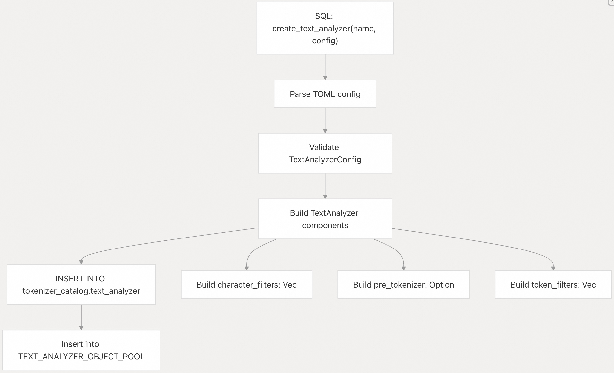
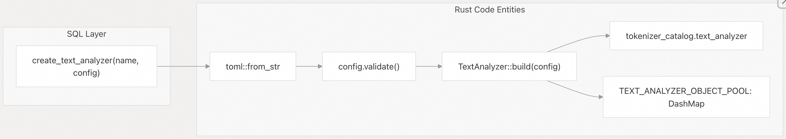
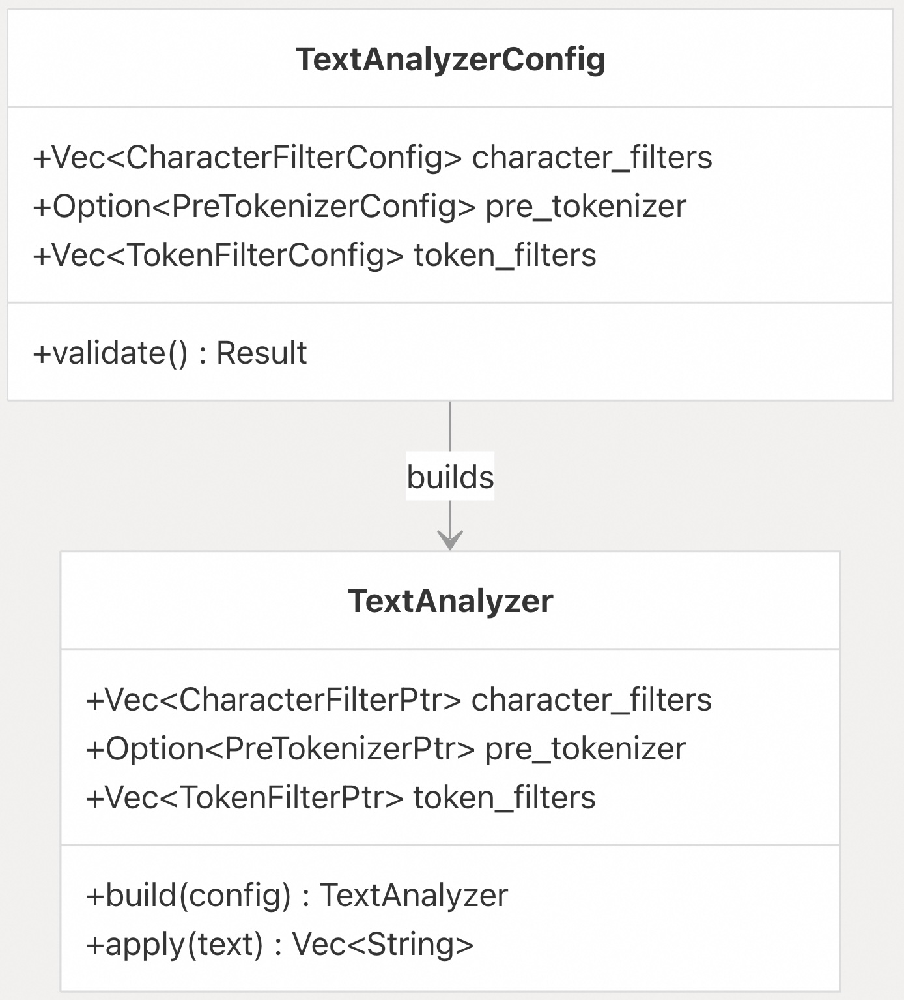
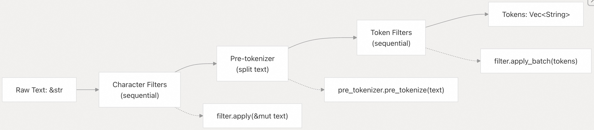
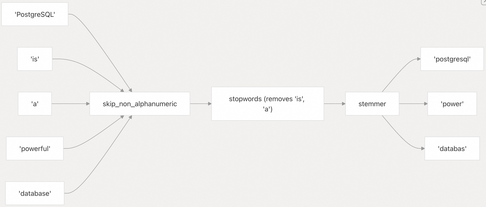
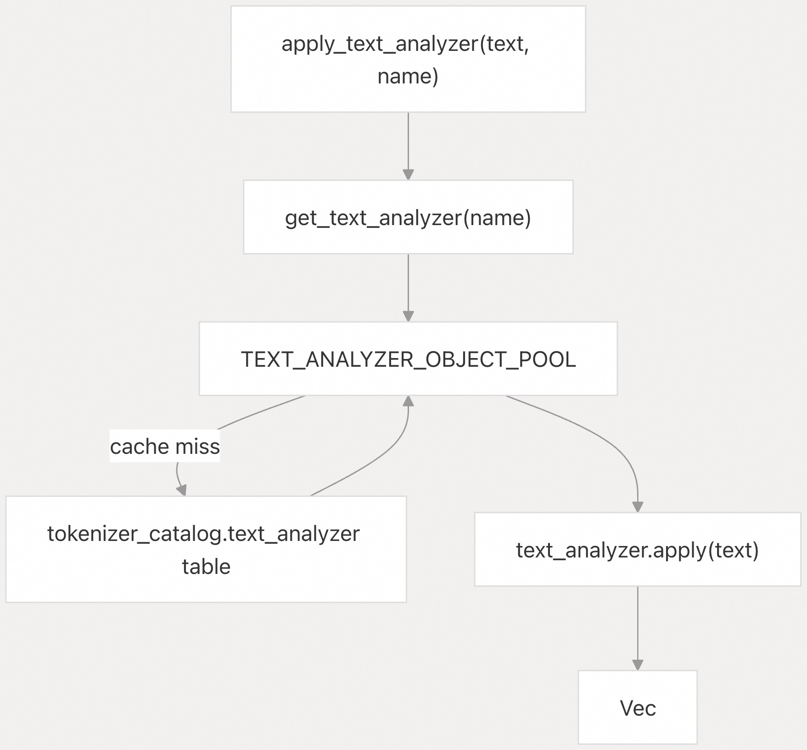
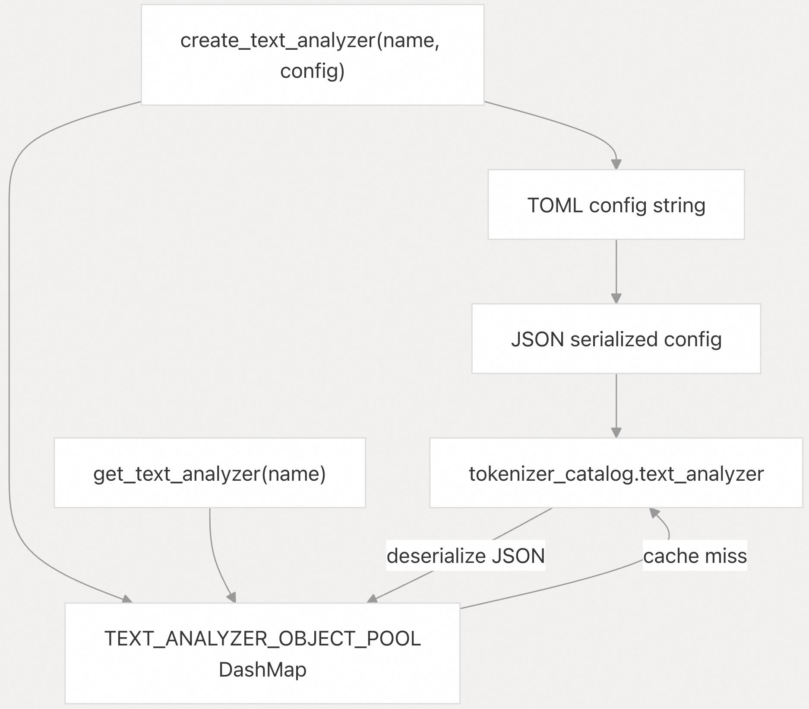

## pg_tokenizer 源码学习: 4.2 创建文本分析器 (`Creating Text Analyzers`)  
                                                                            
### 作者                                                                            
digoal                                                                            
                                                                            
### 日期                                                                            
2025-11-18                                                                           
                                                                            
### 标签                                                                            
pg\_tokenizer , 词化 , bert , 标记化 , Tokenization                                                                        
                                                                            
----                                                                            
                                                                            
## 背景                     
本文提供了关于在 `pg_tokenizer` 中创建和配置**文本分析器** (`text analyzer`) 的详细指南。**文本分析器**定义了一个处理**管道** (`pipeline`)，它通过一系列**字符过滤器** (`character filters`)、**预分词器** (`pre-tokenizers`) 和**分词过滤器** (`token filters`) 将原始文本转换为**词元** (`tokens`)。  
  
## 文本分析器创建流程 (`Text Analyzer Creation Process`)  
  
**文本分析器**是使用 `create_text_analyzer` **SQL 函数**创建的，该函数接受一个名称和一个 **TOML** 配置字符串。该函数会验证配置，构建分析器组件，将配置存储在 `tokenizer_catalog.text_analyzer` 表中，并将分析器对象**缓存** (`caches`) 到内存中。  
  
  
  
来源: [`src/text_analyzer.rs` 122-148](https://github.com/tensorchord/pg_tokenizer.rs/blob/d3f7a577/src/text_analyzer.rs#L122-L148)  
  
创建流程直接映射到 Rust 实现：  
  
  
  
来源: [`src/text_analyzer.rs` 122-148](https://github.com/tensorchord/pg_tokenizer.rs/blob/d3f7a577/src/text_analyzer.rs#L122-L148)  
  
## 配置结构 (`Configuration Structure`)  
  
**文本分析器**配置使用 **TOML** 格式，并映射到 `TextAnalyzerConfig` **结构体** (`struct`)。该配置包含三个可选的组件数组，它们按特定顺序进行处理：  
  
| 组件 (`Component`) | 类型 (`Type`) | 必需 (`Required`) | 描述 (`Description`) |  
| :--- | :--- | :--- | :--- |  
| `character_filters` (字符过滤器) | 数组 (`Array`) | 否 (`No`) | 最先应用，在**分词** (`tokenization`) 前修改文本 |  
| `pre_tokenizer` (预分词器) | 对象 (`Object`) | 否 (`No`) | 将文本拆分为初始**词元** (`tokens`) |  
| `token_filters` (分词过滤器) | 数组 (`Array`) | 否 (`No`) | 最后应用，过滤和转换**词元** |  
  
```toml  
# Optional: character filters applied in array order  
[[character_filters]]  
to_lowercase = {}  
  
[[character_filters]]  
unicode_normalization = "nfkd"  
  
# Optional: single pre-tokenizer  
pre_tokenizer = "unicode_segmentation"  
  
# Optional: token filters applied in array order  
[[token_filters]]  
skip_non_alphanumeric = {}  
  
[[token_filters]]  
stopwords = "nltk_english"  
```  
  
`TextAnalyzerConfig` **结构体**通过验证来强制执行此结构：  
  
  
  
来源: [`src/text_analyzer.rs` 17-26](https://github.com/tensorchord/pg_tokenizer.rs/blob/d3f7a577/src/text_analyzer.rs#L17-L26) [`src/text_analyzer.rs` 28-54](https://github.com/tensorchord/pg_tokenizer.rs/blob/d3f7a577/src/text_analyzer.rs#L28-L54)  
  
## 处理管道流程 (`Processing Pipeline Flow`)  
  
`TextAnalyzer::apply` **方法**以固定的顺序执行处理**管道** (`pipeline`)：  
  
  
  
来源: [`src/text_analyzer.rs` 56-77](https://github.com/tensorchord/pg_tokenizer.rs/blob/d3f7a577/src/text_analyzer.rs#L56-L77)  
  
## 字符过滤器 (`Character Filters`)  
  
**字符过滤器**在**分词**前修改输入文本。它们按照配置数组中指定的顺序依次应用。  
  
### 可用字符过滤器 (`Available Character Filters`)  
  
| 过滤器 (`Filter`) | 配置 (`Configuration`) | 目的 (`Purpose`) |  
| :--- | :--- | :--- |  
| `to_lowercase` | `to_lowercase = {}` | 将所有字符转换为小写 (`lowercase`) |  
| `unicode_normalization` | `unicode_normalization = "nfc"` | 规范化为 Unicode 形式 (`nfc`, `nfd`, `nfkc`, `nfkd`) |  
  
### 字符过滤器配置示例 (`Character Filter Configuration Example`)  
  
双括号语法 `[[character_filters]]` 将每个**过滤器**定义为一个单独的数组元素，确保它们按顺序执行。  
  
```sql  
SELECT tokenizer_catalog.create_text_analyzer('text_analyzer_cf', $$  
[[character_filters]]  
to_lowercase = {}  
  
[[character_filters]]  
unicode_normalization = "nfkd"  
$$);  
```  
  
来源: [`docs/05-text-analyzer.md` 9-14](https://github.com/tensorchord/pg_tokenizer.rs/blob/d3f7a577/docs/05-text-analyzer.md#L9-L14) [`docs/04-usage.md` 29-34](https://github.com/tensorchord/pg_tokenizer.rs/blob/d3f7a577/docs/04-usage.md#L29-L34)  
  
## 预分词器 (`Pre-tokenizers`)  
  
**预分词器**将（可能经过过滤的）文本拆分为初始**词元** (`tokens`)。每个**文本分析器**只能指定一个**预分词器**。  
  
### 可用预分词器 (`Available Pre-tokenizers`)  
  
| 预分词器 (`Pre-tokenizer`) | 配置 (`Configuration`) | 用例 (`Use Case`) |  
| :--- | :--- | :--- |  
| `unicode_segmentation` | `pre_tokenizer = "unicode_segmentation"` | 通用 Unicode 词边界 (`word boundaries`) |  
| `regex` | `[pre_tokenizer.regex]pattern = "..."invert = false` | 自定义**正则表达式** (`regex`) 分割 |  
| `jieba` | `[pre_tokenizer.jieba]mode = "full"` | 中文文本分词 (`Chinese text segmentation`) |  
  
### 预分词器配置示例 (`Pre-tokenizer Configuration Examples`)  
  
**Unicode 分割 (英语/西方语言):**  
  
```sql  
SELECT tokenizer_catalog.create_text_analyzer('analyzer_unicode', $$  
pre_tokenizer = "unicode_segmentation"  
$$);  
```  
  
**Jieba (中文):**  
  
```sql  
SELECT tokenizer_catalog.create_text_analyzer('analyzer_chinese', $$  
[pre_tokenizer.jieba]  
mode = "full"  # Options: full, precise, search  
hmm = true     # Enable HMM for unknown words  
$$);  
```  
  
**Jieba** **预分词器**支持三种模式：  
  
  * `full`：最大粒度，找出所有可能的词。  
  * `precise`：默认模式，尝试最精确地切分句子。  
  * `search`：针对搜索引擎，以良好的粒度切分句子以供搜索。  
  
来源: [`docs/05-text-analyzer.md` 16-22](https://github.com/tensorchord/pg_tokenizer.rs/blob/d3f7a577/docs/05-text-analyzer.md#L16-L22) [`tests/sqllogictest/chinese.slt` 12-14](https://github.com/tensorchord/pg_tokenizer.rs/blob/d3f7a577/tests/sqllogictest/chinese.slt#L12-L14) [`docs/03-examples.md` 98-101](https://github.com/tensorchord/pg_tokenizer.rs/blob/d3f7a577/docs/03-examples.md#L98-L101)  
  
## 分词过滤器 (`Token Filters`)  
  
**分词过滤器**处理由**预分词器**产生的**词元**数组。可以链式连接多个**分词过滤器**，它们按照指定的顺序执行。  
  
### 可用分词过滤器 (`Available Token Filters`)  
  
| 过滤器 (`Filter`) | 配置 (`Configuration`) | 目的 (`Purpose`) |  
| :--- | :--- | :--- |  
| `skip_non_alphanumeric` | `skip_non_alphanumeric = {}` | 移除不含**字母数字** (`alphanumeric`) 字符的**词元** |  
| `stopwords` | `stopwords = "nltk_english"` | 移除常用**停用词** (`stopwords`) |  
| `stemmer` | `stemmer = "english_porter2"` | 将词语简化为**词根** (`root form`) |  
| `synonym` | `synonym = "dict_name"` | 用**同义词** (`synonyms`) 替换**词元** |  
| `pg_dict` | `pg_dict = "dict_name"` | 使用 **PostgreSQL 字典** (`dictionary`) |  
| `n_gram` | `[token_filters.n_gram]min = 2max = 3` | 生成 **n-gram** |  
  
### 分词过滤器链式示例 (`Token Filter Chaining Example`)  
  
**分词过滤器**按顺序执行，每个**过滤器**接收前一个**过滤器**的输出：  
  
```sql  
SELECT tokenizer_catalog.create_text_analyzer('analyzer_english', $$  
pre_tokenizer = "unicode_segmentation"  
  
[[character_filters]]  
to_lowercase = {}  
  
[[token_filters]]  
skip_non_alphanumeric = {}  
  
[[token_filters]]  
stopwords = "nltk_english"  
  
[[token_filters]]  
stemmer = "english_porter2"  
$$);  
```  
  
该**管道** (`pipeline`)：  
  
1.  将文本转换为小写 (`lowercase`)  
2.  按 Unicode 词边界进行分割  
3.  移除非**字母数字** (`non-alphanumeric`) **词元**  
4.  移除英文**停用词** (`stopwords`)  
5.  使用 **Porter2** 算法对剩余**词元**进行**词干提取** (`Stems`)  
  
  
  
来源: [`docs/04-usage.md` 35-41](https://github.com/tensorchord/pg_tokenizer.rs/blob/d3f7a577/docs/04-usage.md#L35-L41) [`docs/05-text-analyzer.md` 24-32](https://github.com/tensorchord/pg_tokenizer.rs/blob/d3f7a577/docs/05-text-analyzer.md#L24-L32)  
  
## 用于停用词和同义词的自定义字典 (`Custom Dictionaries for Stopwords and Synonyms`)  
  
可以使用专用的 **SQL 函数**为**停用词** (`stopwords`) 和**同义词** (`synonym`) 过滤器创建**自定义字典** (`custom dictionaries`)：  
  
```sql  
-- Create custom stopword dictionary  
SELECT tokenizer_catalog.create_stopwords('custom_stops', $$  
it  
is  
an  
the  
$$);  
  
-- Use custom stopword dictionary  
SELECT tokenizer_catalog.create_text_analyzer('analyzer_custom_stops', $$  
pre_tokenizer = "unicode_segmentation"  
[[character_filters]]  
to_lowercase = {}  
[[token_filters]]  
stopwords = "custom_stops"  
$$);  
```  
  
```sql  
-- Create custom synonym dictionary  
SELECT tokenizer_catalog.create_synonym('db_synonyms', $$  
pgsql postgres postgresql  
index indices  
db database  
$$);  
  
-- Use custom synonym dictionary  
SELECT tokenizer_catalog.create_text_analyzer('analyzer_synonyms', $$  
pre_tokenizer = "unicode_segmentation"  
[[token_filters]]  
synonym = "db_synonyms"  
$$);  
```  
  
**同义词字典**中的每一行代表一组**同义词**，其中第一个词是**规范形式** (`canonical form`)，它将替换所有其他词。  
  
来源: [`docs/05-text-analyzer.md` 38-79](https://github.com/tensorchord/pg_tokenizer.rs/blob/d3f7a577/docs/05-text-analyzer.md#L38-L79)  
  
## 完整配置示例 (`Complete Configuration Examples`)  
  
### 英文文本处理 (`English Text Processing`)  
  
标准的英文文本处理**管道** (`pipeline`)，包括小写**规范化** (`normalization`)、Unicode **分割** (`splitting`)、**停用词移除** (`stopword removal`) 和**词干提取** (`stemming`)：  
  
```sql  
SELECT tokenizer_catalog.create_text_analyzer('text_analyzer_english', $$  
pre_tokenizer = "unicode_segmentation"  
  
[[character_filters]]  
to_lowercase = {}  
  
[[character_filters]]  
unicode_normalization = "nfkd"  
  
[[token_filters]]  
skip_non_alphanumeric = {}  
  
[[token_filters]]  
stopwords = "nltk_english"  
  
[[token_filters]]  
stemmer = "english_porter2"  
$$);  
```  
  
来源: [`docs/04-usage.md` 29-41](https://github.com/tensorchord/pg_tokenizer.rs/blob/d3f7a577/docs/04-usage.md#L29-L41) [`docs/03-examples.md` 51-63](https://github.com/tensorchord/pg_tokenizer.rs/blob/d3f7a577/docs/03-examples.md#L51-L63)  
  
### 中文文本处理 (`Chinese Text Processing`)  
  
使用 **Jieba** **分词** (`segmentation`) 的中文文本处理：  
  
```sql  
SELECT tokenizer_catalog.create_text_analyzer('text_analyzer_chinese', $$  
[pre_tokenizer.jieba]  
mode = "full"  
hmm = true  
$$);  
```  
  
这种最小配置足以处理中文文本，因为 **Jieba** 在内部处理了**分词**。可以添加额外的**分词过滤器**用于**停用词移除** (`stopword removal`) 或其他转换。  
  
来源: [`tests/sqllogictest/chinese.slt` 12-14](https://github.com/tensorchord/pg_tokenizer.rs/blob/d3f7a577/tests/sqllogictest/chinese.slt#L12-L14) [`docs/03-examples.md` 98-101](https://github.com/tensorchord/pg_tokenizer.rs/blob/d3f7a577/docs/03-examples.md#L98-L101)  
  
### 多语言管道 (`Multi-Language Pipeline`)  
  
具有多个**字符过滤器** (`character filters`) 和**分词过滤器** (`token filters`) 的复杂**管道** (`pipeline`)：  
  
```sql  
SELECT tokenizer_catalog.create_text_analyzer('text_analyzer_complex', $$  
[[character_filters]]  
unicode_normalization = "nfkc"  
  
[[character_filters]]  
to_lowercase = {}  
  
pre_tokenizer = "unicode_segmentation"  
  
[[token_filters]]  
skip_non_alphanumeric = {}  
  
[[token_filters]]  
synonym = "common_synonyms"  
  
[[token_filters]]  
stopwords = "nltk_english"  
  
[[token_filters]]  
stemmer = "english_porter2"  
  
[[token_filters]]  
[token_filters.n_gram]  
min = 2  
max = 3  
$$);  
```  
  
来源: [`docs/04-usage.md` 29-41](https://github.com/tensorchord/pg_tokenizer.rs/blob/d3f7a577/docs/04-usage.md#L29-L41)  
  
## 测试与验证 (`Testing and Validation`)  
  
`apply_text_analyzer` **函数**允许在不创建完整**分词器** (`tokenizer`) 的情况下测试**文本分析器** (`text analyzer`)：  
  
```sql  
-- Test the analyzer  
SELECT tokenizer_catalog.apply_text_analyzer(  
    'PostgreSQL is a powerful database system',  
    'text_analyzer_english'  
);  
-- Returns: {postgresql, powerful, database, system}  
```  
  
此**函数**直接映射到 `TextAnalyzer::apply` **方法**：  
  
  
  
来源: [`src/text_analyzer.rs` 169-173](https://github.com/tensorchord/pg_tokenizer.rs/blob/d3f7a577/src/text_analyzer.rs#L169-L173) [`src/text_analyzer.rs` 94-110](https://github.com/tensorchord/pg_tokenizer.rs/blob/d3f7a577/src/text_analyzer.rs#L94-L110)  
  
## 文本分析器管理 (`Text Analyzer Management`)  
  
### 列出文本分析器 (`Listing Text Analyzers`)  
  
查询 `tokenizer_catalog.text_analyzer` 表以查看所有已定义的**分析器** (`analyzers`)：  
  
```sql  
SELECT name, config FROM tokenizer_catalog.text_analyzer;  
```  
  
### 移除文本分析器 (`Dropping Text Analyzers`)  
  
使用 `drop_text_analyzer` 移除**文本分析器**：  
  
```sql  
SELECT tokenizer_catalog.drop_text_analyzer('text_analyzer_name');  
```  
  
这会将**分析器**从数据库表和内存**缓存** (`in-memory cache`) 中移除。  
  
来源: [`src/text_analyzer.rs` 150-167](https://github.com/tensorchord/pg_tokenizer.rs/blob/d3f7a577/src/text_analyzer.rs#L150-L167) [`src/text_analyzer.rs` 80-88](https://github.com/tensorchord/pg_tokenizer.rs/blob/d3f7a577/src/text_analyzer.rs#L80-L88)  
  
## 与分词器的集成 (`Integration with Tokenizers`)  
  
在创建**分词器** (`tokenizers`) 时，通过名称引用**文本分析器** (`text analyzers`)。分析器可以**内联** (`inline`) 指定，也可以通过**引用** (`reference`) 指定：  
  
**通过引用 (`By Reference`):**  
  
```sql  
-- Create analyzer first  
SELECT tokenizer_catalog.create_text_analyzer('my_analyzer', $$  
pre_tokenizer = "unicode_segmentation"  
$$);  
  
-- Reference in tokenizer  
SELECT tokenizer_catalog.create_tokenizer('my_tokenizer', $$  
text_analyzer = "my_analyzer"  
model = "llmlingua2"  
$$);  
```  
  
**内联 (`Inline`):**  
  
```sql  
-- Inline analyzer configuration in tokenizer  
SELECT tokenizer_catalog.create_tokenizer('my_tokenizer', $$  
pre_tokenizer = "unicode_segmentation"  
[[character_filters]]  
to_lowercase = {}  
model = "llmlingua2"  
$$);  
```  
  
**内联**方法方便用于简单配置，而**引用**方法允许在多个**分词器**中重用相同的**分析器**。  
  
来源: [`docs/04-usage.md` 96-135](https://github.com/tensorchord/pg_tokenizer.rs/blob/d3f7a577/docs/04-usage.md#L96-L135)  
  
## 配置持久化和缓存 (`Configuration Persistence and Caching`)  
  
**文本分析器**配置遵循**两层存储模型** (`two-tier storage model`)：  
  
  
  
1.  以 **TOML** 形式提供，方便用户  
2.  转换为 **JSON** 格式，用于数据库存储  
3.  作为编译后的 `TextAnalyzer` **对象**缓存到 `TEXT_ANALYZER_OBJECT_POOL` 中  
  
这确保了高效的运行时性能，同时保持了配置的灵活性。  
  
来源: [`src/text_analyzer.rs` 90-110](https://github.com/tensorchord/pg_tokenizer.rs/blob/d3f7a577/src/text_analyzer.rs#L90-L110) [`src/text_analyzer.rs` 122-148](https://github.com/tensorchord/pg_tokenizer.rs/blob/d3f7a577/src/text_analyzer.rs#L122-L148)  
  
            
#### [PolarDB 学习图谱](https://www.aliyun.com/database/openpolardb/activity "8642f60e04ed0c814bf9cb9677976bd4")
  
  
#### [PostgreSQL 解决方案集合](../201706/20170601_02.md "40cff096e9ed7122c512b35d8561d9c8")
  
  
#### [德哥 / digoal's Github - 公益是一辈子的事.](https://github.com/digoal/blog/blob/master/README.md "22709685feb7cab07d30f30387f0a9ae")
  
  
#### [About 德哥](https://github.com/digoal/blog/blob/master/me/readme.md "a37735981e7704886ffd590565582dd0")
  
  

  
