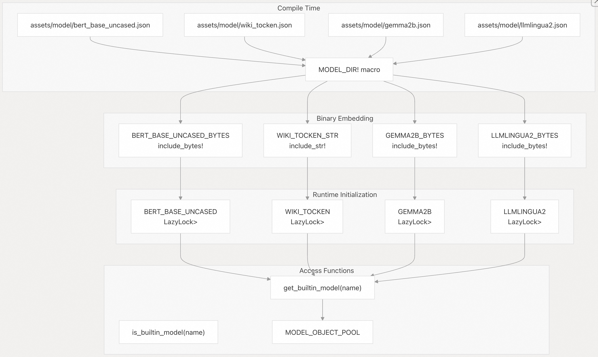
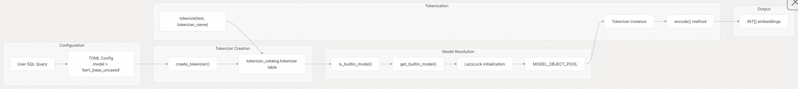
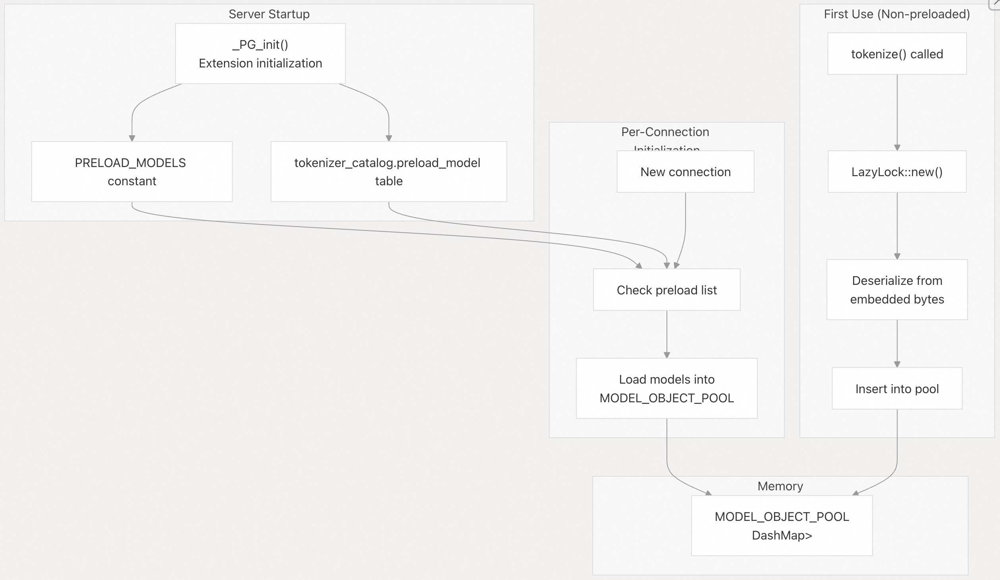
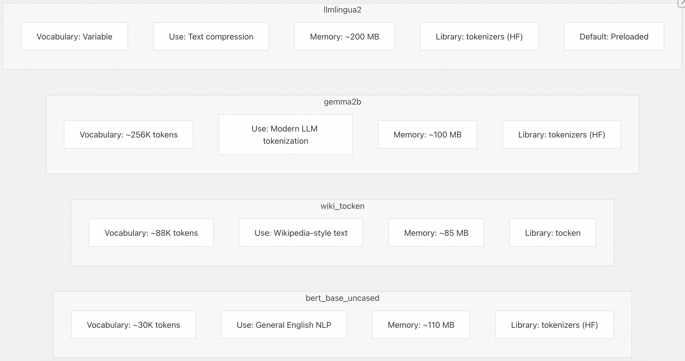

## pg_tokenizer 源码学习: 4.3 使用内建模型 (Built-in Models)  
                                                                              
### 作者                                                                              
digoal                                                                              
                                                                              
### 日期                                                                              
2025-11-18                                                                             
                                                                              
### 标签                                                                              
pg\_tokenizer , 词化 , bert , 标记化 , Tokenization                                                                          
                                                                              
----                                                                              
                                                                              
## 背景                       
本文涵盖了**预训练模型** (pre-trained models) 的使用，这些模型直接编译到 `pg_tokenizer` **扩展二进制文件** (extension binary) 中。这些模型无需任何导入或设置步骤即可立即使用，其中包括流行的**分词器** (tokenizers)，如 **BERT**、**Gemma**，以及用于**文本压缩** (text compression) 的专用模型。  
  
  
  
## 概述 (Overview)  
  
**内建模型** (Built-in Models) 是具有**固定词汇表** (fixed vocabularies) 的**预训练分词器** (pre-trained tokenizers)，它们在**编译时** (compile time) 嵌入到扩展中。它们以**静态字节数组** (static byte arrays) 的形式存储，并在首次使用时**延迟初始化** (lazily initialized)。这种设计提供了**零配置部署** (zero-configuration deployment)，但代价是增加了**二进制文件大小** (binary size)。  
  
**来源:** [`src/model/builtin.rs` 1-43](https://github.com/tensorchord/pg_tokenizer.rs/blob/d3f7a577/src/model/builtin.rs#L1-L43) [`docs/06-model.md` 7-15](https://github.com/tensorchord/pg_tokenizer.rs/blob/d3f7a577/docs/06-model.md#L7-L15)  
  
  
  
## 可用的内建模型 (Available Built-in Models)  
  
该扩展包含四个**内建模型** (built-in models)，每个模型服务于不同的用例：  
  
| 模型名称 (Model Name) | 来源 (Source) | 词汇表大小 (Vocabulary Size) | 主要用途 (Primary Use Case) | 底层库 (Underlying Library) |  
| :--- | :--- | :--- | :--- | :--- |  
| `bert_base_uncased` | [HuggingFace BERT](https://huggingface.co/google-bert/bert-base-uncased) | \~30,000 tokens | 通用英语**自然语言处理** (General English NLP)、**句子嵌入** (sentence embeddings) | `tokenizers` (HF) |  
| `wiki_tocken` | [WikiText-103 corpus](https://huggingface.co/datasets/iohadrubin/wikitext-103-raw-v1) | \~88,000 tokens | Wikipedia 风格的**文本处理** (text processing) | `tocken` |  
| `gemma2b` | [Google Gemma 2B](https://huggingface.co/google/gemma-2b) | \~256,000 tokens | 现代 **LLM** (**大型语言模型**) 分词 (tokenization) | `tokenizers` (HF) |  
| `llmlingua2` | [Microsoft LLMLingua-2](https://huggingface.co/microsoft/llmlingua-2-xlm-roberta-large-meetingbank) | 可变 (Variable) | **文本压缩** (Text compression)、**提示词优化** (prompt optimization) | `tokenizers` (HF) |  
  
**内存占用 (Memory Footprint):**  
  
  * `bert_base_uncased`: \~110 MB  
  * `gemma2b`: \~100 MB  
  * `llmlingua2`: \~200 MB (默认预加载)  
  * `wiki_tocken`: \~85 MB  
  
**来源:** [`src/model/builtin.rs` 11-23](https://github.com/tensorchord/pg_tokenizer.rs/blob/d3f7a577/src/model/builtin.rs#L11-L23) [`docs/06-model.md` 11-14](https://github.com/tensorchord/pg_tokenizer.rs/blob/d3f7a577/docs/06-model.md#L11-L14)  
  
  
  
## 模型存储架构 (Model Storage Architecture)  
  
  
  
**来源:** [`src/model/builtin.rs` 5-42](https://github.com/tensorchord/pg_tokenizer.rs/blob/d3f7a577/src/model/builtin.rs#L5-L42)  
  
  
  
## 基本用法 (Basic Usage)  
  
使用**内建模型** (built-in model) 需要两个步骤：创建一个引用该模型的分词器 (tokenizer)，然后调用 `tokenize()` 函数。  
  
### 步骤 1: 创建分词器 (Create a Tokenizer)  
  
通过在 **TOML 配置** (TOML configuration) 中指定模型名称来创建**分词器** (tokenizer)：  
  
```sql  
-- Using BERT  
SELECT tokenizer_catalog.create_tokenizer('my_bert_tokenizer', $$  
model = "bert_base_uncased"  
$$);  
  
-- Using Gemma  
SELECT tokenizer_catalog.create_tokenizer('my_gemma_tokenizer', $$  
model = "gemma2b"  
$$);  
  
-- Using LLMLingua-2  
SELECT tokenizer_catalog.create_tokenizer('my_compression_tokenizer', $$  
model = "llmlingua2"  
$$);  
  
-- Using WikiTocken  
SELECT tokenizer_catalog.create_tokenizer('my_wiki_tokenizer', $$  
model = "wiki_tocken"  
$$);  
```  
  
**来源:** [`tests/sqllogictest/builtin.slt` 5-22](https://github.com/tensorchord/pg_tokenizer.rs/blob/d3f7a577/tests/sqllogictest/builtin.slt#L5-L22)  
  
### 步骤 2: 对文本进行分词 (Tokenize Text)  
  
使用 `tokenize()` 函数将文本转换为**整数嵌入** (integer embeddings)：  
  
```sql  
SELECT tokenizer_catalog.tokenize(  
    'PostgreSQL is a powerful, open-source object-relational database system.',  
    'my_bert_tokenizer'  
);  
-- Returns: {2695,17603,2015,4160,2140,2003,1037,3928,1010,2330,1011,3120,...}  
  
SELECT tokenizer_catalog.tokenize(  
    'PostgreSQL is a powerful, open-source object-relational database system.',  
    'my_gemma_tokenizer'  
);  
-- Returns: {4738,107696,603,476,10276,235269,2174,235290,2757,4018,...}  
```  
  
每个模型根据其**词汇表** (vocabulary) 和**分词策略** (tokenization strategy) 生成不同的**词元 ID** (token IDs)。  
  
**来源:** [`tests/sqllogictest/builtin.slt` 24-42](https://github.com/tensorchord/pg_tokenizer.rs/blob/d3f7a577/tests/sqllogictest/builtin.slt#L24-L42)  
  
  
  
## 用法工作流程图 (Usage Workflow Diagram)  
  
  
  
**来源:** [`src/model/builtin.rs` 27-42](https://github.com/tensorchord/pg_tokenizer.rs/blob/d3f7a577/src/model/builtin.rs#L27-L42) [`tests/sqllogictest/builtin.slt` 1-43](https://github.com/tensorchord/pg_tokenizer.rs/blob/d3f7a577/tests/sqllogictest/builtin.slt#L1-L43)  
  
  
  
## 模型预加载 (Model Preloading)  
  
默认情况下，模型是按连接在首次使用时**延迟加载** (loaded lazily) 的。对于具有可预测延迟要求的生产部署，您可以在 **PostgreSQL 服务器启动** (server startup) 时预加载模型。  
  
### 默认预加载 (Default Preloading)  
  
`llmlingua2` 模型默认是**预加载** (preloaded) 的：  
  
**来源:** [`src/model/builtin.rs` 25](https://github.com/tensorchord/pg_tokenizer.rs/blob/d3f7a577/src/model/builtin.rs#L25-L25) [`docs/06-model.md` 229](https://github.com/tensorchord/pg_tokenizer.rs/blob/d3f7a577/docs/06-model.md#L229-L229)  
  
### 将模型添加到预加载列表 (Adding Models to Preload List)  
  
```sql  
-- Add a model to the preload list  
SELECT tokenizer_catalog.add_preload_model('bert_base_uncased');  
  
-- Restart PostgreSQL to apply changes  
-- Docker: sudo docker restart container_name  
-- Systemd: sudo systemctl restart postgresql.service  
```  
  
### 从预加载列表中移除模型 (Removing Models from Preload List)  
  
```sql  
-- Remove a model from preload list  
SELECT tokenizer_catalog.remove_preload_model('llmlingua2');  
  
-- Restart required  
```  
  
**来源:** [`docs/06-model.md` 218-231](https://github.com/tensorchord/pg_tokenizer.rs/blob/d3f7a577/docs/06-model.md#L218-L231)  
  
### 预加载系统架构 (Preloading System Architecture)  
  
  
  
**来源:** [`src/model/builtin.rs` 25](https://github.com/tensorchord/pg_tokenizer.rs/blob/d3f7a577/src/model/builtin.rs#L25-L25) [`docs/06-model.md` 218-231](https://github.com/tensorchord/pg_tokenizer.rs/blob/d3f7a577/docs/06-model.md#L218-L231)  
  
  
  
## 内存注意事项 (Memory Considerations)  
  
**内建模型** (Built-in Models) 在加载时会消耗大量内存。每个 **PostgreSQL 后端进程** (backend process) 都维护自己的 `MODEL_OBJECT_POOL`，因此内存使用量会随**连接数** (connection count) 扩展。  
  
### 内存使用量计算 (Memory Usage Calculation)  
  
```  
总内存 (Total Memory) = (连接数, Number of Connections) × (已加载模型的总和, Sum of Loaded Models)  
```  
  
示例场景：  
  
| 场景 (Scenario) | 连接数 (Connections) | 已加载模型 (Loaded Models) | 每个连接的内存 (Per-Connection Memory) | 总内存 (Total Memory) |  
| :--- | :--- | :--- | :--- | :--- |  
| 轻负载 (Light load) | 10 | llmlingua2 | 200 MB | 2 GB |  
| 中负载 (Medium load) | 50 | llmlingua2 + bert | 310 MB | 15.5 GB |  
| 重负载 (Heavy load) | 100 | 全部 4 个模型 | 495 MB | 49.5 GB |  
  
**建议 (Recommendations):**  
  
1.  仅**预加载** (preload) 经常使用的模型  
2.  使用 `pg_stat_activity` 和系统工具监控内存使用情况  
3.  考虑使用**连接池** (e.g., PgBouncer) 来限制后端数量  
4.  使用**自定义模型** (custom models) 进行领域特定**词汇表** (vocabularies) (内存占用较小)  
  
**来源:** [`docs/06-model.md` 231](https://github.com/tensorchord/pg_tokenizer.rs/blob/d3f7a577/docs/06-model.md#L231-L231)  
  
  
  
## 模型特性比较 (Model Characteristics Comparison)  
  
  
  
**来源:** [`src/model/builtin.rs` 11-23](https://github.com/tensorchord/pg_tokenizer.rs/blob/d3f7a577/src/model/builtin.rs#L11-L23) [`docs/06-model.md` 11-14](https://github.com/tensorchord/pg_tokenizer.rs/blob/d3f7a577/docs/06-model.md#L11-L14)  
  
  
  
## 与文本分析器的集成 (Integration with Text Analyzers)  
  
**内建模型** (Built-in Models) 可以与**文本分析器** (Text Analyzers) 结合用于**预处理** (preprocessing)：  
  
```  
-- Create analyzer with preprocessing  
SELECT tokenizer_catalog.create_text_analyzer('preprocess_analyzer', $$  
pre_tokenizer = "unicode_segmentation"  
[[character_filters]]  
to_lowercase = {}  
[[character_filters]]  
unicode_normalization = "nfkd"  
$$);  
  
-- Create tokenizer using built-in model and analyzer  
SELECT tokenizer_catalog.create_tokenizer('advanced_bert', $$  
text_analyzer = "preprocess_analyzer"  
model = "bert_base_uncased"  
$$);  
  
-- Tokenize with preprocessing  
SELECT tokenizer_catalog.tokenize(  
    'HELLO WORLD',  
    'advanced_bert'  
);  
```  
  
文本流经：**字符过滤器** (Character Filters) → **预分词器** (Pre-tokenizer) → **内建模型** (Built-in Model) → **词元过滤器** (Token Filters) → **嵌入** (Embeddings)。  
  
**来源:** [`docs/06-model.md` 1-6](https://github.com/tensorchord/pg_tokenizer.rs/blob/d3f7a577/docs/06-model.md#L1-L6)  
  
  
  
## 限制与注意事项 (Limitations and Caveats)  
  
### 缓存行为 (Cache Behavior)  
  
**内建模型** (Built-in Models) 在每个连接中缓存在 `MODEL_OBJECT_POOL` 中。该**缓存** (cache) 不遵循**事务隔离级别** (transaction isolation levels)：  
  
```sql  
BEGIN;  
SELECT tokenizer_catalog.create_tokenizer('temp_tokenizer', $$  
model = "bert_base_uncased"  
$$);  
-- Model is loaded and cached  
ROLLBACK;  
-- Model remains cached in current connection  
-- Not visible in other connections  
```  
  
要清除缓存的模型，请重新连接到数据库或显式**删除** (drop) 分词器 (tokenizer)。  
  
**来源:** [`docs/07-limitation.md` 1-21](https://github.com/tensorchord/pg_tokenizer.rs/blob/d3f7a577/docs/07-limitation.md#L1-L21)  
  
### 二进制文件大小 (Binary Size)  
  
每个**内建模型** (built-in model) 都会增加**扩展的二进制文件大小** (extension's binary size)：  
  
  * 基础扩展 (Base extension): \~5 MB  
  * 包含所有 4 个模型 (With all 4 models): \~50 MB  
  
这会影响部署**工件大小** (deployment artifact size)，但不影响运行时**性能** (runtime performance)。  
  
**来源:** [`src/model/builtin.rs` 11-23](https://github.com/tensorchord/pg_tokenizer.rs/blob/d3f7a577/src/model/builtin.rs#L11-L23)  
  
  
  
## 代码实现参考 (Code Implementation Reference)  
  
### 关键函数 (Key Functions)  
  
| 函数 (Function) | 位置 (Location) | 目的 (Purpose) |  
| :--- | :--- | :--- |  
| `is_builtin_model()` | [`src/model/builtin.rs` 27-32](https://github.com/tensorchord/pg_tokenizer.rs/blob/d3f7a577/src/model/builtin.rs#L27-L32) | 检查名称是否为**内建模型** (built-in model) |  
| `get_builtin_model()` | [`src/model/builtin.rs` 34-42](https://github.com/tensorchord/pg_tokenizer.rs/blob/d3f7a577/src/model/builtin.rs#L34-L42) | 按名称检索**模型实例** (model instance) |  
| `PRELOAD_MODELS` | [`src/model/builtin.rs` 25](https://github.com/tensorchord/pg_tokenizer.rs/blob/d3f7a577/src/model/builtin.rs#L25-L25) | 启动时**预加载** (preload) 的模型列表 |  
  
### 静态模型定义 (Static Model Definitions)  
  
所有模型都定义为 `LazyLock<Arc<Tokenizer>>` 静态变量：  
  
  * [`src/model/builtin.rs` 13-14](https://github.com/tensorchord/pg_tokenizer.rs/blob/d3f7a577/src/model/builtin.rs#L13-L14) - `BERT_BASE_UNCASED`  
  * [`src/model/builtin.rs` 16-17](https://github.com/tensorchord/pg_tokenizer.rs/blob/d3f7a577/src/model/builtin.rs#L16-L17) - `WIKI_TOCKEN`  
  * [`src/model/builtin.rs` 19-20](https://github.com/tensorchord/pg_tokenizer.rs/blob/d3f7a577/src/model/builtin.rs#L19-L20) - `GEMMA2B`  
  * [`src/model/builtin.rs` 22-23](https://github.com/tensorchord/pg_tokenizer.rs/blob/d3f7a577/src/model/builtin.rs#L22-L23) - `LLMLINGUA2`  
  
**来源:** [`src/model/builtin.rs` 1-43](https://github.com/tensorchord/pg_tokenizer.rs/blob/d3f7a577/src/model/builtin.rs#L1-L43)  
  
    
#### [PolarDB 学习图谱](https://www.aliyun.com/database/openpolardb/activity "8642f60e04ed0c814bf9cb9677976bd4")
  
  
#### [PostgreSQL 解决方案集合](../201706/20170601_02.md "40cff096e9ed7122c512b35d8561d9c8")
  
  
#### [德哥 / digoal's Github - 公益是一辈子的事.](https://github.com/digoal/blog/blob/master/README.md "22709685feb7cab07d30f30387f0a9ae")
  
  
#### [About 德哥](https://github.com/digoal/blog/blob/master/me/readme.md "a37735981e7704886ffd590565582dd0")
  
  

  
