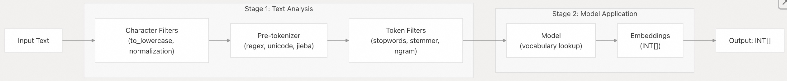
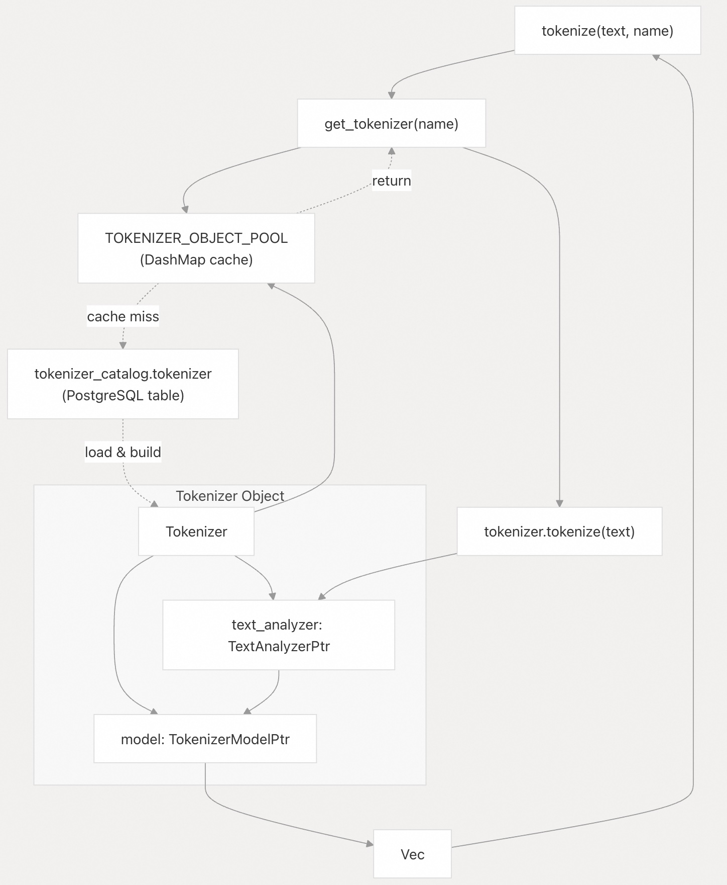
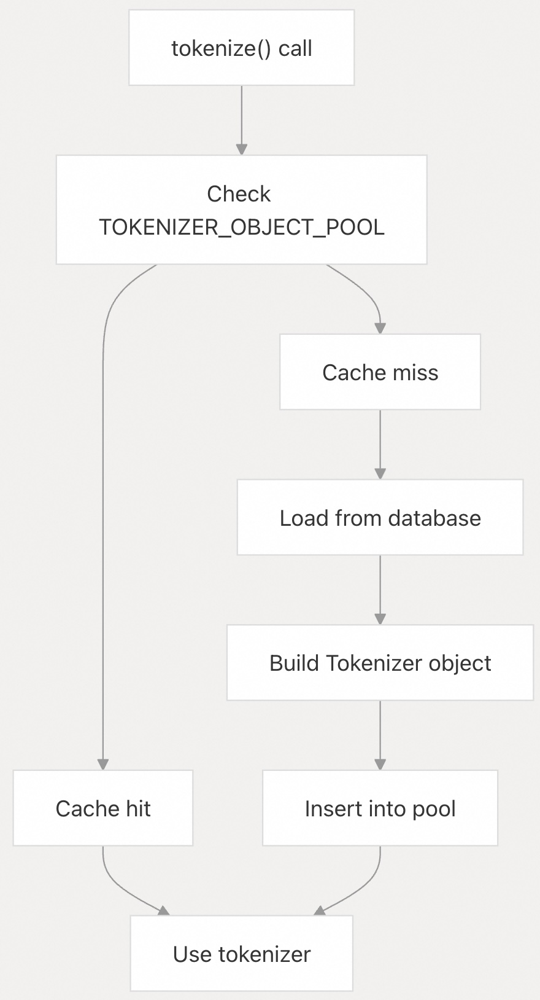

## pg_tokenizer 源码学习: 4.4 基础分词（Basic Tokenization）   
                                                                                
### 作者                                                                                
digoal                                                                                
                                                                                
### 日期                                                                                
2025-11-18                                                                               
                                                                                
### 标签                                                                                
pg\_tokenizer , 词化 , bert , 标记化 , Tokenization                                                                            
                                                                                
----                                                                                
                                                                                
## 背景                         
本文解释了如何使用 `tokenize()` 函数将文本转换为整数嵌入（integer embeddings）。该函数应用配置好的**文本处理管道**（text processing pipeline）（包括**字符过滤器** character filters、**预分词器** pre-tokenizer、**标记过滤器** token filters），然后使用**模型**（model）生成文本的数值表示，这些数值可以存储并在 **PostgreSQL** 中进行查询。  
  
## `tokenize()` 函数（The tokenize() Function）  
  
分词的主要入口点是 **SQL** 函数 `tokenize()`，它接受两个参数：  
  
| 参数（Parameter） | 类型（Type） | 描述（Description） |  
| :--- | :--- | :--- |  
| `text` | TEXT | 要进行分词的输入文本（input text） |  
| `tokenizer_name` | TEXT | 事先创建的分词器（tokenizer）名称 |  
  
**返回类型（Return Type）**: `INT[]` - 表示标记嵌入（token embeddings）的整数数组。  
  
**函数属性（Function Properties）**:  
  
  * **稳定（Stable）**: 对于相同的输入，产生相同的输出  
  * **并行安全（Parallel Safe）**: 可用于并行查询执行  
  
来源: [`src/tokenizer.rs` 169-176](https://github.com/tensorchord/pg_tokenizer.rs/blob/d3f7a577/src/tokenizer.rs#L169-L176)  
  
## 分词工作原理（How Tokenization Works）  
  
分词过程遵循一个两阶段管道（two-stage pipeline）：  
  
  
  
**分词流程（Tokenization Flow）**  
  
1.  **文本分析（Text Analysis）** (`text_analyzer.apply(text)`): 将原始文本转换为一系列标记字符串（token strings）。  
      * **字符过滤器**（Character filters）对输入文本进行规范化（normalize）。  
      * **预分词器**（Pre-tokenizer）将文本拆分成初始标记（initial tokens）。  
      * **标记过滤器**（Token filters）精炼标记列表。  
2.  **模型应用（Model Application）** (`model.apply_batch(tokens)`): 将标记字符串转换为整数嵌入（integer embeddings）。  
      * 在模型的**词汇表**（vocabulary）中查找每个标记。  
      * 标记被转换为其对应的整数 ID。  
      * 结果是一个整数数组。  
  
来源: [`src/tokenizer.rs` 73-76](https://github.com/tensorchord/pg_tokenizer.rs/blob/d3f7a577/src/tokenizer.rs#L73-L76) [`src/tokenizer.rs` 169-176](https://github.com/tensorchord/pg_tokenizer.rs/blob/d3f7a577/src/tokenizer.rs#L169-L176)  
  
## 创建分词器（Creating a Tokenizer）  
  
在使用 `tokenize()` 之前，您必须使用 `create_tokenizer()` 创建一个命名分词器：  
  
```sql  
-- Create a tokenizer with a built-in model  
SELECT create_tokenizer('my_tokenizer', $$  
model = "bert_base_uncased"  
pre_tokenizer.regex = '(?u)\b\w\w+\b'  
$$);  
```  
  
分词器配置指定了以下内容：  
  
  * **model**: 用于将标记转换为嵌入（embeddings）的**模型**（必需）  
  * **text\_analyzer**: 一个命名**文本分析器**，或者**内联配置**（inline configuration）  
  * **character\_filters**: 字符级别转换（可选）  
  * **pre\_tokenizer**: 如何将文本拆分成初始标记（可选）  
  * **token\_filters**: 如何精炼标记列表（可选）  
  
来源: [`src/tokenizer.rs` 16-46](https://github.com/tensorchord/pg_tokenizer.rs/blob/d3f7a577/src/tokenizer.rs#L16-L46) [`src/tokenizer.rs` 121-147](https://github.com/tensorchord/pg_tokenizer.rs/blob/d3f7a577/src/tokenizer.rs#L121-L147)  
  
## 基本使用示例（Basic Usage Examples）  
  
### 示例 1: 简单分词（Simple Tokenization）  
  
```sql  
-- Create a basic tokenizer  
SELECT create_tokenizer('simple_tokenizer', $$  
model = "llmlingua2"  
$$);  
  
-- Tokenize text  
SELECT tokenize(  
    'PostgreSQL is a powerful database system.',  
    'simple_tokenizer'  
);  
-- Result: {2695, 17603, 2015, 4160, ...}  
```  
  
### 示例 2: 带文本处理的分词（Tokenization with Text Processing）  
  
```sql  
-- Create a tokenizer with text processing pipeline  
SELECT create_tokenizer('processed_tokenizer', $$  
model = "bert_base_uncased"  
pre_tokenizer.regex = '(?u)\b\w\w+\b'  
  
[[character_filters]]  
to_lowercase = {}  
  
[[token_filters]]  
stopwords = "nltk_english"  
  
[[token_filters]]  
stemmer = "english_porter2"  
$$);  
  
-- Tokenize with processing  
SELECT tokenize(  
    'PostgreSQL is a powerful, open-source object-relational database system.',  
    'processed_tokenizer'  
);  
-- Result: {2695, 17603, 2015, 4160, 2140, 2373, ...}  
```  
  
### 示例 3: 使用外部文本分析器（Using an External Text Analyzer）  
  
```sql  
-- Create a text analyzer  
SELECT create_text_analyzer('my_analyzer', $$  
pre_tokenizer = "unicode_segmentation"  
[[character_filters]]  
to_lowercase = {}  
[[token_filters]]  
stopwords = "nltk_english"  
$$);  
  
-- Create a tokenizer that uses the analyzer  
SELECT create_tokenizer('analyzer_tokenizer', $$  
model = "bert_base_uncased"  
text_analyzer = "my_analyzer"  
$$);  
  
-- Tokenize  
SELECT tokenize('Sample text here', 'analyzer_tokenizer');  
```  
  
来源: [`README.md` 38-44](https://github.com/tensorchord/pg_tokenizer.rs/blob/d3f7a577/README.md#L38-L44) [`tests/sqllogictest/tokenizer.slt` 5-19](https://github.com/tensorchord/pg_tokenizer.rs/blob/d3f7a577/tests/sqllogictest/tokenizer.slt#L5-L19)  
  
## 分词器架构（Tokenizer Architecture）  
  
  
  
分词器检索和执行流程：  
  
1.  **函数调用（Function Call）**: 使用文本和分词器名称调用 `tokenize()`  
2.  **缓存查找（Cache Lookup）**: `get_tokenizer()` 检查 `TOKENIZER_OBJECT_POOL`（内存缓存）  
3.  **数据库加载（Database Load）**: 缓存未命中时，从 `tokenizer_catalog.tokenizer` 加载分词器配置  
4.  **对象构建（Object Build）**: 使用**文本分析器**和**模型**引用构建分词器对象  
5.  **执行（Execution）**: `tokenizer.tokenize()` 应用**文本分析器**，然后应用**模型**  
6.  **返回（Return）**: 整数嵌入（Integer embeddings）返回给调用者  
  
来源: [`src/tokenizer.rs` 93-109](https://github.com/tensorchord/pg_tokenizer.rs/blob/d3f7a577/src/tokenizer.rs#L93-L109) [`src/tokenizer.rs` 111-119](https://github.com/tensorchord/pg_tokenizer.rs/blob/d3f7a577/src/tokenizer.rs#L111-L119)  
  
## 配置选项（Configuration Options）  
  
### 模型选择（Model Selection）  
  
`model` 字段是必需的，它决定了用于分词的**词汇表**（vocabulary）：  
  
| 模型类型（Model Type） | 示例（Example） | 用例（Use Case） |  
| :--- | :--- | :--- |  
| **内置**（Built-in） | `"llmlingua2"`, `"bert_base_uncased"` | 预训练（Pre-trained），即刻使用 |  
| **自定义**（Custom） | 自定义模型名称 | 特定于语料库（Corpus-specific）的**词汇表** |  
| **HuggingFace** | **HF** 模型名称 | 来自 **HuggingFace** 的标准分词器 |  
| **Lindera** | **Lindera** 模型名称 | 日语文本处理 |  
  
### 文本分析器选项（Text Analyzer Options）  
  
您可以引用现有**文本分析器**，或进行内联配置：  
  
**选项 1: 引用现有分析器（Reference existing analyzer）**  
  
```  
model = "bert_base_uncased"  
text_analyzer = "my_analyzer"  
```  
  
**选项 2: 内联配置（Inline configuration）**  
  
```  
model = "bert_base_uncased"  
pre_tokenizer.regex = '(?u)\b\w\w+\b'  
[[character_filters]]  
to_lowercase = {}  
[[token_filters]]  
stopwords = "nltk_english"  
```  
  
**验证（Validation）**: 您不能同时定义 `text_analyzer` 和内联选项（`character_filters`, `pre_tokenizer`, `token_filters`）——此类配置将被拒绝。  
  
来源: [`src/tokenizer.rs` 31-45](https://github.com/tensorchord/pg_tokenizer.rs/blob/d3f7a577/src/tokenizer.rs#L31-L45)  
  
## 理解输出（Understanding the Output）  
  
`tokenize()` 函数返回 `INT[]`，这是一个整数数组，其中：  
  
  * **每个整数**代表**模型**词汇表中的一个**标记**（token）。  
  * **整数值**是**词汇表索引**（通常为 0 到 `vocabulary_size - 1`）。  
  * **数组顺序**对应于文本处理后的标记序列。  
  * **数组长度**根据输入文本和处理管道而变化。  
  
### 输出示例解读（Example Output Interpretation）  
  
```sql  
SELECT tokenize('open-source database', 'my_tokenizer');  
-- Result: {2140, 2373, 22083}  
--          ^^^^  ^^^^  ^^^^^  
--           |     |      |  
--      "open" "source" "database"  
```  
  
这些整数可以：  
  
  * 存储在数据库列中供以后检索  
  * 用于索引系统（例如 **BM25 排名**）  
  * 进行相似性搜索（similarity searches）比较  
  * 用于分析聚合（Aggregated for analytics）  
  
来源: [`src/tokenizer.rs` 169-176](https://github.com/tensorchord/pg_tokenizer.rs/blob/d3f7a577/src/tokenizer.rs#L169-L176) [`tests/sqllogictest/tokenizer.slt` 16-19](https://github.com/tensorchord/pg_tokenizer.rs/blob/d3f7a577/tests/sqllogictest/tokenizer.slt#L16-L19)  
  
## 管理分词器（Managing Tokenizers）  
  
### 列出分词器（Listing Tokenizers）  
  
```sql  
-- View all tokenizers  
SELECT name, config   
FROM tokenizer_catalog.tokenizer;  
```  
  
### 删除分词器（Dropping Tokenizers）  
  
```sql  
-- Remove a tokenizer  
SELECT drop_tokenizer('my_tokenizer');  
```  
  
`drop_tokenizer()` 函数：  
  
  * 从 `tokenizer_catalog.tokenizer` 表中移除条目。  
  * 从 `TOKENIZER_OBJECT_POOL` 缓存中移除对象。  
  * 如果分词器不存在，则发出警告（不会失败）。  
  
来源: [`src/tokenizer.rs` 149-166](https://github.com/tensorchord/pg_tokenizer.rs/blob/d3f7a577/src/tokenizer.rs#L149-L166) [`src/tokenizer.rs` 83-91](https://github.com/tensorchord/pg_tokenizer.rs/blob/d3f7a577/src/tokenizer.rs#L83-L91)  
  
## 性能考量（Performance Considerations）  
  
### 缓存行为（Caching Behavior）  
  
  
  
| 场景（Scenario） | 性能（Performance） | 说明（Notes） |  
| :--- | :--- | :--- |  
| 首次调用分词器 | 较慢（Slower） | 从数据库加载，构建对象 |  
| 后续调用 | 快速（Fast） | 从内存缓存（in-memory cache）检索 |  
| 并行查询 | 安全（Safe） | DashMap 提供**线程安全**（thread-safe）访问 |  
| 多个会话 | 共享缓存（Shared cache） | 所有会话共享同一对象池 |  
  
**优化提示（Optimization Tips）**:  
  
1.  **重用分词器**（Reuse tokenizers）- 创建一次，多次使用。  
2.  **预加载**（Preload）常用分词器 - 在启动期间访问它们一次（参见 Model Preloading 章节）。  
3.  **避免重复创建** - 不要频繁删除和重新创建分词器。  
4.  **并行执行** - 该函数被标记为 `parallel_safe`。  
  
来源: [`src/tokenizer.rs` 79-81](https://github.com/tensorchord/pg_tokenizer.rs/blob/d3f7a577/src/tokenizer.rs#L79-L81) [`src/tokenizer.rs` 93-109](https://github.com/tensorchord/pg_tokenizer.rs/blob/d3f7a577/src/tokenizer.rs#L93-L109) [`src/tokenizer.rs` 168](https://github.com/tensorchord/pg_tokenizer.rs/blob/d3f7a577/src/tokenizer.rs#L168-L168)  
  
## 错误处理（Error Handling）  
  
使用 `tokenize()` 时的常见错误：  
  
### 未找到分词器（Tokenizer Not Found）  
  
```sql  
SELECT tokenize('text', 'nonexistent');  
-- ERROR: Tokenizer not found: nonexistent  
```  
  
**解决方案**: 确保分词器已存在（先创建），或检查 `tokenizer_catalog.tokenizer`。  
  
### 配置无效（Invalid Configuration）  
  
```sql  
SELECT create_tokenizer('bad', $$  
model = "bert_base_uncased"  
text_analyzer = "my_analyzer"  
pre_tokenizer = "unicode_segmentation"  
$$);  
-- ERROR: cannot define both text_analyzer and inlined text_analyzer options  
```  
  
**解决方案**: 使用 `text_analyzer` 引用 **或** 内联配置，不能两者都用。  
  
### 未找到模型（Model Not Found）  
  
```sql  
SELECT create_tokenizer('bad_model', $$  
model = "nonexistent_model"  
$$);  
-- ERROR: Model not found: nonexistent_model  
```  
  
**解决方案**: 验证模型是否存在于 `tokenizer_catalog.model` 中，或使用**内置模型**名称。  
  
来源: [`src/tokenizer.rs` 106](https://github.com/tensorchord/pg_tokenizer.rs/blob/d3f7a577/src/tokenizer.rs#L106-L106) [`src/tokenizer.rs` 38-44](https://github.com/tensorchord/pg_tokenizer.rs/blob/d3f7a577/src/tokenizer.rs#L38-L44)  
  
## 完整示例（Complete Example）  
  
以下是展示分词器创建和使用的完整工作流程：  
  
```sql  
-- Step 1: Create the extension (if not already created)  
CREATE EXTENSION IF NOT EXISTS pg_tokenizer;  
  
-- Step 2: Create a tokenizer with comprehensive configuration  
SELECT create_tokenizer('production_tokenizer', $$  
model = "bert_base_uncased"  
pre_tokenizer.regex = '(?u)\b\w\w+\b'  
  
[[character_filters]]  
to_lowercase = {}  
  
[[token_filters]]  
stopwords = "nltk_english"  
  
[[token_filters]]  
stemmer = "english_porter2"  
$$);  
  
-- Step 3: Tokenize sample text  
SELECT tokenize(  
    'PostgreSQL is a powerful, open-source object-relational database system.   
     It has over 15 years of active development.',  
    'production_tokenizer'  
);  
-- Result: {2695,17603,2015,4160,2140,2373,2330,14768,2278,4874,2128,20051,2951,22083,2291,2321,2095,2552,12848,4503}  
  
-- Step 4: Store tokenized results in a table  
CREATE TABLE documents (  
    id SERIAL PRIMARY KEY,  
    content TEXT,  
    tokens INT[]  
);  
  
INSERT INTO documents (content, tokens)  
VALUES (  
    'Sample document text',  
    tokenize('Sample document text', 'production_tokenizer')  
);  
  
-- Step 5: Query the tokenized data  
SELECT id, content, array_length(tokens, 1) as token_count  
FROM documents;  
```  
  
来源: [`README.md` 38-44](https://github.com/tensorchord/pg_tokenizer.rs/blob/d3f7a577/README.md#L38-L44) [`tests/sqllogictest/tokenizer.slt` 1-20](https://github.com/tensorchord/pg_tokenizer.rs/blob/d3f7a577/tests/sqllogictest/tokenizer.slt#L1-L20)  
      
#### [PolarDB 学习图谱](https://www.aliyun.com/database/openpolardb/activity "8642f60e04ed0c814bf9cb9677976bd4")
  
  
#### [PostgreSQL 解决方案集合](../201706/20170601_02.md "40cff096e9ed7122c512b35d8561d9c8")
  
  
#### [德哥 / digoal's Github - 公益是一辈子的事.](https://github.com/digoal/blog/blob/master/README.md "22709685feb7cab07d30f30387f0a9ae")
  
  
#### [About 德哥](https://github.com/digoal/blog/blob/master/me/readme.md "a37735981e7704886ffd590565582dd0")
  
  

  
