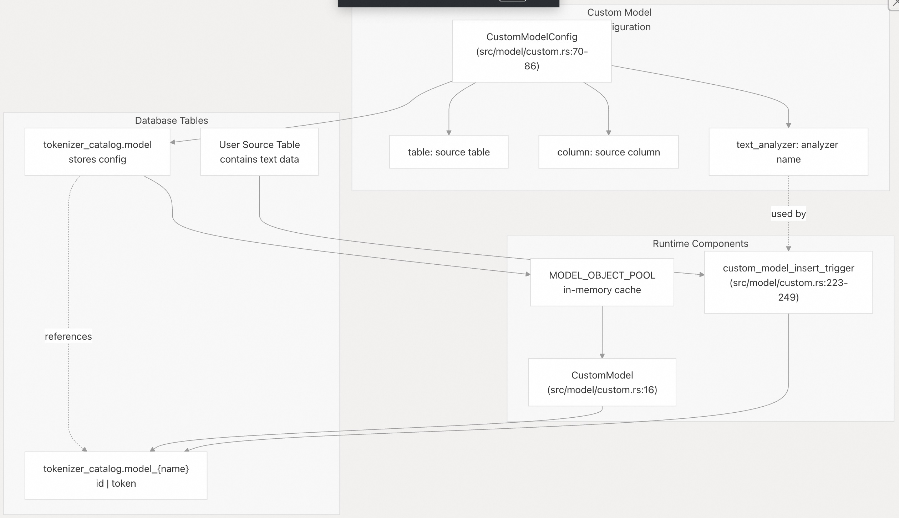
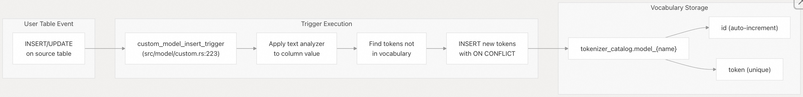
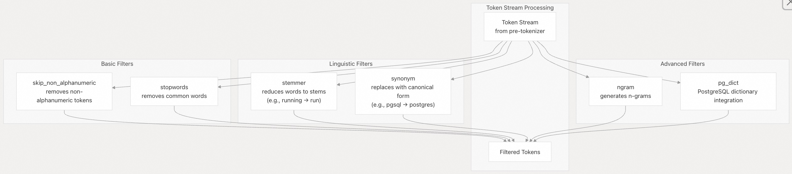

## pg_tokenizer 源码学习: 5 进阶功能 (Advanced Features)   
                                                                                  
### 作者                                                                                  
digoal                                                                                  
                                                                                  
### 日期                                                                                  
2025-11-18                                                                                 
                                                                                  
### 标签                                                                                  
pg\_tokenizer , 词化 , bert , 标记化 , Tokenization                                                                              
                                                                                  
----                                                                                  
                                                                                  
## 背景                           
本文介绍了 `pg_tokenizer` 的**进阶功能 (Advanced Capabilities)**，这些功能可实现复杂的**文本处理工作流 (Text Processing Workflows)**。这些功能包括：从您自己的**语料库 (Corpus)** 构建**自定义词汇模型 (Custom Vocabulary Models)**、通过数据库**触发器 (Triggers)** 自动化**嵌入 (Embedding)** 生成、应用专用的**词元过滤器 (Token Filters)** 进行**文本规范化 (Text Normalization)**，以及通过**模型预加载 (Model Preloading)** 优化性能。  
  
## 自定义模型 (Custom Models)  
  
**自定义模型 (Custom Models)** 允许您从自己的**数据语料库 (Data Corpus)** 中动态构建特定领域 (**Domain-Specific**) 的**词汇表 (Vocabularies)**。与具有固定词汇表的**预训练模型 (Pre-trained Models)** 不同，自定义模型维护自己的**词元-ID 映射 (Token-to-ID Mappings)**，并随着数据集中遇到**新词元 (New Tokens)** 而自动增长。  
  
### 架构 (Architecture)  
  
**自定义模型 (Custom Models)** 是通过 [`src/model/custom.rs` 15-26](https://github.com/tensorchord/pg_tokenizer.rs/blob/d3f7a577/src/model/custom.rs#L15-L26) 中的 `CustomModel` **结构体 (Struct)** 实现的，它们将**词汇表 (Vocabulary)** 存储在 `tokenizer_catalog` **模式 (Schema)** 内专用的 **PostgreSQL 表**中。每个自定义模型都会创建一个名为 `model_{name}` 的表，该表具有一个自动递增的 `id` **列 (Column)** 和一个唯一的 `token` **列 (Column)**。  
  
  
  
**来源 (Sources):** [`src/model/custom.rs` 15-26](https://github.com/tensorchord/pg_tokenizer.rs/blob/d3f7a577/src/model/custom.rs#L15-L26) [`src/model/custom.rs` 70-86](https://github.com/tensorchord/pg_tokenizer.rs/blob/d3f7a577/src/model/custom.rs#L70-L86) [`docs/04-usage.md` 18-66](https://github.com/tensorchord/pg_tokenizer.rs/blob/d3f7a577/docs/04-usage.md#L18-L66)  
  
### 创建自定义模型 (Creating Custom Models)  
  
`create_custom_model` 函数 ([`src/model/custom.rs` 94-157](https://github.com/tensorchord/pg_tokenizer.rs/blob/d3f7a577/src/model/custom.rs#L94-L157)) 在单个**事务 (Transaction)** 中执行以下步骤：  
  
1.  验证模型名称和**配置 (Configuration)**  
2.  验证指定的**文本分析器 (Text Analyzer)** 是否存在  
3.  创建**词汇表 (Vocabulary)** 表 `tokenizer_catalog.model_{name}`  
4.  在**源表 (Source Table)** 上创建**触发器 (Trigger)** 以捕获**新词元 (New Tokens)**  
5.  从现有数据中填充**初始词汇表**  
6.  将模型配置插入到 `tokenizer_catalog.model`  
7.  将模型缓存到 `MODEL_OBJECT_POOL` 中  
  
```  
SELECT create_custom_model('my_model', $$  
table = "documents"  
column = "passage"  
text_analyzer = "english_analyzer"  
$$);  
```  
  
配置使用 **TOML** **格式 (Format)**，包含三个必填字段 (**Required Fields**)：  
  
| 字段 (Field) | 类型 (Type) | 描述 (Description) |  
| :--- | :--- | :--- |  
| `table` | 字符串 (String) | 包含文本数据的**源表 (Source Table)** |  
| `column` | 字符串 (String) | 包含要分词的文本的**列名 (Column Name)**（不能包含 `$col$`） |  
| `text_analyzer` | 字符串 (String) | 用于处理**词元 (Tokens)** 的**文本分析器名称 (Name of text analyzer)** |  
  
**来源 (Sources):** [`src/model/custom.rs` 94-157](https://github.com/tensorchord/pg_tokenizer.rs/blob/d3f7a577/src/model/custom.rs#L94-L157) [`src/model/custom.rs` 70-86](https://github.com/tensorchord/pg_tokenizer.rs/blob/d3f7a577/src/model/custom.rs#L70-L86) [`docs/04-usage.md` 43-52](https://github.com/tensorchord/pg_tokenizer.rs/blob/d3f7a577/docs/04-usage.md#L43-L52)  
  
### 词元-ID 映射 (Token-to-ID Mapping)  
  
`CustomModel` **实现 (Implementation)** ([`src/model/custom.rs` 28-68](https://github.com/tensorchord/pg_tokenizer.rs/blob/d3f7a577/src/model/custom.rs#L28-L68)) 提供了两种将**词元 (Tokens)** 转换为 **ID (IDs)** 的方法：  
  
  * `apply()` - 查询单个词元并返回其 ID  
  * `apply_batch()` - 使用 `ANY($1)` **数组语法 (Array Syntax)** 有效地查询多个词元  
  
两种方法都使用以下格式查询**词汇表 (Vocabulary Table)**：  
  
```  
SELECT id FROM tokenizer_catalog."model_{name}" WHERE token = $1  
```  
  
词汇表中未找到的词元会返回**空结果 (Empty Results)**，因为**词汇表更新 (Vocabulary Updates)** 仅通过**源表 (Source Table)** 上的**触发器 (Triggers)** 发生。  
  
**来源 (Sources):** [`src/model/custom.rs` 28-68](https://github.com/tensorchord/pg_tokenizer.rs/blob/d3f7a577/src/model/custom.rs#L28-L68)  
  
### 词元长度限制 (Token Length Limits)  
  
**自定义模型 (Custom Models)** 强制执行**最大词元长度 (Maximum Token Length)** 为 2,600 个字符 ([`src/model/custom.rs` 199](https://github.com/tensorchord/pg_tokenizer.rs/blob/d3f7a577/src/model/custom.rs#L199-L199))。`apply_text_analyzer_for_custom_model` 函数 ([`src/model/custom.rs` 201-221](https://github.com/tensorchord/pg_tokenizer.rs/blob/d3f7a577/src/model/custom.rs#L201-L221)) 会自动将超过此限制的词元拆分成多个各为 2,600 个字符的词元，并记录一条**警告 (Warning)** 日志。  
  
**来源 (Sources):** [`src/model/custom.rs` 199-221](https://github.com/tensorchord/pg_tokenizer.rs/blob/d3f7a577/src/model/custom.rs#L199-L221)  
  
## 使用触发器自动生成嵌入 (Automatic Embeddings with Triggers)  
  
`pg_tokenizer` 提供了两种基于**触发器 (Trigger-based)** 的**工作流 (Workflows)** 来自动生成**嵌入 (Embedding)**：一种用于维护**自定义模型词汇表 (Custom Model Vocabularies)**，另一种用于使用嵌入自动填充**目标列 (Target Columns)**。  
  
### 自定义模型词汇表触发器 (Custom Model Vocabulary Triggers)  
  
创建**自定义模型 (Custom Model)** 时，`custom_model_insert_trigger` ([`src/model/custom.rs` 223-249](https://github.com/tensorchord/pg_tokenizer.rs/blob/d3f7a577/src/model/custom.rs#L223-L249)) 会自动附加到**源表 (Source Table)**。此触发器在 `INSERT` 或 `UPDATE` **操作 (Operations)** 时执行，并执行以下操作：  
  
1.  使用配置的**文本分析器 (Text Analyzer)** 从修改后的列中提取**词元 (Tokens)**  
2.  识别尚未在**词汇表 (Vocabulary)** 中的词元  
3.  将**新词元 (New Tokens)** 插入到 `model_{name}` 表中  
4.  使用 `ON CONFLICT (token) DO NOTHING` 来处理**并发插入 (Concurrent Insertions)**  
  
  
  
**来源 (Sources):** [`src/model/custom.rs` 223-249](https://github.com/tensorchord/pg_tokenizer.rs/blob/d3f7a577/src/model/custom.rs#L223-L249) [`src/model/custom.rs` 113-122](https://github.com/tensorchord/pg_tokenizer.rs/blob/d3f7a577/src/model/custom.rs#L113-L122)  
  
### 自动填充嵌入 (Automatic Embedding Population)  
  
`create_custom_model_tokenizer_and_trigger` **辅助函数 (Helper Function)** ([`src/model/custom.rs` 251-272](https://github.com/tensorchord/pg_tokenizer.rs/blob/d3f7a577/src/model/custom.rs#L251-L272)) 提供了一个完整的**设置 (Setup)**，它执行以下操作：  
  
1.  创建一个具有**词汇表跟踪 (Vocabulary Tracking)** 的**自定义模型 (Custom Model)**  
2.  使用该模型创建一个**分词器 (Tokenizer)**  
3.  为**现有行 (Existing Rows)** 填充**初始嵌入 (Initial Embeddings)**  
4.  安装 `custom_model_tokenizer_set_target_column_trigger` ([`src/model/custom.rs` 274-335](https://github.com/tensorchord/pg_tokenizer.rs/blob/d3f7a577/src/model/custom.rs#L274-L335))，以在未来的更改时维护嵌入  
  
```  
SELECT create_custom_model_tokenizer_and_trigger(  
    tokenizer_name => 'doc_tokenizer',  
    model_name => 'doc_model',  
    text_analyzer_name => 'english_analyzer',  
    table_name => 'documents',  
    source_column => 'passage',  
    target_column => 'embedding'  
);  
```  
  
**嵌入触发器 (Embedding Trigger)** 会自动调用 `tokenize()` ([`src/model/custom.rs` 296](https://github.com/tensorchord/pg_tokenizer.rs/blob/d3f7a577/src/model/custom.rs#L296-L296))，并在**目标列 (Target Column)** 不是 `INT[]` 时处理**类型转换 (Type Casting)** ([`src/model/custom.rs` 301-332](https://github.com/tensorchord/pg_tokenizer.rs/blob/d3f7a577/src/model/custom.rs#L301-L332))。  
  
**触发器配置 (Trigger Configuration):**  
  
| 参数 (Parameter) | 用途 (Purpose) |  
| :--- | :--- |  
| `tokenizer_name` | 要分配给**分词器 (Tokenizer)** 的名称 |  
| `model_name` | **自定义模型 (Custom Model)** 的名称 |  
| `text_analyzer_name` | 用于词元处理的**文本分析器 (Text Analyzer)** |  
| `table_name` | 包含**源列 (Source Column)** 和**目标列 (Target Column)** 的表 |  
| `source_column` | 包含要分词的文本的列 |  
| `target_column` | 存储**嵌入 (Embeddings)** 的列 |  
  
**来源 (Sources):** [`src/model/custom.rs` 251-272](https://github.com/tensorchord/pg_tokenizer.rs/blob/d3f7a577/src/model/custom.rs#L251-L272) [`src/model/custom.rs` 274-335](https://github.com/tensorchord/pg_tokenizer.rs/blob/d3f7a577/src/model/custom.rs#L274-L335) [`docs/04-usage.md` 45-52](https://github.com/tensorchord/pg_tokenizer.rs/blob/d3f7a577/docs/04-usage.md#L45-L52)  
  
### 触发器隔离行为 (Trigger Isolation Behavior)  
  
两种**触发器类型 (Trigger Types)** 都在与**触发语句 (Triggering Statement)** 相同的**事务 (Transaction)** 中执行。**词汇表触发器 (Vocabulary Trigger)** 在 `BEFORE INSERT OR UPDATE` 时触发，确保**新词元 (New Tokens)** 立即可用。**嵌入触发器 (Embedding Trigger)** 也在 `BEFORE` 时触发，在**行 (Row)** **提交 (Committed)** 之前填充**目标列 (Target Column)**。  
  
**来源 (Sources):** [`src/model/custom.rs` 114-119](https://github.com/tensorchord/pg_tokenizer.rs/blob/d3f7a577/src/model/custom.rs#L114-L119) [`src/model/custom.rs` 267](https://github.com/tensorchord/pg_tokenizer.rs/blob/d3f7a577/src/model/custom.rs#L267-L267)  
  
## 词元过滤器 (Token Filters)  
  
**词元过滤器 (Token Filters)** 在**预分词 (Pre-tokenization)** 之后处理**词元流 (Token Streams)**，应用**规范化 (Normalization)**、**过滤 (Filtering)** 和**语言分析 (Linguistic Analysis)** 等**转换 (Transformations)**。它们在**文本分析器 (Text Analyzer)** 的 **TOML** 配置中被配置为一个**数组 (Array)**。  
  
### 词元过滤器类型 (Token Filter Types)  
  
  
  
**来源 (Sources):** [`docs/05-text-analyzer.md` 24-32](https://github.com/tensorchord/pg_tokenizer.rs/blob/d3f7a577/docs/05-text-analyzer.md#L24-L32)  
  
### 停用词过滤器 (Stopwords Filter)  
  
**停用词过滤器 (Stopwords Filter)** 用于删除通常对**搜索相关性 (Search Relevance)** 没有贡献的常用词。它支持**内置词典 (Built-in Dictionaries)** 和**自定义词列表 (Custom Word Lists)**。  
  
**内置词典 (Built-in Dictionaries)：**  
  
  * `nltk_english` - **NLTK** 英语停用词列表  
  * 使用 `create_stopwords()` 创建的**自定义词典**  
  
示例配置 (**Example Configuration**):  
  
```  
SELECT create_stopwords('custom_stop', $$  
the  
is  
at  
$$);  
  
SELECT create_text_analyzer('analyzer1', $$  
pre_tokenizer = "unicode_segmentation"  
[[token_filters]]  
stopwords = "custom_stop"  
$$);  
```  
  
**来源 (Sources):** [`docs/05-text-analyzer.md` 27-61](https://github.com/tensorchord/pg_tokenizer.rs/blob/d3f7a577/docs/05-text-analyzer.md#L27-L61)  
  
### 词干提取器过滤器 (Stemmer Filter)  
  
**词干提取器过滤器 (Stemmer Filter)** 使用 **Snowball** **词干提取算法 (Stemming Algorithms)** 将单词简化为其**词根形式 (Root Form)**。支持的语言包括：  
  
| 语系 (Language Family) | 算法 (Algorithms) |  
| :--- | :--- |  
| **日耳曼语族 (Germanic)** | english\_porter, english\_porter2, dutch (荷兰语), german (德语), norwegian (挪威语), swedish (瑞典语), danish (丹麦语) |  
| **罗曼语族 (Romance)** | french (法语), spanish (西班牙语), italian (意大利语), portuguese (葡萄牙语), romanian (罗马尼亚语), catalan (加泰罗尼亚语) |  
| **斯拉夫语族 (Slavic)** | russian (俄语), serbian (塞尔维亚语) |  
| **其他欧洲语言 (Other European)** | finnish (芬兰语), estonian (爱沙尼亚语), hungarian (匈牙利语), greek (希腊语), irish (爱尔兰语) |  
| **其他 (Other)** | arabic (阿拉伯语), turkish (土耳其语), hindi (印地语), tamil (泰米尔语), indonesian (印度尼西亚语), nepali (尼泊尔语), yiddish (意第绪语), basque (巴斯克语), armenian (亚美尼亚语), lithuanian (立陶宛语) |  
  
示例 (Example)：  
  
```  
SELECT create_text_analyzer('stemmed', $$  
pre_tokenizer = "unicode_segmentation"  
[[token_filters]]  
stemmer = "english_porter2"  
$$);  
```  
  
**来源 (Sources):** [`docs/05-text-analyzer.md` 29-36](https://github.com/tensorchord/pg_tokenizer.rs/blob/d3f7a577/docs/05-text-analyzer.md#L29-L36)  
  
### 同义词过滤器 (Synonym Filter)  
  
**同义词过滤器 (Synonym Filter)** 将**词元 (Tokens)** 替换为其**规范形式 (Canonical Forms)**。**同义词词典 (Synonym Dictionary)** 中的每一行定义一组**等效术语 (Equivalent Terms)**，其中第一个术语用作替换词。  
  
```  
-- 词元 `pgsql`、`postgresql` 和 `pg` 都映射到 `postgres`。  
  
SELECT create_synonym('tech_syn', $$  
postgres postgresql pgsql pg  
database db  
$$);  
  
SELECT create_text_analyzer('syn_analyzer', $$  
pre_tokenizer = "unicode_segmentation"  
[[token_filters]]  
synonym = "tech_syn"  
$$);  
```  
  
**来源 (Sources):** [`docs/05-text-analyzer.md` 31-79](https://github.com/tensorchord/pg_tokenizer.rs/blob/d3f7a577/docs/05-text-analyzer.md#L31-L79)  
  
### PostgreSQL 词典过滤器 (PostgreSQL Dictionary Filter)  
  
`pg_dict` **过滤器 (Filter)** 集成了 **PostgreSQL** 的**内置文本搜索词典 (Built-in Text Search Dictionaries)**，从而能够使用 `ispell`、`snowball`、`thesaurus`（同义词库）以及通过其他**扩展 (Extensions)** 定义的**自定义词典 (Custom Dictionaries)**。  
  
```  
[[token_filters]]  
pg_dict = "english_stem"  -- Uses pg_catalog.english_stem dictionary  
```  
  
这允许利用现有的 **PostgreSQL 词典基础设施 (Dictionary Infrastructure)** 和**第三方词典扩展 (Third-party Dictionary Extensions)**。  
  
**来源 (Sources):** [`docs/05-text-analyzer.md` 32](https://github.com/tensorchord/pg_tokenizer.rs/blob/d3f7a577/docs/05-text-analyzer.md#L32-L32)  
  
### N-gram 过滤器 (N-gram Filter)  
  
**N-gram 过滤器**生成 n 个**词元 (Tokens)** 的**重叠序列 (Overlapping Sequences)**，这对于**部分匹配 (Partial Matching)** 和**模糊搜索 (Fuzzy Search)** 场景非常有用。配置细节可在**词元过滤器实现 (Token Filter Implementation)** 中找到。  
  
**来源 (Sources):** [`docs/05-text-analyzer.md` 27](https://github.com/tensorchord/pg_tokenizer.rs/blob/d3f7a577/docs/05-text-analyzer.md#L27-L27)  
  
### 过滤器顺序 (Filter Ordering)  
  
**词元过滤器 (Token Filters)** 按照**配置数组 (Configuration Array)** 中指定的顺序执行。**顺序 (Order)** 非常重要——例如，在**词干提取 (Stemming)** 之前移除**停用词 (Stopword Removal)** 与在移除停用词之前进行词干提取会产生不同的结果：  
  
```  
-- Stem first, then remove stopwords  
SELECT create_text_analyzer('stem_then_stop', $$  
pre_tokenizer = "unicode_segmentation"  
[[token_filters]]  
stemmer = "english_porter2"  
[[token_filters]]  
stopwords = "nltk_english"  
$$);  
  
-- Remove stopwords first, then stem  
SELECT create_text_analyzer('stop_then_stem', $$  
pre_tokenizer = "unicode_segmentation"  
[[token_filters]]  
stopwords = "nltk_english"  
[[token_filters]]  
stemmer = "english_porter2"  
$$);  
```  
  
**来源 (Sources):** [`docs/05-text-analyzer.md` 1-8](https://github.com/tensorchord/pg_tokenizer.rs/blob/d3f7a577/docs/05-text-analyzer.md#L1-L8) [`docs/04-usage.md` 28-41](https://github.com/tensorchord/pg_tokenizer.rs/blob/d3f7a577/docs/04-usage.md#L28-L41)  
  
## 模型预加载 (Model Preloading)  
  
**模型预加载 (Model Preloading)** 通过在 **PostgreSQL** **服务器初始化 (Initialization)** 期间将常用模型加载到 `MODEL_OBJECT_POOL` 中来优化**启动性能 (Startup Performance)**。这避免了在第一次**查询执行 (First Query Execution)** 期间的**延迟加载 (Lazy-loading)** 延迟。  
  
### 预加载目录结构 (Preload Directory Structure)  
  
模型是从 **PostgreSQL 数据目录 (Data Directory)** 内的 `pg_tokenizer/preload_models/` 目录中**预加载 (Preloaded)** 的。系统在**扩展 (Extension)** 的 `_PG_init` 函数期间扫描此目录，并将**配置 (Configurations)** 加载到**内存 (Memory)** 中。  
  
  
  
### 支持的模型类型 (Supported Model Types)  
  
所有四种**模型类型 (Model Types)** 都可以**预加载 (Preloaded)**：  
  
| 模型类型 (Model Type) | 预加载来源 (Preload Source) |  
| :--- | :--- |  
| **内置 (Built-in)** | 编译到**二进制文件 (Binary)** 中，自动可用 |  
| **HuggingFace** | 需要在预加载目录中包含 `tokenizers.json` 文件 |  
| **Lindera** | 需要在预加载目录中包含 `ipadic` **词典文件 (Dictionary Files)** |  
| **自定义 (Custom)** | 需要**模型配置 (Model Configuration)** 和**词汇表 (Vocabulary Table)** |  
  
`llmlingua2`、`bert_base_uncased`、`gemma2b` 和 `wiki_tocken` 等**内置模型 (Built-in Models)** 始终可用，不需要**显式 (Explicit)** 预加载。  
  
### 性能考量 (Performance Considerations)  
  
**预加载 (Preloading)** 提供了几个**好处 (Benefits)**：  
  
1.  **消除首次查询延迟 (Eliminates first-query latency)** - 查询执行时，模型立即可用  
2.  **减少目录查找 (Reduces catalog lookups)** - 模型配置在启动时加载一次  
3.  **跨连接共享 (Shared across connections)** - 所有**会话 (Sessions)** 通过 `MODEL_OBJECT_POOL` 共享预加载的**模型实例 (Model Instances)**  
  
**权衡 (Tradeoff)** 是增加了启动时的**内存使用量 (Memory Usage)** 和更长的 **PostgreSQL 初始化时间 (Initialization Time)**。对于具有已知模型要求的**生产工作负载 (Production Workloads)**，建议使用预加载。  
  
### 配置 (Configuration)  
  
要启用**模型预加载 (Model Preloading)**：  
  
1.  将模型文件放置在 `$PGDATA/pg_tokenizer/preload_models/` 中  
2.  确保 `postgresql.conf` 中的 `shared_preload_libraries` 包含 `pg_tokenizer`  
3.  重启 **PostgreSQL** 服务器  
  
未预加载的模型将在首次使用时**延迟加载 (Lazy-load)**，并在**服务器会话 (Server Session)** 期间保持缓存在 `MODEL_OBJECT_POOL` 中。  
    
#### [PolarDB 学习图谱](https://www.aliyun.com/database/openpolardb/activity "8642f60e04ed0c814bf9cb9677976bd4")
  
  
#### [PostgreSQL 解决方案集合](../201706/20170601_02.md "40cff096e9ed7122c512b35d8561d9c8")
  
  
#### [德哥 / digoal's Github - 公益是一辈子的事.](https://github.com/digoal/blog/blob/master/README.md "22709685feb7cab07d30f30387f0a9ae")
  
  
#### [About 德哥](https://github.com/digoal/blog/blob/master/me/readme.md "a37735981e7704886ffd590565582dd0")
  
  

  
