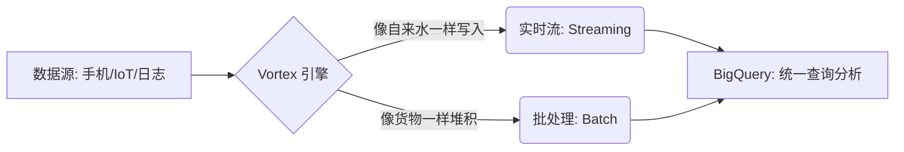
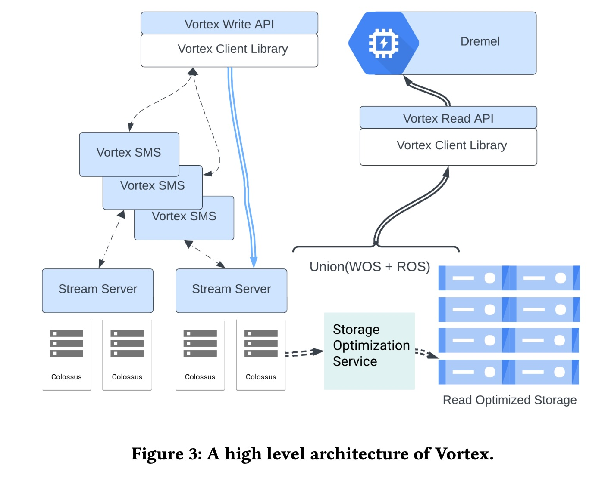
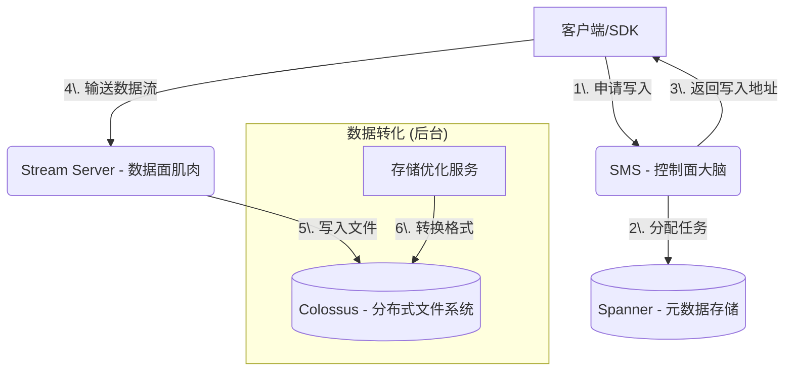
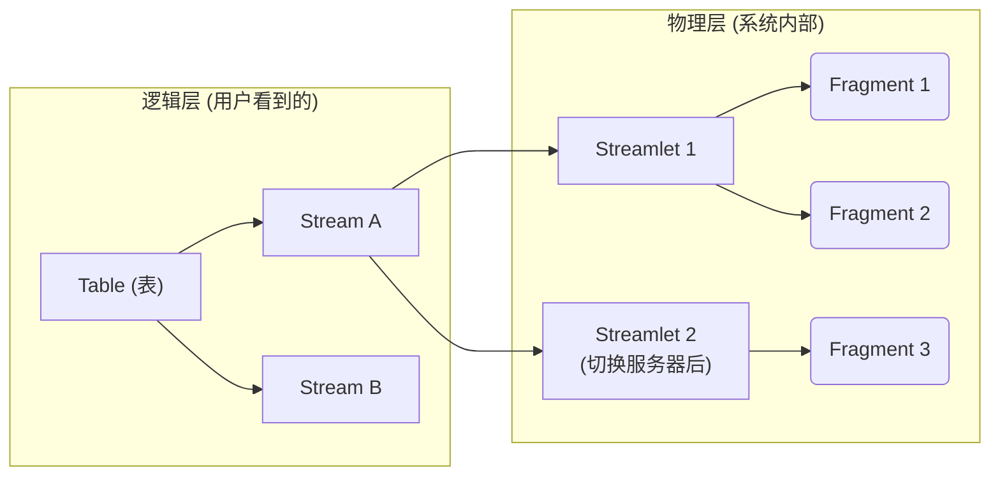
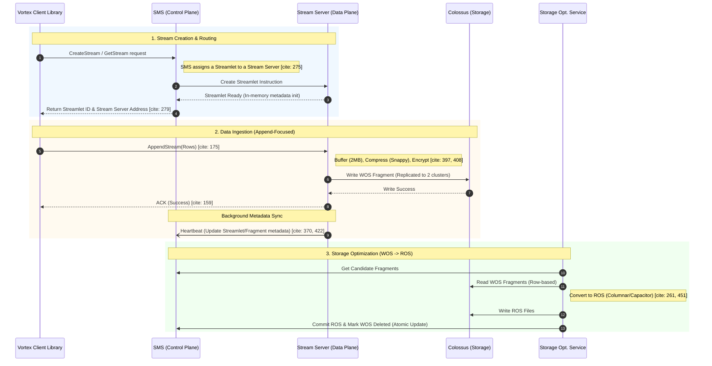

## AI论文解读 | Vortex: A Stream-oriented Storage Engine For Big Data Analytics
        
### 作者        
digoal        
        
### 日期        
2025-11-19        
        
### 标签        
PostgreSQL , PolarDB , DuckDB , AI , 论文解读        
        
----        
        
## 背景  
      
https://dl.acm.org/doi/pdf/10.1145/3626246.3653396        
  
提示:          
```          
读懂《Vortex: A Stream-oriented Storage Engine For Big Data Analytics》这篇论文需要提前掌握哪些基础知识, 请使用中文通熟易懂的讲解这些基础知识, 可以引用论文中的图、表或使用Markdown支持的图形(text,mermaid等)增加解释性. 
  
使用中文通熟易懂的解读《Vortex: A Stream-oriented Storage Engine For Big Data Analytics》这篇论文, 其中的关键内容请着重讲解, 可以引用论文中的图、表或使用Markdown支持的图形(text,mermaid等)增加解释性. 
  
提取《Vortex: A Stream-oriented Storage Engine For Big Data Analytics》这篇论文中的重要术语, 使用中文对这些术语进行通熟易懂的讲解, 可以引用论文中的图、表或使用Markdown支持的图形(text,mermaid等)增加解释性. 
```     
  
## 1 前置知识 
  
阅读《Vortex: A Stream-oriented Storage Engine For Big Data Analytics》这篇论文，你需要理解它是如何连接“实时流数据写入”和“海量数据分析”这两个世界的。

为了让你更轻松地读懂这篇论文，我为你整理了五个核心基础知识模块。我会用通俗的语言配合图表来解释。

-----

### 1\. 数据处理的双重模式：批处理 vs. 流处理 (Batch vs. Streaming)

**基础概念：**

  * **批处理 (Batch):** 就像坐“班车”。人（数据）凑齐了一波，才发车处理。优点是吞吐量大，缺点是有延迟（要等车满）。传统数仓（Data Warehouse）多是这种模式。
  * **流处理 (Streaming):** 就像“自来水管”。水（数据）来一滴流一滴，实时性极高。
  * **Vortex 的背景：** 传统上这两者是分开的系统。Vortex 的目标是将“流式写入”的能力直接做到“批处理数仓（BigQuery）”的底层存储里，实现“流批一体”。

**论文中的体现：**
论文提到 Vortex 是一个 "Unified API"（统一 API），即用同一套接口同时支持批处理和流处理 。



-----

### 2\. 存储格式：行式存储 vs. 列式存储 (Row vs. Column Store)

这是理解论文中 **WOS (Write Optimized Storage)** 和 **ROS (Read Optimized Storage)** 转换机制的关键。

**通俗解释：**
假设你有一个 excel 表格，记录了全校学生的【姓名、年龄、班级、分数】。

  * **行式存储 (Row-oriented):** 数据是按“人”存的。张三的所有信息存在一起，李四的在一起。
      * *优点：* **写入快**。来了一个新学生，直接在末尾加一行就行。
      * *缺点：* 分析慢。如果你只想算“全校平均分”，必须把每个人的所有信息都读出来，再挑出分数。
  * **列式存储 (Column-oriented):** 数据是按“属性”存的。所有人的【分数】存在一起，所有人的【姓名】存在一起。
      * *优点：* **分析快**。算平均分时，只读取【分数】这一列，速度极快。
      * *缺点：* 写入慢。来个新学生，要分别去姓名区、分数区、年龄区插入数据。

**论文中的核心机制 ：**
Vortex 采用了一种混合策略（类似 LSM Tree 思想）：

1.  数据刚进来时，为了快，先用 **行式存储 (WOS)** 写入日志。
2.  后台有一个服务（Storage Optimization Service），悄悄地把这些行式数据转换成 **列式存储 (ROS/Capacitor格式)**，以便后续查询。

-----

### 3\. LSM Tree (日志结构合并树) 的思想

论文中明确提到使用了 LSM Tree 。这是现代高写入数据库（如 HBase, RocksDB）的标配。

**通俗解释：**
想象你在图书馆归还书籍：

1.  **内存/WOS (MemTable):** 你先把书扔进门口的“还书箱”。这动作很快（写入速度快，Append-only）。
2.  **后台合并 (Compaction):** 图书管理员（Vortex Optimizer）会在空闲时，把还书箱里的书拿出来，按分类整理好，放回书架（转换成 ROS 格式）。
3.  **读取：** 当有人借书时，他需要同时查“还书箱”和“书架”。

**论文中的图解逻辑：**

  * **Streamlet/Fragment:** 相当于“还书箱”里的临时小本子。
  * **Compaction:** 把零散的 Fragment 合并成大的、有序的 ROS 文件 。

-----

### 4\. 分布式系统的“控制面”与“数据面”分离

Vortex 是一个庞大的分布式系统，理解它的架构需要区分“谁在发号施令”和“谁在干活”。

**基础概念：**

  * **控制面 (Control Plane):** 大脑。负责存“元数据”（Metadata），比如“这张表在哪些服务器上？”、“现在写到第几行了？”。
      * *论文中对应：* **Vortex SMS** (Stream Metadata Server) 。它依赖 **Spanner**（Google 全球强一致数据库）来保证不记错账。
  * **数据面 (Data Plane):** 肌肉。负责真正地接收数据、压缩数据、写磁盘。
      * *论文中对应：* **Stream Server** 。它把数据写到 **Colossus**（Google 分布式文件系统）。

**架构简图 (基于论文 Figure 3 ):**   

| 组件 | 角色 | 职责 | 对应技术 |
| :--- | :--- | :--- | :--- |
| **Client** | 顾客 | 发起写请求 | Vortex Library |
| **SMS** | 前台经理 (控制面) | 分配房间，记录账本 | Spanner |
| **Stream Server** | 搬运工 (数据面) | 搬运货物，打包压缩 | Memory/CPU |
| **Colossus** | 仓库 (底层存储) | 最终存放货物 | Distributed FS |

-----

### 5\. 事务与一致性 (ACID & Snapshot Isolation)

在分布式环境下，保证数据“不丢、不错、不乱”很难。论文反复提到 **ACID** 和 **Snapshot Isolation**。

**通俗解释：**

  * **ACID (原子性):** 要么全成功，要么全失败。不会出现“数据写了一半服务器挂了，留下一半残缺数据”的情况。Vortex 保证每一次 API 调用都是 ACID 的 。
  * **快照隔离 (Snapshot Isolation):** 想象你在给奔跑的人群拍照。虽然人一直在动（数据一直在写入），但你拍出的照片里，那一瞬间所有人是静止清晰的。
      * *应用：* 当你跑一个耗时 10 分钟的 SQL 查询时，Vortex 保证你看到的数据是“查询开始那一刻”的状态，即使这 10 分钟内又有新数据写进来了，也不会干扰你的查询 。
  * **Exactly-Once (精确一次):** 比如网络不好，客户端重试了 3 次发送同一条数据。Vortex 能识别出这是重复的，只保存一份，而不是三份。这是通过 **Offset (偏移量)** 来实现的 。

### 总结：如何阅读这篇论文？

当你读到以下术语时，可以这样联想：

1.  **Stream/Streamlet/Fragment:** 这是数据的物理分片，像俄罗斯套娃（Table -\> Stream -\> Streamlet -\> Fragment）。
2.  **WOS -\> ROS:** 这是一个“先上车（快速写）后补票（整理成列存）”的过程。
3.  **Spanner & Colossus:** 这是 Google 的“神兵利器”，Vortex 站在这些巨人的肩膀上，Spanner 保证脑子清楚（元数据一致），Colossus 保证肚子能装（海量存储）。

掌握了这些，你再去读 Section 4 的 API 设计和 Section 5 的架构细节，就会发现它是在用工程手段完美地平衡“写入速度”和“查询速度”这一对矛盾。
  
## 2 解读论文 
  
这是一篇关于 **Google BigQuery 底层核心存储引擎 Vortex** 的技术论文。

简单来说，Vortex 解决了一个大数据领域的经典难题：**如何让一个存储系统既能像“接水管”一样支持每秒百万级的实时数据写入，又能像“图书馆”一样支持对海量历史数据的高效查询？**

以下是对这篇论文的通俗解读，我将其拆解为四个核心部分：

-----

### 1\. 核心理念：流批一体 (Streaming First)

**背景痛点：**
在 Vortex 出现之前，公司通常需要两套系统：一套处理实时数据（流式），一套处理历史批量数据（批处理）。这样做很贵，数据搬运慢，而且两边数据经常对不上 。

**Vortex 的解法：**
Vortex 提出了一个颠覆性的观点：**与其为了适应实时数据去改造一个笨重的批处理系统，不如先做一个极致的流式系统，然后把批处理当作一种特殊的“大流量”来处理** 。

它提供了一个**统一的 API**，同时支持三种写入模式 ：

  * **Unbuffered Stream（直通模式）：** 写进去立刻落地，马上能查到。适合对实时性要求极高的场景 。
  * **Buffered Stream（缓冲模式）：** 数据先写进去，但暂时不可见，直到手动“刷新 (Flush)”才生效。这支持了“精确一次 (Exactly-once)”的处理语义 。
  * **Pending Stream（批处理模式）：** 比如你要导几百 GB 的数据，可以开多个 Pending Stream 并行写，写完后发一个“提交”指令，这几百 GB 数据会瞬间原子性地对用户可见 。

-----

### 2\. 架构设计：大脑与肌肉分离

Vortex 的架构设计非常清晰，遵循了控制面与数据面分离的原则 。



  * **控制面 (The Brain) - SMS:** \* 全称 **Stream Metadata Server**。它负责管理元数据（比如这张表有哪些流，写到哪了）。
      * 它依赖 Google 的全球强一致数据库 **Spanner** 来记账，保证数据绝对不会乱 。
  * **数据面 (The Muscle) - Stream Server:**
      * 负责干重活。它接收客户端发来的大量数据，进行压缩、加密，然后写到底层文件系统 **Colossus** 中 。
      * 它是无状态的，如果一台挂了，客户端会自动连到另一台继续写，保证高可用 。

-----

### 3\. 数据分层与形态：俄罗斯套娃结构

Vortex 将数据组织成了一种层级结构，以便管理 ：

1.  **Table (表):** 用户的逻辑表。
2.  **Stream (流):** 写入通道。一个表可以有成千上万个并发的流 。
3.  **Streamlet (子流):** 流的物理分段。如果服务器切换了，就会生成一个新的 Streamlet 。
4.  **Fragment (碎片):** 最小的存储单元，对应到底层文件系统的一个文件 。

**关键机制：WOS 到 ROS 的“变身”**

这是 Vortex 最精彩的部分。为了兼顾“写得快”和“查得快”，数据会经历一次“变身” ：

  * **阶段一：WOS (Write Optimized Storage - 写优化存储)**

      * **形态：** 行式存储 (Row-oriented)。
      * **特点：** 数据来了直接追加（Append-only），写入速度极快，像记流水账。
      * **存储位置：** 刚写进来的数据都存在这里 。

  * **阶段二：Storage Optimization (存储优化服务)**

      * 后台有一个服务，时刻监控着 WOS。一旦积累了足够的碎片，它就会把这些行式数据读取出来，进行排序、重组 。

  * **阶段三：ROS (Read Optimized Storage - 读优化存储)**

      * **形态：** 列式存储 (Columnar, 如 Capacitor 格式)。
      * **特点：** 这种格式对分析非常友好（比如查平均分、聚合统计），但在写入时很慢 。

**查询时的魔法：**
当用户发起查询（SQL）时，Vortex 会同时读取 **WOS（新数据）** 和 **ROS（老数据）** ，并在内存中将结果合并返回。用户感觉不到底层发生了转换，只觉得数据既新鲜又查询得快 。

-----

### 4\. 数据一致性与容灾 (Reliability)

作为金融级数仓的底层，Vortex 必须保证数据不丢不错。

  * **ACID 事务：** 无论是写入一行还是一批，Vortex 都保证原子性（要么全成功，要么全失败）。
  * **快照隔离 (Snapshot Isolation)：** 当你开始一个查询时，Vortex 会给数据拍个“快照”。即使查询期间有新数据写进来，也不会干扰你的查询结果，保证看到的数据是一致的 。
  * **跨区域容灾：** 数据写入时，会同时写到两个不同的集群（Cluster）。只要不是整个区域（Region）毁灭，数据就不会丢 。
  * **去重 (Idempotency)：** 每个写入请求都可以带一个 `row_offset`（行偏移量）。如果网络卡顿导致客户端重试，Vortex 会发现“哎，第 100 行你刚才已经写过了”，从而拒绝重复写入，实现精确一次处理 。

-----

### 总结与性能数据

Vortex 是 Google BigQuery 实现 **“秒级数据新鲜度”** 和 **“PB 级规模分析”** 的幕后功臣 。

**性能表现：**

  * **延迟极低：** 第 50 百分位 (p50) 的写入延迟仅为 **10 毫秒** 。
  * **极度稳定：** 即便在每秒写入超过 1GB 数据的超大压力下，第 99 百分位 (p99) 的延迟也被控制在 **30 毫秒**以内 。

简单来说，Vortex 证明了在现代云原生架构下，我们不需要在“流处理”和“批处理”之间做妥协，可以用一套系统完美地同时搞定两者。
  
## 3 术语 
  
这篇论文《Vortex: A Stream-oriented Storage Engine For Big Data Analytics》介绍了 Google BigQuery 内部使用的核心存储引擎。为了让你更直观地理解，我提取了其中的关键术语，并用通俗的语言、图表进行解读。

以下是关键术语的详细分类讲解：

-----

### 1\. 数据层级结构：数据的“俄罗斯套娃”

Vortex 为了管理海量数据，将数据分为了几个层级。你可以把它想象成写书的过程。

#### **Stream (流)**

  * **通俗解释：** 这是一个“写入通道”。想象成万千作者（客户端）同时在给一本书（表）写稿子，每个作者手里拿的笔和纸就是一个 Stream 。
  * **特点：** 数据只能追加在末尾，不能插队修改前面的内容 。
  * **三种类型：**
      * **UNBUFFERED (直通车)：** 写完马上落地，立刻就能被读到 。
      * **BUFFERED (暂存车)：** 写进去了但先“隐身”，直到你说“Flush（刷新）”了才对别人可见。这是为了保证数据不丢不错（Exactly-once）。
      * **PENDING (批处理车)：** 写大量数据时用。数据先攒着，直到所有数据都传完了，发一个“Commit”指令，这堆数据瞬间全部出现 。

#### **Streamlet (子流)**

  * **通俗解释：** 这是 Stream 的“分身”。如果负责写入的服务器挂了，或者负载均衡需要换一台服务器，Vortex 就会把当前的 Stream 切断，在这个新服务器上开启一个新的 Streamlet 继续写 。
  * **关系：** 一个 Stream 是由一连串首尾相接的 Streamlet 组成的 。

#### **Fragment (碎片)**

  * **通俗解释：** 这是最小的物理文件单元。Streamlet 还是逻辑上的概念，真正落到硬盘（Colossus 文件系统）上时，会切成一个个小文件，这些小文件就是 Fragment 。




-----

### 2\. 存储格式：WOS 与 ROS 的“变形记”

Vortex 为了同时满足“写得快”和“查得快”，让数据在两种形态间转换。

#### **WOS (Write Optimized Storage - 写优化存储)**

  * **通俗解释：** 数据的“草稿箱”。
  * **形态：** **行式存储** (Row-oriented)。
  * **为什么这么做：** 数据刚进来时，就像流水账一样，一行一行记最快。Vortex 优先保证让数据先落袋为安 。
  * **位置：** 未经整理的 Fragment 就在这里 。

#### **ROS (Read Optimized Storage - 读优化存储)**

  * **通俗解释：** 数据的“精装书”。
  * **形态：** **列式存储** (Columnar)。
  * **为什么这么做：** 做分析时（比如算平均分），列式存储效率极高。BigQuery 使用一种叫 Capacitor 的格式 。

#### **Storage Optimization Service (存储优化服务)**

  * **通俗解释：** 这是一个后台勤劳的“整理员”。它不断地扫描 WOS 里的草稿（Fragment），把它们转换成整齐的 ROS 格式，然后替换掉原来的草稿 。
  * **过程：** 这是一个类似 LSM Tree（日志结构合并树）的过程 。

| 特性 | WOS (写优化) | ROS (读优化) |
| :--- | :--- | :--- |
| **主要任务** | 快速接纳新数据  | 快速响应查询分析  |
| **数据形态** | 行式存储 (Row) | 列式存储 (Columnar) |
| **更新频率** | 实时追加 | 后台批量转换  |

-----

### 3\. 系统架构：大脑与肌肉

Vortex 将“管事的”和“干活的”分得很开。

#### **SMS (Stream Metadata Server - 流元数据服务器)**

  * **通俗解释：** 这是系统的 **“控制面” (Control Plane)**，也就是大脑 。
  * **职责：** 它不碰具体的数据内容，只管记录“哪个流在哪个服务器上”、“写到第几行了”这种元数据。它把这些重要信息记在 **Spanner** (Google 的强一致数据库) 里 。

#### **Stream Server (流服务器)**

  * **通俗解释：** 这是系统的 **“数据面” (Data Plane)**，也就是肌肉 。
  * **职责：** 它负责干苦力。接收用户发来的海量数据，压缩、加密，然后写到底层的 **Colossus** (Google 分布式文件系统) 里 。它是无状态的，随时可以被替换 。

#### **Automatic Reclustering (自动重聚类)**

  * **通俗解释：** 这是一个高级整理功能。
  * **场景：** 假设你按“日期”查数据，但数据是乱序写的。
  * **作用：** 当新数据（Delta）积累到一定程度，系统不仅把它转成 ROS，还会自动把它和老数据（Baseline）合并，重新按特定的列（比如用户ID）排序归类。这样下次查询时，就能直接跳过无关的数据块 。

-----

### 4\. 关键机制图解

结合上述术语，Vortex 的工作流程如下：



**总结：**
Vortex 的核心在于它是一个 **“流批一体”** 的存储引擎。它利用 **Stream/Streamlet** 机制处理高并发写入（WOS），再通过后台的 **Storage Optimization** 悄悄地将数据转化为利于分析的格式（ROS），整个过程由 **SMS** 指挥调度，最终存放在 **Colossus** 上。
  
## 参考        
         
https://dl.acm.org/doi/pdf/10.1145/3626246.3653396    
        
<b> 以上内容基于DeepSeek、Qwen、Gemini及诸多AI生成, 轻微人工调整, 感谢杭州深度求索人工智能、阿里云、Google等公司. </b>        
        
<b> AI 生成的内容请自行辨别正确性, 当然也多了些许踩坑的乐趣, 毕竟冒险是每个男人的天性.  </b>        
    
#### [PolarDB 学习图谱](https://www.aliyun.com/database/openpolardb/activity "8642f60e04ed0c814bf9cb9677976bd4")
  
  
#### [PostgreSQL 解决方案集合](../201706/20170601_02.md "40cff096e9ed7122c512b35d8561d9c8")
  
  
#### [德哥 / digoal's Github - 公益是一辈子的事.](https://github.com/digoal/blog/blob/master/README.md "22709685feb7cab07d30f30387f0a9ae")
  
  
#### [About 德哥](https://github.com/digoal/blog/blob/master/me/readme.md "a37735981e7704886ffd590565582dd0")
  
  

  
