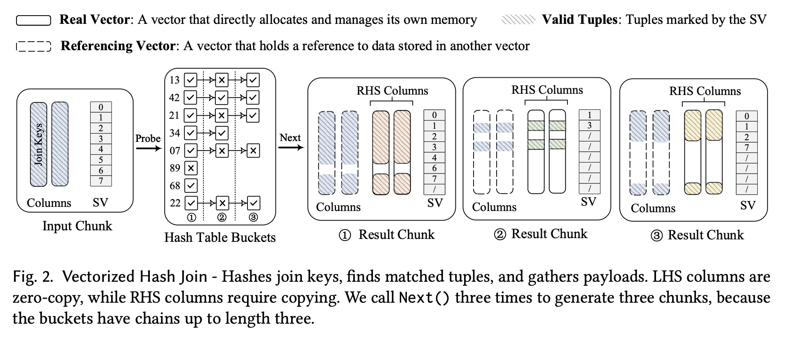
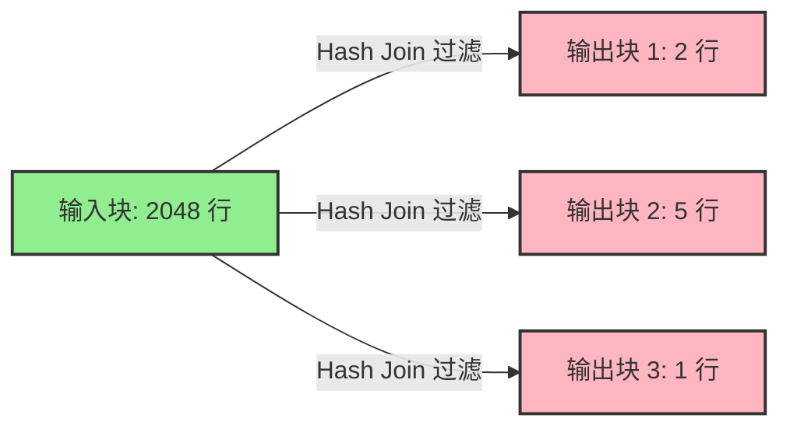
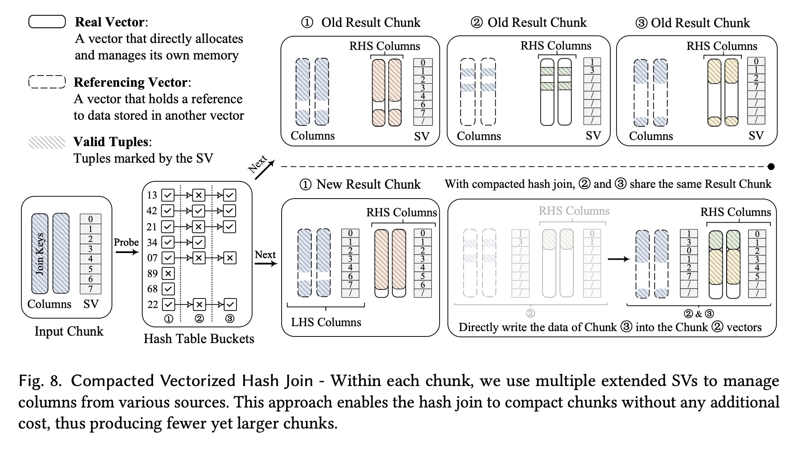
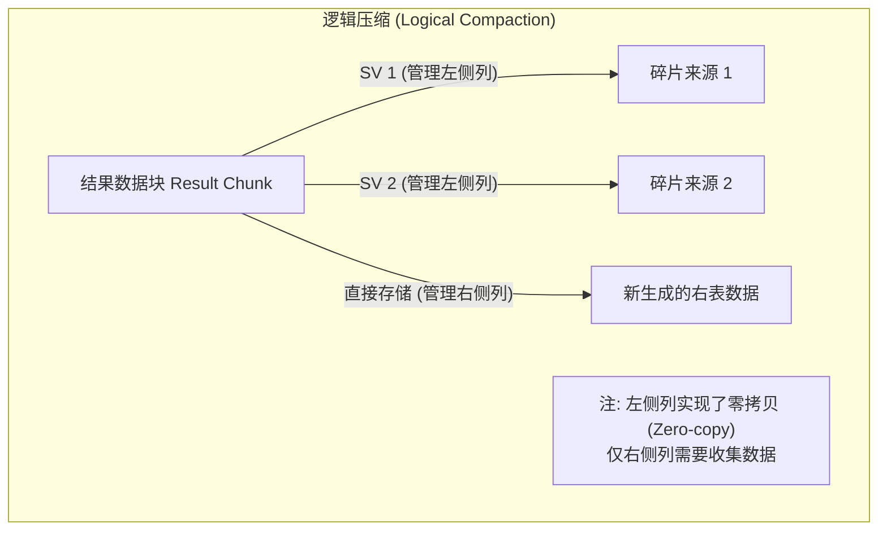

## AI论文解读 | Data Chunk Compaction in Vectorized Execution
        
### 作者        
digoal        
        
### 日期        
2025-11-19        
        
### 标签        
PostgreSQL , PolarDB , DuckDB , AI , 论文解读        
        
----        
        
## 背景  
      
https://dl.acm.org/doi/pdf/10.1145/3709676        
  
提示:          
```          
读懂《Data Chunk Compaction in Vectorized Execution》这篇论文需要提前掌握哪些基础知识, 请使用中文通熟易懂的讲解这些基础知识, 可以引用论文中的图、表或使用Markdown支持的图形(text,mermaid等)增加解释性. 
  
使用中文通熟易懂的解读《Data Chunk Compaction in Vectorized Execution》这篇论文, 其中的关键内容请着重讲解, 可以引用论文中的图、表或使用Markdown支持的图形(text,mermaid等)增加解释性. 
  
提取《Data Chunk Compaction in Vectorized Execution》这篇论文中的重要术语, 使用中文对这些术语进行通熟易懂的讲解, 可以引用论文中的图、表或使用Markdown支持的图形(text,mermaid等)增加解释性. 
```     
  
## 1 前置知识 
  
要深入理解《Data Chunk Compaction in Vectorized Execution》（向量化执行中的数据块压缩）这篇论文，你需要掌握以下五个核心基础知识领域。

我将用通俗易懂的语言解释这些概念，并结合论文中的图表进行说明。

-----

### 1\. 数据库执行模型：火山模型 vs. 向量化模型

这是理解论文背景（Background）的关键。你需要明白为什么现代数据库要用“向量化”，以及它解决了什么痛点。

  * **火山模型 (Volcano Model) / 一次处理一行**

      * **概念**：传统的数据库处理方式。就像流水线上的工人，每人每次只处理一个零件（一行数据）。上游算子（Operator）调用 `Next()` 函数，下游返回**一行**数据。
      * **缺点**：函数调用次数太多了！处理 100 万行数据就要调用 100 万次 `Next()`。这种“解释开销”（Interpretation Overhead）非常大，CPU 很多时间都浪费在跳转指令上，而不是在计算数据 。

  * **向量化模型 (Vectorized Execution)**

      * **概念**：现代分析型数据库（如 DuckDB, ClickHouse）采用的方式。每次 `Next()` 调用不只返回一行，而是返回**一批**数据（一个向量/Data Chunk）。通常这个大小是几千行（例如 2048 行）。
      * **优点**：
        1.  **分摊开销**：调用一次函数处理 2000 行，函数调用的开销被分摊微不足道 。
        2.  **CPU 友好**：数据紧凑排列，不仅利用 CPU 缓存（Cache），还能利用 CPU 的乱序执行和 SIMD（单指令多数据）能力 。

> **核心冲突（论文解决的问题）：**
> 向量化模型依赖“大批量”数据来保持高性能。如果因为过滤或关联操作，导致一批数据只剩下几行（Small Chunks），向量化引擎就会退化回慢速的火山模型 。


-----

### 2\. 数据块（Data Chunk）与选择向量（Selection Vector）

这是理解论文提出的 **"Logical Compaction" (逻辑压缩)** 的基础。

  * **数据块 (Data Chunk)**：
      * 它是向量化执行的基本单元。想象一个 Excel 表格的片段，里面包含几列数据（Columns），比如 ID 列、Name 列，行数通常固定（如 2048 行）。
  * **选择向量 (Selection Vector / SV)**：
      * **问题**：当我们在数据块上执行 `WHERE age > 20` 过滤时，如果不符合条件的行被删掉，我们需要把剩下的行挪到一起（内存拷贝），这很慢。
      * **解决**：我们不挪动数据，而是维护一个“名单”——**选择向量**。它是一个整数数组，里面记录了哪些行是“有效”的 。
      * **例子**：参考论文 **Figure 2** 的左侧 `Input Chunk`。    
          * 原始数据有 8 行。
          * `SV` 列显示 `0, 1, 2, 3, 4, 6, 7`，意味着第 5 行（Index 5）被过滤掉了，其他都是有效的。

> **论文的创新点：** 传统的 Chunk 只有一个 SV。论文提出在同一个 Chunk 里使用**多个扩展 SV**，以此来“逻辑上”合并数据，而不需要真的拷贝数据 。

-----

### 3\. 哈希连接（Hash Join）的工作原理

论文重点优化的是 **Hash Join** 算子，因为它是产生“小数据块”的罪魁祸首。

  * **基本流程**：
    1.  **构建阶段 (Build)**：把右表（较小的表）的数据做成一个哈希表。
    2.  **探测阶段 (Probe)**：拿着左表（大表）的数据块，去哈希表里查有没有匹配的。
  * **为什么会产生小数据块？**
      * 假设左边进来一个 2048 行的满载数据块。
      * 经过 Hash Join 探测后，可能只有 5 行匹配成功。
      * 输出结果就是一个只有 5 行的“小 Chunk”。
      * 更糟糕的是，因为哈希冲突或一对多匹配，一个输入块可能生成多个输出块，这些输出块往往非常小且碎片化 。

> **参考论文 Figure 2 (Vectorized Hash Join)：**
> 图中展示了 `Probe` 过程。输入是一个大块，但输出变成了三个小块（Result Chunk 1, 2, 3）。这些小块导致了后续处理性能下降。

-----

### 4\. 内存拷贝（Copy）与 零拷贝（Zero-copy）的权衡

这是理解论文核心问题 **"The Chunk Compaction Problem"** 的关键权衡。

  * **零拷贝 (Zero-copy)**：
      * DuckDB 等系统喜欢的方式。输出的 Chunk 不存实际数据，而是存指向输入数据的“引用”（指针）。
      * **优点**：快，省内存。
      * **缺点**：容易产生碎片。如果 2048 行里只有 1 行有效，你还是得传递整个大结构，导致有效载荷极低 。
  * **物理压缩/拷贝 (Compaction/Copy)**：
      * 把碎片化的有效数据拷贝到一个新的、连续的内存块中。
      * **优点**：后续处理很快（向量填满了）。
      * **缺点**：拷贝操作本身（`memcpy`）非常耗时 。

> **论文的核心公式 ：**
> 目标是最小化总时间 = `后续算子的处理时间` (压缩有收益) + `当前压缩操作的时间` (压缩有成本)。
> 这里的难点在于：**什么时候该拷贝？什么时候该忍受碎片？**

-----

### 5\. 多臂老虎机问题 (Multi-Armed Bandits, MAB)

这是理解论文 **"Learning Compaction"** 算法的基础。

  * **场景**：你面对好几台老虎机，每台的中奖概率不同，但你不知道哪台最高。
  * **决策困境**：
      * **探索 (Exploration)**：去试一试没玩过的机器，收集数据。
      * **利用 (Exploitation)**：一直玩目前看起来收益最高的那台。
  * **在论文中的应用**：
      * **老虎机** = 不同的“压缩阈值”（Threshold，比如：当数据少于 128 行时压缩，还是少于 512 行时压缩？）。
      * **收益 (Reward)** = 查询执行的速度（延迟的倒数）。
      * **算法 (UCB)**：论文使用 UCB 算法来动态决定每个算子应该使用什么压缩阈值，而不需要人工写死规则 。

-----

### 总结：阅读论文的思维导图

1.  **背景**：向量化很快，但遇到 **Chunk-Reducing Operators (如 Hash Join)** 会产生 **小 Chunk**。
2.  **问题**：小 Chunk 让向量化引擎变慢。
3.  **现有方案**：
      * 要么不压缩（慢）。
      * 要么全压缩（拷贝成本高）。
      * 要么用固定阈值（DuckDB 默认做法，不够灵活）。
4.  **论文解法**：
      * **怎么压 (How)** -\> **Logical Compaction**：利用多个 Selection Vector 实现零拷贝的“逻辑”合并 。
      * **何时压 (When)** -\> **Learning Compaction**：利用多臂老虎机 (MAB) 算法动态学习最佳压缩时机 。
  
## 2 解读论文 
  
这篇论文《Data Chunk Compaction in Vectorized Execution》（向量化执行中的数据块压缩）针对现代分析型数据库中的一个核心性能痛点 —— **“小数据块”问题** ，提出了两套互补的解决方案。

以下是通俗易懂的深度解读。

-----

### 1\. 核心背景与问题：为什么“小数据块”是性能杀手？

**向量化执行（Vectorized Execution）** 是现代数据库（如 DuckDB, ClickHouse）跑得快的秘诀。它不像传统数据库那样一行一行处理数据，而是**一批一批**（Data Chunk，通常约 2048 行）处理 。

  * **理想情况**：每个数据块都是满的（2048 行），CPU 可以满负荷运转，分摊函数调用开销 。
  * **现实情况**：经过 **过滤（Filter）** 或 **哈希连接（Hash Join）** 等操作后，数据会被“削减”。一个满的块进去，可能只剩几行有效数据出来。这些操作被称为 **CROs (Chunk-Reducing Operators)** 。
  * **后果**：流水线中充满了只有几行数据的“碎片块”。这导致 CPU 缓存利用率低，且解释开销（Interpretation Overhead）暴涨，系统退化回慢速模式 。

**图解：数据块的退化**



*论文统计显示：在 Join Order Benchmark 中，39% 的数据块经过 Hash Join 后甚至只剩 1 行数据 。*

-----

### 2\. 进退两难的权衡 (The Trade-off)

要解决碎片问题，直观的方法是 **压缩（Compaction）** ：把几个小块拼成一个大块。

但这里有个矛盾：

1.  **不压缩**：后续算子处理太慢（解释开销大）。
2.  **压缩**：拼凑数据需要内存拷贝（Memory Copy），这本身很耗时 。

现有的数据库（如 DuckDB 旧版本）通常使用**固定阈值**（例如：只要少于 128 行就压缩）。但论文指出这不够好，因为不同的查询、不同的算子位置，最优的压缩时机是完全不同的 。

-----

### 3\. 解决方案一：“何时压缩？”——学习型压缩 (Learning Compaction)

论文首先解决**决策问题**：到底什么时候该压缩，什么时候该放行？

作者引入了一个**在线学习算法**（基于多臂老虎机问题，MAB），让数据库在运行过程中自己“学习”最佳阈值 。

  * **原理**：
      * 数据库把“压缩阈值”（比如 0, 32, 128, 1024 行）看作老虎机的不同拉杆 。
      * **尝试（Exploration）** ：运行时偶尔尝试不同的阈值。
      * **奖励（Reward）** ：观察后续算子的处理速度（延迟的倒数）。
      * **收敛**：算法会自动向收益最高的阈值收敛。
  * **优势**：不需要人工调参，能适应不同的硬件和查询负载。

-----

### 4\. 解决方案二：“如何压缩？”——逻辑压缩 (Logical Compaction)

这是论文最核心的技术创新，专门针对**哈希连接（Hash Join）** 。

在向量化 Hash Join 中，一个输入的大块去探测哈希表，往往会生成多个输出的小块 。传统的压缩方法需要把这些小块的数据**物理拷贝**到一个新内存里，非常慢。

作者提出了**逻辑压缩**，核心思想是：**只动元数据，不动真实数据**。

#### 4.1 关键技术：扩展选择向量 (Extended Selection Vectors)

传统的数据块只有一个**选择向量（Selection Vector, SV）** ，用来标记哪些行是有效的。
论文提出，允许一个数据块拥有**多个扩展 SV** 。

  * **零拷贝原理**：
      * Hash Join 的输出块，其左表（Probe Side）的数据其实都来自同一个输入块。
      * 我们不需要拷贝左表的数据，只需要把多个小块的 SV 逻辑上“挂”在同一个数据块上即可。
      * 对于右表（Build Side）的数据，依然做紧凑的收集。
  * **结果**：多个逻辑上的小结果，物理上共享同一个大内存块，极大地减少了数据搬运 。

**图解：逻辑压缩 vs. 物理拷贝**
*(基于论文 Figure 8 的简化概念)*

  

**传统物理压缩：**

1.  申请新内存
2.  复制 Chunk A 的数据 -\> 新内存
3.  复制 Chunk B 的数据 -\> 新内存
    *耗时：高 (内存带宽瓶颈)*

**逻辑压缩 (Logical Compaction)：**

  * **数据列 (Data Columns)**: 保持不动（引用原始输入块）。
  * **选择向量 (SV)**: [SV1 指向 Chunk A 的行], [SV2 指向 Chunk B 的行]。
  * *耗时：极低 (仅操作指针和整数数组)*

-----

### 5\. 实验结果 (Evaluation)

作者将这两项技术（统称为 **Smart Compaction**）实现在了 **DuckDB** 中，并在多个基准测试中进行了评估。

  * **总体性能**：在 Join Order Benchmark (JOB) 中，平均提升 **11.8%**，部分重度依赖 Join 的查询提升高达 **63%** 。
  * **关键发现**：
      * **逻辑压缩**对于 Join 密集型查询效果最好，因为它消除了大量的数据拷贝开销 。
      * **学习型压缩**对于过滤（Filter）密集型查询更有效，因为它能动态找到平衡点 。
      * 两者结合（Smart Compaction）能覆盖最广泛的场景 。

-----

### 6\. 总结与一句话点评

**论文核心贡献**：

1.  **模型化**：量化了“解释开销”与“拷贝开销”的权衡 。
2.  **智能化**：用轻量级机器学习（MAB）动态决定压缩阈值 。
3.  **结构化**：发明了“多选择向量”的数据块结构，实现了 Hash Join 结果的零拷贝合并 。

**一句话点评**：
这就好比快递公司（数据库），以前遇到只有一件货的订单（小数据块）也单独发一辆大卡车（高开销），或者费劲把货搬到另一辆车拼单（物理拷贝）；现在他们发明了一种“虚拟拼单”技术（逻辑压缩），不用搬货，贴个标签就能让多批货共享同一辆车，同时还用 AI 决定什么时候发车最划算。

### 我能为你做的下一步

如果你对 DuckDB 的内部实现感兴趣，我可以为你详细解释论文中提到的 **Selection Vector（选择向量）** 在 C++ 代码层面是如何运作的，或者详细拆解图 8 (Fig. 8) 的具体数据流向。
  
## 3 术语 
  
这篇论文《Data Chunk Compaction in Vectorized Execution》解决的核心问题是：在现代数据库中，当数据越算越少（变成碎片）时，如何高效地把它们重新拼起来，以保持高速运行。

以下是论文中的关键术语提取与通俗解读：

### 1\. 基础架构术语

#### **向量化执行 (Vectorized Execution)**

  * **定义**：一种数据库查询处理模型。它不像传统的“火山模型”那样一次只处理一行数据，而是每次处理**一批**数据（一个向量或数据块）。
  * **通俗解释**：想象搬砖。传统模式是工人一次搬一块砖（一行数据），跑一趟只干一点活。向量化执行则是用推车一次搬一整车砖（一批数据）。
  * **优势**：这样可以分摊函数调用的开销（Interpretation Overhead），并更好地利用现代 CPU 的并行能力 。

#### **数据块 (Data Chunk)**

  * **定义**：向量化执行中的基本传输单元，包含了一组元组（Tuples）的列数据 。
  * **通俗解释**：就是上面提到的“那车砖”。通常一个数据块包含几千行数据（例如 DuckDB 默认为 2048 行）。
  * **关键点**：数据块的大小对性能至关重要。太大容易导致 CPU 缓存装不下（Cache Miss）；太小则会让引擎退化回慢速的传统模式 。

#### **选择向量 (Selection Vector, SV)**

  * **定义**：一个密集的行号（RID）列表，用来标记数据块中哪些行是“有效”的 。
  * **通俗解释**：这是一种“懒人”删除法。当你要过滤掉某些数据时，不要真的把数据从内存里删掉或移动（因为那很慢），而是拿一个小本子（选择向量）记下：“第 1、3、5 行是有用的，其他的别看”。
  * **作用**：避免了在算子之间传递数据时不必要的内存拷贝 。

-----

### 2\. 问题描述术语

#### **数据块削减算子 (Chunk-Reducing Operators, CROs)**

  * **定义**：指那些会减少数据块中有效条目数量的数据库操作符，最典型的是**过滤器 (Filters)** 和 **哈希连接 (Hash Joins)** 。
  * **通俗解释**：这些是“捣乱分子”。一个满的推车（2048 行）进去，经过过滤（比如 `WHERE age > 100`）或者连接操作后，可能只剩几块砖（几行数据）出来。
  * **后果**：导致流水线中充斥着大量只有几行数据的“小数据块”，严重拖慢速度 。

#### **数据块削减因子 (Chunk-Reducing Factor, CRF)**

  * **定义**：衡量数据缩减程度的指标。计算公式为：**进入算子的块大小 ÷ 离开算子的块大小** 。
  * **通俗解释**：如果进来 2048 行，出去只剩 1 行，CRF 就是 2048。CRF 越大，说明数据被打得越散，产生的碎片越多 。
  * **数据支撑**：论文发现，在某些基准测试中，39% 的数据块经过 Hash Join 后 CRF 高达 2048（即只剩 1 行）。

#### **解释开销 (Interpretation Overhead) vs. 拷贝成本 (Copy Cost)**

  * **定义**：这是压缩问题中的核心权衡（Trade-off）。
      * **解释开销**：处理每个数据块时固定的函数调用和逻辑判断时间。块越小（碎片越多），单位数据的解释开销就越大 。
      * **拷贝成本**：将小块数据物理复制拼凑成大块所花费的时间 。
  * **通俗解释**：
      * *不压缩*：你要处理 1000 个只有 1 行的小块，意味着你要启动 1000 次机器，很累（解释开销大）。
      * *压缩*：你把这 1000 行数据拼成一个大块，只启动 1 次机器。但是“拼凑”这个动作需要搬运数据，很费时（拷贝成本高）。
      * **难题**：怎么选才能让总时间最少？

-----

### 3\. 解决方案术语（论文核心贡献）

#### **数据块压缩 (Chunk Compaction)**

  * **定义**：将多个未填满的小数据块合并成一个较大的数据块的过程 。
  * **分类**：
    1.  **物理压缩 (Full/Binary Compaction)**：传统的做法，真的开辟新内存，把数据**拷贝**过去。缺点是慢 。
    2.  **逻辑压缩 (Logical Compaction)**：论文提出的新做法，通过元数据操作实现“零拷贝”合并 。

#### **逻辑压缩 (Logical Compaction)**

  * **定义**：一种专门针对哈希连接（Hash Join）的压缩方法，旨在最小化数据移动。它通过让结果块引用原始数据来实现压缩，而不是复制数据 。
  * **核心机制**：**扩展选择向量 (Extended Selection Vectors)**。
  * **通俗解释**：
      * 传统的做法：要把两个剩菜盘子（小 Chunk）里的菜倒到一个新盘子里（物理拷贝）。
      * 逻辑压缩：直接拿一个大托盘，把两个剩菜盘子放上去，并贴上标签说“这也是我的一道菜”。虽然物理上它们还在原来的盘子里，但逻辑上它们被当成一个整体处理了。

#### **扩展选择向量 (Extended SVs)**

  * **定义**：论文设计的新型数据结构。允许一个数据块中包含**多个**选择向量，分别管理不同来源的列数据 。
  * **通俗解释**：
      * 普通 SV：一个块只有一个名单。
      * 扩展 SV：一个块可以有好几个名单。比如，“左边这几列数据请看名单 A（指向内存位置 X），右边那几列数据请看名单 B（指向内存位置 Y）”。这使得不同来源的数据可以在不发生物理移动的情况下“逻辑上”同处一室 。




#### **学习型压缩 (Learning Compaction)**

  * **定义**：一种动态算法，用于解决“何时压缩”的问题。它将压缩阈值的选择建模为**多臂老虎机 (Multi-Armed Bandit, MAB)** 问题 。
  * **通俗解释**：
      * 数据库在运行时化身“AI 玩家”。它面前有几个按钮（阈值）：比如“满 128 行再压”、“满 512 行再压”等。
      * 它会不断尝试按不同的按钮，然后观察哪个按钮能让跑得最快（延迟最低）。
      * 通过不断的“尝试（Exploration）”和“利用（Exploitation）”，它能自动找到当前最适合的压缩时机，而不需要人去猜 。
  
## 参考        
         
https://dl.acm.org/doi/pdf/10.1145/3709676    
        
<b> 以上内容基于DeepSeek、Qwen、Gemini及诸多AI生成, 轻微人工调整, 感谢杭州深度求索人工智能、阿里云、Google等公司. </b>        
        
<b> AI 生成的内容请自行辨别正确性, 当然也多了些许踩坑的乐趣, 毕竟冒险是每个男人的天性.  </b>        
    
#### [PolarDB 学习图谱](https://www.aliyun.com/database/openpolardb/activity "8642f60e04ed0c814bf9cb9677976bd4")
  
  
#### [PostgreSQL 解决方案集合](../201706/20170601_02.md "40cff096e9ed7122c512b35d8561d9c8")
  
  
#### [德哥 / digoal's Github - 公益是一辈子的事.](https://github.com/digoal/blog/blob/master/README.md "22709685feb7cab07d30f30387f0a9ae")
  
  
#### [About 德哥](https://github.com/digoal/blog/blob/master/me/readme.md "a37735981e7704886ffd590565582dd0")
  
  

  
