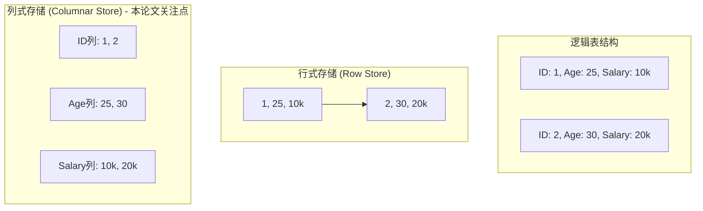
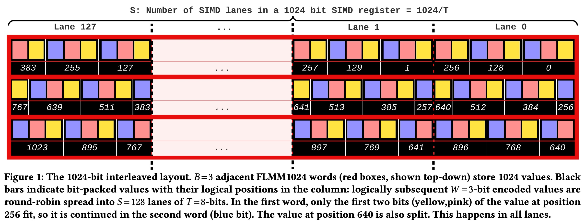
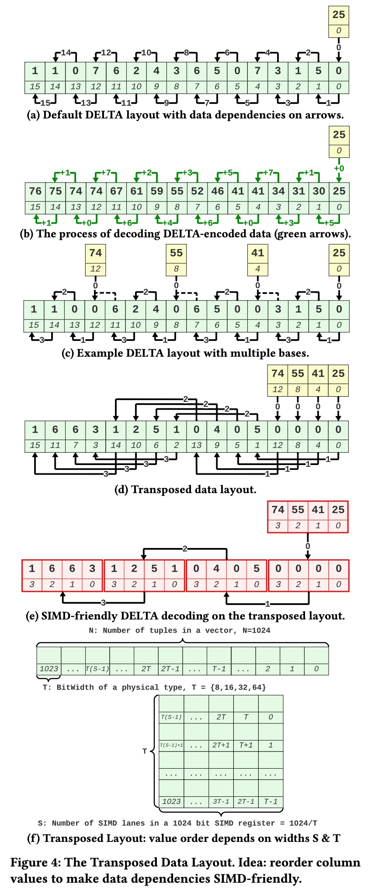
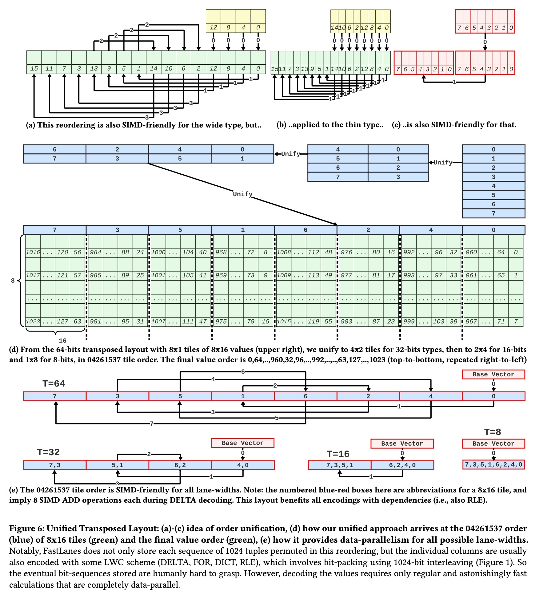
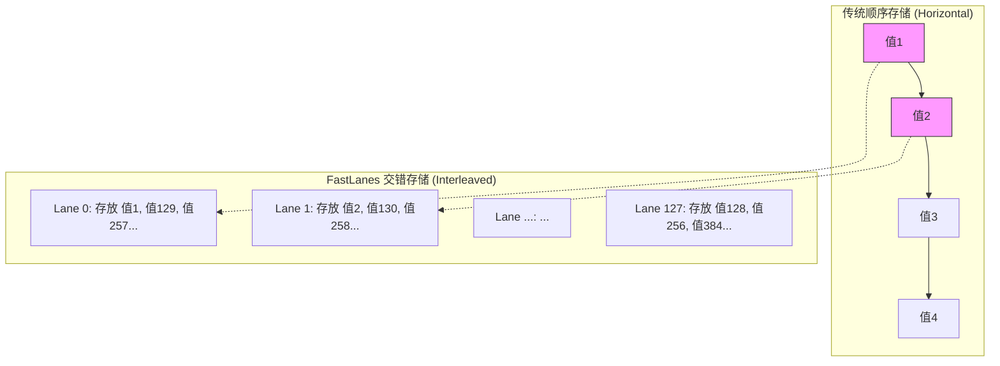
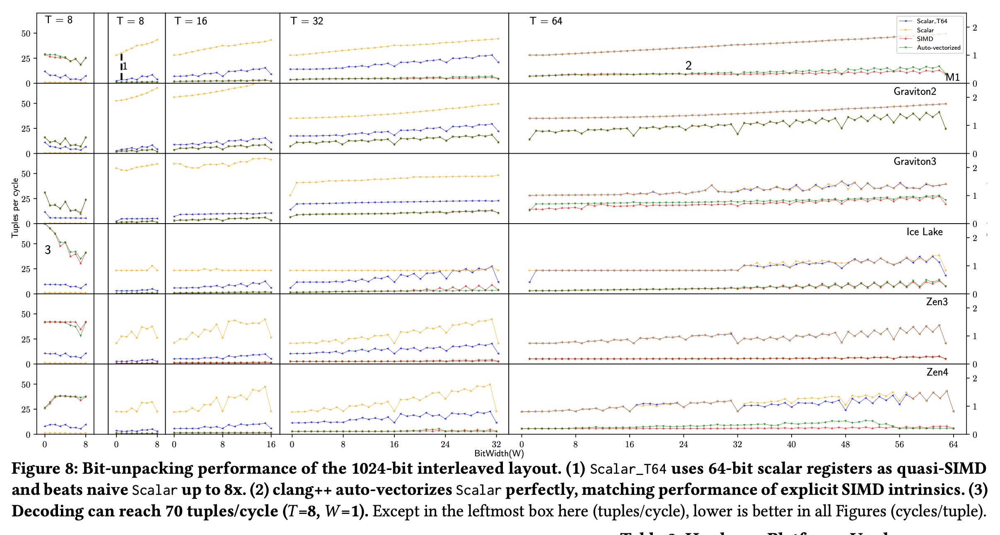
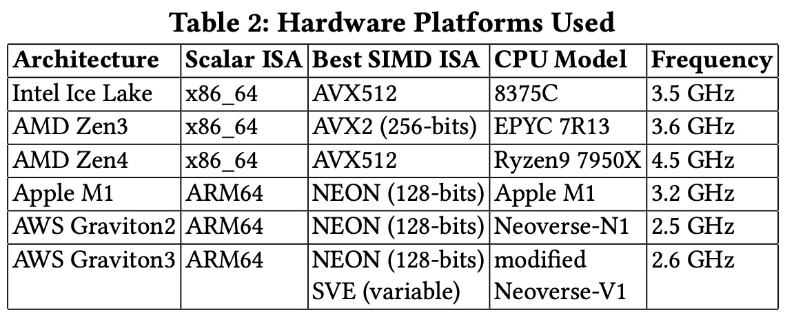
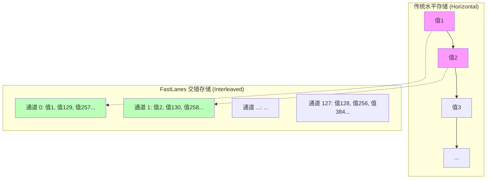

## AI论文解读 | The FastLanes Compression Layout: Decoding \>100 Billion Integers per Second with Scalar Code
        
### 作者        
digoal        
        
### 日期        
2025-11-19        
        
### 标签        
PostgreSQL , PolarDB , DuckDB , AI , 论文解读        
        
----        
        
## 背景  
      
https://www.vldb.org/pvldb/vol16/p2132-afroozeh.pdf        
  
提示:          
```          
读懂《The FastLanes Compression Layout: Decoding \>100 Billion Integers per Second with Scalar Code》这篇论文需要提前掌握哪些基础知识, 请使用中文通熟易懂的讲解这些基础知识, 可以引用论文中的图、表或使用Markdown支持的图形(text,mermaid等)增加解释性. 
  
使用中文通熟易懂的解读《The FastLanes Compression Layout: Decoding \>100 Billion Integers per Second with Scalar Code》这篇论文, 其中的关键内容请着重讲解, 可以引用论文中的图、表或使用Markdown支持的图形(text,mermaid等)增加解释性. 
  
提取《The FastLanes Compression Layout: Decoding \>100 Billion Integers per Second with Scalar Code》这篇论文中的重要术语, 使用中文对这些术语进行通熟易懂的讲解, 可以引用论文中的图、表或使用Markdown支持的图形(text,mermaid等)增加解释性. 
```     
  
## 1 前置知识 
  
要想读懂这篇论文《The FastLanes Compression Layout: Decoding \> 100 Billion Integers per Second with Scalar Code》，你需要掌握以下几个核心领域的 **基础知识**。

为了让你更轻松地理解，我将这些概念拆解为通俗易懂的解释，并结合论文中的图表进行说明。

-----

### 1\. 数据存储模型：行存 vs 列存 (Row vs. Columnar Storage)

**为什么需要懂这个？**
论文一开篇就提到 FastLanes 旨在改进 Parquet、ORC 等 **列式存储 (Columnar Storage)** 格式 。如果不理解列存，就无法理解为什么要这么折腾数据的“排布方式”。

  * **通俗解释：**

      * **行存 (Row Store):** 就像传统的 Excel 表格，一行记录代表一个人的完整信息（姓名、年龄、工资）。读取时，要把整行数据都读出来。适合“查询某个人的详情”。
      * **列存 (Columnar Store):** 把所有人的“年龄”存一起，所有人的“工资”存一起。数据库分析（OLAP）通常只需要计算“平均工资”，列存只需要读取“工资”这一列，不需要读“姓名”，因此速度极快，且更容易压缩（因为全是数字）。

  * **图解：**




-----

### 2\. 计算机指令架构：SIMD 与 标量 (Scalar) 代码

**为什么需要懂这个？**
论文标题中强调 **Scalar Code (标量代码)** 能达到 **SIMD** 的速度，这是核心卖点 。你需要理解两者的区别。

  * **基础概念：**

      * **Scalar (标量):** 传统的 CPU 处理方式。一次指令只处理一个数据。比如：`1 + 1 = 2`。
      * **SIMD (单指令多数据流):** 现代 CPU 的“超能力”。一条指令同时处理多个数据。比如：`[1, 2, 3, 4] + [1, 1, 1, 1] = [2, 3, 4, 5]`。
      * **Lane (通道):** SIMD 寄存器被切分成的小块。例如一个 256 位的寄存器，可以切分成 8 个 32 位的通道 (Lanes)，每个通道处理一个整数。

  * **论文中的挑战：**
    现在的 CPU SIMD 宽度越来越多变（128位、256位、512位）。如果你针对 512位写代码，换个电脑可能就跑不动了。

      * **FastLanes 的做法：** 设计一个 **虚拟的 1024位寄存器** ，然后用普通的标量代码（Scalar Code）去模拟它。神奇的是，现代编译器（Compiler）非常聪明，能自动把这些整齐的标量代码优化成 SIMD 指令（Auto-vectorization）。

  * **结合论文 Figure 1 理解：**    
    *注：此处引用论文 Figure 1 的概念*
    图中展示了一个 1024 位的虚拟寄存器，被切分成了 128 个 Lane（每个 Lane 8 bit）。这就是 SIMD 并行处理的基础。

-----

### 3\. 轻量级压缩算法 (Light-Weight Compression)

论文主要加速了四种常见的列存压缩算法 ，你需要知道它们的基本原理：

#### A. Bit-Packing (位填充)

  * **原理：** 整数通常占 32 位（4字节）。但如果一列数据全是小于 8 的数字（0-7），其实只需要 3 个 bit 就能存下 ( $2^3=8$ )。把 32 位压缩成 3 位，就是 Bit-Packing。
  * **难点：** 3 bit 的数据在内存里是不对齐的，CPU 读取很麻烦。FastLanes 使用了一种 **Interleaved (交错)** 的方式来存 ，让数据在解压时更适合 SIMD 并行读取。

#### B. DELTA Encoding (增量编码/差分编码)

  * **原理：** 不存原始值，只存与前一个值的“差值”。
      * 原始数据：`100, 101, 103, 105`
      * Delta 编码：`100 (基准), +1, +2, +2`
      * 优势：数字变小了，可以用更少的 bit 存储。
  * **论文解决的痛点 (Dependency)：**
    Delta 解码有一个致命问题：**依赖性**。你必须算出第 2 个数，才能算第 3 个数 。这导致 SIMD 无法并行（因为 SIMD 想要同时算 8 个数）。
      * **看论文 Figure 4 (a) vs (e):**    
          * 图 4(a) 是传统 Delta，箭头首尾相连，必须串行解码。
          * 图 4(e) 是 FastLanes 的做法，它把数据 **重排 (Transpose)** 了，打断了依赖链，使得 SIMD 可以并行计算。

#### C. RLE (Run-Length Encoding, 游程编码)

  * **原理：** 连续重复的数据只存“值 + 次数”。
      * 原始数据：`A, A, A, B, B`
      * RLE 编码：`A (3次), B (2次)`
  * **论文改进：** 论文提出 **FastLanes-RLE** ，将 RLE 转换成一种特殊的 Delta 编码形式，以便利用上述的并行加速能力。

-----

### 4\. 核心黑科技：数据重排 (Layout Transformation / Transposing)

这是这篇论文最核心的“魔法”。

**场景类比：发扑克牌**

  * **传统方式 (Sequential)：** 就像你有一摞牌（数据），你一张一张按顺序处理。
      * 问题：如果第 2 张牌的大小依赖第 1 张，你就没法叫 4 个人（SIMD）同时来处理这摞牌。
  * **FastLanes 方式 (Transposed/Interleaved)：**
      * 先把牌像“发牌”一样，轮流发给 4 个人（Lane 0, Lane 1, Lane 2...）。
      * 每个人手里拿到的牌，虽然在原始数据里是不相邻的，但在处理逻辑上是独立的。
      * **结果：** 4 个人可以同时低头算自己手里的牌，互不干扰。

**论文 Figure 6 (Unified Transposed Layout)**    
这幅图虽然看起来很复杂，但它本质上就是在画这个“发牌”的顺序图。论文发明了一种特殊的顺序 `04261537` ，目的是让这一种排序方式，能同时适应 8位、16位、32位、64位 的各种数据类型，不需要为了不同数据类型重新写代码。

-----

### 5\. 总结：阅读路线图

当你阅读这篇论文时，请按以下逻辑串联知识点：

1.  **目标：** 想让数据库读取压缩数据更快（达到 100 Billion integers/s）。
2.  **瓶颈：** 现有的压缩算法（Delta, RLE）有前后依赖，导致 CPU (SIMD) 无法火力全开并行计算。
3.  **手段 1 (Bit-packing)：** 把数据压缩得很小，但为了好读，把数据打散（Interleave）放到一个超宽的虚拟 1024-bit 空间里。
4.  **手段 2 (Transposing)：** 为了解决 Delta 的依赖问题，把数据在存储时就**打乱重排**（Transpose），让相邻的计算不再互相依赖。
5.  **结果：** 即使写的是普通的 C++ 循环代码（Scalar），编译器也能自动把它变成超快的并行指令，且不用担心 CPU 架构升级带来的兼容性问题。

掌握了以上基础，你就可以流畅地阅读这篇论文了！
  
## 2 解读论文 
  
这篇论文《The FastLanes Compression Layout: Decoding \> 100 Billion Integers per Second with Scalar Code》主要介绍了一种名为 **FastLanes** 的新型数据压缩布局。它的核心目标是解决大数据列式存储（如 Parquet, ORC）在现代硬件上解码速度不够快、难以适应不同 CPU 架构（Intel AVX, ARM NEON 等）的问题。

以下是这篇论文的通俗解读，我们将通过三个核心创新点来剖析它为什么能做到“每秒解码超过 1000 亿个整数”。

-----

### 1\. 核心理念：面向未来的“虚拟 1024 位寄存器”

**痛点：**
CPU 的 SIMD（单指令多数据）处理能力一直在变。从最早的 128 位，到 256 位，再到 Intel 的 512 位。开发者如果针对特定的宽度写代码，一旦硬件升级或更换（比如从 Intel 换到 Apple M1/M2），代码就需要重写或者性能下降 。

**FastLanes 的解决方案：**
作者没有针对某种具体的 CPU，而是设计了一个 **虚拟的 1024 位宽度的寄存器 (FLMM1024)** 。

  * **原理：** 无论你的 CPU 是 128 位还是 512 位，FastLanes 都假设有一个 1024 位的超大容器。
  * **实现：** 在现有的 CPU 上，这可以通过组合多个小指令或寄存器来实现（例如用 2 个 512 位或 8 个 128 位指令）。
  * **好处：** 代码一次写好，未来即便 CPU 真的有了 1024 位寄存器，这套布局也能直接跑满速度，极其“抗过时” 。

**图解：1024-bit 交错位填充 (Interleaved Bit-Packing)**
为了让这个虚拟寄存器高效工作，数据必须“交错”存放，而不是按顺序存放 。请看下面的示意图：



*解释：如论文 **Figure 1** 所示，逻辑上相邻的数值被分散到了 128 个不同的“通道 (Lane)”中。这样 CPU 在读取时，可以一口气并行读入 128 个互不干扰的数据，极大提升了吞吐量 。*  


  

-----

### 2\. 最大的魔法：统一转置布局 (Unified Transposed Layout)

**痛点：**
在列式数据库中，最常用的压缩是 **Delta Encoding (增量编码)**，即只存当前值与前一个值的差（ $Value_2 = Value_1 + \delta$ ）。
这导致了严重的**数据依赖 (Data Dependency)**：你必须先算出第 1 个数，才能算第 2 个，再算第 3 个……这导致 SIMD 这种并行技术完全使不上劲 。

**FastLanes 的解决方案：**
作者提出了一种特殊的 **数据重排（Transposing）** 。在保存数据时，就把顺序打乱，使得在物理内存上相邻的两个数，在逻辑上其实是毫无关联的独立序列 。

这里最精妙的设计在于一个特殊的排序序列：**"04261537"** 。

  * **为什么是这个顺序？** 数据库中的列宽是不一样的（有的列存 8-bit 整数，有的存 64-bit）。普通的重排方式只能顾一头（例如顾了 64-bit 就顾不了 8-bit，导致 SIMD 通道浪费）。
  * **"04261537" 的神奇之处：** 这个顺序能同时完美适配 8位、16位、32位 和 64位 的数据类型。无论列宽是多少，使用这个顺序重排后，都能保证 SIMD 指令满负荷运行，没有依赖冲突 。

**引用论文 Figure 6 (d) 的简化理解：**

  

| 原始逻辑顺序 | 0 | 1 | 2 | 3 | 4 | 5 | 6 | 7 |
| :--- | :---: | :---: | :---: | :---: | :---: | :---: | :---: | :---: |
| **FastLanes 存储顺序** | **0** | **4** | **2** | **6** | **1** | **5** | **3** | **7** |

*解释：当你按照 "0, 4, 2, 6..." 这个顺序去处理 Delta 编码时，你会发现 CPU 可以同时并行计算多个数据块，彻底打破了“前后依赖”的锁链 。*

-----

### 3\. 软件工程的胜利：标量代码 (Scalar Code) 即 SIMD

**痛点：**
以前为了追求极致性能，程序员必须手写复杂的 **SIMD Intrinsics**（一种接近汇编的底层代码）。这种代码极难维护，且不通用于不同平台（Intel 的代码在 ARM 上跑不了）。

**FastLanes 的解决方案：**
因为 FastLanes 设计了极度并行的“交错布局”和“转置布局”，数据之间没有了依赖。结果是：**你只需要写最普通的 C++ 循环代码（即标量代码 Scalar Code），现代编译器就能自动将其优化为最高效的 SIMD 指令** 。

  * **主要发现：** 论文中的 **Scalar\_T64** 实现（用普通 64 位整数模拟并行）在现代编译器（如 Clang）的 **Auto-vectorization（自动向量化）** 帮助下，性能与手写复杂的 SIMD 代码几乎一样，甚至更快 。
  * **意义：** 这消除了大量的“技术债”。开发者不需要为了适配新硬件去学新的指令集，编译器会帮你搞定一切 。

-----

### 4\. 性能表现

根据论文中的实验数据（**Figure 8** 和 **Table 2**）：

  

  

  * **解码速度：** 在 Intel Ice Lake CPU 上，解码 8-bit 整数的速度达到了惊人的 **70 个值/CPU周期**。换算一下，单核每秒可以解码超过 **1400 亿** 个整数 。
  * **跨平台能力：** 无论是 Intel (Ice Lake), AMD (Zen3/4)，还是 ARM (AWS Graviton, Apple M1)，FastLanes 都表现出了巨大的性能提升 。
  * **对比：** 相比传统的标量解码，速度提升了 40 倍以上；相比其他的 SIMD 方案，也有数倍的提升 。

### 总结

**FastLanes 到底做对了什么？**

它没有试图去“更聪明”地写代码来适应硬件，而是 **通过改变数据的存储形状（Layout）** ，让数据天生就适合机器并行处理。

1.  **虚拟 1024-bit 宽寄存器** $\rightarrow$ 也就是 **“面向未来设计”** ，不被当前硬件锁死。
2.  **04261537 统一转置布局** $\rightarrow$ 打破了 Delta 编码的依赖链，让所有数据类型都能并行跑。
3.  **依赖编译器自动向量化** $\rightarrow$ 用最简单的代码跑出最快的速度，降低了开发门槛。

最终，它让数据库扫描（Scan）操作变得几乎“免费”，因为解码速度已经快到了接近内存带宽的极限 。
  
## 3 术语 
  
这篇论文提出了一种名为 **FastLanes** 的数据布局方案，旨在极大地加速大数据的解码速度。为了读懂它，我们需要理解以下几个核心术语。我将用通俗的语言并结合图示为您讲解。

### 1\. FLMM1024 (虚拟 1024 位寄存器)

**英文全称：** FastLanes Virtual 1024-bit Register

  * **通俗解释：**
    想象你在修一条高速公路。现在的 CPU 只有 4 车道（128位）或 8 车道（256位），甚至 Intel 最新的也就 16 车道（512位）。但 FastLanes 直接按照 **32 车道（1024位）** 的标准来设计“交通规则” 。
    这样做的好处是“以不变应万变”：无论你的电脑 CPU 是什么型号（Intel, AMD 还是 Apple M1/M2），只要把这 1024 位拆分成当前 CPU 能处理的小块即可。未来 CPU 变宽了，这个方案也能直接跑满速度，不用重写代码 。

  * **核心作用：** 屏蔽硬件差异，实现一套代码在所有 CPU 上都能高效运行 。

-----

### 2\. Interleaved Bit-Packing (交错位填充)

**英文全称：** 1024-bit Interleaved Bit-Packing

  * **背景：**
    在大数据中，为了省空间，我们常用 **Bit-Packing（位填充）** 。比如存一堆小于 8 的数，普通存法用 32 位（4字节），位填充只用 3 位。

  * **传统做法（Horizontal）：** 就像写字一样，一个挨着一个写。解码时必须像读文章一样逐个读，很慢。

  * **FastLanes 做法（Interleaved）：** 就像“发扑克牌”。它把 1024 位数据切分成 128 个“通道（Lane）”，把数据轮流发到这些通道里 。

  * **Mermaid 图解对比：**




*解释：如图所示，逻辑上相邻的值（值1, 值2...）被分散到了不同的通道。这使得 CPU 可以一次性并行提取多个通道的数据，解码速度甚至可以达到每周期 70 个整数 。*

-----

### 3\. Unified Transposed Layout (统一转置布局)

**英文全称：** Unified Transposed Layout

  * **痛点：**
    **Delta Encoding（增量编码）** 是数据库最常用的压缩。它只存差值（当前值 = 前一个值 + 差值）。
    这有个大毛病：**依赖性**。你必须算出第 1 个数，才能算第 2 个。这导致 CPU 没法同时算 8 个数（SIMD 失效） 。

  * **FastLanes 的魔法：**
    它把数据进行了 **重排（Transpose）** 。不再按 `0, 1, 2, 3` 顺序存，而是按一种特殊的顺序打乱存放。这样在物理上相邻的数据，逻辑上其实是互不相干的，打破了依赖链 。

  * **"04261537" 顺序：**
    论文发现了一个神奇的排序：`0, 4, 2, 6, 1, 5, 3, 7`。

      * **通俗解释：** 这个顺序像一把万能钥匙。无论你的数据是 8位、16位、32位 还是 64位，只要按这个顺序排，CPU 就能并行解码，不会出现“算第 2 个数还要等第 1 个数”的情况 。

  * **图示 (基于论文 Figure 6)：**    
    通过这种重排，原本串行的依赖链被拆解成了多条并行的短链：

      * **传统：** $V_0 \to V_1 \to V_2 \to V_3 \dots$ (必须排队)
      * **转置后：**
          * 线程A 处理: $V_0 \to V_4 \dots$
          * 线程B 处理: $V_1 \to V_5 \dots$
          * (大家同时开工，互不干扰) 。

-----

### 4\. Scalar Code & Auto-vectorization (标量代码与自动向量化)

  * **术语解析：**

      * **Scalar Code (标量代码)：** 最普通的 C++ 代码，一次处理一个数（比如 `for` 循环）。简单、好写、可移植。
      * **SIMD Intrinsics (指令集代码)：** 针对特定 CPU 写的底层代码，一次处理多个数。极快，但难写，且换个 CPU 可能就废了。

  * **FastLanes 的成就：**
    通常大家认为要快就得写 SIMD 代码。但 FastLanes 证明：**只要数据布局设计得好（用了上面的交错和转置技术），写普通的标量代码，编译器（Compiler）就能自动把它变成极快的 SIMD 指令** 。

  * **核心结论：** 使用 FastLanes 布局的普通标量代码，性能可以媲美手写的复杂 SIMD 代码，甚至更快 。

-----

### 5\. FastLanes-RLE (针对 FastLanes 优化的游程编码)

  * **通俗解释：**
    **RLE (Run-Length Encoding)** 是把连续重复的数存成“值+次数”（例如 `AAAAB` 存成 `4个A, 1个B`）。
    传统 RLE 解码需要两个嵌套循环（先读次数，再输出值），这不仅慢，还容易让 CPU 的“分支预测”失败 。

  * **FastLanes 的做法：**
    它把 RLE 转换成了 **字典（Dictionary）** + **索引（Index）** 的形式。

      * **Run Values (值):** 存成一个类似字典的数组。
      * **Index Vector (索引):** 记录每个 Run 开始的位置。
        这样就可以利用 FastLanes 极快的 **Delta 解码** 技术来处理索引，从而并行地还原数据，避开了慢速的嵌套循环 。
  
## 参考        
         
https://www.vldb.org/pvldb/vol16/p2132-afroozeh.pdf    
        
<b> 以上内容基于DeepSeek、Qwen、Gemini及诸多AI生成, 轻微人工调整, 感谢杭州深度求索人工智能、阿里云、Google等公司. </b>        
        
<b> AI 生成的内容请自行辨别正确性, 当然也多了些许踩坑的乐趣, 毕竟冒险是每个男人的天性.  </b>        
    
#### [PolarDB 学习图谱](https://www.aliyun.com/database/openpolardb/activity "8642f60e04ed0c814bf9cb9677976bd4")
  
  
#### [PostgreSQL 解决方案集合](../201706/20170601_02.md "40cff096e9ed7122c512b35d8561d9c8")
  
  
#### [德哥 / digoal's Github - 公益是一辈子的事.](https://github.com/digoal/blog/blob/master/README.md "22709685feb7cab07d30f30387f0a9ae")
  
  
#### [About 德哥](https://github.com/digoal/blog/blob/master/me/readme.md "a37735981e7704886ffd590565582dd0")
  
  

  
