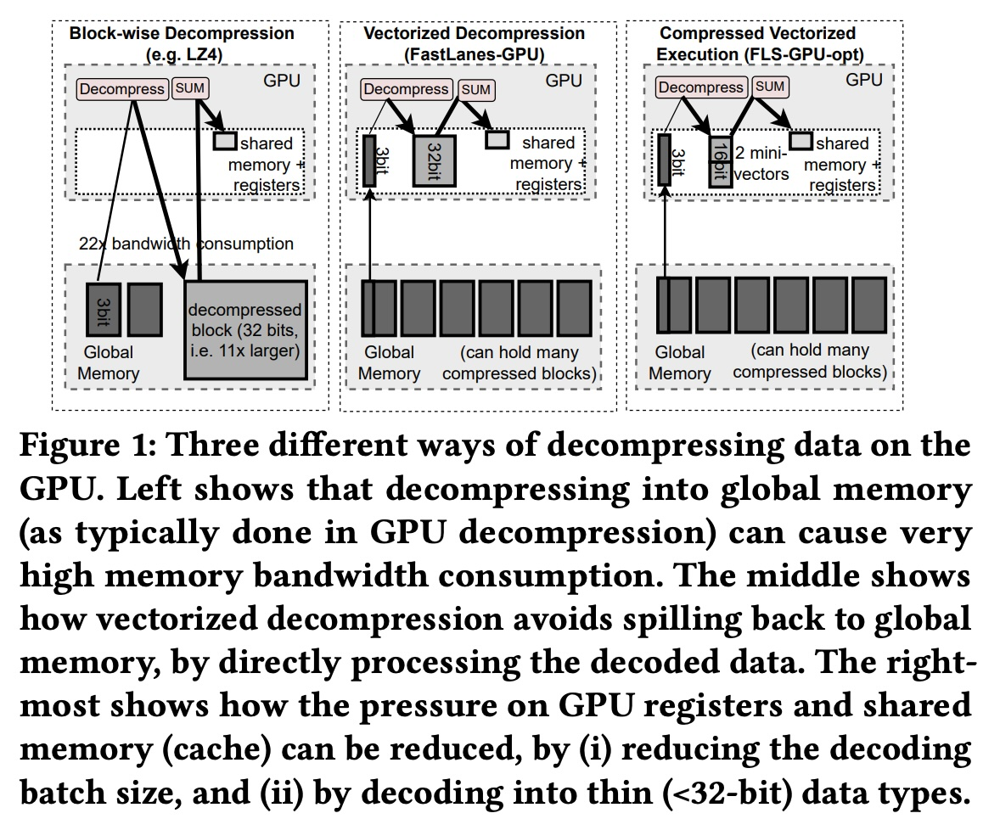
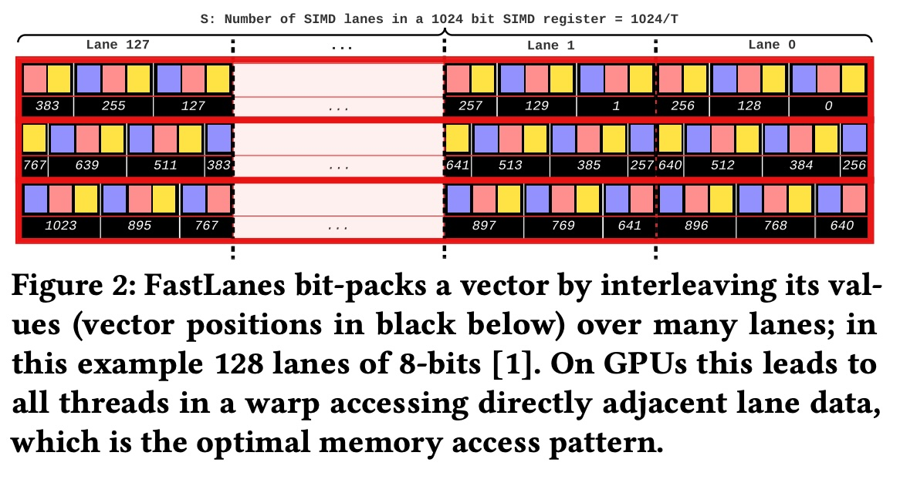
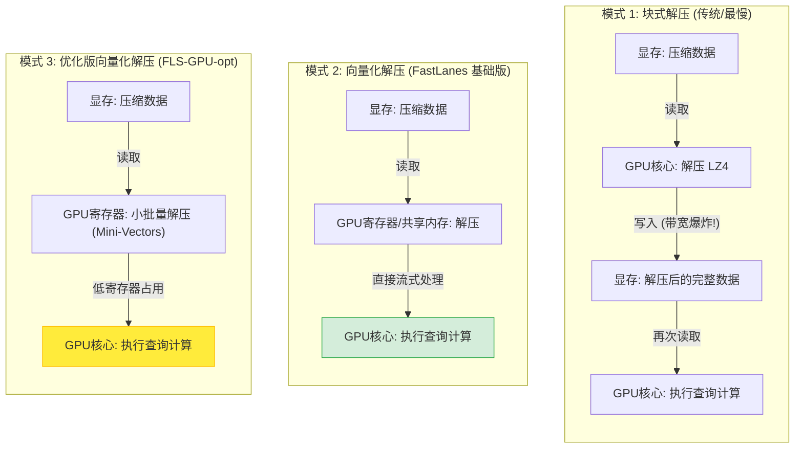
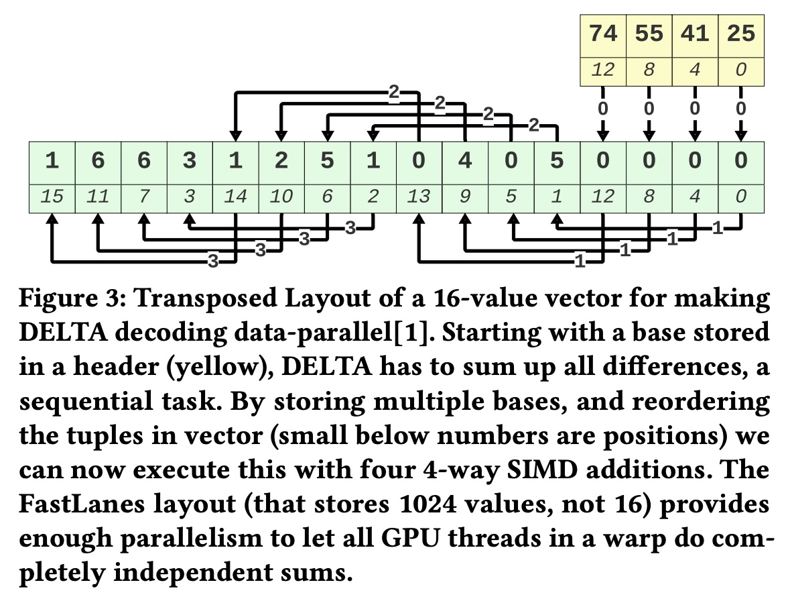
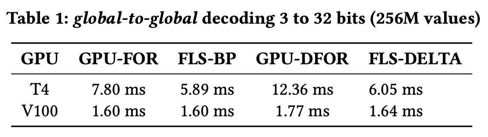
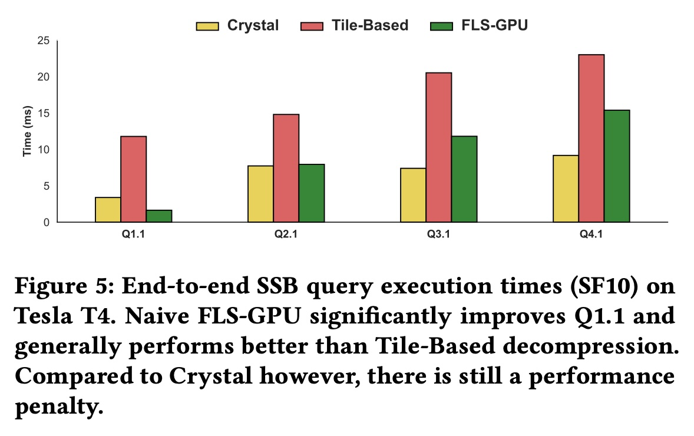

## AI论文解读 | Accelerating GPU Data Processing using FastLanes Compression
        
### 作者        
digoal        
        
### 日期        
2025-11-19        
        
### 标签        
PostgreSQL , PolarDB , DuckDB , AI , 论文解读        
        
----        
        
## 背景  
      
https://dl.acm.org/doi/pdf/10.1145/3662010.3663450        
  
提示:          
```          
读懂《Accelerating GPU Data Processing using FastLanes Compression》这篇论文需要提前掌握哪些基础知识, 请使用中文通熟易懂的讲解这些基础知识, 可以引用论文中的图、表或使用Markdown支持的图形(text,mermaid等)增加解释性. 
  
使用中文通熟易懂的解读《Accelerating GPU Data Processing using FastLanes Compression》这篇论文, 其中的关键内容请着重讲解, 可以引用论文中的图、表或使用Markdown支持的图形(text,mermaid等)增加解释性. 
  
提取《Accelerating GPU Data Processing using FastLanes Compression》这篇论文中的重要术语, 使用中文对这些术语进行通熟易懂的讲解, 可以引用论文中的图、表或使用Markdown支持的图形(text,mermaid等)增加解释性. 
```     
  
## 1 前置知识 
  
阅读这就关于 FastLanes 在 GPU 上加速数据处理的论文（《Accelerating GPU Data Processing using FastLanes Compression》），需要你建立从“数据库存储原理”到“GPU 硬件架构”的知识体系。

以下是为你整理的核心基础知识，分为三个维度进行通俗讲解：

### 1\. 列式存储与轻量级压缩 (Columnar Storage & Lightweight Compression)

这篇论文的核心是解决“如何高效解压数据”。首先你需要理解数据是怎么存的。

  * **列式存储 (Columnar Storage)：**
    传统的数据库（如 MySQL）通常按行存储（Row-oriented）。但在分析型数据库（OLAP）中，我们通常按列存储。

      * **通俗理解：** 想象一个Excel表。按行存就是把“张三, 25岁, 工程师”存一起；按列存就是把所有人的名字存一堆，所有人的年龄存一堆。
      * **论文关联：** 论文提到的 Parquet 和 ORC 都是列式格式 。因为同一列的数据类型相同（比如都是整数），非常适合压缩。

  * **轻量级压缩技术：**
    论文反复对比了通用压缩（如 LZ4）和轻量级压缩。

      * **Bit-packing (位填充)：** 比如存一列“年龄”数据，虽然计算机通常用 32位（4字节）存一个整数，但年龄通常小于 128，其实只要 7-8 位就够了。把多余的“0”去掉，挤在一起存，就是 Bit-packing 。
      * **Delta Encoding (差分编码)：** 存储相邻数值的“差值”而不是原值。比如 `[1000, 1001, 1005]` 存为 `[1000, 1, 4]`。但这有个缺点：解压时必须知道前一个数才能算后一个，有**数据依赖性 (Data Dependency)**，这对于并行计算很不友好 。
      * **RLE (行程编码)：** 如果数据有很多重复，比如 `[1, 1, 1, 1, 1]`，就存成 `(1, 5)`（1出现了5次）。这需要循环解压，容易导致 GPU 线程利用率不均 。

### 2\. GPU 硬件架构与编程模型 (GPU Architecture & CUDA)

这是读懂论文中性能分析（Micro-benchmarks）的关键。论文一直在讨论“内存带宽”、“寄存器压力”、“共享内存”等概念。

#### A. SIMT 执行模型 (Single Instruction Multiple Threads)

CPU 是为复杂的逻辑判断设计的，而 GPU 像是工厂流水线，适合同时做大量简单的重复工作。

  * **Warp (线程束)：** GPU 执行的基本单位不是单个线程，而是“Warp”（通常包含32个线程）。这32个线程必须同时执行相同的指令（Lock-step）。
  * **Divergence (分支发散)：** 如果代码里有 `if-else`，且同一个 Warp 里有的线程走 `if`，有的走 `else`，那么大家就要互相等待，性能减半。论文提到为了性能要避免这种情况 。

#### B. GPU 内存层级 (Memory Hierarchy)

论文图1 (Figure 1) 的核心就在于此。数据放在哪里，速度天差地别。    

可以使用下表来理解 GPU 内部的存储速度阶梯：

| 存储类型 | 位置 | 速度 | 容量 | 论文中的痛点/优化点 |
| :--- | :--- | :--- | :--- | :--- |
| **寄存器 (Registers)** | 每个线程私有 | 最快 | 极小 | 论文提到 FastLanes 每个线程解压 32个值会导致“寄存器溢出 (Spilling)”，拖慢速度 。 |
| **共享内存 (Shared Memory)** | 每个Block共享 | 很快 (L1缓存级) | 小 (几十KB) | 类似于用户可编程的缓存 。论文尝试把解压后的数据放这里 。 |
| **全局内存 (Global Memory)** | 显存 (DRAM) | 慢 | 大 (GB级) | **瓶颈所在。** 传统解压（如 LZ4）要把数据解压回这里，带宽消耗巨大 。 |

**Mermaid 流程图：论文提倡的数据流向对比**


*解释：论文的核心观点是，传统方法（左图）因为要把解压后的数据写回慢速的全局内存（C1），导致带宽爆炸 。FastLanes（右图）试图在寄存器或共享内存中解压并直接使用，避免写回全局内存 。*

### 3\. 并行计算难题与 FastLanes 的解法

理解了上面两点，你就能看懂论文要解决的核心矛盾了：

  * **矛盾：** 传统的轻量级压缩（如 Delta 编码）虽然压缩率高，但解压时后一个数依赖前一个数（串行依赖）。
  * **GPU 的需求：** GPU 需要所有线程互不干扰地并行工作。
  * **FastLanes 的创新：**
      * **Interleaved Bit-packing (交错位填充)：** 它不按顺序塞数据，而是把数据“交错”地分给不同的 Lane（通道/线程）。这样 GPU 的一个 Warp 读取数据时，每个线程正好读到自己需要的那部分，实现了**合并内存访问 (Coalesced Memory Access)**，这是 GPU 性能的关键 。
      * **Transposed Layout (转置布局)：** 针对 Delta 编码，它通过改变数据排列顺序，消除了数据依赖，让 SIMD/SIMT 指令可以并行计算 。

### 4\. 其他术语速查

  * **SSB (Star Schema Benchmark)：** 数据库领域常用的性能测试标准，类似于跑分软件 。
  * **Crystal:** 一个现有的高性能 GPU 数据库查询引擎原型。论文是把 FastLanes 集成到 Crystal 中去对比性能的 。
  * **Materialization (物化)：** 指把中间计算结果完整地写入内存。论文极力避免完全物化，推崇 **Vectorized Decompression**（向量化解压），即用多少解压多少，流水线作业 。
  * **Mini-vectors:** 论文提出的优化手段。原本一个线程处理 32 个值，压力太大；现在切分成小块（如 8 个值），称为 Mini-vectors，以减轻寄存器压力 。

**总结建议：**
在阅读论文时，请重点关注 **Figure 1**（解压流程对比）和 **Figure 2**（数据布局）。记住核心逻辑：**GPU 怕复杂的逻辑和内存搬运，喜欢简单粗暴的并行计算。** FastLanes 就是通过改造数据结构，把解压过程变成了 GPU 喜欢的“简单并行”任务。

  

  
  
## 2 解读论文 
  
这是一篇关于**如何在 GPU 上通过高效压缩技术加速数据处理**的学术论文解读。

这篇论文的核心观点是：**压缩不仅仅是为了节省存储空间，在 GPU 上，高效的压缩还能通过减少内存带宽瓶颈来直接加速查询执行** 。作者团队（来自 CWI）将一种原本用于 CPU 的高性能压缩库 **FastLanes** 移植到了 GPU 上，并针对 GPU 的硬件特性（特别是寄存器和内存层级）进行了深度优化。

以下是对这篇论文的通俗解读：

-----

### 1\. 核心背景：为什么 GPU 需要特殊的压缩？

GPU 的计算能力非常强大，但往往受限于**显存带宽（Memory Bandwidth）和显存容量（Global Memory）** 。

  * **传统问题：** 现有的列式存储格式（如 Parquet）通常使用块压缩（如 LZ4、Snappy）。这些算法通常需要处理较大的数据块（Block），而且解压过程包含大量依赖关系，导致 GPU 的几千个线程无法并行工作，甚至比不压缩还要慢 。
  * **Tile-Based 方法（竞品）：** 之前的研究提出了基于 Tile 的 GPU 压缩（GPU-FOR/DFOR），但作者认为其并未完全利用 GPU 的并行能力 。

**FastLanes 的思路：** 使用“交错位填充（Interleaved Bit-packing）”和“转置布局（Transposed Layout）”，消除数据间的依赖，让 GPU 的每个线程都能独立、并行地解压数据 。

-----

### 2\. 关键技术图解：三种 GPU 解压模式

论文比较了三种在 GPU 上处理压缩数据的模式，这是理解本文优化的关键（对应原论文 Figure 1）。    

我们可以通过下方的流程图来理解这三种模式的差异：



  * **模式 1 (左):** 解压后写回显存再读，导致带宽消耗激增（22倍于压缩数据），严重拖慢速度 。
  * **模式 2 (中):** **“向量化解压”** 。读入压缩数据，在寄存器中解压并直接计算，不写回显存。这是 FastLanes 的基础策略 。
  * **模式 3 (右):** **“Mini-Vectors 优化”** 。针对模式 2 中寄存器不够用的问题进行的改进（下文详述）。

-----

### 3\. 核心挑战：寄存器压力 (Register Pressure)

当作者将 CPU 版的 FastLanes 直接移植到 GPU 时（即上面的模式 2），遇到了一堵“墙”：**寄存器溢出**。

  * **现象：** FastLanes 默认一次处理 **1024** 个数值。在 GPU 的 SIMT 架构下，这意味着一个线程束（Warp，32个线程）的每个线程要处理 32 个值 。
  * **问题：** GPU 线程的私有存储空间（寄存器）非常小。如果一个线程要同时维持这 32 个解压后的值，再加上查询所需的其他数据（如哈希表），寄存器就会不够用 。
  * **后果：** 显卡被迫将数据“溢出”到慢速内存（Local Memory/L1 Cache），或者减少并发的线程块数量（低 Occupancy），导致性能大幅下降 。

论文中提到，在复杂的 SSB 查询（如 Q3.1, Q4.1）中，基础版 FLS-GPU 的性能甚至不如不压缩，主要就是因为寄存器压力导致 GPU 利用率极低（仅 12.5% - 25%）。

-----

### 4\. 解决方案：FLS-GPU-opt 与 Mini-Vectors

为了解决上述问题，作者提出了 **FLS-GPU-opt**，核心是引入了 **Mini-Vectors（微向量）** 概念。

#### 优化手段 1：Mini-Vectors

  * **原理：** 将原本一次解压 1024 个值的大任务，切分成 4 次或 8 次小任务 。
  * **效果：**
      * **FLS-GPU-128x8 (T4 显卡):** 每个线程一次只解压 **8** 个值（而不是 32 个），使用了 128 个线程。
      * **FLS-GPU-256x4 (V100 显卡):** 每个线程一次只解压 **4** 个值，使用了 256 个线程 。
  * **收益：** 这种拆分大幅降低了每个线程对寄存器的需求，使得 GPU 可以同时调度更多的线程块，从而提高了整体吞吐量 。

#### 优化手段 2：模拟 RLE 和更小的数据类型

  * **压缩执行 (Compressed Execution):** 尝试将数据解压为 8-bit 或 16-bit 的小整数而不是标准的 32-bit 整数，以节省寄存器空间 。
  * **模拟 RLE:** 虽然 CUDA 版暂未实现 RLE 编码，但作者通过对数据排序（Sorting）来模拟 Run-Length Encoding 的效果，进一步提高了压缩率和性能 。

-----

### 5\. 实验结果：快了吗？

作者在 NVIDIA T4 和 V100 两款显卡上进行了测试，主要对比了 **Crystal**（未压缩基准）和 **Tile-Based**（竞品压缩）。

#### 微基准测试 (Micro-benchmarks)

  * **纯算力：** FastLanes 的解压速度极快。在 Bit-packing 解压上，比 GPU-FOR 快 **3-4倍**；在 DELTA 解压上，比 GPU-DFOR 快 **4-5倍** 。
  * 这证明了 FastLanes 的数据并行布局非常适合 GPU 架构。

#### 端到端查询 (SSB Benchmark)

  * **简单查询 (Q1.1 - 扫描密集型):**
      * 这是压缩技术最能发挥优势的场景。
      * **FastLanes (FLS-GPU-opt)** 显著击败了所有对手，包括未压缩的 Crystal。在 T4 显卡上，从 3.39ms 降到了 1.19ms，**速度提升近 3 倍** 。
  * **复杂查询 (Q2.1 - Q4.1 - 含 Join):**
      * 初始版本 (FLS-GPU) 因为寄存器压力表现不佳。
      * 优化版本 (FLS-GPU-opt) 通过 Mini-Vectors 恢复了性能，在大多数情况下追平或略微超过未压缩的基准，并显著优于 Tile-Based 方法 。

-----

### 6\. 总结与下一步建议

**核心结论：**

1.  **压缩即加速：** 在 GPU 上，如果解压速度足够快且不回写显存，压缩可以直接提升端到端查询速度 。
2.  **架构匹配至关重要：** 直接照搬 CPU 的算法（1024值/次）会“撑爆” GPU 寄存器。必须针对 GPU 的“许多小线程”特性，使用 **Mini-Vectors** 进行细粒度拆分 。
3.  **FastLanes 的优势：** 相比传统的 GPU 压缩，FastLanes 的并行度更高，计算效率更好。

**下一步可以为您做什么：**
如果您对如何在自己的 GPU 数据处理流水线中应用这种思想感兴趣，我可以为您：

1.  **解释 FastLanes 具体的位填充（Bit-packing）代码逻辑**，展示它是如何实现无依赖并行的。
2.  **深入分析论文中提到的 "Transposed Layout"** 是如何具体消除 DELTA 编码的依赖性的（这在处理时序数据时非常有用）。
3.  **提取论文中的性能数据表**，帮您做更详细的特定硬件（如 T4 vs V100）选型对比。
  
## 3 术语 
  
基于这篇论文《Accelerating GPU Data Processing using FastLanes Compression》，我提取了其中的核心术语，并按照逻辑关系进行了分类和通俗化解读。

-----

### 1\. 核心架构与执行模式

#### **Vectorized Decompression (向量化解压)**

  * **通俗解释：** 想象你在做饭（数据处理）。传统的做法（Block-wise）是先把所有的菜都从冰箱（显存）拿出来，全部切好（解压），堆满整个案板（写回显存），然后再开始炒菜。这不仅占地方，还很慢。
    **向量化解压**则是“切一点，炒一点”。从显存读取压缩数据后，直接在 GPU 核心的小缓存（寄存器）里解压，然后立刻进行计算，**不把解压后的数据写回慢速的显存**。
  * **论文依据：** 论文指出这种方法避免了中间数据溢出到 Global Memory，大幅减少了内存带宽消耗 。
  * **图解 (参考论文 Figure 1):**    
    ```mermaid
    flowchart LR
        subgraph Bad [传统方式: 显存压力大]
            A[压缩数据] -->|读| B(解压)
            B -->|写回| C[解压后的庞大数据]
            C -->|再读| D(计算/求和)
        end
        subgraph Good [向量化解压: 高效]
            X[压缩数据] -->|读| Y(解压到寄存器)
            Y -->|直接流向| Z(计算/求和)
        end
    ```

#### **SIMT (Single-Instruction-Multiple-Threads)**

  * **通俗解释：** 这是 GPU 的工作方式，意为“单指令多线程”。就像一个教官（控制单元）喊口令“向前一步走”，面前的 32 个士兵（线程）必须同时做这个动作。
  * **关键点：** 如果这 32 个士兵要处理的数据完全不一样（例如有的要走，有的要跑），效率就会变低。FastLanes 的设计目标就是让这 32 个线程能整齐划一地并行解压数据 。

-----

### 2\. 数据布局与编码技术

#### **Interleaved Bit-packing (交错位填充)**

  * **通俗解释：** \* **普通位填充：** 像是把连环画一页页按顺序贴在一起。当你需要同时看第1页、第2页、第3页时，你需要跳着翻阅。
      * **交错位填充：** 像是把32本连环画拆散，把所有书的“第1页”拼在一起，所有书的“第2页”拼在一起。
      * **在 GPU 上：** 这样设计后，GPU 的 32 个线程可以一次性并排抓取 32 个相邻的数据，这叫**合并内存访问 (Coalesced Memory Access)**，是 GPU 速度快的最重要原因之一 。
  * **论文图示引用：** 论文 **Figure 2** 展示了这种将数据交错分布在不同“车道 (Lanes)”上的方式 。    

#### **Transposed Layout (转置布局)**

  * **通俗解释：** \* **问题：** 很多压缩算法（如 Delta 差分编码）是有依赖的。比如要算第2个数，必须知道第1个数；算第3个，要知道第2个。这在 CPU 上没问题，但在 GPU 上会导致线程互相等待，无法并行。
      * **解决：** **转置布局**通过重新排列数据，打断了这种依赖链。它把原本前后依赖的一长串数字，变成了多组独立的短数字，让 GPU 的每个线程可以独立计算自己的“那一份”，互不干扰 。
  * **图解 (基于论文 Figure 3):**    
    > 原本： $1 \rightarrow 2 \rightarrow 3 \rightarrow 4$ (必须按顺序解)  
    > 转置后：  
    > 线程A: $1, 5, 9...$ (独立计算)  
    > 线程B: $2, 6, 10...$ (独立计算)  

-----

### 3\. 瓶颈与优化术语

#### **Register Pressure (寄存器压力)**

  * **通俗解释：** 每个 GPU 线程都有一个私有的“小背包”（寄存器），用来存放当前正在处理的数据。这个背包非常小（通常只有几十到几百个 32-bit 的空间）。
  * **论文发现：** 基础版的 FastLanes 试图让一个线程一次处理太多数据（32个值），导致“背包”撑爆了。一旦撑爆，数据就得放到慢速内存里，或者 GPU 只能同时运行很少的线程，导致性能暴跌 。这就是所谓的“寄存器压力”。

#### **Mini-Vectors (微向量)**

  * **通俗解释：** 这是作者为了解决“寄存器压力”提出的核心优化。
      * **原方案：** 一个线程一次吞下 32 个数据（对应整个 Warp 处理 1024 个值）。
      * **Mini-Vectors：** 把大餐切小。一个线程一次只吃 8 个甚至 4 个数据（即 128x8 或 256x4 配置）。
  * **效果：** 虽然处理次数变多了，但每次占用的“背包空间”变小了，GPU 就可以同时调度更多的线程来工作，整体处理速度反而变快了 。

#### **Compressed Execution (压缩执行)**

  * **通俗解释：** 通常 GPU 喜欢处理标准的 32 位整数。但如果数据实际上都很小（比如年龄、月份），解压成 32 位就是浪费。
  * **做法：** 保持数据在寄存器里是 8 位或 16 位的状态进行计算，而不是还原成 32 位。这样可以在一个 32 位的寄存器里塞进 4 个 8 位的数据，变相扩大了寄存器容量 。

-----

### 4\. 总结图表

| 术语 | 核心作用 | 论文中的关键结论 |
| :--- | :--- | :--- |
| **FastLanes** | 基础库 | 将 CPU 上的数据并行优势带入 GPU 。 |
| **Vectorized Decompression** | 节省带宽 | 避免了解压数据写回显存的巨大开销 。 |
| **Interleaved Bit-packing** | 内存优化 | 确保存储布局符合 GPU 的合并访问模式 。 |
| **Mini-Vectors** | 解决瓶颈 | 通过减小处理粒度，缓解寄存器压力，提升并发度 。 |

**我接下来可以为您做的：**
既然您已经了解了这些核心术语，您是否想让我**结合论文中的实验数据（如 Table 1 或 Figure 5），具体分析一下“Mini-Vectors”优化到底带来了多少性能提升？** 这能帮您更直观地评估该技术的实际价值。  

  

  
  
## 参考        
         
https://dl.acm.org/doi/pdf/10.1145/3662010.3663450    
        
<b> 以上内容基于DeepSeek、Qwen、Gemini及诸多AI生成, 轻微人工调整, 感谢杭州深度求索人工智能、阿里云、Google等公司. </b>        
        
<b> AI 生成的内容请自行辨别正确性, 当然也多了些许踩坑的乐趣, 毕竟冒险是每个男人的天性.  </b>        
    
#### [PolarDB 学习图谱](https://www.aliyun.com/database/openpolardb/activity "8642f60e04ed0c814bf9cb9677976bd4")
  
  
#### [PostgreSQL 解决方案集合](../201706/20170601_02.md "40cff096e9ed7122c512b35d8561d9c8")
  
  
#### [德哥 / digoal's Github - 公益是一辈子的事.](https://github.com/digoal/blog/blob/master/README.md "22709685feb7cab07d30f30387f0a9ae")
  
  
#### [About 德哥](https://github.com/digoal/blog/blob/master/me/readme.md "a37735981e7704886ffd590565582dd0")
  
  

  
