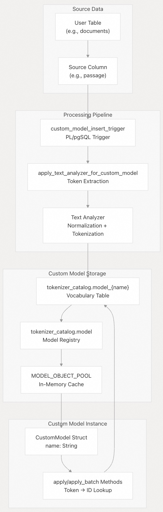
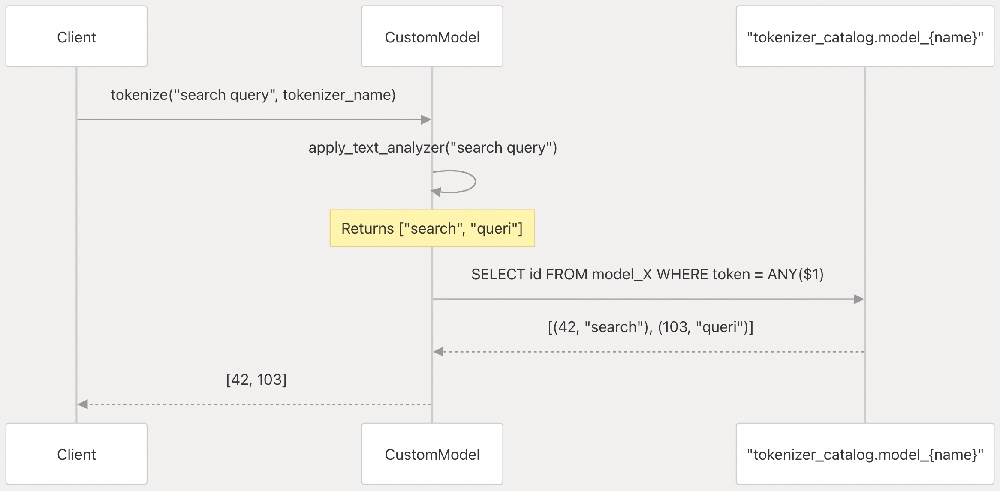
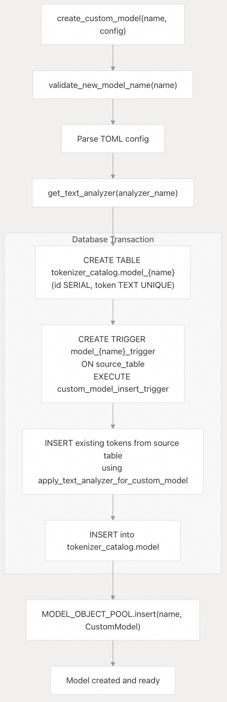

## pg_tokenizer 源码学习: 5.1 自定义模型 (Custom Models)  
  
### 作者  
digoal  
  
### 日期  
2025-11-19  
  
### 标签  
pg\_tokenizer , 词化 , bert , 标记化 , Tokenization  
  
----  
  
## 背景  
本文解释了如何在 `pg_tokenizer` 中创建和使用**自定义模型 (Custom Models)**。自定义模型从存储在数据库表中的您自己的**语料库 (corpus)** 中动态构建**词汇表 (vocabularies)**，从而实现适应您数据的**领域特定分词 (domain-specific tokenization)**。  
  
## 概述 (Overview)  
  
自定义模型是**基于语料库 (corpus-based)** 的分词器模型，它们直接从存储在您的 **PostgreSQL** 数据库中的数据构建其词汇表。与具有固定词汇表的**内置模型 (built-in models)**（BERT、llmlingua2）或 **HuggingFace** 模型不同，自定义模型具有以下特点：  
  
  * 从指定的表和列中提取词汇表 (**vocabulary**)  
  * 通过数据库**触发器 (database triggers)** 在源数据更改时自动更新  
  * 应用**文本分析器 (text analyzer)** 来规范化 (normalize) 和分词 (tokenize) 源文本  
  * 将词汇表存储在 `tokenizer_catalog` **模式 (schema)** 中的专用表中  
  * 通过查找词汇表中的**词元 (tokens)** 来返回**整数嵌入 (integer embeddings)**  
  
**关键特征 (Key Characteristics):**  
  
| 特征 (Characteristic) | 自定义模型 (Custom Models) | 内置/HuggingFace 模型 (Built-in/HuggingFace Models) |  
| :--- | :--- | :--- |  
| 词汇表来源 (Vocabulary Source) | 数据库表/列 (Database table/column) | 预训练文件 (Pre-trained files) |  
| 词汇表更新 (Vocabulary Updates) | 通过触发器动态 (Dynamic via triggers) | 固定 (Fixed) |  
| 存储位置 (Storage Location) | `tokenizer_catalog."model_{name}"` 表 | 内存缓存 (In-memory cache) |  
| 配置 (Configuration) | 带有表/列/分析器的 **TOML** 格式 | 预定义或 `tokenizers.json` |  
| 用例 (Use Case) | **领域特定语料库 (Domain-specific corpora)** | **通用文本 (General-purpose text)** |  
  
来源: [`src/model/custom.rs` 1-357](https://github.com/tensorchord/pg_tokenizer.rs/blob/d3f7a577/src/model/custom.rs#L1-L357)  
  
## 架构 (Architecture)  
  
### 自定义模型组件 (Custom Model Components)  
  
  
  
**图表：自定义模型架构和数据流 (Custom Model Architecture and Data Flow)**  
  
该架构由三个主要组件组成：  
  
1.  **词汇表存储 (Vocabulary Storage)**：每个自定义模型都会创建一个表 `tokenizer_catalog."model_{name}"`，其中包含 `id`（自增整数）和 `token`（唯一文本）列。  
2.  **自动更新 (Automatic Updates)**：数据库**触发器 (Database triggers)** 监控源表，并在数据插入或更新时自动将新词元插入到词汇表。  
3.  **词元解析 (Token Resolution)**：`CustomModel::apply()` 和 `apply_batch()` 方法查询词汇表，将词元转换为整数 **ID**。  
  
来源: [`src/model/custom.rs` 15-68](https://github.com/tensorchord/pg_tokenizer.rs/blob/d3f7a577/src/model/custom.rs#L15-L68) [`src/model/custom.rs` 104-135](https://github.com/tensorchord/pg_tokenizer.rs/blob/d3f7a577/src/model/custom.rs#L104-L135)  
  
### 词元查找过程 (Token Lookup Process)  
  
  
  
**图表：词元到 ID 的解析流程 (Token to ID Resolution Flow)**  
  
使用自定义模型对文本进行分词时：  
  
1.  **文本分析器 (The text analyzer)** 处理输入文本以生成**规范化的词元 (normalized tokens)**  
2.  `apply_batch()` 使用 `WHERE token = ANY($1)` 查询词汇表以匹配词元，实现高效的**批量查找 (batch lookup)**  
3.  结果被映射回去以保留词元顺序  
4.  在词汇表中未找到的词元将从输出中省略  
  
来源: [`src/model/custom.rs` 28-68](https://github.com/tensorchord/pg_tokenizer.rs/blob/d3f7a577/src/model/custom.rs#L28-L68)  
  
## 创建自定义模型 (Creating a Custom Model)  
  
### 配置结构 (Configuration Structure)  
  
自定义模型需要一个包含三个字段的 **TOML** 配置：  
  
```  
table = 'source_table_name'  
column = 'source_column_name'  
text_analyzer = 'analyzer_name'  
```  
  
**配置字段 (Configuration Fields):**  
  
| 字段 (Field) | 类型 (Type) | 描述 (Description) | 约束 (Constraints) |  
| :--- | :--- | :--- | :--- |  
| `table` | 字符串 (String) | 包含语料库数据的源表名称 | 必须存在 (Must exist) |  
| `column` | 字符串 (String) | 包含要分词的文本的列名称 | 不能包含 `$col$` |  
| `text_analyzer` | 字符串 (String) | 要应用于源文本的文本分析器名称 | 必须存在 (Must exist) |  
  
`CustomModelConfig` **结构体 (struct)** 会验证这些字段，并确保文本分析器在模型创建之前存在。  
  
来源: [`src/model/custom.rs` 70-86](https://github.com/tensorchord/pg_tokenizer.rs/blob/d3f7a577/src/model/custom.rs#L70-L86)  
  
### 创建过程 (Creation Process)  
  
  
  
**图表：自定义模型创建工作流程 (Custom Model Creation Workflow)**  
  
`create_custom_model()` 函数在一个**事务 (transaction)** 中执行以下步骤：  
  
1.  **验证 (Validation)** ([`src/model/custom.rs` 95-102](https://github.com/tensorchord/pg_tokenizer.rs/blob/d3f7a577/src/model/custom.rs#L94-L157))：验证模型名称的唯一性和配置格式  
2.  **词汇表 (Vocabulary Table)** (`src/model/custom.rs` 104-112)：创建带有 `id` 和 `token` 列的 `tokenizer_catalog."model_{name}"`  
3.  **触发器设置 (Trigger Setup)** (`src/model/custom.rs` 113-122)：在源表上创建 `BEFORE INSERT OR UPDATE` 触发器  
4.  **初始填充 (Initial Population)** (`src/model/custom.rs` 123-135)：提取并插入源表中所有现有的词元  
5.  **注册 (Registration)** (`src/model/custom.rs` 136-156)：插入模型**元数据 (metadata)** 并将其添加到 `MODEL_OBJECT_POOL`  
  
如果任何步骤失败，事务将完全**回滚 (rolls back)** 。  
  
来源: [`src/model/custom.rs` 94-157](https://github.com/tensorchord/pg_tokenizer.rs/blob/d3f7a577/src/model/custom.rs#L94-L157)  
  
### 示例：创建自定义模型 (Example: Creating a Custom Model)  
  
```sql  
-- Step 1: Create source table with corpus data  
CREATE TABLE documents (  
    id SERIAL PRIMARY KEY,  
    passage TEXT  
);  
  
INSERT INTO documents (passage) VALUES  
  ('PostgreSQL is a powerful database system.'),  
  ('Full-text search is supported in PostgreSQL.'),  
  ('BM25 ranking improves search relevance.');  
  
-- Step 2: Create text analyzer for preprocessing  
SELECT tokenizer_catalog.create_text_analyzer('doc_analyzer', $$  
pre_tokenizer = "unicode_segmentation"  
[[character_filters]]  
to_lowercase = {}  
[[token_filters]]  
stopwords = "nltk_english"  
[[token_filters]]  
stemmer = "english_porter2"  
$$);  
  
-- Step 3: Create custom model from the corpus  
SELECT tokenizer_catalog.create_custom_model('doc_model', $$  
table = 'documents'  
column = 'passage'  
text_analyzer = 'doc_analyzer'  
$$);  
  
-- Step 4: Create tokenizer using the custom model  
SELECT tokenizer_catalog.create_tokenizer('doc_tokenizer', $$  
text_analyzer = 'doc_analyzer'  
model = 'doc_model'  
$$);  
```  
  
创建后，词汇表 `tokenizer_catalog."model_doc_model"` 包含如下条目：  
  
| id | token |  
| :--- | :--- |  
| 1 | postgresql |  
| 2 | power |  
| 3 | databas |  
| 4 | system |  
| 5 | search |  
| ... | ... |  
  
来源: [`tests/sqllogictest/custom_model.slt` 1-53](https://github.com/tensorchord/pg_tokenizer.rs/blob/d3f7a577/tests/sqllogictest/custom_model.slt#L1-L53)  
  
## 使用自定义模型 (Using Custom Models)  
  
### 使用自定义模型进行分词 (Tokenization with Custom Models)  
  
一旦创建，自定义模型的功能与其他模型类型完全相同：  
  
```sql  
-- Tokenize a single text  
SELECT tokenizer_catalog.tokenize('PostgreSQL search system', 'doc_tokenizer');  
-- Returns: {1,5,4} (IDs from vocabulary table)  
  
-- Tokenize multiple rows  
SELECT id, passage, tokenizer_catalog.tokenize(passage, 'doc_tokenizer') AS tokens  
FROM documents;  
```  
  
`CustomModel::apply_batch()` 方法使用 **PostgreSQL** 的 `ANY` **数组运算符 (array operator)** 来优化多词元查找：  
  
```rust  
let query = format!(  
    r#"SELECT id, token FROM tokenizer_catalog."model_{}" WHERE token = ANY($1)"#,  
    self.name  
);  
```  
  
这在单个数据库查询中检索所有匹配的词元，然后将结果映射回输入词元顺序。  
  
来源: [`src/model/custom.rs` 44-68](https://github.com/tensorchord/pg_tokenizer.rs/blob/d3f7a577/src/model/custom.rs#L44-L68)  
  
### 词汇表的自动更新 (Automatic Vocabulary Updates)  
  
自定义模型通过**触发器 (triggers)** 自动维护其词汇表。当插入或更新源数据时：  
  
```sql  
-- New row automatically updates vocabulary  
INSERT INTO documents (passage)  
VALUES ('Machine learning in PostgreSQL databases.');  
  
-- The trigger extracts new tokens: "machin", "learn", "databas"  
-- and inserts them into tokenizer_catalog."model_doc_model"  
```  
  
`custom_model_insert_trigger` **PL/pgSQL 函数 (PL/pgSQL function)** ([`src/model/custom.rs` 223-249](https://github.com/tensorchord/pg_tokenizer.rs/blob/d3f7a577/src/model/custom.rs#L223-L249))：  
  
1.  将配置的**文本分析器 (text analyzer)** 应用于新的/更新的列值  
2.  识别尚未在词汇表中的词元  
3.  使用 `ON CONFLICT DO NOTHING` 插入新词元以处理**并发插入 (concurrent inserts)**  
  
这确保了词汇表随着您的数据**有机增长 (grows organically)**。  
  
来源: [`src/model/custom.rs` 113-122](https://github.com/tensorchord/pg_tokenizer.rs/blob/d3f7a577/src/model/custom.rs#L113-L122) [`src/model/custom.rs` 223-249](https://github.com/tensorchord/pg_tokenizer.rs/blob/d3f7a577/src/model/custom.rs#L223-L249)  
  
## 辅助函数：完整设置 (Convenience Function: Complete Setup)  
  
`create_custom_model_tokenizer_and_trigger()` 函数为常见用例提供了**一步式设置 (single-step setup)**：  
  
```sql  
SELECT tokenizer_catalog.create_custom_model_tokenizer_and_trigger(  
    'my_tokenizer',      -- tokenizer name  
    'my_model',          -- model name  
    'my_analyzer',       -- text analyzer name  
    'my_table',          -- source table  
    'source_col',        -- source column  
    'target_col'         -- target column for embeddings  
);  
```  
  
此函数执行以下操作：  
  
1.  `create_custom_model()` - 从源表/列创建模型  
2.  `create_tokenizer()` - 使用该模型创建一个**分词器 (tokenizer)**  
3.  `UPDATE` 语句 - 用初始**嵌入 (embeddings)** 填充目标列  
4.  `CREATE TRIGGER` - 通过 `custom_model_tokenizer_set_target_column_trigger` 设置**自动嵌入更新 (automatic embedding updates)**  
  
每当 `source_col` 被插入或更新时，该触发器都会自动维护 `target_col` 的嵌入。这对于维护与源文本并行的**嵌入列 (embedding columns)** 非常有用，类似于使用触发器进行自动嵌入 (Automatic Embeddings with Triggers) 章节中描述的模式 (pattern)。  
  
来源: [`src/model/custom.rs` 251-272](https://github.com/tensorchord/pg_tokenizer.rs/blob/d3f7a577/src/model/custom.rs#L251-L272) [`src/model/custom.rs` 274-335](https://github.com/tensorchord/pg_tokenizer.rs/blob/d3f7a577/src/model/custom.rs#L274-L335)  
  
## 词元长度限制 (Token Length Limits)  
  
自定义模型强制执行最大词元长度为 2600 个字符，以防止性能问题：  
  
```  
const MAX_TOKEN_LENGTH: usize = 2600;  
```  
  
`apply_text_analyzer_for_custom_model()` 函数会自动拆分**超大词元 (oversized tokens)**：  
  
```  
if token_len > MAX_TOKEN_LENGTH {  
    pgrx::warning!("There is a custom table token whose length has exceeded MAX_TOKEN_LENGTH...");  
  
    let replace_token = results[i][..MAX_TOKEN_LENGTH].to_string();  
    let token = std::mem::replace(&mut results[i], replace_token);  
    for j in 1..(token.len().div_ceil(MAX_TOKEN_LENGTH)) {  
        results.push(token[j * MAX_TOKEN_LENGTH..][..MAX_TOKEN_LENGTH].to_string());  
    }  
}  
```  
  
如果一个词元超过此限制，它将被拆分成多个 2600 字符的**块 (chunks)**。如果需要更长的词元，则会记录一条警告，建议用户提出 **Issue**。  
  
来源: [`src/model/custom.rs` 199-221](https://github.com/tensorchord/pg_tokenizer.rs/blob/d3f7a577/src/model/custom.rs#L199-L221)  
  
## 丢弃自定义模型 (Dropping Custom Models)  
  
要删除自定义模型：  
  
```  
SELECT tokenizer_catalog.drop_custom_model('doc_model');  
```  
  
`drop_custom_model()` 函数执行**清理 (cleanup)**：  
  
1.  验证模型名称和类型  
2.  从源表**丢弃 (Drops)** 所有**关联的触发器 (associated triggers)**  
3.  丢弃词汇表 `tokenizer_catalog."model_{name}"`  
4.  从 `tokenizer_catalog.model` 中删除模型条目  
5.  从 `MODEL_OBJECT_POOL` 中移除模型  
  
**重要提示：** 正在使用已丢弃模型的**分词器 (Tokenizers)** 将会失败并报错。在丢弃模型之前，请确保没有活动的**分词器 (tokenizers)** 引用该模型。  
  
来源: [`src/model/custom.rs` 159-197](https://github.com/tensorchord/pg_tokenizer.rs/blob/d3f7a577/src/model/custom.rs#L159-L197)  
  
## 限制与考量 (Limitations and Considerations)  
  
### 性能影响 (Performance Implications)  
  
| 考量因素 (Consideration) | 影响 (Impact) | 缓解措施 (Mitigation) |  
| :--- | :--- | :--- |  
| **触发器开销 (Trigger overhead)** | 源表上的每次 `INSERT`/`UPDATE` 都会执行文本分析器 | 使用**批量插入 (batch inserts)**；对于批量更新，考虑**定期重建 (periodic rebuilds)** |  
| **词汇表增长 (Vocabulary table growth)** | 唯一词元数量**无限制增长 (Unbounded growth)** | 监控表大小；考虑**词汇表剪枝策略 (vocabulary pruning strategies)** |  
| **查找查询 (Lookup queries)** | 每次分词都会查询词汇表 | 在 `token` 列上建立**索引 (Indexes)**（通过 `UNIQUE` 约束自动创建） |  
| **内存使用 (Memory usage)** | `MODEL_OBJECT_POOL` 缓存模型对象 | 仅限于**元数据 (metadata)**；词汇表保留在数据库中 |  
  
### 配置约束 (Configuration Constraints)  
  
  * **列名限制 (Column name restriction)**：源列名称不能包含 `$col$` (在 [`src/model/custom.rs` 80-85](https://github.com/tensorchord/pg_tokenizer.rs/blob/d3f7a577/src/model/custom.rs#L80-L85) 中验证)  
  * **文本分析器要求 (Text analyzer requirement)**：指定的文本分析器必须在模型创建之前存在  
  * **表可见性 (Table visibility)**：源表必须在当前事务中可访问  
  * **标识符引用 (Identifier quoting)**：表名和列名通过 `quote_identifier()` 自动引用以处理特殊字符  
  
### 事务隔离 (Transaction Isolation)  
  
自定义模型的创建和词汇表更新发生在**事务 (transactions)** 内部，但：  
  
  * 来自**并发事务 (concurrent transactions)** 的词汇表更新可能会**交错 (interleave)**  
  * `ON CONFLICT DO NOTHING` 可防止错误，但可能导致 **ID 分配间隙 (ID assignment gaps)**  
  * `custom_model_insert_trigger` 在**触发事务 (triggering transaction)** 的上下文中运行  
  
### 预加载支持 (Preloading Support)  
  
自定义模型支持在服务器启动时**预加载 (preloading)** (参见模型预加载 (Model Preloading)章节)。模型配置和词汇表必须存在于 `tokenizer_catalog` 模式中才能成功预加载。  
  
来源: [`src/model/custom.rs` 70-86](https://github.com/tensorchord/pg_tokenizer.rs/blob/d3f7a577/src/model/custom.rs#L70-L86) [`src/model/custom.rs` 94-157](https://github.com/tensorchord/pg_tokenizer.rs/blob/d3f7a577/src/model/custom.rs#L94-L157)  
  
## 关键函数和代码实体 (Key Functions and Code Entities)  
  
| 函数/类型 (Function/Type) | 位置 (Location) | 目的 (Purpose) |  
| :--- | :--- | :--- |  
| `CustomModel` | [`src/model/custom.rs` 15-26](https://github.com/tensorchord/pg_tokenizer.rs/blob/d3f7a577/src/model/custom.rs#L15-L26) | 表示自定义模型**实例 (instance)** 的 **Rust 结构体 (struct)** |  
| `CustomModelConfig` | [`src/model/custom.rs` 70-86](https://github.com/tensorchord/pg_tokenizer.rs/blob/d3f7a577/src/model/custom.rs#L70-L86) | 带有**验证 (validation)** 的 **TOML** 配置结构 |  
| `create_custom_model()` | [`src/model/custom.rs` 94-157](https://github.com/tensorchord/pg_tokenizer.rs/blob/d3f7a577/src/model/custom.rs#L94-L157) | 创建自定义模型的 **SQL 函数 (SQL function)** |  
| `drop_custom_model()` | [`src/model/custom.rs` 159-197](https://github.com/tensorchord/pg_tokenizer.rs/blob/d3f7a577/src/model/custom.rs#L159-L197) | 移除自定义模型的 **SQL 函数** |  
| `apply_text_analyzer_for_custom_model()` | [`src/model/custom.rs` 201-221](https://github.com/tensorchord/pg_tokenizer.rs/blob/d3f7a577/src/model/custom.rs#L201-L221) | 应用带有**词元长度限制 (token length limits)** 的文本分析器 |  
| `custom_model_insert_trigger` | [`src/model/custom.rs` 223-249](https://github.com/tensorchord/pg_tokenizer.rs/blob/d3f7a577/src/model/custom.rs#L223-L249) | 用于词汇表更新的 **PL/pgSQL 触发器 (trigger)** |  
| `create_custom_model_tokenizer_and_trigger()` | [`src/model/custom.rs` 251-272](https://github.com/tensorchord/pg_tokenizer.rs/blob/d3f7a577/src/model/custom.rs#L251-L272) | 用于完整设置的**辅助函数 (Convenience function)** |  
| `custom_model_tokenizer_set_target_column_trigger` | [`src/model/custom.rs` 274-335](https://github.com/tensorchord/pg_tokenizer.rs/blob/d3f7a577/src/model/custom.rs#L274-L335) | 用于**自动嵌入列更新 (automatic embedding column updates)** 的 **Rust 触发器** |  
| `MODEL_OBJECT_POOL` | 在 [`src/model/custom.rs` 13](https://github.com/tensorchord/pg_tokenizer.rs/blob/d3f7a577/src/model/custom.rs#L13-L13) 中引用 | **全局内存缓存 (Global in-memory cache)** (在父模块中定义) |  
  
来源: [`src/model/custom.rs` 1-357](https://github.com/tensorchord/pg_tokenizer.rs/blob/d3f7a577/src/model/custom.rs#L1-L357)  
  
# 附录: 自定义模型的词汇表修剪功能  
  
自定义模型的核心优势在于其**动态词汇表 (Dynamic Vocabulary)** 和对新词元的**自动更新 (Automatic Updates)**。然而，文档的‘限制与考量’部分明确指出‘词汇表增长’是性能影响之一，并建议‘考虑词汇表剪枝策略 (vocabulary pruning strategies)’。  
  
请问在 `pg_tokenizer.rs` 的现有设计或未来规划中，是否有提供**内置的机制或 SQL 函数**来执行以下操作：  
  
1.  **定期修剪 (Pruning)** 词汇表，例如删除那些在源语料库中**出现频率极低（低频词）** 且超过一定时间没有被使用的词元 (tokens)？  
2.  在删除旧词元后，如何**安全且高效地处理**那些在词汇表中**对应的 ID 被移除或产生间隙** 的情况，以避免影响已生成的嵌入 (embeddings) 的有效性？  
  
解决词汇表无限增长的问题，是确保自定义模型在大型、不断变化的数据集上维持长期性能的关键。  
  
## Answer  
  
您询问的是 `pg_tokenizer.rs` 中自定义模型的词汇表修剪功能。  
  
**当前状态：没有内置的词汇表修剪机制**  
  
根据代码库分析,`pg_tokenizer.rs` 目前**不提供**任何内置的词汇表修剪功能或 SQL 函数。 自定义模型的实现仅包含创建和删除操作,没有针对词汇表维护的功能。  
  
文档中提到的"考虑词汇表剪枝策略"只是一个建议,并非指向现有功能。  
  
**词汇表结构的限制**  
  
自定义模型的词汇表存储在 `tokenizer_catalog."model_{name}"` 表中, 使用自增 ID:  
  
```sql  
CREATE TABLE tokenizer_catalog."model_{name}" (  
    id int GENERATED BY DEFAULT AS IDENTITY,  
    token TEXT NOT NULL UNIQUE  
);  
```  
  
这种设计存在根本性问题:  
1. **ID 不可重用**: 删除词元后, 其 ID 会永久空缺  
2. **嵌入失效**: 已生成的嵌入(如 `{1,5,4}`)在删除对应词元后会变成无效引用  
3. **无使用频率追踪**: 系统不记录词元的使用频率或最后使用时间  
  
**为什么没有修剪功能**  
  
从架构设计来看, 修剪功能会破坏系统的核心假设:  
1. `CustomModel::apply_batch()` 直接查询词汇表进行 token-to-ID 映射  
2. 已存储的嵌入数组(如 `embedding INT[]` 列)依赖于词汇表 ID 的稳定性  
3. 删除词元会导致所有引用该 ID 的嵌入失效,无法追溯修复  
  
**可能的解决方案(需要自行实现)**  
  
如果您需要词汇表修剪,可以考虑:  
1. **手动 SQL 操作**: 直接操作 `tokenizer_catalog."model_{name}"` 表, 但这会使现有嵌入失效  
2. **重建模型**: 使用 `drop_custom_model()` 删除旧模型,然后用清理后的数据重新创建  
3. **外部维护脚本**: 定期分析词汇表使用情况并重建模型  
  
## Notes  
  
这是一个已知的架构限制。文档中提到的"词汇表剪枝策略"是对用户的建议, 而非系统功能。如果您的使用场景需要长期维护大型动态词汇表, 可能需要考虑定期重建模型或使用预训练模型(如 `bert_base_uncased`)来避免词汇表无限增长的问题。  
    
#### [PolarDB 学习图谱](https://www.aliyun.com/database/openpolardb/activity "8642f60e04ed0c814bf9cb9677976bd4")
  
  
#### [PostgreSQL 解决方案集合](../201706/20170601_02.md "40cff096e9ed7122c512b35d8561d9c8")
  
  
#### [德哥 / digoal's Github - 公益是一辈子的事.](https://github.com/digoal/blog/blob/master/README.md "22709685feb7cab07d30f30387f0a9ae")
  
  
#### [About 德哥](https://github.com/digoal/blog/blob/master/me/readme.md "a37735981e7704886ffd590565582dd0")
  
  

  
