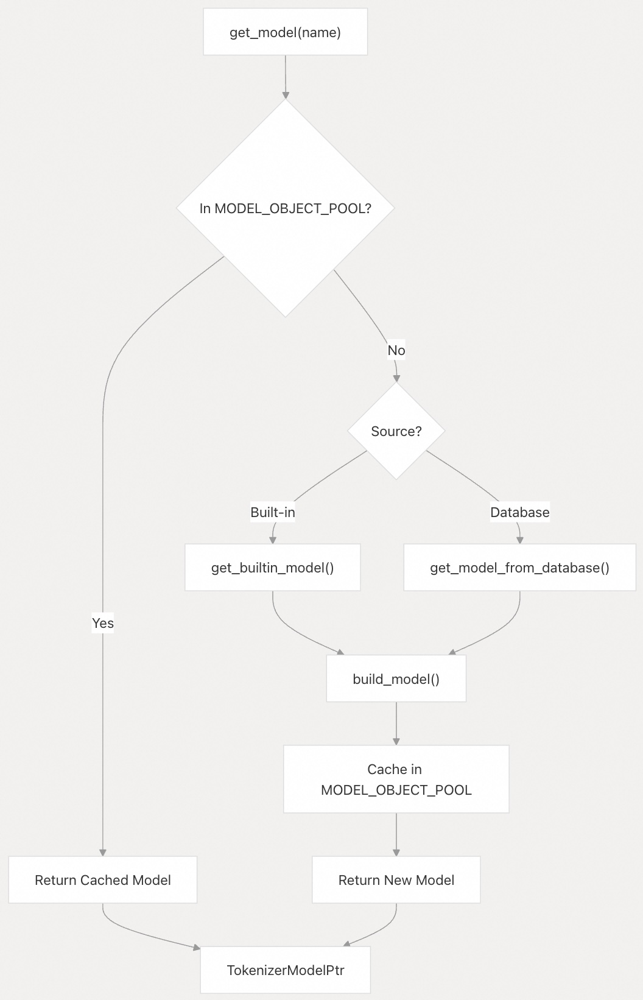
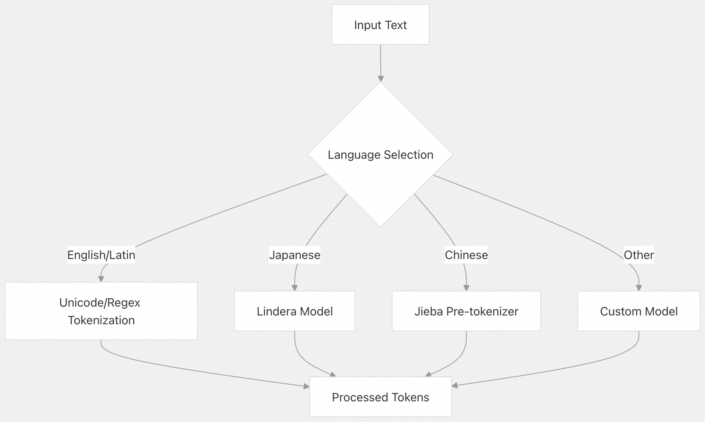

## pg_tokenizer 源码学习: 5.2 高级用法 (Advanced Usage)  
    
### 作者    
digoal    
    
### 日期    
2025-11-19    
    
### 标签    
pg\_tokenizer , 词化 , bert , 标记化 , Tokenization    
    
----    
    
## 背景    
本文档涵盖了在生产环境中使用 `pg_tokenizer` (PostgreSQL 分词器) 的高级技术，包括自定义模型触发器 (**custom model triggers**)、预加载模型 (**preloaded models**) 和优化策略 (**optimization strategies**)。这些功能专为需要自动化工作流程 (**automate workflows**)、提高性能 (**improve performance**) 或支持复杂分词 (**tokenization**) 场景的用户而设计。  
  
## 自定义模型触发器 (Custom Model Triggers)  
  
自定义模型触发器 (**Custom model triggers**) 可以在 **PostgreSQL** 表中的文本数据发生变化时，自动生成嵌入 (**embeddings**)。此功能简化了维护文本数据向量表示 (**vector representations**) 的工作流程。  
  
  
  
### 创建自定义模型触发器 (Creating Custom Model Triggers)  
  
`create_custom_model_tokenizer_and_trigger` 函数设置了整个流程 (**pipeline**):  
  
```sql  
SELECT tokenizer_catalog.create_custom_model_tokenizer_and_trigger(  
    tokenizer_name => 'my_tokenizer',  
    model_name => 'my_model',  
    text_analyzer_name => 'my_analyzer',  
    table_name => 'my_table',  
    source_column => 'text_column',  
    target_column => 'embedding_column'  
);  
```  
  
该函数：  
  
1.  根据您的文本分析器 (**text analyzer**) 创建一个自定义模型 (**custom model**)。  
2.  使用此模型创建一个分词器 (**tokenizer**)。  
3.  设置一个 **PostgreSQL** 触发器 (**trigger**)，当源文本 (**source text**) 更改时，它会自动更新目标列 (**target column**)。  
  
### 示例用例 (Example Use Case)  
  
以下示例演示了文档的自动嵌入 (**embedding**) 生成：  
  
1.  创建一个带有文本和嵌入列的表：  
  
    ```sql  
    CREATE TABLE documents (  
        id SERIAL PRIMARY KEY,  
        passage TEXT,  
        embedding INT[]  
    );  
    ```  
  
2.  创建一个带有适当过滤器的文本分析器 (**text analyzer**):  
  
    ```sql  
    SELECT tokenizer_catalog.create_text_analyzer('text_analyzer1', $$  
    pre_tokenizer = "unicode_segmentation"  
    [[character_filters]]  
    to_lowercase = {}  
    [[character_filters]]  
    unicode_normalization = "nfkd"  
    [[token_filters]]  
    skip_non_alphanumeric = {}  
    [[token_filters]]  
    stopwords = "nltk_english"  
    [[token_filters]]  
    stemmer = "english_porter2"  
    $$);  
    ```  
  
3.  设置自定义模型触发器 (**custom model trigger**):  
  
    ```sql  
    SELECT tokenizer_catalog.create_custom_model_tokenizer_and_trigger(  
        tokenizer_name => 'tokenizer1',  
        model_name => 'model1',  
        text_analyzer_name => 'text_analyzer1',  
        table_name => 'documents',  
        source_column => 'passage',  
        target_column => 'embedding'  
    );  
    ```  
  
4.  插入数据，嵌入 (**embeddings**) 将自动生成：  
  
    ```sql  
    INSERT INTO documents (passage) VALUES   
    ('PostgreSQL is a powerful database system.');  
    -- The embedding column is automatically populated  
    ```  
  
来源: [`tests/sqllogictest/custom_model_with_trigger.slt` 1-50](https://github.com/tensorchord/pg_tokenizer.rs/blob/d3f7a577/tests/sqllogictest/custom_model_with_trigger.slt#L1-L50)  
  
## 预加载模型 (Preloaded Models)  
  
预加载模型 (**Preloaded models**) 在 **PostgreSQL** 启动时加载到内存中，从而改善了初始查询的响应时间 (**response time**) 并确保了性能的一致性 (**consistent performance**)。这对于启动延迟 (**startup latency**) 很重要的生产环境 (**production environments**) 尤其重要。  
     
### 模型对象池 (Model Object Pool)  
  
`MODEL_OBJECT_POOL` (模型对象池) 是一个存储已加载模型的全局缓存 (**global cache**)。它被实现为一个线程安全 (**thread-safe**) 的 `DashMap` (一种线程安全的哈希表)，以实现高效的并发访问 (**concurrent access**):  
  
  
  
当您请求一个模型时，`pg_tokenizer` (分词器) 首先检查它是否在 `MODEL_OBJECT_POOL` 中。如果不在，它会尝试从内置模型 (**built-in models**) 或数据库中加载它。一旦加载，模型就会被缓存 (**cached**) 在池中以供未来的请求使用。  
  
来源: [`src/model/mod.rs` 50-86](https://github.com/tensorchord/pg_tokenizer.rs/blob/d3f7a577/src/model/mod.rs#L50-L86)  
  
### 管理预加载模型 (Managing Preloaded Models)  
  
`pg_tokenizer` (分词器) 提供了用于管理预加载模型的 **SQL 函数** (**SQL functions**):  
  
| 函数 (Function) | 描述 (Description) |  
| :--- | :--- |  
| `add_preload_model(name)` | 将模型添加到预加载列表 (**preload list**) |  
| `remove_preload_model(name)` | 从预加载列表移除模型 |  
| `list_preload_models()` | 列出所有预加载的模型 |  
  
当您添加一个模型进行预加载时，`pg_tokenizer` 会将其配置存储在 `pg_tokenizer/preload_models` 目录中。在初始化 (**initialization**) 期间，此目录中的所有模型都会加载到 `MODEL_OBJECT_POOL` (模型对象池) 中。  
  
```sql  
-- Add a model to the preload list  
SELECT tokenizer_catalog.add_preload_model('my_model');  
  
-- List all preloaded models  
SELECT * FROM tokenizer_catalog.list_preload_models();  
  
-- Remove a model from preload list  
SELECT tokenizer_catalog.remove_preload_model('my_model');  
```  
  
来源: [`src/model/mod.rs` 139-179](https://github.com/tensorchord/pg_tokenizer.rs/blob/d3f7a577/src/model/mod.rs#L139-L179)  
  
### 预加载实现细节 (Preload Implementation Details)  
  
预加载系统通过以下关键组件 (**key components**) 运作：  
  
1.  `add_preload_model` 函数将模型配置写入文件系统 (**filesystem**):  
      * 验证模型名称  
      * 获取模型（将其加载到内存中）  
      * 将配置保存到 `pg_tokenizer/preload_models/[model_name]`  
2.  `init` 函数在扩展初始化 (**extension initialization**) 期间运行：  
      * 如有需要，创建预加载目录  
      * 加载内置的预加载模型  
      * 读取并加载预加载目录中的所有模型  
  
这确保了模型在 **PostgreSQL** 启动后立即可用，没有初始加载延迟 (**initial loading delays**)。  
  
来源: [`src/model/mod.rs` 181-212](https://github.com/tensorchord/pg_tokenizer.rs/blob/d3f7a577/src/model/mod.rs#L181-L212)  
  
## 多语言支持 (Multilingual Support)  
  
`pg_tokenizer` (分词器) 通过特定于语言的模型和分词器，提供了强大的多语言支持 (**multilingual support**)。  
  
  
  
### 日文文本处理 (Japanese Text Processing)  
  
对于日文文本，请使用 **Lindera 模型** (**Lindera models**) 和分词器 (**tokenizers**):  
  
```sql  
-- Create a Lindera model  
SELECT tokenizer_catalog.create_lindera_model('japanese_model');  
  
-- Create a text analyzer with Lindera  
SELECT tokenizer_catalog.create_text_analyzer('japanese_analyzer', $$  
pre_tokenizer = "lindera"  
$$);  
  
-- Process Japanese text  
SELECT tokenizer_catalog.tokenize('japanese_model', '日本語のテキスト');  
```  
  
### 中文文本处理 (Chinese Text Processing)  
  
对于中文文本，请使用 **Jieba 预分词器** (**Jieba pre-tokenizer**):  
  
```sql  
-- Create a text analyzer with Jieba  
SELECT tokenizer_catalog.create_text_analyzer('chinese_analyzer', $$  
pre_tokenizer = "jieba"  
$$);  
  
-- Create a custom model using this analyzer  
SELECT tokenizer_catalog.create_custom_model('chinese_model', 'chinese_analyzer');  
  
-- Process Chinese text  
SELECT tokenizer_catalog.tokenize('chinese_model', '中文文本示例');  
```  
  
有关语言特定模型的更多详细信息，请参阅 语言特定模型 章节。  
  
## 性能考量 (Performance Considerations)  
  
### 缓存行为与事务 (Cache Behavior and Transactions)  
  
`MODEL_OBJECT_POOL` (模型对象池) 存在于 **PostgreSQL** 事务系统 (**transaction system**) 之外，这会带来几个影响 (**implications**):  
  
1.  模型状态 (**Model state**) 在事务 (**transactions**) 之间保持持久 (**persists**)。  
2.  未提交事务中对模型的更改 (**Changes**) 对其他会话 (**sessions**) 可见。  
3.  回滚 (**Rolling back**) 创建模型的事务不会将其从缓存 (**cache**) 中删除。  
  
有关这些限制的详细信息，请参阅 限制 章节。  
  
### 优化性能 (Optimizing Performance)  
  
要最大限度地提高 `pg_tokenizer` (分词器) 的性能：  
  
1.  **预加载常用模型 (Preload frequently used models)**：对经常使用的模型使用 `add_preload_model`，以避免冷启动延迟 (**cold-start latency**)。  
2.  **选择合适的文本分析器 (text analyzers)**：选择与您的语言和要求相匹配的预分词器 (**pre-tokenizers**) 和过滤器 (**filters**)。  
3.  **平衡模型复杂度 (model complexity)**：更复杂的文本处理流程 (**pipelines**) 可以提高质量，但可能会降低性能。  
4.  **使用批处理 (batch processing)**：对于批量操作 (**bulk operations**)，尽可能对输入进行批处理。  
5.  **考虑内存使用情况 (memory usage)**：模型缓存在内存中，因此请监控大型模型的 **PostgreSQL** 内存使用情况。  
  
来源: [`src/model/mod.rs` 50-52](https://github.com/tensorchord/pg_tokenizer.rs/blob/d3f7a577/src/model/mod.rs#L50-L52) [`src/model/mod.rs` 64-86](https://github.com/tensorchord/pg_tokenizer.rs/blob/d3f7a577/src/model/mod.rs#L64-L86)  
  
## 调试与故障排除 (Debugging and Troubleshooting)  
  
在使用高级功能时，您可能会遇到问题。以下是一些故障排除 (**troubleshooting**) 技巧：  
  
1.  **检查模型是否存在 (Check model existence)**：使用 `SELECT * FROM tokenizer_catalog.model;` 来验证模型是否存在。  
2.  **检查预加载的模型 (Inspect preloaded models)**：使用 `SELECT * FROM tokenizer_catalog.list_preload_models();`。  
3.  **验证模型名称 (Validate model names)**：模型名称必须：  
      * 长度为 1-20 个字符  
      * 仅包含 ASCII 字母数字字符 (**alphanumeric characters**) 和下划线  
      * 以字母开头  
      * 不与内置模型 (**built-in model**) 名称冲突  
4.  **检查触发器生成 (Review trigger generation)**：如果自定义模型触发器 (**custom model triggers**) 不起作用，请检查您的表结构是否符合预期格式。  
  
来源: [`src/model/mod.rs` 110-137](https://github.com/tensorchord/pg_tokenizer.rs/blob/d3f7a577/src/model/mod.rs#L110-L137)  
  
## 结论 (Conclusion)  
  
`pg_tokenizer` (分词器) 的高级功能为自动化分词 (**tokenization**) 工作流程和优化性能提供了强大的能力。通过利用自定义模型触发器 (**custom model triggers**)、预加载模型 (**preloaded models**) 和适当的多语言支持 (**multilingual support**)，您可以构建与 **PostgreSQL** 无缝集成 (**integrate seamlessly**) 的复杂文本处理应用 (**sophisticated text processing applications**)。  
  
# 附录: 关键冲突与一致性问题 (Key Conflict and Consistency Issue)  
基于 **“缓存行为与事务”** 部分提到的限制，即 `MODEL_OBJECT_POOL` (模型对象池) 独立于 **PostgreSQL** 事务系统 (**transaction system**) 之外：  
  
当使用**自定义模型触发器 (**custom model triggers**)** 生成嵌入 (**embeddings**) 时，如果包含数据插入/更新操作的 **PostgreSQL** 事务 (**transaction**) 最终发生了**回滚 (**rolling back**)**，这是否会对 `MODEL_OBJECT_POOL` 内存中的模型状态、以及在触发器中生成并**尝试**写入的嵌入数据造成任何**不一致 (**inconsistency**)** 的风险？  
  
**在生产环境中，我们应该采取什么策略来彻底保证数据和缓存的事务级一致性 (**transactional consistency**)？**  
  
这个问题涉及 `MODEL_OBJECT_POOL` 在 PostgreSQL 事务回滚场景下的一致性问题。下面基于代码分析这个问题。  
  
## 问题分析  
  
### 1. `MODEL_OBJECT_POOL` 与事务隔离  
  
`MODEL_OBJECT_POOL` 是一个全局的、线程安全的内存缓存, 它**完全独立于 PostgreSQL 事务系统** 。当您在事务中创建自定义模型时,模型会立即被加载到这个缓存中 。  
  
### 2. 事务回滚时的不一致性风险  
  
**是的,存在不一致性风险**。具体表现在:  
  
#### 风险 1: 模型缓存不会被清理  
当事务回滚时,虽然数据库中的更改会被撤销, 但 `MODEL_OBJECT_POOL` 中的模型**不会被自动移除** 。这意味着:  
  
- 数据库表 `tokenizer_catalog.model` 中的模型记录被回滚删除    
- 但内存中的 `MODEL_OBJECT_POOL` 仍然保留该模型对象    
- 词汇表 `tokenizer_catalog."model_{name}"` 也会被回滚删除    
  
#### 风险 2: 触发器生成的嵌入数据  
在 `create_custom_model_tokenizer_and_trigger` 创建的触发器场景中  :  
  
1. **词汇表更新触发器** (`custom_model_insert_trigger`): 这个触发器在 `BEFORE INSERT OR UPDATE` 时执行, 会向 `tokenizer_catalog."model_{name}"` 表插入新词汇 。如果事务回滚, 这些插入会被正确撤销。  
  
2. **嵌入生成触发器** (`custom_model_tokenizer_set_target_column_trigger`): 这个触发器生成嵌入并写入目标列 。如果事务回滚, 嵌入数据也会被正确撤销。  
  
**但问题在于**: 如果模型在缓存中但词汇表已被回滚删除, 后续查询该模型时会失败 。  
  
## 生产环境策略  
  
### 策略 1: 显式清理缓存  
事务回滚后, **必须手动调用** `drop_custom_model` 来清理缓存 :  
  
```sql  
BEGIN;  
-- 创建模型操作  
SELECT create_custom_model(...);  
-- 如果需要回滚  
ROLLBACK;  
-- 手动清理缓存  
SELECT drop_custom_model('model_name');  
```  
  
### 策略 2: 重新连接数据库  
由于 `MODEL_OBJECT_POOL` 是进程级别的缓存,重新连接数据库会创建新的连接, 从而获得干净的缓存状态 。  
  
### 策略 3: 避免在事务中创建模型  
**最佳实践**: 将模型创建操作放在独立的、确定会提交的事务中 :  
  
```sql  
-- 单独的事务创建模型  
SELECT create_custom_model_tokenizer_and_trigger(...);  
-- 确保提交后再进行数据操作  
```  
  
### 策略 4: 使用 Savepoint  
如果必须在复杂事务中创建模型,使用 savepoint 来隔离风险 :  
  
```sql  
BEGIN;  
SAVEPOINT before_model;  
SELECT create_custom_model(...);  
-- 如果出错  
ROLLBACK TO before_model;  
SELECT drop_custom_model('model_name'); -- 清理缓存  
COMMIT;  
```  
  
## Notes  
  
这个限制在文档中有明确说明 。核心问题是 `MODEL_OBJECT_POOL` 的设计目标是性能优化(避免重复加载模型), 但代价是牺牲了事务一致性  。  
  
触发器本身生成的数据(词汇表和嵌入)会正确遵循 PostgreSQL 事务语义被回滚 , 真正的风险在于**缓存与数据库状态的不同步** 。  
  
在生产环境中, 建议采用**策略 3**(避免在事务中创建模型)作为主要方案, 这样可以从根本上避免不一致性问题 。  
  
    
#### [PolarDB 学习图谱](https://www.aliyun.com/database/openpolardb/activity "8642f60e04ed0c814bf9cb9677976bd4")
  
  
#### [PostgreSQL 解决方案集合](../201706/20170601_02.md "40cff096e9ed7122c512b35d8561d9c8")
  
  
#### [德哥 / digoal's Github - 公益是一辈子的事.](https://github.com/digoal/blog/blob/master/README.md "22709685feb7cab07d30f30387f0a9ae")
  
  
#### [About 德哥](https://github.com/digoal/blog/blob/master/me/readme.md "a37735981e7704886ffd590565582dd0")
  
  

  
