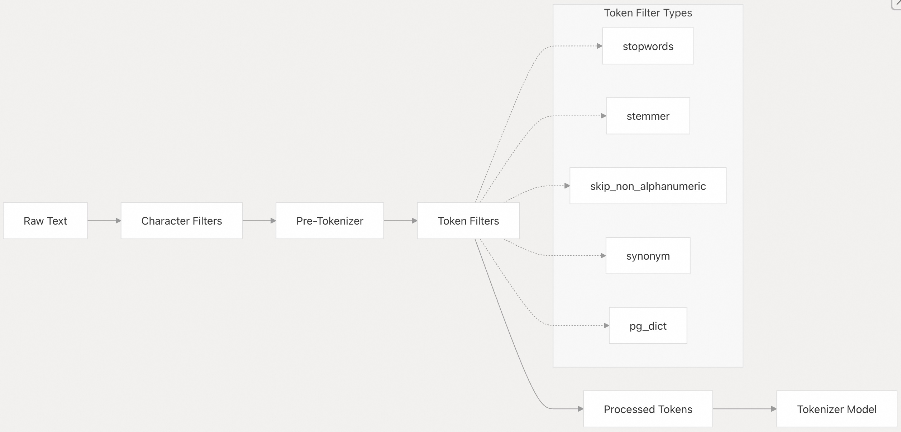
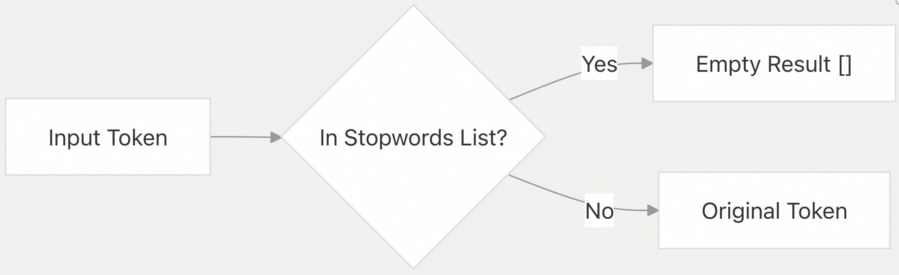
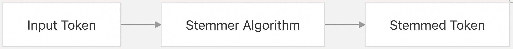
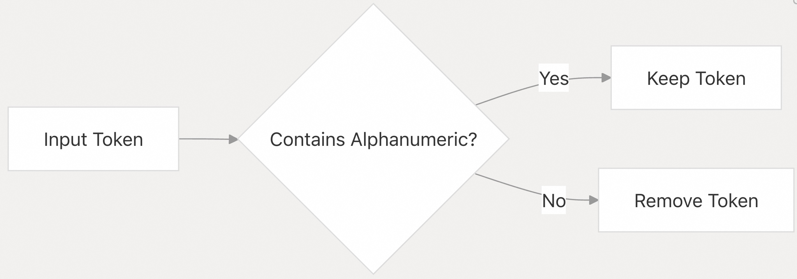
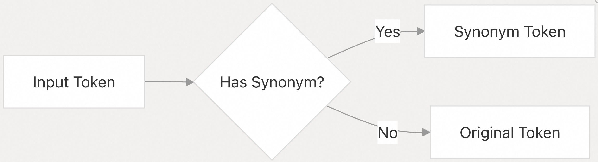
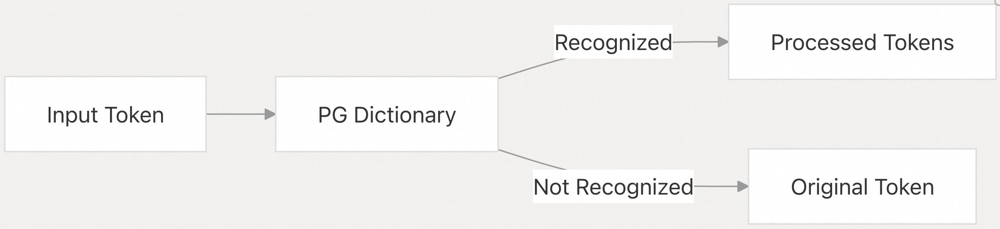
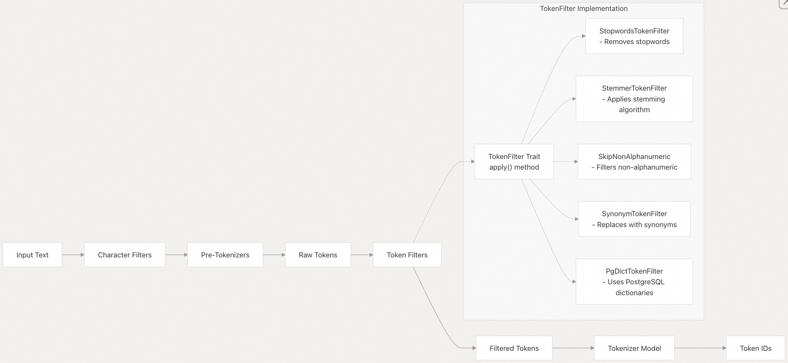

## pg_tokenizer 源码学习: 5.3 令牌过滤 (Token Filtering)  
      
### 作者      
digoal      
      
### 日期      
2025-11-19      
      
### 标签      
pg\_tokenizer , 词化 , bert , 标记化 , Tokenization      
      
----      
      
## 背景      
**令牌过滤 (Token filtering)** 是 `pg_tokenizer` **扩展 (extension)** 中 **文本分析流水线 (text analysis pipeline)** 的关键步骤。本页面记录了可用的 **令牌过滤器 (token filters)**、它们的配置和使用模式。**令牌过滤器 (Token filters)** 在 **预分词器 (pre-tokenizers)** 的输出上运行，在单个 **令牌 (tokens)** 被 **分词器模型 (tokenizer model)** 处理之前对其进行转换或过滤。  
  
    
  
## 令牌过滤概述 (Overview of Token Filtering)  
  
**令牌过滤器 (Token filters)** 从 **预分词器 (pre-tokenizers)** 产生的 **令牌流 (token stream)** 中修改、添加或删除 **令牌 (tokens)**。它们在 **文本处理工作流 (text processing workflow)** 中起着关键作用：  
  
    
  
来源:  
[`src/token_filter/stopwords.rs`](https://github.com/tensorchord/pg_tokenizer.rs/blob/d3f7a577/src/token_filter/stopwords.rs)  
[`src/token_filter/stemmer.rs`](https://github.com/tensorchord/pg_tokenizer.rs/blob/d3f7a577/src/token_filter/stemmer.rs)  
[`src/token_filter/skip_non_alphanumeric.rs`](https://github.com/tensorchord/pg_tokenizer.rs/blob/d3f7a577/src/token_filter/skip_non_alphanumeric.rs)  
[`src/token_filter/pg_dict.rs`](https://github.com/tensorchord/pg_tokenizer.rs/blob/d3f7a577/src/token_filter/pg_dict.rs)  
  
    
  
## 令牌过滤器类型 (Token Filter Types)  
  
`pg_tokenizer` **扩展 (extension)** 提供了多种 **令牌过滤器类型 (token filter types)**，每种类型都在 **文本处理 (text processing)** 中服务于特定的目的：  
  
### 1\. 停用词过滤器 (Stopwords Filter)  
  
**停用词过滤器 (stopwords filter)** 用于移除通常对 **文本分析 (text analysis)** 价值较小的常用词。它有助于减少 **文本数据 (text data)** 中的 **噪音 (noise)**。  
  
    
  
#### 实现细节 (Implementation Details)  
  
  * 存储：**停用词 (Stopwords)** 存储在 `tokenizer_catalog.stopwords` 表中。  
  * 缓存：使用 `STOPWORDS_OBJECT_POOL` 进行性能优化。  
  * 内置列表：包含预定义的 **停用词列表 (stopword lists)** (`lucene_english`, `nltk_english`, `iso_english`)。  
  
#### 创建停用词过滤器 (Creating a Stopwords Filter)  
  
```sql  
SELECT tokenizer_catalog.create_stopwords('my_stopwords',   
$$the  
and  
is  
at  
$$);  
```  
  
来源:  
[`src/token_filter/stopwords.rs` 14-41](https://github.com/tensorchord/pg_tokenizer.rs/blob/d3f7a577/src/token_filter/stopwords.rs#L14-L41)  
[`src/token_filter/stopwords.rs` 43-51](https://github.com/tensorchord/pg_tokenizer.rs/blob/d3f7a577/src/token_filter/stopwords.rs#L43-L51)  
[`src/token_filter/stopwords.rs` 85-112](https://github.com/tensorchord/pg_tokenizer.rs/blob/d3f7a577/src/token_filter/stopwords.rs#L85-L112)  
  
    
  
### 2\. 词干提取器过滤器 (Stemmer Filter)  
  
**词干提取器过滤器 (stemmer filter)** 将单词简化为其 **词根形式 (root form / stem)**，将同一单词的不同变体归结为一个通用形式。这有助于匹配相关单词，无论它们的精确形式如何。  
  
    
  
#### 可用词干提取器 (Available Stemmers)  
  
词干提取器 **令牌过滤器 (token filter)** 通过 `rust_stemmers` **库 (library)** 支持广泛的语言：  
  
| 算法类型 (Algorithm Type) | 适用语言 (Suitable for) |  
| :--- | :--- |  
| EnglishPorter | 英语 (**Porter 算法**) |  
| EnglishPorter2 | 英语 (**Porter2/Snowball 算法**) |  
| Arabic | 阿拉伯语 |  
| Armenian | 亚美尼亚语 |  
| Basque | 巴斯克语 |  
| Catalan | 加泰罗尼亚语 |  
| Danish | 丹麦语 |  
| Dutch | 荷兰语 |  
| Estonian | 爱沙尼亚语 |  
| Finnish | 芬兰语 |  
| French | 法语 |  
| German | 德语 |  
| Greek | 希腊语 |  
| Hindi | 印地语 |  
| Hungarian | 匈牙利语 |  
| Indonesian | 印度尼西亚语 |  
| Irish | 爱尔兰语 |  
| Italian | 意大利语 |  
| Lithuanian | 立陶宛语 |  
| Nepali | 尼泊尔语 |  
| Norwegian | 挪威语 |  
| Portuguese | 葡萄牙语 |  
| Romanian | 罗马尼亚语 |  
| Russian | 俄语 |  
| Serbian | 塞尔维亚语 |  
| Spanish | 西班牙语 |  
| Swedish | 瑞典语 |  
| Tamil | 泰米尔语 |  
| Turkish | 土耳其语 |  
| Yiddish | 意第绪语 |  
  
来源:  
[`src/token_filter/stemmer.rs` 10-42](https://github.com/tensorchord/pg_tokenizer.rs/blob/d3f7a577/src/token_filter/stemmer.rs#L10-L42)  
[`src/token_filter/stemmer.rs` 93-108](https://github.com/tensorchord/pg_tokenizer.rs/blob/d3f7a577/src/token_filter/stemmer.rs#L93-L108)  
  
    
  
### 3\. 跳过非字母数字过滤器 (Skip Non-Alphanumeric Filter)  
  
此过滤器会移除不包含任何 **字母数字字符 (alphanumeric characters)** 的 **令牌 (tokens)**，这对于消除 **纯标点符号令牌 (punctuation-only tokens)** 和其他非信息性 **令牌 (tokens)** 非常有用。  
  
    
  
来源:  
[`src/token_filter/skip_non_alphanumeric.rs` 5-13](https://github.com/tensorchord/pg_tokenizer.rs/blob/d3f7a577/src/token_filter/skip_non_alphanumeric.rs#L5-L13)  
  
    
  
### 4\. 同义词过滤器 (Synonym Filter)  
  
**同义词过滤器 (synonym filter)** 用定义的 **同义词 (synonyms)** 替换 **令牌 (tokens)**，有助于 **规范化 (normalize)** 具有相同含义的不同术语。  
  
    
  
#### 创建同义词过滤器 (Creating a Synonym Filter)  
  
```sql  
SELECT tokenizer_catalog.create_synonym('tech_synonyms',   
$$postgresql postgres pgsql  
index indices  
machine_learning ml  
$$);  
```  
  
**配置 (configuration)** 中的每一行定义了一个 **同义词组 (synonym group)**，其中第一个术语是 **首选形式 (preferred form)**，组中的所有术语都被视为等效。  
  
来源:  
[`tests/sqllogictest/synonym.slt` 5-8](https://github.com/tensorchord/pg_tokenizer.rs/blob/d3f7a577/tests/sqllogictest/synonym.slt#L5-L8)  
  
    
  
### 5\. PostgreSQL 字典过滤器 (PostgreSQL Dictionary Filter)  
  
此过滤器利用 **PostgreSQL 内置的文本搜索字典 (built-in text search dictionaries)** 进行 **令牌处理 (token processing)**，从而允许与现有的 **PostgreSQL 文本搜索功能 (text search functionalities)** 集成。  
  
    
  
来源:  
[`src/token_filter/pg_dict.rs` 7-59](https://github.com/tensorchord/pg_tokenizer.rs/blob/d3f7a577/src/token_filter/pg_dict.rs#L7-L59)  
  
    
  
## 在文本分析器中使用令牌过滤器 (Using Token Filters in Text Analyzers)  
  
**令牌过滤器 (Token filters)** 作为 **文本分析器 (text analyzer)** 的一部分进行配置。多个 **令牌过滤器 (token filters)** 可以按照指定的顺序串联在一起 (chained together)。  
  
### 配置语法 (Configuration Syntax)  
  
**令牌过滤器 (Token filters)** 在 **文本分析器 (text analyzer)** 的 **TOML 配置 (TOML configuration)** 中指定：  
  
```toml  
[[token_filters]]  
filter_type = "configuration"  
```  
  
其中 `filter_type` 是以下之一：  
  
  * `stopwords = "stopwords_name"`  
  * `stemmer = {"kind" = "EnglishPorter2"}`  
  * `skip_non_alphanumeric = {}`  
  * `synonym = "synonym_name"`  
  * `pg_dict = "dictionary_name"`  
  
### 配置示例 (Configuration Examples)  
  
#### 停用词示例 (Stopwords Example)  
  
```toml  
-- Create stopwords list  
SELECT tokenizer_catalog.create_stopwords('basic_english', $$  
a  
an  
the  
$$);  
  
-- Create text analyzer with stopwords filter  
SELECT tokenizer_catalog.create_text_analyzer('analyzer_with_stopwords', $$  
pre_tokenizer = "unicode_segmentation"  
[[character_filters]]  
to_lowercase = {}  
[[token_filters]]  
stopwords = "basic_english"  
$$);  
  
-- Test the analyzer  
SELECT tokenizer_catalog.apply_text_analyzer('The quick brown fox', 'analyzer_with_stopwords');  
-- Returns: {quick,brown,fox}  
```  
  
来源:  
[`tests/sqllogictest/stopwords.slt` 4-23](https://github.com/tensorchord/pg_tokenizer.rs/blob/d3f7a577/tests/sqllogictest/stopwords.slt#L4-L23)  
  
#### 词干提取示例 (Stemming Example)  
  
```toml  
-- Create text analyzer with stemmer  
SELECT tokenizer_catalog.create_text_analyzer('analyzer_with_stemming', $$  
pre_tokenizer = "unicode_segmentation"  
[[character_filters]]  
to_lowercase = {}  
[[token_filters]]  
stemmer = { kind = "EnglishPorter2" }  
$$);  
  
-- Test the analyzer  
SELECT tokenizer_catalog.apply_text_analyzer('running jumps foxes', 'analyzer_with_stemming');  
-- Returns: {run,jump,fox}  
```  
  
#### 同义词示例 (Synonym Example)  
  
```toml  
-- Create synonym list  
SELECT tokenizer_catalog.create_synonym('database_terms', $$  
pgsql postgres postgresql  
index indices  
$$);  
  
-- Create text analyzer with synonym filter  
SELECT tokenizer_catalog.create_text_analyzer('analyzer_with_synonyms', $$  
pre_tokenizer = "unicode_segmentation"  
[[token_filters]]  
synonym = "database_terms"  
$$);  
  
-- Test the analyzer  
SELECT tokenizer_catalog.apply_text_analyzer('postgresql indices', 'analyzer_with_synonyms');  
-- Returns: {pgsql,index}  
```  
  
来源:  
[`tests/sqllogictest/synonym.slt` 4-20](https://github.com/tensorchord/pg_tokenizer.rs/blob/d3f7a577/tests/sqllogictest/synonym.slt#L4-L20)  
  
#### 组合过滤器示例 (Combined Filters Example)  
  
```toml  
-- Create text analyzer with multiple token filters  
SELECT tokenizer_catalog.create_text_analyzer('multi_filter_analyzer', $$  
pre_tokenizer = "unicode_segmentation"  
[[character_filters]]  
to_lowercase = {}  
[[token_filters]]  
stopwords = "basic_english"  
[[token_filters]]  
stemmer = { kind = "EnglishPorter2" }  
[[token_filters]]  
skip_non_alphanumeric = {}  
$$);  
```  
  
    
  
## 令牌过滤在文本分析流水线中的位置 (Token Filtering in the Text Analysis Pipeline)  
  
**令牌过滤器 (Token filters)** 在 **文本分析流水线 (text analysis pipeline)** 的特定部分运行，如以下 **图表 (diagram)** 所示：  
  
   
  
来源:  
[`src/token_filter/stopwords.rs`](https://github.com/tensorchord/pg_tokenizer.rs/blob/d3f7a577/src/token_filter/stopwords.rs)  
[`src/token_filter/stemmer.rs`](https://github.com/tensorchord/pg_tokenizer.rs/blob/d3f7a577/src/token_filter/stemmer.rs)  
[`src/token_filter/skip_non_alphanumeric.rs`](https://github.com/tensorchord/pg_tokenizer.rs/blob/d3f7a577/src/token_filter/skip_non_alphanumeric.rs)  
[`src/token_filter/pg_dict.rs`](https://github.com/tensorchord/pg_tokenizer.rs/blob/d3f7a577/src/token_filter/pg_dict.rs)  
  
    
  
## 性能考量 (Performance Considerations)  
  
  * **对象池 (Object Pooling)**：**停用词过滤器 (Stopwords filters)** 使用 **对象池 (object pool)** (`STOPWORDS_OBJECT_POOL`) 来缓存实例，以获得更好的 **性能 (performance)**。  
  * **过滤器顺序 (Order of Filters)**：**令牌过滤器 (token filters)** 的顺序很重要。通常，您会在 **词干提取 (stemming)** 之前应用 **停用词过滤 (stopwords filtering)**。  
  * **链式效应 (Chain Effect)**：每个 **令牌过滤器 (token filter)** 都可以从单个输入 **令牌 (token)** 产生零个、一个或多个 **令牌 (tokens)**，从而在 **令牌流 (token stream)** 中产生 **乘法效应 (multiplying effect)**。  
  
来源:  
[`src/token_filter/stopwords.rs` 53-73](https://github.com/tensorchord/pg_tokenizer.rs/blob/d3f7a577/src/token_filter/stopwords.rs#L53-L73)  
  
    
  
## 常见使用模式 (Common Usage Patterns)  
  
1.  **基本文本清理 (Basic Text Cleanup)**：将 `to_lowercase` **字符过滤器 (character filter)** 与 **停用词 (stopwords)** 和 **跳过非字母数字 (skip\_non\_alphanumeric)** **令牌过滤器 (token filters)** 组合使用。  
2.  **搜索优化 (Search Optimization)**：使用 **词干提取器 (stemmer)** 和 **同义词 (synonym)** 过滤器来提高 **搜索召回率 (search recall)**。  
3.  **特定语言处理 (Language-Specific Processing)**：将 **特定语言的词干提取器 (language-specific stemmer)** 与适当的 **停用词列表 (stopwords list)** 组合使用。  
4.  **与 PostgreSQL 全文搜索集成 (Integration with PostgreSQL Full Text Search)**：使用 **pg\_dict** 过滤器来利用现有的 **PostgreSQL 文本搜索字典 (text search dictionaries)**。  
  
通过有效地组合 **令牌过滤器 (token filters)**，您可以创建针对特定 **应用程序需求 (application needs)** 定制的 **复杂文本处理流水线 (sophisticated text processing pipelines)**。  
  
# 附录  
在 **文本分析器 (Text Analyzer)** 中，当我们需要串联使用多个 **令牌过滤器 (Token filters)**（例如，**停用词过滤器 (Stopwords Filter)**、**词干提取器过滤器 (Stemmer Filter)** 和 **同义词过滤器 (Synonym Filter)**）时：  
  
1.  **顺序对准确性和性能的影响：** 如何确定这些过滤器的**最佳执行顺序**？这种顺序选择如何影响最终的**令牌集合质量**（例如，最大限度地提高搜索的**召回率 (search recall)**）和整体的**处理性能**？  
2.  **性能权衡：** 考虑到文本中提到每个过滤器都可能产生“乘法效应 (multiplying effect)”并影响性能，是否存在一个经验法则（例如，应该将哪种类型的过滤器放在链式处理的最前面，以实现最大的噪音消除和性能优化）？  
  
这个问题要求用户不仅理解每个过滤器的功能，还要理解它们在 **文本分析流水线 (Text Analysis Pipeline)** 中的非线性交互，这直接关系到系统的**准确性**（召回率）和**可扩展性**（性能）。  
  
---   
  
在 `pg_tokenizer.rs` 中配置 **文本分析器 (Text Analyzer)** 时，如何确定多个 **令牌过滤器 (Token Filters)** 的最佳执行顺序，以及这种顺序如何影响准确性和性能。   
  
## 令牌过滤器的执行顺序  
  
在 `pg_tokenizer.rs` 中，令牌过滤器按照配置中定义的顺序**严格顺序执行**。 每个过滤器接收前一个过滤器的输出作为输入。   
  
### 推荐的执行顺序  
  
基于代码库中的实际示例，推荐的过滤器顺序为：  
  
1. **`skip_non_alphanumeric`** - 首先移除非字母数字令牌  
2. **`stopwords`** - 然后移除停用词  
3. **`stemmer`** - 最后进行词干提取   
  
这个顺序在多个测试文件中一致使用。    
  
### 顺序选择的原理  
  
**为什么这个顺序最优：**  
  
1. **`skip_non_alphanumeric` 放在最前面**：尽早过滤掉标点符号和特殊字符，减少后续过滤器需要处理的令牌数量，提高性能。   
  
2. **`stopwords` 在 `stemmer` 之前**：停用词过滤器通常基于完整单词匹配（如 "the", "is", "and"）。 如果先进行词干提取，这些词可能被转换（如 "is" → "i"），导致停用词过滤失效。   
  
3. **`stemmer` 放在最后**：词干提取会将单词转换为词根形式（如 "running" → "run"），这是最终的标准化步骤。 在此之前移除停用词可以减少需要进行词干提取的令牌数量。   
  
### 同义词过滤器的位置  
  
虽然您提到了同义词过滤器，但代码库中的示例**没有**展示 `synonym` 过滤器与其他过滤器的组合使用。 根据逻辑推理，同义词过滤器应该：  
  
- **在 `stopwords` 之前**：避免同义词被误判为停用词  
- **在 `stemmer` 之前**：因为同义词替换通常基于完整单词  
  
建议顺序：`skip_non_alphanumeric` → `synonym` → `stopwords` → `stemmer`   
  
## 性能权衡  
  
### "乘法效应"的含义  
  
代码中的 `apply_batch` 方法使用 `flat_map` 实现，这意味着某些过滤器（如 `ngram`）可以将一个令牌扩展为多个令牌。   
  
### 性能优化经验法则  
  
1. **减少性过滤器放在前面**：`skip_non_alphanumeric` 和 `stopwords` 会减少令牌数量，应该尽早执行以减少后续处理负担。   
  
2. **扩展性过滤器放在后面**：如 `ngram` 会产生多个令牌，应该放在最后以避免对扩展后的令牌进行不必要的处理。   
  
3. **计算密集型过滤器放在后面**：`stemmer` 涉及复杂的语言学算法，应该在令牌数量已经被减少后再执行。   
  
## Notes  
  
代码库中没有明确的文档说明过滤器顺序的性能影响或最佳实践。上述建议基于代码中一致使用的模式推导而来。对于日语等其他语言，Lindera 模型使用了不同的过滤器集合和顺序。  如果您需要针对特定语言或用例优化性能，建议通过实际测试来验证不同顺序的效果。   
  
    
#### [PolarDB 学习图谱](https://www.aliyun.com/database/openpolardb/activity "8642f60e04ed0c814bf9cb9677976bd4")
  
  
#### [PostgreSQL 解决方案集合](../201706/20170601_02.md "40cff096e9ed7122c512b35d8561d9c8")
  
  
#### [德哥 / digoal's Github - 公益是一辈子的事.](https://github.com/digoal/blog/blob/master/README.md "22709685feb7cab07d30f30387f0a9ae")
  
  
#### [About 德哥](https://github.com/digoal/blog/blob/master/me/readme.md "a37735981e7704886ffd590565582dd0")
  
  

  
