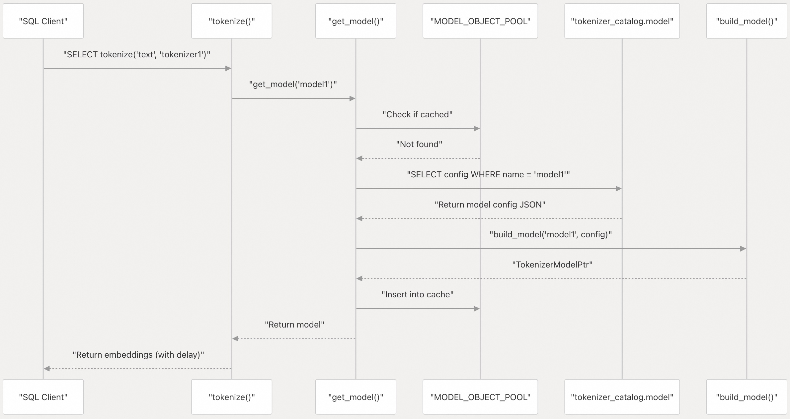
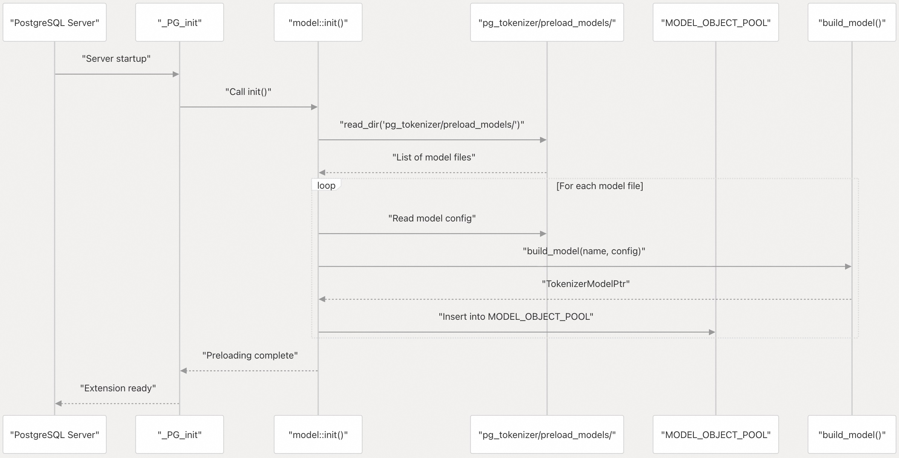
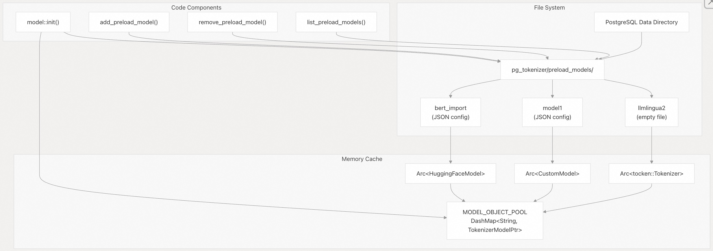
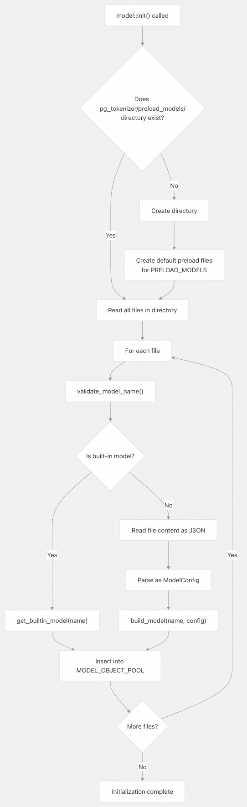
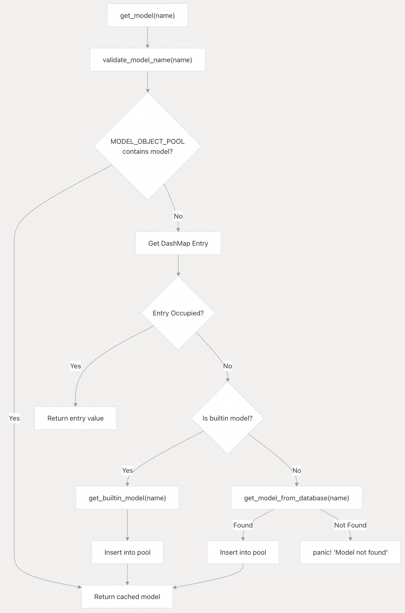
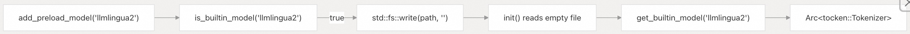
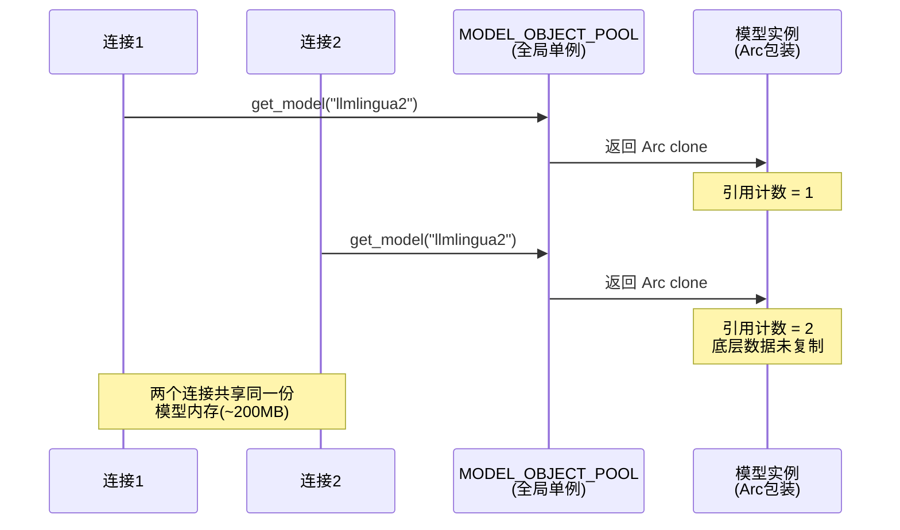

## pg_tokenizer 源码学习: 5.4 模型预加载 (Model Preloading)  
        
### 作者        
digoal        
        
### 日期        
2025-11-19        
        
### 标签        
pg\_tokenizer , 词化 , bert , 标记化 , Tokenization        
        
----        
        
## 背景        
本文介绍了**模型预加载** (`Model Preloading`) 系统，它通过在 **PostgreSQL** **服务器初始化** (`server initialization`) 期间将常用的**分词器模型** (`tokenizer models`) 加载到内存中，从而优化 **PostgreSQL** 的启动性能。有关模型类型和配置的信息，请参阅 模型 章节。要创建**自定义模型** (`Custom Models`)，请参阅 自定义模型 章节。  
  
## 目的与范围 (Purpose and Scope)  
  
**模型预加载**解决了在 **PostgreSQL** 连接中首次访问**分词器模型**时出现的**首次查询延迟** (`first-query latency`) 问题。如果不进行预加载，模型会**按需** (`on-demand`) 加载，这对于大型模型可能会引入几秒钟的延迟。预加载系统在 **\_PG\_init 阶段** (`_PG_init phase`) 加载指定的模型，确保它们立即可用于所有连接。  
  
## 模型加载生命周期 (Model Loading Lifecycle)  
  
### 按需加载 (On-Demand Loading)  
  
当未配置预加载时，模型遵循**惰性加载模式** (`lazy-loading pattern`):  
  
    
  
**来源:** [`src/model/mod.rs` 64-86](https://github.com/tensorchord/pg_tokenizer.rs/blob/d3f7a577/src/model/mod.rs#L64-L86) [`src/model/mod.rs` 88-108](https://github.com/tensorchord/pg_tokenizer.rs/blob/d3f7a577/src/model/mod.rs#L88-L108)  
  
### 预加载时 (With Preloading)  
  
当模型被预加载时，它们在**服务器启动** (`server startup`) 时加载一次:  
  
    
  
**来源:** [`src/model/mod.rs` 181-212](https://github.com/tensorchord/pg_tokenizer.rs/blob/d3f7a577/src/model/mod.rs#L181-L212) [`src/lib.rs`](https://github.com/tensorchord/pg_tokenizer.rs/blob/d3f7a577/src/lib.rs) (**扩展初始化** (`extension initialization`))  
  
## 预加载系统架构 (Preload System Architecture)  
  
### 存储结构 (Storage Structure)  
  
**预加载系统** (`preload system`) 使用存储在 **PostgreSQL** 数据目录中的基于文件的配置:  
  
    
  
**来源:** [`src/model/mod.rs` 51-52](https://github.com/tensorchord/pg_tokenizer.rs/blob/d3f7a577/src/model/mod.rs#L51-L52) [`src/model/mod.rs` 140-179](https://github.com/tensorchord/pg_tokenizer.rs/blob/d3f7a577/src/model/mod.rs#L140-L179) [`src/model/mod.rs` 181-212](https://github.com/tensorchord/pg_tokenizer.rs/blob/d3f7a577/src/model/mod.rs#L181-L212)  
  
### 文件格式 (File Format)  
  
**预加载目录** (`preload directory`) 为每个模型包含一个文件:  
  
| 模型类型 (Model Type) | 文件内容 (File Content) | 描述 (Description) |  
| :--- | :--- | :--- |  
| **内置** (`Built-in`) | 空字符串 (`Empty string`) | 像 `llmlingua2` 这样的**内置模型** (`Built-in models`) 嵌入在二进制文件中，只需要一个**标记文件** (`marker file`) |  
| **自定义** (`Custom`) | **JSON** `ModelConfig::Custom` | 包含**自定义模型配置** (`custom model configuration`)，带有表、列和**文本分析器** (`text analyzer`) 引用 |  
| **HuggingFace** | **JSON** `ModelConfig::HuggingFace` | 包含 **HuggingFace 分词器配置** (`tokenizer configuration`) |  
| **Lindera** | **JSON** `ModelConfig::Lindera` | 包含 **Lindera 分段器配置** (`segmenter configuration`) |  
  
**来源:** [`src/model/mod.rs` 144-150](https://github.com/tensorchord/pg_tokenizer.rs/blob/d3f7a577/src/model/mod.rs#L144-L150) [`src/model/mod.rs` 41-48](https://github.com/tensorchord/pg_tokenizer.rs/blob/d3f7a577/src/model/mod.rs#L41-L48)  
  
## 管理预加载配置 (Managing Preload Configuration)  
  
### 添加模型到预加载 (Adding Models to Preload)  
  
使用 `add_preload_model()` 来配置模型进行预加载:  
  
```sql  
-- Add a custom model to preload  
SELECT add_preload_model('model1');  
  
-- Add a HuggingFace model to preload  
SELECT add_preload_model('bert_import');  
  
-- Restart PostgreSQL to activate preloading  
-- Docker:  
-- sudo docker restart container_name  
  
-- Systemd:  
-- sudo systemctl restart postgresql.service  
```  
  
该函数执行以下操作:  
  
1.  验证模型名称 ([\`src/model/mod.rs\` 113-128](https://github.com/tensorchord/pg_tokenizer.rs/blob/d3f7a577/src/model/mod.rs#L113-L128))  
2.  将模型加载到 **MODEL\_OBJECT\_POOL** (**模型对象池**) 以验证其是否存在 ([\`src/model/mod.rs\` 142](https://github.com/tensorchord/pg_tokenizer.rs/blob/d3f7a577/src/model/mod.rs#L142-L142))  
3.  将模型配置写入 `pg_tokenizer/preload_models/{name}` ([\`src/model/mod.rs\` 144-150](https://github.com/tensorchord/pg_tokenizer.rs/blob/d3f7a577/src/model/mod.rs#L144-L150))  
  
对于**内置模型** (`built-in models`)，会写入一个空文件。对于**自定义** (`custom`)/HuggingFace/Lindera 模型，完整的配置 **JSON** 会被持久化。  
  
**来源:** [`src/model/mod.rs` 139-151](https://github.com/tensorchord/pg_tokenizer.rs/blob/d3f7a577/src/model/mod.rs#L139-L151) [`docs/06-model.md` 218-229](https://github.com/tensorchord/pg_tokenizer.rs/blob/d3f7a577/docs/06-model.md#L218-L229)  
  
### 从预加载中移除模型 (Removing Models from Preload)  
  
```sql  
-- Remove a model from preload configuration  
SELECT remove_preload_model('model1');  
  
-- Restart PostgreSQL to remove the model from startup loading  
```  
  
这将从**预加载目录** (`preload directory`) 中移除相应的文件。如果文件不存在，会发出警告但不会引发错误。  
  
**来源:** [`src/model/mod.rs` 153-166](https://github.com/tensorchord/pg_tokenizer.rs/blob/d3f7a577/src/model/mod.rs#L153-L166)  
  
### 列出预加载的模型 (Listing Preloaded Models)  
  
```sql  
-- View all models configured for preloading  
SELECT list_preload_models();  
```  
  
通过读取**预加载目录**中的文件名，返回模型名称的数组。  
  
**来源:** [`src/model/mod.rs` 168-179](https://github.com/tensorchord/pg_tokenizer.rs/blob/d3f7a577/src/model/mod.rs#L168-L179)  
  
## 初始化过程 (Initialization Process)  
  
### 启动序列 (Startup Sequence)  
  
在 **PostgreSQL** 扩展初始化期间会调用 `model::init()` 函数:  
  
    
  
**来源:** [`src/model/mod.rs` 181-212](https://github.com/tensorchord/pg_tokenizer.rs/blob/d3f7a577/src/model/mod.rs#L181-L212)  
  
### 默认配置 (Default Configuration)  
  
在首次初始化时，系统会为 `builtin::PRELOAD_MODELS` 中指定的模型创建默认的预加载文件:  
  
```rust  
// Default preloaded models (from builtin module)  
for name in builtin::PRELOAD_MODELS {  
    let path = dir_path.join(name);  
    std::fs::write(&path, "").unwrap();  
}  
```  
  
默认情况下，`llmlingua2` 被包含在**预加载集** (`preload set`) 中。  
  
**来源:** [`src/model/mod.rs` 191-194](https://github.com/tensorchord/pg_tokenizer.rs/blob/d3f7a577/src/model/mod.rs#L191-L194) [`docs/06-model.md` 229](https://github.com/tensorchord/pg_tokenizer.rs/blob/d3f7a577/docs/06-model.md#L229-L229)  
  
## 内存考量 (Memory Considerations)  
  
### 模型内存占用 (Model Memory Footprint)  
  
不同模型类型对内存的需求差异很大:  
  
| 模型 (Model) | 近似大小 (Approximate Size) | 注释 (Notes) |  
| :--- | :--- | :--- |  
| `llmlingua2` | \~200 MB | 默认预加载模型，Microsoft LLMLingua-2 |  
| `gemma2b` | \~100 MB | Google Gemma 2B 参数模型 |  
| `bert_base_uncased` | \~50-100 MB | 标准 BERT 基础模型 |  
| **自定义模型** (`Custom models`) | **可变** (`Variable`) | 取决于词汇量大小，通常为 1-10 MB |  
| `wiki_tocken` | \~10-50 MB | 基于 Wikipedia 的词汇表 |  
  
**来源:** [`docs/06-model.md` 231](https://github.com/tensorchord/pg_tokenizer.rs/blob/d3f7a577/docs/06-model.md#L231-L231)  
  
### 最佳实践 (Best Practices)  
  
1.  **选择性预加载** (`Selective Preloading`)：只预加载在多个连接中频繁使用的模型  
2.  **内存预算** (`Memory Budgeting`)：在预加载多个大型模型之前计算总内存使用量  
3.  **连接池** (`Connection Pooling`)：如果使用连接池，由于连接被重复使用，预加载的好处会减少  
4.  **自定义模型优先级** (`Custom Model Priority`)：**自定义模型**通常更小，如果频繁使用是很好的预加载候选对象  
  
```sql  
-- Example: Preload only essential models  
SELECT remove_preload_model('llmlingua2');  -- Remove default if not needed  
SELECT add_preload_model('model1');         -- Add application-specific custom model  
```  
  
**来源:** [`docs/06-model.md` 231](https://github.com/tensorchord/pg_tokenizer.rs/blob/d3f7a577/docs/06-model.md#L231-L231)  
  
## 缓存行为 (Cache Behavior)  
  
### MODEL\_OBJECT\_POOL (模型对象池) 结构  
  
**MODEL\_OBJECT\_POOL** 被定义为:  
  
```rust  
type ModelObjectPool = DashMap<String, TokenizerModelPtr>;  
pub(super) static MODEL_OBJECT_POOL: LazyLock<ModelObjectPool> =   
    LazyLock::new(ModelObjectPool::default);  
```  
  
主要特点:  
  
  * **线程安全** (`Thread-safe`)：使用 **DashMap** 来实现跨连接的并发访问  
  * **Arc 封装** (`Arc-wrapped`)：模型是 `Arc<dyn TokenizerModel + Send + Sync>`，用于高效克隆  
  * **持久性** (`Persistent`)：缓存的模型在 **PostgreSQL** **后端进程** (`backend process`) 的生命周期内保留在内存中  
  * **共享** (`Shared`)：单个**后端进程**内的所有连接共享相同的缓存  
  
**来源:** [`src/model/mod.rs` 50-52](https://github.com/tensorchord/pg_tokenizer.rs/blob/d3f7a577/src/model/mod.rs#L50-L52) [`src/model/mod.rs` 27](https://github.com/tensorchord/pg_tokenizer.rs/blob/d3f7a577/src/model/mod.rs#L27-L27)  
  
### get\_model() 逻辑  
  
模型检索函数遵循此模式:  
  
    
  
**双重检查模式** (`double-check pattern`)（第 66-68 行和 70-85 行）可防止在多个线程同时尝试加载同一模型时出现**竞态条件** (`race conditions`)。  
  
**来源:** [`src/model/mod.rs` 64-86](https://github.com/tensorchord/pg_tokenizer.rs/blob/d3f7a577/src/model/mod.rs#L64-L86)  
  
## 重启要求 (Restart Requirement)  
  
**预加载配置** (`preload configuration`) 的更改仅在 **PostgreSQL** **服务器重启** (`server restart`) 后生效，因为:  
  
1.  `model::init()` 仅在 `_PG_init` **扩展初始化阶段** (`extension initialization phase`) 执行一次  
2.  **预加载目录**仅在启动时扫描  
3.  添加/移除预加载文件不会触发重新初始化  
  
这与 **PostgreSQL** 中需要**服务器重启**的其他配置（例如，**共享预加载库** (`shared_preload_libraries`)）是一致的。  
  
**来源:** [`docs/06-model.md` 224-226](https://github.com/tensorchord/pg_tokenizer.rs/blob/d3f7a577/docs/06-model.md#L224-L226)  
  
## 与模型类型的集成 (Integration with Model Types)  
  
### 内置模型 (Built-in Models)  
  
**内置模型**嵌入在**扩展二进制文件** (`extension binary`) 中:  
  
    
  
**内置模型**不需要配置存储，因为它们的实现已编译到二进制文件中。空文件用作**标记** (`marker`)。  
  
**来源:** [`src/model/mod.rs` 144-147](https://github.com/tensorchord/pg_tokenizer.rs/blob/d3f7a577/src/model/mod.rs#L144-L147) [`src/model/builtin.rs`](https://github.com/tensorchord/pg_tokenizer.rs/blob/d3f7a577/src/model/builtin.rs)  
  
### 自定义模型 (Custom Models)  
  
**自定义模型**需要其配置被**持久化** (`persisted`)：  
  
    
  
该配置包括对源表、列和**文本分析器**的引用。  
  
**来源:** [`src/model/mod.rs` 148-150](https://github.com/tensorchord/pg_tokenizer.rs/blob/d3f7a577/src/model/mod.rs#L148-L150) [`src/model/custom.rs`](https://github.com/tensorchord/pg_tokenizer.rs/blob/d3f7a577/src/model/custom.rs)  
  
### HuggingFace 和 Lindera 模型 (HuggingFace and Lindera Models)  
  
这些模型遵循与**自定义模型**相同的模式，其特定的配置结构被**持久化**到磁盘并在**初始化** (`initialization`) 期间重建。  
  
**来源:** [`src/model/huggingface.rs`](https://github.com/tensorchord/pg_tokenizer.rs/blob/d3f7a577/src/model/huggingface.rs) [`src/model/lindera.rs`](https://github.com/tensorchord/pg_tokenizer.rs/blob/d3f7a577/src/model/lindera.rs)  
  
# 附录1: 预加载模型的内存超限和系统稳定性  
文档中强调了预加载模型可能会占用大量内存（例如，`llmlingua2` 约为 200MB），并且**模型预加载** (`Model Preloading`) 发生在 **PostgreSQL** 启动的 **\_PG\_init 阶段**。  
  
从数据库管理员的角度来看，如果我预加载的模型总大小不慎超过了数据库服务器的可用内存或预设的内存限制（如 `shared_buffers` 或 `effective_cache_size`），**PostgreSQL** **启动过程**会发生什么？  
  
具体来说：  
  
1.  系统是会**优雅地失败**（例如，只记录错误并切换回**按需加载** (`on-demand loading`)），还是会触发严重的系统级错误（例如 **OOM Kill**），导致数据库无法启动？  
2.  **pg\_tokenizer.rs** 是否提供了任何配置参数或工具，允许用户在启动前**可靠地限制** (`reliably limit`) 或**监控** (`monitor`) **MODEL\_OBJECT\_POOL** 的总内存消耗，以避免潜在的启动失败风险？  
    
## 问题重述  
  
`pg_tokenizer.rs` 扩展中的**模型预加载机制**在 PostgreSQL 启动时的行为。具体来说, `model::init()` 函数(在 `_PG_init` 阶段调用)如何处理内存不足的情况, 以及是否有机制来限制或监控 `MODEL_OBJECT_POOL` 的内存使用。    
  
## 回答  
  
### 1. 启动失败行为  
  
根据代码实现,如果预加载的模型总大小超过可用内存,**PostgreSQL 将无法启动**,而不是优雅降级。   
  
在 `model::init()` 函数中,预加载过程使用 `.unwrap()` 来处理所有可能的错误:    
  
关键问题点:  
- **第 193 行**: `std::fs::write(&path, "").unwrap()` - 文件写入失败会 panic  
- **第 197 行**: `std::fs::read_dir(dir_path).unwrap()` - 目录读取失败会 panic    
- **第 200 行**: `validate_model_name(&name).unwrap()` - 验证失败会 panic  
- **第 207 行**: `std::fs::read_to_string(entry.path()).unwrap()` - 文件读取失败会 panic  
- **第 208 行**: `serde_json::from_str(&content).unwrap()` - JSON 解析失败会 panic  
  
更重要的是, 在构建模型时(如 `LinderaModel::new()`, `HuggingFaceModel::new()`, `CustomModel::new()`), 如果内存分配失败,Rust 会触发 panic。   
  
由于这发生在 `_PG_init` 阶段, 任何 panic 都会导致 PostgreSQL 启动失败。   
  
**结论**: 如果内存不足导致模型加载失败, PostgreSQL 将**无法启动**, 而不是降级到按需加载模式。在极端情况下,操作系统可能会触发 OOM Killer。   
  
### 2. 内存限制和监控工具  
  
**pg_tokenizer.rs 目前不提供任何内置的内存限制或监控机制**。   
  
代码中没有:  
- 预加载前的内存检查  
- 可配置的内存上限  
- 内存使用监控功能  
- 预加载失败的降级机制  
  
您只能通过以下方式间接管理:  
  
1. **手动管理预加载列表**: 使用 `add_preload_model()` 和 `remove_preload_model()` 来控制哪些模型被预加载    
  
2. **查看预加载列表**: 使用 `list_preload_models()` 查看当前配置    
  
3. **估算内存使用**: 根据文档中的内存占用估算:  
   - `llmlingua2`: ~200MB (默认预加载)  
   - `gemma2b`: ~100MB    
   - `bert_base_uncased`: ~110MB  
   - `wiki_tocken`: ~85MB    
  
## Notes  
  
- `MODEL_OBJECT_POOL` 是一个全局的 `DashMap`,在 `_PG_init` 阶段填充    
- 预加载配置存储在文件系统的 `pg_tokenizer/preload_models/` 目录中,而不是 PostgreSQL 配置参数    
- PostgreSQL 的 `shared_buffers` 和 `effective_cache_size` 参数不直接影响扩展的内存分配,因为模型加载使用的是进程私有内存  
- 如果您需要更安全的启动行为,建议在生产环境中谨慎配置预加载模型列表,确保总内存占用在服务器容量范围内  
  
# 附录2: 模型内存使用和连接数有关吗? 对于调用过同一个模型的连接是独自开辟内存还是共享一份内存?  
## 问题重述  
  
您询问的是 `MODEL_OBJECT_POOL` 的内存使用是否与 PostgreSQL 连接数相关, 以及不同连接调用同一个模型时是否共享内存还是各自分配内存。   
  
## 回答  
  
**模型内存与连接数无关,所有连接共享同一份模型内存。**   
  
### 内存共享机制  
  
`MODEL_OBJECT_POOL` 是一个**全局静态变量**, 使用 `LazyLock` 包装的 `DashMap`,在整个 PostgreSQL 进程中只有一份实例.   
  
这意味着:  
  
1. **单例模式**: 无论有多少个连接,`MODEL_OBJECT_POOL` 在整个 PostgreSQL 后端进程中只初始化一次   
  
2. **共享访问**: 所有连接通过 `get_model()` 函数访问同一个 `MODEL_OBJECT_POOL`    
  
3. **引用计数**: 模型存储为 `Arc<dyn TokenizerModel>` (原子引用计数智能指针), 多个连接可以同时持有同一个模型的引用而不会复制底层数据    
  
### 具体工作流程  
  
当多个连接调用同一个模型时:  
  

  
### 内存占用计算  
  
因此,内存占用的正确计算方式是:  
  
```  
总内存 = 预加载模型的总大小  
```  
  
**而不是**:  
```  
总内存 = 连接数 × 模型大小  ❌ 错误  
```  
  
例如:  
- 如果预加载了 `llmlingua2` (200MB)  
- 无论有 1 个连接还是 100 个连接  
- 模型只占用 **200MB** 内存,不会随连接数增加   
  
### 线程安全性  
  
`DashMap` 提供了线程安全的并发访问, 多个连接可以同时读取模型而不会产生竞争条件.   
  
## Notes  
  
- 这个设计与 PostgreSQL 的 `shared_preload_libraries` 机制一致,扩展在主进程启动时加载一次,所有后续连接共享同一份内存   
- 同样的共享机制也适用于 `TOKENIZER_OBJECT_POOL`   
- 这是一个重要的性能优化, 避免了每个连接都加载一份模型副本, 大大降低了内存开销  
- 但这也意味着在 `_PG_init` 阶段预加载的模型会一直占用内存, 直到 PostgreSQL 进程重启  
  
    
#### [PolarDB 学习图谱](https://www.aliyun.com/database/openpolardb/activity "8642f60e04ed0c814bf9cb9677976bd4")
  
  
#### [PostgreSQL 解决方案集合](../201706/20170601_02.md "40cff096e9ed7122c512b35d8561d9c8")
  
  
#### [德哥 / digoal's Github - 公益是一辈子的事.](https://github.com/digoal/blog/blob/master/README.md "22709685feb7cab07d30f30387f0a9ae")
  
  
#### [About 德哥](https://github.com/digoal/blog/blob/master/me/readme.md "a37735981e7704886ffd590565582dd0")
  
  

  
