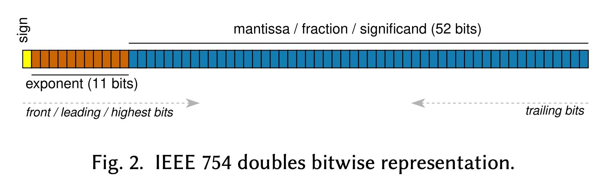
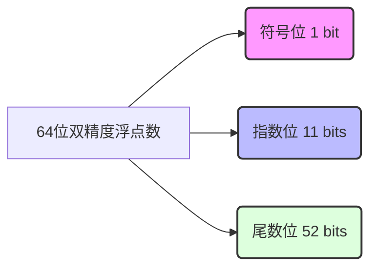
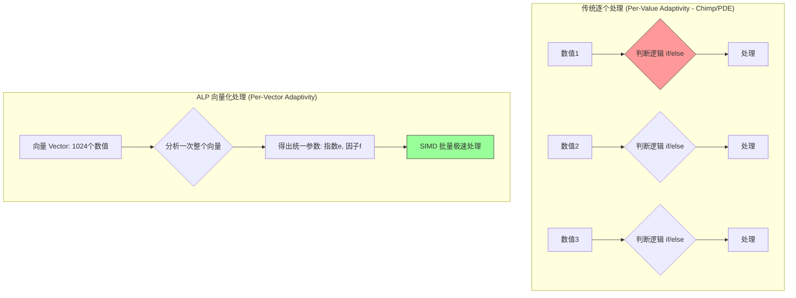
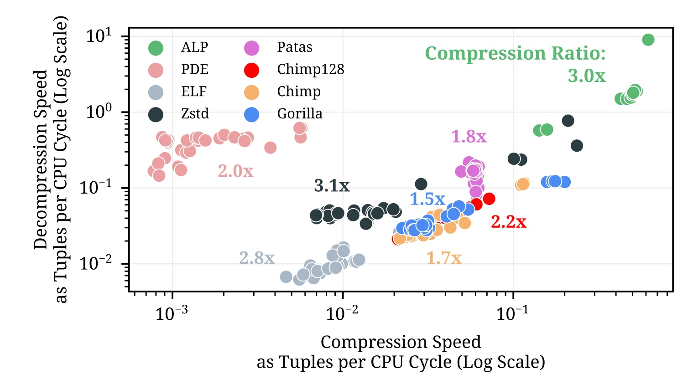
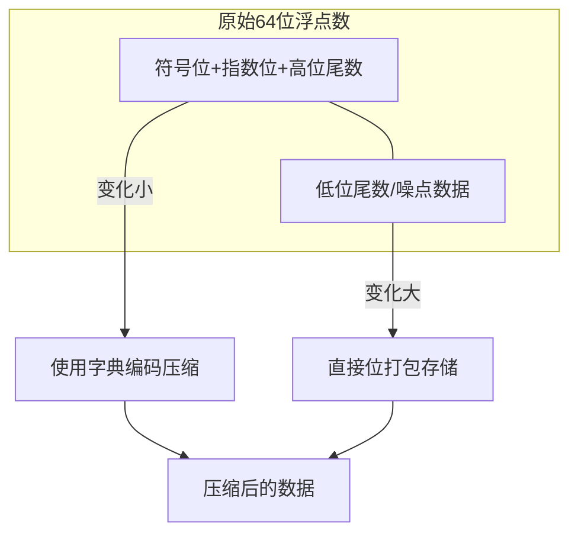

## AI论文解读 | ALP: Adaptive Lossless floating-Point Compression
        
### 作者        
digoal        
        
### 日期        
2025-11-20        
        
### 标签        
PostgreSQL , PolarDB , DuckDB , AI , 论文解读        
        
----        
        
## 背景  
      
https://dl.acm.org/doi/pdf/10.1145/3626717        
  
提示:          
```          
读懂《ALP: Adaptive Lossless floating-Point Compression》这篇论文需要提前掌握哪些基础知识, 请使用中文通熟易懂的讲解这些基础知识, 可以引用论文中的图、表或使用Markdown支持的图形(text,mermaid等)增加解释性. 
  
使用中文通熟易懂的解读《ALP: Adaptive Lossless floating-Point Compression》这篇论文, 其中的关键内容请着重讲解, 可以引用论文中的图、表或使用Markdown支持的图形(text,mermaid等)增加解释性. 
  
提取《ALP: Adaptive Lossless floating-Point Compression》这篇论文中的重要术语, 使用中文对这些术语进行通熟易懂的讲解, 可以引用论文中的图、表或使用Markdown支持的图形(text,mermaid等)增加解释性. 
```     
  
## 1 前置知识 
  
阅读《ALP: Adaptive Lossless floating-Point Compression》这篇论文，你需要掌握以下几个核心领域的背景知识。为了方便理解，我将这些知识点拆解为通俗易懂的模块，并结合论文内容进行图解说明。

### 1\. 计算机如何存储小数：IEEE 754 标准

这是理解整篇论文的基石。你需要知道计算机里的“浮点数（Double）”并不像我们手写的 `3.14` 那样直接存储，而是像“科学计数法”一样存储二进制位。

  * **概念：** IEEE 754 双精度浮点数（64-bit Double）将64位分为三部分 。
  * **结构（参考论文 Figure 2）：**    
    1.  **符号位 (Sign, 1 bit):** 正数还是负数。
    2.  **指数位 (Exponent, 11 bits):** 决定数值的大小范围（ 比如 $10^5$ 还是 $10^{-20}$ ）。
    3.  **尾数位 (Mantissa/Fraction, 52 bits):** 决定数值的精度（有效数字）。

**图解 IEEE 754 (论文图2简化版) ：**



  * **为什么要懂这个？**
      * 因为浮点数很多时候其实不能精确表示某些十进制小数（例如 0.1），这会导致“舍入误差” 。
      * ALP 算法的核心创新之一就是智能判断：这个数是保留原来的浮点位存储更好，还是把它转换成整数（Decimal）存储更好 。
      * 论文中提到的 **“Front-bits” (前导位)** 指的就是符号位、指数位和尾数的高位部分 。

-----

### 2\. 轻量级整数压缩算法 (Lightweight Integer Compression)

虽然 ALP 是压缩浮点数的，但它的核心思路是**将浮点数无损转化为整数**，然后利用成熟的整数压缩技术 。你需要了解以下三种基础整数压缩方法：

#### A. FOR (Frame Of Reference) 参考系编码

  * **原理：** 如果一组数都很大但很接近（如 1001, 1002, 1005），我们可以存一个基准值（Base = 1000），然后只存差值（1, 2, 5）。
  * **论文中的应用：** ALP 最终生成的整数会使用 **FFOR**（Fused Frame-Of-Reference）进行压缩 。

#### B. Delta Encoding 差分编码

  * **原理：** 只存储当前值与前一个值的差。
      * 原数据：`10, 12, 15, 16`
      * 存储为：`10, +2, +3, +1`
  * **局限性：** 论文指出，直接对浮点数做 Delta 编码行不通，因为浮点数加减法有精度丢失，无法做到“无损”还原 。

#### C. Bit-Packing 位压缩

  * **原理：** 计算机默认给整数分配 32位或64位。如果你的数很小（比如最大值是 7），其实只需要 3 个二进制位（ $111_2=7$ ）。Bit-packing 就是把这些多余的 0 去掉，把数据紧凑地挤在一起 。

-----

### 3\. 现有的浮点数压缩流派 (竞品分析)

理解 ALP 的优越性，需要知道它在跟谁比。主要有两派：

#### A. XOR-based (异或流派) - 代表：Gorilla, Chimp

  * **原理：** 利用异或运算（XOR）。如果两个浮点数很接近，它们的二进制位大部分是相同的。
      * `Value 1: 0101...1100`
      * `Value 2: 0101...1101`
      * `XOR 结果: 0000...0001` (全是0，很容易压缩)
  * **论文评价：** 这些算法（Gorilla, Chimp）压缩率不如通用压缩器（如 Zstd），而且解压速度不够快 。

#### B. Decimal-based (十进制流派) - 代表：PseudoDecimals (PDE)

  * **原理：** 观察到很多浮点数其实源自简单的十进制（比如金额 19.99）。
      * 操作：把 `19.99` 乘以 100 变成整数 `1999`，存下整数 `1999` 和指数 `-2` 。
  * **论文评价：** PDE 的压缩率不错，但它需要对每个数字单独“暴力搜索”最佳指数，导致压缩速度极慢 。

-----

### 4\. 向量化执行 (Vectorized Execution) 与 SIMD

这是 ALP 速度快的最关键原因。

  * **向量化 (Vectorization)：**

      * 传统数据库可能一次处理一行数据（Tuple-at-a-time）。
      * 现代分析型数据库（如 DuckDB, MonetDB）一次处理一列数据中的一大块（比如 **1024 个数值** 为一组，称为一个 Vector）。
      * **ALP 的设计：** 它是为了向量化而生的。它不是针对每个数字单独决定压缩策略，而是**对这 1024 个数字计算出一套通用的压缩参数**（ 例如同一个指数 $e$ ）。

  * **SIMD (Single Instruction, Multiple Data)：**

      * CPU 的一种能力，一条指令同时操作多个数据。
      * ALP 的代码是 "Scalar code that auto-vectorizes" ，意思是写的 C++ 代码很规整，编译器能自动把它翻译成 SIMD 指令，从而获得极高的解压速度。

**图解向量化处理差异：**



### 总结：阅读论文时的心态

当你阅读这篇论文时，请带着这样的认知：

1.  **浮点数很占空间且难以压缩**（因为尾数位随机性大）。
2.  **现有的方法要么慢（PDE），要么压缩率不够好（Gorilla/Chimp）。**
3.  **ALP 的魔法在于：**
      * 它发现一个向量（1024个数）里，大部分数字可以用**同一个**指数变成整数（利用了数据的局部性）。
      * 变成了整数，就能用极快的整数压缩（FFOR）。
      * 如果变不成整数（真正的无理数），它就只压缩高位（Front-bits），低位直接存起来 。
      * 所有操作都是批量的（Vectorized），所以速度极快。
  
## 2 解读论文 
  
这是一篇关于数据库和大数据领域非常重要的论文解读。简单来说，**ALP (Adaptive Lossless floating-Point Compression)** 是一种专为浮点数（Doubles）设计的**无损压缩算法**。

它的核心成就在于：**它比现有的浮点数压缩算法（如 Gorilla, Chimp, Patas）压缩率更高，同时速度快了 1-2 个数量级** 。

以下是对这篇论文的通俗解读。

-----

### 1\. 核心痛点：浮点数太难压缩了

在数据库中，很多数据是作为 **64位双精度浮点数 (IEEE 754 Doubles)** 存储的。

  * **现状：** 传统的通用压缩（如 Zstd）压缩率好但速度慢，且无法随机访问（必须解压一大块）。新兴的轻量级算法（如 Gorilla, Chimp）利用“异或”运算来压缩，速度还可以，但压缩率往往不够理想 。
  * **洞察：** 作者发现，数据库里存的很多“浮点数”，其实并不是真正的科学测量数据，而是**源自十进制的小数**（比如金额 `19.99`，温度 `36.5`）。这些数被转成二进制浮点数后，会产生微小的精度误差（例如 `0.1` 变成了 `0.10000000000000000555...`）。
  * **机会：** 如果能把这些“伪装成浮点数”的十进制数还原回整数（例如把 `19.99` 存成整数 `1999`），就能利用极快的整数压缩技术（如 FOR, Bit-Packing）。

-----

### 2\. ALP 的核心魔法：向量化十进制编码

ALP 的设计哲学是 **“向量化 (Vectorized)”** ，即一次处理一组数据（通常是 1024 个数值），而不是一个一个处理 。

#### 魔法一：把浮点数变回整数 (ALP Encoding)

ALP 尝试找到一个**指数 ( Exponent, $e$ )**，把一整组浮点数乘以 $10^e$ ，变成整数。

  * **传统做法 (PDE)：** 对每个数找一个最佳指数。这需要存储很多额外的指数信息，且计算慢 。
  * **ALP 的做法：** 对**一整组（1024个）数值，只使用同一个**指数 $e$ 。作者发现，在同一列数据中，数值的量级通常很接近，用一个大指数（ 比如 $e=14$ ）通常能覆盖绝大多数情况 。

#### 魔法二：切掉多余的零 ( Factor $f$ )

如果为了保留精度，我们用了很大的指数（ 例如 $e=14$ ），数值会变得非常大，且末尾会有很多零。

  * 例如：`12.3` 乘以 $10^{14}$ 变成 `1230000000000000`。
  * **优化：** ALP 引入了一个**因子 ( Factor, $f$ )**。它再乘以 $10^{-f}$ 来切掉末尾的零。
  * **公式：** $ALP_{enc} = \text{round}(数值 \times 10^e \times 10^{-f})$ 。
  * 这样 `12.3` 就变成了精简的整数 `123`，大大减少了存储所需的比特位。


#### 魔法三：极速取整 (Fast Rounding)

在 CPU 中将浮点数转为整数通常很慢。ALP 利用了浮点数的一个特性（Magic Number Trick）：

  * 给浮点数加上一个巨大的“魔法数” ( $2^{51} + 2^{52}$ )，CPU 会自动把浮点数的小数部分“挤”出去，从而实现极速取整。这比标准的转换指令快得多，且支持 SIMD 并行处理 。

-----

### 3\. 真正的浮点数怎么办？ (ALP\_rd)

如果数据真的是高精度的科学数据（例如经纬度坐标 `40.712776...`），没法无损转成整数怎么办？
ALP 会自动切换到 **ALP\_rd (Real Doubles)** 模式 。

  * **原理：** 即使是乱序的浮点数，它们的**前导位 (Front-bits)**（符号位+指数位+高位尾数）通常也是相似的 。
  * **操作：**
    1.  **切分：** 把 64 位浮点数切成两半。
    2.  **左半部分 (高位)：** 变化不大，用字典编码 (Dictionary) 压缩 。
    3.  **右半部分 (低位)：** 变化太大，直接把最后几位丢进去存储 (Bit-Packing) 。

-----

### 4\. 为什么 ALP 这么快？(Adaptivity & Sampling)

ALP 不会对每个数都去思考“我该怎么压”。它采用**两级采样 (Two-level Sampling)** 策略：

1.  **Row-Group 级采样：** 先看一大块数据（比如 10万行），通过采样快速判断这列数据的大致特征，从几百种组合中选出 **Top 5** 最佳的 $(e, f)$ 组合 。
2.  **Vector 级选择：** 在处理每个小向量（1024行）时，只从这 Top 5 里选一个最好的。如果数据非常整齐，甚至连这一步都跳过 。

这种设计使得 ALP 既能适应数据变化，又避免了繁重的逐个计算，实现了极高的速度。

-----

### 5\. 性能对比大比拼

论文在多个数据集上进行了测试，结果非常震撼（参考论文图 1）：    

| 维度 | ALP 的表现 | 竞品对比 |
| :--- | :--- | :--- |
| **压缩率** (Compression Ratio) | **极高** | 比 Gorilla 好 49%，比 Chimp 好 43%，比 PDE 好 31%。仅次于 Zstd，但在时间序列数据上甚至击败了 Zstd 。 |
| **解压速度** (Decompression Speed) | **极快** | 比 PDE 快 7 倍，比 Patas 快 17 倍，比 Gorilla 快 55 倍，比 Zstd 快 26 倍 。 |
| **特性** | **向量化** | 支持 SIMD 指令，且解压时不需要像 Zstd 那样解压整个 Block，可以只解压需要的向量，支持谓词下推 。 |

**图 1 解读 (简化描述):**
在性能坐标系中，横轴是压缩速度，纵轴是解压速度。ALP 的位置在**最右上角**（又快又好），也就是图中的绿色点群，远远将其他颜色的算法甩在身后 。

### 6\. 总结

ALP 的成功在于它看透了浮点数存储的本质：

1.  大部分浮点数其实是**伪装的整数**。
2.  **向量化处理**（批量处理）比逐个精细处理要快得多，且能利用 SIMD 硬件加速。
3.  **自适应**采样避免了暴力搜索的开销。

**下一步建议：**
如果您对如何在实际系统中（如 C++ 项目或数据库内核）实现 ALP 感兴趣，我可以为您解析其开源代码库的关键实现细节或具体算法的伪代码逻辑。
  
## 3 术语 
  
这篇论文介绍了一种名为 **ALP** 的新型浮点数压缩算法，它在速度和压缩率上都显著超越了现有技术。为了帮助你深入理解，我提取了论文中的关键术语，并用通俗易懂的语言进行解读。

-----

### 1\. 核心算法与架构

#### **ALP (Adaptive Lossless floating-Point Compression)**

  * **中文释义**：自适应无损浮点数压缩。
  * **通俗解读**：这是论文提出的主角。它是一种专门针对“双精度浮点数”（即计算机里的 `double` 类型）的压缩技术 。
      * **“无损”** 意味着压缩后再解压，数据与原始数据哪怕一个比特位都不差 。
      * **“自适应”** 意味着它不“死板”，它会根据数据的特点（是像金额一样整齐，还是像科学实验数据一样杂乱）自动切换压缩策略 。
      * **核心优势**：它比之前的算法（如 Gorilla, Chimp）压缩率更高，且速度快了 1-2 个数量级 。

#### **Vectorized Execution (向量化执行)**

  * **中文释义**：向量化执行。
  * **通俗解读**：传统的处理方式是“一个萝卜一个坑”，一次处理一个数字。ALP 采用了“批发”模式，一次处理一组数字（通常是 **1024 个数值**，称为一个 Vector） 。
  * **为什么重要**：现代 CPU 有一种能力（SIMD），可以一条指令同时操作多个数据。ALP 的设计就是为了迎合这种能力，从而实现极高的速度 。
  * **对比**：其他算法（如 PDE）需要对每个数字单独寻找压缩参数，而 ALP 对这 1024 个数字使用**同一套**参数，大大减少了存储开销和计算复杂度 。

-----

### 2\. 核心压缩机制：把浮点数变回整数

ALP 发现很多浮点数其实原本是十进制数（比如 `19.99`），只是被计算机存储成了浮点数。如果能把它们还原成整数，就能压得很小。

#### **Exponent (e) & Factor (f)**

  * **中文释义**：指数 $e$ 与 因子 $f$ 。

  * **通俗解读**：这是 ALP 将浮点数转换为整数的两个关键“魔法参数”。

      * **指数 $e$ (扩大)**：负责把小数变成整数。例如 `12.34`，如果 $e=2$ ，乘以 $10^2$ 就变成了 `1234` 。ALP 倾向于使用很大的 $e$ （如 14），以保证转换过程不丢失精度 。
      * **因子 $f$ (精简)**：如果 $e$ 选得太大（ 比如为了适应 `0.0001` 选了 $e=14$ ），那么简单的数 `12.0` 就会变成巨大的 `120000000000000`。因子 $f$ 就是用来**切掉后面多余的零**的。如果 $f=13$ ，就相当于除以 $10^{13}$ ，把巨大的数又变回小整数，节省存储空间 。

    **ALP 编码公式图解：**
    $$ALP_{enc} = \text{round}(数值 \times 10^e \times 10^{-f})$$ 


#### **Fast Rounding / Magic Number Trick (极速取整)**

  * **中文释义**：快速取整 / 魔法数技巧。
  * **通俗解读**：在计算机里，把浮点数（Double）转成整数（Int）通常比较慢。ALP 使用了一个黑客技巧：给浮点数加上一个巨大的“魔法数”（ $2^{51} + 2^{52}$ ）。
  * **原理**：这就好比把一个乱七八糟的数字推到了一个“对齐网格”里，利用浮点数本身的存储特性，让它自动丢弃小数部分。这样做只用加减法，非常适合向量化加速，比标准转换指令快得多 。

-----

### 3\. 兜底方案：处理真正的浮点数

#### **ALP\_rd (ALP for Real Doubles)**

  * **中文释义**：针对“真”浮点数的 ALP。
  * **通俗解读**：有些数据（如经纬度坐标 `40.7128...` 或科学测量值）本质上就很复杂，没法完美转成整数。这时候 ALP 会启动 **ALP\_rd** 模式 。
  * **工作原理**：
    1.  **切一刀**：找到一个分割点，把 64 位数据切成“左半部分（高位）”和“右半部分（低位）” 。
    2.  **压左边**：左边通常是指数和符号，变化不大，ALP 使用**字典编码 (Dictionary Encoding)** 来压缩这部分 。
    3.  **存右边**：右边是变化剧烈的尾数，直接存储（Bit-Packing） 。




-----

### 4\. 辅助技术

#### **FFOR (Fused Frame-Of-Reference)**

  * **中文释义**：融合参考系编码。
  * **通俗解读**：这是 ALP 把浮点数变成整数后，实际进行存储的最后一步。
      * **FOR (参考系)**：比如有一组数 `[1001, 1002, 1005]`，它只存基准值 `1000` 和差值 `[1, 2, 5]`，这样数就变小了 。
      * **Fused (融合)**：ALP 使用的 FastLanes 库将“减去基准值”和“打包比特位”这两个步骤合并成一个操作内核，进一步提升了速度 。

#### **Two-Stage Sampling (两级采样)**

  * **中文释义**：两级采样机制。
  * **通俗解读**：为了不让压缩过程太慢，ALP 不会把所有可能的参数组合都试一遍。
      * **第一级（粗选）** ：先看一大块数据（Row-Group），大概选出 Top 5 个最好的 $(e, f)$ 组合 。
      * **第二级（精选）** ：在处理每一小队数据（Vector）时，只从这 5 个里挑一个最好的 。
      * 这确保了 ALP 既聪明又迅速 。
  
## 参考        
         
https://dl.acm.org/doi/pdf/10.1145/3626717    
        
<b> 以上内容基于DeepSeek、Qwen、Gemini及诸多AI生成, 轻微人工调整, 感谢杭州深度求索人工智能、阿里云、Google等公司. </b>        
        
<b> AI 生成的内容请自行辨别正确性, 当然也多了些许踩坑的乐趣, 毕竟冒险是每个男人的天性.  </b>        
    
#### [PolarDB 学习图谱](https://www.aliyun.com/database/openpolardb/activity "8642f60e04ed0c814bf9cb9677976bd4")
  
  
#### [PostgreSQL 解决方案集合](../201706/20170601_02.md "40cff096e9ed7122c512b35d8561d9c8")
  
  
#### [德哥 / digoal's Github - 公益是一辈子的事.](https://github.com/digoal/blog/blob/master/README.md "22709685feb7cab07d30f30387f0a9ae")
  
  
#### [About 德哥](https://github.com/digoal/blog/blob/master/me/readme.md "a37735981e7704886ffd590565582dd0")
  
  

  
