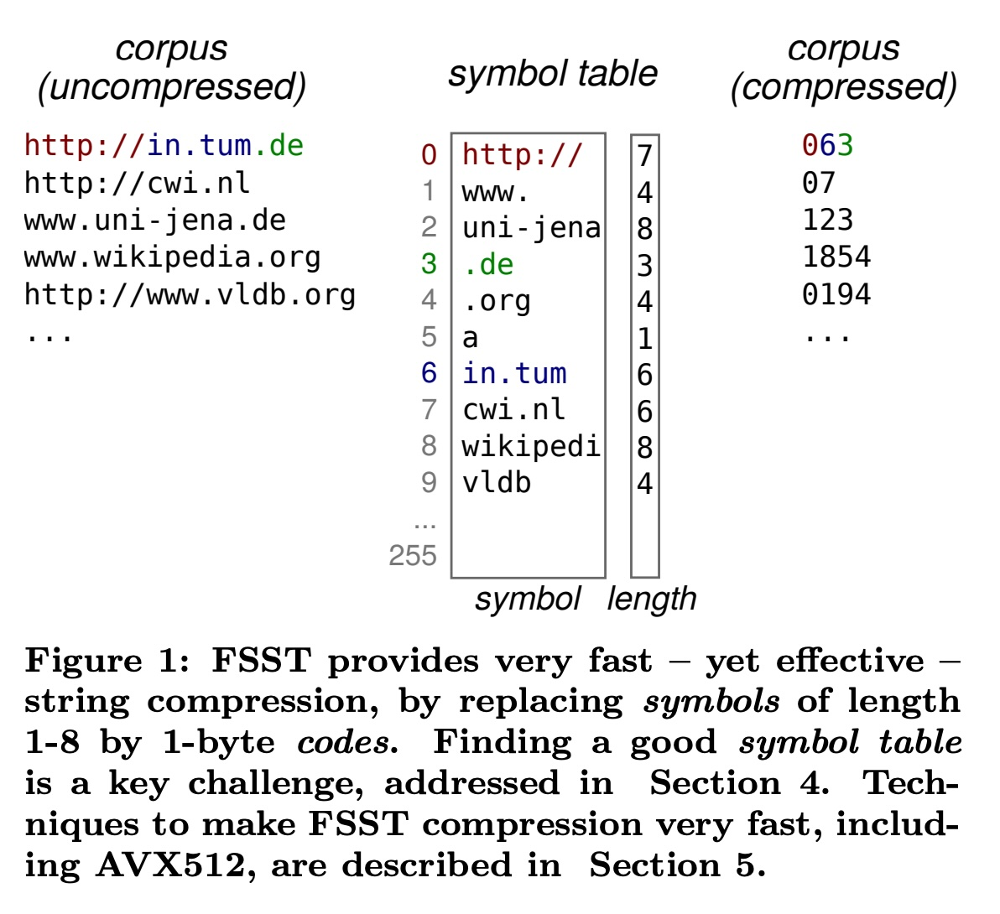
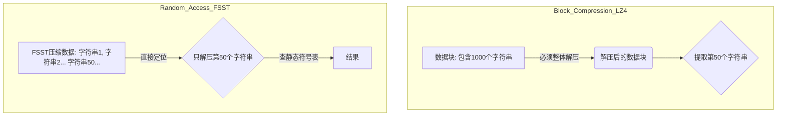
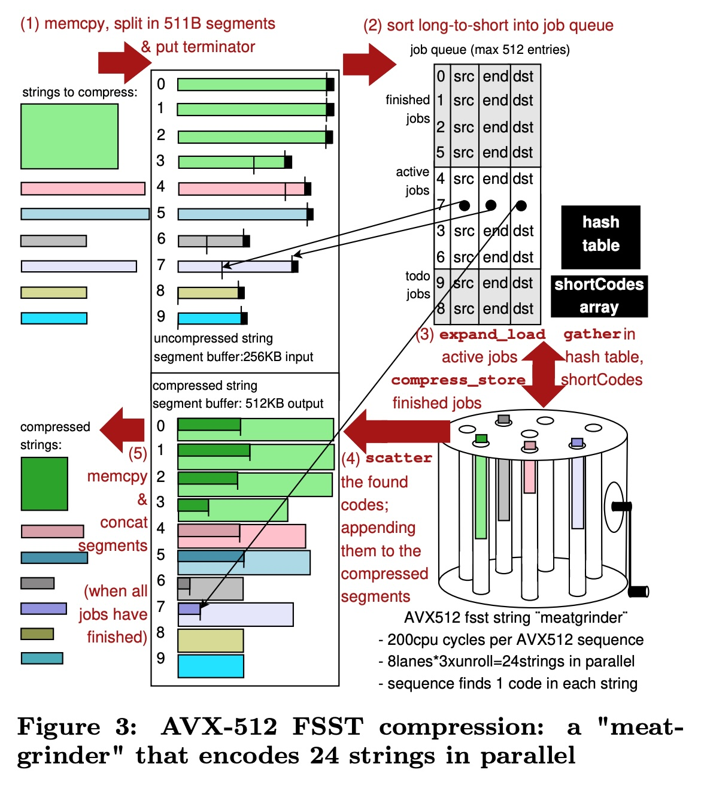
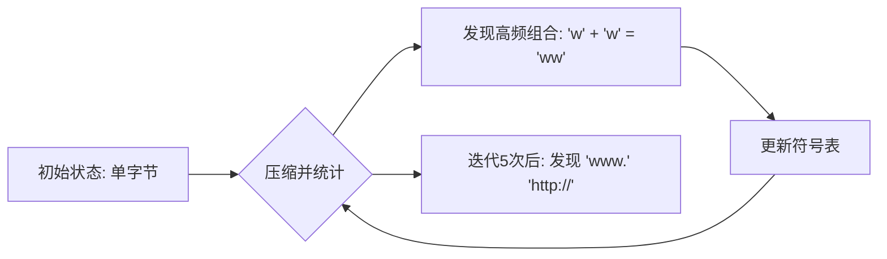
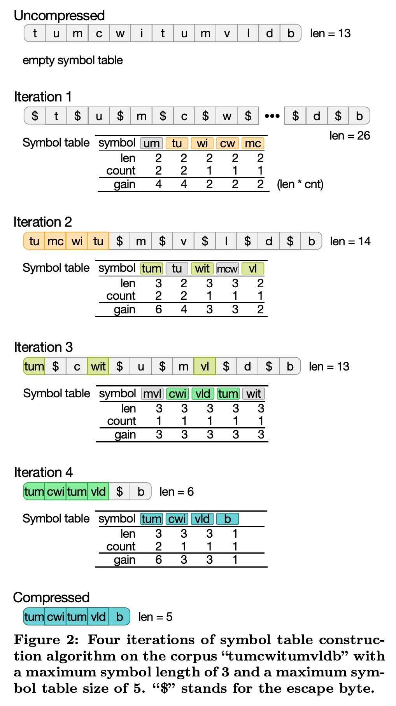
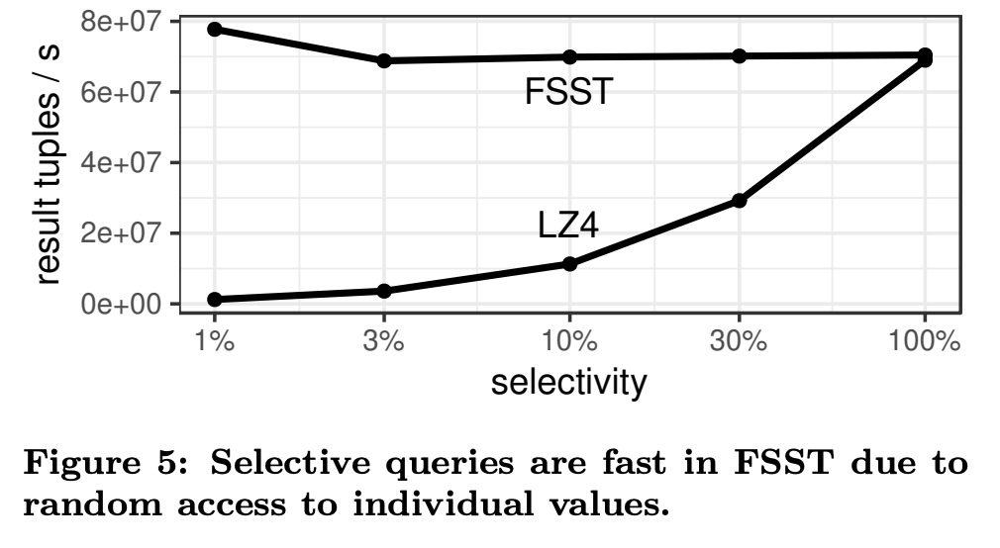
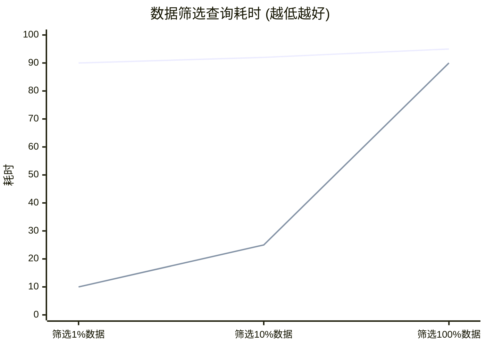
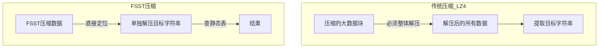

## AI论文解读 | FSST: Fast Random Access String Compression
        
### 作者        
digoal        
        
### 日期        
2025-11-20        
        
### 标签        
PostgreSQL , PolarDB , DuckDB , AI , 论文解读        
        
----        
        
## 背景  
      
https://www.vldb.org/pvldb/vol13/p2649-boncz.pdf        
  
提示:          
```          
读懂《FSST: Fast Random Access String Compression》这篇论文需要提前掌握哪些基础知识, 请使用中文通熟易懂的讲解这些基础知识, 可以引用论文中的图、表或使用Markdown支持的图形(text,mermaid等)增加解释性. 
  
使用中文通熟易懂的解读《FSST: Fast Random Access String Compression》这篇论文, 其中的关键内容请着重讲解, 可以引用论文中的图、表或使用Markdown支持的图形(text,mermaid等)增加解释性. 
  
提取《FSST: Fast Random Access String Compression》这篇论文中的重要术语, 使用中文对这些术语进行通熟易懂的讲解, 可以引用论文中的图、表或使用Markdown支持的图形(text,mermaid等)增加解释性. 
```     
  
## 1 前置知识 
  
要读懂《FSST: Fast Random Access String Compression》这篇论文，你需要掌握以下几个核心领域的计算机基础知识。我会用通俗易懂的语言为你讲解，并结合论文中的内容进行辅助说明。

### 1\. 字典压缩 (Dictionary Compression) 与符号表

这是 FSST 的核心思想。

  * **基础概念**：想象你有一本书，里面频繁出现“中华人民共和国”这七个字。为了省纸，你可以在书的扉页做一个表格（字典/符号表），规定用数字 `1` 代表这七个字。在正文中，每当要写这七个字时，你只写 `1`。阅读时，查表还原即可。
  * **论文中的应用**：FSST 创建了一个“静态符号表”（Symbol Table）。它将文本中频繁出现的长度为 1 到 8 字节的子串（Symbols），映射为 1 个字节的代码（Code）。
  * **通俗例子**：
      * 原始文本：`http://www.google.com`
      * 符号表：`0 = http://`, `1 = www.`, `2 = .com`
      * 压缩后：`0` `1` `google` `2`
      * **FSST 的特例**：FSST 的代码固定为 1 字节，所以最多只能有 255 个符号（留一个做转义符）。

**图解 FSST 压缩原理 (参考论文 Figure 1 )**    

| 原始文本 (Corpus) | 符号表 (Symbol Table) | 压缩后 (Compressed) |
| :--- | :--- | :--- |
| `http://in.tum.de` | `0` -\> `http://` | `0` `6` `3` |
| `http://cwi.nl` | `6` -\> `in.tum` | `0` `7` |
| `www.uni-jena.de` | `3` -\> `.de` | `1` `2` `3` |
| ... | ... | ... |

-----

### 2\. 块压缩 (Block Compression) vs. 随机访问 (Random Access)

理解为什么现有的通用压缩算法（如 LZ4）不适合数据库中的字符串列。

  * **块压缩 (LZ4 等)**：
      * **原理**：为了压缩得更小，它需要看很大一段数据（比如 64KB 或更大）。后面的数据压缩依赖于前面的数据。
      * **缺点**：这就好比一个长视频文件。如果你想看第 50 分钟的画面，你必须先下载并解码前 49 分钟的数据。这在数据库中很慢，因为我们经常只需要读取某一行的某一个字段。
  * **随机访问 (FSST 的优势)**：
      * **原理**：每个字符串都是独立压缩的，不依赖上下文。
      * **优点**：就像 DVD 选章节一样，你想读第 5 行的字符串，直接读那几个字节并查表解压即可，不需要解压整个数据块 。




-----

### 3\. SIMD 指令集 (AVX-512)

论文为了让压缩速度飞快（达到 GB/s 级别），大量使用了 CPU 的并行计算能力。

  * **基础概念**：普通 CPU 指令一次处理一个数据（Scalar，标量）。SIMD（Single Instruction, Multiple Data）指令一次可以处理多个数据（Vector，向量）。
  * **AVX-512**：这是 Intel CPU 的一种高级指令集，它拥有 512 位宽的寄存器。这意味着它一次操作可以处理 64 个字节（512 bits / 8 bits/byte = 64 bytes）。
  * **论文中的“绞肉机” (Meatgrinder)**：
      * FSST 将其压缩核心称为“绞肉机”。它并不是一次处理一个字符串，而是利用 AVX-512 同时并行处理 **24 个字符串** 。
      * **Mask (掩码)**：在 SIMD 编程中，因为不能写 `if-else` 分支语句（会打断并行流），通常使用“掩码”来标记哪些数据需要处理，哪些需要跳过。论文中提到的 `loadmask` 等就是这个概念 。

**图解 SIMD 并行处理 (参考论文 Figure 3 )**    

> **标量处理 (普通模式):**  
> 字符串1 -\> 处理 -\> 完成  
> 字符串2 -\> 处理 -\> 完成  
>  
> **SIMD 处理 (FSST 模式):**  
> [字符串1, 字符串2, ... 字符串24]  -\> **一次性指令** -\> [结果1, 结果2, ... 结果24]   

-----

### 4\. 哈希表 (Hash Table) 与 完美哈希 (Perfect Hashing)

为了在压缩时快速找到“当前字符串片段是否在符号表中”，需要极快的查找速度。

  * **基础概念**：哈希表通过计算一个“特征值”（Hash）来快速定位数据。
  * **冲突 (Collision)**：不同的字符串算出的 Hash 值可能一样。解决冲突通常很慢（要对比、要跳转）。
  * **FSST 的策略：有损完美哈希 (Lossy Perfect Hashing)**：
      * 通常“完美哈希”是指设计一种算法让所有数据都不冲突。
      * FSST 为了速度，不做复杂的冲突处理。如果两个不同的符号 Hash 值冲突了，它就**直接丢弃**或者**覆盖**其中一个。因为 FSST 是为了压缩，错过一个符号只是压缩率稍微低一点点，但速度快了很多。这在论文中被称为“Lossy” (有损的) 。

-----

### 5\. 字节编码与转义 (Escape Codes)

理解如何处理“符号表中没有的字符”。

  * **问题**：如果符号表里只有 `http://` 和 `.com`，但文本里出现了 `apple` 怎么办？
  * **转义机制**：FSST 保留了一个特殊代码（数字 255）作为“转义符” 。
  * **处理流程**：
    1.  遇到 `apple`。
    2.  查表发现 `a` 不在表中。
    3.  输出 `255` (转义符) + `a` (原始字节)。
    <!-- end list -->
      * 虽然这会让数据变大（1个字节变成了2个字节），但因为大部分常见的串都在表中，整体还是压缩的。

### 总结：阅读路线图

在阅读论文时，你可以按照这个逻辑串联知识点：

1.  **Introduction**: 了解目标——做一个**既能随机访问**，**压缩率又高**，**速度还快**的字符串压缩算法。
2.  **Section 3**: 核心机制——看懂 Figure 1，理解**符号表**是如何把长字符串变成短代码的。    
3.  **Section 4**: 建表算法——FSST 是怎么从一堆文本里“学习”出哪些子串最值得放进符号表的（Bottom-up 策略）。
4.  **Section 5 (难点)**: 性能优化——利用 **SIMD (AVX-512)** 和 **有损哈希** 来实现极速编码。如果不懂汇编或底层优化，可以只关注它是如何利用“并行”来加速的即可。
  
## 2 解读论文 
  
这份报告为您通俗易懂地解读论文《FSST: Fast Random Access String Compression》。这篇论文由 CWI（荷兰国家数学与计算机科学研究中心）和 TUM（慕尼黑工业大学）的研究人员提出，主要解决数据库中**字符串压缩**的难题。

-----

### 1\. 核心痛点：为什么我们需要 FSST？

在现代数据库中，字符串（如 URL、邮箱、UUID、人名）占据了大量空间，且处理速度慢 。现有的通用压缩算法（如 LZ4）虽然优秀，但有两个主要问题：

1.  **不仅要小，还要“独立”** ：LZ4 通常需要把很多字符串打包成一个大块（Block）压缩才能获得好的效果 。如果你只想读取其中的第 50 行数据，你必须把整个块都解压出来，这非常浪费计算资源 。
2.  **短字符串压缩难**：数据库里的字符串通常很短（平均小于 30 字节），LZ4 面对这种短数据压缩效果很差，甚至可能越压越大 。

**FSST 的解决方案**：一种轻量级的、**支持随机访问**的压缩算法。它能让你直接解压任意一个独立的字符串，而无需解压其邻居，且压缩速度极快 。

-----

### 2\. 核心原理：静态符号表 (Static Symbol Table)

FSST 的核心思想非常直观： **“用短代码替换长片段”** 。

它不仅是替换，而是把经常出现的长度为 1 到 8 字节的“子串”（称为 Symbol），映射为一个 **1 字节** 的代码（Code）。

#### 2.1 压缩示意图

想象一下，我们把一堆 URL 压缩，FSST 会自动发现 `http://`、`www.`、`.com` 是高频词。

| 原始文本 (Corpus) | 符号表 (Symbol Table) | 压缩后的样子 (1字节代码序列) |
| :--- | :--- | :--- |
| `http://in.tum.de` | `0` -\> `http://` | `0` `6` `3` |
| `http://cwi.nl` | `6` -\> `in.tum` | `0` `7` |
| `www.uni-jena.de` | `3` -\> `.de` | `1` `2` `3` |
| ... | `255` -\> (转义符) | ... |

*引用论文 Figure 1 的逻辑*     

  * **压缩前**：`http://in.tum.de` (16 字节)
  * **压缩后**：代码 `0` + 代码 `6` + 代码 `3` (3 字节)。压缩率惊人！
  * **转义机制**：代码 `255` 被保留作为“转义符”。如果遇到符号表里没有的字符，就用 `255` 标记，然后直接复制原始字节 。

#### 2.2 为什么叫“静态”？

这正是它支持随机访问的秘密。整个数据块共享同一个固定的符号表，这个表一旦生成就不变了。因此，解码第 N 个字符串时，只需要拿着这个表查就行，不需要知道第 N-1 个字符串是什么内容 。

-----

### 3\. 关键技术一：如何构建“完美”的符号表？

这是 FSST 最具挑战性的部分。如果单纯统计出现频率最高的词并不行，因为词之间有重叠（例如 `http://` 和 `ttp://`）。

FSST 采用了一种 **“自底向上”（Bottom-up）的迭代算法** ：

1.  **从零开始**：一开始符号表是空的。
2.  **统计配对**：扫描文本，统计哪些“相邻的两个符号”经常一起出现。
3.  **合并进化**：把出现频率最高的“符号对”合并成一个新的、更长的符号（比如 `h` 和 `t` 合并成 `ht`，下一轮 `ht` 和 `tp` 合并成 `http`）。
4.  **优胜劣汰**：每一轮迭代都会生成新符号，挤掉旧的、价值低的符号，保持表的大小为 255 个。
5.  **循环 5 次**：经过 5 轮迭代，就能自动学习出最适合当前数据的符号表（长度可达 8 字节）。

**流程图解：**



*参考论文 Figure 2 的迭代过程*

  


-----

### 4\. 关键技术二：极速编码的“绞肉机” (SIMD Meatgrinder)

知道怎么压缩还不够，为了让压缩速度达到 GB/s 级别，作者利用了现代 CPU 的并行计算能力（AVX-512 指令集）。

论文形象地将这个并行压缩核心称为 **“绞肉机”（Meatgrinder）** 。

  * **并行处理**：它不是一个接一个地压缩字符串，而是利用 512 位的寄存器，同时并行处理 **24 个字符串** 。
  * **无分支逻辑**：CPU 最怕 `if-else` 跳转。FSST 使用了一种“有损完美哈希”（Lossy Perfect Hashing）技术，通过计算哈希值直接定位符号，避免了复杂的判断逻辑，极大地提升了速度 。
  * **有损（Lossy）的智慧**：为了快，如果两个符号的哈希值冲突了，FSST 选择直接覆盖（丢弃一个）。因为这只是压缩，丢弃一个符号顶多压缩率降一点点，但换来的是巨大的速度提升 。

-----

### 5\. 性能大比拼：FSST vs LZ4

论文使用了大量真实数据集（如推特、GitHub 代码、地址信息等）进行了测试 。

#### 5.1 压缩率与速度对比

  * **压缩率**：FSST 平均能将文本压缩到原来的 **1/2** 左右（2.28倍），比 LZ4 的 1.7倍要好得多 。
  * **压缩速度**：在使用 AVX-512 的情况下，FSST 达到了约 **1 GB/s** 的单核压缩速度，解码速度更是接近 **2 GB/s** 。
  * **随机访问优势**：这是绝杀。如下图所示，当只需要读取少量数据（Selectivity 低）时，FSST 因为不需要解压无关数据，性能完胜 LZ4。

**查询性能对比示意图 (基于论文 Figure 5):**    



*(注：LZ4 因为必须解压整个块，所以无论筛选多少数据，初始耗时都很高；而 FSST 随取随用，少量读取时极快 )*

-----

### 6\. 总结与应用价值

**FSST 的核心优势总结** ：

1.  **随机访问**：像数组一样直接访问压缩后的第 N 个字符串。
2.  **不改变字符串性质**：压缩后的数据依然保持字节序，某些操作（如相等性比较）甚至可以直接在压缩数据上进行，无需解压 。
3.  **极速**：利用 SIMD 技术，速度与 LZ4 相当甚至更快。
4.  **高压缩比**：针对短文本（数据库场景）专门优化，比通用算法更省空间。

**应用场景**：
FSST 非常适合集成到现代数据库系统（如 DuckDB, Umbra 等）中，作为 `TEXT` 类型字段的默认存储格式。它可以在不牺牲查询速度的前提下，显著减少内存和磁盘的占用 。
  
## 3 术语 
  
这是一份基于《FSST: Fast Random Access String Compression》论文的核心术语解读。为了让你更容易理解，我将这些术语分为了**核心概念**、**构建原理**和**性能优化**三个部分，并配以通俗的解释和图解。

### 一、 核心概念 (Core Concepts)

#### 1\. FSST (Fast Static Symbol Table)

  * **定义**：即“快速静态符号表”。这是论文提出的压缩算法名称。它的核心思想是用较短的“代码”（1字节）来替换文本中频繁出现的较长“子串”（1-8字节）。
  * **通俗解释**：想象你在发短信，为了省流量，你和朋友约定：输入“1”代表“哈哈”，输入“2”代表“今晚去哪吃”。FSST 就是这个自动生成“约定书”并进行替换的系统。
  * **特点**：FSST 专注于字符串压缩，压缩速度极快，且支持随机访问。

#### 2\. Static Symbol Table (静态符号表)

  * **定义**：一个固定的映射表，包含最多 255 个符号（Symbol）。在压缩一大块数据时，这个表一旦生成就不会改变（Immutable）。
  * **与传统方法的区别**：传统的压缩算法（如 LZ4）是动态调整字典的，这意味着解压第 100 个字可能依赖于第 99 个字。而 FSST 的表是“静态”的，每个字符串都用同一个表独立解压。
  * **图解** (基于论文 Figure 1 )：    

| 代码 (Code) | 符号 (Symbol) | 原始文本 | 压缩结果 |
| :--- | :--- | :--- | :--- |
| `0` | `http://` | `http://in.tum.de` | `0` `6` `3` |
| `6` | `in.tum` | (16字节) | (3字节) |
| `3` | `.de` | | |

#### 3\. Random Access (随机访问)

  * **定义**：能够直接解压任意一个独立的字符串，而不需要解压它周围的数据块。
  * **重要性**：在数据库中，我们经常需要读取第 500 行的“姓名”。如果用传统算法（LZ4 Block），必须把包含这行的整个 64KB 数据块全部解压才能拿到那几个字节。而 FSST 可以直接定位并解压那一行，非常适合数据库查询。




#### 4\. Escape Code (转义代码)

  * **定义**：FSST 固定使用数字 `255` 作为特殊标记。当文本中出现了符号表里没有的字符时，就用 `255` 加上原始字符来表示。
  * **通俗解释**：符号表只有 255 个位置，不可能包含所有汉字或生僻词。当遇到表里没有的字（比如“生”），FSST 就会记录为：“[转义符] + 生”。虽然这会让这个字变长（占2字节），但它保证了任何新文本都能被正确处理，不需要重新建表。

-----

### 二、 构建原理 (Construction Mechanics)

#### 5\. Bottom-Up Construction (自底向上构建)

  * **定义**：这是 FSST 生成高质量符号表的算法。它不一开始就找最长的词，而是从单个字节开始，通过多次迭代，把经常连在一起出现的“对子”合并成更长的符号。
  * **过程**：
    1.  **迭代 1**：统计哪些单字节经常挨在一起（比如 `h` 和 `t`）。
    2.  **迭代 2**：把它们合并成新符号 `ht`，再看它和谁经常挨着（比如 `ht` 和 `tp`）。
    3.  **迭代 5 次**：最终进化出长符号（如 `http://`）。
  * **解决的问题**：避免了贪婪算法的短视（Dependency Issue），能找到真正能带来最大压缩收益的符号组合。

#### 6\. Line Mode vs. File Mode (行模式 vs. 文件模式)

  * **定义**：这是两种处理数据的方式。
      * **File Mode**：把所有字符串拼成一个超大文件压缩（适合 LZ4，因为上下文多）。
      * **Line Mode**：把每一行当作独立的字符串压缩（数据库的典型场景）。
  * **结论**：FSST 在“行模式”下优势巨大，因为它不需要依赖上下文；而 LZ4 在处理短字符串（行模式）时效果很差，甚至会把数据压大。

-----

### 三、 性能优化 (Performance Optimization)

#### 7\. SIMD (Single Instruction, Multiple Data)

  * **定义**：一种 CPU 技术，允许一条指令同时处理多个数据。FSST 极度依赖 SIMD（特别是 AVX-512 指令集）来加速。
  * **作用**：在压缩时，FSST 不是一个字一个字处理，而是利用 512 位宽的寄存器，一次性并行处理多个字符串片段。

#### 8\. Meatgrinder (绞肉机)

  * **定义**：这是论文作者给 FSST 的 AVX-512 并行编码内核起的一个形象的昵称。
  * **工作方式**：它维护了 24 个并行的“通道”（Lanes）。就像把 24 条肉（字符串）同时塞进绞肉机，机器转一圈，24 条字符串都向前推进一点，并吐出压缩后的代码。如果有字符串处理完了，新的字符串会立刻补位。

#### 9\. Lossy Perfect Hashing (有损完美哈希)

  * **定义**：为了让“绞肉机”转得够快，必须消除所有 `if-else` 分支判断。FSST 使用了一种特殊的哈希表来查找符号。
  * **"完美"与"有损"的权衡**：
      * **完美**：不需要处理“哈希冲突”的复杂逻辑（通常处理冲突需要循环或跳转，这在 SIMD 中很慢）。
      * **有损**：如果两个不同的符号算出的哈希值一样（冲突），FSST 选择直接**丢弃**其中一个，只保留原本那个。
  * **为什么敢有损？**：因为这是在选“用来压缩的符号”。丢弃一个符号顶多是压缩率稍微低了一点点（不到 1% 的损失），但换来的是没有分支跳转的极速性能。

#### 10\. Zero-terminated Strings (0结尾字符串)

  * **定义**：C 语言中字符串通常以 `\0` (数字0) 结尾。FSST 支持这种格式。
  * **代价**：为了兼容这种格式，代码 `0` 被保留给结尾符，因此符号表少了一个位置（只能用 254 个代码压缩），略微降低了压缩率，但方便了集成到现有的系统中。
  
## 参考        
         
https://www.vldb.org/pvldb/vol13/p2649-boncz.pdf    
        
<b> 以上内容基于DeepSeek、Qwen、Gemini及诸多AI生成, 轻微人工调整, 感谢杭州深度求索人工智能、阿里云、Google等公司. </b>        
        
<b> AI 生成的内容请自行辨别正确性, 当然也多了些许踩坑的乐趣, 毕竟冒险是每个男人的天性.  </b>        
    
#### [PolarDB 学习图谱](https://www.aliyun.com/database/openpolardb/activity "8642f60e04ed0c814bf9cb9677976bd4")
  
  
#### [PostgreSQL 解决方案集合](../201706/20170601_02.md "40cff096e9ed7122c512b35d8561d9c8")
  
  
#### [德哥 / digoal's Github - 公益是一辈子的事.](https://github.com/digoal/blog/blob/master/README.md "22709685feb7cab07d30f30387f0a9ae")
  
  
#### [About 德哥](https://github.com/digoal/blog/blob/master/me/readme.md "a37735981e7704886ffd590565582dd0")
  
  

  
