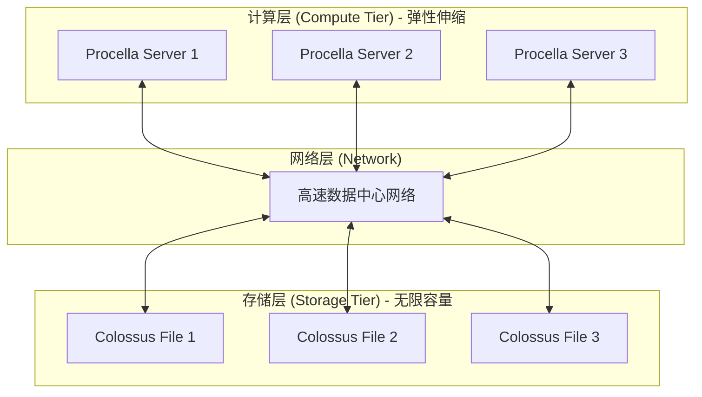
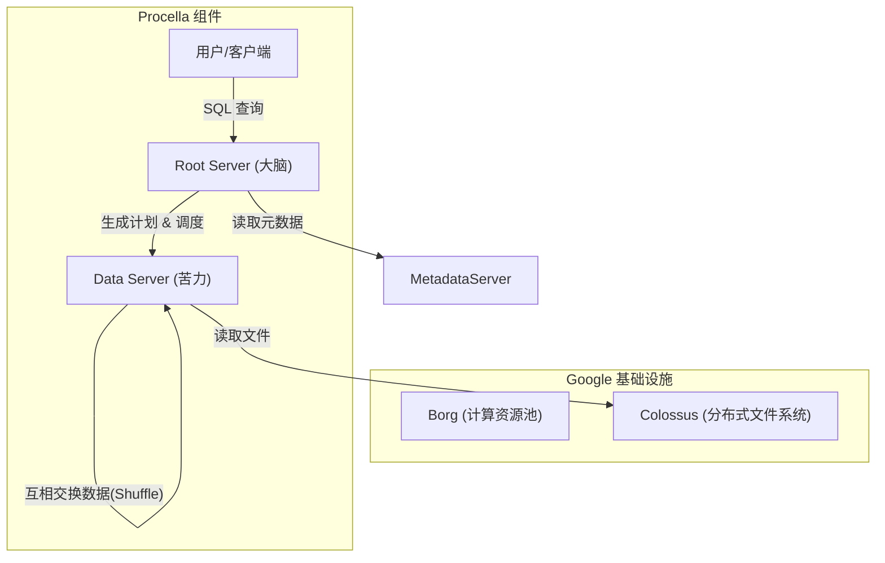
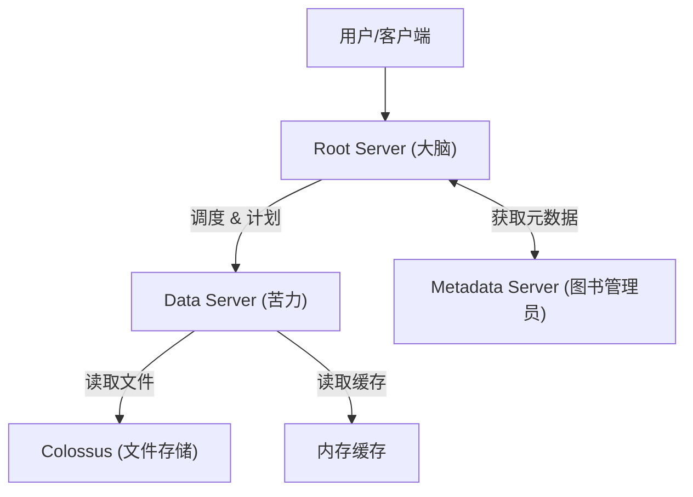

## AI论文解读 | Procella: Unifying serving and analytical data at YouTube
        
### 作者        
digoal        
        
### 日期        
2025-11-20        
        
### 标签        
PostgreSQL , PolarDB , DuckDB , AI , 论文解读        
        
----        
        
## 背景  
      
https://www.vldb.org/pvldb/vol12/p2022-chattopadhyay.pdf        
  
提示:          
```          
读懂《Procella: Unifying serving and analytical data at YouTube》这篇论文需要提前掌握哪些基础知识, 请使用中文通熟易懂的讲解这些基础知识, 可以引用论文中的图、表或使用Markdown支持的图形(text,mermaid等)增加解释性. 
  
使用中文通熟易懂的解读《Procella: Unifying serving and analytical data at YouTube》这篇论文, 其中的关键内容请着重讲解, 可以引用论文中的图、表或使用Markdown支持的图形(text,mermaid等)增加解释性. 
  
提取《Procella: Unifying serving and analytical data at YouTube》这篇论文中的重要术语, 使用中文对这些术语进行通熟易懂的讲解, 可以引用论文中的图、表或使用Markdown支持的图形(text,mermaid等)增加解释性. 
```     
  
## 1 前置知识 
  
要读懂《Procella: Unifying serving and analytical data at YouTube》这篇论文，你需要理解现代大规模分布式数据库系统的几个核心概念。Procella 的核心创新在于它试图用一套系统同时解决通常需要多套系统才能解决的问题（即“大一统”）。

以下是阅读这篇论文前需要掌握的**5个核心基础知识模块**，我尽量用通俗的语言配合图表为你讲解：

### 1\. 存算分离架构 (Disaggregated Storage and Compute)

**概念讲解：**
传统数据库通常将数据存储（硬盘）和计算能力（CPU/内存）放在同一台物理服务器上。但在 Google 这种超大规模环境下，这会导致资源浪费（例如：硬盘满了但CPU很闲，或者CPU跑满了但硬盘是空的）。

**存算分离**就是把“计算”和“存储”拆开，通过网络连接。

  * **计算层 (Compute):** 只负责处理逻辑（SQL解析、聚合、运算）。
  * **存储层 (Storage):** 只负责保存文件，保证数据不丢。

**为什么读这篇论文需要懂？**
Procella 的核心设计原则就是基于 Google 的基础设施实现存算分离。

  * **论文对应：** Procella 的计算运行在 **Borg**（Google 的资源调度系统，Kubernetes 的前身）上，而数据存储在 **Colossus**（Google 的分布式文件系统）上 。




### 2\. 列式存储 (Columnar Storage)

**概念讲解：**

  * **行式存储 (Row-based):** 就像 Excel 表格一行一行地存。适合“查某一个人的所有信息”（OLTP）。
  * **列式存储 (Columnar):** 把同一列的数据存放在一起。适合“算一下所有人的平均年龄”（OLAP）。

**为什么读这篇论文需要懂？**
Procella 主要用于分析和报表，需要极高的扫描性能。论文中花大量篇幅介绍了一种新的文件格式 **Artus**，它是专门定制的列式存储格式 。Artus 比 Google 之前的 Capacitor 格式在查找和扫描上更快。

**图解：**
假设数据是：`{ID: 1, Name: A}, {ID: 2, Name: B}`

  * **行存：** `1, A, 2, B` (读取 ID 必须跳过 Name)
  * **列存：** `1, 2` ... `A, B` (想算 ID 总和，完全不用看 Name 数据块)

### 3\. 两种截然不同的数据负载：OLAP vs Serving (Point Lookups)

**概念讲解：**
在数据库领域，通常有两类“极端”需求：

1.  **分析型 (Analytical / OLAP):** "过去一年所有视频的总播放量是多少？" —— 需要扫描几万亿行数据，允许几秒钟延迟。
2.  **在线服务型 (Serving / Point Lookups):** "给我这个视频现在的点赞数" —— 只需要查一行数据，但要求几毫秒内返回，且并发极高。

**为什么读这篇论文需要懂？**
Procella 的最大卖点就是 **“统一” (Unifying)** 。
以前 YouTube 需要用 **Dremel** 做分析，用 **Vitess/Bigtable** 做在线服务，用 **Mesa** 做报表 。Procella 发明了一套机制，既能像分析引擎那样狂扫数据，又能像键值存储(KV Store)那样毫秒级返回单行数据 。

### 4\. Lambda 架构与数据新鲜度 (Lambda Architecture)

**概念讲解：**
如何处理实时数据？

  * **批处理 (Batch):** 每天凌晨把昨天的数据算一遍，存成文件。优点是压缩率高、查询快；缺点是看不到今天的数据。
  * **流处理 (Streaming/Real-time):** 数据来了马上处理，先放在内存或日志里。优点是实时；缺点是不仅没怎么压缩，查询还慢。

**Lambda 架构**就是把两者结合：查询 = `批处理层结果` + `实时层结果`。

**为什么读这篇论文需要懂？**
Procella 在数据摄入（Ingestion）部分使用了这种思想。

  * **Ingestion Server (IgS):** 接收实时数据，写入日志（Write-ahead log）和内存缓冲区 。
  * **Compaction Server:** 只有后台闲时才把这些日志合并成优化的列式文件（Artus格式） 。
  * 查询时，Procella 会自动合并内存中的“热数据”和硬盘上的“冷数据” 。

### 5\. 分布式查询优化技术 (Distributed Query Optimization)

要看懂论文第 3 节“Optimizations”，你需要了解以下技术名词：

  * **Shuffle (洗牌):** 在分布式 Join（连接）或 Aggregation（聚合）时，不同机器之间需要交换数据。例如把所有 `VideoID=1` 的数据都发到同一台机器上去处理。Procella 使用了类似 MapReduce 的 Shuffle 机制 。
  * **Bloom Filter (布隆过滤器):** 一种极小的内存结构，用来快速判断“这个文件里**绝对没有**我要找的数据”。如果有，它不一定准；但如果它说没有，那就一定没有。Procella 用它来跳过大量不必要读取的文件，极大提升性能 。
  * **Vectorization (向量化执行):** 利用 CPU 的 SIMD 指令，一次处理一批数据（例如一次加 4 个数字），而不是一个循环加一次。这是 Procella 的执行引擎 **Superluminal** 的核心技术 。

-----

### 总结：你的阅读路线图

当你阅读这篇论文时，可以把 Procella 想象成一个**变形金刚**：

1.  **看架构图 (Figure 1):** 识别出它的“大脑”（Root Server，负责生成计划）、“四肢”（Data Server，负责干苦力）、“记忆”（Colossus/Bigtable，负责存数据） 。    
2.  **看存储 (Artus):** 它是怎么把数据压得又小查得又快的（利用列存和定制编码） 。
3.  **看执行 (Superluminal):** 它是怎么利用 C++ 模板和向量化技术跑得飞快的 。
4.  **看适配 (Adaptive):** 它是怎么在运行时发现“哎哟，这个 Join 这么大”，然后自动切换策略的（这是区别于传统静态优化器的亮点） 。

准备好这些知识，你就可以顺畅地阅读这篇论文了。
  
## 2 解读论文 
  
这是一篇非常经典的工业界论文，讲述了 YouTube 如何通过自研系统 **Procella**，解决由于数据爆炸带来的“系统烟囱”问题。

简单来说，Procella 是一个 **“全能型”分布式 SQL 查询引擎** 。它打破了“分析型数据库”和“在线服务数据库”之间的界限，用一套架构同时满足了 YouTube 极其复杂的四类需求 。

以下是对这篇论文的通俗解读。

-----

### 1\. 背景：为什么要造 Procella？(痛点分析)

在 Procella 出现之前，YouTube 内部为了处理海量数据，被迫维护着一套复杂的“全家桶”架构。因为不同的业务场景对数据库的要求完全不同，他们不得不使用不同的系统：

  * **Ad-hoc 分析（如数据挖掘）：** 使用 **Dremel**（适合大规模扫描，但并发低）。
  * **报表与仪表盘（如 YouTube Analytics）：** 使用 **Mesa**（预聚合，适合看趋势）。
  * **嵌入式统计（如视频下方的“观看次数”）：** 使用 **Vitess**（MySQL集群，适合高并发点查）。
  * **系统监控：** 使用 **Monarch**（时序数据库）。

**带来的问题：**
数据需要在这些系统之间搬来搬去（ETL），导致数据不仅冗余，而且经常不一致，维护成本极高，且新功能上线很慢。

**Procella 的目标：**
做一个“大一统”的 SQL 引擎，既能像 NoSQL 一样处理每秒数百万次的高并发请求，又能像数据仓库一样处理 PB 级的复杂分析 。

-----

### 2\. 核心架构：存算分离 (Architecture)

Procella 是基于 Google 强大的基础设施构建的，其核心设计理念是 **存算分离 (Disaggregated Storage and Compute)** 。

这意味着 Procella 本身不存储数据，它只负责“算”。



  * **数据存哪里？** 存放在 **Colossus**（Google 的分布式文件系统）。数据一旦写入就不可变（Immutable）。
  * **计算在哪里？** 运行在 **Borg**（类似 Kubernetes 的集群管理系统）上。计算节点（Data Server）可以随时扩容或缩容，因为它没有本地状态 。

**挑战：** 存算分离虽然灵活，但每次读数据都要通过网络去远程拉取文件，网络延迟（Latency）很高，怎么做到毫秒级响应？

-----

### 3\. Procella 的四大制胜法宝 (Key Optimizations)

为了解决网络延迟和性能问题，Procella 引入了四个关键创新：

#### 法宝一：激进的缓存策略 (Caching)

既然远程读数据慢，那就把能缓存的都缓存起来。虽然 Procella 是无状态的，但它利用内存做了多层缓存 ：

1.  **文件句柄缓存：** 避免每次打开文件都去请求文件系统元数据 。
2.  **Header 缓存：** 文件的头信息（存了数据的元信息）缓存起来 。
3.  **数据缓存：** 既然数据格式在磁盘和内存中是一样的（Artus 格式），直接缓存数据块 。
4.  **元数据缓存：** 表结构、分区信息等缓存到 Metadata Server 的内存中 。

**效果：** 在报表场景下，尽管只有 2% 的数据能装进内存，但缓存命中率高达 90% 以上，使得它表现得像一个内存数据库 。

#### 法宝二：全能型文件格式 Artus (Data Format)

这是论文的重头戏。以前的文件格式（如 Capacitor/Parquet）通常**只适合扫描**（分析），**不适合查找**（点查）。

Procella 开发了新格式 **Artus**，它同时支持高性能的扫描和查找 ：

  * **轻量级索引：** 它在文件头里存了 Bloom Filter（布隆过滤器）、Min/Max 值。查询时，如果发现某个文件不包含目标 ID，直接跳过，完全不用读数据 。
  * **自定义编码：** 它不使用通用的压缩算法（如 LZW），而是使用多种自定义编码。**关键点是：数据不需要解压就能直接参与计算** 。
  * **快速定位：** 支持 $O(logN)$ 的二分查找和 $O(1)$ 的行定位，这对于“查找某个视频的点击量”这种查询至关重要 。

#### 法宝三：超光速执行引擎 Superluminal (Evaluation Engine)

这是 Procella 的执行引擎。为了快，它做到了极致：

  * **C++ 模板元编程：** 在编译时生成代码，减少运行时的函数调用开销 。
  * **向量化执行 (Vectorization)：** 利用 CPU 的 SIMD 指令，一次处理一批数据，而不是一行一行处理 。
  * **直接操作编码数据：** 因为 Artus 格式特殊，Superluminal 可以直接在没解压的数据上做过滤和聚合。比如数据是字典编码的，它直接比较字典索引，而不是比较字符串 。

**对比：** 在聚合测试中，Superluminal 比之前的行式引擎快 2-5 倍 。

#### 法宝四：自适应查询优化 (Adaptive Query Optimization)

传统的数据库优化器在查询开始前就决定好怎么做 Join（连接）。但对于复杂查询，预估往往是不准的。

Procella 采用了**自适应技术** ：

  * **边跑边算：** 它在查询执行过程中收集统计信息。
  * **动态决策：** 比如在做 Join 时，如果发现一边的数据实际只有几千行（虽然预估可能有几亿行），它会立即决定把这点数据广播（Broadcast）到所有节点，而不是做昂贵的网络 Shuffle 。
  * **智能排序：** 它可以根据数据量动态决定分多少个片来进行排序 。

这使得 Procella 能够处理极度复杂的 SQL，而不需要用户去手动调优 。

-----

### 4\. 它是如何处理实时数据的？(Ingestion)

Procella 支持**Lambda 架构**，即同时处理“批量数据”和“实时数据” 。

  * **写入路径：** 实时数据通过 Ingestion Server (IgS) 写入。IgS 会并行做两件事：
    1.  写入 Colossus 的日志文件（持久化，但慢）。
    2.  发送给 Data Server 的内存缓冲区（不持久，但快）。
  * **查询路径：** 查询时，Procella 会自动合并“磁盘上的老数据”和“内存里的新数据”，从而保证用户能查到几秒钟前刚产生的数据 。
  * **后台压缩：** Compaction Server 会定期在后台把零散的日志文件合并成优化的 Artus 文件 。

-----

### 5\. 性能表现 (Performance)

论文给出了几个震撼的生产环境数据：

| 场景 | 规模/指标 | 备注 |
| :--- | :--- | :--- |
| **总查询量** | 数千亿次/天 | 涵盖 YouTube 及 Google 其他产品  |
| **报表查询 (YouTube Analytics)** | 99% 的查询 \< 0.5秒 | 扫描几十 PB 的数据  |
| **嵌入式统计 (如点赞数)** | 99% 的查询 \< 3.3毫秒 | 类似 Redis/HBase 的性能，但支持 SQL  |
| **吞吐量** | 扫描峰值 \> 1000亿行/秒 | 单个查询的扫描能力  |

-----

### 6\. 总结

Procella 的成功证明了“大一统”架构在超大规模数据场景下是可行的。

它没有发明全新的物理学，而是将 **列式存储 (Artus)**、**激进缓存**、**向量化执行 (Superluminal)** 和 **自适应优化** 极其巧妙地结合在了一起。

  * 对用户来说：只需要写 SQL，不用管数据在哪，也不用管是离线还是实时。
  * 对 YouTube 来说：维护一套系统，代替了原本的四个烟囱，极大降低了成本和复杂度 。
  
## 3 术语 
  
为了帮助你深入理解《Procella: Unifying serving and analytical data at YouTube》这篇论文，我提取了其中的核心术语，并将其分为**系统架构**、**核心组件**、**关键技术**和**数据处理**四个维度进行通俗讲解。

-----

### 一、 系统架构类术语 (Architecture)

#### 1\. Procella

  * **定义：** YouTube 自研的分布式 SQL 查询引擎 。
  * **通俗解释：** 它是这篇论文的主角。以前 YouTube 需要用四种不同的工具来分别处理报表、监控、在线统计和数据挖掘，现在 Procella 像一把“瑞士军刀”，一个系统就把这些活儿全干了 。
  * **关键能力：** 既能处理每天数千亿次的超高并发查询，也能处理 PB 级的大数据分析 。

#### 2\. Disaggregated Storage and Compute (存算分离)

  * **定义：** 将计算资源（CPU/内存）和存储资源（硬盘）在物理上分开，通过网络连接 。
  * **通俗解释：**
      * **传统模式：** 就像你的笔记本电脑，CPU 和硬盘焊在一起。如果硬盘满了但 CPU 很闲，你也得整台换掉，很浪费。
      * **存算分离：** CPU 是“计算中心”（Borg），硬盘是“云盘”（Colossus）。计算不够了就加 CPU，存储不够了就加硬盘，互不影响。
  * **在论文中：** Procella 的计算跑在 Borg 上，数据存在 Colossus 上 。

#### 3\. Borg & Colossus

  * **Borg：** Google 内部的集群管理系统（Kubernetes 的前身）。Procella 的服务器（Root Server, Data Server）都是作为任务运行在 Borg 上的 。
  * **Colossus：** Google 的分布式文件系统。Procella 的所有持久化数据都存这里 。

-----

### 二、 核心组件类术语 (Components)

为了解释这部分，我们先看一个简化的架构图：



#### 4\. Root Server (RS) - “大脑”

  * **定义：** 查询的入口节点 。
  * **通俗解释：** 它是整个系统的“包工头”。
      * 它接收用户发来的 SQL。
      * 它负责把 SQL 拆解成具体的执行计划（Plan）。
      * 它指挥 Data Server 去干活，并把最后的结果汇总返回给用户 。

#### 5\. Data Server (DS) - “苦力”

  * **定义：** 负责实际数据读取和计算的节点 。
  * **通俗解释：** 它是“搬砖工人”。
      * RS 告诉它：“去把第 1 到 100 个文件里的数据读出来，算出总和。”
      * DS 就去读文件（或者读缓存），算好后把结果返给 RS 。
      * **特点：** DS 没有本地硬盘（无状态），挂了可以随时换一台新的 。

#### 6\. Metadata Server (MDS) - “图书管理员”

  * **定义：** 管理表结构、文件位置和索引信息的服务 。
  * **通俗解释：** 当 RS 想查某张表时，它不知道数据具体存在哪个文件里。它得问 MDS：“我要查的这张表，数据都在哪儿？” MDS 会告诉它文件列表和索引信息 。

-----

### 三、 关键技术类术语 (Tech & Optimizations)

#### 7\. Artus (文件格式)

  * **定义：** Procella 专用的列式存储格式 。
  * **通俗解释：** 以前的文件格式（如 Capacitor）只适合“扫库”（看大量数据），不适合“点查”（找某一条数据）。Artus 是一种特制的文件压缩包：
      * **全能：** 既能快速扫描，又能通过索引快速定位到某一行 。
      * **免解压计算：** 它不需要把数据解压出来就能直接过滤。比如它把“视频A”编码成数字“1”，查询时直接比对数字，速度极快 。
      * **轻量索引：** 包含 Bloom Filter（布隆过滤器）和 Min/Max 值，如果查询条件不满足，直接跳过整个文件不读 。

#### 8\. Superluminal (执行引擎)

  * **定义：** Procella 的高性能查询评估引擎 。
  * **通俗解释：** 这是跑在 Data Server 里的“核心代码”，负责执行具体的加减乘除。
      * **编译时生成代码：** 它像是一个能自己写代码的程序（C++ 模板元编程），针对每种数据类型生成最优的机器码，没有多余的废动作 。
      * **向量化 (Vectorization)：** 它不是一个数字一个数字地算，而是一次算一批（比如利用 CPU 指令一次加 4 个数），效率极高 。

#### 9\. Adaptive Query Optimization (自适应查询优化)

  * **定义：** 在查询执行过程中，根据实时数据统计信息动态调整执行计划的技术 。
  * **通俗解释：** 传统的数据库像“照地图开车”，出发前规划好路线，不管路上堵不堵。Procella 是“用导航开车”：
      * 查询跑了一半，发现：“哎哟，中间结果只有 1000 行，比预想的少多了。”
      * 于是它立马改变策略，不再做复杂的洗牌（Shuffle），而是直接把这 1000 行广播（Broadcast）给所有节点，瞬间完成任务 。

-----

### 四、 数据处理类术语 (Data Handling)

#### 10\. Lambda Architecture (Lambda 架构)

  * **定义：** 一种同时处理离线批处理数据（Batch）和实时流数据（Real-time）的架构模式 。
  * **通俗解释：** 这是一个解决“我想看几秒钟前的数据，但又想看历史数据”的方法。
      * **实时路（热数据）：** 新产生的数据先写到内存缓存和日志里，查询时直接读这里，虽然没怎么压缩，但胜在新鲜 。
      * **批处理路（冷数据）：** 后台定期把老数据整理、压缩成 Artus 文件，查询时读这里，速度快、省空间 。
      * **查询时：** Procella 会把这两部分数据拼接起来（Union），让你感觉不到界限 。

#### 11\. Embedded Statistics (嵌入式统计)

  * **定义：** Procella 的一种特殊工作模式，用于服务高并发、低延迟的简单查询 。
  * **场景：** 比如你在 YouTube 视频下方看到的“观看次数”、“点赞数”。这些数字需要毫秒级返回，而且全球有几亿人同时在刷。
  * **通俗解释：** 把 Procella 当作一个超级快的 NoSQL 缓存用。在这种模式下，为了快，它会把元数据全加载到内存，甚至跳过复杂的优化步骤，直接去拉最新数据 。

#### 12\. Shuffle (洗牌)

  * **定义：** 分布式计算中，在不同节点之间重新分配数据的过程 。
  * **通俗解释：** 就像打扑克。Data Server A 拿着一部分红桃，Data Server B 拿着一部分红桃。
      * 如果要算“红桃的总数”，就需要把所有的红桃都汇总到同一个节点上。
      * 这个“把数据按规则（比如花色）发送到指定节点”的过程就是 Shuffle。Procella 使用了 Google 内部极快的数据交换网络（RDMA）来做这件事 。
  
## 参考        
         
https://www.vldb.org/pvldb/vol12/p2022-chattopadhyay.pdf    
        
<b> 以上内容基于DeepSeek、Qwen、Gemini及诸多AI生成, 轻微人工调整, 感谢杭州深度求索人工智能、阿里云、Google等公司. </b>        
        
<b> AI 生成的内容请自行辨别正确性, 当然也多了些许踩坑的乐趣, 毕竟冒险是每个男人的天性.  </b>        
    
#### [PolarDB 学习图谱](https://www.aliyun.com/database/openpolardb/activity "8642f60e04ed0c814bf9cb9677976bd4")
  
  
#### [PostgreSQL 解决方案集合](../201706/20170601_02.md "40cff096e9ed7122c512b35d8561d9c8")
  
  
#### [德哥 / digoal's Github - 公益是一辈子的事.](https://github.com/digoal/blog/blob/master/README.md "22709685feb7cab07d30f30387f0a9ae")
  
  
#### [About 德哥](https://github.com/digoal/blog/blob/master/me/readme.md "a37735981e7704886ffd590565582dd0")
  
  

  
