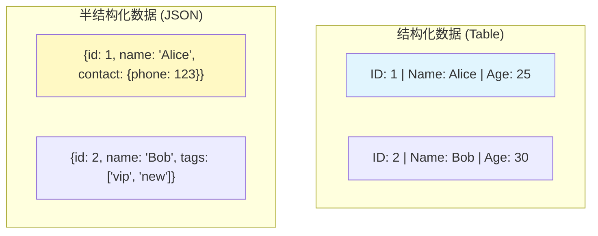
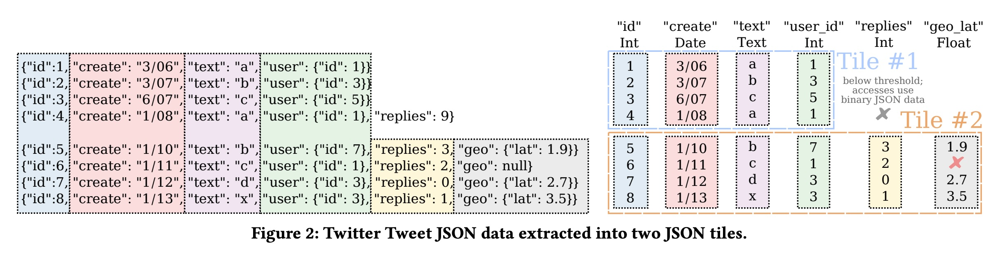
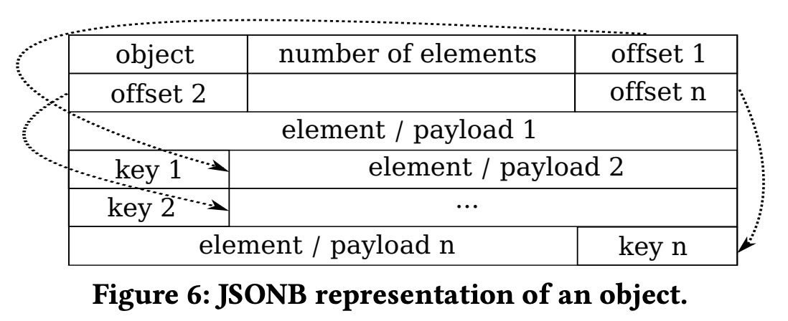
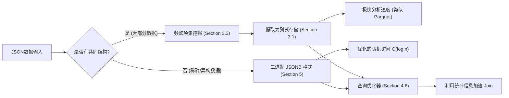
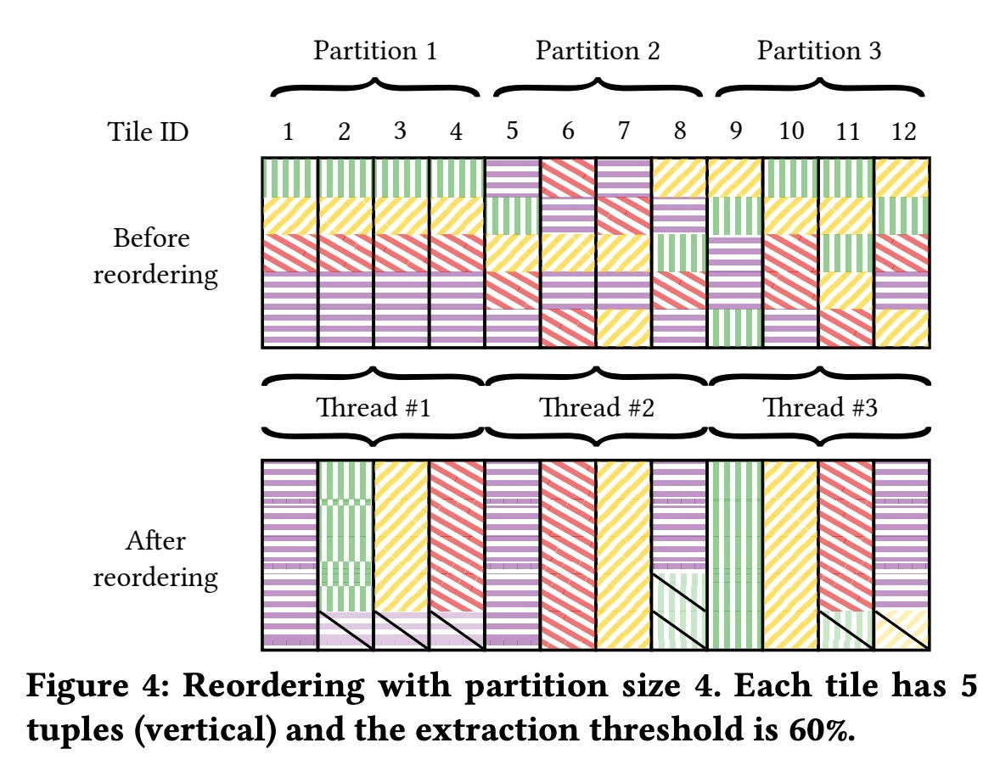
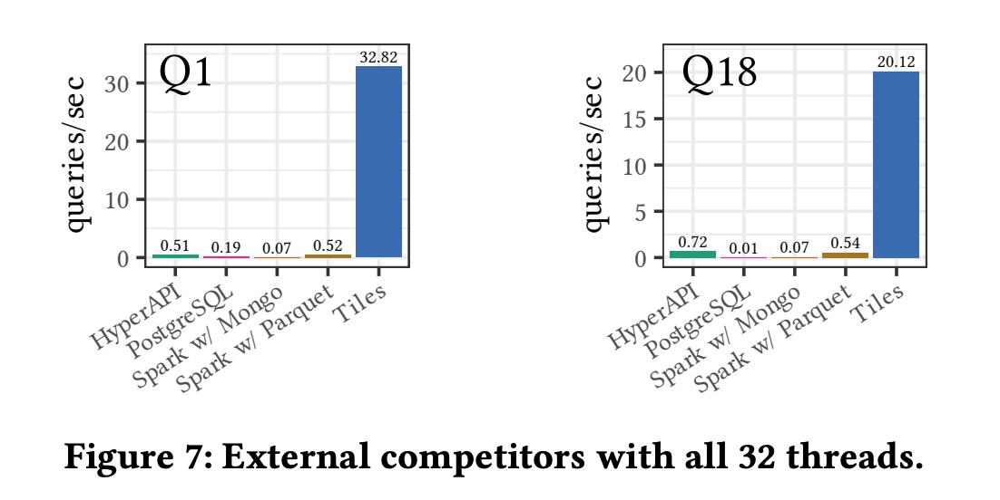
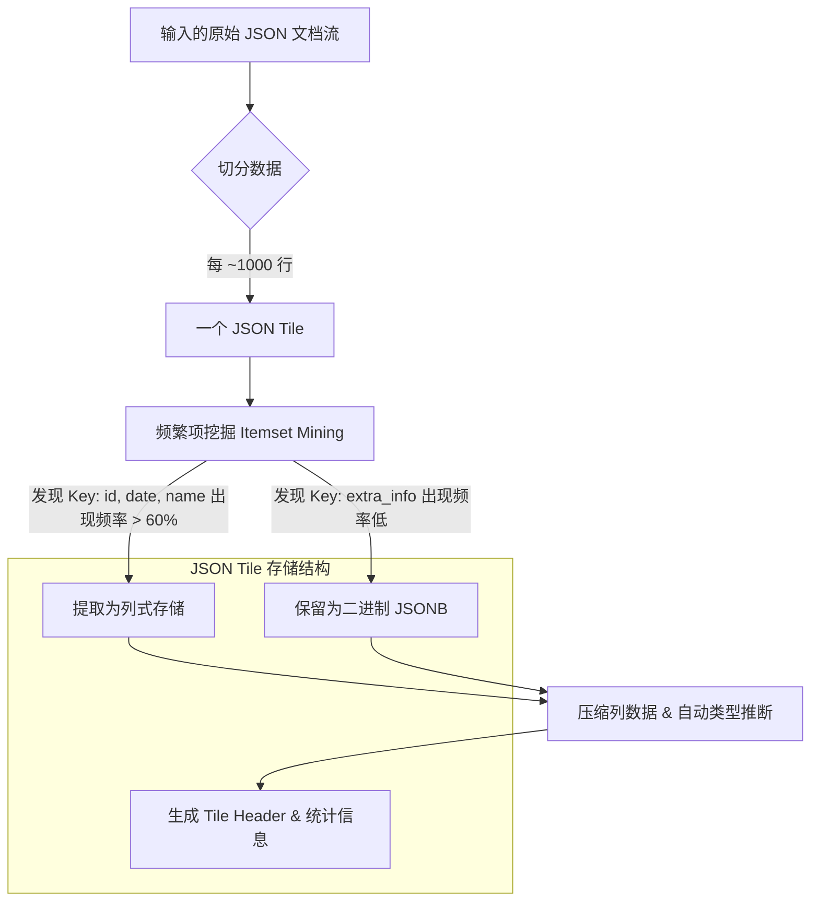
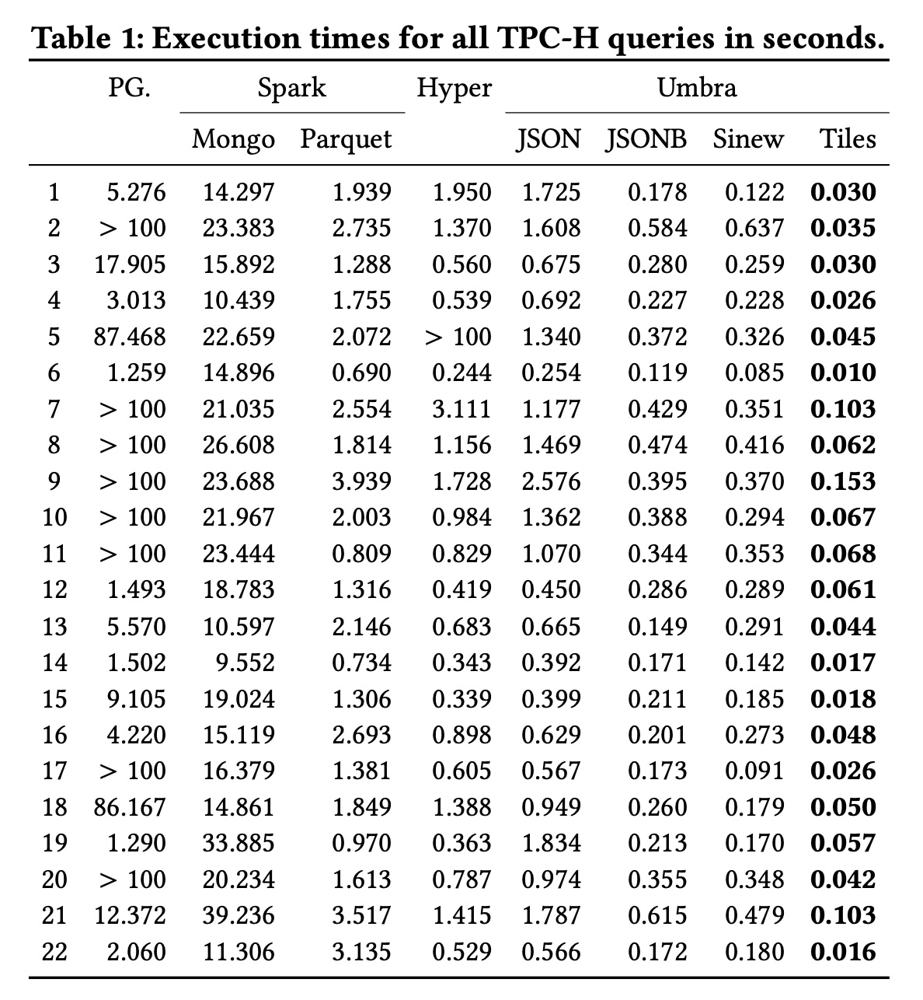
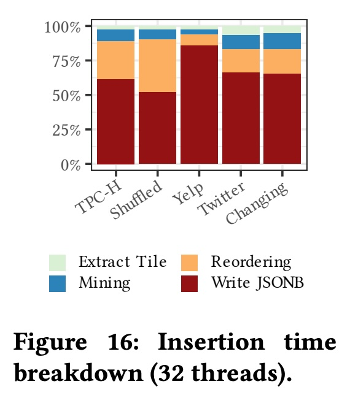
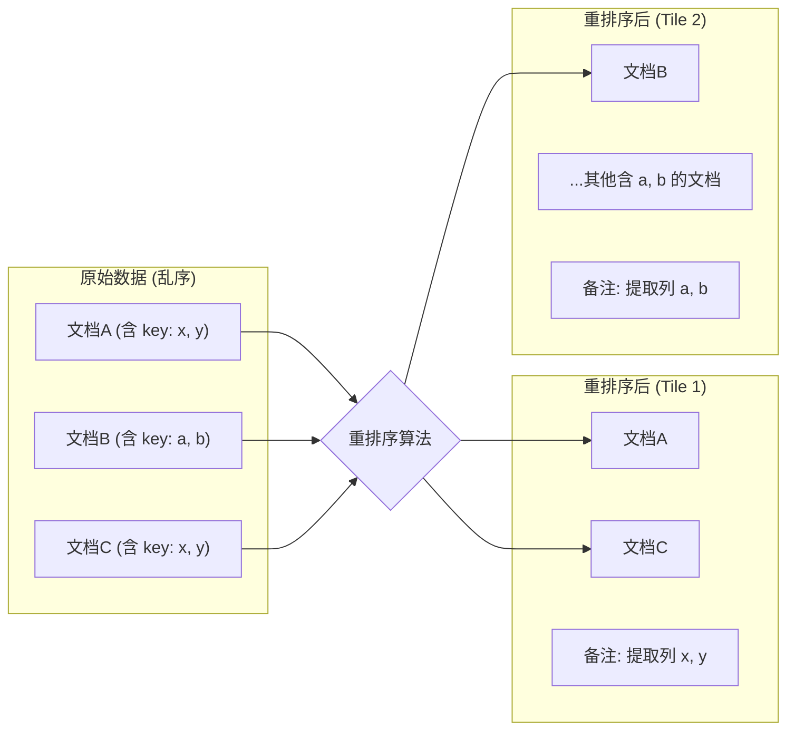

## AI论文解读 | JSON Tiles: Fast Analytics on Semi-Structured Data
        
### 作者        
digoal        
        
### 日期        
2025-11-20        
        
### 标签        
PostgreSQL , PolarDB , DuckDB , AI , 论文解读        
        
----        
        
## 背景  
      
https://db.in.tum.de/~durner/papers/json-tiles-sigmod21.pdf        
  
提示:          
```          
读懂《JSON Tiles: Fast Analytics on Semi-Structured Data》这篇论文需要提前掌握哪些基础知识, 请使用中文通熟易懂的讲解这些基础知识, 可以引用论文中的图、表或使用Markdown支持的图形(text,mermaid等)增加解释性. 
  
使用中文通熟易懂的解读《JSON Tiles: Fast Analytics on Semi-Structured Data》这篇论文, 其中的关键内容请着重讲解, 可以引用论文中的图、表或使用Markdown支持的图形(text,mermaid等)增加解释性. 
  
提取《JSON Tiles: Fast Analytics on Semi-Structured Data》这篇论文中的重要术语, 使用中文对这些术语进行通熟易懂的讲解, 可以引用论文中的图、表或使用Markdown支持的图形(text,mermaid等)增加解释性. 
```     
  
## 1 前置知识 
  
要读懂《JSON Tiles: Fast Analytics on Semi-Structured Data》这篇论文，你需要跨越几个知识领域的门槛：**数据库存储引擎**、**数据模型（结构化与半结构化）以及查询优化原理**。

这篇论文的核心痛点在于：**JSON 很灵活但查询慢，关系型数据库（SQL）查询快但不够灵活。作者想结合两者优点。**

以下是通俗易懂的基础知识拆解，配合图表帮助你理解：

-----

### 1\. 数据模型：结构化 vs. 半结构化 (Structured vs. Semi-Structured)

**基础概念：**

  * **结构化数据（Relational/SQL）：** 就像 Excel 表格。每一列都有固定的名字（Schema）和类型（如整数、日期）。存数据前必须先定义好表格结构（Schema-on-write）。
  * **半结构化数据（JSON）：** 就像一个树状的嵌套盒子。数据自带结构，每一行数据长得可以不一样。有些行有“电话”字段，有些行没有，有些甚至嵌套了另一个对象。

**论文中的关联：**
论文试图解决 JSON 缺乏固定 Schema 导致的分析性能差的问题。



> **论文图示参考：** 论文中的 **Figure 2**  展示了 Twitter 数据，每一条推文（Tuple）虽然大体相似，但随着时间推移，字段（如 `geo_lat`, `replies`）是动态增加或缺失的，这就是半结构化数据的“异构性”（Heterogeneity）。

  

-----

### 2\. 存储方式：行式存储 vs. 列式存储 (Row Store vs. Column Store)

这是理解论文为何能提速的关键。

**基础概念：**

  * **行式存储（Row-oriented）：** 即使你只想要所有人的“年龄”，数据库也必须把每个人的所有信息（姓名、地址、电话...）都读出来，然后丢弃不需要的。这适合写数据（OLTP）。
  * **列式存储（Column-oriented）：** 所有人的“年龄”是挨在一起存的。查询“平均年龄”时，只需要读取“年龄”这一小块数据，速度极快。这适合分析数据（OLTP/Analytics）。

**通俗比喻：**

  * **行存**：像读每一本书的全文。
  * **列存**：像只读图书馆里所有书的“书名索引”。

**论文核心思想：**
现有的 JSON 存储通常把整个 JSON 存成一大串（类似行存）。**JSON Tiles** 的核心做法就是把 JSON 里经常出现的字段（如 `id`, `create_at`）挖出来，转换成**列式存储**，从而获得极快的扫描速度。

-----

### 3\. 序列化与解析 (Serialization & Parsing)

**基础概念：**

  * **文本格式 (Text JSON)**：人类可读（如 `{"age": 18}`），但计算机处理很慢，因为要逐个字符扫描引号、冒号、大括号。
  * **二进制格式 (Binary JSON/BSON/JSONB)**：计算机专用格式。它会在开头写好“在这个位置有3个字段”，计算机可以直接跳到想要的位置，不用逐字阅读。

**论文中的关联：**
论文提到了 **Figure 6**  展示了他们设计的 **JSONB** 二进制格式。    

  * **为什么重要？** 即使不做列式提取，把 JSON 转成二进制也能加速，支持 $O(\log n)$ 的查找速度（用二分查找找 Key），而不是 $O(n)$ 的线性扫描。

-----

### 4\. 频繁项集挖掘 (Frequent Itemset Mining)

这是论文用来决定“哪些字段该变成列”的算法基础。

**基础概念：**
想象你在超市分析购物篮：

  * 如果 100 个人里有 90 个人同时买了“啤酒”和“尿布”，那么 `{啤酒, 尿布}` 就是一个**频繁项集**。
  * **FPGrowth 算法**：一种高效的挖掘算法，不用列出所有组合就能找到频繁出现的模式。

**论文中的应用：**

  * **Tiles (瓦片)**：论文把数据切成一小块一小块（Tiles）。
  * **挖掘**：在每一块里，算法自动发现：“哎，这 1000 条数据里，90% 都有 `id` 和 `text` 字段”。
  * **提取**：于是系统自动把 `id` 和 `text` 变成列式存储。剩下的 10% 不规则数据（Outliers）保留原样。

> **图解论文流程 (基于论文 Section 3.1):**
>
> 1.  **输入 JSON** -\> 2. **切分成 Tiles** -\> 3. **挖掘频繁 Key** -\> 4. **提取公共列** + **保留稀疏数据**

-----

### 5\. 查询优化器与统计信息 (Query Optimizer & Statistics)

**基础概念：**
数据库执行 SQL 时，有一个“大脑”叫优化器。它需要知道数据的**统计信息**才能决定怎么查最快。

  * **选择性 (Selectivity)**：例如，“性别=男”可能返回 50% 的数据（选择性低），而“身份证号=XXX”只返回 1 条（选择性高）。
  * **基数 (Cardinality)**：一列中有多少个不同的值。

**JSON 的问题：**
传统数据库把 JSON 当作一个黑盒子（大字符串），优化器完全不知道里面有什么，只能瞎猜，导致查询计划很烂（例如用错误的顺序做连接 Join）。

**论文的贡献：**
JSON Tiles 在提取列的同时，顺便收集了这些列的**最大值、最小值、空值率**等统计信息（见论文 Section 4.6），让优化器能生成高效的执行计划。

-----

### 6\. 总结：读论文时的思维导图

当你阅读这篇论文时，请时刻在大脑中通过这张图定位当前读到的技术点：



### 建议阅读顺序：

1.  **Introduction (Section 1) & Design Overview (Section 2):** 结合上面的基础知识，理解作者为什么要“切块 (Tiles)”和“挖掘结构”。
2.  **Extraction (Section 3):** 重点看 Figure 2 和 Figure 4，理解如何把混乱的 JSON 变成整齐的列。       
3.  **Binary JSON Format (Section 5):** 了解剩下的那部分乱数据是怎么存的。
4.  **Experimental Evaluation (Section 6):** 看 Figure 7，感受这种方法比 Spark/PostgreSQL 快了多少。    

掌握了这些基础，你就能轻松理解为什么 JSON Tiles 既保留了 JSON 的灵活性，又拥有了关系型数据库的速度。
  
## 2 解读论文 
  
这是一篇非常精彩的系统类论文，发表于 SIGMOD 2021。它的核心旨在解决一个经典难题：**如何在保持 JSON 数据灵活性的同时，获得像传统关系型数据库（列式存储）那样的高性能分析速度？**

作者团队来自德国慕尼黑工业大学（TUM）和耶拿大学，他们将这一技术集成到了高性能数据库系统 **Umbra** 中。

以下是对《JSON Tiles: Fast Analytics on Semi-Structured Data》的深度通俗解读：

-----

### 1\. 核心痛点：灵活度与性能的矛盾

在现代应用中，开发人员非常喜欢 JSON，因为不需要预先定义 Schema（模式），想存什么就存什么 。但是，当这些数据进入关系型数据库（RDBMS）进行分析时，问题就来了：

  * **解析慢：** 每次查询都要解析复杂的文本或二进制 JSON 。
  * **缺乏统计信息：** 数据库优化器把 JSON 当作一个“黑盒”，不知道里面有多少行符合条件，导致查询计划很差 。
  * **现有方案的缺陷：**
      * *纯 JSON 存储（如 MongoDB, PG JSONB）：* 灵活但分析慢。
      * *强制转换 Schema（如 Sinew）：* 试图从整个表中提取一个全局 Schema。但如果数据很乱（异构）或者经常变，这种全局提取效果很差，会产生大量 NULL 值  。

### 2\. 核心解决方案：JSON Tiles (JSON 瓦片)

作者提出了一种**混合存储策略**。核心思想是：**不要试图找一个“全局完美”的表结构，而是把数据切成小块，在每个小块里找“局部完美”的结构。**

#### 2.1 什么是 JSON Tile？

系统将数据水平切分为一个个小的组，称为 **Tile**（瓦片），每个 Tile 大约包含 $2^{10}$ 到 $2^{12}$ 行数据（即 1000-4000 行）。

在这个小的范围内，数据的结构往往是高度相似的。系统会自动挖掘这些**频繁出现的 Key**，将它们提取出来存成**列式数据**（Columnar data）。不常见的 Key 或“捣乱”的数据，依旧以二进制 JSON 格式存储。

#### 2.2 架构原理图解

为了方便理解，我为你绘制了一个逻辑流程图：



### 3\. 关键技术点解读

#### 3.1 局部列式提取 (Local Column Extraction)

  * **原理：** 如果在一个 Tile 里，超过 60% 的文档都有 `"create_time"` 这个字段，系统就会把这个字段单独拎出来，存成一列 。
  * **优势：** 这样查询时，如果只查时间，就不用去解析整个 JSON，直接扫描这一列即可，速度接近原生 SQL 。
  * **类型推断：** JSON 标准没有日期类型，只有字符串。但 JSON Tiles 会聪明地发现 "2021-01-01" 看起来像日期，并在提取时自动转换类型，进一步加速计算 。

#### 3.2 处理“脏数据”：重排序 (Reordering)

这是论文的一个亮点。如果数据非常混乱（Heterogeneous），比如一行是推特数据，下一行是电商订单，那么在一个 Tile 里可能找不到任何公共结构。

  * **Partition 机制：** 作者引入了 **Partition** 的概念（包含多个 Tile，例如 8 个）。
  * **乾坤大挪移：** 在这 8 个 Tile 的范围内，系统会把结构相似的行“聚类”并交换位置。把相似的文档归拢到一个 Tile 里，从而人为创造出“频繁结构”，强行提取出列 。

> **图解参考：** 论文中的 **Figure 4** 非常直观地展示了这一点。重排序前（Before），每种颜色的条纹分散在不同 Tile，没法提取；重排序后（After），相同花纹的聚在一起，就可以作为列式存储了。

  

#### 3.3 高性能二进制格式 (JSONB)

对于那些没有被提取成列的“剩余数据”（Outliers），作者设计了一种新的二进制格式：

  * **$O(\log n)$ 查找：** 在这个二进制块里查找某个 Key，不需要从头扫到尾，而是可以通过二分查找瞬间定位 。
  * **并排存储：** 嵌套的对象和数组也是连续存储的，减少 CPU 缓存未命中（Cache Miss）。

#### 3.4 对查询优化器的支持

传统数据库怕 JSON 是因为“心里没底”（不知道数据分布）。JSON Tiles 在构建时，会顺便收集每个列的**统计信息**（如 Min/Max 值，HyperLogLog 基数估计）。

  * 这使得数据库可以生成极其高效的 Join 顺序，避免了分析复杂 JSON 时的性能崩塌 。

-----

### 4\. 实验结果：有多快？

论文将 JSON Tiles 集成到 Umbra 中，并与 PostgreSQL、Spark (Parquet/MongoDB)、Tableau Hyper 等进行了对比。

#### 4.1 性能对比 (TPC-H & Twitter 数据集)

请看论文中的 **Figure 7** 和 **Table 1**：      

  * **对比 Spark + Parquet：** JSON Tiles 在大多数查询上快了 **10倍到 100倍** 。
  * **对比 PostgreSQL (JSONB)：** PG 因为缺乏统计信息，Join 性能很差。在复杂查询（如 Q18）中，JSON Tiles 依然保持了巨大的优势 。
  * **对比 Sinew (全局提取)：** 在数据结构变化（Twitter 数据集）或被打乱时，Sinew 性能下降明显，而 JSON Tiles 依然稳健 。

> **关键数据：** 在 TPC-H Query 1（聚合查询）中，JSON Tiles 达到了每秒 30+ 次查询，而其他系统大多不足 1 次/秒。

#### 4.2 加载开销

你可能会问，做这么多提取和重排序，写入数据会不会很慢？

  * **结论：** 并没有显著变慢。因为大部分时间还是花在磁盘 I/O 和基础的 JSON 解析上。额外的 Tile 构建和重排序只占用了很小一部分时间（见 **Figure 16**）。    

-----

### 5\. 总结与评价

**《JSON Tiles》的核心贡献在于打破了“完全结构化”和“完全半结构化”的界限。**

1.  **自适应性：** 它不强求数据整齐划一，而是“能提取多少提取多少”，剩下的用高效二进制兜底。
2.  **局部性原理：** 利用了现实世界中数据往往具有局部相似性（比如同一时间段的日志格式往往一样）的特点。
3.  **透明性：** 对用户完全透明，用户依然像操作普通 JSON 一样写 SQL，但底层却享受了列式存储的红利。

### 下一步建议

如果您对如何在实际系统中优化 JSON 查询感兴趣，我能为您做以下事情：

1.  **提取实现细节：** 深入解释论文中提到的 **Cast Rewriting（类型转换重写）** 技术，看它是如何消除文本转数字的开销的。
2.  **算法深挖：** 详细解释 **FP-Growth** 算法是如何被修改用于这里的频繁项挖掘的。
3.  **应用场景分析：** 帮您分析您的业务数据（如日志、电商数据）是否适合这种“分片提取”的策略。

您想先了解哪一部分？
  
## 3 术语 
  
这篇论文《JSON Tiles: Fast Analytics on Semi-Structured Data》提出了一种在关系型数据库中高效存储和查询 JSON 数据的技术。为了让你更轻松地理解其中的核心设计，我提取了以下关键术语并进行了解读：

-----

### 1\. 核心概念术语

#### **JSON Tiles (JSON 瓦片)**

这是论文最核心的概念。

  * **通俗解释：** 想象你有一堆乱七八糟的文件（JSON 文档），如果你试图给所有文件制定一个统一的目录结构（全局 Schema），会非常困难，因为文件各不相同。
  * **Tile 的做法：** 将这些文件每 1000 到 4000 个分成一小堆，这每一小堆就是一个 **"Tile"**（瓦片）。
  * **作用：** 在这一小堆数据内部，文件结构往往很相似。系统就在这个小范围内提取公共结构，存成整齐的表格（列式存储），剩下的不一样的内容再单独存。这样既快又灵活 。

#### **Implicit Structure (隐式结构)**

  * **通俗解释：** 虽然 JSON 号称是“无模式”（Schema-less）的，但在实际业务中（比如推特日志），大部分数据其实长得差不多。比如 90% 的日志都有 `"id"` 和 `"created_at"` 字段。这种藏在数据里、没明说但实际存在的规律，就是隐式结构 。
  * **利用方式：** JSON Tiles 的目的就是自动发现这些隐式结构，并把它们变成显式的列 。

#### **Materialization / Extraction (物化 / 提取)**

  * **通俗解释：** “物化”在数据库里通常指“把计算结果实际存下来”。在这里，它指的是把 JSON 里的某些字段（比如 `user_id`），从复杂的 JSON 字符串里“抠”出来，单独存成一列整数（Integer）。
  * **好处：** 当你查询 `user_id` 时，数据库直接读这列整数就行，不用再去解析那个巨大的 JSON 字符串了，速度极大提升 。

-----

### 2\. 算法与优化术语

#### **Reordering & Partition (重排序与分区)**

当数据非常乱（异构）时，单纯切分 Tile 可能效果不好。论文引入了重排序机制。

  * **Partition (分区)：** 把相邻的几个 Tile（比如 8 个）看作一组，称为一个 Partition 。
  * **Reordering (重排序)：** 在这个 Partition 内部，把结构长得像的文档“聚类”到一起。
  * **通俗类比：** 就像洗衣服，先把深色衣服和浅色衣服分开（重排序），然后分别放进不同的洗衣机（Tile）里，这样处理起来效率最高。
  * **效果：** 经过重排序，每个 Tile 内部的结构更加统一，能提取出更多的公共列。




#### **Key Path (键路径)**

  * **通俗解释：** JSON 是可以嵌套的（对象套对象）。为了准确定位一个值，需要把路径记录下来。
  * **示例：** 对于 JSON `{"user": {"geo": {"lat": 1.2}}}`，要提取 `1.2` 这个值，它的键路径就是 `u.g.l` (编码后的简写) 。
  * **作用：** 系统通过分析所有文档的“键路径”，来决定哪些路径出现得最频繁，从而决定提取哪些列 。

#### **Frequent Itemset Mining (频繁项集挖掘)**

  * **通俗解释：** 这是一个经典算法（FP-Growth），用来找“哪些东西经常一起出现”。
  * **应用：** 系统统计每个 Tile 里所有 Key 的出现频率。如果 `id`, `name`, `date` 这三个 Key 在 60% 的文档里都出现了，算法就会判定它们是“频繁项集”，然后把它们提取成列 。

-----

### 3\. 存储与执行术语

#### **Binary JSON / JSONB (二进制 JSON)**

  * **背景：** 总有一些数据太稀有或太乱，无法被提取成列。这些数据不能丢，必须保留 。
  * **技术：** 作者设计了一种优化的二进制格式（JSONB）。
  * **核心优势：**
      * **$O(\log n)$ 查找：** 在这个二进制块里找一个 Key，不需要从头遍历，可以用二分查找瞬间定位 。
      * **连续存储：** 即使是嵌套的对象，也是存在一块连续内存里的，对 CPU 缓存非常友好 。

#### **Cast Rewriting (类型转换重写)**

  * **问题：** 用户写 SQL 时经常需要转换类型，比如 `json->>'age'::Int`（把 JSON 里的 age 转成整数）。这通常很慢，因为要先读成字符串再转数字 。
  * **优化：** 因为 JSON Tiles 在存储时已经自动推断并存储了整数类型（Integer），系统会悄悄把这个操作“重写”掉，直接返回存储好的整数，省去了转换的开销 。

#### **Statistics Collection (统计信息收集)**

  * **通俗解释：** 也就是给数据“画像”。
  * **包含内容：**
      * **Frequency Counters (频率计数器)：** 记录某个 Key 到底出现了多少次 。
      * **HyperLogLog Sketches：** 估算某一列里有多少个*不重复*的值（基数）。
  * **作用：** 告诉查询优化器（Query Optimizer）数据的真实分布情况，防止它制定出愚蠢的查询计划（比如在 Join 时选错顺序）。

-----

### 总结示意图

结合上述术语，JSON Tiles 的工作流程如下：

```text
输入 JSON 流
   ↓
[Partition & Reordering] -> 把相似的 JSON 聚在一起
   ↓
[Frequent Itemset Mining] -> 发现哪些 Key Path 是经常出现的 (隐式结构)
   ↓
[Materialization] -> 频繁的 Key 存成“列” (如 Int, Date)
                  -> 不频繁的 Key 存成 “JSONB” (二进制块)
   ↓
[Statistics Collection] -> 收集统计信息供优化器使用
   ↓
最终存储: [Tile Header] + [列数据区] + [JSONB 数据区]
```
  
## 参考        
         
https://db.in.tum.de/~durner/papers/json-tiles-sigmod21.pdf    
        
<b> 以上内容基于DeepSeek、Qwen、Gemini及诸多AI生成, 轻微人工调整, 感谢杭州深度求索人工智能、阿里云、Google等公司. </b>        
        
<b> AI 生成的内容请自行辨别正确性, 当然也多了些许踩坑的乐趣, 毕竟冒险是每个男人的天性.  </b>        
    
#### [PolarDB 学习图谱](https://www.aliyun.com/database/openpolardb/activity "8642f60e04ed0c814bf9cb9677976bd4")
  
  
#### [PostgreSQL 解决方案集合](../201706/20170601_02.md "40cff096e9ed7122c512b35d8561d9c8")
  
  
#### [德哥 / digoal's Github - 公益是一辈子的事.](https://github.com/digoal/blog/blob/master/README.md "22709685feb7cab07d30f30387f0a9ae")
  
  
#### [About 德哥](https://github.com/digoal/blog/blob/master/me/readme.md "a37735981e7704886ffd590565582dd0")
  
  

  
