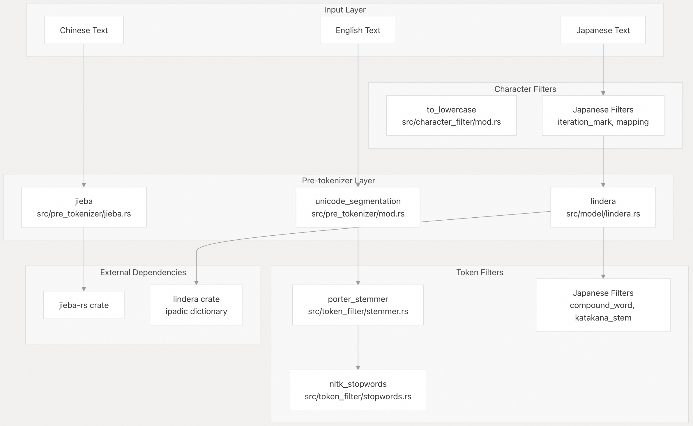
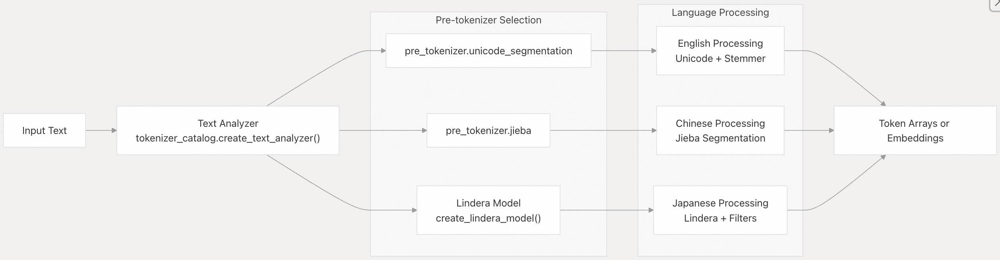
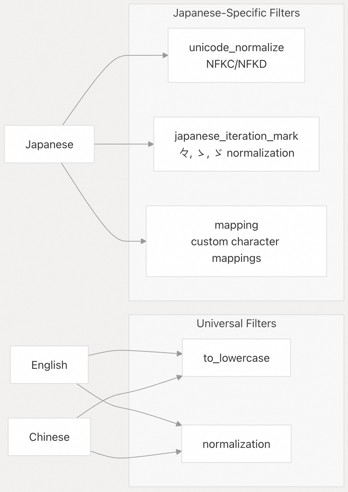
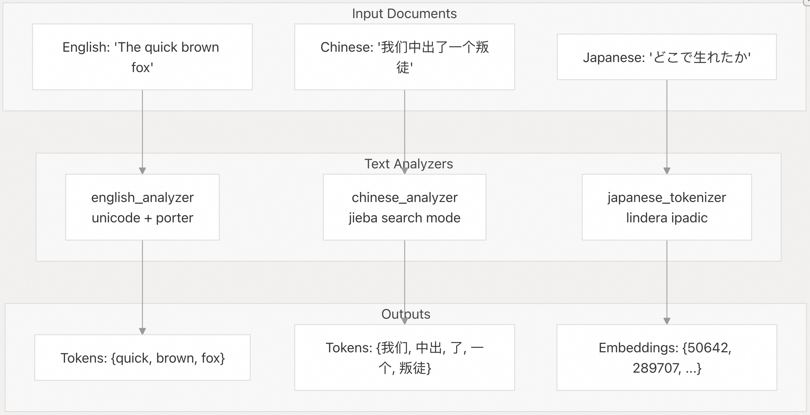

## pg_tokenizer 源码学习: 6 语言支持 (`Language Support`)  
          
### 作者          
digoal          
          
### 日期          
2025-11-20          
          
### 标签          
pg\_tokenizer , 词化 , bert , 标记化 , Tokenization          
          
----          
          
## 背景          
本文概述了 `pg_tokenizer` (PostgreSQL 分词器) 的**多语言文本处理能力** (`multi-language text processing capabilities`)。`pg_tokenizer` 通过专用的**预分词器** (`pre-tokenizers`)、**字符过滤器** (`character filters`) 和**词元过滤器** (`token filters`)，支持对**英语** (`English`)、**中文** (`Chinese`) 和**日语** (`Japanese`) 的专业化处理。每种语言都有独特的**分词算法** (`segmentation algorithms`) 和**语言学处理要求** (`linguistic processing requirements`)，这些都由特定语言的组件来处理。  
  
## 语言处理架构 (`Language Processing Architecture`)  
  
`pg_tokenizer` 通过**模块化管线** (`modular pipeline`) 实现语言支持，其中根据目标语言选择不同的组件。该系统使用专门的**外部库** (`external libraries`) 进行复杂的语言处理，同时保持**统一的接口** (`unified interface`)。  
  
### 语言组件映射 (`Language Component Mapping`)  
  
    
  
**来源:**  
[`src/pre_tokenizer/mod.rs`](https://github.com/tensorchord/pg_tokenizer.rs/blob/d3f7a577/src/pre_tokenizer/mod.rs) [`src/pre_tokenizer/jieba.rs`](https://github.com/tensorchord/pg_tokenizer.rs/blob/d3f7a577/src/pre_tokenizer/jieba.rs) [`src/model/lindera.rs`](https://github.com/tensorchord/pg_tokenizer.rs/blob/d3f7a577/src/model/lindera.rs) [`src/character_filter/mod.rs`](https://github.com/tensorchord/pg_tokenizer.rs/blob/d3f7a577/src/character_filter/mod.rs) [`src/token_filter/stemmer.rs`](https://github.com/tensorchord/pg_tokenizer.rs/blob/d3f7a577/src/token_filter/stemmer.rs) [`src/token_filter/stopwords.rs`](https://github.com/tensorchord/pg_tokenizer.rs/blob/d3f7a577/src/token_filter/stopwords.rs)  
  
### 语言选择流程 (`Language Selection Flow`)  
  
    
  
**来源:**  
[`tests/sqllogictest/chinese.slt` 12-14](https://github.com/tensorchord/pg_tokenizer.rs/blob/d3f7a577/tests/sqllogictest/chinese.slt#L12-L14) [`tests/sqllogictest/japanese.slt` 14-80](https://github.com/tensorchord/pg_tokenizer.rs/blob/d3f7a577/tests/sqllogictest/japanese.slt#L14-L80) [`tests/sqllogictest/jieba.slt` 5-9](https://github.com/tensorchord/pg_tokenizer.rs/blob/d3f7a577/tests/sqllogictest/jieba.slt#L5-L9)  
  
-----  
  
## 语言支持摘要 (`Language Support Summary`)  
  
### 英语及西方语言 (`English and Western Languages`)  
  
英语文本处理使用 `unicode_segmentation` (Unicode 分段) 进行**词边界检测** (`word boundary detection`)，这适用于以空格分隔的语言。该系统提供标准的 **NLP 过滤器** (`NLP filters`)，包括：  
  
  * **预分词器** (`Pre-tokenizer`): `pre_tokenizer.unicode_segmentation` 用于单词拆分。  
  * **字符过滤器** (`Character filters`): `character_filter.to_lowercase` 用于**规范化** (`normalization`)。  
  * **词元过滤器** (`Token filters`): `token_filter.porter_stemmer` 用于**词干提取** (`word stemming`)，`token_filter.nltk_stopwords` 用于**停用词移除** (`stopword removal`)。  
  
有关详细的英语配置，请参阅 English Text Processing 章节。  
  
**来源:**  
[`src/pre_tokenizer/mod.rs`](https://github.com/tensorchord/pg_tokenizer.rs/blob/d3f7a577/src/pre_tokenizer/mod.rs) [`src/character_filter/mod.rs`](https://github.com/tensorchord/pg_tokenizer.rs/blob/d3f7a577/src/character_filter/mod.rs) [`src/token_filter/stemmer.rs`](https://github.com/tensorchord/pg_tokenizer.rs/blob/d3f7a577/src/token_filter/stemmer.rs) [`src/token_filter/stopwords.rs`](https://github.com/tensorchord/pg_tokenizer.rs/blob/d3f7a577/src/token_filter/stopwords.rs)  
  
### 中文 (`Chinese Language`)  
  
中文文本处理需要专门的**分词** (`segmentation`)，因为该语言的单词之间不使用空格。`pg_tokenizer` 集成了 `jieba-rs` 库，提供三种分词模式：  
  
| 模式 (`Mode`) | 配置 (`Configuration`) | 用例 (`Use Case`) |  
| :--- | :--- | :--- |  
| **搜索** (`Search`) (默认) | `mode = "search"` | 适用于搜索应用的平衡分词 |  
| **全模式** (`Full`) | `mode = "full"` | 细粒度分词，最大化词元 (`tokens`) 数量 |  
| **精确模式** (`Precise`) | `mode = "precise"` | 粗粒度分词，最少词元数量 |  
  
示例配置：  
  
```sql  
[pre_tokenizer.jieba]  
mode = "search"  
enable_hmm = true  
```  
  
`enable_hmm` 选项 (默认: `true`) 启用**隐马尔可夫模型** (`Hidden Markov Model`, HMM) 处理，用于**未知词检测** (`unknown word detection`)。  
  
**来自测试套件的示例** (`Example from test suite`):  
  
```sql  
SELECT tokenizer_catalog.create_text_analyzer('jieba_cut_search', $$  
[pre_tokenizer.jieba]  
$$);  
  
SELECT tokenizer_catalog.apply_text_analyzer('我们中出了一个叛徒', 'jieba_cut_search');  
-- Result: {我们,中出,了,一个,叛徒}  
```  
  
有关详细的中文配置和示例，请参阅 Chinese Text Processing 章节。  
  
**来源:**  
[`tests/sqllogictest/jieba.slt` 28-35](https://github.com/tensorchord/pg_tokenizer.rs/blob/d3f7a577/tests/sqllogictest/jieba.slt#L28-L35) [`tests/sqllogictest/chinese.slt` 12-24](https://github.com/tensorchord/pg_tokenizer.rs/blob/d3f7a577/tests/sqllogictest/chinese.slt#L12-L24) [`src/pre_tokenizer/jieba.rs`](https://github.com/tensorchord/pg_tokenizer.rs/blob/d3f7a577/src/pre_tokenizer/jieba.rs)  
  
### 日语 (`Japanese Language`)  
  
日语文本处理是最复杂的，因为它包含**多种书写系统** (`multiple writing systems`) (汉字 `kanji`、平假名 `hiragana`、片假名 `katakana`)，并且缺乏词边界。`pg_tokenizer` 使用 `lindera` 库并支持 `ipadic` 字典 (`dictionary support`)。  
  
日语处理需要创建一个 `Lindera` **模型** (`Model`)，其中包括：  
  
  * **字符过滤器** (`Character filters`): `unicode_normalize` (Unicode 规范化)、`japanese_iteration_mark` (日文重复符号)、`mapping` (映射)  
  * **分段器** (`Segmenter`): 使用 `ipadic` 字典进行**形态分析** (`morphological analysis`)  
  * **词元过滤器** (`Token filters`): `japanese_compound_word` (日文复合词)、`japanese_number` (日文数字)、`japanese_stop_tags` (日文停止标记/助词及助动词)、`japanese_katakana_stem` (片假名词干提取)、`remove_diacritical_mark` (移除变音符号)  
  
示例模型创建：  
  
```sql  
SELECT tokenizer_catalog.create_lindera_model('lindera_ipadic', $$  
[segmenter]  
mode = "normal"  
  [segmenter.dictionary]  
  kind = "ipadic"  
  
[[character_filters]]  
kind = "unicode_normalize"  
  [character_filters.args]  
  kind = "nfkc"  
  
[[character_filters]]  
kind = "japanese_iteration_mark"  
  [character_filters.args]  
  normalize_kanji = true  
  normalize_kana = true  
  
[[token_filters]]  
kind = "japanese_katakana_stem"  
  [token_filters.args]  
  min = 3  
$$);  
```  
  
然后将 `Lindera` 模型用作**分词器** (`tokenizer`):  
  
```sql  
SELECT tokenizer_catalog.create_tokenizer('lindera_ipadic', $$  
model = "lindera_ipadic"  
$$);  
```  
  
有关详细的日语配置和组件说明，请参阅 Japanese Text Processing 章节。  
  
**来源:**  
[`tests/sqllogictest/japanese.slt` 14-86](https://github.com/tensorchord/pg_tokenizer.rs/blob/d3f7a577/tests/sqllogictest/japanese.slt#L14-L86) [`src/model/lindera.rs`](https://github.com/tensorchord/pg_tokenizer.rs/blob/d3f7a577/src/model/lindera.rs)  
  
-----  
  
## 语言特定组件参考 (`Language-Specific Components Reference`)  
  
### 按语言划分的预分词器组件 (`Pre-tokenizer Components by Language`)  
  
| 语言 (`Language`) | 预分词器 (`Pre-tokenizer`) | 实现 (`Implementation`) | 配置键 (`Configuration Key`) |  
| :--- | :--- | :--- | :--- |  
| 英语/西方语言 | Unicode Segmentation (Unicode 分段) | `src/pre_tokenizer/mod.rs` | `[pre_tokenizer.unicode_segmentation]` |  
| 中文 | Jieba | `src/pre_tokenizer/jieba.rs` | `[pre_tokenizer.jieba]` |  
| 日语 | Lindera (在模型中) | `src/model/lindera.rs` | 在 Lindera 模型中配置 |  
  
### 按语言划分的字符过滤器组件 (`Character Filter Components by Language`)  
  
    
  
| 语言 (`Language`) | 字符过滤器 (`Character Filter`) | 目的 (`Purpose`) |  
| :--- | :--- | :--- |  
| 所有语言 (`All Languages`) | `to_lowercase` | 转换为小写，用于**规范化** (`normalization`) |  
| 所有语言 | `mapping` | 字符替换，例如 `a` 替换为 `b` |  
| 日语 | `unicode_normalize` | 转换为 NFC/NFKC 等形式 |  
| 日语 | `japanese_iteration_mark` | 处理日文重复符号 (如「々」) |  
  
**来源:**  
[`src/character_filter/mod.rs`](https://github.com/tensorchord/pg_tokenizer.rs/blob/d3f7a577/src/character_filter/mod.rs) [`tests/sqllogictest/japanese.slt` 19-31](https://github.com/tensorchord/pg_tokenizer.rs/blob/d3f7a577/tests/sqllogictest/japanese.slt#L19-L31)  
  
### 按语言划分的词元过滤器组件 (`Token Filter Components by Language`)  
  
| 语言 (`Language`) | 词元过滤器 (`Token Filters`) | 目的 (`Purpose`) |  
| :--- | :--- | :--- |  
| 英语 | `porter_stemmer` (Porter 词干提取器) | **词干提取** (`Word stemming`) (例如 `running` → `run`) |  
| 英语 | `nltk_stopwords` (NLTK 停用词) | 移除常用词 (例如 `the`, `a`, `is`) |  
| 日语 | `japanese_compound_word` (日文复合词) | 组合复合词 |  
| 日语 | `japanese_number` (日文数字) | 数字**规范化** (`normalization`) |  
| 日语 | `japanese_stop_tags` (日文停止标记) | 移除**助词** (`particles`) 和**助动词** (`auxiliary verbs`) |  
| 日语 | `japanese_katakana_stem` (日文片假名词干) | 片假名词干提取 |  
| 日语 | `remove_diacritical_mark` (移除变音符号) | 移除**重音标记** (`accent marks`) |  
  
**来源:**  
[`src/token_filter/stemmer.rs`](https://github.com/tensorchord/pg_tokenizer.rs/blob/d3f7a577/src/token_filter/stemmer.rs) [`src/token_filter/stopwords.rs`](https://github.com/tensorchord/pg_tokenizer.rs/blob/d3f7a577/src/token_filter/stopwords.rs) [`tests/sqllogictest/japanese.slt` 32-79](https://github.com/tensorchord/pg_tokenizer.rs/blob/d3f7a577/tests/sqllogictest/japanese.slt#L32-L79)  
  
-----  
  
## 多语言处理示例 (`Multi-Language Processing Example`)  
  
以下示例演示了使用适当的**分析器** (`analyzers`) 处理多种语言的文本：  
  
```sql  
-- English analyzer  
SELECT tokenizer_catalog.create_text_analyzer('english_analyzer', $$  
[pre_tokenizer.unicode_segmentation]  
  
[[character_filters]]  
kind = "to_lowercase"  
  
[[token_filters]]  
kind = "porter_stemmer"  
$$);  
  
-- Chinese analyzer  
SELECT tokenizer_catalog.create_text_analyzer('chinese_analyzer', $$  
[pre_tokenizer.jieba]  
mode = "search"  
$$);  
  
-- Japanese analyzer (requires Lindera model)  
SELECT tokenizer_catalog.create_lindera_model('japanese_model', $$  
[segmenter]  
mode = "normal"  
  [segmenter.dictionary]  
  kind = "ipadic"  
$$);  
  
SELECT tokenizer_catalog.create_tokenizer('japanese_tokenizer', $$  
model = "japanese_model"  
$$);  
```  
  
### 处理不同语言 (`Processing Different Languages`)  
  
    
  
**来源:**  
[`tests/sqllogictest/chinese.slt` 12-44](https://github.com/tensorchord/pg_tokenizer.rs/blob/d3f7a577/tests/sqllogictest/chinese.slt#L12-L44) [`tests/sqllogictest/japanese.slt` 88-109](https://github.com/tensorchord/pg_tokenizer.rs/blob/d3f7a577/tests/sqllogictest/japanese.slt#L88-L109) [`tests/sqllogictest/jieba.slt` 5-35](https://github.com/tensorchord/pg_tokenizer.rs/blob/d3f7a577/tests/sqllogictest/jieba.slt#L5-L35)  
  
-----  
  
## 语言检测与选择 (`Language Detection and Selection`)  
  
`pg_tokenizer` **不执行**自动语言检测 (`automatic language detection`)。用户必须**显式地**为其内容选择合适的**文本分析器** (`text analyzer`) 或**分词器** (`tokenizer`)。对于多语言应用，请考虑以下模式 (`patterns`):  
  
1.  **使用特定语言分析器的独立列** (`Separate columns with language-specific analyzers`):  
    ```sql  
    CREATE TABLE documents (  
        id SERIAL PRIMARY KEY,  
        content_en TEXT,  
        content_zh TEXT,  
        embedding_en INT[],  
        embedding_zh INT[]  
    );  
    ```  
2.  **带条件处理的语言指示列** (`Language indicator column with conditional processing`):  
    ```sql  
    CREATE TABLE documents (  
        id SERIAL PRIMARY KEY,  
        language TEXT,  
        content TEXT,  
        embedding INT[]  
    );  
      
    -- Apply appropriate tokenizer based on language column  
    ```  
3.  **按语言划分的独立表** (`Separate tables per language`):  
    ```sql  
    CREATE TABLE documents_en (content TEXT, embedding INT[]);  
    CREATE TABLE documents_zh (content TEXT, embedding INT[]);  
    CREATE TABLE documents_jp (content TEXT, embedding INT[]);  
    ```  
  
**来源:**  
[`tests/sqllogictest/chinese.slt` 5-9](https://github.com/tensorchord/pg_tokenizer.rs/blob/d3f7a577/tests/sqllogictest/chinese.slt#L5-L9) [`tests/sqllogictest/japanese.slt` 6-11](https://github.com/tensorchord/pg_tokenizer.rs/blob/d3f7a577/tests/sqllogictest/japanese.slt#L6-L11)  
  
-----  
  
## 性能考量 (`Performance Considerations`)  
  
### 模型加载与缓存 (`Model Loading and Caching`)  
  
特定语言的模型 (尤其是 `Jieba` 和 `Lindera`) 在首次使用时会被加载到 `MODEL_OBJECT_POOL` (**模型对象池** `cache`) 缓存中。对于**生产工作负载** (`production workloads`):  
  
1.  使用**模型预加载** (`model preloading`) 在服务器启动时加载模型 (请参阅 Model Preloading 章节)。  
2.  `Jieba` 字典相对轻量，加载速度快。  
3.  `Lindera ipadic` 字典较大，从预加载中获益更多。  
  
### 按语言划分的内存使用 (`Memory Usage by Language`)  
  
| 语言 (`Language`) | 组件 (`Component`) | 内存影响 (`Memory Impact`) |  
| :--- | :--- | :--- |  
| 英语 | Unicode + Stemmer (词干提取器) | 最小 (\~1-2 MB) |  
| 中文 | Jieba 字典 | 中等 (\~10-20 MB) |  
| 日语 | Lindera ipadic (词典) | 较高 (\~30-50 MB) |  
  
### 处理速度 (`Processing Speed`)  
  
  * **英语**: 最快，使用简单的 **Unicode 分段** (`Unicode segmentation`)。  
  * **中文**: 适中，`Jieba` 执行**概率分词** (`probabilistic segmentation`)。  
  * **日语**: 最慢，`Lindera` 执行带有**字典查找** (`dictionary lookups`) 的**形态分析** (`morphological analysis`)。  
  
**来源:**  
[`src/model/mod.rs`](https://github.com/tensorchord/pg_tokenizer.rs/blob/d3f7a577/src/model/mod.rs) [`src/pre_tokenizer/jieba.rs`](https://github.com/tensorchord/pg_tokenizer.rs/blob/d3f7a577/src/pre_tokenizer/jieba.rs) [`src/model/lindera.rs`](https://github.com/tensorchord/pg_tokenizer.rs/blob/d3f7a577/src/model/lindera.rs)  
  
-----  
  
## 功能可用性 (`Feature Availability`)  
  
### 编译时语言功能 (`Build-time Language Features`)  
  
某些语言支持需要特定的**编译功能标志** (`build feature flag`):  
  
| 语言 (`Language`) | 所需功能标志 (`Required Feature Flag`) | 状态 (`Status`) |  
| :--- | :--- | :--- |  
| 英语 | 无 (内置) | **始终可用** (`Always available`) |  
| 中文 | 无 (内置) | 始终可用 |  
| 日语 | `lindera-ipadic` | 可选，在发布版本中启用 (`enabled in releases`) |  
  
在没有 `Lindera` 支持的情况下从源代码编译时，日语文本处理将不可用：  
  
```sql  
# Build without Japanese support  
cargo pgrx install --no-default-features  
  
# Build with Japanese support (default)  
cargo pgrx install  
```  
  
**来源:**  
[`tests/sqllogictest/chinese.slt` 5-9](https://github.com/tensorchord/pg_tokenizer.rs/blob/d3f7a577/.github/workflows/release.yml) [`tests/sqllogictest/japanese.slt` 6-11]() [`Cargo.toml`](https://github.com/tensorchord/pg_tokenizer.rs/blob/d3f7a577/Cargo.toml)  
  
-----  
  
  
# 附录1: 如何为中文、日文、英文等混合内容创建 text analyzer  
如果内容是中文、日文、英文等混合的, 如何创建text analyzer? 是需要专门的tokenizer, 还是把这些语言单独的tokenizer串起来? 串起来的话顺序又应该如何抉择? 串起来的性能也是个问题?  
  
## 回答  
  
在 `pg_tokenizer` 中, **不需要将多个语言的 tokenizer 串联起来**。根据代码库的设计, 有两种主要方法处理多语言混合文本.  
  
### 方法一:使用语言特定的模型(推荐)  
  
对于中文和日文, 应该使用专门的**模型**(model)而不是 text analyzer, 因为这些语言的分词逻辑已经内置在模型中.  
  
**中文**: 使用 Jieba 作为 pre-tokenizer     
  
```sql  
SELECT tokenizer_catalog.create_text_analyzer('text_analyzer_chinese', $$  
[pre_tokenizer.jieba]  
mode = "full"  
hmm = true  
$$);  
```  
  
**日文**: 使用 Lindera 模型    
  
```sql  
SELECT tokenizer_catalog.create_lindera_model('lindera_ipadic', $$  
[segmenter]  
mode = "normal"  
  [segmenter.dictionary]  
  kind = "ipadic"  
$$);  
```  
  
### 方法二:使用 Unicode Segmentation  
  
对于混合语言文本,可以使用通用的 `unicode_segmentation` pre-tokenizer, 它按照 Unicode 标准分词,对多种语言都有基本支持:   
  
```sql  
SELECT create_text_analyzer('text_analyzer_multilang', $$  
pre_tokenizer = "unicode_segmentation"  
[[character_filters]]  
to_lowercase = {}  
[[character_filters]]  
unicode_normalization = "nfkd"  
[[token_filters]]  
skip_non_alphanumeric = {}  
$$);  
```  
  
### 架构说明  
  
从代码架构来看,`TextAnalyzer` 的处理流程是线性的:    
  
1. Character filters (字符过滤)  
2. Pre-tokenizer (预分词, **只能有一个**)  
3. Token filters (词元过滤)  
  
**关键限制**: 每个 text analyzer 只能有**一个** pre-tokenizer , 所以无法"串联"多个语言的 tokenizer。   
  
### 性能考虑  
  
使用单一的 `unicode_segmentation` 或语言特定的 pre-tokenizer 性能是最优的, 因为:   
  
1. 处理流程是单次遍历    
2. 不存在多次分词的开销   
3. 结果会被缓存在 `TEXT_ANALYZER_OBJECT_POOL` 中    
  
## Notes  
  
如果您的文本主要是某一种语言(如中文为主,偶尔有英文), 建议使用该语言的专门 pre-tokenizer(如 Jieba), 因为它们通常能正确处理混合的英文内容。Unicode segmentation 是最通用的选择, 但对中日文的分词精度可能不如专门的分词器。   
  
-----  
  
# 附录2: 在 `pg_tokenizer` 中处理**混合语言数据库列**（英语、中文、日语）的策略  
鉴于 `pg_tokenizer` **不支持自动语言检测**，并且不同语言的处理速度和内存占用差异显著（例如，日语处理最慢且占用内存最高），**对于包含混合语言（如英语、中文、日语）的数据库列，用户如何能够在不对每条记录进行手动预分类的情况下，设计一个高效且资源友好的文本处理/搜索方案？**  
  
**提问理由 (`Rationale`)**   
  
1.  **直击核心限制：** 文档明确指出用户必须显式选择分析器。在真实的多语言应用中，手动分类数据是不可持续的，因此用户急需一个**架构级**的解决方案。  
2.  **整合性能考量：** 问题将“缺乏自动检测”与不同语言组件的**性能和内存成本** (例如 Lindera/Jieba 模型的加载和速度差异) 联系起来，要求一个既能处理混合数据，又能优化资源消耗的方案，这是生产环境中最具价值的考虑。  
3.  **超越文档内容：** 文档给出的解决方案（分离列或条件处理）需要预先知道语言。该问题挑战了这一假设，要求一个更灵活、更智能的处理流程。  
  
您的问题是关于在 `pg_tokenizer` 中处理**混合语言数据库列**（英语、中文、日语）的策略，因为该系统不支持自动语言检测，且不同语言的性能差异显著。   
  
## 当前架构的限制  
  
`pg_tokenizer` 的文本分析器（`TextAnalyzer`）和模型（如 `LinderaModel` 用于日语，`JiebaConfig` 用于中文）都是**语言特定**的配置。 每个 tokenizer 只能使用一个预分词器（`pre_tokenizer`），这意味着您无法在单个配置中同时使用 `jieba`（中文）和 `lindera`（日语）。    
  
## 推荐方案  
  
### 方案 1: 多列策略（最高效）  
  
为不同语言创建独立的列和 tokenizer：  
  
```sql  
CREATE TABLE documents (  
    id SERIAL PRIMARY KEY,  
    content TEXT,  
    embedding_en INT[],  -- 英语 tokenizer  
    embedding_zh INT[],  -- 中文 tokenizer    
    embedding_ja INT[]   -- 日语 tokenizer  
);  
```  
  
为每种语言创建专门的 tokenizer：    
  
**优点**：  
- 每种语言使用最优配置（如日语使用 `lindera_ipadic`，中文使用 `jieba`）  
- 避免性能瓶颈，因为可以选择性地只处理需要的语言  
- 搜索时可以针对特定语言列进行查询  
  
**缺点**：  
- 需要额外的存储空间  
- 需要应用层逻辑来决定使用哪个列  
  
### 方案 2: Unicode Segmentation 通用方案（资源友好）  
  
使用 `unicode_segmentation` 预分词器，它可以处理多种语言：   
  
```sql  
SELECT create_text_analyzer('multilang_analyzer', $$  
pre_tokenizer = "unicode_segmentation"  
[[character_filters]]  
to_lowercase = {}  
[[character_filters]]  
unicode_normalization = "nfkc"  
[[token_filters]]  
skip_non_alphanumeric = {}  
$$);  
```  
  
**优点**：  
- 单一配置处理所有语言  
- 内存占用最低  
- 符合 Unicode 标准（`UAX #29`）    
  
**缺点**：  
- 对于中文和日语，分词质量不如专用分词器（`jieba`/`lindera`）  
- 无法利用语言特定的优化（如日语的词性过滤）  
  
### 方案 3: 自定义模型 + 应用层路由  
  
使用 `create_custom_model_tokenizer_and_trigger` 创建基于您语料库的自定义模型：    
  
```sql  
SELECT create_custom_model_tokenizer_and_trigger(  
    tokenizer_name => 'custom_tokenizer',  
    model_name => 'custom_model',  
    text_analyzer_name => 'multilang_analyzer',  
    table_name => 'documents',  
    source_column => 'content',  
    target_column => 'embedding'  
);  
```  
  
在应用层添加简单的语言检测逻辑（如检测字符范围），然后调用相应的 tokenizer。    
  
## 性能考虑  
  
根据您提到的性能差异，建议：  
- **英语**：使用 `unicode_segmentation` + 英语 stopwords/stemmer     
- **中文**：使用 `jieba` 的 `search` 模式（平衡性能和准确性）    
- **日语**：仅在必要时使用 `lindera`，考虑使用更轻量的配置（减少 token filters）  
  
## Notes  
  
`pg_tokenizer` 的架构设计为每个 tokenizer 使用单一语言配置。系统没有内置的语言检测功能，因此混合语言处理需要在数据库架构层面（多列）或应用层面（路由逻辑）解决。如果您的用例主要是搜索，方案 1（多列策略）提供最佳的性能和准确性权衡。如果存储和维护成本是主要考虑因素，方案 2（Unicode Segmentation）是最简单的资源友好方案。  
    
#### [PolarDB 学习图谱](https://www.aliyun.com/database/openpolardb/activity "8642f60e04ed0c814bf9cb9677976bd4")
  
  
#### [PostgreSQL 解决方案集合](../201706/20170601_02.md "40cff096e9ed7122c512b35d8561d9c8")
  
  
#### [德哥 / digoal's Github - 公益是一辈子的事.](https://github.com/digoal/blog/blob/master/README.md "22709685feb7cab07d30f30387f0a9ae")
  
  
#### [About 德哥](https://github.com/digoal/blog/blob/master/me/readme.md "a37735981e7704886ffd590565582dd0")
  
  

  
