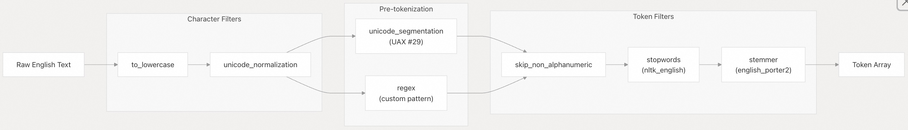
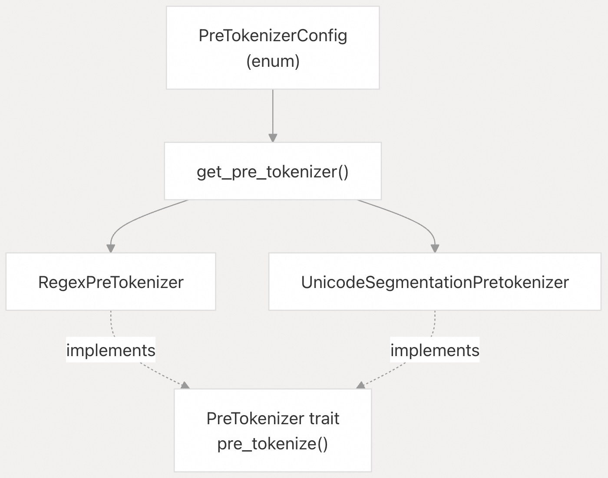
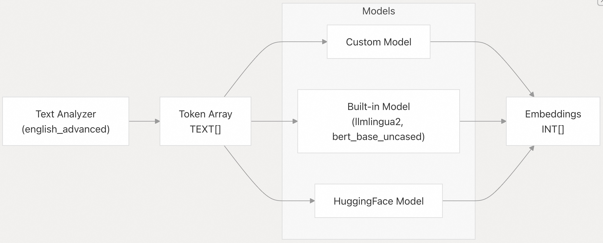
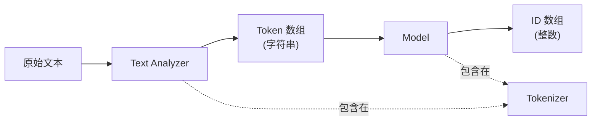

## pg_tokenizer 源码学习: 6.1 英语文本处理 (English Text Processing)  
            
### 作者            
digoal            
            
### 日期            
2025-11-20            
            
### 标签            
pg\_tokenizer , 词化 , bert , 标记化 , Tokenization            
            
----            
            
## 背景            
本文描述了 `pg_tokenizer` 如何使用特定于语言的配置来处理英语文本。涵盖了针对英语文本处理进行优化的**预分词器 (pre-tokenizers)**、**字符过滤器 (character filters)** 和**词元过滤器 (token filters)**。  
  
## 概述 (Overview)  
  
`pg_tokenizer` 中的英语文本处理结合了基于 **Unicode** 的分词 (segmentation) 和英语特有的语言学过滤器。典型的处理**管道 (pipeline)** 包括：  
  
1.  **字符规范化 (Character normalization)** - 转换为小写 (lowercase) 和 **Unicode 规范化 (Unicode normalization)**  
2.  **预分词 (Pre-tokenization)** - 使用 **Unicode 分割 (Unicode segmentation)** 或 **regex**（正则表达式）模式将文本拆分成单词边界  
3.  **词元过滤 (Token filtering)** - 应用**停用词移除 (stopword removal)**、**词干提取 (stemming)** 和其他转换  
  
与需要专用分词库的中文和日文处理不同，英语文本处理依赖于标准的 **Unicode** 单词边界算法和成熟的 **NLP**（自然语言处理）技术。  
  
**图表: 英语文本处理管道 (English Text Processing Pipeline)**  
  
  
  
来源: [`docs/04-usage.md` 28-41](https://github.com/tensorchord/pg_tokenizer.rs/blob/d3f7a577/docs/04-usage.md#L28-L41) [`docs/05-text-analyzer.md` 1-37](https://github.com/tensorchord/pg_tokenizer.rs/blob/d3f7a577/docs/05-text-analyzer.md#L1-L37) [`tests/sqllogictest/text_analyzer.slt` 5-22](https://github.com/tensorchord/pg_tokenizer.rs/blob/d3f7a577/tests/sqllogictest/text_analyzer.slt#L5-L22)  
  
## 预分词 (Pre-tokenization)  
  
英语文本使用 **Unicode 分割 (Unicode segmentation)** 或基于 **regex**（正则表达式）的**预分词 (pre-tokenization)** 来将文本拆分成初始**词元 (tokens)**。  
  
### Unicode 分割 (Unicode Segmentation)  
  
`unicode_segmentation` **预分词器 (pre-tokenizer)** 根据 [Unicode 标准附件 \#29](https://unicode.org/reports/tr29/) 拆分文本，该附件基于 **Unicode** 属性定义了单词边界。这是通用英语文本处理的推荐方法。  
  
**配置 (Configuration):**  
  
```  
pre_tokenizer = "unicode_segmentation"  
```  
  
**示例 (Example):**  
  
```  
SELECT create_text_analyzer('english_basic', $$  
pre_tokenizer = "unicode_segmentation"  
$$);  
  
SELECT apply_text_analyzer('PostgreSQL is powerful!', 'english_basic');  
-- Result: {PostgreSQL,is,powerful}  
```  
  
来源: [`src/pre_tokenizer/mod.rs` 22-29](https://github.com/tensorchord/pg_tokenizer.rs/blob/d3f7a577/src/pre_tokenizer/mod.rs#L22-L29) [`docs/05-text-analyzer.md` 20-21](https://github.com/tensorchord/pg_tokenizer.rs/blob/d3f7a577/docs/05-text-analyzer.md#L20-L21)  
  
### Regex 预分词 (Regex Pre-tokenization)  
  
`regex` **预分词器 (pre-tokenizer)** 允许自定义模式匹配词元边界。这在您需要特定的**分词 (tokenization)** 行为时非常有用。  
  
**配置 (Configuration):**  
  
```  
[pre_tokenizer]  
regex = '(?u)\b\w\w+\b'  # Matches sequences of 2+ word characters  
```  
  
模式 `(?u)\b\w\w+\b` 常用于英语，其中：  
  
  * `(?u)` 启用 **Unicode** 模式  
  * `\b` 匹配单词边界  
  * `\w\w+` 匹配两个或更多单词字符  
  
**示例 (Example):**  
  
```  
SELECT create_text_analyzer('english_regex', $$  
[pre_tokenizer]  
regex = '(?u)\b\w\w+\b'  
$$);  
```  
  
来源: [`src/pre_tokenizer/mod.rs` 21-28](https://github.com/tensorchord/pg_tokenizer.rs/blob/d3f7a577/src/pre_tokenizer/mod.rs#L21-L28) [`tests/sqllogictest/tokenizer.slt` 7](https://github.com/tensorchord/pg_tokenizer.rs/blob/d3f7a577/tests/sqllogictest/tokenizer.slt#L7-L7)  
  
**图表: 预分词器 (Pre-tokenizer) 代码结构**  
  
  
  
来源: [`src/pre_tokenizer/mod.rs` 12-32](https://github.com/tensorchord/pg_tokenizer.rs/blob/d3f7a577/src/pre_tokenizer/mod.rs#L12-L32)  
  
## 字符过滤器 (Character Filters)  
  
**字符过滤器 (Character filters)** 在**预分词 (pre-tokenization)** 之前转换文本。对于英语文本，最重要的过滤器是大小写规范化和 **Unicode 规范化 (Unicode normalization)**。  
  
### to\_lowercase（转小写）  
  
将所有字符转换为**小写 (lowercase)**，确保不区分大小写的匹配。这对于大多数英语文本处理**管道 (pipelines)** 至关重要。  
  
**配置 (Configuration):**  
  
```  
[[character_filters]]  
to_lowercase = {}  
```  
  
**示例 (Example):**  
  
```  
SELECT create_text_analyzer('lowercase_analyzer', $$  
pre_tokenizer = "unicode_segmentation"  
[[character_filters]]  
to_lowercase = {}  
$$);  
  
SELECT apply_text_analyzer('PostgreSQL Database', 'lowercase_analyzer');  
-- Result: {postgresql,database}  
```  
  
来源: [`docs/05-text-analyzer.md` 13](https://github.com/tensorchord/pg_tokenizer.rs/blob/d3f7a577/docs/05-text-analyzer.md#L13-L13) [`tests/sqllogictest/text_analyzer.slt` 8](https://github.com/tensorchord/pg_tokenizer.rs/blob/d3f7a577/tests/sqllogictest/text_analyzer.slt#L8-L8)  
  
### unicode\_normalization (Unicode 规范化)  
  
根据 **Unicode 规范化形式 (Unicode Normalization Forms)** 对文本进行规范化。英语最常用的形式有：  
  
  * `nfc` - 规范组合 (Canonical Composition) (默认)  
  * `nfd` - 规范分解 (Canonical Decomposition)  
  * `nfkc` - 兼容组合 (Compatibility Composition)  
  * `nfkd` - 兼容分解 (Compatibility Decomposition)  
  
`NFKD` 常用于英语文本，因为它会分解兼容性字符。  
  
**配置 (Configuration):**  
  
```  
[[character_filters]]  
unicode_normalization = "nfkd"  
```  
  
来源: [`docs/05-text-analyzer.md` 14](https://github.com/tensorchord/pg_tokenizer.rs/blob/d3f7a577/docs/05-text-analyzer.md#L14-L14) [`tests/sqllogictest/text_analyzer.slt` 10](https://github.com/tensorchord/pg_tokenizer.rs/blob/d3f7a577/tests/sqllogictest/text_analyzer.slt#L10-L10)  
  
## 词元过滤器 (Token Filters)  
  
**词元过滤器 (Token filters)** 在**预分词 (pre-tokenization)** 之后处理**词元 (tokens)**。英语文本处理通常使用**停用词移除 (stopword removal)**、**词干提取 (stemming)** 和字母数字过滤。  
  
### stopwords - nltk\_english（停用词 - NLTK 英语）  
  
使用 **NLTK**（自然语言工具包）英语词典移除常见的英语**停用词 (stopwords)**。这包括 "the"、"is"、"a"、"an"、"it" 等词汇。  
  
**配置 (Configuration):**  
  
```  
[[token_filters]]  
stopwords = "nltk_english"  
```  
  
**示例 (Example):**  
  
```  
SELECT create_text_analyzer('with_stopwords', $$  
pre_tokenizer = "unicode_segmentation"  
[[token_filters]]  
stopwords = "nltk_english"  
$$);  
  
SELECT apply_text_analyzer('It is a powerful database', 'with_stopwords');  
-- Result: {powerful,database}  
-- "It", "is", "a" are removed as stopwords  
```  
  
您也可以创建自定义停用词列表：  
  
```  
SELECT create_stopwords('custom_stop', $$  
the  
and  
or  
$$);  
  
SELECT create_text_analyzer('custom_stopwords', $$  
pre_tokenizer = "unicode_segmentation"  
[[token_filters]]  
stopwords = "custom_stop"  
$$);  
```  
  
来源: [`docs/05-text-analyzer.md` 30-61](https://github.com/tensorchord/pg_tokenizer.rs/blob/d3f7a577/docs/05-text-analyzer.md#L30-L61) [`tests/sqllogictest/text_analyzer.slt` 14](https://github.com/tensorchord/pg_tokenizer.rs/blob/d3f7a577/tests/sqllogictest/text_analyzer.slt#L14-L14)  
  
### stemmer - English Porter Stemming（词干提取 - 英语 Porter 词干提取）  
  
使用**词干提取 (stemming)** 算法将单词还原为词根形式。`pg_tokenizer` 支持两种英语**词干提取器 (stemmers)**：  
  
| **词干提取器 (Stemmer)** | **算法 (Algorithm)** | **描述 (Description)** |  
| :--- | :--- | :--- |  
| `english_porter` | Porter Stemmer（原始） | 经典的**词干提取**算法 |  
| `english_porter2` | Porter2 Stemmer | 改进版本，准确性更高 |  
  
推荐在现代应用中使用 `Porter2 stemmer`，因为它能更好地处理边缘情况。  
  
**配置 (Configuration):**  
  
```  
[[token_filters]]  
stemmer = "english_porter2"  
```  
  
**示例 (Example):**  
  
```  
SELECT create_text_analyzer('with_stemming', $$  
pre_tokenizer = "unicode_segmentation"  
[[token_filters]]  
stemmer = "english_porter2"  
$$);  
  
SELECT apply_text_analyzer('databases, developing, powerful', 'with_stemming');  
-- Result: {databas,develop,power}  
-- "databases" → "databas", "developing" → "develop", "powerful" → "power"  
```  
  
来源: [`docs/05-text-analyzer.md` 29-36](https://github.com/tensorchord/pg_tokenizer.rs/blob/d3f7a577/docs/05-text-analyzer.md#L29-L36) [`tests/sqllogictest/text_analyzer.slt` 16](https://github.com/tensorchord/pg_tokenizer.rs/blob/d3f7a577/tests/sqllogictest/text_analyzer.slt#L16-L16)  
  
### skip\_non\_alphanumeric (跳过非字母数字)  
  
过滤掉所有字符都是**非字母数字 (non-alphanumeric)** 的**词元 (tokens)**。这会移除仅包含标点的**词元**，同时保留混合内容的**词元**。  
  
**配置 (Configuration):**  
  
```  
[[token_filters]]  
skip_non_alphanumeric = {}  
```  
  
**示例 (Example):**  
  
```  
SELECT create_text_analyzer('skip_punct', $$  
pre_tokenizer = "unicode_segmentation"  
[[token_filters]]  
skip_non_alphanumeric = {}  
$$);  
  
SELECT apply_text_analyzer('database, system! and more...', 'skip_punct');  
-- Result: {database,system,and,more}  
-- Punctuation-only tokens are removed  
```  
  
来源: [`docs/05-text-analyzer.md` 28](https://github.com/tensorchord/pg_tokenizer.rs/blob/d3f7a577/docs/05-text-analyzer.md#L28-L28) [`tests/sqllogictest/text_analyzer.slt` 12](https://github.com/tensorchord/pg_tokenizer.rs/blob/d3f7a577/tests/sqllogictest/text_analyzer.slt#L12-L12)  
  
## 完整配置示例 (Complete Configuration Examples)  
  
### 基本英语文本分析器 (Basic English Text Analyzer)  
  
一个用于英语文本处理的最小配置：  
  
```  
SELECT create_text_analyzer('english_simple', $$  
pre_tokenizer = "unicode_segmentation"  
[[character_filters]]  
to_lowercase = {}  
[[token_filters]]  
stopwords = "nltk_english"  
$$);  
```  
  
此配置：  
  
1.  将文本转换为**小写 (lowercase)**  
2.  基于 **Unicode 单词边界 (Unicode word boundaries)** 进行分割  
3.  移除英语**停用词 (stopwords)**  
  
来源: [`docs/04-usage.md` 28-41](https://github.com/tensorchord/pg_tokenizer.rs/blob/d3f7a577/docs/04-usage.md#L28-L41)  
  
### 高级英语文本分析器 (Advanced English Text Analyzer)  
  
一个用于生产环境的全面配置：  
  
```  
SELECT create_text_analyzer('english_advanced', $$  
pre_tokenizer = "unicode_segmentation"  
[[character_filters]]  
to_lowercase = {}  
[[character_filters]]  
unicode_normalization = "nfkd"  
[[token_filters]]  
skip_non_alphanumeric = {}  
[[token_filters]]  
stopwords = "nltk_english"  
[[token_filters]]  
stemmer = "english_porter2"  
$$);  
  
SELECT apply_text_analyzer(  
    'PostgreSQL is a powerful, open-source object-relational database system.',  
    'english_advanced'  
);  
-- Result: {postgresql,power,open,sourc,object,relat,databas,system}  
```  
  
此配置：  
  
1.  转换为**小写 (lowercase)**  
2.  规范化 **Unicode** 字符 (**NFKD**)  
3.  基于单词边界进行分割  
4.  跳过仅包含标点的**词元 (tokens)**  
5.  移除 **NLTK 停用词 (stopwords)**（如 "is"、"a"）  
6.  应用 **Porter2 词干提取 (stemming)**（如 "powerful" → "power"，"database" → "databas"）  
  
来源: [`tests/sqllogictest/text_analyzer.slt` 5-22](https://github.com/tensorchord/pg_tokenizer.rs/blob/d3f7a577/tests/sqllogictest/text_analyzer.slt#L5-L22) [`docs/03-examples.md` 51-63](https://github.com/tensorchord/pg_tokenizer.rs/blob/d3f7a577/docs/03-examples.md#L51-L63)  
  
### 使用 Regex 预分词器的英语文本分析器 (English Text Analyzer with Regex Pre-tokenizer)  
  
使用 **regex**（正则表达式）对**分词 (tokenization)** 进行更多控制：  
  
```  
SELECT create_text_analyzer('english_regex', $$  
[pre_tokenizer]  
regex = '(?u)\b\w\w+\b'  
[[character_filters]]  
to_lowercase = {}  
[[token_filters]]  
stopwords = "nltk_english"  
[[token_filters]]  
stemmer = "english_porter2"  
$$);  
```  
  
这确保了只提取包含 2 个以上字符的**词元 (tokens)**。  
  
来源: [`tests/sqllogictest/tokenizer.slt` 5-14](https://github.com/tensorchord/pg_tokenizer.rs/blob/d3f7a577/tests/sqllogictest/tokenizer.slt#L5-L14)  
  
## 将英语文本分析器与分词器配合使用 (Using English Text Analyzers with Tokenizers)  
  
一旦配置好**文本分析器 (text analyzer)**，就可以将其与**分词器 (tokenizer)** 配合使用来生成**嵌入 (embeddings)**。  
  
**图表: 文本分析器 (Text Analyzer) 与模型 (Models) 的集成**  
  
  
  
来源: [`docs/04-usage.md` 68-136](https://github.com/tensorchord/pg_tokenizer.rs/blob/d3f7a577/docs/04-usage.md#L68-L136)  
  
### 与内置模型配合使用 (With Built-in Model)  
  
```sql  
-- Using a pre-trained model with English text processing  
SELECT create_tokenizer('english_tokenizer', $$  
model = "llmlingua2"  
pre_tokenizer = "unicode_segmentation"  
[[character_filters]]  
to_lowercase = {}  
[[token_filters]]  
stopwords = "nltk_english"  
[[token_filters]]  
stemmer = "english_porter2"  
$$);  
  
SELECT tokenize(  
    'PostgreSQL is a powerful database system.',  
    'english_tokenizer'  
);  
```  
  
来源: [`docs/04-usage.md` 5-16](https://github.com/tensorchord/pg_tokenizer.rs/blob/d3f7a577/docs/04-usage.md#L5-L16)  
  
### 与自定义模型配合使用 (With Custom Model)  
  
```sql  
-- Create table  
CREATE TABLE documents (  
    id SERIAL PRIMARY KEY,  
    passage TEXT,  
    embedding INT[]  
);  
  
-- Create English text analyzer  
SELECT create_text_analyzer('english_analyzer', $$  
pre_tokenizer = "unicode_segmentation"  
[[character_filters]]  
to_lowercase = {}  
[[character_filters]]  
unicode_normalization = "nfkd"  
[[token_filters]]  
skip_non_alphanumeric = {}  
[[token_filters]]  
stopwords = "nltk_english"  
[[token_filters]]  
stemmer = "english_porter2"  
$$);  
  
-- Create custom model with automatic triggers  
SELECT create_custom_model_tokenizer_and_trigger(  
    tokenizer_name => 'doc_tokenizer',  
    model_name => 'doc_model',  
    text_analyzer_name => 'english_analyzer',  
    table_name => 'documents',  
    source_column => 'passage',  
    target_column => 'embedding'  
);  
  
-- Insert data - embeddings are generated automatically  
INSERT INTO documents (passage) VALUES   
('PostgreSQL is a powerful, open-source database system.'),  
('Full-text search is a technique for searching documents.');  
```  
  
来源: [`docs/03-examples.md` 42-87](https://github.com/tensorchord/pg_tokenizer.rs/blob/d3f7a577/docs/03-examples.md#L42-L87) [`docs/04-usage.md` 18-66](https://github.com/tensorchord/pg_tokenizer.rs/blob/d3f7a577/docs/04-usage.md#L18-L66)  
  
## 配置参考表 (Configuration Reference Table)  
  
**英语文本处理组件总结 (Summary of English Text Processing Components)**  
  
| **组件 (Component)** | **类型 (Type)** | **名称 (Name)** | **描述 (Description)** | **用途 (Usage)** |  
| :--- | :--- | :--- | :--- | :--- |  
| **预分词器 (Pre-tokenizer)** | `unicode_segmentation` | - | **Unicode** 单词边界分割 | 推荐用于一般用途 |  
| **预分词器 (Pre-tokenizer)** | `regex` | `(?u)\b\w\w+\b` | **Regex** 模式匹配 | 用于自定义**分词 (tokenization)** 规则 |  
| **字符过滤器 (Character Filter)** | `to_lowercase` | - | 转换为小写 (Lowercase conversion) | 对不区分大小写的匹配至关重要 |  
| **字符过滤器 (Character Filter)** | `unicode_normalization` | `nfkd` | **Unicode 规范化 (Unicode normalization)** | 规范化字符表示 |  
| **词元过滤器 (Token Filter)** | `stopwords` | `nltk_english` | 英语**停用词移除 (stopword removal)** | 移除常用词 |  
| **词元过滤器 (Token Filter)** | `stemmer` | `english_porter2` | **Porter2 词干提取 (stemming)** | 将单词还原为词根形式 |  
| **词元过滤器 (Token Filter)** | `stemmer` | `english_porter` | **Porter 词干提取 (stemming)**（原始） | 传统词干提取器 |  
| **词元过滤器 (Token Filter)** | `skip_non_alphanumeric` | - | 移除标点**词元 (tokens)** | 清理词元流 |  
  
来源: [`docs/05-text-analyzer.md` 9-37](https://github.com/tensorchord/pg_tokenizer.rs/blob/d3f7a577/docs/05-text-analyzer.md#L9-L37)  
  
## 性能考量 (Performance Considerations)  
  
### 预分词器选择 (Pre-tokenizer Choice)  
  
  * **unicode\_segmentation**: 快速，适用于大多数英语文本。无需配置。  
  * **regex**（正则表达式）: 灵活但略慢。在需要特定模式时使用。  
  
### 过滤器顺序 (Filter Ordering)  
  
推荐用于最佳性能的**过滤器顺序 (filter order)**：  
  
1.  **字符过滤器 (Character filters)**（`to_lowercase`、`unicode_normalization`）  
2.  **预分词器 (Pre-tokenizer)**（`unicode_segmentation` 或 `regex`）  
3.  **词元过滤器 (Token filters)** 按以下顺序：  
      * `skip_non_alphanumeric`（提前减少**词元 (token)** 数量）  
      * `stopwords`（移除常用**词元**）  
      * `stemmer`（规范化剩余**词元**）  
  
这种顺序最大限度地减少了像**词干提取 (stemming)** 这样开销大的操作所处理的**词元**数量。  
  
来源: [`docs/05-text-analyzer.md` 1-8](https://github.com/tensorchord/pg_tokenizer.rs/blob/d3f7a577/docs/05-text-analyzer.md#L1-L8)  
  
## 常见模式 (Common Patterns)  
  
### 模式: 不区分大小写的搜索 (Pattern: Case-Insensitive Search)  
  
```sql  
SELECT create_text_analyzer('case_insensitive', $$  
pre_tokenizer = "unicode_segmentation"  
[[character_filters]]  
to_lowercase = {}  
$$);  
```  
  
### 模式: 完整的英语 NLP 管道 (Pattern: Full English NLP Pipeline)  
  
```sql  
SELECT create_text_analyzer('english_nlp', $$  
pre_tokenizer = "unicode_segmentation"  
[[character_filters]]  
to_lowercase = {}  
[[character_filters]]  
unicode_normalization = "nfkd"  
[[token_filters]]  
skip_non_alphanumeric = {}  
[[token_filters]]  
stopwords = "nltk_english"  
[[token_filters]]  
stemmer = "english_porter2"  
$$);  
```  
  
### 模式: 最小处理（保留原始形式）(Pattern: Minimal Processing (Keep Original Forms))  
  
```sql  
SELECT create_text_analyzer('english_minimal', $$  
pre_tokenizer = "unicode_segmentation"  
[[character_filters]]  
to_lowercase = {}  
$$);  
```  
  
来源: [`tests/sqllogictest/text_analyzer.slt` 5-17](https://github.com/tensorchord/pg_tokenizer.rs/blob/d3f7a577/tests/sqllogictest/text_analyzer.slt#L5-L17) [`docs/03-examples.md` 51-63](https://github.com/tensorchord/pg_tokenizer.rs/blob/d3f7a577/docs/03-examples.md#L51-L63)  
  
-----  
  
# 附录1: 性能和召回率之间的核心权衡  
文章在“性能考量”中提到，**词干提取器 (`stemmer`)** 属于开销较大的操作，而“高级英语文本分析器”推荐使用了 `english_porter2`。  
  
从实际应用的性能角度来看，如果用户主要关注**查询速度 (query speed)** ，并希望最小化处理成本，那么在不使用**词干提取**的情况下，仅依赖 **`to_lowercase`**、**`unicode_segmentation`** 和 **`stopwords`** 这样精简的配置是否足够用于大多数英文搜索场景？  
  
请问：  
  
1.  **性能提升与召回率 (Recall) 损失的权衡：** 移除 `english_porter2` **词干提取**操作能带来多大的性能提升（例如，查询延迟降低百分比）？这种取舍会对英文信息的**搜索召回率**（即能否成功匹配到词形变化的单词，例如 `running` 和 `ran`）产生多大影响？  
2.  **词干提取的不可替代性：** 在哪些特定的英文搜索应用场景（例如，法律文档、生物医学、专利搜索）中，**词干提取**是不可或缺的，以至于性能的牺牲是值得的？  
  
这个问题涉及 `pg_tokenizer.rs` 中英文文本分析器的配置权衡，特别是关于移除 `english_porter2` 词干提取器对性能和召回率的影响。   
  
## 问题重述  
  
您询问的是在 `pg_tokenizer.rs` 的文本分析器配置中，使用精简配置（`to_lowercase` + `unicode_segmentation` + `stopwords`）与完整配置（额外包含 `english_porter2` 词干提取）之间的性能与召回率权衡。    
  
## 回答  
  
### 1. 性能提升与召回率损失的权衡  
  
**关于性能数据：** 代码库中**没有提供**关于移除词干提取器后具体性能提升百分比的基准测试数据或性能指标。   
  
**词干提取的实现：** `english_porter2` 使用 `rust_stemmers` 库实现，其 `apply` 方法对每个 token 调用 `stemmer.stem()`。 该操作是纯 CPU 计算，理论上会增加处理延迟，但具体影响取决于文本长度和 token 数量。   
  
**召回率影响：** 移除词干提取会**显著降低召回率**。词干提取将词形变化归一化（如 `running` → `run`），使得不同词形可以匹配。 没有词干提取，`running` 和 `run` 会被视为完全不同的 token，无法匹配。  
  
**精简配置的局限性：**  
- `to_lowercase` 只处理大小写    
- `unicode_segmentation` 只负责分词    
- `stopwords` 只移除常见词    
  
这些操作**无法处理词形变化**，因此对于需要匹配不同词形的搜索场景，精简配置是不够的。   
  
### 2. 词干提取的不可替代性  
  
代码库中的示例配置显示，词干提取在以下场景中被标准使用：  
  
**文档搜索场景：** 在自定义模型的示例中（用于 BM25 搜索），配置明确包含 `stemmer = "english_porter2"`。  这表明对于需要高召回率的文档检索系统，词干提取是推荐配置。  
  
**特定领域应用：** 虽然代码库没有明确讨论法律、生物医学或专利搜索等特定领域，但从技术角度：  
- **法律文档：** 需要精确匹配，词干提取可能导致过度归一化（如 `contract` vs `contracting`）  
- **生物医学/专利：** 术语变化频繁，词干提取有助于匹配相关术语的不同形式  
  
**可用的词干提取算法：** 系统支持 `english_porter` 和 `english_porter2` 两种英文词干提取算法。  Porter2 是更现代的算法，通常提供更好的归一化效果。   
  
## Notes  
  
代码库没有提供性能基准测试数据，因此无法给出具体的性能提升百分比。如果您需要准确的性能数据，建议在您的实际数据集上进行基准测试，比较有无词干提取的查询延迟。   
  
文本分析器的处理流程是：字符过滤器 → 预分词器 → token 过滤器，词干提取作为 token 过滤器在最后阶段执行。 对于大多数英文搜索场景，如果召回率比性能更重要，建议保留词干提取。   
  
-----  
  
# 附录2: 可以这么理解吗“analyzer把文本切分成token, tokenizer 把token映射成ID”?  
您的理解**基本正确,但需要稍作调整**。   
  
在 `pg_tokenizer` 中:  
  
## 正确的理解  
  
1. **Text Analyzer (文本分析器)** 把文本切分成 token 数组    
2. **Model (内置模型, 或自定义模型)** 把 token 映射成 ID    
3. **Tokenizer (分词器)** 是组合了 text analyzer 和 model 的完整流程    
  
## 具体流程  
  

  
从代码实现可以看到:  
- `TextAnalyzer::apply()` 返回 `Vec<String>` (token 数组)    
- `TokenizerModel::apply_batch()` 接收 `Vec<String>` 并返回 `Vec<u32>` (ID 数组)    
- `Tokenizer::tokenize()` 组合这两个步骤    
  
## Notes  
  
您提到的 "analyzer" 应该指的是 **text analyzer**, 而不是整个 tokenizer。在这个代码库中,`tokenizer` 是一个更高层的概念, 它包含了 text analyzer 和 model 两个组件。  
  
    
#### [PolarDB 学习图谱](https://www.aliyun.com/database/openpolardb/activity "8642f60e04ed0c814bf9cb9677976bd4")
  
  
#### [PostgreSQL 解决方案集合](../201706/20170601_02.md "40cff096e9ed7122c512b35d8561d9c8")
  
  
#### [德哥 / digoal's Github - 公益是一辈子的事.](https://github.com/digoal/blog/blob/master/README.md "22709685feb7cab07d30f30387f0a9ae")
  
  
#### [About 德哥](https://github.com/digoal/blog/blob/master/me/readme.md "a37735981e7704886ffd590565582dd0")
  
  

  
