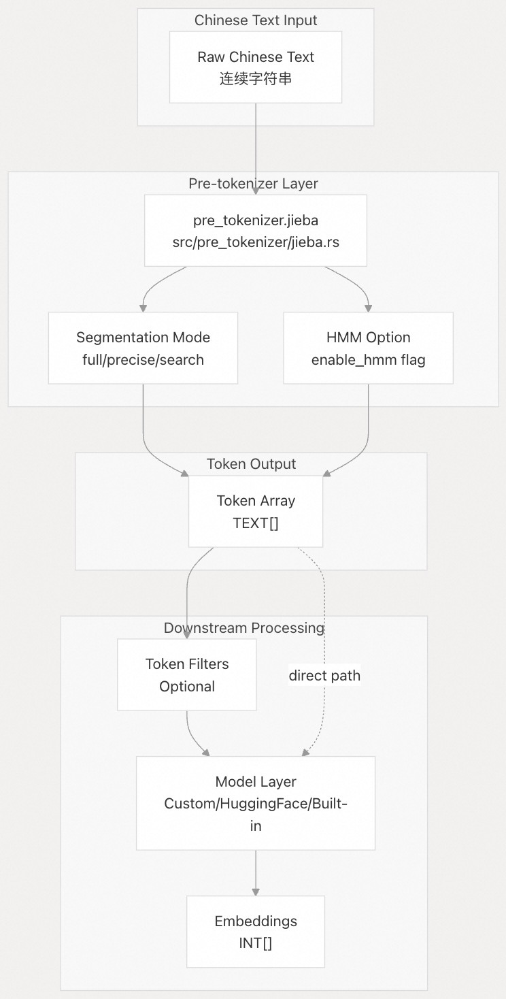
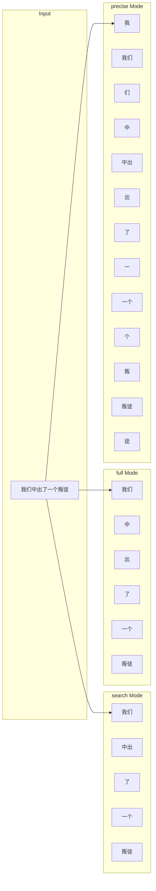
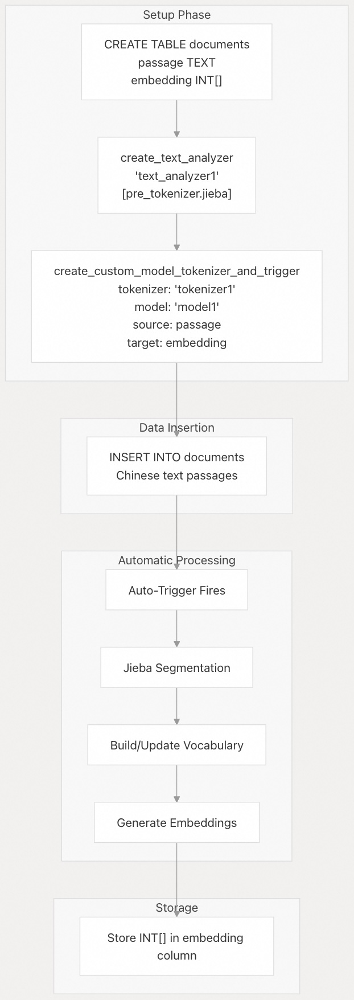

## pg_tokenizer 源码学习: 6.2 汉字文本处理 (Chinese Text Processing)  
              
### 作者              
digoal              
              
### 日期              
2025-11-20              
              
### 标签              
pg\_tokenizer , 词化 , bert , 标记化 , Tokenization              
              
----              
              
## 背景              
本文描述了如何使用 `pg_tokenizer` 的 **Jieba** (结巴) 集成来处理中文文本。中文文本的**分词** (Text Segmentation) 与西方语言有着根本性的区别，因为中文缺乏明确的**词语边界** (Word Boundaries)，需要使用专门的**算法** (Algorithms) 进行准确的**分词** (Tokenization)。  
  
## 概述 (Overview)  
  
`pg_tokenizer` 使用 `jieba-rs` **库** (Library) 将中文文本**分词** (Segment) 为有意义的**词元** (Tokens)。**Jieba 预分词器** (Jieba Pre-tokenizer) 在**文本处理流水线** (Text Processing Pipeline) 的**预分词阶段** (Pre-tokenization Stage) 运行，将未分词的中文**字符串** (Strings) 转换为离散的**词语词元** (Discrete Word Tokens)，然后这些**词元**可以被**词元过滤器** (Token Filters) 和**模型** (Models) 处理。  
  
## Jieba 预分词器架构 (Jieba Pre-tokenizer Architecture)  
  
下图展示了 **Jieba 预分词器** (Jieba Pre-tokenizer) 如何融入**文本处理流水线** (Text Processing Pipeline)：  
  
  
  
Jieba **预分词器** (Pre-tokenizer) 将连续的汉字序列转换为已分词的**词元** (Segmented Tokens)，这些**词元**可以由**下游组件** (Downstream Components) 处理。与以**空格** (Whitespace) 自然分隔词语的英文文本不同，中文需要**算法** (Algorithmic) 级别的**词语分段** (Word Segmentation)。  
  
**来源 (Sources):**  
[`tests/sqllogictest/chinese.slt` 12-14](https://github.com/tensorchord/pg_tokenizer.rs/blob/d3f7a577/tests/sqllogictest/chinese.slt#L12-L14)  
[`tests/sqllogictest/jieba.slt` 5-9](https://github.com/tensorchord/pg_tokenizer.rs/blob/d3f7a577/tests/sqllogictest/jieba.slt#L5-L9)  
  
## 分词模式 (Segmentation Modes)  
  
Jieba 提供了三种**分词模式** (Segmentation Modes)，每种模式都针对不同的**用例** (Use Case) 进行了优化：  
  
| 模式 (Mode) | 描述 (Description) | 用例 (Use Case) | 配置 (Configuration) |  
| :--- | :--- | :--- | :--- |  
| **search** (默认) | 平衡的**分词** (Segmentation)，针对**搜索引擎** (Search Engines) 进行了优化 | **全文搜索** (Full-text search)，通用**分词** (Tokenization) | `mode = "search"` 或省略 |  
| **full** | **穷尽式分词** (Exhaustive Segmentation)，生成所有可能的词语 | **最大词元覆盖率** (Maximum Token Coverage) | `mode = "full"` |  
| **precise** | **细粒度分词** (Fine-grained Segmentation)，分解为最小的有意义单元 | **详细分析** (Detailed Analysis)，**字符级处理** (Character-level Processing) | `mode = "precise"` |  
  
### 模式比较示例 (Mode Comparison Example)  
  
使用文本 "我们中出了一个叛徒" (We have a traitor among us)：  
  

  
**来源 (Sources):**  
[`tests/sqllogictest/jieba.slt` 5-36](https://github.com/tensorchord/pg_tokenizer.rs/blob/d3f7a577/tests/sqllogictest/jieba.slt#L5-L36)  
  
## 隐马尔可夫模型 (HMM) 配置 (HMM Configuration)  
  
**隐马尔可夫模型** (Hidden Markov Model, HMM) 选项支持**概率分词** (Probabilistic Word Segmentation)，用于处理**词典外词语** (Out-of-Vocabulary Words) 和**模糊分词边界** (Ambiguous Segmentation Boundaries)。  
  
| 参数 (Parameter) | 类型 (Type) | 默认值 (Default) | 描述 (Description) |  
| :--- | :--- | :--- | :--- |  
| `enable_hmm` | **布尔值** (boolean) | `true` | 启用基于 HMM 的**新词发现** (New Word Discovery) |  
  
启用后，Jieba 使用 HMM 来识别**词典** (Dictionary) 中不存在的词语，从而提高了以下情况的**分词质量** (Segmentation Quality)：  
  
  * **专有名词** (Proper nouns) (人名、地名)  
  * **技术术语** (Technical terminology)  
  * **新词** (Neologisms) 和**网络俚语** (Internet slang)  
  * **领域特定词汇** (Domain-specific vocabulary)  
  
**来源 (Sources):**  
[`tests/sqllogictest/jieba.slt` 7-9](https://github.com/tensorchord/pg_tokenizer.rs/blob/d3f7a577/tests/sqllogictest/jieba.slt#L7-L9)  
  
## 为中文创建文本分析器 (Creating Text Analyzers for Chinese)  
  
### 基本配置 (Basic Configuration)  
  
创建使用 **Jieba 预分词器** (Jieba Pre-tokenizer) 默认设置（**搜索模式** (search mode)，HMM 启用）的**文本分析器** (Text Analyzer)：  
  
```sql  
SELECT tokenizer_catalog.create_text_analyzer('chinese_analyzer', $$  
[pre_tokenizer.jieba]  
$$);  
```  
  
此配置适用于大多数中文文本处理任务，尤其是**全文搜索** (Full-text Search) 应用。  
  
**来源 (Sources):**  
[`tests/sqllogictest/chinese.slt` 12-14](https://github.com/tensorchord/pg_tokenizer.rs/blob/d3f7a577/tests/sqllogictest/chinese.slt#L12-L14)  
[`tests/sqllogictest/jieba.slt` 28-30](https://github.com/tensorchord/pg_tokenizer.rs/blob/d3f7a577/tests/sqllogictest/jieba.slt#L28-L30)  
  
### 高级配置 (Advanced Configuration)  
  
显式指定**模式** (mode) 和 **HMM** 设置：  
  
```sql  
SELECT tokenizer_catalog.create_text_analyzer('chinese_full_no_hmm', $$  
[pre_tokenizer.jieba]  
mode = "full"  
enable_hmm = false  
$$);  
```  
  
下表展示了常见的**配置模式** (Configuration Patterns)：  
  
| 用例 (Use Case) | 模式 (Mode) | HMM | 理由 (Rationale) |  
| :--- | :--- | :--- | :--- |  
| **通用搜索** (General search) | `search` | `true` | 平衡分词与**新词发现** (New Word Discovery) |  
| **最大召回** (Maximum recall) | `full` | `true` | 生成所有可能的**分词候选** (Segmentation Candidates) |  
| **确定性分词** (Deterministic segmentation) | `search` | `false` | **仅基于词典的分词** (Dictionary-only Segmentation) 以确保**可重现性** (Reproducibility) |  
| **细粒度分析** (Fine-grained analysis) | `precise` | `true` | **详细分词** (Detailed Tokenization) 与**新词支持** (New Word Support) |  
  
**来源 (Sources):**  
[`tests/sqllogictest/jieba.slt` 5-9](https://github.com/tensorchord/pg_tokenizer.rs/blob/d3f7a577/tests/sqllogictest/jieba.slt#L5-L9)  
[`tests/sqllogictest/jieba.slt` 17-20](https://github.com/tensorchord/pg_tokenizer.rs/blob/d3f7a577/tests/sqllogictest/jieba.slt#L17-L20)  
  
## 文本分析器应用 (Text Analyzer Application)  
  
`tokenizer_catalog.apply_text_analyzer` **函数** (Function) 将 **Jieba 分词** (Jieba Segmentation) 应用于文本，返回**词元数组** (Token Arrays)：  
  
```sql  
-- Using search mode (default)  
SELECT tokenizer_catalog.apply_text_analyzer(  
    '我们中出了一个叛徒',   
    'jieba_cut_search'  
);  
-- Returns: {我们,中出,了,一个,叛徒}  
  
-- Using full mode  
SELECT tokenizer_catalog.apply_text_analyzer(  
    '我们中出了一个叛徒',   
    'jieba_cut_full'  
);  
-- Returns: {我们,中,出,了,一个,叛徒}  
  
-- Using precise mode    
SELECT tokenizer_catalog.apply_text_analyzer(  
    '我们中出了一个叛徒',   
    'jieba_cut_precise'  
);  
-- Returns: {我,我们,们,中,中出,出,了,一,一个,个,叛,叛徒,徒}  
```  
  
**来源 (Sources):**  
[`tests/sqllogictest/jieba.slt` 11-36](https://github.com/tensorchord/pg_tokenizer.rs/blob/d3f7a577/tests/sqllogictest/jieba.slt#L11-L36)  
  
## 完整示例：带有中文文本的自定义模型 (Complete Example: Custom Model with Chinese Text)  
  
此示例演示了中文文本的**端到端** (End-to-End) 处理，包括**自定义模型** (Custom Model) 创建和**自动嵌入** (Automatic Embedding) 生成：  
  
  
  
### 实现 (Implementation)  
  
```sql  
-- Step 1: Create table  
CREATE TABLE documents (  
    id SERIAL PRIMARY KEY,  
    passage TEXT,  
    embedding INT[]  
);  
  
-- Step 2: Create text analyzer with Jieba  
SELECT tokenizer_catalog.create_text_analyzer('text_analyzer1', $$  
[pre_tokenizer.jieba]  
$$);  
  
-- Step 3: Create custom model, tokenizer, and trigger  
SELECT tokenizer_catalog.create_custom_model_tokenizer_and_trigger(  
    tokenizer_name => 'tokenizer1',  
    model_name => 'model1',  
    text_analyzer_name => 'text_analyzer1',  
    table_name => 'documents',  
    source_column => 'passage',  
    target_column => 'embedding'  
);  
  
-- Step 4: Insert Chinese text (embeddings generated automatically)  
INSERT INTO documents (passage) VALUES   
('红海早过了，船在印度洋面上开驶着，但是太阳依然不饶人地迟落早起，侵占去大部分的夜。'),  
('夜仿佛纸浸了油变成半透明体；它给太阳拥抱住了，分不出身来，也许是给太阳陶醉了，所以夕照晚霞褪后的夜色也带着酡红。');  
  
-- Step 5: Query embeddings  
SELECT id, embedding FROM documents ORDER BY id;  
```  
  
此**工作流程** (Workflow)：  
  
1.  创建一个使用 Jieba 默认**搜索模式** (search mode) 的**文本分析器** (Text Analyzer)  
2.  从**语料库** (Corpus) 构建一个**自定义词汇模型** (Custom Vocabulary Model)  
3.  通过**数据库触发器** (Database Triggers) 在 `INSERT`/`UPDATE` 时**自动生成嵌入** (Automatically Generates Embeddings)  
4.  将**整数词元 ID** (Integer Token IDs) 存储在 `embedding` **列** (Column) 中  
  
**来源 (Sources):**  
[`tests/sqllogictest/chinese.slt` 1-44](https://github.com/tensorchord/pg_tokenizer.rs/blob/d3f7a577/tests/sqllogictest/chinese.slt#L1-L44)  
  
## 配置参考 (Configuration Reference)  
  
### TOML 配置模式 (TOML Configuration Schema)  
  
```toml  
[pre_tokenizer.jieba]  
# Segmentation mode  
# Options: "search" | "full" | "precise"  
# Default: "search"  
mode = "search"  
  
# Enable Hidden Markov Model for new word discovery  
# Default: true  
enable_hmm = true  
```  
  
### 与其他流水线阶段的集成 (Integration with Other Pipeline Stages)  
  
**Jieba 预分词器** (Jieba Pre-tokenizer) 可以与**字符过滤器** (Character Filters) 和**词元过滤器** (Token Filters) 结合：  
  
```sql  
SELECT tokenizer_catalog.create_text_analyzer('chinese_comprehensive', $$  
# Character filter: normalize to lowercase (optional for Chinese)  
[character_filter.to_lowercase]  
  
# Pre-tokenizer: Jieba segmentation  
[pre_tokenizer.jieba]  
mode = "search"  
enable_hmm = true  
  
# Token filter: remove stopwords  
[token_filter.stopwords]  
words = ["的", "了", "在", "是", "我"]  
  
# Token filter: generate n-grams  
[token_filter.ngram]  
min_gram = 2  
max_gram = 3  
$$);  
```  
  
这创建了一个**流水线** (Pipeline)，它将：  
  
1.  **标准化字符大小写** (Normalizes character case)（对中文影响最小）  
2.  使用 Jieba **搜索模式** (search mode) **分词** (Segment) 文本  
3.  移除常见的中文**停用词** (Stopwords)  
4.  生成 **2-gram** 和 **3-gram** **词元** (Tokens)  
  
**来源 (Sources):**  
[`tests/sqllogictest/chinese.slt` 12-14](https://github.com/tensorchord/pg_tokenizer.rs/blob/d3f7a577/tests/sqllogictest/chinese.slt#L12-L14)  
[`tests/sqllogictest/jieba.slt` 5-9](https://github.com/tensorchord/pg_tokenizer.rs/blob/d3f7a577/tests/sqllogictest/jieba.slt#L5-L9)  
  
## 实用考量 (Practical Considerations)  
  
### 性能 (Performance)  
  
  * **初始化成本** (Initialization Cost)：Jieba 在首次使用时加载**词典数据** (Dictionary Data)；使用**模型预加载系统** (Model Preloading System) **预加载** (Preload) 常用**分析器** (Analyzers)（请参阅 [模型预加载](/tensorchord/pg_tokenizer.rs/5.4-model-preloading)）  
  * **分词速度** (Segmentation Speed)：**搜索模式** (Search Mode) 提供最佳**吞吐量** (Throughput)；**精确模式** (Precise Mode) 生成更多**词元** (Tokens)，需要更多处理  
  * **内存使用** (Memory Usage)：**词典** (Dictionary) 和 **HMM 模型** (HMM Model) 每个**分析器实例** (Analyzer Instance) 消耗约 10-20MB  
  
### 字符编码 (Character Encoding)  
  
Jieba 期望 **UTF-8 编码** (UTF-8 Encoded) 的文本。**PostgreSQL** **文本列** (Text Columns) 默认使用 UTF-8，确保了**兼容性** (Compatibility)。非 UTF-8 编码必须在处理前进行**转换** (Converted)。  
  
### 词典定制 (Dictionary Customization)  
  
`jieba-rs` **库** (Library) 使用**预编译词典** (Pre-compiled Dictionary)。**自定义词典** (Custom Dictionaries) 需要：  
  
1.  构建一个带有修改后**词典** (Dictionary) 的**自定义版本** (Custom Version) `jieba-rs`  
2.  使用**自定义** (Custom) `jieba-rs` **依赖** (Dependency) 重新编译 `pg_tokenizer`  
  
对于**领域特定词汇** (Domain-specific Vocabulary)，如果不想修改**词典** (Dictionary)，可以使用**自定义模型** (Custom Models) 从您的**语料库** (Corpus) 中学习**词元 ID** (Token IDs)。  
  
### 与日语处理的比较 (Comparison with Japanese Processing)  
  
虽然中文和日文都需要**专门的分词** (Specialized Segmentation)，但关键区别包括：  
  
| 方面 (Aspect) | 中文 (Jieba) | 日文 (Lindera) |  
| :--- | :--- | :--- |  
| **词典** (Dictionary) | 在**编译时** (Compile-time) 固定 | 可配置 (`ipadic` 等) |  
| **模式选项** (Mode Options) | 3 种模式 (search/full/precise) | 2 种模式 (normal/decompose) |  
| **HMM 支持** (HMM Support) | **可选的新词发现** (Optional New Word Discovery) | 内置于**词典** (Dictionary) 中 |  
| **字符过滤器** (Character Filters) | **效用有限** (Limited Utility) | **必不可少** (Essential) (**迭代标记** (Iteration Marks)，**映射** (Mapping)) |  
| **词元过滤器** (Token Filters) | **通用目的** (General Purpose) | **语言特定** (Language-specific) (**复合词** (Compound Words)，**片假名** (Katakana)) |  
  
有关日文文本处理，请参阅 日文文本处理 章节。  
  
**来源 (Sources):**  
[`tests/sqllogictest/chinese.slt` 27-41](https://github.com/tensorchord/pg_tokenizer.rs/blob/d3f7a577/tests/sqllogictest/chinese.slt#L27-L41)  
  
## 函数参考 (Function Reference)  
  
以下**函数** (Functions) 用于中文文本处理：  
  
| 函数 (Function) | 参数 (Parameters) | 返回类型 (Return Type) | 描述 (Description) |  
| :--- | :--- | :--- | :--- |  
| `tokenizer_catalog.create_text_analyzer` | `name TEXT`, `config TEXT` | `void` | 使用 Jieba **预分词器** (Pre-tokenizer) 创建**文本分析器** (Text Analyzer) |  
| `tokenizer_catalog.apply_text_analyzer` | `text TEXT`, `analyzer_name TEXT` | `TEXT[]` | 应用 Jieba **分词** (Segmentation)，返回**词元** (Tokens) |  
| `tokenizer_catalog.tokenize` | `text TEXT`, `tokenizer_name TEXT` | `INT[]` | **全部分词** (Full Tokenization) 到**嵌入** (Embeddings) |  
| `tokenizer_catalog.create_custom_model_tokenizer_and_trigger` | 多个 (见下文) | `void` | 创建**端到端** (End-to-End) **处理流水线** (Processing Pipeline) |  
  
`create_custom_model_tokenizer_and_trigger` **函数** (Function) 用于中文文本的参数：  
  
  * `tokenizer_name`: **分词器** (Tokenizer) 的名称  
  * `model_name`: **自定义模型** (Custom Model) (**词汇表** (Vocabulary)) 的名称  
  * `text_analyzer_name`: 带有 Jieba **预分词器** (Pre-tokenizer) 的**分析器** (Analyzer) 名称  
  * `table_name`: 包含中文文本的**源表** (Source Table)  
  * `source_column`: 包含要处理的中文文本的**列** (Column)  
  * `target_column`: 存储**整数嵌入** (Integer Embeddings) 的**列** (Column)  
  
**来源 (Sources):**  
[`tests/sqllogictest/chinese.slt` 12-24](https://github.com/tensorchord/pg_tokenizer.rs/blob/d3f7a577/tests/sqllogictest/chinese.slt#L12-L24)  
[`tests/sqllogictest/jieba.slt` 11-36](https://github.com/tensorchord/pg_tokenizer.rs/blob/d3f7a577/tests/sqllogictest/jieba.slt#L11-L36)  
  
-----  
  
# 附录: 如何在生产环境中高效地管理自定义词典和 HMM 模型，以确保中文分词的准确性和性能？  
  
如何在生产环境中高效地管理自定义词典和 HMM 模型，以确保中文分词的准确性和性能？  
  
这个问题的价值在于：  
  
1.  **性能与成本考量 (Initialization Cost & Memory Usage):** 用户关心如何平衡 Jieba 在首次加载时的**初始化成本** (Initialization Cost) 和每个**分析器实例** (Analyzer Instance) 占用的**内存** (Memory Usage) (10-20MB)，尤其是在高并发或资源受限的生产环境中。  
2.  **准确性与定制化 (Dictionary Customization):** 内容提到如果需要针对**领域特定词汇** (Domain-specific Vocabulary) 进行优化，需要**重新编译** (`jieba-rs` 和 `pg_tokenizer`)。这对生产环境的部署和维护提出了挑战。用户需要知道：  
    * 是否有更灵活的机制（例如，不需重新编译的动态加载）来添加/更新**自定义词汇** (Custom Vocabulary)？  
    * 在不修改**词典** (Dictionary) 的情况下，使用**自定义模型** (Custom Models) 从**语料库** (Corpus) 中学习**词元 ID** (Token IDs) 的方式，与直接修改 Jieba 词典相比，在处理未登录词和领域词方面，效果和性能上的具体差异是什么？  
3.  **HMM 效果的量化：** 用户可能想知道，在开启或关闭 **HMM** (隐马尔可夫模型) 时，针对不同的中文文本类型（如技术文档、网络评论）的**分词准确率** (Segmentation Accuracy) 有没有量化指标或推荐实践。  
  
## 回答  
如何在生产环境中高效管理中文分词的自定义词典和 HMM 模型。 根据代码库上下文, 这涉及 `pg_tokenizer` 扩展中的 Jieba 分词器配置和自定义模型管理。   
  
## 中文分词配置  
  
`pg_tokenizer` 使用 Jieba 进行中文分词,通过 `pre_tokenizer.jieba` 配置。 Jieba 支持三种模式和 HMM 开关:    
  
- `mode`: `full`(全模式)、`precise`(精确模式)、`search`(搜索引擎模式)  
- `enable_hmm`: 控制是否启用 HMM 识别未登录词,默认为 `true`  
  
## 生产环境管理策略  
  
### 1. 文本分析器配置  
  
创建中文文本分析器时配置 HMM:    
  
```sql  
SELECT tokenizer_catalog.create_text_analyzer('text_analyzer1', $$  
[pre_tokenizer.jieba]  
mode = "search"  
enable_hmm = true  
$$);  
```  
  
### 2. 自定义词典管理  
  
使用 `create_custom_model` 构建基于语料库的自定义词典:    
  
该函数会:    
1. 创建 `tokenizer_catalog.model_{name}` 表存储词汇  
2. 设置触发器自动更新词典  
3. 从现有数据提取并插入词汇  
  
### 3. 模型预加载  
  
使用预加载机制提升性能:    
  
```sql  
-- 添加到预加载列表  
SELECT tokenizer_catalog.add_preload_model('model1');  
  
-- 查看预加载模型  
SELECT tokenizer_catalog.list_preload_models();  
```  
  
### 4. 词典持久化  
  
自定义模型配置存储在两层结构中:    
- 数据库表 `tokenizer_catalog.model` 存储配置  
- 内存缓存 `MODEL_OBJECT_POOL` 提供快速访问  
  
### 5. 动态更新  
  
触发器机制确保词典自动更新: 当源表数据变化时,新词汇会自动添加到模型词典中。   
  
## 性能优化建议  
  
1. **HMM 配置**: 对于已知领域文本, 可关闭 HMM (`enable_hmm = false`) 以提升性能   
2. **模式选择**: 搜索场景使用 `search` 模式, 精确分词使用 `precise` 模式    
3. **预加载**: 生产环境启动时预加载常用模型   
4. **批量处理**: 使用 `apply_batch` 方法批量处理 token    
  
## Notes  
  
Jieba 分词器使用全局单例 `JIEBA` 实例 , 通过 `LazyLock` 确保线程安全和延迟初始化。 自定义模型的词汇表长度限制为 2600 字符  ,超长 token 会被自动切分。   
  
对于日语分词,系统提供了 Lindera 模型  ,但这与中文分词是独立的系统。   
  
    
#### [PolarDB 学习图谱](https://www.aliyun.com/database/openpolardb/activity "8642f60e04ed0c814bf9cb9677976bd4")
  
  
#### [PostgreSQL 解决方案集合](../201706/20170601_02.md "40cff096e9ed7122c512b35d8561d9c8")
  
  
#### [德哥 / digoal's Github - 公益是一辈子的事.](https://github.com/digoal/blog/blob/master/README.md "22709685feb7cab07d30f30387f0a9ae")
  
  
#### [About 德哥](https://github.com/digoal/blog/blob/master/me/readme.md "a37735981e7704886ffd590565582dd0")
  
  

  
