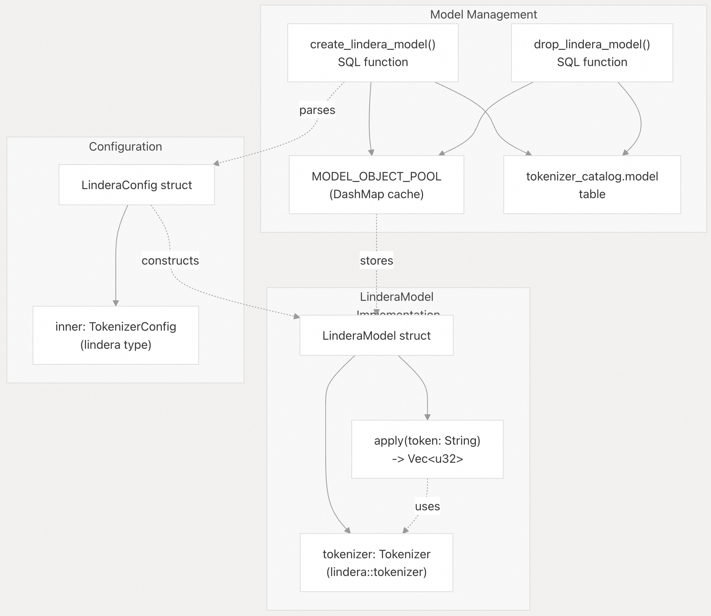
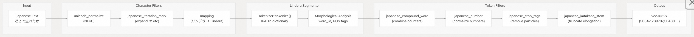

## pg_tokenizer 源码学习: 6.3 日语文本处理 (Japanese Text Processing)    
                
### 作者                
digoal                
                
### 日期                
2025-11-20                
                
### 标签                
pg\_tokenizer , 词化 , bert , 标记化 , Tokenization                
                
----                
                
## 背景                
本文介绍 `pg_tokenizer` (PostgreSQL分词器) 中使用 **Lindera 形态学分析器** (`Lindera morphological analyzer`) 进行日语文本处理的方法。日语需要专门的分词 (`tokenization`)，因为它不像其他语言那样使用 **空格** (`whitespace`) 来分隔单词，并且结合了多种书写系统（**平假名** `hiragana`、**片假名** `katakana`、**汉字** `kanji`）。  
  
## 概述  
  
**Lindera 模型** (`Lindera model`) 通过基于字典的分段 (`dictionary-based segmentation`) 为日语文本提供 **形态学分析** (`morphological analysis`)。Lindera 在 `pg_tokenizer` 中作为一种模型类型实现，它封装了 **`lindera` Rust 库**。该实现支持可配置的字典 (`dictionaries`)、**字符标准化过滤器** (`character normalization filters`)，以及针对日语语言特征的 **词元级过滤器** (`token-level filters`)。  
  
### Lindera 模型架构  
  
  
  
来源: [`src/model/lindera.rs` 1-84](https://github.com/tensorchord/pg_tokenizer.rs/blob/d3f7a577/src/model/lindera.rs#L1-L84)  
  
`LinderaModel` 结构体实现了 `TokenizerModel` (**分词器模型**) 特征 (`trait`)。当文本被处理时，`apply()` 方法会对输入字符串进行分词 (`tokenizes`)，并返回一个词典中的 **词 ID** (`word ID`) 向量。ID 值为 `u32::MAX` 的词元 (`token`) 会被过滤掉，因为它们代表 **词汇表外** (`out-of-vocabulary`) 的项目。  
  
来源: [`src/model/lindera.rs` 8-36](https://github.com/tensorchord/pg_tokenizer.rs/blob/d3f7a577/src/model/lindera.rs#L8-L36)  
  
## SQL 函数  
  
以下两个 **SQL 函数** 用于管理 Lindera 模型：  
  
| 函数 (**Function**) | 签名 (**Signature**) | 描述 (**Description**) |  
| :--- | :--- | :--- |  
| `create_lindera_model` | `(name: &str, config: &str)` | 从 **TOML 配置** (`TOML configuration`) 创建一个 Lindera 模型，并将其存储在 `tokenizer_catalog.model` 和 `MODEL_OBJECT_POOL` (**模型对象池**) 中 |  
| `drop_lindera_model` | `(name: &str)` | 从 **目录表** (`catalog table`) 和缓存中移除一个 Lindera 模型 |  
  
`create_lindera_model` 函数会解析 TOML 配置字符串为 `LinderaConfig`，构建一个 `LinderaModel`，将配置序列化为 JSON，并执行 **INSERT** 操作到目录表。如果模型名称已存在，函数会引发错误。该模型随后会被缓存在 `MODEL_OBJECT_POOL` 中以便高效访问。  
  
来源: [`src/model/lindera.rs` 38-62](https://github.com/tensorchord/pg_tokenizer.rs/blob/d3f7a577/src/model/lindera.rs#L38-L62) [`src/model/lindera.rs` 64-83](https://github.com/tensorchord/pg_tokenizer.rs/blob/d3f7a577/src/model/lindera.rs#L64-L83)  
  
## 词典配置  
  
Lindera **分词器** (`segmenter`) 需要一个词典配置，用于指定要使用的形态学分析词典。  
  
Segmenter Configuration Structure  
```  
[segmenter]  
mode = "normal"  # or "search" for decomposing compound words  
  [segmenter.dictionary]  
  kind = "ipadic"  # or other dictionary types  
```  
  
### IPADic 词典  
  
**IPADic** (Improved Japanese Part-of-speech Annotated Dictionary，**改良版日语词性标注词典**) 是用于日语形态学分析的主要词典。它提供日语词汇的 **词性标签** (`Part-of-speech tags`)、**表面形式** (`surface forms`) 和 **词 ID** (`word IDs`)。  
  
`kind = "ipadic"` 配置开启基于 IPADic 的分段。该词典包括：  
  
  * 词性标签 (例如，“名詞,数” 表示 **数词名词** `numerical nouns`，“助詞” 表示 **助词** `particles`)  
  * 表面形式信息  
  * 用作 **词元嵌入** (`token embeddings`) 的词 ID  
  * 用于词元过滤的语法元数据  
  
来源: [`tests/sqllogictest/lindera.slt` 7-11](https://github.com/tensorchord/pg_tokenizer.rs/blob/d3f7a577/tests/sqllogictest/lindera.slt#L7-L11) [`tests/sqllogictest/japanese.slt` 14-18](https://github.com/tensorchord/pg_tokenizer.rs/blob/d3f7a577/tests/sqllogictest/japanese.slt#L14-L18)  
  
### 分词模式(Segmentation Modes)  
  
  
| 模式 (**Mode**) | 描述 (**Description**) |  
| :--- | :--- |  
| `normal` (**标准**) | 标准形态学分析 |  
| `search` (**搜索**) | 为搜索应用分解复合词 |  
  
来源: [`tests/sqllogictest/lindera.slt` 8-11](https://github.com/tensorchord/pg_tokenizer.rs/blob/d3f7a577/tests/sqllogictest/lindera.slt#L8-L11)  
  
## 日语字符过滤器  
  
  
**字符过滤器** (`Character filters`) 在分词前转换输入文本。Lindera 支持几种日语特定的字符过滤器：  
  
### `unicode_normalize` (Unicode 标准化)  
  
将 Unicode 字符标准化为规范形式。**NFKC** (Normalization Form KC，规范化形式 KC) 通常用于日语文本，将兼容性字符转换为标准等效形式。  
  
```  
[[character_filters]]  
kind = "unicode_normalize"  
  [character_filters.args]  
  kind = "nfkc"  # Compatibility decomposition followed by canonical composition  
```  
  
### `japanese_iteration_mark` (日语叠字符号)  
  
处理重复前一个字符的日语叠字符号 (々, ゝ, ゞ, ヽ, ヾ)。该过滤器将其展开为完整形式。  
  
```  
[[character_filters]]  
kind = "japanese_iteration_mark"  
  [character_filters.args]  
  normalize_kanji = true   # Handle kanji iteration marks  
  normalize_kana = true    # Handle kana iteration marks  
```    
  
### `mapping` (映射)  
  
提供自定义字符或字符串 **映射**。这对于标准化品牌名称、**外来词** (`loan words`) 或处理特殊情况很有用。  
  
```  
[[character_filters]]  
kind = "mapping"  
[character_filters.args.mapping]  
"リンデラ" = "Lindera"  
```  
  
来源: [`tests/sqllogictest/lindera.slt` 12-24](https://github.com/tensorchord/pg_tokenizer.rs/blob/d3f7a577/tests/sqllogictest/lindera.slt#L12-L24) [`tests/sqllogictest/japanese.slt` 19-31](https://github.com/tensorchord/pg_tokenizer.rs/blob/d3f7a577/tests/sqllogictest/japanese.slt#L19-L31)  
  
## 日语词元过滤器  
  
  
**词元过滤器** (`Token filters`) 处理分词后的输出。有几种过滤器专门针对日语语言特征：  
  
### `japanese_compound_word` (日语复合词)  
  
根据词性标签组合相邻的构成 **复合词** 的词元。这对于处理数字表达式和 **量词** (`counter words`) 特别有用。  
  
```  
[[token_filters]]  
kind = "japanese_compound_word"  
  [token_filters.args]  
  kind = "ipadic"  # Must match the dictionary type  
  tags = ["名詞,数", "名詞,接尾,助数詞"]  # Numerical nouns and counters  
  new_tag = "名詞,数"  # Combined tag  
```  
  
来源: [`tests/sqllogictest/lindera.slt` 25-30](https://github.com/tensorchord/pg_tokenizer.rs/blob/d3f7a577/tests/sqllogictest/lindera.slt#L25-L30) [`tests/sqllogictest/japanese.slt` 32-37](https://github.com/tensorchord/pg_tokenizer.rs/blob/d3f7a577/tests/sqllogictest/japanese.slt#L32-L37)  
  
### `japanese_number` (日语数字)  
  
将日语中的数字表达式标准化，将它们转换为标准数字形式。  
  
```  
[[token_filters]]  
kind = "japanese_number"  
  [token_filters.args]  
  tags = ["名詞,数"]  # Apply to numerical noun tags  
```  
  
来源: [`tests/sqllogictest/lindera.slt` 31-34](https://github.com/tensorchord/pg_tokenizer.rs/blob/d3f7a577/tests/sqllogictest/lindera.slt#L31-L34) [`tests/sqllogictest/japanese.slt` 38-41](https://github.com/tensorchord/pg_tokenizer.rs/blob/d3f7a577/tests/sqllogictest/japanese.slt#L38-L41)  
  
### `japanese_stop_tags` (日语停用标签)  
  
根据词性标签过滤掉词元。这是停用词过滤 (`stopword filtering`) 的日语等效项，但它作用于语法类别，而不是单词列表。  
  
```  
[[token_filters]]  
kind = "japanese_stop_tags"  
  [token_filters.args]  
  tags = [  
    "接続詞",           # Conjunctions  
    "助詞",             # Particles  
    "助詞,格助詞",       # Case particles  
    "助詞,格助詞,一般",   # General case particles  
    "助詞,格助詞,引用",   # Quotative particles  
    "助詞,格助詞,連語",   # Phrasal particles  
    "助詞,係助詞",       # Binding particles  
    "助詞,副助詞",       # Adverbial particles  
    "助詞,間投助詞",     # Interjectional particles  
    "助詞,並立助詞",     # Parallel particles  
    "助詞,終助詞",       # Sentence-final particles  
    "助詞,副助詞／並立助詞／終助詞",  
    "助詞,連体化",       # Nominalizing particles  
    "助詞,副詞化",       # Adverbializing particles  
    "助詞,特殊",         # Special particles  
    "助動詞",           # Auxiliary verbs  
    "記号",             # Symbols  
    "記号,一般",         # General symbols  
    "記号,読点",         # Commas  
    "記号,句点",         # Periods  
    "記号,空白",         # Whitespace  
    "記号,括弧閉",       # Closing brackets  
    "その他,間投",       # Interjections  
    "フィラー",          # Fillers  
    "非言語音"          # Non-linguistic sounds  
  ]  
```  
  
该过滤器会移除通常不贡献语义的语法助词 (**particles**)、**助动词** (`auxiliary verbs`)、标点符号和其它 **功能词** (`function words`)。  
  
来源: [`tests/sqllogictest/lindera.slt` 35-64](https://github.com/tensorchord/pg_tokenizer.rs/blob/d3f7a577/tests/sqllogictest/lindera.slt#L35-L64) [`tests/sqllogictest/japanese.slt` 42-71](https://github.com/tensorchord/pg_tokenizer.rs/blob/d3f7a577/tests/sqllogictest/japanese.slt#L42-L71)  
  
### `japanese_katakana_stem` (日语片假名词干)  
  
对片假名单词执行 **词干提取** (`stemming`)，截断拉长的音。片假名常用于外来词，此过滤器可标准化 **元音延长** (`vowel elongation`) 的变体。  
  
```  
[[token_filters]]  
kind = "japanese_katakana_stem"  
  [token_filters.args]  
  min = 3  # Minimum length for stemming  
```  
  
例如，“コンピューター” 和 “コンピュータ” 将被标准化为相同的词干。  
  
来源: [`tests/sqllogictest/lindera.slt` 65-68](https://github.com/tensorchord/pg_tokenizer.rs/blob/d3f7a577/tests/sqllogictest/lindera.slt#L65-L68) [`tests/sqllogictest/japanese.slt` 72-75](https://github.com/tensorchord/pg_tokenizer.rs/blob/d3f7a577/tests/sqllogictest/japanese.slt#L72-L75)  
  
### `remove_diacritical_mark` (移除变音符号)  
  
移除字符上的 **变音符号** (`diacritical marks`)。对于日语处理，此功能通常被禁用。  
  
```  
[[token_filters]]  
kind = "remove_diacritical_mark"  
  [token_filters.args]  
  japanese = false  # Disable for Japanese to preserve distinction  
```  
  
来源: [`tests/sqllogictest/lindera.slt` 69-72](https://github.com/tensorchord/pg_tokenizer.rs/blob/d3f7a577/tests/sqllogictest/lindera.slt#L69-L72) [`tests/sqllogictest/japanese.slt` 76-79](https://github.com/tensorchord/pg_tokenizer.rs/blob/d3f7a577/tests/sqllogictest/japanese.slt#L76-L79)  
  
## 完整配置示例  
  
这是一个包含所有日语特定过滤器的完整 Lindera 模型配置：  
  
```  
SELECT tokenizer_catalog.create_lindera_model('lindera_ipadic', $$  
[segmenter]  
mode = "normal"  
  [segmenter.dictionary]  
  kind = "ipadic"  
  
-- Character-level transformations  
[[character_filters]]  
kind = "unicode_normalize"  
  [character_filters.args]  
  kind = "nfkc"  
  
[[character_filters]]  
kind = "japanese_iteration_mark"  
  [character_filters.args]  
  normalize_kanji = true  
  normalize_kana = true  
  
[[character_filters]]  
kind = "mapping"  
[character_filters.args.mapping]  
"リンデラ" = "Lindera"  
  
-- Token-level transformations  
[[token_filters]]  
kind = "japanese_compound_word"  
  [token_filters.args]  
  kind = "ipadic"  
  tags = ["名詞,数", "名詞,接尾,助数詞"]  
  new_tag = "名詞,数"  
  
[[token_filters]]  
kind = "japanese_number"  
  [token_filters.args]  
  tags = ["名詞,数"]  
  
[[token_filters]]  
kind = "japanese_stop_tags"  
  [token_filters.args]  
  tags = [  
    "接続詞", "助詞", "助動詞", "記号",  
    "助詞,格助詞", "助詞,係助詞", "助詞,副助詞",  
    "記号,一般", "記号,読点", "記号,句点"  
  ]  
  
[[token_filters]]  
kind = "japanese_katakana_stem"  
  [token_filters.args]  
  min = 3  
  
[[token_filters]]  
kind = "remove_diacritical_mark"  
  [token_filters.args]  
  japanese = false  
$$);  
```  
  
来源: [`tests/sqllogictest/lindera.slt` 7-73](https://github.com/tensorchord/pg_tokenizer.rs/blob/d3f7a577/tests/sqllogictest/lindera.slt#L7-L73) [`tests/sqllogictest/japanese.slt` 14-80](https://github.com/tensorchord/pg_tokenizer.rs/blob/d3f7a577/tests/sqllogictest/japanese.slt#L14-L80)  
  
## 用法示例  
  
### 创建和使用 Lindera 分词器  
  
```  
-- Create the Lindera model  
SELECT tokenizer_catalog.create_lindera_model('lindera_ipadic', $$  
[segmenter]  
mode = "normal"  
  [segmenter.dictionary]  
  kind = "ipadic"  
[[character_filters]]  
kind = "unicode_normalize"  
  [character_filters.args]  
  kind = "nfkc"  
[[token_filters]]  
kind = "japanese_stop_tags"  
  [token_filters.args]  
  tags = ["助詞", "助動詞", "記号"]  
$$);  
  
-- Create a tokenizer that uses the model  
SELECT tokenizer_catalog.create_tokenizer('lindera_ipadic', $$  
model = "lindera_ipadic"  
$$);  
  
-- Tokenize Japanese text  
SELECT tokenizer_catalog.tokenize('関西国際空港限定トートバッグ', 'lindera_ipadic');  
-- Result: {372979,374175}  
  
SELECT tokenizer_catalog.tokenize('東京スカイツリーの最寄り駅はとうきょうスカイツリー駅です', 'lindera_ipadic');  
-- Result: {250023,89247,91808,245235,47803,21418,89247,91808,383791}  
```  
  
输出数组包含来自 **IPADic 词典** 的词 ID。语法助词、符号和其它被过滤的词元不会出现在输出中。  
  
来源: [`tests/sqllogictest/lindera.slt` 75-91](https://github.com/tensorchord/pg_tokenizer.rs/blob/d3f7a577/tests/sqllogictest/lindera.slt#L75-L91)  
  
### 处理日语文档  
  
**日语文本处理流程** (`Japanese Text Processing Pipeline`)  
  
  
  
来源: [`tests/sqllogictest/japanese.slt` 1-128](https://github.com/tensorchord/pg_tokenizer.rs/blob/d3f7a577/tests/sqllogictest/japanese.slt#L1-L128)  
  
```  
-- Create table for Japanese documents  
CREATE TABLE documents (  
    id SERIAL PRIMARY KEY,  
    passage TEXT,  
    embedding INT[]  
);  
  
-- Create Lindera model with full configuration  
SELECT tokenizer_catalog.create_lindera_model('lindera_ipadic', $$ ... $$);  
  
SELECT tokenizer_catalog.create_tokenizer('lindera_ipadic', $$  
model = "lindera_ipadic"  
$$);  
  
-- Insert Japanese text from "I Am a Cat" by Natsume Soseki  
INSERT INTO documents (passage) VALUES   
('どこで生れたかとんと見当けんとうがつかぬ。'),  
('何でも薄暗いじめじめした所でニャーニャー泣いていた事だけは記憶している。'),  
('吾輩はここで始めて人間というものを見た。');  
  
-- Generate embeddings  
UPDATE documents SET embedding = tokenizer_catalog.tokenize(passage, 'lindera_ipadic');  
  
-- Query results  
SELECT embedding FROM documents ORDER BY id;  
-- {50642,289707,50430,343719,25551,47803,43605}  
-- {128785,335121,34143,30760,221942,270416,46600,5521,347079,30760,46600,6653}  
-- {162466,26291,183351,46600,123331,74453,342799}  
```  
  
每个词元 ID 对应于 IPADic 词典中的一个单词。停用标签（助词、助动词、符号）已被过滤，只留下内容词。  
  
来源: [`tests/sqllogictest/japanese.slt` 88-126](https://github.com/tensorchord/pg_tokenizer.rs/blob/d3f7a577/tests/sqllogictest/japanese.slt#L88-L126)  
  
### 清理  
  
```  
-- Remove the Lindera model  
SELECT tokenizer_catalog.drop_lindera_model('lindera_ipadic');  
```  
  
这会将模型从 `tokenizer_catalog.model` 表和 `MODEL_OBJECT_POOL` 缓存中移除。  
  
来源: [`tests/sqllogictest/lindera.slt` 91](https://github.com/tensorchord/pg_tokenizer.rs/blob/d3f7a577/tests/sqllogictest/lindera.slt#L91-L91) [`tests/sqllogictest/japanese.slt` 128](https://github.com/tensorchord/pg_tokenizer.rs/blob/d3f7a577/tests/sqllogictest/japanese.slt#L128-L128)  
  
## 实现细节  
  
特定于语言的模型通过模型系统和文本分析流程集成到 `pg_tokenizer` 中：  
  
1.  **Lindera** 作为实现 `TokenizerModel` 特征的 `LinderaModel` 实现。  
      * 使用 `create_lindera_model` SQL 函数创建  
      * 存储在 `MODEL_OBJECT_POOL` 中  
      * 在分词期间应用  
2.  **Jieba** (**结巴分词**) 作为文本分析流程中的预分词组件实现。  
      * 在文本分析器配置中使用  
      * 在预分词阶段应用  
  
当使用特定于语言的 **分词器** 时，文本会根据相应语言的规则被正确地分段为有意义的词元，这对于准确分析非英语文本至关重要。  
  
来源: [`src/model/lindera.rs` 1-84](https://github.com/tensorchord/pg_tokenizer.rs/blob/d3f7a577/src/model/lindera.rs#L1-L84) [`tests/sqllogictest/chinese.slt` 1-44](https://github.com/tensorchord/pg_tokenizer.rs/blob/d3f7a577/tests/sqllogictest/chinese.slt#L1-L44) [`tests/sqllogictest/japanese.slt` 1-128](https://github.com/tensorchord/pg_tokenizer.rs/blob/d3f7a577/tests/sqllogictest/japanese.slt#L1-L128) [`tests/sqllogictest/lindera.slt` 1-92](https://github.com/tensorchord/pg_tokenizer.rs/blob/d3f7a577/tests/sqllogictest/lindera.slt#L1-L92)  
  
-----    
  
# 附录1: 性能与资源开销  
  
Lindera 模型的分词流程涉及复杂的 **形态学分析** (`morphological analysis`)、**IPADic 词典查找**以及一连串的 **字符过滤器** 和 **词元过滤器**（例如 `japanese_compound_word` 和 `japanese_stop_tags`）。  
  
从实际应用角度来看，与使用非语言特定、更简单的分词器相比，这种复杂的流程在分词的**端到端延迟**（`end-to-end latency`）和 PostgreSQL 实例的**资源消耗**（`resource consumption`，主要指 CPU 和内存，特别是 **`MODEL_OBJECT_POOL`** 的缓存占用）上的典型**开销**（`overhead`）是多少？  
  
用户如何才能在确保分词准确性的前提下，通过配置（如禁用某些过滤器或调整缓存策略）来最大限度地**优化性能**？  
  
**价值说明:** 这个问题直接关注了将该技术投入生产环境时最关键的两个指标：性能和资源。对于任何数据库扩展来说，了解复杂语言处理功能带来的实际成本（时间/资源）以及优化的可能性，对用户做出部署决策至关重要。  
  
## 回答  
  
根据代码库分析, 无法提供 Lindera 模型的**具体性能开销数据**(如延迟毫秒数或内存占用 MB 数), 因为代码库中没有包含性能基准测试或资源消耗的量化指标。  
  
### Lindera 处理流程  
  
Lindera 模型的处理流程确实涉及多个阶段 :  
  
1. **字符过滤器**:按配置顺序应用(如 `unicode_normalize`, `japanese_iteration_mark`, `mapping`)    
2. **形态学分析**:通过 `lindera::tokenizer::Tokenizer` 进行 IPADic 词典查找    
3. **词元过滤器**:应用 `japanese_compound_word`, `japanese_stop_tags` 等过滤器    
  
### 缓存机制  
  
`MODEL_OBJECT_POOL` 使用 `DashMap` 实现线程安全的内存缓存 。模型在首次使用时加载并缓存  ,后续请求直接从缓存获取  。  
  
### 性能优化建议  
  
虽然代码库没有提供性能调优的具体指导,但基于架构可以推断以下优化方向:  
  
1. **减少过滤器**:移除不必要的字符过滤器或词元过滤器可以减少处理步骤。例如,如果不需要处理片假名词干,可以移除 `japanese_katakana_stem`    
  
2. **简化停用词标签**:减少 `japanese_stop_tags` 中的标签列表可以加快过滤速度    
  
3. **预加载模型**:使用 `add_preload_model()` 在服务器启动时预加载模型,避免首次查询的延迟    
  
4. **选择分词模式**:根据需求选择 `mode = "normal"` 或 `mode = "search"`,后者会分解复合词,可能增加处理时间    
  
### Notes  
  
代码库中没有提供与简单分词器(如 Unicode segmentation)的性能对比数据。文档提到预训练模型可能占用大量内存(如 gemma2b 100MB, llmlingua2 200MB) , 但没有说明 Lindera 模型的具体内存占用。要获得准确的性能数据, 需要在实际环境中进行基准测试。  
  
# 附录2: 为什么例子中的create_tokenizer没有用到analyzer, 直接就用model输出token ID了  
为什么在日语文本处理的例子中, `create_tokenizer`没有使用text analyzer, 而是直接用model输出token ID。   
  
## 回答  
  
在日语文本处理的例子中,`create_tokenizer`**实际上使用了text analyzer**,只是配置方式不同。   
  
### Lindera模型的特殊性  
  
Lindera模型是一个**自包含的分词器**,它内部已经集成了完整的形态分析功能。    
  
当您调用`LinderaModel::apply()`时,它会:  
1. 使用内部的`Tokenizer::tokenize()`进行日语分词  
2. 提取每个token的`word_id.id`  
3. 过滤掉`u32::MAX`(词表外的词)  
4. 直接返回token ID数组    
  
### 为什么例子中看起来"没有用analyzer"  
  
在例子中:    
  
配置只指定了`model = "lindera_ipadic"`, **没有显式指定text_analyzer**。   
  
这是因为:  
1. **Lindera模型已经包含了分词逻辑**,不需要额外的text analyzer来分词  
2. 所有的字符过滤器(character filters)和token过滤器(token filters)都在`create_lindera_model`时配置好了    
  
### 实际的处理流程  
  
当调用`tokenize()`时:    
  
1. 如果没有指定text_analyzer,会创建一个空的analyzer    
2. 空analyzer直接返回原始文本  
3. **Model(Lindera)接收原始文本并完成所有处理**,包括字符过滤、分词、token过滤, 最后输出token ID  
  
## Notes  
  
这种设计是合理的,因为Lindera是一个专门的日语形态分析器, 它的配置(字符过滤器、分词器、token过滤器)都在model层面定义。 相比之下,通用的tokenizer需要分离text analyzer和model, 因为text analyzer负责分词,model负责ID映射。 但对于Lindera这样的语言特定模型, 将所有逻辑封装在model中更加简洁。   
    
#### [PolarDB 学习图谱](https://www.aliyun.com/database/openpolardb/activity "8642f60e04ed0c814bf9cb9677976bd4")
  
  
#### [PostgreSQL 解决方案集合](../201706/20170601_02.md "40cff096e9ed7122c512b35d8561d9c8")
  
  
#### [德哥 / digoal's Github - 公益是一辈子的事.](https://github.com/digoal/blog/blob/master/README.md "22709685feb7cab07d30f30387f0a9ae")
  
  
#### [About 德哥](https://github.com/digoal/blog/blob/master/me/readme.md "a37735981e7704886ffd590565582dd0")
  
  

  
