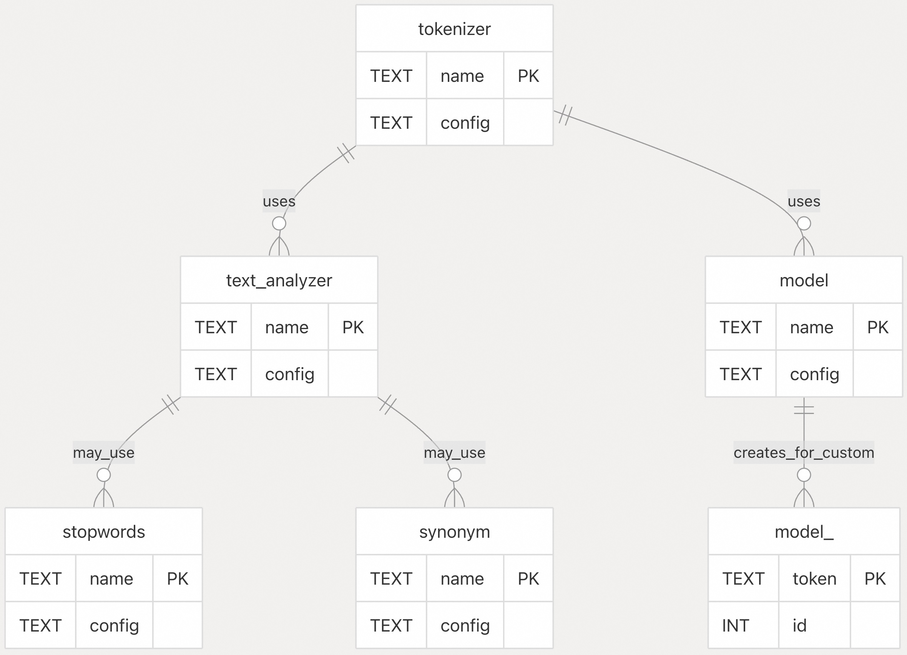
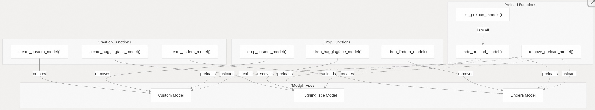
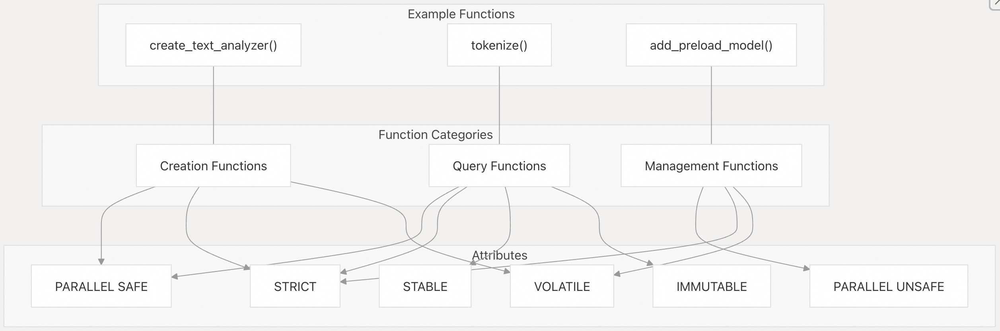

## pg_tokenizer 源码学习: 7 参考 (`Reference`)    
                  
### 作者                  
digoal                  
                  
### 日期                  
2025-11-20                  
                  
### 标签                  
pg\_tokenizer , 词化 , bert , 标记化 , Tokenization                  
                  
----                  
                  
## 背景                  
本文为 `pg_tokenizer` 扩展 (`extension`) 中所有 `SQL` 函数 (`functions`)、数据库架构 (`database schemas`) 和配置选项 (`configuration options`) 提供了全面参考 (`comprehensive reference`)。  
  
## 1\. 数据库架构 (`Database Schema`)  
  
`pg_tokenizer` 扩展 (`extension`) 使用以下表格创建了 `tokenizer_catalog` 架构 (`schema`)：  
  
| 表格 (Table) | 描述 (Description) | 主键 (Primary Key) |  
| :--- | :--- | :--- |  
| `text_analyzer` | 存储文本分析器 (`text analyzer`) 配置 | `name` (`TEXT`) |  
| `tokenizer` | 存储分词器 (`tokenizer`) 配置 | `name` (`TEXT`) |  
| `model` | 存储模型 (`model`) 配置 | `name` (`TEXT`) |  
| `stopwords` | 存储停用词 (`stopwords`) 配置 | `name` (`TEXT`) |  
| `synonym` | 存储同义词 (`synonym`) 配置 | `name` (`TEXT`) |  
  
此外，自定义模型分词器 (`custom model tokenizers`) 会创建命名模式为 `model_<name>` 的专用表格来存储它们的词汇表 (`vocabulary`)。  
  
  
  
来源: [`sql/install/pg_tokenizer--0.1.0.sql` 10-34](https://github.com/tensorchord/pg_tokenizer.rs/blob/d3f7a577/sql/install/pg_tokenizer--0.1.0.sql#L10-L34)  
  
## 2\. 文本分析器函数 (`Text Analyzer Functions`)  
  
文本分析器 (`Text analyzers`) 在分词 (`tokenization`) 之前通过过滤器 (`filters`) 处理原始文本 (`raw text`)。  
  
### 2.1 `create_text_analyzer`  
  
```sql  
CREATE FUNCTION create_text_analyzer(name TEXT, config TEXT) RETURNS void  
```  
  
创建具有指定名称和配置的新文本分析器 (`text analyzer`)。  
  
**参数 (`Parameters`):**  
  
  * `name`: 文本分析器的唯一标识符 (`Unique identifier`)  
  * `config`: `TOML` 格式的配置字符串 (`TOML-formatted configuration string`)  
  
**配置选项 (`Configuration Options`):**  
  
  * `char_filter`: 字符过滤器 (`character filters`) 列表  
  * `pre_tokenizer`: 预分词器 (`Pre-tokenizer`) 配置  
  * `token_filter`: 分词过滤器 (`token filters`) 列表  
  
来源: [`sql/install/pg_tokenizer--0.1.0.sql` 218-227](https://github.com/tensorchord/pg_tokenizer.rs/blob/d3f7a577/sql/install/pg_tokenizer--0.1.0.sql#L218-L227)  
  
### 2.2 `drop_text_analyzer`  
  
```sql  
CREATE FUNCTION drop_text_analyzer(name TEXT) RETURNS void  
```  
  
删除具有指定名称的文本分析器 (`text analyzer`)。  
  
**参数 (`Parameters`):**  
  
  * `name`: 要删除的文本分析器名称 (`text analyzer`)  
  
来源: [`sql/install/pg_tokenizer--0.1.0.sql` 297-305](https://github.com/tensorchord/pg_tokenizer.rs/blob/d3f7a577/sql/install/pg_tokenizer--0.1.0.sql#L297-L305)  
  
### 2.3 `apply_text_analyzer`  
  
```sql  
CREATE FUNCTION apply_text_analyzer(text TEXT, text_analyzer_name TEXT) RETURNS TEXT[]  
```  
  
将文本分析器 (`text analyzer`) 应用于输入文本 (`input text`)，返回一个分词 (`token`) 数组。  
  
**参数 (`Parameters`):**  
  
  * `text`: 要分析的输入文本 (`Input text`)  
  * `text_analyzer_name`: 要应用的文本分析器 (`text analyzer`) 名称  
  
来源: [`sql/install/pg_tokenizer--0.1.0.sql` 134-143](https://github.com/tensorchord/pg_tokenizer.rs/blob/d3f7a577/sql/install/pg_tokenizer--0.1.0.sql#L134-L143)  
  
### 2.4 `apply_text_analyzer_for_custom_model`  
  
```sql  
CREATE FUNCTION apply_text_analyzer_for_custom_model(text TEXT, text_analyzer_name TEXT) RETURNS TEXT[]  
```  
  
自定义模型 (`custom models`) 内部使用的特殊版本 (`Special version`)。  
  
**参数 (`Parameters`):**  
  
  * `text`: 要分析的输入文本 (`Input text`)  
  * `text_analyzer_name`: 要应用的文本分析器 (`text analyzer`) 名称  
  
来源: [`sql/install/pg_tokenizer--0.1.0.sql` 146-155](https://github.com/tensorchord/pg_tokenizer.rs/blob/d3f7a577/sql/install/pg_tokenizer--0.1.0.sql#L146-L155)  
  
## 3\. 模型函数 (`Model Functions`)  
  
模型 (`Models`) 将文本分词 (`text tokens`) 转换为数字 `ID`。  
  
  
  
### 3.1 自定义模型 (`Custom Models`)  
  
#### 3.1.1 `create_custom_model`  
  
```sql  
CREATE FUNCTION create_custom_model(name TEXT, config TEXT) RETURNS void  
```  
  
创建一个从数据库表格 (`database table`) 中学习分词 (`tokens`) 的自定义模型 (`custom model`)。  
  
**参数 (`Parameters`):**  
  
  * `name`: 模型的唯一标识符 (`Unique identifier`)  
  * `config`: `TOML` 格式的配置字符串 (`TOML-formatted configuration string`)  
  
**配置选项 (`Configuration Options`):**  
  
  * `table`: 源表格名称 (`Source table name`)  
  * `column`: 源文本列名称 (`Source text column name`)  
  * `text_analyzer`: 要使用的文本分析器 (`text analyzer`) 名称  
  
来源: [`sql/install/pg_tokenizer--0.1.0.sql` 158-167](https://github.com/tensorchord/pg_tokenizer.rs/blob/d3f7a577/sql/install/pg_tokenizer--0.1.0.sql#L158-L167)  
  
#### 3.1.2 `drop_custom_model`  
  
```sql  
CREATE FUNCTION drop_custom_model(name TEXT) RETURNS void  
```  
  
删除具有指定名称的自定义模型 (`custom model`)。  
  
**参数 (`Parameters`):**  
  
  * `name`: 要删除的自定义模型 (`custom model`) 名称  
  
来源: [`sql/install/pg_tokenizer--0.1.0.sql` 242-250](https://github.com/tensorchord/pg_tokenizer.rs/blob/d3f7a577/sql/install/pg_tokenizer--0.1.0.sql#L242-L250)  
  
#### 3.1.3 `custom_model_insert_trigger`  
  
```sql  
CREATE FUNCTION custom_model_insert_trigger() RETURNS TRIGGER  
```  
  
自定义模型 (`custom models`) 用于更新其词汇表 (`vocabulary`) 的内部触发器函数 (`Internal trigger function`)。  
  
来源: [`sql/install/pg_tokenizer--0.1.0.sql` 61-83](https://github.com/tensorchord/pg_tokenizer.rs/blob/d3f7a577/sql/install/pg_tokenizer--0.1.0.sql#L61-L83)  
  
#### 3.1.4 `custom_model_tokenizer_set_target_column_trigger`  
  
```sql  
CREATE FUNCTION custom_model_tokenizer_set_target_column_trigger() RETURNS TRIGGER  
```  
  
用于自动分词 (`tokenize`) 和更新目标列 (`target columns`) 的触发器函数 (`Trigger function`)。  
  
来源: [`sql/install/pg_tokenizer--0.1.0.sql` 351-357](https://github.com/tensorchord/pg_tokenizer.rs/blob/d3f7a577/sql/install/pg_tokenizer--0.1.0.sql#L351-L357)  
  
### 3.2 HuggingFace 模型 (`HuggingFace Models`)  
  
#### 3.2.1 `create_huggingface_model`  
  
```sql  
CREATE FUNCTION create_huggingface_model(name TEXT, config TEXT) RETURNS void  
```  
  
从现有的 `HuggingFace` 分词器 (`tokenizer`) 创建模型 (`model`)。  
  
**参数 (`Parameters`):**  
  
  * `name`: 模型的唯一标识符 (`Unique identifier`)  
  * `config`: `TOML` 格式的配置字符串 (`TOML-formatted configuration string`)  
  
**配置选项 (`Configuration Options`):**  
  
  * `path`: 模型文件 (`model files`) 的路径  
  * `type`: 模型类型 (`Model type`) (例如，"llama", "falcon" 等)  
  
来源: [`sql/install/pg_tokenizer--0.1.0.sql` 170-179](https://github.com/tensorchord/pg_tokenizer.rs/blob/d3f7a577/sql/install/pg_tokenizer--0.1.0.sql#L170-L179)  
  
#### 3.2.2 `drop_huggingface_model`  
  
```sql  
CREATE FUNCTION drop_huggingface_model(name TEXT) RETURNS void  
```  
  
删除具有指定名称的 `HuggingFace` 模型 (`model`)。  
  
**参数 (`Parameters`):**  
  
  * `name`: 要删除的模型 (`model`) 名称  
  
来源: [`sql/install/pg_tokenizer--0.1.0.sql` 252-261](https://github.com/tensorchord/pg_tokenizer.rs/blob/d3f7a577/sql/install/pg_tokenizer--0.1.0.sql#L252-L261)  
  
### 3.3 Lindera 模型 (`Lindera Models`)  
  
#### 3.3.1 `create_lindera_model`  
  
```sql  
CREATE FUNCTION create_lindera_model(name TEXT, config TEXT) RETURNS void  
```  
  
为日语文本分词 (`Japanese text tokenization`) 创建 `Lindera` 模型 (`model`)。  
  
**参数 (`Parameters`):**  
  
  * `name`: 模型的唯一标识符 (`Unique identifier`)  
  * `config`: `TOML` 格式的配置字符串 (`TOML-formatted configuration string`)  
  
**配置选项 (`Configuration Options`):**  
  
  * `dictionary_type`: 要使用的字典类型 (`Type of dictionary`)  
  
来源: [`sql/install/pg_tokenizer--0.1.0.sql` 182-191](https://github.com/tensorchord/pg_tokenizer.rs/blob/d3f7a577/sql/install/pg_tokenizer--0.1.0.sql#L182-L191)  
  
#### 3.3.2 `drop_lindera_model`  
  
```sql  
CREATE FUNCTION drop_lindera_model(name TEXT) RETURNS void  
```  
  
删除具有指定名称的 `Lindera` 模型 (`model`)。  
  
**参数 (`Parameters`):**  
  
  * `name`: 要删除的模型 (`model`) 名称  
  
来源: [`sql/install/pg_tokenizer--0.1.0.sql` 264-272](https://github.com/tensorchord/pg_tokenizer.rs/blob/d3f7a577/sql/install/pg_tokenizer--0.1.0.sql#L264-L272)  
  
### 3.4 预加载模型函数 (`Preload Model Functions`)  
  
#### 3.4.1 `add_preload_model`  
  
```sql  
CREATE FUNCTION add_preload_model(name TEXT) RETURNS void  
```  
  
将模型 (`model`) 添加到预加载列表 (`preload list`) 中，以加快加载速度。  
  
**参数 (`Parameters`):**  
  
  * `name`: 要预加载的模型 (`model`) 名称  
  
来源: [`sql/install/pg_tokenizer--0.1.0.sql` 123-131](https://github.com/tensorchord/pg_tokenizer.rs/blob/d3f7a577/sql/install/pg_tokenizer--0.1.0.sql#L123-L131)  
  
#### 3.4.2 `remove_preload_model`  
  
```sql  
CREATE FUNCTION remove_preload_model(name TEXT) RETURNS void  
```  
  
从预加载列表 (`preload list`) 中移除模型 (`model`)。  
  
**参数 (`Parameters`):**  
  
  * `name`: 要从预加载中移除的模型 (`model`) 名称  
  
来源: [`sql/install/pg_tokenizer--0.1.0.sql` 328-336](https://github.com/tensorchord/pg_tokenizer.rs/blob/d3f7a577/sql/install/pg_tokenizer--0.1.0.sql#L328-L336)  
  
#### 3.4.3 `list_preload_models`  
  
```sql  
CREATE FUNCTION list_preload_models() RETURNS TEXT[]  
```  
  
列出当前预加载列表 (`preload list`) 中的所有模型 (`models`)。  
  
来源: [`sql/install/pg_tokenizer--0.1.0.sql` 319-325](https://github.com/tensorchord/pg_tokenizer.rs/blob/d3f7a577/sql/install/pg_tokenizer--0.1.0.sql#L319-L325)  
  
## 4\. 分词器函数 (`Tokenizer Functions`)  
  
分词器 (`Tokenizers`) 结合文本分析器 (`text analyzers`) 和模型 (`models`) 将文本转换为分词 `ID` (`token IDs`)。  
  
### 4.1 `create_tokenizer`  
  
```sql  
CREATE FUNCTION create_tokenizer(name TEXT, config TEXT) RETURNS void  
```  
  
创建一个结合了文本分析器 (`text analyzer`) 和模型 (`model`) 的新分词器 (`tokenizer`)。  
  
**参数 (`Parameters`):**  
  
  * `name`: 分词器的唯一标识符 (`Unique identifier`)  
  * `config`: `TOML` 格式的配置字符串 (`TOML-formatted configuration string`)  
  
**配置选项 (`Configuration Options`):**  
  
  * `text_analyzer`: 要使用的文本分析器 (`text analyzer`) 名称  
  * `model`: 要使用的模型 (`model`) 名称  
  
来源: [`sql/install/pg_tokenizer--0.1.0.sql` 229-239](https://github.com/tensorchord/pg_tokenizer.rs/blob/d3f7a577/sql/install/pg_tokenizer--0.1.0.sql#L229-L239)  
  
### 4.2 `drop_tokenizer`  
  
```sql  
CREATE FUNCTION drop_tokenizer(name TEXT) RETURNS void  
```  
  
删除具有指定名称的分词器 (`tokenizer`)。  
  
**参数 (`Parameters`):**  
  
  * `name`: 要删除的分词器 (`tokenizer`) 名称  
  
来源: [`sql/install/pg_tokenizer--0.1.0.sql` 307-316](https://github.com/tensorchord/pg_tokenizer.rs/blob/d3f7a577/sql/install/pg_tokenizer--0.1.0.sql#L307-L316)  
  
### 4.3 `tokenize`  
  
```sql  
CREATE FUNCTION tokenize(text TEXT, tokenizer_name TEXT) RETURNS INT[]  
```  
  
使用指定的分词器 (`tokenizer`) 对输入文本 (`input text`) 进行分词 (`tokenizes`)，返回一个分词 `ID` 数组 (`array of token IDs`)。  
  
**参数 (`Parameters`):**  
  
  * `text`: 要分词的输入文本 (`Input text`)  
  * `tokenizer_name`: 要使用的分词器 (`tokenizer`) 名称  
  
来源: [`sql/install/pg_tokenizer--0.1.0.sql` 338-348](https://github.com/tensorchord/pg_tokenizer.rs/blob/d3f7a577/sql/install/pg_tokenizer--0.1.0.sql#L338-L348)  
  
## 5\. 分词过滤器函数 (`Token Filter Functions`)  
  
### 5.1 停用词 (`Stopwords`)  
  
#### 5.1.1 `create_stopwords`  
  
```sql  
CREATE FUNCTION create_stopwords(name TEXT, config TEXT) RETURNS void  
```  
  
创建一个停用词过滤器 (`stopwords filter`)，用于从分词 (`tokens`) 中移除指定的词语 (`words`)。  
  
**参数 (`Parameters`):**  
  
  * `name`: 停用词过滤器的唯一标识符 (`Unique identifier`)  
  * `config`: `TOML` 格式的配置字符串 (`TOML-formatted configuration string`)  
  
**配置选项 (`Configuration Options`):**  
  
  * `words`: 要跳过的词语 (`words to skip`) 数组  
  * `path`: 包含停用词 (`stopwords`) 文件 (每行一个词语) 的路径  
  
来源: [`sql/install/pg_tokenizer--0.1.0.sql` 194-203](https://github.com/tensorchord/pg_tokenizer.rs/blob/d3f7a577/sql/install/pg_tokenizer--0.1.0.sql#L194-L203)  
  
#### 5.1.2 `drop_stopwords`  
  
```sql  
CREATE FUNCTION drop_stopwords(name TEXT) RETURNS void  
```  
  
删除具有指定名称的停用词过滤器 (`stopwords filter`)。  
  
**参数 (`Parameters`):**  
  
  * `name`: 要删除的停用词过滤器 (`stopwords filter`) 名称  
  
来源: [`sql/install/pg_tokenizer--0.1.0.sql` 274-283](https://github.com/tensorchord/pg_tokenizer.rs/blob/d3f7a577/sql/install/pg_tokenizer--0.1.0.sql#L274-L283)  
  
### 5.2 同义词 (`Synonyms`)  
  
#### 5.2.1 `create_synonym`  
  
```sql  
CREATE FUNCTION create_synonym(name TEXT, config TEXT) RETURNS void  
```  
  
创建一个同义词过滤器 (`synonym filter`)，用于将分词 (`tokens`) 替换为其同义词 (`synonyms`)。  
  
**参数 (`Parameters`):**  
  
  * `name`: 同义词过滤器的唯一标识符 (`Unique identifier`)  
  * `config`: `TOML` 格式的配置字符串 (`TOML-formatted configuration string`)  
  
**配置选项 (`Configuration Options`):**  
  
  * `synonyms`: 同义词映射 (`synonym mappings`) 数组 (格式: ["word", "synonym"])  
  * `path`: 包含同义词映射的文件路径  
  
来源: [`sql/install/pg_tokenizer--0.1.0.sql` 206-215](https://github.com/tensorchord/pg_tokenizer.rs/blob/d3f7a577/sql/install/pg_tokenizer--0.1.0.sql#L206-L215)  
  
#### 5.2.2 `drop_synonym`  
  
```sql  
CREATE FUNCTION drop_synonym(name TEXT) RETURNS void  
```  
  
删除具有指定名称的同义词过滤器 (`synonym filter`)。  
  
**参数 (`Parameters`):**  
  
  * `name`: 要删除的同义词过滤器 (`synonym filter`) 名称  
  
来源: [`sql/install/pg_tokenizer--0.1.0.sql` 286-294](https://github.com/tensorchord/pg_tokenizer.rs/blob/d3f7a577/sql/install/pg_tokenizer--0.1.0.sql#L286-L294)  
  
## 6\. 高级函数 (`Advanced Functions`)  
  
### 6.1 `create_custom_model_tokenizer_and_trigger`  
  
```sql  
CREATE FUNCTION create_custom_model_tokenizer_and_trigger(  
    tokenizer_name TEXT,   
    model_name TEXT,   
    text_analyzer_name TEXT,   
    table_name TEXT,   
    source_column TEXT,   
    target_column TEXT  
) RETURNS VOID  
```  
  
在一个操作中创建自定义模型 (`custom model`)、分词器 (`tokenizer`) 和触发器 (`trigger`)。  
  
**参数 (`Parameters`):**  
  
  * `tokenizer_name`: 要创建的分词器 (`tokenizer`) 名称  
  * `model_name`: 要创建的自定义模型 (`custom model`) 名称  
  * `text_analyzer_name`: 要使用的文本分析器 (`text analyzer`) 名称  
  * `table_name`: 源表格名称 (`Source table name`)  
  * `source_column`: 源文本列名称 (`Source text column name`)  
  * `target_column`: 分词 `ID` 的目标列 (`Target column for token IDs`)  
  
此函数 (`function`):  
  
1.  创建一个自定义模型 (`custom model`)  
2.  使用模型和文本分析器创建分词器 (`tokenizer`)  
3.  使用分词值 (`tokenized values`) 更新现有表格行 (`table rows`)  
4.  设置触发器 (`trigger`) 以自动对新增或更新的行进行分词 (`tokenize`)  
  
来源: [`sql/install/pg_tokenizer--0.1.0.sql` 37-56](https://github.com/tensorchord/pg_tokenizer.rs/blob/d3f7a577/sql/install/pg_tokenizer--0.1.0.sql#L37-L56)  
  
## 7\. 函数属性参考 (`Function Attributes Reference`)  
  
`pg_tokenizer` 中的所有函数 (`functions`) 都具有特定的 `SQL` 属性 (`attributes`) 来决定它们的行为 (`behavior`)：  
  
| 属性 (Attribute) | 描述 (Description) |  
| :--- | :--- |  
| `IMMUTABLE` | 对于相同的输入 (`inputs`)，函数 (`function`) 总是返回相同的结果 (`result`) |  
| `STABLE` | 在同一事务 (`transaction`) 内，对于相同的输入 (`inputs`)，函数 (`function`) 返回相同的结果 (`result`) |  
| `VOLATILE` | 函数 (`function`) 在连续调用时可能返回不同的结果 (`results`) |  
| `STRICT` | 如果任何参数 (`argument`) 为 `NULL`，则函数 (`function`) 返回 `NULL` |  
| `PARALLEL SAFE` | 函数 (`function`) 可以在并行模式 (`parallel mode`) 下执行 |  
| `PARALLEL UNSAFE` | 函数 (`function`) 不能在并行模式 (`parallel mode`) 下使用 |  
  
  
  
来源: [`sql/install/pg_tokenizer--0.1.0.sql` 134-348](https://github.com/tensorchord/pg_tokenizer.rs/blob/d3f7a577/sql/install/pg_tokenizer--0.1.0.sql#L134-L348)  
  
## 8\. 打包和部署 (`Packaging and Deployment`)  
  
`pg_tokenizer` 扩展 (`extension`) 有多种格式，适用于不同的 `PostgreSQL` 版本：  
  
| 格式 (Format) | 描述 (Description) | 文件命名约定 (File Naming Convention) |  
| :--- | :--- | :--- |  
| `.deb` | Debian/Ubuntu 包 (`package`) | `postgresql-<PG_VERSION>-pg-tokenizer_<SEMVER>-1_<PLATFORM>.deb` |  
| `.zip` | 通用安装包 (`Generic installation package`) | `postgresql-<PG_VERSION>-pg-tokenizer_<SEMVER>_<ARCH>-linux-gnu.zip` |  
| Docker | `Docker` 镜像 (`image`) | `tensorchord/pg_tokenizer-binary:pg<PG_VERSION>-v<SEMVER>` |  
  
其中:  
  
  * `<PG_VERSION>`: `PostgreSQL` 版本 (14, 15, 16, 17)  
  * `<SEMVER>`: `pg_tokenizer` 的语义版本 (`Semantic version`)  
  * `<PLATFORM>`: 平台 (`Platform`) (`amd64`, `arm64`)  
  * `<ARCH>`: 架构 (`Architecture`) (`x86_64`, `aarch64`)  
  
来源: [`release.yml` 38-132](https://github.com/tensorchord/pg_tokenizer.rs/blob/d3f7a577/.github/workflows/release.yml#L38-L132) [`tools/package.sh` 1-46](https://github.com/tensorchord/pg_tokenizer.rs/blob/d3f7a577/tools/package.sh#L1-L46) [`docker/binary.Dockerfile` 1-8](https://github.com/tensorchord/pg_tokenizer.rs/blob/d3f7a577/docker/binary.Dockerfile#L1-L8)  
  
-----  
  
# 附录1: 自动化功能及其对数据库性能的影响  
作为一个希望高效使用此 `PostgreSQL` 扩展 (`extension`) 的用户，我的核心问题将围绕最复杂的自动化功能及其对数据库性能的影响：  
  
基于上述内容中提到的**自定义模型 (`Custom Models`)**及其**自动触发工作流** (`custom_model_insert_trigger`, `custom_model_tokenizer_set_target_column_trigger`)，从用户的角度来看，该自动流程（特别是通过 `create_custom_model_tokenizer_and_trigger` 函数实现）对**数据库的写入性能 (`Write Performance`)** 和**数据维护**构成哪些挑战？用户应该如何平衡**词汇表学习 (`Vocabulary Learning`)** 的准确性需求与**触发器 (`Trigger`)** 带来的运行时开销，以确保在大数据量或高并发写入场景下的系统稳定性和效率？  
  
**该问题的价值点在于** : 它触及了扩展中最复杂、最集成的功能（自定义模型、分词、触发器），直接关注了生产环境中用户最关心的性能瓶颈和运维难题。  
  
这个涉及 `pg_tokenizer` 扩展中**自定义模型**的自动化触发器工作流对数据库写入性能和维护的影响。    
  
## 核心性能挑战  
  
### 1. 双重触发器开销  
  
`create_custom_model_tokenizer_and_trigger` 函数会创建**两个触发器**,每次写入都会执行:    
  
**词汇表更新触发器** (`custom_model_insert_trigger`):  
- 在每次 `INSERT` 或 `UPDATE` 时触发    
- 执行文本分析器提取 token   
- 查询词汇表检查新 token 是否存在   
- 插入新 token (使用 `ON CONFLICT DO NOTHING`)   
  
**嵌入自动填充触发器** (`custom_model_tokenizer_set_target_column_trigger`):  
- 同样在 `BEFORE INSERT OR UPDATE` 时触发     
- 调用 `tokenize()` 函数生成 token ID 数组    
- 可能需要类型转换    
  
### 2. 文本分析器处理开销  
  
每次写入都会执行完整的文本分析流程:    
- 字符过滤器 (如 `to_lowercase`, `unicode_normalization`)   
- 预分词器 (如 `unicode_segmentation`)   
- Token 过滤器 (如 `stopwords`, `stemmer`)   
  
### 3. 词汇表查询和插入  
  
词汇表维护涉及多次数据库操作:    
- `unnest()` 展开 token 数组   
- `NOT EXISTS` 子查询检查每个 token   
- `INSERT ... ON CONFLICT` 处理并发冲突   
  
在高并发场景下,`ON CONFLICT` 可能导致锁竞争。   
  
### 4. Token 长度限制处理  
  
超过 2600 字符的 token 会被自动分割:     
这会增加额外的处理开销和警告日志。   
  
## 性能优化策略  
  
### 1. 分离词汇表学习和嵌入生成  
  
使用**无触发器模式**可以更灵活地控制性能:    
  
```sql  
-- 仅创建自定义模型(只有词汇表更新触发器)  
SELECT create_custom_model('model1', $$  
table = 'documents'  
column = 'passage'  
text_analyzer = 'text_analyzer1'  
$$);  
  
-- 批量更新嵌入,避免逐行触发器开销  
UPDATE documents SET embedding = tokenize(passage, 'tokenizer1');  
```  
  
这种方式的优势:   
- 写入时只执行一个触发器(词汇表更新)   
- 可以在低峰期批量生成嵌入   
- 减少事务持续时间   
  
### 2. 简化文本分析器配置  
  
根据实际需求精简 token 过滤器:   
- 移除不必要的 stemmer 或 stopwords 过滤器   
- 减少字符过滤器数量   
- 考虑使用预训练模型而非自定义模型   
  
### 3. 批量插入优化  
  
使用 `COPY` 或批量 `INSERT` 可以减少触发器调用次数:   
```sql  
-- 临时禁用触发器进行批量导入  
ALTER TABLE documents DISABLE TRIGGER ALL;  
COPY documents FROM 'data.csv';  
ALTER TABLE documents ENABLE TRIGGER ALL;  
-- 然后批量更新嵌入  
UPDATE documents SET embedding = tokenize(passage, 'tokenizer1');  
```  
  
### 4. 模型预加载  
  
使用 `add_preload_model` 避免首次查询延迟:    
```sql  
SELECT add_preload_model('model1');  
-- 重启 PostgreSQL 生效  
```  
  
### 5. 监控和调优  
  
关键监控指标:   
- 触发器执行时间 (通过 `pg_stat_statements`)   
- 词汇表大小 (`SELECT count(*) FROM tokenizer_catalog."model_model1"`)   
- 锁等待情况 (`pg_locks`)   
  
## 平衡建议  
  
**高并发写入场景**:   
- 使用无触发器模式   
- 异步批量生成嵌入   
- 考虑使用消息队列解耦   
  
**词汇表准确性优先**:   
- 保留词汇表更新触发器   
- 手动或定期批量更新嵌入   
- 接受适度的写入延迟   
  
**大数据量场景**:   
- 分区表减少锁竞争   
- 定期清理低频 token   
- 监控词汇表增长速度   
  
## Notes  
  
触发器在 `BEFORE` 阶段执行,意味着它们会阻塞写入事务直到完成。 在高吞吐量场景下, 这可能成为瓶颈。 考虑使用 PostgreSQL 的 `AFTER` 触发器配合异步处理, 或完全移除自动触发器, 改用应用层控制。   
  
词汇表的 `UNIQUE` 约束和 `ON CONFLICT` 策略在高并发下可能导致序列化失败,需要应用层实现重试逻辑。   
  
-----  
  
# 附录2: `custom model`里的原始token和对应的ID存储在哪里?  
  
Custom model的原token和对应的ID存储在PostgreSQL数据库的专用表中。    
  
具体来说:  
  
## 存储位置  
  
每个custom model会在`tokenizer_catalog` schema下创建一个名为`model_{name}`的表,其中`{name}`是模型的名称。    
  
## 表结构  
  
该表包含两列:  
- `id`: 自动递增的整数,代表token的ID  
- `token`: 文本类型,存储原始token,具有唯一约束    
  
## Token到ID的映射查询  
  
当需要将token转换为ID时,`CustomModel`会查询这个表:  
  
- 单个token查询使用`apply()`方法    
- 批量token查询使用`apply_batch()`方法    
  
两种方法都通过SQL查询`tokenizer_catalog."model_{name}"`表来获取token对应的ID。     
  
## 词汇表更新  
  
新的token通过数据库触发器自动添加到词汇表中。当源表有INSERT或UPDATE操作时, `custom_model_insert_trigger` 会提取新token并插入到 `model_{name}` 表中。    
  
## Notes  
  
- Custom model的配置信息(如源表名、列名、text analyzer名称)存储在`tokenizer_catalog.model`表的`config`列中    
- Token的最大长度限制为2600字符    
- 与预训练模型不同, custom model的词汇表是动态增长的, 会随着新数据的插入而自动扩展  
  
-----  
  
# 附录3: `create_custom_model_tokenizer_and_trigger`里的`table_name`,`source_column`,`target_column`对应的是不是用于训练生成token的`表`、`原始字符串`、`被analyzerc处理过的tokens` ?   
  
您的理解基本正确, 但有一个重要的区别。让我详细解释 `create_custom_model_tokenizer_and_trigger` 函数的参数含义:    
  
## 参数含义  
  
- **`table_name`**: 用于训练生成token的表    
- **`source_column`**: 原始字符串列(未经处理的文本)    
- **`target_column`**: 存储tokenize后的结果(token ID数组), **不是** analyzer处理过的tokens    
  
## 关键区别  
  
您提到的"被analyzer处理过的tokens"实际上是**中间步骤**, 不会直接存储在 `target_column` 中。完整的处理流程是:  
  
1. **Text Analyzer处理**: `source_column` 的文本通过text analyzer处理,生成token字符串数组    
2. **Token到ID映射**: 这些token字符串被映射到 `model_{name}` 表中的ID    
3. **存储结果**: 最终的**token ID数组**存储在 `target_column` 中    
  
## 实际示例  
  
在测试用例中可以看到:    
  
- `table_name`: `'documents'`  
- `source_column`: `'passage'` (TEXT类型, 原始文本)  
- `target_column`: `'embedding'` (INT[]类型, 存储token ID数组)    
  
当插入数据时, 触发器会自动调用 `tokenize()` 函数将 `passage` 转换为token ID数组并存储到 `embedding` 列中。    
  
## Notes  
  
- Text analyzer处理后的token字符串会被插入到 `tokenizer_catalog."model_{name}"` 表中用于建立词汇表    
- `target_column` 的类型通常是 `INT[]` 或可以从 `INT[]` 转换的类型(如 `bm25vector`)    
  
  
-----  
  
# 附录4: target_column里的值来自 `tokenizer_catalog."model_{name}"` 吗?  
  
不是直接来自, 而是**间接来自**。    
  
## 数据流程  
  
`target_column` 中的值是通过以下流程生成的:  
  
1. **触发器调用 `tokenize()` 函数**: 当数据插入或更新时, `custom_model_tokenizer_set_target_column_trigger` 触发器会调用 `tokenize()` 函数处理 `source_column` 的文本    
  
2. **`tokenize()` 内部查询词汇表**: `tokenize()` 函数会使用 `CustomModel::apply_batch()` 方法, 该方法查询 `tokenizer_catalog."model_{name}"` 表来获取token对应的ID    
  
3. **返回ID数组**: 查询结果(token ID数组)被返回并存储到 `target_column` 中    
  
## 关键代码  
  
触发器的核心逻辑在第266行, 它调用 `tokenize()` 函数.    
  
而 `tokenize()` 函数内部会通过 `CustomModel::apply_batch()` 查询词汇表.    
  
## 总结  
  
所以 `target_column` 的值**来源于** `tokenizer_catalog."model_{name}"` 表,但不是直接复制,而是通过 `tokenize()` 函数查询该表后得到的token ID数组。  
  
## Notes  
  
- `target_column` 存储的是整数数组(INT[]),而 `tokenizer_catalog."model_{name}"` 表存储的是token文本和对应的ID映射关系    
- 如果 `target_column` 不是 INT[] 类型,触发器会自动进行类型转换(例如转换为 `bm25vector`)    
  
  
-----  
  
# 附录5: 什么时候会用到target_column? 感觉存储这个有点冗余  
  
  
`target_column` 主要用于**自动维护和快速查询**场景,虽然看起来冗余, 但有实际的性能和便利性优势。    
  
## 主要使用场景  
  
### 1. 向量搜索和BM25排序  
  
`target_column` 存储的token ID数组可以直接用于相似度搜索和BM25排序算法。    
  
例如,它可以被转换为 `bm25vector` 类型,用于全文搜索排序:    
  
```sql  
CREATE TABLE documents (  
    id SERIAL PRIMARY KEY,  
    passage TEXT,  
    embedding INT[]  -- 可以转换为 bm25vector  
);  
```  
  
### 2. 避免重复计算  
  
如果没有 `target_column`,每次查询都需要:    
  
1. 对 `source_column` 应用 text analyzer  
2. 查询 `tokenizer_catalog."model_{name}"` 表获取ID  
3. 返回结果  
  
这个过程在大规模数据查询时会非常耗时。预先存储在 `target_column` 中可以直接使用,避免实时计算。  
  
### 3. 触发器自动维护  
  
通过 `custom_model_tokenizer_set_target_column_trigger`,当 `source_column` 更新时,`target_column` 会自动同步更新,保持数据一致性。    
  
这在以下场景特别有用:   
- 需要频繁进行相似度搜索的应用  
- 需要实时BM25排序的搜索引擎  
- 需要对embedding进行索引优化的场景  
  
### 4. 实际应用示例  
  
在中文文档搜索的测试用例中,`embedding` 列被用于存储分词后的ID数组,方便后续的搜索操作:    
  
## 性能权衡  
  
虽然 `target_column` 占用额外存储空间,但它提供了:   
  
- **查询性能提升**: 避免实时tokenization的计算开销  
- **索引支持**: 可以在 `target_column` 上建立索引(如GIN索引)加速搜索  
- **简化应用逻辑**: 应用层不需要手动调用 `tokenize()` 函数  
  
## Notes  
  
- 如果你的应用不需要频繁查询token ID数组,可以选择不使用 `create_custom_model_tokenizer_and_trigger`,而是只创建custom model,在需要时手动调用 `tokenize()` 函数    
- `target_column` 的设计类似于PostgreSQL的 `tsvector` 列,都是为了优化全文搜索性能而预先计算和存储的    
  
  
-----  
  
# 附录6: 可以这么理解吗?不存在一份专门用来生成字典的表, 而是直接使用实际业务数据既能生成字典, 也能当业务使用, 还能用来统计BM25  
  
  
是的, 您的理解完全正确!    
  
Custom model的设计理念就是**直接从业务表构建词汇表**,实现了"一表多用":   
  
## 工作原理  
  
1. **业务表即训练数据源**: 您指定的 `table_name` 和 `source_column` 就是实际的业务数据表,不需要额外准备训练数据    
  
2. **自动提取词汇**: 创建custom model时,系统会扫描业务表中的现有数据,通过text analyzer处理后提取所有token,构建 `tokenizer_catalog."model_{name}"` 词汇表    
  
3. **动态增长**: 当业务表插入新数据时,触发器自动提取新token并更新词汇表,无需人工干预    
  
## 实际应用流程  
  
以文档搜索为例:    
  
```sql  
-- 业务表  
CREATE TABLE documents (  
    id SERIAL PRIMARY KEY,  
    passage TEXT,        -- 业务数据  
    embedding INT[]      -- BM25向量  
);  
```  
  
- `passage` 列: 存储实际业务文本  
- `embedding` 列: 自动生成的token ID数组,用于BM25搜索  
- `tokenizer_catalog."model_model1"` 表: 从 `passage` 列自动构建的词汇表    
  
## 优势  
  
这种设计避免了传统机器学习中"训练数据"和"业务数据"分离的问题:   
  
- **无需数据准备**: 不用单独准备训练集  
- **实时更新**: 词汇表随业务数据自动演进  
- **存储高效**: 只维护一份业务数据,词汇表只是索引  
- **即查即用**: `embedding` 列可直接用于BM25排序和相似度搜索    
  
## Notes  
  
- 词汇表 `tokenizer_catalog."model_{name}"` 只存储唯一token和对应ID,不会复制业务数据    
- 如果不需要 `target_column` 自动维护, 可以只用 `create_custom_model()` 创建词汇表,手动调用 `tokenize()` 函数    
    
    
#### [PolarDB 学习图谱](https://www.aliyun.com/database/openpolardb/activity "8642f60e04ed0c814bf9cb9677976bd4")
  
  
#### [PostgreSQL 解决方案集合](../201706/20170601_02.md "40cff096e9ed7122c512b35d8561d9c8")
  
  
#### [德哥 / digoal's Github - 公益是一辈子的事.](https://github.com/digoal/blog/blob/master/README.md "22709685feb7cab07d30f30387f0a9ae")
  
  
#### [About 德哥](https://github.com/digoal/blog/blob/master/me/readme.md "a37735981e7704886ffd590565582dd0")
  
  

  
