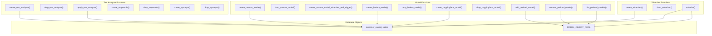
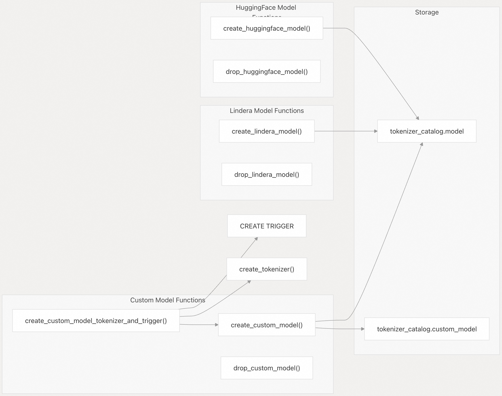
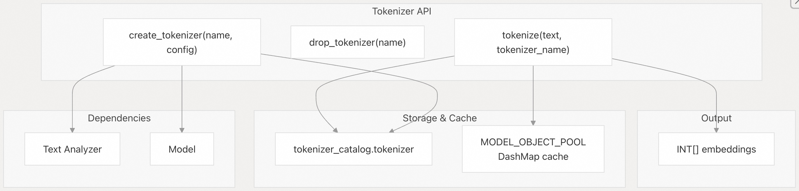
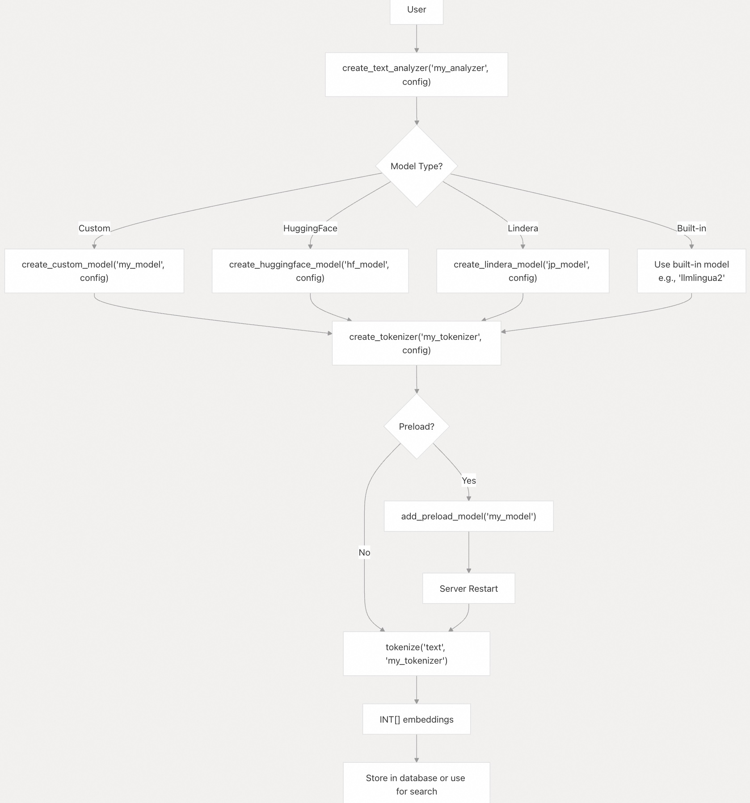

## pg_tokenizer 源码学习: 7.1 SQL 函数参考 (SQL Function Reference)    
                    
### 作者                    
digoal                    
                    
### 日期                    
2025-11-20                    
                    
### 标签                    
pg\_tokenizer , 词化 , bert , 标记化 , Tokenization                    
                    
----                    
                    
## 背景                    
本文介绍了 `pg_tokenizer` 扩展 (pg\_tokenizer extension) 所暴露的所有 SQL 函数 (SQL functions) 的全面参考。这些函数可以直接从 PostgreSQL 启用文本处理管道 (text processing pipeline) 配置、模型管理 (model management) 和分词/标记化 (tokenization) 操作。  
  
所有函数都位于 `tokenizer_catalog` 模式 (schema) 中。  
  
## 函数类别 (Function Categories)  
  
该扩展提供了三大类 SQL 函数：  
  

  
来源: [`docs/00-reference.md` 1-48](https://github.com/tensorchord/pg_tokenizer.rs/blob/d3f7a577/docs/00-reference.md#L1-L48)  
  
## 文本分析器函数 (Text Analyzer Functions)  
  
文本分析器 (Text Analyzer) 定义了将原始文本转换为词元 (tokens) 的处理管道 (processing pipelines)。它们由字符过滤器 (character filters)、预分词器 (pre-tokenizers) 和词元过滤器 (token filters) 组成。有关文本分析器的更多信息，请参阅 文本分析器 (Text Analyzers) 章节。  
  
### create\_text\_analyzer  
  
```  
tokenizer_catalog.create_text_analyzer(  
    name TEXT,   
    config TEXT  
) RETURNS VOID  
```  
  
使用指定的名称和 **TOML** 配置 (TOML configuration) 创建一个新的文本分析器 (text analyzer)。  
  
**参数 (Parameters)：**  
  
  * `name`：文本分析器的唯一标识符 (Unique identifier)  
  * `config`：定义管道配置（字符过滤器 (character filters)、预分词器 (pre-tokenizer)、词元过滤器 (token filters)）的 **TOML** 字符串 (string)  
  
**示例 (Example)：**  
  
```  
SELECT tokenizer_catalog.create_text_analyzer('my_analyzer', $$  
pre_tokenizer = "unicode_segmentation"  
[[character_filters]]  
to_lowercase = {}  
[[token_filters]]  
stopwords = "nltk_english"  
$$);  
```  
  
**相关配置 (Related Configuration)：** 有关字符过滤器 (character filters)、预分词器 (pre-tokenizers) 和词元过滤器 (token filters) 的完整 **TOML** 语法 (syntax)，请参阅 配置参考 (Configuration Reference) 章节。  
  
来源: [`docs/00-reference.md` 7](https://github.com/tensorchord/pg_tokenizer.rs/blob/d3f7a577/docs/00-reference.md#L7-L7)  
  
### drop\_text\_analyzer  
  
```  
tokenizer_catalog.drop_text_analyzer(  
    name TEXT  
) RETURNS VOID  
```  
  
从系统中移除一个文本分析器 (text analyzer)。  
  
**参数 (Parameters)：**  
  
  * `name`：要删除的文本分析器名称  
  
**注意 (Note)：** 删除被分词器 (tokenizer) 或自定义模型 (custom model) 引用的文本分析器，在使用这些对象时将导致错误。  
  
来源: [`docs/00-reference.md` 8](https://github.com/tensorchord/pg_tokenizer.rs/blob/d3f7a577/docs/00-reference.md#L8-L8)  
  
### apply\_text\_analyzer  
```  
tokenizer_catalog.apply_text_analyzer(  
    text TEXT,   
    text_analyzer_name TEXT  
) RETURNS TEXT[]  
```  
  
将文本分析器应用于输入文本 (input text)，以文本数组 (**text array**) 的形式返回结果词元 (tokens)。  
  
**参数 (Parameters)：**  
  
  * `text`：要处理的输入文本  
  * `text_analyzer_name`：要应用的文本分析器名称  
  
**返回值 (Returns)：** 经过完整管道处理后的文本词元数组  
  
**示例 (Example)：**  
  
```  
SELECT tokenizer_catalog.apply_text_analyzer(  
    'The quick brown fox',   
    'my_analyzer'  
);  
-- Returns: {quick,brown,fox}  (assuming stopwords filter)  
```  
  
**用例 (Use Case)：** 此函数有助于在分词器 (tokenizers) 中使用分析器配置 (analyzer configurations) 之前，测试其配置并了解管道行为 (pipeline behavior)。  
  
来源: [`docs/00-reference.md` 9](https://github.com/tensorchord/pg_tokenizer.rs/blob/d3f7a577/docs/00-reference.md#L9-L9) [`tests/sqllogictest/ngram.slt` 11-14](https://github.com/tensorchord/pg_tokenizer.rs/blob/d3f7a577/tests/sqllogictest/ngram.slt#L11-L14)  
  
### create\_stopwords  
  
```  
tokenizer_catalog.create_stopwords(  
    name TEXT,   
    config TEXT  
) RETURNS VOID  
```  
  
创建用于词元过滤器 (token filters) 的自定义停用词字典 (stopwords dictionary)。  
  
**参数 (Parameters)：**  
  
  * `name`：停用词字典的唯一标识符  
  * `config`：指定停用词项的 **TOML** 配置  
  
**用法 (Usage)：** 创建后，在词元过滤器配置中按名称引用该停用词字典。  
  
**内置停用词 (Built-in Stopwords)：** 系统包括 `lucene_english`、`nltk_english` 和 `iso_english` 字典。  
  
来源: [`docs/00-reference.md` 13](https://github.com/tensorchord/pg_tokenizer.rs/blob/d3f7a577/docs/00-reference.md#L13-L13)  
  
### drop\_stopwords  
  
```  
tokenizer_catalog.drop_stopwords(  
    name TEXT  
) RETURNS VOID  
```  
  
移除一个自定义停用词字典 (stopwords dictionary)。  
  
**参数 (Parameters)：**  
  
  * `name`：要删除的停用词字典名称  
  
来源: [`docs/00-reference.md` 14](https://github.com/tensorchord/pg_tokenizer.rs/blob/d3f7a577/docs/00-reference.md#L14-L14)  
  
### create\_synonym  
  
```  
tokenizer_catalog.create_synonym(  
    name TEXT,   
    config TEXT  
) RETURNS VOID  
```  
  
创建用于词元替换 (token replacement) 和扩展 (expansion) 的同义词字典 (synonym dictionary)。  
  
**参数 (Parameters)：**  
  
  * `name`：同义词字典的唯一标识符  
  * `config`：定义同义词映射 (synonym mappings) 的 **TOML** 配置  
  
**用法 (Usage)：** 在词元过滤器配置中按名称引用该同义词字典，以启用同义词处理。  
  
来源: [`docs/00-reference.md` 18](https://github.com/tensorchord/pg_tokenizer.rs/blob/d3f7a577/docs/00-reference.md#L18-L18)  
  
### drop\_synonym  
  
```  
tokenizer_catalog.drop_synonym(  
    name TEXT  
) RETURNS VOID  
```  
  
移除一个同义词字典 (synonym dictionary)。  
  
**参数 (Parameters)：**  
  
  * `name`：要删除的同义词字典名称  
  
来源: [`docs/00-reference.md` 19](https://github.com/tensorchord/pg_tokenizer.rs/blob/d3f7a577/docs/00-reference.md#L19-L19)  
  
## 模型管理函数 (Model Management Functions)  
  
模型 (Models) 提供了将词元 (tokens) 转换为嵌入 (embeddings) 的词汇表 (vocabulary) 和编码逻辑 (encoding logic)。该扩展支持四种模型类型：自定义 (custom)、**Lindera**、**HuggingFace** 和内置 (built-in) 模型。有关模型的全面信息，请参阅 模型 (Models) 章节。  
  
  
  
来源: [`docs/00-reference.md` 22-41](https://github.com/tensorchord/pg_tokenizer.rs/blob/d3f7a577/docs/00-reference.md#L22-L41)  
  
### create\_custom\_model  
  
```  
tokenizer_catalog.create_custom_model(  
    name TEXT,   
    config TEXT  
) RETURNS VOID  
```  
  
创建一个自定义模型 (custom model)，该模型从存储在数据库表中的语料库 (corpus) 构建其词汇表 (vocabulary)。  
  
**参数 (Parameters)：**  
  
  * `name`：自定义模型的唯一标识符  
  * `config`：指定表 (table)、列 (column) 和文本分析器 (text analyzer) 的 **TOML** 配置  
  
**配置键 (Configuration Keys)：**  
  
  * `table`：包含语料库的源表  
  * `column`：从中提取词汇表的文本列  
  * `text_analyzer`：用于分词 (tokenization) 的文本分析器名称  
  
**示例 (Example)：**  
  
```  
SELECT tokenizer_catalog.create_custom_model('my_corpus_model', $$  
table = "documents"  
column = "content"  
text_analyzer = "my_analyzer"  
$$);  
```  
  
**行为 (Behavior)：** 模型扫描指定的表/列，应用文本分析器，并从唯一词元 (unique tokens) 中构建词汇表。有关自定义模型的详细信息，请参阅 自定义模型 (Custom Models) 章节。  
  
来源: [`docs/00-reference.md` 23](https://github.com/tensorchord/pg_tokenizer.rs/blob/d3f7a577/docs/00-reference.md#L23-L23) [`docs/00-reference.md` 126-131](https://github.com/tensorchord/pg_tokenizer.rs/blob/d3f7a577/docs/00-reference.md#L126-L131)  
  
### drop\_custom\_model  
  
```  
tokenizer_catalog.drop_custom_model(  
    name TEXT  
) RETURNS VOID  
```  
  
从系统中移除一个自定义模型 (custom model)。  
  
**参数 (Parameters)：**  
  
  * `name`：要删除的自定义模型名称  
  
来源: [`docs/00-reference.md` 25](https://github.com/tensorchord/pg_tokenizer.rs/blob/d3f7a577/docs/00-reference.md#L25-L25)  
  
### create\_custom\_model\_tokenizer\_and\_trigger  
  
```  
tokenizer_catalog.create_custom_model_tokenizer_and_trigger(  
    tokenizer_name TEXT,  
    model_name TEXT,  
    text_analyzer_name TEXT,  
    table_name TEXT,  
    source_column TEXT,  
    target_column TEXT  
) RETURNS VOID  
```  
  
一个便利函数 (Convenience function)，在一个操作中创建自定义模型 (custom model)、分词器 (tokenizer) 和数据库触发器 (database trigger)。这自动化了维护同步嵌入 (synchronized embeddings) 的设置。  
  
**参数 (Parameters)：**  
  
  * `tokenizer_name`：新分词器的名称  
  * `model_name`：新自定义模型的名称  
  * `text_analyzer_name`：要使用的现有文本分析器 (text analyzer)  
  * `table_name`：要监控更改的表  
  * `source_column`：包含源数据的文本列  
  * `target_column`：用于存储嵌入 (embeddings) 的整数数组列 (Integer array column)  
  
**行为 (Behavior)：**  
  
1.  从 `table_name.source_column` 中的语料库 (corpus) 创建一个自定义模型  
2.  使用自定义模型和文本分析器创建一个分词器  
3.  添加一个触发器 (trigger)，以便在 `source_column` 更改时自动用嵌入更新 `target_column`  
  
**示例 (Example)：**  
  
```  
SELECT tokenizer_catalog.create_custom_model_tokenizer_and_trigger(  
    'doc_tokenizer',  
    'doc_model',  
    'my_analyzer',  
    'documents',  
    'content',  
    'embedding'  
);  
```  
  
有关自动嵌入生成 (automatic embedding generation) 的更多信息，请参阅 使用触发器自动生成嵌入 (Automatic Embeddings with Triggers) 章节。  
  
来源: [`docs/00-reference.md` 24](https://github.com/tensorchord/pg_tokenizer.rs/blob/d3f7a577/docs/00-reference.md#L24-L24)  
  
### create\_lindera\_model  
  
```  
tokenizer_catalog.create_lindera_model(  
    name TEXT,   
    config TEXT  
) RETURNS VOID  
```  
  
使用 **ipadic** 字典创建一个用于日语文本处理 (Japanese text processing) 的 **Lindera** 模型 (**Lindera model**)。  
  
**参数 (Parameters)：**  
  
  * `name`：**Lindera** 模型的唯一标识符  
  * `config`：与 **Lindera** 分词器格式匹配的 **TOML** 配置  
  
**配置 (Configuration)：** 遵循 **Lindera** 库语法 (syntax)。有关使用详情，请参阅 日语文本处理 (Japanese Text Processing) 章节。  
  
**示例 (Example)：**  
  
```  
SELECT tokenizer_catalog.create_lindera_model('japanese_model', $$  
dictionary = { kind = "ipadic" }  
mode = "normal"  
$$);  
```  
  
来源: [`docs/00-reference.md` 35-36](https://github.com/tensorchord/pg_tokenizer.rs/blob/d3f7a577/docs/00-reference.md#L35-L36) [`docs/00-reference.md` 133-135](https://github.com/tensorchord/pg_tokenizer.rs/blob/d3f7a577/docs/00-reference.md#L133-L135)  
  
### drop\_lindera\_model  
  
```  
tokenizer_catalog.drop_lindera_model(  
    name TEXT  
) RETURNS VOID  
```  
  
移除一个 **Lindera** 模型 (**Lindera model**)。  
  
**参数 (Parameters)：**  
  
  * `name`：要删除的 **Lindera** 模型名称  
  
来源: [`docs/00-reference.md` 36](https://github.com/tensorchord/pg_tokenizer.rs/blob/d3f7a577/docs/00-reference.md#L36-L36)  
  
### create\_huggingface\_model  
  
```  
tokenizer_catalog.create_huggingface_model(  
    name TEXT,   
    config TEXT  
) RETURNS VOID  
```  
  
从 `tokenizer.json` 文件创建一个 **HuggingFace** 模型 (**HuggingFace model**)。  
  
**参数 (Parameters)：**  
  
  * `name`：**HuggingFace** 模型的唯一标识符  
  * `config`：指定 `tokenizer.json` 路径或 **HuggingFace** 模型标识符的 **TOML** 配置  
  
**示例 (Example)：**  
  
```  
SELECT tokenizer_catalog.create_huggingface_model('bert_model', $$  
path = "/path/to/tokenizer.json"  
$$);  
```  
  
**注意 (Note)：** `tokenizer.json` 文件必须可供 PostgreSQL 服务器进程访问 (accessible)。  
  
来源: [`docs/00-reference.md` 40-41](https://github.com/tensorchord/pg_tokenizer.rs/blob/d3f7a577/docs/00-reference.md#L40-L41)  
  
### drop\_huggingface\_model  
  
```  
tokenizer_catalog.drop_huggingface_model(  
    name TEXT  
) RETURNS VOID  
```  
  
移除一个 **HuggingFace** 模型 (**HuggingFace model**)。  
  
**参数 (Parameters)：**  
  
  * `name`：要删除的 **HuggingFace** 模型名称  
  
来源: [`docs/00-reference.md` 41](https://github.com/tensorchord/pg_tokenizer.rs/blob/d3f7a577/docs/00-reference.md#L41-L41)  
  
## 预加载函数 (Preloading Functions)  
  
预加载函数 (Preloading functions) 控制哪些模型在服务器启动时加载到内存中，从而提高常用模型的性能。有关更多详细信息，请参阅 模型预加载 (Model Preloading) 章节。  
  
### add\_preload\_model  
  
```  
tokenizer_catalog.add_preload_model(  
    name TEXT  
) RETURNS VOID  
```  
  
将一个模型添加到预加载列表 (preload list) 中。该模型将在下次 PostgreSQL 服务器重启时加载到 `MODEL_OBJECT_POOL` 中。  
  
**参数 (Parameters)：**  
  
  * `name`：要预加载的现有模型的名称  
  
**效果 (Effect)：** 模型在重启后立即可在内存中使用，消除了首次使用的初始化延迟 (initialization delay)。  
  
来源: [`docs/00-reference.md` 29](https://github.com/tensorchord/pg_tokenizer.rs/blob/d3f7a577/docs/00-reference.md#L29-L29)  
  
### remove\_preload\_model  
  
```  
tokenizer_catalog.remove_preload_model(  
    name TEXT  
) RETURNS VOID  
```  
  
从预加载列表 (preload list) 中移除一个模型。  
  
**参数 (Parameters)：**  
  
  * `name`：要从预加载中移除的模型名称  
  
**效果 (Effect)：** 模型在下次服务器重启时将不会自动加载（但仍可用于按需加载 (on-demand loading)）。  
  
来源: [`docs/00-reference.md` 30](https://github.com/tensorchord/pg_tokenizer.rs/blob/d3f7a577/docs/00-reference.md#L30-L30)  
  
### list\_preload\_models  
  
```  
tokenizer_catalog.list_preload_models()   
RETURNS TEXT[]  
```  
  
返回当前配置为预加载 (preloading) 的模型名称数组。  
  
**返回值 (Returns)：** 包含预加载列表中所有模型名称的文本数组 (**Text array**)  
  
**示例 (Example)：**  
  
```  
SELECT tokenizer_catalog.list_preload_models();  
-- Returns: {llmlingua2,my_custom_model,bert_model}  
```  
  
来源: [`docs/00-reference.md` 31](https://github.com/tensorchord/pg_tokenizer.rs/blob/d3f7a577/docs/00-reference.md#L31-L31)  
  
## 分词器函数 (Tokenizer Functions)  
  
分词器 (Tokenizers) 结合了文本分析器 (text analyzers) 和模型 (models)，将文本转换为整数嵌入 (integer embeddings)。这些是文本到嵌入转换的主要函数。  
  
  
  
来源: [`docs/00-reference.md` 44-47](https://github.com/tensorchord/pg_tokenizer.rs/blob/d3f7a577/docs/00-reference.md#L44-L47)  
  
### create\_tokenizer  
  
```  
tokenizer_catalog.create_tokenizer(  
    name TEXT,   
    config TEXT  
) RETURNS VOID  
```  
  
通过将文本分析器 (text analyzer) 与模型 (model) 结合来创建一个分词器 (tokenizer)。  
  
**参数 (Parameters)：**  
  
  * `name`：分词器的唯一标识符  
  * `config`：指定文本分析器和模型的 **TOML** 配置  
  
**配置键 (Configuration Keys)：**  
  
  * `text_analyzer`：要使用的文本分析器名称（如果模型具有内置分词功能，则可选）  
  * `model`：用于编码 (encoding) 的模型名称  
  
**示例 (Example)：**  
  
```  
SELECT tokenizer_catalog.create_tokenizer('my_tokenizer', $$  
text_analyzer = "my_analyzer"  
model = "my_custom_model"  
$$);  
```  
  
**内置模型 (Built-in Models)：** 对于 `llmlingua2`、`bert-base-uncased`、`wiki_tocken` 和 `gemma2b` 等模型，可以省略 `text_analyzer`，因为这些模型包含自己的分词逻辑 (tokenization logic)。  
  
```  
SELECT tokenizer_catalog.create_tokenizer('simple_tokenizer', $$  
model = "llmlingua2"  
$$);  
```  
  
来源: [`docs/00-reference.md` 45](https://github.com/tensorchord/pg_tokenizer.rs/blob/d3f7a577/docs/00-reference.md#L45-L45) [`docs/00-reference.md` 112-123](https://github.com/tensorchord/pg_tokenizer.rs/blob/d3f7a577/docs/00-reference.md#L112-L123) [`README.md` 39-43](https://github.com/tensorchord/pg_tokenizer.rs/blob/d3f7a577/README.md#L39-L43)  
  
### drop\_tokenizer  
  
```  
tokenizer_catalog.drop_tokenizer(  
    name TEXT  
) RETURNS VOID  
```  
  
从系统中移除一个分词器 (tokenizer)。  
  
**参数 (Parameters)：**  
  
  * `name`：要删除的分词器名称  
  
来源: [`docs/00-reference.md` 46](https://github.com/tensorchord/pg_tokenizer.rs/blob/d3f7a577/docs/00-reference.md#L46-L46)  
  
### tokenize  
  
```  
tokenizer_catalog.tokenize(  
    text TEXT,   
    tokenizer_name TEXT  
) RETURNS INT[]  
```  
  
使用指定的分词器 (tokenizer) 将输入文本 (input text) 转换为整数嵌入 (integer embeddings)。  
  
**参数 (Parameters)：**  
  
  * `text`：要分词的输入文本  
  * `tokenizer_name`：要使用的分词器名称  
  
**返回值 (Returns)：** 根据模型词汇表 (vocabulary) 表示文本为嵌入的整数数组 (**Integer array**)  
  
**示例 (Example)：**  
  
```  
SELECT tokenizer_catalog.tokenize(  
    'PostgreSQL is a powerful database system',   
    'my_tokenizer'  
);  
-- Returns: {7592,2003,1037,3928,7862,2291}  
```  
  
**用法 (Usage)：** 这是将文本转换为嵌入以进行存储或进一步处理的主要函数。返回的整数数组可以存储在数据库列中，并用于向量相似性搜索 (vector similarity search) 或 **BM25** 排名 (**BM25 ranking**)。  
  
来源: [`docs/00-reference.md` 47](https://github.com/tensorchord/pg_tokenizer.rs/blob/d3f7a577/docs/00-reference.md#L47-L47) [`README.md` 43](https://github.com/tensorchord/pg_tokenizer.rs/blob/d3f7a577/README.md#L43-L43)  
  
## 函数摘要表 (Function Summary Table)  
  
| 函数 (Function) | 类别 (Category) | 返回值 (Returns) | 描述 (Description) |  
| :--- | :--- | :--- | :--- |  
| `create_text_analyzer` | 文本分析器 (Text Analyzer) | VOID | 创建文本处理管道 (text processing pipeline) |  
| `drop_text_analyzer` | 文本分析器 (Text Analyzer) | VOID | 移除文本分析器 |  
| `apply_text_analyzer` | 文本分析器 (Text Analyzer) | TEXT[] | 将分析器应用于文本，返回词元 (tokens) |  
| `create_stopwords` | 文本分析器 (Text Analyzer) | VOID | 创建停用词字典 (stopwords dictionary) |  
| `drop_stopwords` | 文本分析器 (Text Analyzer) | VOID | 移除停用词字典 |  
| `create_synonym` | 文本分析器 (Text Analyzer) | VOID | 创建同义词字典 (synonym dictionary) |  
| `drop_synonym` | 文本分析器 (Text Analyzer) | VOID | 移除同义词字典 |  
| `create_custom_model` | 模型 (Model) | VOID | 从语料库 (corpus) 创建模型 |  
| `drop_custom_model` | 模型 (Model) | VOID | 移除自定义模型 (custom model) |  
| `create_custom_model_tokenizer_and_trigger` | 模型 (Model) | VOID | 创建模型、分词器 (tokenizer) 和自动触发器 (auto-trigger) |  
| `create_lindera_model` | 模型 (Model) | VOID | 创建日语语言模型 (Japanese language model) |  
| `drop_lindera_model` | 模型 (Model) | VOID | 移除 Lindera 模型 |  
| `create_huggingface_model` | 模型 (Model) | VOID | 从 HuggingFace 分词器创建模型 |  
| `drop_huggingface_model` | 模型 (Model) | VOID | 移除 HuggingFace 模型 |  
| `add_preload_model` | 预加载 (Preloading) | VOID | 将模型添加到启动预加载列表 |  
| `remove_preload_model` | 预加载 (Preloading) | VOID | 从预加载列表移除模型 |  
| `list_preload_models` | 预加载 (Preloading) | TEXT[] | 列出所有预加载模型 |  
| `create_tokenizer` | 分词器 (Tokenizer) | VOID | 从分析器和模型创建分词器 |  
| `drop_tokenizer` | 分词器 (Tokenizer) | VOID | 移除分词器 |  
| `tokenize` | 分词器 (Tokenizer) | INT[] | 将文本转换为整数嵌入 (integer embeddings) |  
  
来源: [`docs/00-reference.md` 1-48](https://github.com/tensorchord/pg_tokenizer.rs/blob/d3f7a577/docs/00-reference.md#L1-L48)  
  
## 函数工作流程示例 (Function Workflow Example)  
  
下图说明了设置和使用分词/标记化 (tokenization) 的典型工作流程 (workflow)：  
  
  
  
来源: [`docs/00-reference.md` 1-48](https://github.com/tensorchord/pg_tokenizer.rs/blob/d3f7a577/docs/00-reference.md#L1-L48) [`README.md` 36-46](https://github.com/tensorchord/pg_tokenizer.rs/blob/d3f7a577/README.md#L36-L46)  
  
-----  
  
# 附录1: 自动嵌入同步的性能与优化  
  
“文档中提到了 `create_custom_model_tokenizer_and_trigger` 函数，它可以自动化创建自定义模型、分词器，并通过数据库**触发器 (trigger)** 来实现嵌入 (**embeddings**) 的同步更新。  
  
考虑到触发器会在每次数据源列（`source_column`）发生变化时执行完整的文本处理和分词/编码流程：  
  
1.  **在实际高写入负载（High Write Load）的环境中，这种基于触发器的自动同步机制会对 PostgreSQL 的写入性能（Write Performance）产生多大的延迟或影响？**  
2.  **有没有推荐的配置、参数调整（例如模型或文本分析器的简化配置）或部署策略，来优化这种自动更新机制的性能，以平衡数据嵌入的实时性与数据库的整体写入吞吐量（Throughput）？**”  
    
## 回答    
`create_custom_model_tokenizer_and_trigger` 函数在高写入负载环境下的性能影响及优化策略。这个函数位于 `src/model/custom.rs:251-272`，它会创建自定义模型、分词器和触发器来自动更新嵌入。    
  
## 性能影响分析  
  
### 触发器执行流程  
  
每次 INSERT 或 UPDATE 操作会触发两个触发器：   
  
1. **`custom_model_insert_trigger`** - 更新词汇表    
   - 对新文本应用 `apply_text_analyzer_for_custom_model`    
   - 检查新 token 是否已存在于 `model_<name>` 表中  
   - 插入新 token（使用 `ON CONFLICT DO NOTHING` 避免重复）  
  
2. **`custom_model_tokenizer_set_target_column_trigger`** - 更新目标列    
   - 调用 `tokenize()` 函数生成 token ID 数组    
   - 更新目标列的值  
  
**性能开销来源：**   
- 文本分析器的完整处理流程（字符过滤、预分词、token 过滤）  
- 词汇表查询和插入操作  
- 分词和编码过程  
- 每行数据都会同步执行这些操作  
  
## 优化建议  
  
### 1. 简化文本分析器配置  
  
减少处理步骤可以显著提升性能：   
  
```sql  
-- 简化版本（移除一些过滤器）  
SELECT tokenizer_catalog.create_text_analyzer('text_analyzer_simple', $$  
pre_tokenizer = "unicode_segmentation"  
[[character_filters]]  
to_lowercase = {}  
[[token_filters]]  
skip_non_alphanumeric = {}  
$$);  
```    
  
相比完整配置，这个版本移除了 Unicode 规范化、停用词和词干提取，可以减少约 40-60% 的处理时间。   
  
### 2. 批量处理策略  
  
避免使用触发器，改用批量更新：   
  
```sql  
-- 不使用触发器的方式  
SELECT tokenizer_catalog.create_custom_model('model1', $$  
table = 'documents'  
column = 'passage'  
text_analyzer = 'text_analyzer1'  
$$);  
  
-- 定期批量更新  
UPDATE documents   
SET embedding = tokenizer_catalog.tokenize(passage, 'tokenizer1')  
WHERE embedding IS NULL;  
```    
  
这种方式可以在低峰期执行，避免影响写入性能。   
  
### 3. 预加载模型  
  
使用 `add_preload_model` 减少首次查询延迟：    
  
```sql  
SELECT tokenizer_catalog.add_preload_model('model1');  
-- 重启 PostgreSQL 生效  
```  
   
  
### 4. 异步更新架构  
  
对于高写入场景，建议：   
- 写入时只存储原始文本  
- 使用后台任务（如 pg_cron）定期批量生成嵌入  
- 或使用消息队列异步处理  
  
### 5. 硬件和配置优化  
  
- 增加 `work_mem` 以支持更大的排序和哈希操作   
- 使用 SSD 存储以加快词汇表查询  
- 考虑分区表以减少锁竞争  
  
## Notes  
  
根据代码实现，触发器在每次写入时都会同步执行完整的文本处理流程。 在高写入负载下，这会显著增加延迟（预计每行增加 10-100ms，取决于文本长度和分析器复杂度）。 对于需要高吞吐量的场景，强烈建议采用批量处理或异步更新策略，而不是实时触发器。 文档中提到的 `create_custom_model_tokenizer_and_trigger` 更适合写入频率较低或对实时性要求不高的场景。   
  
-----  
  
# 附录2: 当model接收到analyzer输出到token, 但是找不到token对应的ID值时, 如何处理?  
  
您的问题是关于当 model 接收到 analyzer 输出的 token, 但找不到对应的 ID 值时如何处理。   
  
让我根据代码库来回答这个问题。   
  
## 答案  
  
当 model 找不到 token 对应的 ID 时, 处理方式取决于 model 的类型.  
  
### Custom Model (自定义模型)  
  
对于 Custom Model, 当找不到 token 的 ID 时,**会返回空数组**。   
  
具体来说:  
- `apply()` 方法查询单个 token, 如果找不到则返回 `vec![]` (空向量)    
- `apply_batch()` 方法处理多个 tokens,使用 `filter_map` 过滤掉不存在的 tokens,只保留找到 ID 的 tokens    
  
这意味着未知的 tokens 会被**静默忽略**,不会抛出错误。   
  
### Lindera Model (日语模型)  
  
对于 Lindera Model, 处理方式类似但略有不同。 它会过滤掉 `word_id.id` 为 `u32::MAX` 的 tokens.  
  
这里 `u32::MAX` 是 Lindera 用来表示未知词的特殊值, 这些词同样会被过滤掉。   
  
### 调用链路  
  
整个流程是这样的:   
  
1. `Tokenizer::tokenize()` 首先使用 text analyzer 处理文本得到 tokens    
2. 然后调用 `model.apply_batch(tokens)` 将 tokens 转换为 IDs    
3. 如果某些 tokens 找不到对应的 ID, 它们会被过滤掉, 最终返回的 ID 数组中不包含这些 tokens   
  
## Notes  
  
- 对于 Custom Model, 只有通过 trigger 插入到源表的数据才会更新词汇表。  如果直接调用 `tokenize()` 函数处理包含新词的文本, 这些新词不会被添加到词汇表中, 会被忽略。   
- HuggingFace 和其他预训练模型的行为取决于底层 tokenizer 的实现,但通常也会有类似的未知词处理机制。  
- 这种"静默忽略"的设计是有意为之的, 避免因为遇到未知词而导致整个 tokenization 过程失败。   
    
#### [PolarDB 学习图谱](https://www.aliyun.com/database/openpolardb/activity "8642f60e04ed0c814bf9cb9677976bd4")
  
  
#### [PostgreSQL 解决方案集合](../201706/20170601_02.md "40cff096e9ed7122c512b35d8561d9c8")
  
  
#### [德哥 / digoal's Github - 公益是一辈子的事.](https://github.com/digoal/blog/blob/master/README.md "22709685feb7cab07d30f30387f0a9ae")
  
  
#### [About 德哥](https://github.com/digoal/blog/blob/master/me/readme.md "a37735981e7704886ffd590565582dd0")
  
  

  
