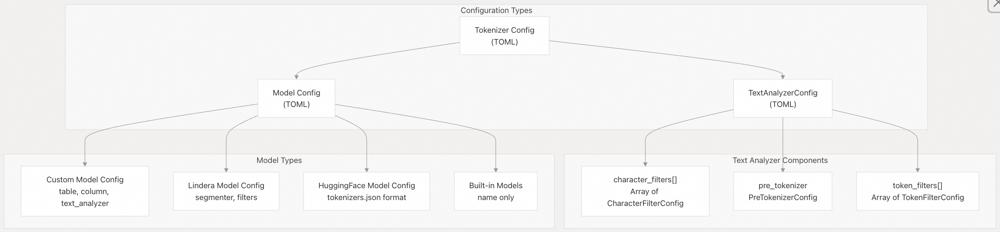
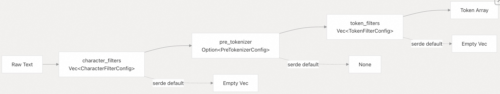
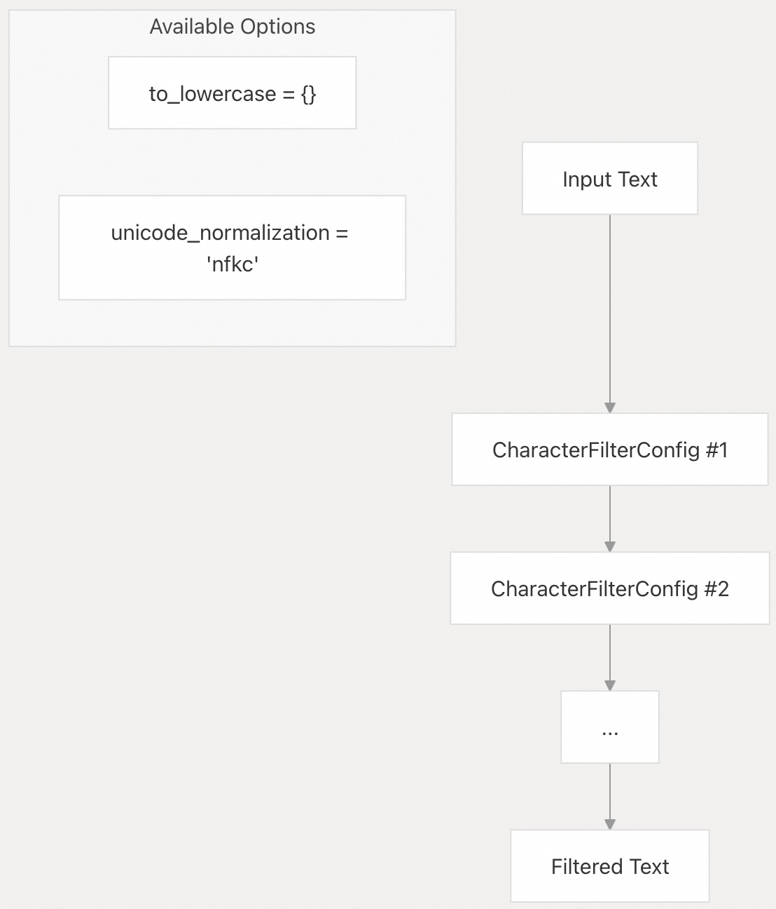
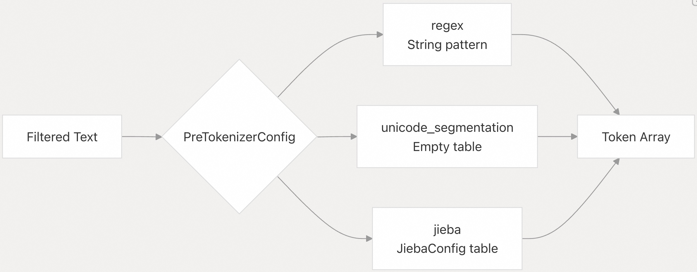
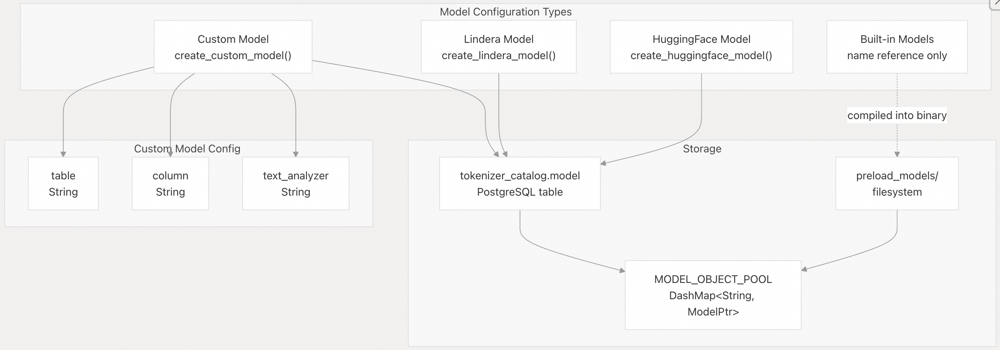
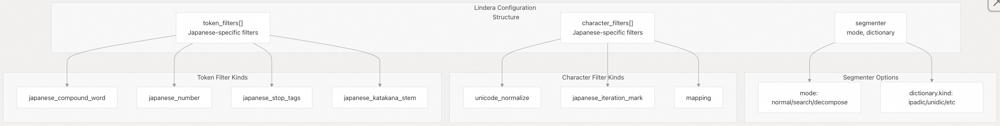
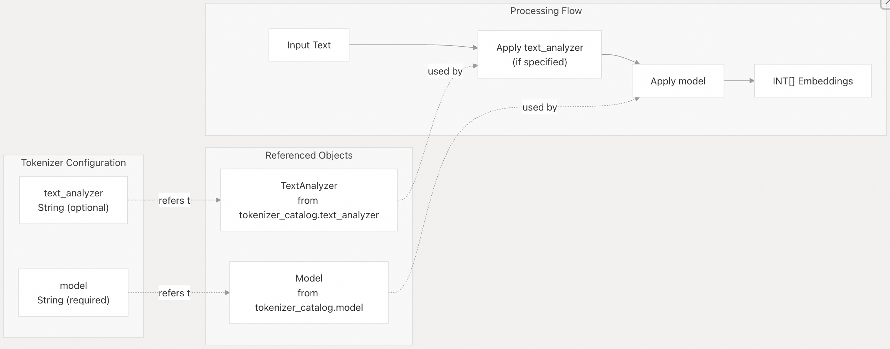
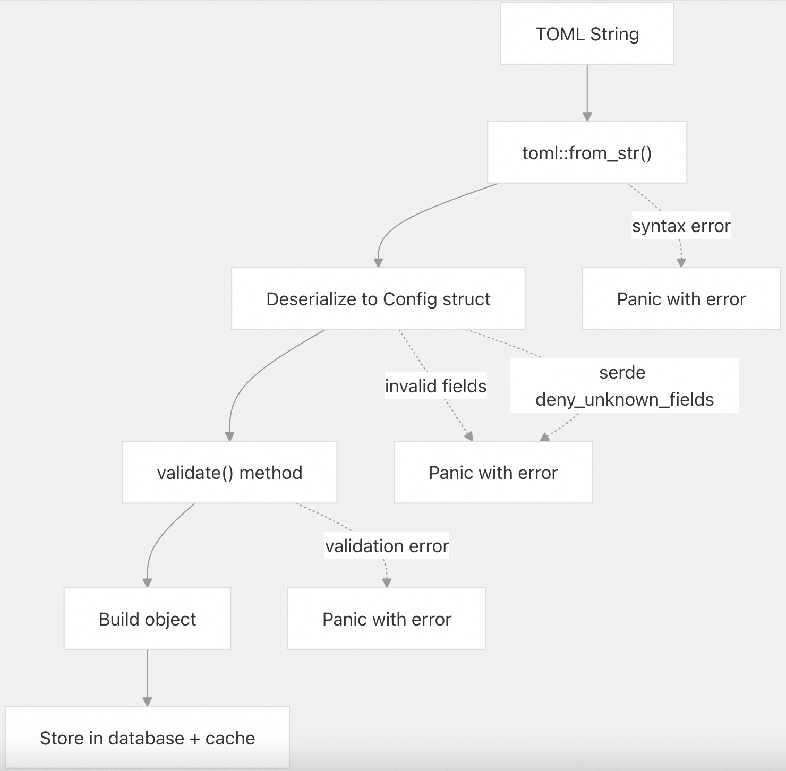

## pg_tokenizer 源码学习: 7.2 配置参考 (Configuration Reference)   
                      
### 作者                      
digoal                      
                      
### 日期                      
2025-11-20                      
                      
### 标签                      
pg\_tokenizer , 词化 , bert , 标记化 , Tokenization                      
                      
----                      
                      
## 背景                      
本文提供了 `pg_tokenizer` 中使用的所有 **TOML 配置选项 (TOML configuration options)** 的完整参考。所有配置——包括**文本分析器 (text analyzers)**、**模型 (models)** 和**分词器 (tokenizers)**——都使用 **TOML 语法 (TOML syntax)** 来定义**处理管道 (processing pipelines)** 和模型参数。  
  
## 配置架构 (Configuration Architecture)  
  
`pg_tokenizer` 中的配置系统由三种主要的配置类型组成，它们协同工作以处理文本：  
  
    
  
来源: [`src/text_analyzer.rs` 17-26](https://github.com/tensorchord/pg_tokenizer.rs/blob/d3f7a577/src/text_analyzer.rs#L17-L26) [`docs/00-reference.md` 50-136](https://github.com/tensorchord/pg_tokenizer.rs/blob/d3f7a577/docs/00-reference.md#L50-L136) [`docs/04-usage.md` 68-136](https://github.com/tensorchord/pg_tokenizer.rs/blob/d3f7a577/docs/04-usage.md#L68-L136)  
  
## 文本分析器配置 (Text Analyzer Configuration)  
  
### 配置结构 (Configuration Structure)  
  
`TextAnalyzerConfig` 结构定义了一个**处理管道 (processing pipeline)**，它具有三个可选阶段：  
  
    
  
| 字段 (Field) | 类型 (Type) | 必需 (Required) | 描述 (Description) |  
| :--- | :--- | :--- | :--- |  
| `character_filters` | 表数组 (Array of tables) | 否 (默认为 `[]`) | 在**分词 (tokenization)** 前应用的**字符转换 (Character transformations)** |  
| `pre_tokenizer` | 表 (Table) | 否 (默认为 `None`) | 将文本分割成**初始分词 (initial tokens)** 的方法 |  
| `token_filters` | 表数组 (Array of tables) | 否 (默认为 `[]`) | 在**预分词 (pre-tokenization)** 后应用的**分词 (Token) 转换** |  
  
**TOML 示例 (TOML Example):**  
  
```toml  
pre_tokenizer = "unicode_segmentation"  
[[character_filters]]  
to_lowercase = {}  
[[character_filters]]  
unicode_normalization = "nfkd"  
[[token_filters]]  
skip_non_alphanumeric = {}  
[[token_filters]]  
stopwords = "nltk_english"  
```  
  
来源: [`src/text_analyzer.rs` 17-26](https://github.com/tensorchord/pg_tokenizer.rs/blob/d3f7a577/src/text_analyzer.rs#L17-L26) [`docs/00-reference.md` 54-60](https://github.com/tensorchord/pg_tokenizer.rs/blob/d3f7a577/docs/00-reference.md#L54-L60) [`docs/04-usage.md` 29-41](https://github.com/tensorchord/pg_tokenizer.rs/blob/d3f7a577/docs/04-usage.md#L29-L41)  
  
### 字符过滤器选项 (Character Filter Options)  
  
字符过滤器在**分词 (tokenization)** 前修改文本。每个过滤器在 `character_filters` 数组中定义为一个表。**每个过滤器表只允许一个选项。**  
  
    
  
| 选项 (Option) | 类型 (Type) | 值 (Values) | 描述 (Description) |  
| :--- | :--- | :--- | :--- |  
| `to_lowercase` | 空表 `{}` | 不适用 (N/A) | 将所有字符转换为小写 |  
| `unicode_normalization` | 字符串 (String) | `"nfc"`, `"nfd"`, `"nfkc"`, `"nfkd"` | 根据 [Unicode 标准附件 \#15 (Unicode Standard Annex \#15)](https://unicode.org/reports/tr15/) 应用 **Unicode 标准化形式 (Unicode normalization form)** |  
  
**TOML 示例 (TOML Examples):**  
  
```toml  
# Lowercase transformation  
[[character_filters]]  
to_lowercase = {}  
  
# Unicode normalization (NFD form)  
[[character_filters]]  
unicode_normalization = "nfd"  
```  
  
来源: [`docs/00-reference.md` 62-69](https://github.com/tensorchord/pg_tokenizer.rs/blob/d3f7a577/docs/00-reference.md#L62-L69) [`docs/05-text-analyzer.md` 9-14](https://github.com/tensorchord/pg_tokenizer.rs/blob/d3f7a577/docs/05-text-analyzer.md#L9-L14) [`src/text_analyzer.rs` 36-41](https://github.com/tensorchord/pg_tokenizer.rs/blob/d3f7a577/src/text_analyzer.rs#L36-L41)  
  
### 预分词器选项 (Pre-tokenizer Options)  
  
**预分词器 (Pre-tokenizers)** 将文本分割成初始分词。**每个文本分析器只允许一个预分词器。**  
  
    
  
| 选项 (Option) | 类型 (Type) | 描述 (Description) |  
| :--- | :--- | :--- |  
| `regex` | 字符串 (String) | 正则表达式模式 (Regular expression pattern) - 生成匹配该模式的分词 (tokens) |  
| `unicode_segmentation` | 空表 `{}` | 根据 [Unicode 标准附件 \#29 (Unicode Standard Annex \#29)](https://unicode.org/reports/tr29/) **词语边界 (word boundaries)** 分割文本 |  
| `jieba` | 表 (Table) | 使用 `jieba-rs` 库进行中文文本分割 |  
  
**TOML 示例 (TOML Examples):**  
  
```toml  
# Unicode segmentation  
pre_tokenizer = "unicode_segmentation"  
  
# Regex pattern  
pre_tokenizer = "\\w+"  
  
# Jieba with configuration  
[pre_tokenizer.jieba]  
mode = "search"  
enable_hmm = true  
```  
  
来源: [`docs/00-reference.md` 71-84](https://github.com/tensorchord/pg_tokenizer.rs/blob/d3f7a577/docs/00-reference.md#L71-L84) [`docs/05-text-analyzer.md` 16-22](https://github.com/tensorchord/pg_tokenizer.rs/blob/d3f7a577/docs/05-text-analyzer.md#L16-L22) [`src/text_analyzer.rs` 42](https://github.com/tensorchord/pg_tokenizer.rs/blob/d3f7a577/src/text_analyzer.rs#L42-L42)  
  
#### Jieba 预分词器配置 (Jieba Pre-tokenizer Configuration)  
  
使用 `jieba` 时，可以使用以下选项：  
  
| 字段 (Field) | 类型 (Type) | 默认值 (Default) | 值 (Values) | 描述 (Description) |  
| :--- | :--- | :--- | :--- | :--- |  
| `mode` | 字符串 (String) | `"search"` | `"full"` (全模式), `"precise"` (精确模式), `"search"` (搜索模式) | 分词模式 (Tokenization mode): full (所有可能的词语), precise (最准确), search (用于搜索引擎) |  
| `enable_hmm` | 布尔值 (Boolean) | `true` | `true`, `false` | 为未知词语启用 **隐马尔可夫模型 (Hidden Markov Model)** |  
  
**TOML 示例 (TOML Example):**  
  
```toml  
[pre_tokenizer.jieba]  
mode = "precise"  
enable_hmm = false  
```  
  
来源: [`docs/00-reference.md` 79-84](https://github.com/tensorchord/pg_tokenizer.rs/blob/d3f7a577/docs/00-reference.md#L79-L84) [`docs/03-examples.md` 99-101](https://github.com/tensorchord/pg_tokenizer.rs/blob/d3f7a577/docs/03-examples.md#L99-L101)  
  
### 分词过滤器选项 (Token Filter Options)  
  
**分词过滤器 (Token filters)** 在**预分词 (pre-tokenization)** 后转换或过滤分词。每个过滤器在 `token_filters` 数组中定义为一个表。**每个过滤器表只允许一个选项。**  
  
    
  
| 选项 (Option) | 类型 (Type) | 描述 (Description) |  
| :--- | :--- | :--- |  
| `skip_non_alphanumeric` | 空表 `{}` | 移除所有字符都是非字母数字的分词 |  
| `stemmer` | 字符串 (String) | 应用 **Snowball 词干提取算法 (Snowball stemming algorithm)** - 参阅 [词干提取器值 (Stemmer Values)](https://github.com/tensorchord/pg_tokenizer.rs/blob/d3f7a577/Stemmer%20Values) |  
| `stopwords` | 字符串 (String) | 移除**停用词 (stopwords)** - 内置字典或自定义名称 |  
| `synonym` | 字符串 (String) | 用**同义词 (synonyms)** 替换分词 - 引用自定义同义词字典 |  
| `pg_dict` | 字符串 (String) | 应用 **PostgreSQL 文本搜索字典 (PostgreSQL text search dictionary)** |  
| `ngram` | 表 (Table) | 生成**字符 N-gram (character n-grams)** - 参阅 [N-gram 配置 (N-gram Configuration)](https://github.com/tensorchord/pg_tokenizer.rs/blob/d3f7a577/N-gram%20Configuration) |  
  
**TOML 示例 (TOML Examples):**  
  
```toml  
# Skip non-alphanumeric tokens  
[[token_filters]]  
skip_non_alphanumeric = {}  
  
# Apply stemming  
[[token_filters]]  
stemmer = "english_porter2"  
  
# Remove stopwords  
[[token_filters]]  
stopwords = "nltk_english"  
  
# Use synonym dictionary  
[[token_filters]]  
synonym = "my_synonyms"  
  
# PostgreSQL dictionary  
[[token_filters]]  
pg_dict = "english_stem"  
  
# Generate n-grams  
[[token_filters]]  
[token_filters.ngram]  
min_gram = 2  
max_gram = 3  
```  
  
来源: [`docs/00-reference.md` 86-109](https://github.com/tensorchord/pg_tokenizer.rs/blob/d3f7a577/docs/00-reference.md#L86-L109) [`docs/05-text-analyzer.md` 24-32](https://github.com/tensorchord/pg_tokenizer.rs/blob/d3f7a577/docs/05-text-analyzer.md#L24-L32) [`src/text_analyzer.rs` 43-47](https://github.com/tensorchord/pg_tokenizer.rs/blob/d3f7a577/src/text_analyzer.rs#L43-L47)  
  
#### 词干提取器值 (Stemmer Values)  
  
支持以下来自 **Snowball 词干提取项目 (Snowball stemming project)** 的词干提取算法：  
  
| 语言 (Language) | 词干提取器值 (Stemmer Value) |  
| :--- | :--- |  
| Arabic | `"arabic"` |  
| Armenian | `"armenian"` |  
| Basque | `"basque"` |  
| Catalan | `"catalan"` |  
| Danish | `"danish"` |  
| Dutch | `"dutch"` |  
| English (Porter) | `"english_porter"` |  
| English (Porter2) | `"english_porter2"` |  
| Estonian | `"estonian"` |  
| Finnish | `"finnish"` |  
| French | `"french"` |  
| German | `"german"` |  
| Greek | `"greek"` |  
| Hindi | `"hindi"` |  
| Hungarian | `"hungarian"` |  
| Indonesian | `"indonesian"` |  
| Irish | `"irish"` |  
| Italian | `"italian"` |  
| Lithuanian | `"lithuanian"` |  
| Nepali | `"nepali"` |  
| Norwegian | `"norwegian"` |  
| Portuguese | `"portuguese"` |  
| Romanian | `"romanian"` |  
| Russian | `"russian"` |  
| Serbian | `"serbian"` |  
| Spanish | `"spanish"` |  
| Swedish | `"swedish"` |  
| Tamil | `"tamil"` |  
| Turkish | `"turkish"` |  
| Yiddish | `"yiddish"` |  
  
来源: [`docs/00-reference.md` 99-101](https://github.com/tensorchord/pg_tokenizer.rs/blob/d3f7a577/docs/00-reference.md#L99-L101) [`docs/05-text-analyzer.md` 34-36](https://github.com/tensorchord/pg_tokenizer.rs/blob/d3f7a577/docs/05-text-analyzer.md#L34-L36)  
  
#### 内置停用词字典 (Built-in Stopwords Dictionaries)  
  
提供以下内置**停用词字典 (stopwords dictionaries)**：  
  
| 字典名称 (Dictionary Name) | 语言 (Language) | 描述 (Description) |  
| :--- | :--- | :--- |  
| `"lucene_english"` | 英语 (English) | 来自 **Apache Lucene** 的停用词 |  
| `"nltk_english"` | 英语 (English) | 来自 **NLTK (自然语言工具包)** 的停用词 |  
| `"iso_english"` | 英语 (English) | ISO 停用词列表 |  
  
可以使用 `tokenizer_catalog.create_stopwords()` 创建自定义停用词字典。  
  
来源: [`docs/00-reference.md` 92](https://github.com/tensorchord/pg_tokenizer.rs/blob/d3f7a577/docs/00-reference.md#L92-L92) [`docs/05-text-analyzer.md` 38-61](https://github.com/tensorchord/pg_tokenizer.rs/blob/d3f7a577/docs/05-text-analyzer.md#L38-L61)  
  
#### N-gram 配置 (N-gram Configuration)  
  
`NgramConfig` 结构从分词生成**字符级别的 N-gram (character-level n-grams)**：  
  
| 字段 (Field) | 类型 (Type) | 默认值 (Default) | 范围 (Range) | 描述 (Description) |  
| :--- | :--- | :--- | :--- | :--- |  
| `max_gram` | 整数 (Integer) | `2` | `1..=255` | 字符中的最大 N-gram 大小 |  
| `min_gram` | 整数 (Integer) | `1` | `1..=255` | 字符中的最小 N-gram 大小 |  
| `preserve_original` | 布尔值 (Boolean) | `false` | 不适用 (N/A) | 如果原始分词的长度超出 `[min_gram, max_gram]` 范围，则保留它 |  
  
**验证 (Validation):** `min_gram` 必须小于或等于 `max_gram`。  
  
**TOML 示例 (TOML Examples):**  
  
```toml  
# Default n-gram (1-2 characters)  
[[token_filters]]  
[token_filters.ngram]  
  
# Custom n-gram (2-3 characters, preserve original)  
[[token_filters]]  
[token_filters.ngram]  
min_gram = 2  
max_gram = 3  
preserve_original = true  
```  
  
**示例输出 (Example Output):**  
  
  * 输入 (Input): `"Quick"`，使用 `min_gram=1`，`max_gram=2`  
  * 输出 (Output): `["Q", "Qu", "u", "ui", "i", "ic", "c", "ck", "k"]`  
  
来源: [`src/token_filter/ngram.rs` 6-39](https://github.com/tensorchord/pg_tokenizer.rs/blob/d3f7a577/src/token_filter/ngram.rs#L6-L39) [`docs/00-reference.md` 103-109](https://github.com/tensorchord/pg_tokenizer.rs/blob/d3f7a577/docs/00-reference.md#L103-L109) [`tests/sqllogictest/ngram.slt` 1-30](https://github.com/tensorchord/pg_tokenizer.rs/blob/d3f7a577/tests/sqllogictest/ngram.slt#L1-L30)  
  
## 模型配置 (Model Configuration)  
  
**模型 (Models)** 将分词转换为**嵌入 (embeddings)** (整数数组)。不同模型类型需要不同的配置：  
  
    
  
来源: [`docs/00-reference.md` 125-136](https://github.com/tensorchord/pg_tokenizer.rs/blob/d3f7a577/docs/00-reference.md#L125-L136) [`docs/04-usage.md` 82-90](https://github.com/tensorchord/pg_tokenizer.rs/blob/d3f7a577/docs/04-usage.md#L82-L90)  
  
### 自定义模型配置 (Custom Model Configuration)  
  
**自定义模型 (Custom models)** 从数据库中的**语料库数据 (corpus data)** 构建**词汇表 (vocabularies)**。配置传递给 `tokenizer_catalog.create_custom_model()`：  
  
| 字段 (Field) | 类型 (Type) | 必需 (Required) | 描述 (Description) |  
| :--- | :--- | :--- | :--- |  
| `table` | 字符串 (String) | 是 (Yes) | 包含源文本的表的名称 |  
| `column` | 字符串 (String) | 是 (Yes) | 包含源文本的列的名称 |  
| `text_analyzer` | 字符串 (String) | 是 (Yes) | 用于生成分词的文本分析器的名称 |  
  
**TOML 示例 (TOML Example):**  
  
```toml  
table = "documents"  
column = "passage"  
text_analyzer = "text_analyzer1"  
```  
  
**SQL 用法 (SQL Usage):**  
  
```sql  
-- Create text analyzer first  
SELECT create_text_analyzer('text_analyzer1', $$  
pre_tokenizer = "unicode_segmentation"  
[[token_filters]]  
stopwords = "nltk_english"  
$$);  
  
-- Create custom model  
SELECT create_custom_model('model1', $$  
table = "documents"  
column = "passage"  
text_analyzer = "text_analyzer1"  
$$);  
```  
  
来源: [`docs/00-reference.md` 125-131](https://github.com/tensorchord/pg_tokenizer.rs/blob/d3f7a577/docs/00-reference.md#L125-L131) [`docs/04-usage.md` 43-52](https://github.com/tensorchord/pg_tokenizer.rs/blob/d3f7a577/docs/04-usage.md#L43-L52)  
  
### Lindera 模型配置 (Lindera Model Configuration)  
  
**Lindera 模型 (Lindera models)** 提供**日语文本处理 (Japanese text processing)**。配置遵循 [Lindera 分词器格式 (Lindera tokenizer format)](https://github.com/tensorchord/pg_tokenizer.rs/blob/d3f7a577/Lindera%20tokenizer%20format) 的关键组件：  
  
    
  
**TOML 示例 (Japanese ipadic):**  
  
```toml  
[segmenter]  
mode = "normal"  
  [segmenter.dictionary]  
  kind = "ipadic"  
  
[[character_filters]]  
kind = "unicode_normalize"  
  [character_filters.args]  
  kind = "nfkc"  
  
[[character_filters]]  
kind = "japanese_iteration_mark"  
  [character_filters.args]  
  normalize_kanji = true  
  normalize_kana = true  
  
[[token_filters]]  
kind = "japanese_compound_word"  
  [token_filters.args]  
  kind = "ipadic"  
  tags = ["名詞,数", "名詞,接尾,助数詞"]  
  new_tag = "名詞,数"  
  
[[token_filters]]  
kind = "japanese_katakana_stem"  
  [token_filters.args]  
  min = 3  
```  
  
**SQL 用法 (SQL Usage):**  
  
```sql  
SELECT create_lindera_model('lindera_ipadic', $$  
[segmenter]  
mode = "normal"  
  [segmenter.dictionary]  
  kind = "ipadic"  
-- ... additional configuration  
$$);  
```  
  
来源: [`docs/00-reference.md` 133-135](https://github.com/tensorchord/pg_tokenizer.rs/blob/d3f7a577/docs/00-reference.md#L133-L135) [`docs/03-examples.md` 139-205](https://github.com/tensorchord/pg_tokenizer.rs/blob/d3f7a577/docs/03-examples.md#L139-L205)  
  
### HuggingFace 模型配置 (HuggingFace Model Configuration)  
  
**HuggingFace 模型 (HuggingFace models)** 使用 `tokenizers` 库格式。配置必须与 HuggingFace transformers 使用的 `tokenizers.json` 格式匹配。  
  
**SQL 用法 (SQL Usage):**  
  
```sql  
SELECT create_huggingface_model('my_hf_model', $$  
-- Configuration in tokenizers.json format  
-- Refer to HuggingFace tokenizers documentation  
$$);  
```  
  
来源: [`docs/00-reference.md` 40-41](https://github.com/tensorchord/pg_tokenizer.rs/blob/d3f7a577/docs/00-reference.md#L40-L41)  
  
### 内置模型 (Built-in Models)  
  
**内置模型 (Built-in models)** 预编译到扩展中，无需配置。它们仅通过名称引用：  
  
| 模型名称 (Model Name) | 描述 (Description) | 来源 (Source) |  
| :--- | :--- | :--- |  
| `"bert_base_uncased"` | BERT 基础模型 (未区分大小写) | [google-bert/bert-base-uncased](https://huggingface.co/google-bert/bert-base-uncased) |  
| `"wiki_tocken"` | 经过 Wikipedia 训练的分词器 | [iohadrubin/wikitext-103-raw-v1](https://huggingface.co/datasets/iohadrubin/wikitext-103-raw-v1) |  
| `"gemma2b"` | Google Gemma 2B 模型 | [google/gemma-2b](https://huggingface.co/google/gemma-2b) |  
| `"llmlingua2"` | LLMLingua-2 压缩模型 | [microsoft/llmlingua-2-xlm-roberta-large-meetingbank](https://huggingface.co/microsoft/llmlingua-2-xlm-roberta-large-meetingbank) |  
  
**在分词器中的用法 (Usage in Tokenizer):**  
  
```sql  
model = "llmlingua2"  
```  
  
来源: [`docs/00-reference.md` 118-123](https://github.com/tensorchord/pg_tokenizer.rs/blob/d3f7a577/docs/00-reference.md#L118-L123) [`docs/04-usage.md` 7-9](https://github.com/tensorchord/pg_tokenizer.rs/blob/d3f7a577/docs/04-usage.md#L7-L9)  
  
## 分词器配置 (Tokenizer Configuration)  
  
**分词器 (Tokenizers)** 结合了**文本分析器 (text analyzers)** 和**模型 (models)**。配置传递给 `tokenizer_catalog.create_tokenizer()`：  
  
    
  
| 字段 (Field) | 类型 (Type) | 必需 (Required) | 描述 (Description) |  
| :--- | :--- | :--- | :--- |  
| `text_analyzer` | 字符串 (String) | 否 (No) | 要使用的文本分析器的名称 (如果模型处理分词，则可省略) |  
| `model` | 字符串 (String) | 是 (Yes) | 用于生成嵌入的模型的名称 |  
  
**TOML 示例 (TOML Examples):**  
  
```toml  
# Using built-in model (no text analyzer needed)  
model = "llmlingua2"  
  
# Using custom model with text analyzer  
text_analyzer = "text_analyzer1"  
model = "model1"  
  
# Inline text analyzer configuration  
pre_tokenizer = "unicode_segmentation"  
[[character_filters]]  
to_lowercase = {}  
[[token_filters]]  
stopwords = "nltk_english"  
model = "model1"  
```  
  
**SQL 用法 (SQL Usage):**  
  
```sql  
-- Separate text analyzer definition  
SELECT create_text_analyzer('text_analyzer1', $$  
pre_tokenizer = "unicode_segmentation"  
$$);  
  
SELECT create_tokenizer('tokenizer1', $$  
text_analyzer = "text_analyzer1"  
model = "model1"  
$$);  
  
-- Inline text analyzer  
SELECT create_tokenizer('tokenizer2', $$  
pre_tokenizer = "unicode_segmentation"  
[[character_filters]]  
to_lowercase = {}  
model = "llmlingua2"  
$$);  
```  
  
来源: [`docs/00-reference.md` 111-116](https://github.com/tensorchord/pg_tokenizer.rs/blob/d3f7a577/docs/00-reference.md#L111-L116) [`docs/04-usage.md` 96-135](https://github.com/tensorchord/pg_tokenizer.rs/blob/d3f7a577/docs/04-usage.md#L96-L135) [`src/text_analyzer.rs` 124](https://github.com/tensorchord/pg_tokenizer.rs/blob/d3f7a577/src/text_analyzer.rs#L124-L124)  
  
## 自定义字典配置 (Custom Dictionary Configuration)  
  
**自定义停用词 (Custom stopwords)** 和**同义词字典 (synonym dictionaries)** 使用**行分隔的文本格式 (line-delimited text format)** 定义：  
  
### 停用词字典 (Stopwords Dictionary)  
  
每行包含一个**停用词 (stopword)**：  
  
```sql  
SELECT create_stopwords('my_stops', $$  
the  
and  
or  
$$);  
```  
  
**用法 (Usage):**  
  
```  
[[token_filters]]  
stopwords = "my_stops"  
```  
  
### 同义词字典 (Synonym Dictionary)  
  
每行包含以空格分隔的**同义词 (synonyms)** (第一个词是**规范词 (canonical)**)：  
  
```sql  
SELECT create_synonym('my_synonyms', $$  
pgsql postgres postgresql  
index indices  
$$);  
```  
  
**用法 (Usage):**  
  
```  
[[token_filters]]  
synonym = "my_synonyms"  
```  
  
来源: [`docs/05-text-analyzer.md` 38-79](https://github.com/tensorchord/pg_tokenizer.rs/blob/d3f7a577/docs/05-text-analyzer.md#L38-L79)  
  
## 完整配置示例 (Complete Configuration Examples)  
  
### 英语文本处理 (English Text Processing)  
  
```toml  
pre_tokenizer = "unicode_segmentation"  
  
[[character_filters]]  
to_lowercase = {}  
  
[[character_filters]]  
unicode_normalization = "nfkd"  
  
[[token_filters]]  
skip_non_alphanumeric = {}  
  
[[token_filters]]  
stopwords = "nltk_english"  
  
[[token_filters]]  
stemmer = "english_porter2"  
```  
  
来源: [`docs/04-usage.md` 29-41](https://github.com/tensorchord/pg_tokenizer.rs/blob/d3f7a577/docs/04-usage.md#L29-L41)  
  
### 使用 Jieba 的中文文本处理 (Chinese Text Processing with Jieba)  
  
```toml  
[pre_tokenizer.jieba]  
mode = "search"  
enable_hmm = true  
```  
  
来源: [`docs/03-examples.md` 99-101](https://github.com/tensorchord/pg_tokenizer.rs/blob/d3f7a577/docs/03-examples.md#L99-L101)  
  
### N-gram 分词生成 (N-gram Token Generation)  
  
```toml  
pre_tokenizer = "unicode_segmentation"  
  
[[token_filters]]  
[token_filters.ngram]  
min_gram = 2  
max_gram = 3  
preserve_original = true  
```  
  
来源: [`tests/sqllogictest/ngram.slt` 17-24](https://github.com/tensorchord/pg_tokenizer.rs/blob/d3f7a577/tests/sqllogictest/ngram.slt#L17-L24)  
  
### 具有完整管道的自定义模型 (Custom Model with Full Pipeline)  
  
```toml  
-- 1. Create text analyzer  
SELECT create_text_analyzer('analyzer1', $$  
pre_tokenizer = "unicode_segmentation"  
[[character_filters]]  
to_lowercase = {}  
[[character_filters]]  
unicode_normalization = "nfkd"  
[[token_filters]]  
skip_non_alphanumeric = {}  
[[token_filters]]  
stopwords = "nltk_english"  
[[token_filters]]  
stemmer = "english_porter2"  
$$);  
  
-- 2. Create custom model  
SELECT create_custom_model('model1', $$  
table = "documents"  
column = "passage"  
text_analyzer = "analyzer1"  
$$);  
  
-- 3. Create tokenizer  
SELECT create_tokenizer('tokenizer1', $$  
text_analyzer = "analyzer1"  
model = "model1"  
$$);  
```  
  
来源: [`docs/04-usage.md` 28-52](https://github.com/tensorchord/pg_tokenizer.rs/blob/d3f7a577/docs/04-usage.md#L28-L52)  
  
### 使用内置模型 (Using Built-in Model)  
  
```toml  
-- Simplest configuration - no text analyzer needed  
SELECT create_tokenizer('tokenizer1', $$  
model = "llmlingua2"  
$$);  
```  
  
来源: [`docs/04-usage.md` 7-9](https://github.com/tensorchord/pg_tokenizer.rs/blob/d3f7a577/docs/04-usage.md#L7-L9)  
  
## 配置验证 (Configuration Validation)  
  
所有配置在传递给创建函数时都会进行**验证 (validated)**：  
  
    
  
**验证检查包括 (Validation checks include):**  
  
  * TOML 语法正确性 (TOML syntax correctness)  
  * **未知字段检测 (Unknown field detection)** (通过 `#[serde(deny_unknown_fields)]`)  
  * 数字字段的**范围验证 (Range validation)** (例如，`min_gram`、`max_gram` 在 `1..=255` 范围内)  
  * **逻辑验证 (Logical validation)** (例如，N-gram 的 `min_gram <= max_gram`)  
  * **引用对象存在性 (Referenced object existence)** (例如，文本分析器名称、模型名称)  
  
来源: [`src/text_analyzer.rs` 17-26](https://github.com/tensorchord/pg_tokenizer.rs/blob/d3f7a577/src/text_analyzer.rs#L17-L26) [`src/text_analyzer.rs` 123-126](https://github.com/tensorchord/pg_tokenizer.rs/blob/d3f7a577/src/text_analyzer.rs#L123-L126) [`src/token_filter/ngram.rs` 6-38](https://github.com/tensorchord/pg_tokenizer.rs/blob/d3f7a577/src/token_filter/ngram.rs#L6-L38)  
  
-----  
  
# 附录: 自定义模型与内置模型的选择  
自定义模型与内置模型的选择  
  
在配置 `pg_tokenizer.rs` 时，面对**领域专业化 (Domain Specific)** 的文本数据（例如，特定行业的报告、医学或法律文档等），我应该如何权衡使用**自定义模型 (Custom Model)** 与**内置模型 (Built-in Model)**？  
  
具体而言：  
  
1.  **嵌入质量 (Embedding Quality)**：与直接使用强大的通用**内置模型**（如 `"bert_base_uncased"`）相比，手动配置一个包含领域特定**文本分析器 (Text Analyzer)**（例如，自定义**停用词 (stopwords)** 和**同义词 (synonym)** 字典）的**自定义模型**，能否在这些专业领域数据的**嵌入表达能力**上带来显著提升？  
2.  **构建和计算成本 (Cost)**：创建一个**自定义模型**需要定义 `table`、`column` 和 `text_analyzer` 来从语料库中构建**词汇表 (vocabularies)**。这种模型训练/构建过程的**资源消耗**和**时间成本**，是否显著高于直接使用预编译的**内置模型**？  
  
简而言之，对于专业领域数据，是选择**通用模型 + 简单配置**，还是选择**自定义模型 + 深度定制分析器**，哪种方案能达到最佳的**性能/成本比**？  
    
  
## 回答  
您的问题是关于在 `pg_tokenizer.rs` 中为**领域专业化文本数据**选择**自定义模型 (Custom Model)** 还是**内置模型 (Built-in Model)** 的权衡。  
  
## 核心差异  
  
### 1. 嵌入质量 (Embedding Quality)  
  
**自定义模型**和**内置模型**在嵌入生成上有本质区别:  
  
- **内置模型** (如 `bert_base_uncased`, `llmlingua2`) 使用预训练的词汇表和复杂的子词分词算法,生成的是基于大规模语料库训练的语义嵌入    
  
- **自定义模型**通过 `CustomModelConfig` 从您的领域语料库构建词汇表,生成的是基于词频的简单整数ID映射     
  
**关键点**:自定义模型的"嵌入"实际上只是词汇表中的token ID,不包含语义信息。它的优势在于可以通过自定义 `text_analyzer` 进行领域特定的**预处理**(停用词、同义词、词干提取),但最终的嵌入仍然是简单的ID映射。  
  
### 2. 构建和计算成本 (Cost)  
  
**自定义模型的构建过程**:  
  
1. 创建词汇表表 `tokenizer_catalog."model_{name}"`    
2. 创建触发器以自动更新词汇表    
3. 从现有数据提取所有token并插入词汇表    
  
**成本分析**:  
  
- **初始构建**:需要扫描整个表并应用 `text_analyzer`,对于大型语料库可能需要数分钟  
- **内存占用**:自定义模型只存储词汇表(文本到ID的映射),内存占用远小于内置模型(例如 `gemma2b` 100MB, `llmlingua2` 200MB)    
- **运行时性能**:自定义模型的tokenization是简单的表查询,比内置模型的复杂子词算法更快  
  
## 推荐方案  
  
对于**领域专业化数据**,推荐策略取决于您的使用场景:  
  
### 场景 1: BM25 全文搜索  
如果您使用 `pg_tokenizer` 配合 BM25 进行全文搜索,**自定义模型 + 领域特定 text analyzer** 是最佳选择:  
  
```sql  
-- 创建领域特定的 text analyzer  
SELECT create_text_analyzer('medical_analyzer', $$  
pre_tokenizer = "unicode_segmentation"  
[[character_filters]]  
to_lowercase = {}  
[[token_filters]]  
stopwords = "custom_medical_stops"  -- 医学领域停用词  
[[token_filters]]  
synonym = "medical_synonyms"        -- 医学同义词  
[[token_filters]]  
stemmer = "english_porter2"  
$$);  
  
-- 创建自定义模型  
SELECT create_custom_model('medical_model', $$  
table = 'medical_documents'  
column = 'content'  
text_analyzer = 'medical_analyzer'  
$$);  
```    
  
**优势**:领域词汇完全覆盖,搜索准确性高,成本低。  
  
### 场景 2: 语义相似度搜索  
如果需要语义理解(如文档相似度),**内置模型**更合适,因为它们提供真正的语义嵌入:  
  
```sql  
SELECT create_tokenizer('semantic_tokenizer', $$  
model = "bert_base_uncased"  
$$);  
```    
  
**注意**:内置模型的词汇表是固定的,无法识别领域特定术语,可能将其拆分为子词。  
  
## Notes  
  
- 自定义模型的"嵌入"本质上是词频统计的ID映射,不是语义嵌入  
- 自定义模型支持通过 `create_custom_model_tokenizer_and_trigger` 自动维护词汇表   
- 内置模型列表见 `src/model/builtin.rs`,包括 `bert_base_uncased`, `wiki_tocken`, `gemma2b`, `llmlingua2`    
- 对于中文/日文等语言,可考虑 Lindera 模型,它提供了专门的分词器    
  
  
-----  
  
# 附录2:  
自定义模型的映射关系存储在表中, 有什么方法可以转换为类似huggingface的模型格式提升性能吗?  
  
您询问的是**自定义模型的词汇表映射能否转换为 HuggingFace 格式以提升性能**。  
  
## 答案  
  
**目前不支持这种转换**。自定义模型和 HuggingFace 模型在 `pg_tokenizer.rs` 中是两种完全不同的实现机制:  
  
### 1. 存储机制差异  
  
**自定义模型**的词汇表存储在 PostgreSQL 表中:    
  
每次 tokenization 都需要查询数据库:    
  
**HuggingFace 模型**则直接从 `tokenizer.json` 文件加载到内存中,使用 `tokenizers` 库的高性能实现。  
  
### 2. 性能对比  
  
实际上,**自定义模型的性能已经相当高效**:  
  
- **查询优化**: 使用 `WHERE token = ANY($1)` 批量查询,单次数据库往返即可完成多个 token 的查找    
- **索引支持**: 词汇表的 `token` 列有 `UNIQUE` 约束,自动创建索引    
- **内存占用**: 自定义模型只缓存元数据,词汇表保留在数据库中,内存占用极小  
  
相比之下,HuggingFace 模型虽然 tokenization 速度更快,但需要将整个模型加载到内存(100-200MB)。    
  
### 3. 为什么不支持转换  
  
从代码架构看,两种模型类型在 `ModelConfig` 枚举中是独立的分支:    
  
它们的构建逻辑完全不同:    
  
自定义模型的词汇表是**动态增长**的(通过触发器自动更新),而 HuggingFace 模型的词汇表是**静态固定**的。    
  
## 性能优化建议  
  
如果您关注性能,可以考虑:  
  
1. **使用模型预加载**: 通过 `add_preload_model()` 在服务器启动时加载模型,避免首次查询延迟    
  
2. **批量 tokenization**: 使用 `tokenize()` 函数处理多行数据时,内部会自动使用 `apply_batch()` 优化    
  
3. **评估是否真的需要转换**: 对于 BM25 全文搜索场景,自定义模型的性能通常已经足够,且具有动态词汇表更新的优势  
  
## Notes  
  
- 如果您的场景确实需要 HuggingFace 格式的高性能 tokenization,可以考虑直接使用 `create_huggingface_model()` 导入现有的 HuggingFace tokenizer   
- 自定义模型的设计初衷是为领域特定语料库提供灵活的词汇表管理,而非追求极致的 tokenization 速度  
- 两种模型类型可以共存,您可以根据不同场景选择使用  
    
#### [PolarDB 学习图谱](https://www.aliyun.com/database/openpolardb/activity "8642f60e04ed0c814bf9cb9677976bd4")
  
  
#### [PostgreSQL 解决方案集合](../201706/20170601_02.md "40cff096e9ed7122c512b35d8561d9c8")
  
  
#### [德哥 / digoal's Github - 公益是一辈子的事.](https://github.com/digoal/blog/blob/master/README.md "22709685feb7cab07d30f30387f0a9ae")
  
  
#### [About 德哥](https://github.com/digoal/blog/blob/master/me/readme.md "a37735981e7704886ffd590565582dd0")
  
  

  
