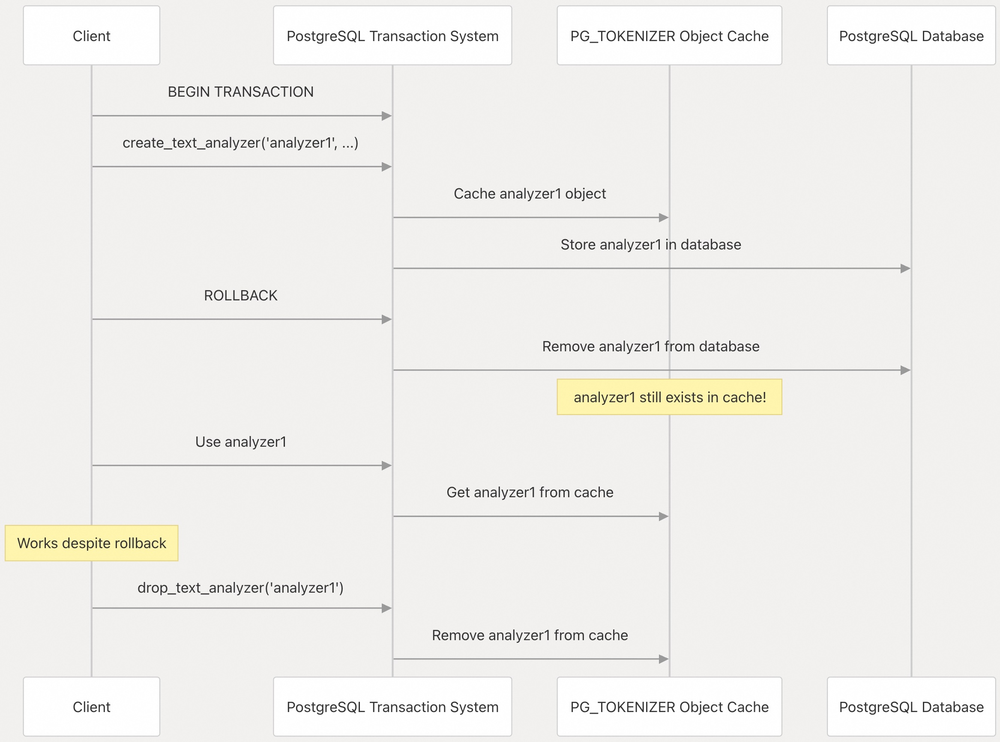
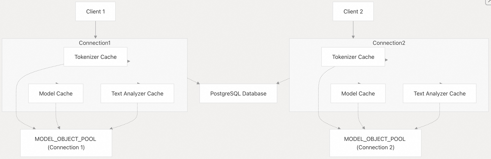

## pg_tokenizer 源码学习: 7.3 限制与注意事项 (Limitations and Caveats)  
                        
### 作者                        
digoal                        
                        
### 日期                        
2025-11-20                        
                        
### 标签                        
pg\_tokenizer , 词化 , bert , 标记化 , Tokenization                        
                        
----                        
                        
## 背景                        
本文概述了在部署和使用 `pg_tokenizer` (PostgreSQL **扩展** (extension)) 时用户应注意的重要**限制** (limitations)、**操作考量** (operational considerations) 和已知的**行为特征** (behavioral characteristics)。了解这些**限制** (limitations) 有助于避免常见**陷阱** (pitfalls) 并实现正确的**系统设计** (system design)。  
  
## 对象缓存与事务隔离 (Object Caching and Transaction Isolation)  
  
`pg_tokenizer` **扩展** (extension) 为每个数据库连接维护一个**对象** (objects)（包括**文本分析器** (text analyzers)、**模型** (models) 和**分词器** (tokenizers)）的**内存缓存** (in-memory cache)。虽然这种**缓存机制** (caching mechanism) 显著提高了**性能** (performance)，但它引入了一个值得注意的限制：  
  
**该对象缓存不遵循 PostgreSQL 的事务隔离规则 (transaction isolation rules)。**  
  
当您在**事务** (transaction) 中创建对象，然后**回滚** (roll back) 该**事务** (transaction) 时：  
  
1.  **数据库记录** (database records) 被正确移除。  
2.  **内存缓存** (in-memory cache) 中仍包含这些对象。  
3.  这些对象在当前**连接** (connection) 中仍然可访问（但在其他**连接** (connections) 中则不可访问）。  
  
### 事务回滚行为示例 (Example of Transaction Rollback Behavior)  
  
```sql  
BEGIN;  
SELECT create_text_analyzer('text_analyzer1', $$  
pre_tokenizer = "unicode_segmentation"  
$$);  
-- The text analyzer is created and cached in memory  
ROLLBACK;  
-- The text analyzer is still cached in memory, but has no effect for other connections  
  
-- Extra call needed to clear the cache:  
SELECT drop_text_analyzer('text_analyzer1');  
```  
  
来源: [`docs/07-limitation.md` 1-21](https://github.com/tensorchord/pg_tokenizer.rs/blob/d3f7a577/docs/07-limitation.md#L1-L21)  
  
## 事务与缓存行为 (Transaction and Cache Behavior)  
  
    
  
来源: [`docs/07-limitation.md` 1-21](https://github.com/tensorchord/pg_tokenizer.rs/blob/d3f7a577/docs/07-limitation.md#L1-L21)  
  
## 连接特定缓存 (Connection-Specific Caching)  
  
每个数据库**连接** (database connection) 都维护自己独立的**对象缓存** (object cache)。在一个**连接** (connection) 中对**对象** (objects) 所做的更改不会影响其他**连接** (connections) 的**缓存** (cache)。  
  
    
  
来源: [`docs/07-limitation.md` 5-8](https://github.com/tensorchord/pg_tokenizer.rs/blob/d3f7a577/docs/07-limitation.md#L5-L8)  
  
## 变通方案与最佳实践 (Workarounds and Best Practices)  
  
为有效处理这些限制：  
  
1.  **显式清理 (Explicit Cleanup)**：在**回滚** (rollback) 之后，显式调用适当的 **`drop_...` 函数** 来清除**缓存** (cache)。  
  
```  
SELECT drop_text_analyzer('text_analyzer_name');  
SELECT drop_model('model_name');  
SELECT drop_tokenizer('tokenizer_name');  
```  
  
2.  **连接管理 (Connection Management)**：**重新连接** (Reconnecting) 到数据库将**重置** (reset) **缓存状态** (cache state)。  
3.  **避免回滚 (Avoid Rollbacks)**：在可能的情况下，构建您的代码以避免在可能被**回滚** (rolled back) 的**事务** (transactions) 中创建 `pg_tokenizer` **对象** (objects)。  
4.  **验证 (Validation)**：始终**验证** (validate) **对象** (objects) 在数据库中是否存在，尤其是在涉及**事务** (transactions) 时。  
  
来源: [`docs/07-limitation.md` 7-20](https://github.com/tensorchord/pg_tokenizer.rs/blob/d3f7a577/docs/07-limitation.md#L7-L20)  
  
## 性能考量 (Performance Considerations)  
  
**缓存机制** (caching mechanism) 是出于**性能** (performance) 原因而实现的。尽管存在**事务处理** (transaction handling) 方面的限制，**缓存** (caching) 通过避免重复从磁盘加载**对象** (objects) 或从配置重建它们，为**分词操作** (tokenization operations) 提供了显著的**性能优势** (performance benefits)。  
  
## 附加说明 (Additional Notes)  
  
  * **缓存** (cache) 是**每个连接** (per-connection) 独立的，因此每个数据库**连接** (database connection) 都维护自己独立的**缓存** (cache)。  
  * 一个**连接** (connection) 所做的更改（创建或删除**对象** (objects)）不会影响其他**连接** (connections) 的**缓存** (cache)。  
  * 当**连接** (connection) 关闭时，所有**缓存** (cached) 的**对象** (objects) 都会被释放。  
  
有关有效使用 `pg_tokenizer` 的更多信息，请参阅**使用指南** (Usage Guide) 和**高级用法** (Advanced Usage) 部分。  
  
来源: [`docs/07-limitation.md` 5-8](https://github.com/tensorchord/pg_tokenizer.rs/blob/d3f7a577/docs/07-limitation.md#L5-L8)  
  
-----  
  
# 附录1: `pg_tokenizer` 扩展中对象缓存系统的事务隔离问题  
鉴于 `pg_tokenizer` 的**对象缓存** (Object Cache) 不遵循 **PostgreSQL 的事务隔离规则** (Transaction Isolation Rules)，当应用程序需要执行涉及 `pg_tokenizer` **对象**（例如创建新的**文本分析器** (text analyzers) 或**模型** (models)）的数据库部署或升级脚本时，**如何才能确保整个集群中的所有数据库连接，特别是连接池中的那些连接，能够立即且一致地识别到新的对象，或者移除已删除的对象，从而避免服务中断或数据处理不一致的问题？**  
  
## 价值说明 (Value Justification)  
  
这个问题直接触及了在生产环境中部署和维护 `pg_tokenizer` **扩展** (extension) 的核心挑战：  
  
1.  **一致性 (Consistency)**：如果一个**连接** (connection) 已经**回滚** (rolled back) 但其**缓存** (cache) 中仍残留了不存在的对象，而另一个**连接** (connection) 看到的是正确的数据库状态，这将导致整个系统的行为不一致。  
2.  **可用性/运维 (Availability/Operations)**：文档中建议的**工作** (workaround) 方案是**重新连接** (reconnecting) 或**显式清理** (explicit cleanup)。在实际的 Web 服务或微服务架构中，管理数十甚至数百个连接的**连接池** (connection pool) 的状态是一项复杂的任务。用户需要知道是否有**内置的机制**（例如：**缓存过期** (cache expiration) 或**全局通知** (global notification)）来强制所有**连接** (connections) 刷新**缓存** (cache)，而不是手动关闭并重新打开所有**连接** (connections)。  
3.  **系统设计 (System Design)**：如果不存在简单的全局刷新机制，那么用户在设计依赖 `pg_tokenizer` **对象** (objects) 的部署流程时，就必须纳入复杂的**连接池管理** (connection pool management) 步骤，这显著增加了运维的复杂性。  
  
这个问题要求的是关于**缓存同步** (cache synchronization) 和**连接管理** (connection management) 的**最佳实践** (best practices) 或更高级的解决方案。  
  
## 回答  
  
问题理解  
  
您询问的是 `pg_tokenizer` 扩展中对象缓存系统的事务隔离问题。  具体来说,`MODEL_OBJECT_POOL`、`TEXT_ANALYZER_OBJECT_POOL`  和 `TOKENIZER_OBJECT_POOL`  这些全局缓存不遵循 PostgreSQL 的事务隔离规则,导致在数据库部署或升级时可能出现不一致问题。  
  
## 核心问题  
  
当前实现中,对象在创建时会立即被缓存,即使事务回滚也不会清除缓存。例如在 `create_custom_model` 中,模型在事务内被插入到 `MODEL_OBJECT_POOL`  ,但如果事务回滚,缓存中的对象仍然存在。类似的模式也出现在 `create_text_analyzer`  和 `create_tokenizer`  中。  
  
## 解决方案  
  
### 1. 使用显式的 drop 函数清理缓存  
  
在部署脚本中,如果事务回滚,需要显式调用相应的 `drop_*` 函数来清理缓存:  
  
- `drop_custom_model(name)`   - 清理自定义模型  
- `drop_lindera_model(name)`   - 清理 Lindera 模型    
- `drop_text_analyzer(name)`   - 清理文本分析器  
- `drop_tokenizer(name)`   - 清理分词器  
  
这些函数会同时从数据库和缓存中移除对象。例如 `drop_custom_model` 在删除数据库记录后调用 `MODEL_OBJECT_POOL.remove(name)`  。  
  
### 2. 重新连接数据库  
  
最可靠的方法是在部署脚本执行后,让所有连接池中的连接重新连接。这会强制重新加载所有对象,因为缓存是进程级别的。  
  
对于连接池,可以:  
- 重启应用服务器  
- 调用连接池的 `clear()` 或 `reset()` 方法  
- 在 PostgreSQL 层面使用 `pg_terminate_backend()` 终止旧连接  
  
### 3. 部署脚本最佳实践  
  
```sql  
-- 在单个事务中创建所有对象  
BEGIN;  
  SELECT create_text_analyzer('analyzer1', $$...$$);  
  SELECT create_custom_model('model1', $$...$$);  
  SELECT create_tokenizer('tokenizer1', $$...$$);  
COMMIT;  
  
-- 如果失败,显式清理(虽然数据库会回滚,但缓存不会)  
-- 需要在应用层捕获错误并调用 drop 函数  
```  
  
### 4. 预加载模型的特殊考虑  
  
对于使用 `add_preload_model()`  配置的预加载模型,必须重启 PostgreSQL 服务器才能生效。这是因为预加载发生在扩展初始化时。  
  
## 当前限制  
  
代码中没有提供自动的缓存失效机制。缓存的生命周期与 PostgreSQL 进程相同,只能通过以下方式清理:  
  
1. 显式调用 `drop_*` 函数  
2. 重启 PostgreSQL 或终止连接  
3. 进程退出  
  
## Notes  
  
这是 `pg_tokenizer` 的已知限制,在文档的 "Limitations and Caveats" 部分有说明。在生产环境中部署时,建议采用蓝绿部署或滚动更新策略,确保新连接使用更新后的对象定义。对于关键的升级操作,最安全的做法是计划维护窗口并重启所有相关服务。  
  
-----  
  
# 附录2: 对于同一个model, 如果两个连接都用到了, 是占用2份缓存空间吗?  
否  
  
`MODEL_OBJECT_POOL` 是一个全局的 `DashMap<String, TokenizerModelPtr>`, 在整个 PostgreSQL 进程中共享。当第一个连接调用 `get_model()` 时, model 会被加载并缓存到这个全局池中 。第二个连接使用同一个 model 时, 会直接从缓存中获取已存在的 model 实例 。  
  
因此, **同一个 model 在内存中只有一份**, 多个连接共享这个缓存的 model 实例。这是通过 `Arc<dyn TokenizerModel>` 实现的引用计数共享  。  
  
同样的机制也适用于 tokenizer 和 text analyzer:  
- `TOKENIZER_OBJECT_POOL` 在所有连接间共享    
- `TEXT_ANALYZER_OBJECT_POOL` 在所有连接间共享   
  
## 注意事项  
  
文档中提到的"每个连接独立的缓存"可能指的是缓存的**事务隔离行为**, 而不是物理内存占用。具体来说, 如果在一个事务中创建 model 后回滚, 该 model 仍会保留在缓存中, 但其他连接看不到这个 model(因为数据库中的记录已被回滚) 。   
    
#### [PolarDB 学习图谱](https://www.aliyun.com/database/openpolardb/activity "8642f60e04ed0c814bf9cb9677976bd4")
  
  
#### [PostgreSQL 解决方案集合](../201706/20170601_02.md "40cff096e9ed7122c512b35d8561d9c8")
  
  
#### [德哥 / digoal's Github - 公益是一辈子的事.](https://github.com/digoal/blog/blob/master/README.md "22709685feb7cab07d30f30387f0a9ae")
  
  
#### [About 德哥](https://github.com/digoal/blog/blob/master/me/readme.md "a37735981e7704886ffd590565582dd0")
  
  

  
