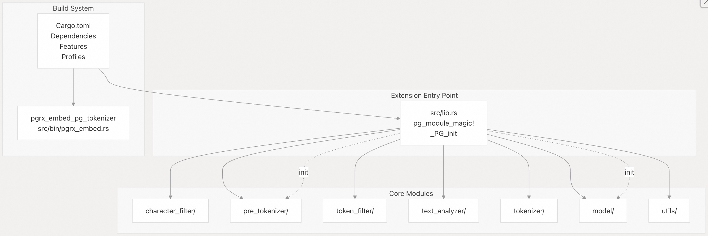
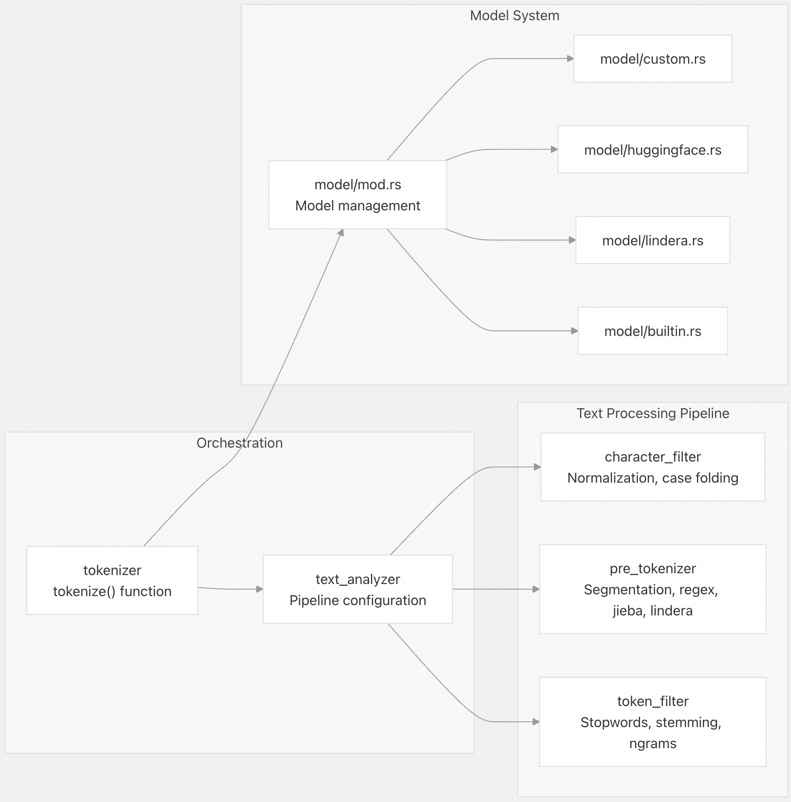
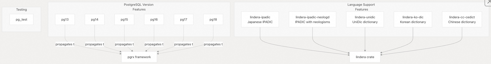
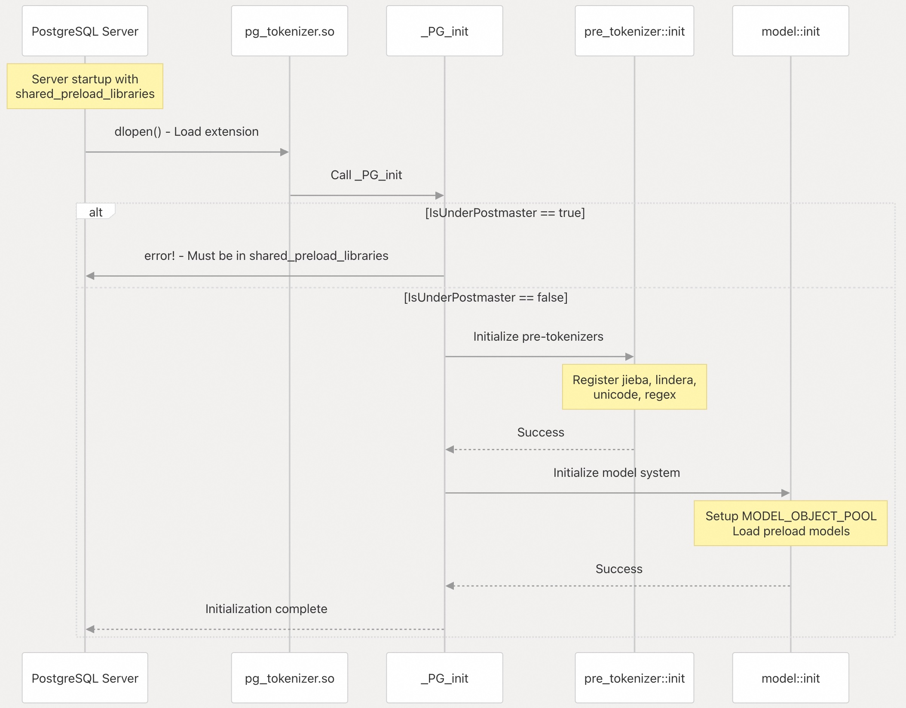
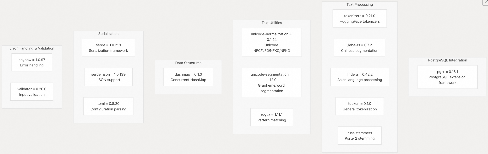
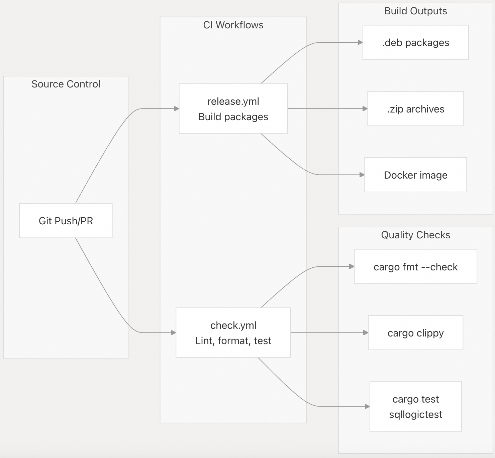

## pg_tokenizer 源码学习: 8 开发 (`Development`)  
                          
### 作者                          
digoal                          
                          
### 日期                          
2025-11-20                          
                          
### 标签                          
pg\_tokenizer , 词化 , bert , 标记化 , Tokenization                          
                          
----                          
                          
## 背景                          
本文提供了关于 `pg_tokenizer` 的开发架构 (`development architecture`)、构建系统 (`build system`) 和贡献工作流程 (`contribution workflow`) 的概述。它涵盖了技术栈 (`technology stack`)、项目结构 (`project structure`)、构建配置 (`build configuration`)、扩展初始化 (`extension initialization`) 和 CI/CD 流程 (`CI/CD pipeline`)。  
  
## 技术栈 (`Technology Stack`)  
  
`pg_tokenizer` 是作为一个 **PostgreSQL 扩展** (`PostgreSQL extension`) 构建的，使用了以下核心技术：  
  
| 技术 (`Technology`) | 用途 (`Purpose`) | 版本 (`Version`) |  
| :--- | :--- | :--- |  
| Rust | 实现语言 (`Implementation language`) | 2021 edition |  
| pgrx | PostgreSQL 扩展框架 (`extension framework`) | 0.16.1 |  
| PostgreSQL | 目标数据库 (`Target database`) | 版本 13-18 |  
| Cargo | 构建系统 (`Build system`) 和依赖管理 (`dependency management`) | 最新稳定版 (`Latest stable`) |  
  
该扩展要求 64 位小端序架构 (`64-bit little-endian architecture`)，并通过编译时检查在 [`src/lib.rs` 11-12](https://github.com/tensorchord/pg_tokenizer.rs/blob/d3f7a577/src/lib.rs#L11-L12) 强制执行此要求。  
  
**来源 (`Sources`):**  
[`Cargo.toml` 1-57](https://github.com/tensorchord/pg_tokenizer.rs/blob/d3f7a577/Cargo.toml#L1-L57)  
[`src/lib.rs` 11-22](https://github.com/tensorchord/pg_tokenizer.rs/blob/d3f7a577/src/lib.rs#L11-L22)  
  
## 项目结构 (`Project Structure`)  
  
### 扩展架构 (`Extension Architecture`)  
  
    
  
该扩展通过 [`src/lib.rs` 1-7](https://github.com/tensorchord/pg_tokenizer.rs/blob/d3f7a577/src/lib.rs#L1-L7) 导出模块 (`modules`)，并在 `_PG_init` 函数 (`function`) 中初始化关键组件 (`critical components`)，位置在 [`src/lib.rs` 24-32](https://github.com/tensorchord/pg_tokenizer.rs/blob/d3f7a577/src/lib.rs#L24-L32)。  
  
**来源 (`Sources`):**  
[`src/lib.rs` 1-32](https://github.com/tensorchord/pg_tokenizer.rs/blob/d3f7a577/src/lib.rs#L1-L32)  
[`Cargo.toml` 1-12](https://github.com/tensorchord/pg_tokenizer.rs/blob/d3f7a577/Cargo.toml#L1-L12)  
  
### 模块组织 (`Module Organization`)  
  
    
  
**来源 (`Sources`):**  
[`src/lib.rs` 1-7](https://github.com/tensorchord/pg_tokenizer.rs/blob/d3f7a577/src/lib.rs#L1-L7)  
  
## 构建配置 (`Build Configuration`)  
  
### 功能标志 (`Feature Flags`)  
  
该项目使用 Cargo **功能标志** (`feature flags`) 来控制 PostgreSQL 版本兼容性 (`version compatibility`) 和可选的语言支持 (`optional language support`)：  
  
    
  
**PostgreSQL 版本功能 (`Version Features`):** 在构建时 (`build time`) 必须精确选择一个 PostgreSQL 版本功能。如果没有选择，构建将失败，这在 [`src/lib.rs` 14-22](https://github.com/tensorchord/pg_tokenizer.rs/blob/d3f7a577/src/lib.rs#L14-L22) 中强制执行。每个功能都会传播到 `pgrx` 和 `pgrx-tests` 这两个依赖项 [`Cargo.toml` 14-19](https://github.com/tensorchord/pg_tokenizer.rs/blob/d3f7a577/Cargo.toml#L14-L19)。  
  
**语言支持功能 (`Language Support Features`):** 可选功能 (`Optional features`)，用于启用特定的 Lindera 词典 (`dictionaries`) 以进行亚洲语言处理 [`Cargo.toml` 21-25](https://github.com/tensorchord/pg_tokenizer.rs/blob/d3f7a577/Cargo.toml#L21-L25)。  
  
**来源 (`Sources`):**  
[`Cargo.toml` 13-25](https://github.com/tensorchord/pg_tokenizer.rs/blob/d3f7a577/Cargo.toml#L13-L25)  
[`src/lib.rs` 14-22](https://github.com/tensorchord/pg_tokenizer.rs/blob/d3f7a577/src/lib.rs#L14-L22)  
  
### 包类型配置 (`Crate Type Configuration`)  
  
该扩展被构建为 C 动态库 (`C dynamic library`) 和 Rust 库 (`Rust library`) 两种类型：  
  
| 包类型 (`Crate Type`) | 用途 (`Purpose`) |  
| :--- | :--- |  
| `cdylib` | 创建由 PostgreSQL 加载的 `.so` 共享库 (`shared library`) |  
| `lib` | 允许该包 (`crate`) 作为 Rust 库 (`Rust library`) 用于测试 (`testing`) |  
  
此配置定义在 [`Cargo.toml` 6-7](https://github.com/tensorchord/pg_tokenizer.rs/blob/d3f7a577/Cargo.toml#L6-L7) 中。  
  
**来源 (`Sources`):**  
[`Cargo.toml` 6-7](https://github.com/tensorchord/pg_tokenizer.rs/blob/d3f7a577/Cargo.toml#L6-L7)  
  
### 构建配置集 (`Build Profiles`)  
  
配置了两种构建配置集 (`build profiles`) 以满足不同的优化需求 (`optimization needs`)：  
  
| 配置集 (`Profile`) | 优化级别 (`Optimization Level`) | LTO | 代码生成单元 (`Codegen Units`) | 用例 (`Use Case`) |  
| :--- | :--- | :--- | :--- | :--- |  
| `release` | 3 | fat | 1 | 生产构建 (`Production builds`) - 性能最大化 |  
| `dev-opt` | 3 | thin | 8 | 开发构建 (`Development builds`) - 编译速度快且性能良好 |  
  
`release` 配置集 [`Cargo.toml` 47-50](https://github.com/tensorchord/pg_tokenizer.rs/blob/d3f7a577/Cargo.toml#L47-L50) 通过激进优化 (`aggressive optimization`) 优先考虑运行时性能 (`runtime performance`)，而 `dev-opt` [`Cargo.toml` 52-56](https://github.com/tensorchord/pg_tokenizer.rs/blob/d3f7a577/Cargo.toml#L52-L56) 则在编译速度 (`compilation speed`) 和开发时的运行时性能之间取得平衡。  
  
**来源 (`Sources`):**  
[`Cargo.toml` 47-56](https://github.com/tensorchord/pg_tokenizer.rs/blob/d3f7a577/Cargo.toml#L47-L56)  
  
## 扩展初始化 (`Extension Initialization`)  
  
### 初始化流程 (`Initialization Flow`)  
  
    
  
`_PG_init` 函数 [`src/lib.rs` 24-32](https://github.com/tensorchord/pg_tokenizer.rs/blob/d3f7a577/src/lib.rs#L24-L32) 是该扩展的入口点 (`entry point`)。它通过检查 `IsUnderPostmaster` 标志 [`src/lib.rs` 26-28](https://github.com/tensorchord/pg_tokenizer.rs/blob/d3f7a577/src/lib.rs#L26-L28) 来强制要求扩展必须通过 `shared_preload_libraries` 加载。此要求确保扩展在服务器启动时只加载一次，而不是按连接 (`per-connection`) 加载。  
  
**关键初始化步骤 (`Critical Initialization Steps`):**  
  
1.  **预分词器初始化 (`Pre-tokenizer Initialization`)** [`src/lib.rs` 30](https://github.com/tensorchord/pg_tokenizer.rs/blob/d3f7a577/src/lib.rs#L30-L30) - 注册 jieba、lindera、unicode 和 regex **预分词器** (`pre-tokenizers`)  
2.  **模型系统初始化 (`Model System Initialization`)** [`src/lib.rs` 31](https://github.com/tensorchord/pg_tokenizer.rs/blob/d3f7a577/src/lib.rs#L31-L31) - 设置 `MODEL_OBJECT_POOL` 并加载预加载模型 (`preload models`)  
  
**来源 (`Sources`):**  
[`src/lib.rs` 24-32](https://github.com/tensorchord/pg_tokenizer.rs/blob/d3f7a577/src/lib.rs#L24-L32)  
  
### 扩展加载要求 (`Extension Loading Requirement`)  
  
该扩展必须在 `postgresql.conf` 中的 `shared_preload_libraries` 中列出：  
  
```  
shared_preload_libraries = 'pg_tokenizer'  
```  
  
尝试动态加载扩展（例如，通过 `LOAD` 或 `CREATE EXTENSION` 而没有适当的预加载）将导致来自 [`src/lib.rs` 27](https://github.com/tensorchord/pg_tokenizer.rs/blob/d3f7a577/src/lib.rs#L27-L27) 的错误。  
  
**来源 (`Sources`):**  
[`src/lib.rs` 26-28](https://github.com/tensorchord/pg_tokenizer.rs/blob/d3f7a577/src/lib.rs#L26-L28)  
  
## 关键依赖项 (`Key Dependencies`)  
  
### 核心依赖项 (`Core Dependencies`)  
  
    
  
### 依赖项用途 (`Dependency Purposes`)  
  
| 类别 (`Category`) | 依赖项 (`Dependency`) | 用途 (`Purpose`) |  
| :--- | :--- | :--- |  
| **PostgreSQL 集成** (`Integration`) | `pgrx` | 用于 PostgreSQL 扩展的 Rust 框架 (`framework`) |  
| **文本处理** (`Text Processing`) | `tokenizers` | HuggingFace 分词器 (`tokenizers`) 集成 |  
| | `jieba-rs` | 中文文本分词 (`segmentation`) |  
| | `lindera` | 日语、韩语和中文分词 (`tokenization`) |  
| | `tocken` | 通用分词 (`General-purpose tokenization`) |  
| | `rust-stemmers` | Porter2 词干提取算法 (`stemming algorithm`) (自定义分支/`custom fork`) |  
| **Unicode 处理** (`Handling`) | `unicode-normalization` | Unicode 标准化形式 (`normalization forms`) |  
| | `unicode-segmentation` | **字素** (`Grapheme`) 和词边界检测 (`word boundary detection`) |  
| **并发** (`Concurrency`) | `dashmap` | 用于模型缓存 (`model caching`) 的无锁并发 HashMap (`Lock-free concurrent HashMap`) |  
| **配置** (`Configuration`) | `toml` | TOML 配置文件解析 (`parsing`) |  
| **序列化** (`Serialization`) | `serde`, `serde_json` | 对象序列化 (`Object serialization`) 和 JSON 处理 (`handling`) |  
| **实用程序** (`Utilities`) | `regex` | 正则表达式 (`Regular expression`) 支持 |  
| | `anyhow` | 符合人体工程学的错误处理 (`Ergonomic error handling`) |  
| | `validator` | 带派生宏 (`derive macros`) 的输入验证 (`Input validation`) |  
  
**自定义分支 (`Custom Fork`):** 该项目使用了 TensorChord 仓库中 `rust-stemmers` 的一个自定义分支 [`Cargo.toml` 34](https://github.com/tensorchord/pg_tokenizer.rs/blob/d3f7a577/Cargo.toml#L34-L34)，其中包含了针对 PostgreSQL 兼容性 (`compatibility`) 的修改。  
  
**来源 (`Sources`):**  
[`Cargo.toml` 27-42](https://github.com/tensorchord/pg_tokenizer.rs/blob/d3f7a577/Cargo.toml#L27-L42)  
  
### 开发依赖项 (`Development Dependencies`)  
  
用于测试 (`testing`)，该扩展使用：  
  
  * `pgrx-tests = 0.16.1` [`Cargo.toml` 45](https://github.com/tensorchord/pg_tokenizer.rs/blob/d3f7a577/Cargo.toml#L45-L45) - 适用于 pgrx 扩展的集成测试框架 (`Integration testing framework`)  
  
**来源 (`Sources`):**  
[`Cargo.toml` 44-45](https://github.com/tensorchord/pg_tokenizer.rs/blob/d3f7a577/Cargo.toml#L44-L45)  
  
## 测试配置 (`Test Configuration`)  
  
### 测试设置 (`Test Setup`)  
  
该扩展包含一个 `pg_test` 模块 [`src/lib.rs` 34-44](https://github.com/tensorchord/pg_tokenizer.rs/blob/d3f7a577/src/lib.rs#L34-L44)，用于配置 pgrx 测试框架 (`testing framework`)：  
  
```rust  
// Test initialization function  
pub fn setup(_options: Vec<&str>) {  
    // perform one-off initialization when the pg_test framework starts  
}  
  
// PostgreSQL configuration for tests  
pub fn postgresql_conf_options() -> Vec<&'static str> {  
    vec![r#"search_path = '"$user", public, tokenizer_catalog'"#]  
}  
```  
  
该测试配置将 `tokenizer_catalog` 模式 (`schema`) 添加到搜索路径 (`search path`) [`src/lib.rs` 42](https://github.com/tensorchord/pg_tokenizer.rs/blob/d3f7a577/src/lib.rs#L42-L42) 中，确保测试查询 (`test queries`) 可以访问 **目录表** (`catalog tables`)，而无需模式限定 (`schema qualification`)。  
  
**来源 (`Sources`):**  
[`src/lib.rs` 34-44](https://github.com/tensorchord/pg_tokenizer.rs/blob/d3f7a577/src/lib.rs#L34-L44)  
  
## CI/CD 流程概述 (`CI/CD Pipeline Overview`)  
  
### 构建矩阵 (`Build Matrix`)  
  
CI/CD 系统在多个维度 (`dimensions`) 上构建扩展：  
  
| 维度 (`Dimension`) | 值 (`Values`) | 数量 (`Count`) |  
| :--- | :--- | :--- |  
| PostgreSQL 版本 (`Version`) | 13, 14, 15, 16, 17, 18 | 6 |  
| 架构 (`Architecture`) | x86\_64, aarch64 | 2 |  
| **总配置数量** (`Total Configurations`) | | **12** |  
  
### 流程结构 (`Pipeline Structure`)  
  
    
  
有关发布工作流程 (`release workflow`) 和工件生成 (`artifact generation`) 的详细信息，请参阅 [发布流程 (Release Process)](/tensorchord/pg_tokenizer.rs/8.3-release-process)。  
  
**来源 (`Sources`):** 基于系统架构图 (`system architecture diagrams`)  
  
## pgrx 二进制文件 (`pgrx Binary`)  
  
该项目包含一个 pgrx **嵌入式二进制文件** (`embedding binary`) [`Cargo.toml` 9-11](https://github.com/tensorchord/pg_tokenizer.rs/blob/d3f7a577/Cargo.toml#L9-L11)，位于 `src/bin/pgrx_embed.rs`。该二进制文件 (`binary`) 被 pgrx 框架用于扩展开发和测试工作流程 (`testing workflows`)。  
  
**来源 (`Sources`):**  
[`Cargo.toml` 9-11](https://github.com/tensorchord/pg_tokenizer.rs/blob/d3f7a577/Cargo.toml#L9-L11)  
  
## 架构要求 (`Architecture Requirements`)  
  
该扩展强制执行严格的架构要求 (`architecture requirements`)：  
  
```  
#[cfg(not(all(target_endian = "little", target_pointer_width = "64")))]  
compile_error!("Target is not supported.");  
```  
  
此编译时检查 (`compile-time check`) [`src/lib.rs` 11-12](https://github.com/tensorchord/pg_tokenizer.rs/blob/d3f7a577/src/lib.rs#L11-L12) 确保扩展只在 64 位小端序系统 (`64-bit little-endian systems`) 上构建，这涵盖了 x86\_64 和 aarch64 Linux 平台。  
  
**来源 (`Sources`):**  
[`src/lib.rs` 11-12](https://github.com/tensorchord/pg_tokenizer.rs/blob/d3f7a577/src/lib.rs#L11-L12)  
  
-----  
  
# 附录: 基于构建约束的运维兼容性问题  
鉴于构建配置中明确要求在编译时必须精确选择**一个** PostgreSQL 版本功能（例如 `pg13` 或 `pg18`），从用户的角度来看，这给实际运维带来了什么影响？  
  
具体来说，如果用户需要**升级**他们的 PostgreSQL 服务器，或者在同一台主机上通过容器等方式运行**多个**不同 PostgreSQL 版本，他们将如何有效管理或部署这些需要针对特定版本编译的 `pg_tokenizer.rs` 扩展？这种严格的编译绑定是否意味着用户必须为每个 PostgreSQL 大版本维护和安装一个独立的扩展副本？  
  
**价值分析:**  
  
1.  **关联核心技术细节:** 问题直接引用了“**Feature Flags**”部分的核心约束：“必须精确选择一个 PostgreSQL 版本功能”。  
2.  **关注用户痛点:** 提问关注了实际生产环境中常见的两个高价值场景：**数据库升级**（需要新的扩展版本）和**多版本共存**（需要多个扩展版本）。  
3.  **直指运维复杂性:** 这个问题能帮助用户理解扩展在不同 PostgreSQL 版本间的兼容性和部署策略，从而评估其维护成本和灵活性。  
  
  
## 回答  
这个问题涉及 `pg_tokenizer.rs` 扩展的构建配置要求——在编译时必须选择一个特定的 PostgreSQL 版本特性（如 `pg13` 到 `pg18`），以及这对实际运维的影响。    
  
是的,用户必须为每个 PostgreSQL 大版本维护和安装一个独立的扩展副本。这是由扩展的编译时绑定机制决定的。    
  
### 运维影响  
  
**1. 版本升级场景**  
  
当升级 PostgreSQL 服务器时,您需要:  
  
- 下载或编译对应新版本的扩展包    
- 安装新版本的 `.deb` 或 `.zip` 包    
- 重启 PostgreSQL 服务以加载新扩展    
  
**2. 多版本共存场景**  
  
在同一主机上运行多个 PostgreSQL 版本时:  
  
- 每个版本的扩展文件安装到不同的目录路径    
- Debian 包命名包含版本号:`postgresql-${VERSION}-pg-tokenizer_${SEMVER}-1_${PLATFORM}.deb`    
- 共享库和 SQL 文件分别安装到 `/usr/lib/postgresql/$VERSION/lib/` 和 `/usr/share/postgresql/$VERSION/extension/`    
  
**3. 发布流程支持**  
  
项目的 CI/CD 流程已经考虑到这一需求:  
  
- Release workflow 为 5 个 PostgreSQL 版本(14-18)和 2 个架构构建共 10 个不同的包    
- 每个构建使用对应的版本特性标志:`cargo build --lib --features pg$VERSION --release`    
- 生成的包文件名明确标识 PostgreSQL 版本   
  
### 推荐的部署策略  
  
**使用 Docker**:最简单的方式是使用官方 Docker 镜像,它已预装对应版本的扩展    
  
**包管理器**:使用 Debian 包时,包名包含 PostgreSQL 版本,可以并行安装多个版本而不会冲突    
  
## Notes  
  
这种编译时版本绑定是 pgrx 框架的设计决策,因为 PostgreSQL 的内部 API 在不同大版本间可能不兼容。  扩展必须在 `_PG_init()` 时通过 `shared_preload_libraries` 加载   ,这进一步强化了版本绑定的必要性。  
  
项目的 CI 矩阵在检查阶段测试 6 个版本(13-18)   ,但发布时只构建 5 个版本(14-18)  ,说明 PostgreSQL 13 可能不再被官方支持用于生产部署。  
    
#### [PolarDB 学习图谱](https://www.aliyun.com/database/openpolardb/activity "8642f60e04ed0c814bf9cb9677976bd4")
  
  
#### [PostgreSQL 解决方案集合](../201706/20170601_02.md "40cff096e9ed7122c512b35d8561d9c8")
  
  
#### [德哥 / digoal's Github - 公益是一辈子的事.](https://github.com/digoal/blog/blob/master/README.md "22709685feb7cab07d30f30387f0a9ae")
  
  
#### [About 德哥](https://github.com/digoal/blog/blob/master/me/readme.md "a37735981e7704886ffd590565582dd0")
  
  

  
