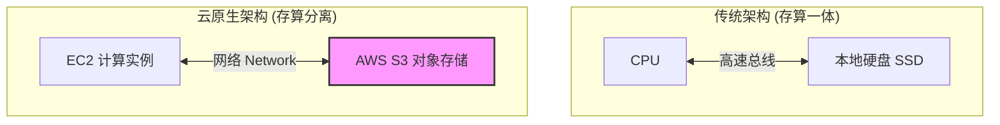
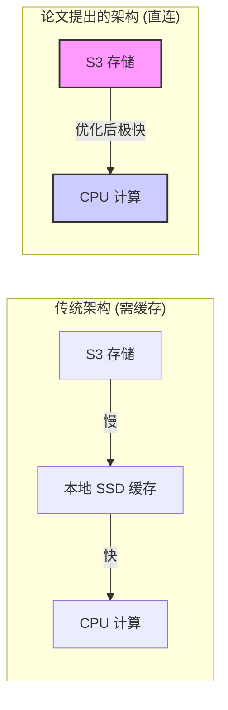
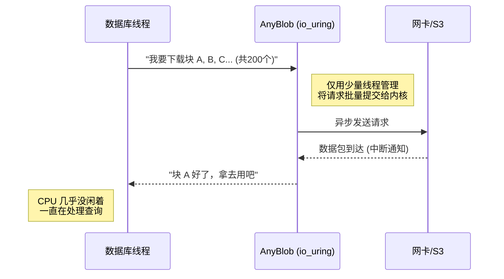

## AI论文解读 | Exploiting Cloud Object Storage for High-Performance Analytics
        
### 作者        
digoal        
        
### 日期        
2025-11-21        
        
### 标签        
PostgreSQL , PolarDB , DuckDB , AI , 论文解读        
        
----        
        
## 背景  
      
https://www.vldb.org/pvldb/vol16/p2769-durner.pdf        
  
提示:          
```          
读懂《Exploiting Cloud Object Storage for High-Performance Analytics》这篇论文需要提前掌握哪些基础知识, 请使用中文通熟易懂的讲解这些基础知识, 可以引用论文中的图、表或使用Markdown支持的图形(text,mermaid等)增加解释性. 
  
使用中文通熟易懂的解读《Exploiting Cloud Object Storage for High-Performance Analytics》这篇论文, 其中的关键内容请着重讲解, 可以引用论文中的图、表或使用Markdown支持的图形(text,mermaid等)增加解释性. 
  
提取《Exploiting Cloud Object Storage for High-Performance Analytics》这篇论文中的重要术语, 使用中文对这些术语进行通熟易懂的讲解, 可以引用论文中的图、表或使用Markdown支持的图形(text,mermaid等)增加解释性. 
```     
  
## 1 前置知识 
  
阅读这篇论文《Exploiting Cloud Object Storage for High-Performance Analytics》（利用云对象存储进行高性能分析），你需要掌握四个核心领域的背景知识：**云基础架构、网络I/O模型、数据库存储引擎**以及**并发调度**。

这篇论文的核心论点是：通过极致的软件优化（AnyBlob库），可以让云对象存储（如AWS S3）在分析型数据库中达到接近本地SSD的性能 。

以下是通俗易懂的背景知识讲解：

-----

### 1\. 存算分离架构 (Disaggregated Storage)

#### 概念

传统数据库将数据存储在运行数据库软件的同一台服务器的硬盘上（存算一体）。而现代云原生数据库倾向于**存算分离**：

  * **计算层 (Compute):** 只负责“思考”（CPU运算），不保存长期数据。
  * **存储层 (Storage):** 只负责“记忆”（保存数据），通常使用云对象存储（如AWS S3）。

#### 为什么这很重要？

论文全篇都在讨论如何解决存算分离带来的挑战。

  * **好处：** 弹性。计算不够加CPU，存储不够加S3，互不影响，且S3极其便宜（约\$23/TiB/月）且耐用 。
  * **坏处：** 慢。数据要通过网络传输，比本地硬盘（NVMe SSD）远得多。




-----

### 2\. 对象存储的物理特性：带宽 vs. 延迟

这是理解论文中最关键的物理限制。

#### 基础知识

  * **对象存储 (Object Storage):** 不像文件系统那样有文件夹层级，它通过HTTP协议（GET/PUT）存取“对象”（文件块）。
  * **延迟 (Latency):** 发出请求到收到第一个字节的时间。S3的延迟很高（几十毫秒），比本地硬盘慢几个数量级 。
  * **带宽 (Bandwidth):** 数据传输的“管道”宽度。现代云服务器的网络带宽非常大（如100 Gbit/s）。

#### 论文中的挑战

这就好比我们要用一根**非常粗**（高带宽）但**非常长**（高延迟）的水管来注水。如果你一次只开一个水龙头（单线程请求），水要很久才能流过来，且装不满管子。

**论文的解法（见下图）：** 为了填满带宽（Bandwidth），必须同时发起成百上千个请求（Concurrency）。

*论文中的图表复刻示意（基于图10）：* 

  

> **解释：** 必须并发约200-250个请求，才能把100 Gbit/s的带宽跑满 。

-----

### 3\. 异步 I/O 与 `io_uring` (Linux Kernel)

这是论文核心贡献工具 **AnyBlob** 的技术基石。

#### 基础知识

当程序向S3请求数据时，CPU该干什么？

  * **同步 I/O (Blocking):** 线程发出请求后，像傻瓜一样等着，直到数据回来。这会浪费大量CPU资源在“等待”上。
  * **异步 I/O (Asynchronous):** 线程发出请求后，立刻去干别的，操作系统会在数据到货时通知线程。
  * **`io_uring`:** 这是Linux内核（5.1版本后）提供的一种极高性能的异步接口。它使用“环形缓冲区”（Ring Buffer）来减少用户空间（App）和内核空间（OS）之间的交互开销（System Call Overhead）。

#### 论文中的应用

论文指出，传统的下载库（如AWS SDK）会为每个请求开启新线程，导致CPU上下文切换开销巨大 。
作者开发的 **AnyBlob** 库利用 `io_uring`，仅用极少的线程就能管理成百上千个并发网络请求，从而省下CPU去处理SQL查询 。

*基于论文 Figure 11 的简化流程：*    

1.  **提交 (Submit):** 将“我要下载X对象”的请求放入 `io_uring` 队列。
2.  **处理 (Process):** 内核网卡默默下载，不打扰CPU。
3.  **完成 (Complete):** 下载完后，放入完成队列，通知数据库引擎使用数据。

-----

### 4\. OLAP 数据库引擎基础

论文是将上述技术集成到名为 **Umbra** 的数据库中，你需要了解以下概念：

#### 列式存储 (Columnar Storage)

  * **OLAP (分析型):** 通常需要扫描几亿行数据，但只用其中几列（例如：“计算全年的平均销售额”，只需要“销售额”这一列）。
  * **列存:** 数据按列存储。
  * **论文优化:** 针对S3计费特点（按请求次数收费），不能把数据切太碎。论文计算出 **8-16 MiB** 是最佳的请求大小块，既省钱又能跑满带宽 。

#### 扫描算子与调度 (Scan Operator & Scheduler)

  * **Table Scan:** 数据库中最基础的操作，读取全表数据。
  * **Morsel-driven Parallelism (Morsel驱动的并行):** 把大任务切成一个个极小的任务包（Morsel）。
  * **Pipeline (流水线):** 理想状态是“一边从S3下载，一边CPU处理数据”。
  * **论文的调度器 (Object Scheduler):** 它是一个智能管家，动态决定当前线程是去“下载数据”还是“处理数据”，以防止CPU空转或网络堵塞 。

-----

### 总结：如何串联这些知识读论文？

当你阅读这篇论文时，请遵循以下逻辑链条：

1.  **背景：** 我们想在云上（**存算分离**）做高性能数据分析，因为S3便宜且耐用。
2.  **问题：** S3 延迟高，导致CPU经常没事干（等待数据）。现有的库（AWS SDK）太耗CPU，抢占了查询计算的资源。
3.  **物理层优化：** 为了克服延迟，必须高并发下载（**带宽原理**）。
4.  **系统层优化：** 为了高并发下载不耗尽CPU，开发了 **AnyBlob**，利用 Linux **`io_uring`** 实现高效异步I/O。
5.  **数据库层优化：** 修改数据库的 **Scan Operator**，配合 **调度器**，让下载和计算完美重叠，把S3当成本地内存来用。

**建议下一步：**
如果您对 `io_uring` 不熟悉，建议先简单搜索一下它的基本工作原理图，这对理解论文第三章（AnyBlob Design）至关重要。
  
## 2 解读论文 
  
这篇论文《Exploiting Cloud Object Storage for High-Performance Analytics》（利用云对象存储进行高性能分析）的核心目标非常明确：**证明在云端数据库中，我们不需要昂贵的本地硬盘做缓存，直接从廉价的对象存储（如 AWS S3）读取数据，也能实现顶级的分析性能。**

以下是对这篇论文的通俗解读，重点讲解其关键创新点。

-----

### 1\. 核心背景：为什么要这么做？

**传统观念：** 云对象存储（如 AWS S3, Google Cloud Storage）虽然便宜且容量无限，但通常被认为**太慢了**，只适合用来做冷备份。为了跑得快，数据库系统（如 Snowflake, Redshift）通常会把数据从 S3 拉取到本地的高速硬盘（NVMe SSD）上做缓存，然后再进行计算 。

**现在的变化：** 云环境的网络带宽飞速增长。现在 AWS 的 EC2 实例已经可以达到 **100 Gbit/s**（约 12.5 GB/s）的带宽 。这个速度已经快追上本地硬盘了。

**论文的论点：** 既然网络这么快，如果我们能把这 100 Gbit/s 的带宽跑满，是不是就不用本地硬盘做缓存了？这样不仅**省钱**（S3 比 SSD 便宜得多），而且**更弹性**（计算节点随时可以关掉，不用担心丢失本地缓存的数据）。



-----

### 2\. 关键挑战：为什么直接读 S3 很难？

要把 100 Gbit/s 的网络带宽跑满，并不容易。作者发现了两个主要拦路虎：

1.  **延迟高 (Latency):** 发送一个请求到收到数据，S3 的反应很慢（几十毫秒）。如果你一次只发一个请求，大部分时间都在“等”，带宽根本用不起来 。
2.  **CPU 开销大 (CPU Overhead):** 通过网络下载数据比从本地硬盘读数据更消耗 CPU。如果 CPU 都在忙着处理网络包，就没有资源去处理 SQL 查询了 。

-----

### 3\. 核心贡献一：摸清云存储的“脾气” (实证研究)

作者对 AWS S3 进行了深度体检，得出了跑满带宽的“秘方”：

  * **秘方 1：高并发 (High Concurrency)**
    单次请求就像一根细水管，填不满大泳池。为了达到 100 Gbit/s，必须同时保持**数百个**（约 200-250 个）正在进行的请求 。

  * **秘方 2：最佳请求大小 (Optimal Request Size)**

      * 请求太小（如 1KB）：按请求次数计费，成本会爆炸。
      * 请求太大（如 100MB）：延迟太高，容易阻塞。
      * **结论：** **8 MiB 到 16 MiB** 是性价比最高的“黄金区间” 。


*(基于论文发现：必须有数百个并发请求才能触达带宽上限)*

-----

### 4\. 核心贡献二：神器 AnyBlob (低开销下载库)

既然需要数百个并发请求，如果用传统的编程方式（一个请求开一个线程），CPU 光是进行线程切换就累死了。
为此，作者开发了一个名为 **AnyBlob** 的下载库 。

**技术核心：**

  * **使用 `io_uring`：** 这是 Linux 内核的一项新技术，允许进行完全**异步**的系统调用 。
  * **效果：** AnyBlob 不用为每个请求开线程。它只用很少的几个线程，就能管理成百上千个并发下载任务。
  * **对比：** 相比 AWS 官方提供的 SDK，AnyBlob 在达到同样吞吐量的情况下，**节省了约 30% 的 CPU 资源** 。这就把宝贵的 CPU 留给了数据库去跑 SQL。

*下图展示了 AnyBlob 如何利用异步机制（引用论文图 11 的逻辑）：*

  



-----

### 5\. 核心贡献三：数据库集成蓝图 (Integration Blueprint)

光有下载库还不够，数据库引擎（Umbra）需要配合修改，形成一个流水线：

1.  **智能调度器 (Object Scheduler):** 这是一个“管家”，它会动态平衡“下载”和“计算”。
      * 如果数据下载太慢，它就派更多线程去下载。
      * 如果数据处理不过来，它就让线程回来做计算 。
2.  **数据预取 (Overpreparation):** 总是提前下载好下一步需要的数据，确保 CPU 永远不等待数据 。
3.  **列式存储优化:** 数据库的文件格式被重新设计，确保每个数据块（Column Chunk）的大小正好落在前文提到的 **8-16 MiB** 黄金区间 。

-----

### 6\. 实验结果与总结

**结果惊人：**

  * **速度：** 在没有任何本地缓存（Cold Run）的情况下，改造后的 Umbra 数据库直接读 S3 的性能，**可以媲美**那些使用了本地 SSD 缓存的商业云数据仓库（如 Snowflake）。
  * **成本：** S3 的存储成本极低（约 $23/TiB/月），而且不需要为了存储购买昂贵的带大硬盘的 EC2 实例 。

**一句话总结：**
这篇论文证明了，通过**极度优化的软件栈（AnyBlob + io\_uring）和高并发策略**，我们可以打破“云存储太慢”的刻板印象，实现**存算分离**架构下的高性能低成本分析。
  
## 3 术语 
  
基于论文《Exploiting Cloud Object Storage for High-Performance Analytics》，我为你提取了该研究中最核心的术语。为了让你更直观地理解，我将它们分为了**基础架构**、**核心软件技术**和**数据库优化**三个类别进行讲解。

### 一、 基础架构类术语

#### 1\. Disaggregated Storage (存算分离 / 分布式对象存储)

  * **通俗解释**：
    传统的数据库通常把数据存放在自己那台机器的硬盘里（存算一体）。而“存算分离”就像是把“大脑”（CPU计算资源）和“记忆”（硬盘存储资源）分开租用 。
      * **大脑**：可以是亚马逊 AWS 的 EC2 实例，随时可以开机、关机或换个更快的脑子。
      * **记忆**：使用云对象存储（如 S3），它的容量无限大，而且比买硬盘便宜得多 。
  * **论文中的意义**：这是整篇论文的基础场景。作者的目标就是证明在这种架构下，不需要本地硬盘做缓存，直接从“远处的记忆”（S3）读取数据也能跑得飞快 。

#### 2\. Cloud Object Store / S3 (云对象存储)

  * **通俗解释**：
    它不像我们电脑里的文件夹（C盘/D盘）那样有层级结构，它更像是一个巨大的、扁平的仓库。你给它一个唯一的 ID（Key），它给你一段数据（Object）。
      * **特点**：它很便宜，数据很安全（11个9的持久性），但是它的“反射弧”很长（高延迟），不过一旦开始传输，它的“流量”很大（高带宽）。
  * **关键限制**：S3 是按请求次数收费的。如果你每次只取 1KB 的数据，发一万次请求，费用会爆炸；如果你一次取 10MB，费用就很低。这直接影响了论文对“最佳请求大小”的选择 。

-----

### 二、 核心软件技术类术语 (AnyBlob)

这是论文作者为了解决云存储“反射弧长”和“CPU消耗大”而开发的秘密武器。

#### 3\. AnyBlob

  * **通俗解释**：
    这是作者开发的一个**高性能下载管理器**库 。
    你可以把它想象成一个“超级下载器”。普通的下载器（如 AWS SDK）每下载一个文件就要雇一个工人（线程），当你要并发下载几百个文件时，管理这些工人的开销（CPU上下文切换）非常大。
    **AnyBlob** 的做法是只雇几个精英工人，利用一种叫 `io_uring` 的技术，每个人同时盯着几十个下载任务。
  * **核心优势**：
    1.  **省 CPU**：比官方库少用约 30% 的 CPU 。
    2.  **跑满带宽**：轻松跑满 100 Gbit/s 的网络带宽 。
    3.  **多云支持**：一套代码通吃 AWS、Google Cloud、Azure 等 。

#### 4\. io\_uring (异步 I/O 接口)

  * **通俗解释**：
    这是 Linux 系统内核提供的一种“黑科技”接口 。
      * **传统方式**：程序告诉操作系统“我要读这个文件”，然后程序就傻等着（阻塞），或者不断去问操作系统“好了没？”。这很费劲。
      * **io\_uring 方式**：程序在内存里放一张“任务清单”（Submission Queue），操作系统默默把任务做完，然后把结果填到“完成清单”（Completion Queue）里 。

> AnyBlob 利用 `io_uring` 实现了**零线程超额订阅**（zero thread oversubscription），即不需要开启成百上千个线程来维持高并发请求 。

-----

### 三、 数据库优化与调度类术语

为了配合 AnyBlob，作者修改了名为 Umbra 的数据库系统。

#### 5\. Cost-throughput Optimal Request Size (性价比最优请求大小)

  * **通俗解释**：
    每次去云仓库（S3）取货都有固定成本（API 调用费）和时间成本（延迟）。
      * 取太少（如 1KB）：光路费（API费用）就亏死你，而且来回跑太浪费时间。
      * 取太多（如 100MB）：一旦网络堵车，整个系统都得等你这一车货。
      * **结论**：作者通过实验算出，**8 MiB 到 16 MiB** 是最完美的“黄金尺寸”，既省钱又能跑满速度 。

#### 6\. Object Scheduler (对象调度器)

  * **通俗解释**：
    这是数据库里的“智能管家”。在数据库运行时，CPU 既要负责计算（比如把销售额加起来），又要负责去指挥下载数据。
    如果大家都在埋头计算，数据可能供不上；如果大家都在等下载，CPU 就闲置了。
    **对象调度器**会动态观察现状：
      * 如果网络还没跑满，就派更多人去下载（Retrieval Job）。
      * 如果数据已经够多了，就喊人回来做计算（Processing Job）。

#### 7\. Request Hedging (请求对冲)

  * **通俗解释**：
    在云端，偶尔会有几个请求特别慢（长尾延迟），就像快递偶尔会丢件或者卡在路上。
      * **做法**：如果一个请求过了正常时间（比如 600ms）还没回来，系统不会傻等，而是立刻发出一个**一模一样的备份请求**。
      * **结果**：谁先回来就用谁的数据。因为这种“慢请求”很少见（不到 5%），所以多发一次请求的成本几乎可以忽略，但能保证系统不被卡住 。

#### 8\. Overpreparation (超额准备/预取)

  * **通俗解释**：
    为了不让 CPU 停下来等数据（Stall），调度器总是会**提前**下载比当前需要稍微多一点的数据。
      * **策略**：确保正在下载的数据量（Outstanding Request）至少是网络带宽上限的 2 倍 。这就像煮饺子，锅里总是预备着下一碗，确保吃的人（CPU）永远不用放下筷子等。
  
## 参考        
         
https://www.vldb.org/pvldb/vol16/p2769-durner.pdf    
        
<b> 以上内容基于DeepSeek、Qwen、Gemini及诸多AI生成, 轻微人工调整, 感谢杭州深度求索人工智能、阿里云、Google等公司. </b>        
        
<b> AI 生成的内容请自行辨别正确性, 当然也多了些许踩坑的乐趣, 毕竟冒险是每个男人的天性.  </b>        
    
#### [PolarDB 学习图谱](https://www.aliyun.com/database/openpolardb/activity "8642f60e04ed0c814bf9cb9677976bd4")
  
  
#### [PostgreSQL 解决方案集合](../201706/20170601_02.md "40cff096e9ed7122c512b35d8561d9c8")
  
  
#### [德哥 / digoal's Github - 公益是一辈子的事.](https://github.com/digoal/blog/blob/master/README.md "22709685feb7cab07d30f30387f0a9ae")
  
  
#### [About 德哥](https://github.com/digoal/blog/blob/master/me/readme.md "a37735981e7704886ffd590565582dd0")
  
  

  
