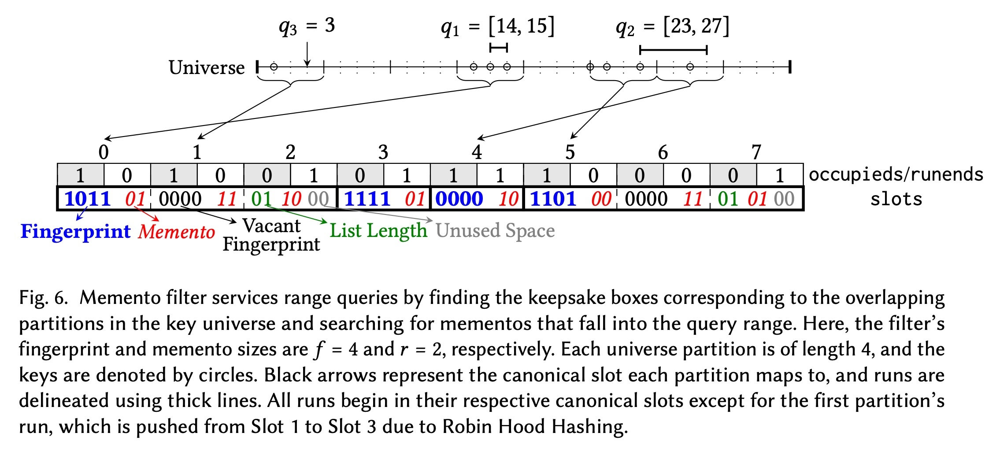
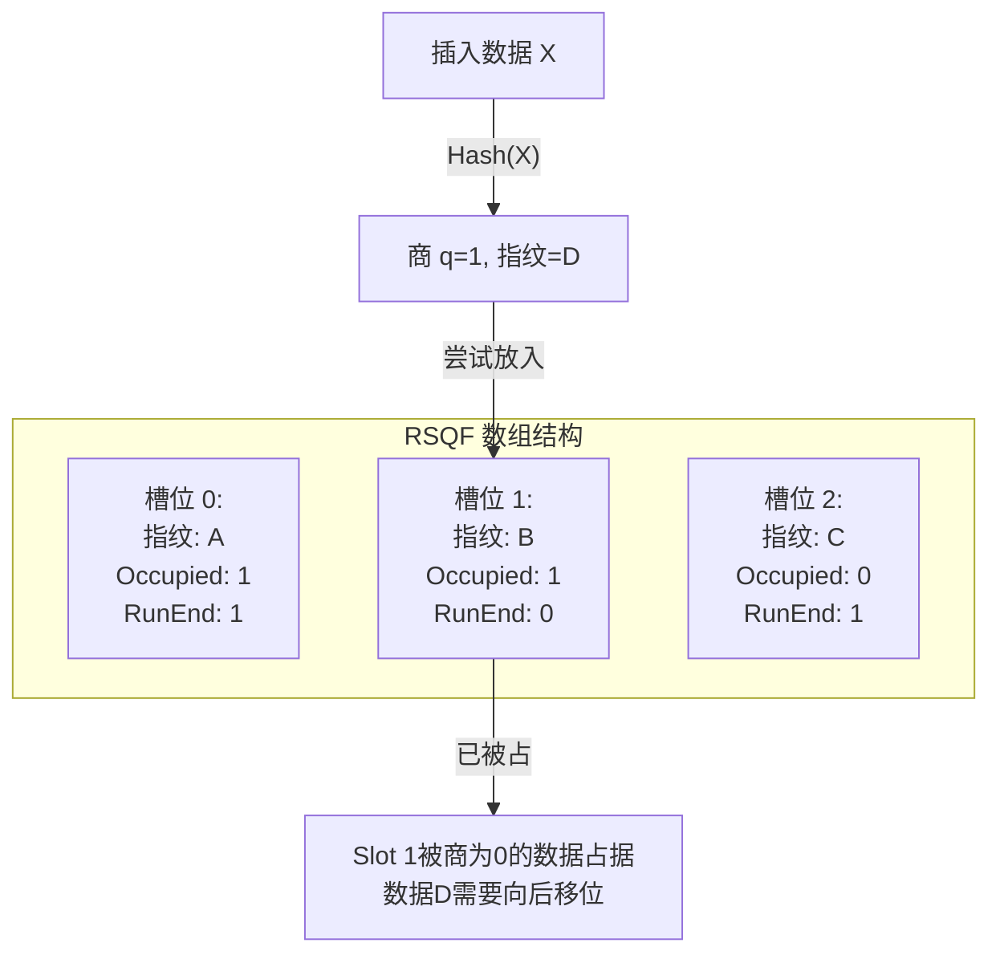
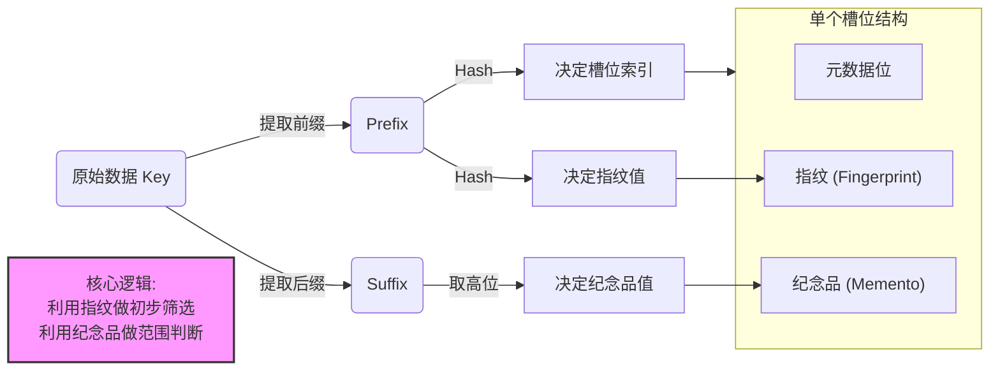
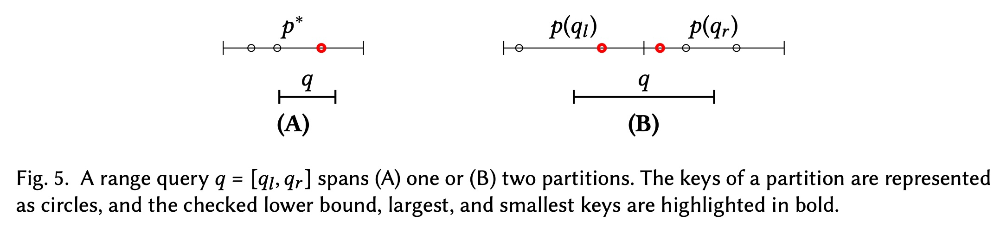
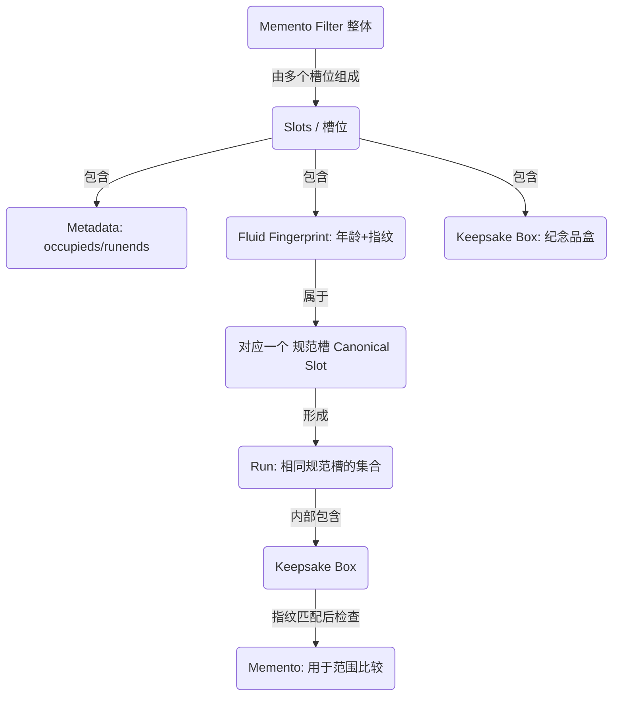

## AI论文解读 | Memento Filter: A Fast, Dynamic, and Robust Range Filter
        
### 作者        
digoal        
        
### 日期        
2025-11-21        
        
### 标签        
PostgreSQL , PolarDB , DuckDB , AI , 论文解读        
        
----        
        
## 背景  
      
https://arxiv.org/pdf/2408.05625        
  
提示:          
```          
读懂《Memento Filter: A Fast, Dynamic, and Robust Range Filter》这篇论文需要提前掌握哪些基础知识, 请使用中文通熟易懂的讲解这些基础知识, 可以引用论文中的图、表或使用Markdown支持的图形(text,mermaid等)增加解释性. 
  
使用中文通熟易懂的解读《Memento Filter: A Fast, Dynamic, and Robust Range Filter》这篇论文, 其中的关键内容请着重讲解, 可以引用论文中的图、表或使用Markdown支持的图形(text,mermaid等)增加解释性. 
  
提取《Memento Filter: A Fast, Dynamic, and Robust Range Filter》这篇论文中的重要术语, 使用中文对这些术语进行通熟易懂的讲解, 可以引用论文中的图、表或使用Markdown支持的图形(text,mermaid等)增加解释性. 
```     
  
## 1 前置知识 
  
阅读《Memento Filter: A Fast, Dynamic, and Robust Range Filter》这篇论文，需要你具备一些特定的数据结构与算法背景知识。这篇论文提出了一种基于 **RSQF (Rank-and-Select Quotient Filter)** 的新型范围过滤器。

为了帮助你轻松理解，我将这些基础知识拆解为几个通俗易懂的模块，并配合图示进行讲解。

-----

### 1\. 过滤器的基本概念：从点查询到范围查询

在深入论文之前，首先要理解“过滤器”解决了什么问题。

#### **基础：布隆过滤器 (Bloom Filter)**

最经典的过滤器是布隆过滤器。它的作用是快速告诉你“这个数据**绝对不**在这里”或者“**可能**在这里”。

  * **点查询 (Point Query):** 比如查询 `x = 5` 是否存在。
  * **局限性:** 传统的布隆过滤器使用了哈希函数，哈希会将数据打散，导致数据原本的“顺序”丢失。因此，它无法支持范围查询（比如查询 `5 <= x <= 10` 之间有没有数据）。

#### **进阶：范围过滤器 (Range Filter)**

Memento Filter 的核心目标是支持**范围查询** 。

  * **场景:** 数据库查询 `SELECT * FROM table WHERE age BETWEEN 20 AND 30`。
  * **挑战:** 如果数据不在磁盘上，我们希望能通过一个极小的内存结构（过滤器）快速判断出“这范围内肯定没数据”，从而避免昂贵的磁盘I/O操作 。
  * **核心指标:**
    1.  **FPR (False Positive Rate):** 误判率。过滤器说“有”，但实际上磁盘里“没有”的概率。
    2.  **动态性 (Dynamicity):** 能否支持随时插入(Insert)和删除(Delete)数据 。

-----

### 2\. 核心引擎：商过滤器 (Quotient Filter) 与 RSQF

这是理解 Memento Filter 最**关键**的前置知识。论文明确指出 Memento Filter 是建立在 **RSQF** 之上的 。

#### **什么是商过滤器 (Quotient Filter)?**

商过滤器通过哈希将元素映射到数组的槽位（Slot）中。假设哈希函数计算出的值为 $H(x)$ ，我们将其拆分为两部分：

  * **商 ( Quotient, $q$ ):** 用作数组的**索引**（即数据应该放在哪个位置，称为“规范槽 Canonical Slot” ）。
  * **余数 ( Remainder/Fingerprint, $r$ ):** 作为**指纹**存储在槽位里，用于验证数据是否匹配。

#### **什么是 RSQF (Rank-and-Select Quotient Filter)?**

RSQF 是商过滤器的一种高效变体，它使用元数据位（Metadata bits）来处理哈希冲突。

  * **冲突处理:** 如果两个数据哈希后的 $q$ 相同（即映射到了同一个槽位），或者该槽位已经被占用了，RSQF 会使用 **Robin Hood Hashing** 策略，将新数据“挤”到后面的空槽位去 。
  * **Run (运行/簇):** 所有拥有相同商 $q$ 的指纹连续存储在一起，称为一个 "Run" 。
  * **元数据位 (Metadata):** 为了知道哪个指纹属于哪个商，RSQF 维护了两个重要的位图（参见论文图 6 ）：    
      * `is_occupied`: 标记某个商 $q$ 是否有数据映射过来。
      * `is_runend`: 标记当前槽位的指纹是否是该 Run 的最后一个。

**Mermaid 图解 RSQF 结构:**



> **论文关联:** Memento Filter 利用了 RSQF 的结构，在指纹旁边额外存储了“Memento”（纪念品/辅助信息），用于辅助范围过滤 。

-----

### 3\. 前缀哈希 (Prefix Hashing)

为了支持范围查询，过滤器不能像布隆过滤器那样将数据完全随机打散。

  * **原理:** Memento Filter 并不是对整个 Key 进行哈希，而是利用 Key 的**前缀 (Prefix)**。
  * **作用:** 具有相同前缀的 Key 会被映射到相邻的位置。这样，在进行范围查询（如 `[q_l, q_r]`）时，只需要检查覆盖该范围的几个特定的“分区 (Partitions)” 。
  * **分区:** 论文中将 Key 空间划分为多个分区，每个分区长度为 $2^r$ 。

-----

### 4\. 数据存储结构：B-Tree (B树)

论文的实验部分将 Memento Filter 集成到了 **WiredTiger** 存储引擎中，而 WiredTiger 基于 **B-Tree** 。

  * **什么是 B-Tree:** 一种自平衡的树形数据结构，能够保持数据**有序**。它是数据库索引（如 MySQL, MongoDB）的事实标准。
  * **为什么需要过滤器:** B-Tree 的数据通常存储在磁盘上。尽管 B-Tree 索引很快，但如果查询一个不存在的范围，仍然可能导致不必要的磁盘读取。Memento Filter 作为内存中的组件，能在访问 B-Tree 之前拦截这些无效查询 。

-----

### 5\. 编码知识：一元编码 (Unary Coding)

论文在解释如何压缩存储“Memento”的长度时，提到了一元编码 。

  * **二进制 (Binary):** $3$ 表示为 $11$ 。
  * **一元编码 (Unary):** 用 $N$ 个 1 后面跟一个 0 来表示数字 $N$ 。
      * $3$ 表示为 `1110`。
      * $1$ 表示为 `10`。
      * $0$ 表示为 `0`。
  * **论文关联:** 当 Memento（辅助信息）特别长时，论文使用了类似一元编码的方式来标记长度，以便在有限的槽位中存储变长信息 。

-----

### 总结：阅读路线图

建议你按照以下逻辑顺序阅读论文：

1.  **理解痛点:** 现有的范围过滤器要么不支持动态修改（静态），要么速度慢，要么误判率（FPR）不稳定。
2.  **理解结构 (RSQF):** 想象一个数组，通过哈希把数据放进去，如果位置被占了就往后挪 (Shift) 。
3.  **理解创新 (Memento):** 作者在 RSQF 的指纹旁边加了一个叫 `Memento` 的东西。它实际上是 Key 的一部分（低位信息），用来帮助判断范围 。
4.  **理解查询:**
      * 点查询：找指纹 + 找 Memento 。
      * 范围查询：看范围的端点（最大值和最小值）是否在 Memento 的覆盖范围内 。

**下一步建议：**
如果你对 RSQF 的具体运作（尤其是 Rank 和 Select 操作如何定位 Run 的开始和结束）感到陌生，我可以为你详细解释论文图 6 中的那个具体例子，这将是你理解整个算法流程的“钥匙”。是否需要我这样做？    
  
## 2 解读论文 
  
这是一份关于《Memento Filter: A Fast, Dynamic, and Robust Range Filter》的深度解读。这篇论文提出了一种新型的过滤器，旨在解决现有方案在**速度、动态更新能力和误判率稳定性**之间无法兼得的痛点。

以下是通俗易懂的解读：

-----

### 1\. 核心痛点：现有的过滤器都有“硬伤”

在数据库中，为了避免去硬盘里查根本不存在的数据，我们通常使用“过滤器”。

  * **布隆过滤器 (Bloom Filter):** 只能查“点”（比如：x是否存在？），不能查“范围”（比如：20到30之间有数吗？）。
  * **现有范围过滤器 (如 SuRF, Rosetta):**
      * 要么是**静态**的（建好后不能改，难以插入/删除）。
      * 要么**速度慢**。
      * 要么**不稳健**（如果数据有某种规律/相关性，误判率会飙升）。

**Memento Filter 的目标：** 做第一个同时做到 **快速 (Fast)**、**支持动态增删 (Dynamic)** 且 **误判率极低且稳定 (Robust)** 的范围过滤器 。

-----

### 2\. 核心设计：基于 RSQF 的“纪念品”盒子

Memento Filter 不是从零开始的，它是建立在一种叫做 **RSQF (Rank-and-Select Quotient Filter)** 的高效哈希结构之上的。

#### 2.1 分区与前缀 (The Partitioning)

它不像布隆过滤器那样把数据完全打散。它通过 Key 的**前缀 (Prefix)** 把数据空间切分成一个个小的“分区” 。

  * 拥有相同前缀的 Key 会被映射到同一个“逻辑桶”里。
  * **好处：** 查询范围 `[10, 20]` 时，只需要去检查覆盖 10 和 20 的那两个分区即可，不用全盘扫描。

#### 2.2 结构拆解 (The Structure)

在过滤器的每一个槽位 (Slot) 里，存储了三样东西 ：

1.  **Metadata (元数据):** `occupieds` 和 `runends`，这是 RSQF 用来管理哈希冲突和定位数据的标记。
2.  **Fingerprint (指纹):** 哈希值的一部分，用来快速过滤掉绝大部分不匹配的数据。
3.  **Memento (纪念品):** **这是核心创新！**
      * Memento 是 Key 的一部分（通常是后缀的高位）。
      * 它在桶内保留了数据的**顺序信息**。
      * 它的存在让过滤器能精确判断一个范围查询是否“击中”了某个 Key。

#### 2.3 "Keepsake Box" (纪念品盒)

论文将映射到同一个指纹的所有 Memento 称为一个 **Keepsake Box**（纪念品盒）。

  * **盒内有序：** 在同一个盒子里，Memento 是从小到大排列的 。
  * **极值优化：** 每个盒子的**最大值**和**最小值**被特殊编码，放在最容易访问的位置（指纹旁边），这样查询时无需遍历整个列表就能快速判断范围 。




-----

### 3\. 查询是如何工作的？ (关键流程)

Memento Filter 处理查询非常智能，主要分为两种情况：

#### 情况 A：查询只落在一个分区内 (单分区查询)

例如查询范围 `[14, 15]`，它们的前缀相同。

1.  找到对应的槽位。
2.  检查有没有匹配的指纹。
3.  如果有，利用**二分查找**在“纪念品盒”里找有没有数值落在 `[14, 15]` 对应的 Memento 范围内 。
      * *图解引用：* 论文图 5-(A) 展示了这种情况，只需检查一个区间 。    

#### 情况 B：查询跨越了两个分区 (跨分区查询)

例如查询范围 `[23, 27]`，横跨了两个桶。

1.  **查左边：** 检查左边分区的**最大值**是否 $\ge$ 查询范围的左端点？
2.  **查右边：** 检查右边分区的**最小值**是否 $\le$ 查询范围的右端点？
3.  只要满足其一，就返回“可能存在 (Positive)” 。

> **极速优化：** 因为最大值和最小值是特殊存储的，不需要遍历链表，这一步通常只需要 **O(1)** 的时间，非常快 。

-----

### 4\. 动态性与扩展性 (Dynamic & Expandable)

这是 Memento Filter 对比其他方案（如 SuRF）的巨大优势。

#### 4.1 插入与删除 (Insert/Delete)

由于底层是 RSQF，它支持动态插入。如果槽位冲突，它会像“推箱子”一样把现有数据往后挪一挪（Robin Hood Hashing 策略）。

#### 4.2 无限扩展 (InfiniFilter 技术)

如果过滤器满了怎么办？

  * Memento Filter 引入了 **"Fluid Fingerprints" (流动指纹)** 的概念 。
  * 它会在指纹里藏一个“年龄计数器 (Age Counter)”。
  * **扩容时：** 过滤器容量翻倍，它会将指纹的一位“牺牲”出来变成新的地址位（因为桶变多了，需要的地址位变长了）。
  * 这样，它可以在不重新哈希原始数据的情况下，平滑地扩容 。

-----

### 5\. 实验结果与对比 (Evaluation)

论文通过大量实验证明了其优越性：

#### 5.1 误判率 (FPR) 的稳健性

  * **问题：** 很多过滤器（如 SNARF, Oasis+）在数据高度相关（Correlated，即数据分布有规律）时，误判率会变得很高 。
  * **表现：** Memento Filter（以及 Grafite）是唯二不受相关性影响的，无论数据多有规律，它的过滤效果依然稳如泰山 。

#### 5.2 速度

  * **查询速度：** 比 SuRF 快 **2.7倍**，比 Rosetta 快 **68倍** 。它几乎和最快的静态过滤器 Grafite 一样快。
  * **构建速度：** 它是构建速度最快的过滤器之一，甚至支持一边流式插入一边构建 。

#### 5.3 真实场景集成

  * 作者将其集成到了 **WiredTiger** (MongoDB 的存储引擎) 中 。
  * **结果：** 在依然保持高速插入性能的同时（仅 2.5% 的开销），将范围查询的吞吐量提升了 **1.9倍** 。

-----

### 6\. 总结

**Memento Filter 就像是一个拥有“记忆”的智能筛子：**

1.  它利用 **RSQF** 保证了极高的内存利用率和查询速度。
2.  它利用 **Memento (纪念品)** 保留了部分数据的顺序，从而精准支持范围查询。
3.  它利用 **流动指纹** 技术实现了动态扩容。

它是目前唯一一个集成了**动态操作、快速查询、稳健误判率**于一身的范围过滤器，非常适合现代数据库系统 。
  
## 3 术语 
  
这篇论文《Memento Filter: A Fast, Dynamic, and Robust Range Filter》涉及了许多数据结构与算法领域的专业术语。为了帮助你更好地理解，我将这些术语分为 **“核心概念”** 、 **“内部结构”** 和 **“扩展机制”** 三个部分进行通俗易懂的解读。

### 一、 核心概念 (Core Concepts)

#### 1\. 范围过滤器 (Range Filter)

  * **通俗解释：** 想象你在图书馆找书。普通的“过滤器”（如布隆过滤器）只能告诉你“《哈利波特》这本书可能在，或者绝对不在”。而“范围过滤器”可以回答更复杂的问题：“书架上 **编号 100 到 200 之间** 的书，有任何一本存在吗？” 。
  * **作用：** 它的主要目的是在查询数据库（如 B-Tree）之前拦截掉那些“肯定为空”的查询，从而节省昂贵的磁盘读取时间 。

#### 2\. 稳健性 (Robustness) / 误判率 (FPR)

  * **通俗解释：** 误判率 (FPR) 是指过滤器错误地告诉你“有数据”，结果你去数据库里查却发现“并没有”的概率。
  * **什么是“稳健”：** 许多过滤器的弱点是，当查询的数据非常有规律（相关性高）时，误判率会飙升，变得不可靠 。Memento Filter 的“稳健性”意味着无论你的数据是随机的还是高度规律的，它的误判率都始终保持在一个极低且稳定的水平 。

-----

### 二、 内部结构 (Internal Structure)

Memento Filter 是建立在 **RSQF** 之上的，并引入了独创的 **Memento** 机制。

#### 3\. RSQF (Rank-and-Select Quotient Filter)

  * **通俗解释：** 这是 Memento Filter 的“地基”或“引擎” 。它是一种基于哈希表的数据结构。
  * **工作原理：** 它利用两个特殊的位图（Metadata）来管理数据：
    1.  `occupieds`：标记某个位置是否“应该”有数据。
    2.  `runends`：标记连续的一组数据（Run）在哪里结束 。
  * 这使得它可以快速定位数据，即使发生了哈希冲突（数据被挤到了后面的位置）也能找到 。

#### 4\. 规范槽 (Canonical Slot)

  * **通俗解释：** 这是数据“原本应该待的地方”。
  * **比喻：** 就像买电影票，你的票上写着“3排5座”，这就是你的**规范槽**。但如果在这个位置上已经有人坐了（哈希冲突），根据规则你可能被迫坐到“3排6座”去。RSQF 的算法能让你通过“3排5座”这个原始信息，顺藤摸瓜找到你实际坐的位置 。

#### 5\. Run (簇/运行)

  * **通俗解释：** 所有映射到同一个“规范槽”的数据，会被连续地存放在一起，这即使是一个 **Run** 。
  * **图解：**
    ```mermaid
    graph LR
    SlotA[规范槽 A] -->|映射到| RunA[Run A: 包含所有属于A的数据]
    SlotB[规范槽 B] -->|映射到| RunB[Run B: 包含所有属于B的数据]
    note[注意：由于冲突，Run B 可能会被挤到 Run A 后面]
    ```
    在 Memento Filter 中，系统会遍历这个 Run 来寻找匹配的数据 。

#### 6\. Memento (纪念品)

  * **通俗解释：** 这是论文的核心创新。在过滤器中，除了存储用于快速匹配的“指纹”（Fingerprint）外，还额外存储了一小段数据，称为“纪念品” 。
  * **作用：** 指纹用于判断“是否相等”，而纪念品用于判断“大小顺序”。
  * **原理：** 它是原始数据 Key 的一部分（通常是低位）。通过比较纪念品的大小，过滤器可以知道某个范围内是否存在数据 。

#### 7\. Keepsake Box (纪念品盒)

  * **通俗解释：** 如果有多个数据不仅映射到了同一个槽位，甚至连“指纹”都一样，它们就会被放进同一个“盒子”里，这个盒子就叫 **Keepsake Box** 。
  * **结构：** 一个盒子里装着一堆 Memento。
  * **智能跳过：** 就像在超市找商品一样，如果盒子外面的标签（指纹）不对，Memento Filter 会直接跳过整个盒子，看都不看里面的东西，以此极大提高速度 。

-----

### 三、 扩展机制 (Expansion Mechanism)

#### 8\. Fluid Fingerprint (流动指纹)

  * **通俗解释：** 为了支持过滤器动态变大（扩容），指纹必须是“流动”的。
  * **组成：** 它由“年龄计数器 (Age Counter)” + “实际指纹”组成 。
  * **变魔术：** 当过滤器空间不足需要翻倍扩容时，每个槽位的地址变长了（比如从3位变成4位）。这时，流动指纹会“牺牲”自己的一位，把这一位送给地址部分。这样，数据就被重新映射到了新的、更大的空间里，而不需要重新读取原始数据 。

#### 9\. Partition (分区)

  * **通俗解释：** Memento Filter 将整个数据宇宙切割成无数个小块，每个小块就是一个 **Partition** 。
  * **处理逻辑：**
      * 如果一个范围查询 `[10, 20]` 完全落在一个分区内（比如分区覆盖 `0-100`），这就是**单分区查询** 。
      * 如果查询跨越了分界线（比如 `[90, 110]`），这就是**双分区查询** 。
      * 这种划分让查询逻辑非常清晰：只需要检查相关的分区即可。

### 总结图示 (Hierarchy)

为了帮你理清这些术语的关系，请看下图：


  
## 参考        
         
https://arxiv.org/pdf/2408.05625    
        
<b> 以上内容基于DeepSeek、Qwen、Gemini及诸多AI生成, 轻微人工调整, 感谢杭州深度求索人工智能、阿里云、Google等公司. </b>        
        
<b> AI 生成的内容请自行辨别正确性, 当然也多了些许踩坑的乐趣, 毕竟冒险是每个男人的天性.  </b>        
    
#### [PolarDB 学习图谱](https://www.aliyun.com/database/openpolardb/activity "8642f60e04ed0c814bf9cb9677976bd4")
  
  
#### [PostgreSQL 解决方案集合](../201706/20170601_02.md "40cff096e9ed7122c512b35d8561d9c8")
  
  
#### [德哥 / digoal's Github - 公益是一辈子的事.](https://github.com/digoal/blog/blob/master/README.md "22709685feb7cab07d30f30387f0a9ae")
  
  
#### [About 德哥](https://github.com/digoal/blog/blob/master/me/readme.md "a37735981e7704886ffd590565582dd0")
  
  

  
