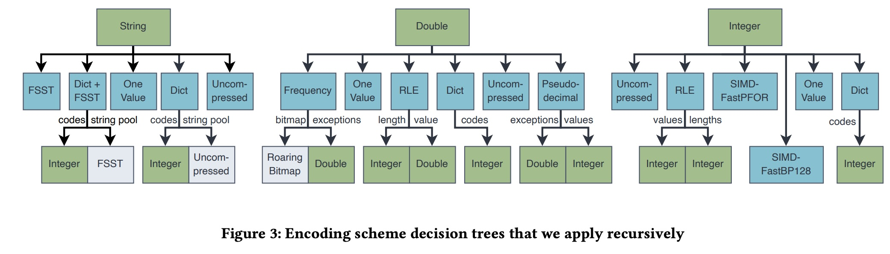
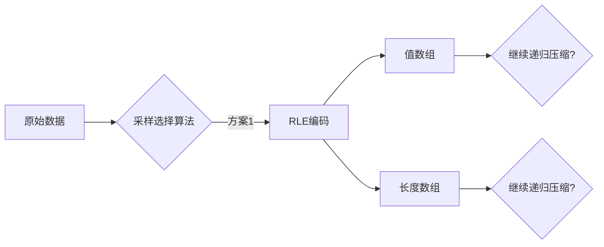
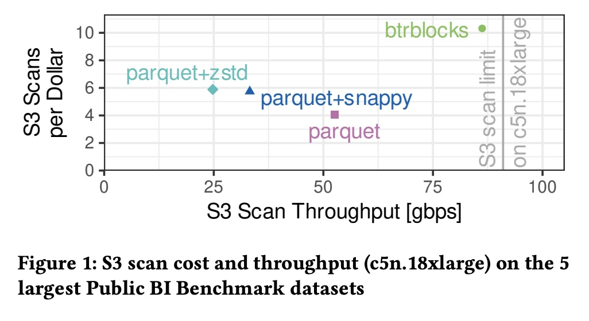
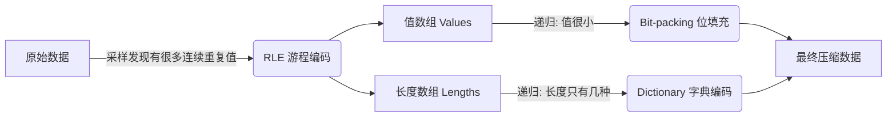
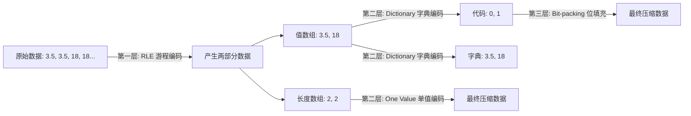

## AI论文解读 | BtrBlocks: Efficient Columnar Compression for Data Lakes
        
### 作者        
digoal        
        
### 日期        
2025-11-21        
        
### 标签        
PostgreSQL , PolarDB , DuckDB , AI , 论文解读        
        
----        
        
## 背景  
      
https://www.cs.cit.tum.de/fileadmin/w00cfj/dis/papers/btrblocks.pdf        
  
提示:          
```          
读懂《BtrBlocks: Efficient Columnar Compression for Data Lakes》这篇论文需要提前掌握哪些基础知识, 请使用中文通熟易懂的讲解这些基础知识, 可以引用论文中的图、表或使用Markdown支持的图形(text,mermaid等)增加解释性. 
  
使用中文通熟易懂的解读《BtrBlocks: Efficient Columnar Compression for Data Lakes》这篇论文, 其中的关键内容请着重讲解, 可以引用论文中的图、表或使用Markdown支持的图形(text,mermaid等)增加解释性. 
  
提取《BtrBlocks: Efficient Columnar Compression for Data Lakes》这篇论文中的重要术语, 使用中文对这些术语进行通熟易懂的讲解, 可以引用论文中的图、表或使用Markdown支持的图形(text,mermaid等)增加解释性. 
```     
  
## 1 前置知识 
  
阅读这篇论文《BtrBlocks: Efficient Columnar Compression for Data Lakes》，你需要理解它是如何通过一种新的压缩格式来解决云端数据分析中的“速度”和“成本”问题的。

为了让你能够轻松读懂，我将这篇论文所需的预备知识梳理为五个核心模块。

-----

### 1\. 数据湖与存算分离架构 (Cloud Data Lakes & Disaggregated Storage)

**通俗解释：**
过去，数据库像是你的个人电脑，硬盘（存储）和CPU（计算）连在一起。现在云端架构（如 Snowflake, BigQuery）流行“存算分离”：

  * 数据存放在廉价的对象存储中（如 Amazon S3）。
  * 计算节点是临时租赁的，需要时才启动 。

**为什么这是基础？**
论文指出，因为数据存储在远程（S3），**网络带宽**和**扫描成本**成了瓶颈 。

  * **传统问题：** 如果压缩率不高，网络传输慢；如果压缩太狠（如 Gzip），解压太慢，导致 CPU 满载，计算节点租赁费用增加 。
  * **论文目标：** 既要压得小（省流量/存储费），又要解压极快（省计算费/时间）。

-----

### 2\. 列式存储 (Columnar Storage)

**通俗解释：**
传统的数据库（如 MySQL）通常是**行式存储**（把一行的所有信息存在一起）。而数据分析通常只关心某些特定指标（例如“计算原本只包含价格的列的平均值”）。**列式存储**将同一列的数据存在一起。

**对比图示：**

| 存储方式 | 物理存储结构 (示例) | 优点 |
| :--- | :--- | :--- |
| **行式 (Row-based)** | `[ID:1, Name:Alice, Age:25], [ID:2, Name:Bob, Age:30]` | 适合频繁写入和读取单条完整记录。 |
| **列式 (Columnar)** | `ID:[1, 2], Name:[Alice, Bob], Age:[25, 30]` | **压缩率高**（同一列数据类型相似），**分析快**（只读需要的列）。 |

**为什么这是基础？**
BtrBlocks 和 Apache Parquet、ORC 一样，都是**列式存储格式** 。论文中提到的所有压缩技术（如 RLE, Bit-packing）都是基于“同一列的数据具有相似性”这一前提的。

-----

### 3\. 轻量级压缩算法 (Lightweight Encoding Schemes)

这是论文的核心“积木”。传统的通用压缩（如 Zip/Gzip）虽然压缩率高，但解压慢。BtrBlocks 使用了一系列“轻量级”编码，解压速度极快。你需要了解以下几种论文中反复提到的编码方式：

#### A. 游程编码 (Run-Length Encoding, RLE)

  * **原理：** 记录连续重复的值。
  * **例子：**
      * 原始数据：`42, 42, 42, 42, 10, 10`
      * RLE 编码：`(42, 4), (10, 2)` 
  * **适用场景：** 数据中有大量连续重复值的列。

#### B. 字典编码 (Dictionary Encoding)

  * **原理：** 把长字符串或大数值替换为短小的 ID 代码。
  * **例子：**
      * 原始数据：`"Apple", "Banana", "Apple"`
      * 字典：`{0: "Apple", 1: "Banana"}`
      * 编码结果：`0, 1, 0` 
  * **论文图示引用：** 论文中的图3 展示了字典编码（Dict）如何将 `String` 转化为 `Integer` 代码。    

#### C. 位填充与 PFOR (Bit-packing & PFOR)

  * **原理：** 整数通常占用 32 位或 64 位，但如果数值很小（例如 0-10），实际只需要 4 位。**Frame of Reference (FOR)** 选取一个基准值，只存差值。
  * **例子 (FOR)：**
      * 原始数据：`105, 101, 113`
      * 基准值：`100`
      * 存储差值：`5, 1, 13` (可以用更少的 bit 存储) 。
  * **PFOR (Patched FOR):** 专门处理异常值（Outliers）。比如大多数数都在 100 左右，突然来个 1000，PFOR 会把 1000 作为“异常”单独存，其他继续压 。

#### D. 级联压缩 (Cascading Compression)

  * **核心概念：** 压缩后的结果可以**再**被压缩。
  * **例子：** 先用 RLE 把数据压成 `(值, 数量)`，然后对“数量”这一列再用位填充压缩 。
  * **论文逻辑：** BtrBlocks 的一大创新就是递归地尝试各种组合，找到最佳的“套娃”压缩方式 。




-----

### 4\. 浮点数的存储难题 (IEEE 754 & Pseudodecimal)

**通俗解释：**
在计算机中，浮点数（`double`，如 3.14）的存储方式（IEEE 754 标准）非常复杂，分为符号位、指数位和尾数位。

  * **问题：** 两个数值上很接近的数（比如 3.25 和 0.99），在二进制表示上可能天差地别，导致上述的“位填充”或“前缀压缩”失效 。
  * **精度陷阱：** 很多看起来简单的十进制小数（如 0.99），在二进制里是无限循环小数（0.98999...），产生大量难以压缩的随机位 。

**论文创新点：**
论文提出了 **Pseudodecimal Encoding (伪十进制编码)**。它不存标准的 IEEE 浮点数，而是把浮点数拆解为三个整数来存：

1.  **有效数字 (Significant Digits)**
2.  **指数 (Exponent)**
3.  **补丁 (Patch, 存异常值)**
    例如：`3.25` 存为 `(325, 2)`，即 $325 \times 10^{-2}$ 。这样就把难以压缩的浮点数变成了容易压缩的整数。

-----

### 5\. SIMD (单指令多数据流)

**通俗解释：**
SIMD 是现代 CPU 的一种能力，允许一条指令同时处理多个数据。

  * **比喻：** 普通 CPU 像是还在用单手搬砖（一次搬一块）；SIMD 像是用铲车（一次搬一排）。
  * **论文应用：** 为了达到极致的解压速度，BtrBlocks 大量使用了 SIMD 指令（如 AVX2, AVX512）来并行处理解压任务 。例如，在解压 RLE 时，一次性复制 8 个值，而不是写个循环一个个复制 。

-----

### 总结：阅读路线建议

在阅读论文时，你可以按照以下思维导图来理解：

1.  **背景 (Background):** 现有的 Parquet 格式是为了以前的硬盘时代设计的，云时代需要更快扫描速度的格式 。
2.  **核心机制 (Selection):** BtrBlocks 不像 Parquet 那样死板（固定编码），而是每次压缩前先**采样 (Sample)**，试用所有“积木”（压缩算法），挑出压缩率最高的那种组合 。
3.  **特殊处理 (Specialization):** 针对浮点数，发明了伪十进制编码 ；针对字符串，使用了 FSST 。
4.  **性能 (Performance):** 因为用了 SIMD 和轻量级算法，虽然压缩率极高，但解压速度比 Parquet 快好几倍 。

接下来您可以尝试阅读论文的 **Figure 1** 和 **Figure 3**，结合上述知识，应该会非常清晰。       
  
## 2 解读论文 
  
这篇论文介绍了一种专为 **云数据湖（Data Lakes）** 设计的列式存储压缩格式，名为 **BtrBlocks**（发音同 "Better Blocks"）。

简单来说，它的核心目的是解决现代云端数据分析的一个尴尬现状：**网速越来越快，但CPU解压数据的速度却跟不上了** 。现有的格式（如 Parquet）要么压缩率不够高，要么解压太慢，导致租用云服务器的成本增加 。

以下是对 BtrBlocks 核心机制的通俗解读：

-----

### 1\. 核心背景：为什么 Parquet 不够好了？

在云端（如 Amazon S3），计算和存储是分离的。

  * **过去：** 网络慢，所以我们需要把文件压得很小（比如用 Gzip），哪怕解压慢一点也没关系，因为传输时间才是瓶颈。
  * **现在：** 网络带宽极大（100 Gbps），传输非常快。瓶颈变成了 **CPU**——CPU 忙着解压数据，导致数据虽然传过来了，但处理不过来 。

**BtrBlocks 的目标：** 既要压缩率高（省存储钱），又要解压极快（省计算钱）。

-----

### 2\. 关键创新一：级联压缩 ("套娃"式压缩)

传统的压缩通常是一锤子买卖（比如只用字典编码）。而 BtrBlocks 引入了**级联压缩（Cascading Compression）** 。它把一种压缩算法的输出，当作另一种算法的输入，层层嵌套，直到压不下去为止（或者达到递归深度限制）。

#### 原理图解：

以压缩一列整数为例，BtrBlocks 可能会走这样一条路径：



  * **步骤 1：** 发现数据有很多连续的 `42, 42, 42`，于是决定用 **RLE（游程编码）** ，将其变为 `(42, 3)` 。
  * **步骤 2：** RLE 产生了两个新数组：“值”和“长度”。
  * **步骤 3：** 对这两个新数组**再次**寻找最佳压缩方式。比如“长度”数组可能都在 1-5 之间，那就用 **Bit-packing（位填充）** 再压一次 。

论文中的 **图 3** 清晰地展示了这种决策树：     

> **[引用图 3 解释]**
> 数据类型（如 Double, String）位于顶部。系统会根据数据特征选择第一层算法（如 RLE, Dictionary, Frequency 等）。该算法产生的子数据（如字典的 codes）会再次进入下一层选择，最终可能变成位图（Roaring Bitmap）或位填充整数（SIMD-FastPFOR）。

-----

### 3\. 关键创新二：智能采样 ("先尝一口"策略)

面对上面那么多的算法组合，怎么知道哪个最好？Parquet 通常使用简单的静态规则（比如“如果是字符串就试用字典”）。

BtrBlocks 采用了一种**基于采样的动态选择算法** ：

1.  **随机采样：** 从由64,000个值组成的数据块（Block）中，随机抽取几个小片段（共约 1% 的数据）。
2.  **全面试跑：** 用所有候选的轻量级算法去压缩这个样本 。
3.  **择优录取：** 算出哪个算法压缩率最高（估算值），然后对整个数据块应用该算法 。

**为什么这样做？**
论文发现，这种采样方法只消耗 1.2% 的 CPU 时间，但能选中 77% 的最佳压缩方案，平均压缩率非常接近理论最优值 。这意味着它能自动适应不同的数据分布，而不需要人工调优。

-----

### 4\. 关键创新三：伪十进制编码 (Pseudodecimal Encoding)

这是论文针对**浮点数（Double）** 的一大发明。

**痛点：**
在数据库中，价格常存为浮点数（如 `3.25`）。但在计算机底层（IEEE 754 标准），`3.25` 和 `3.26` 的二进制表示差异巨大，且包含大量看似随机的尾数位，导致传统的压缩算法（如位填充）完全失效 。而且，像 `0.99` 这种数在二进制里是无限循环小数，非常难压缩 。

**解决方案：**
BtrBlocks 不直接存浮点数，而是把它拆解成三个**整数** ：

1.  **有效数字 (Significant Digits)**
2.  **指数 (Exponent)**
3.  **补丁 (Patch)**：处理无法转换的异常值。

**例子：**

  * 原始浮点数：`3.25`
  * BtrBlocks 存储为：整数 `325` 和 指数 `-2` ( 即 $325 \times 10^{-2}$ )。

**优势：**
整数 `325` 非常容易被后续的算法（如 PFOR 或 Bit-packing）高倍压缩。论文评估显示，这种方法在很多数据集上比原本的浮点数存储节省了大量空间 。

-----

### 5\. 性能对比：真的比 Parquet 强吗？

论文在 **Public BI Benchmark**（真实商业智能数据集）上进行了测试，结果非常有说服力。

#### 扫描速度与成本对比图 (基于论文图 1)

| 指标 | Parquet (默认) | Parquet (+Snappy) | Parquet (+Zstd) | **BtrBlocks** |
| :--- | :--- | :--- | :--- | :--- |
| **每美元扫描量** | 中 | 较高 | 高 | **最高 (1.8倍)** |
| **解压速度** | 慢 | 中 | 慢 | **极快 (2.2倍)** |
| **瓶颈** | CPU (卡在解压) | CPU | CPU | 接近网络带宽极限 |


  

**核心结论：**

  * **速度快：** BtrBlocks 的解压速度极快，因为它大量使用了 SIMD（单指令多数据流）指令集进行优化 。
  * **更省钱：** 在 AWS S3 上扫描同样的数据，BtrBlocks 比 Parquet **便宜 1.8 倍**，快 **2.2 倍** 。
  * **无需权衡：** 传统的观念是“压缩率高=解压慢”，但 BtrBlocks 做到了压缩率比 Parquet+Snappy 还高，同时解压速度比未压缩的 Parquet 还快 。

### 总结

BtrBlocks 就像是为云时代的数据湖量身定制的“集装箱”格式。它不再依赖通用的压缩算法（如 Gzip/Zstd），而是通过**智能采样**，把数据拆解成最适合它的形态（**级联压缩**），甚至把难以压缩的浮点数变成好压缩的整数（**伪十进制**）。这使得它在保持高压缩率的同时，让 CPU 能以惊人的速度“读”懂数据。
  
## 3 术语 
  
这篇论文《BtrBlocks: Efficient Columnar Compression for Data Lakes》提出了一种专为云端数据湖设计的新型压缩格式。为了让你轻松读懂，我提取了其中的核心术语，并用通俗的语言配合图表进行讲解。

### 1\. 级联压缩 (Cascading Compression)

**通俗解释：**
传统的压缩往往是“一锤子买卖”，比如把一列数据用一种算法压完就结束了。而 **级联压缩** 就像是“俄罗斯套娃”。这一层压缩产生的输出数据，可以作为下一层压缩算法的输入，层层递归，直到压不下去为止 。

**工作流程图：**
以压缩一列数字为例，BtrBlocks 可能会做出如下的“套娃”决策：



  * **论文依据：** 这种递归结构允许 BtrBlocks 混合使用多种轻量级算法（如 RLE 后再接 Bit-packing），从而获得极高的压缩率 。

### 2\. 基于采样的方案选择 (Sampling-based Scheme Selection)

**通俗解释：**
面对上面那么多的“套娃”组合，怎么知道哪种最好？BtrBlocks 采用了一种 **“先尝一口”** 的策略。它不会把所有数据都试一遍（那样太慢），而是从数据块中随机抽取几个小片段（约占总数据的 1%）作为样本 。

  * **怎么做：** 它用所有可用的压缩算法去跑这个小样本。
  * **决策：** 算出哪个算法在样本上表现最好（压缩率最高），然后就断定这个算法对整块数据也最好 。
  * **效果：** 这种方法只增加了极少的 CPU 开销（1.2%），却能选中 77% 的最佳方案 。

### 3\. 伪十进制编码 (Pseudodecimal Encoding)

**通俗解释：**
这是论文作者发明的一种专门针对 **浮点数（Double，如 3.25）** 的新算法 。
在计算机底层（IEEE 754标准），浮点数非常复杂且难以压缩。比如 `3.25` 和 `3.26` 在二进制表示上可能天差地别。而且像 `0.99` 这种数，在二进制里是无限循环小数，存起来全是乱码般的随机位，根本压不动 。

**解决方案：**
不存浮点数，而是把它拆成 **三个整数** 来存 ：

| 原始浮点数 | 拆解部分 1: 有效数字 (Integer) | 拆解部分 2: 指数 (Integer) | 拆解部分 3: 补丁 (Patch) |
| :--- | :--- | :--- | :--- |
| **3.25** | **325** | **-2** ( 代表 $10^{-2}$ ) | 无 |
| **0.99** | **99** | **-2** ( 代表 $10^{-2}$ ) | 无 |
| **NaN** | 0 | 0 | NaN (异常值单独存) |

  * **原理：** 把难压缩的 `3.25` 变成好压缩的整数 `325` 和 `-2`。后续再对这些整数使用常规的整数压缩算法（如 PFOR），效果奇佳 。

### 4\. FSST (Fast Static Symbol Table)

**通俗解释：**
这是一种专门针对 **字符串** 的黑科技压缩法。你可以把它理解为 **“高频词替换”** 。

  * **原理：** 它会扫描数据，找出出现频率最高的子字符串（最多8个字节），比如 "http://" 或 "The"。
  * **压缩：** 把这些长字符串替换成只有 1 个字节的代码（Code）。
  * **特点：** 解压速度极快，因为它不需要复杂的计算，只需要查表复制即可 。BtrBlocks 会用它来压缩原本非常占空间的文本列 。

### 5\. SIMD (Single Instruction, Multiple Data)

**通俗解释：**
这是 BtrBlocks 能够实现 **“极速解压”** 的硬件基础。
普通的 CPU 指令一次只能处理一个数（比如：把 A 搬到 B）。而 **SIMD（单指令多数据流）** 指令就像是一辆“铲车”，一次指令可以同时搬运或处理一组数据（比如一次搬 8 个整数）。

  * **论文应用：** BtrBlocks 中的核心算法（如 SIMD-FastPFOR, RLE 解压）都针对 SIMD 进行了深度优化。例如在解压字典编码时，利用 AVX2 指令集一次性复制 8 个值，从而大幅提升速度 。

### 6\. 存算分离与数据湖 (Disaggregated Storage & Data Lakes)

**通俗解释：**
这是 BtrBlocks 诞生的 **“背景环境”** 。

  * **存算分离：** 你的数据存在 S3（便宜的硬盘），你的计算跑在 EC2（昂贵的 CPU）。它们是分开的，中间通过网络连接 。
  * **矛盾：** 以前网速慢，所以压缩格式拼命把数据压小，导致解压很慢（CPU 累死）。现在网速快了（100 Gbps），瓶颈变成了 CPU 解压速度跟不上网速 。
  * **BtrBlocks 的定位：** 它就是为了解决这个问题而生的——压缩率够高（省存储费），但解压速度必须比 Parquet 快得多，以填满网络带宽，不让 CPU 成为瓶颈 。

### 7\. 游程编码与位填充 (RLE & Bit-packing)

这两个是 BtrBlocks 工具箱里最基础的“积木”：

  * **RLE (Run-Length Encoding)：**

      * **原理：** 记录“什么值”重复了“多少次”。
      * **例子：** `[A, A, A, A, B]` $\rightarrow$ `[(A, 4), (B, 1)]` 。
      * **适用：** 数据中有大量连续重复值时。

  * **Bit-packing (位填充)：**

      * **原理：** 计算机通常用 32 位（bit）存一个整数。但如果你的数字都很小（比如 0-10），其实只需要 4 位就够了。位填充就是把多余的 0 扔掉，把数据挤在一起 。
      * **适用：** 当数值范围很小的时候（通常结合 FOR 算法使用）。
  
## 参考        
         
https://www.cs.cit.tum.de/fileadmin/w00cfj/dis/papers/btrblocks.pdf    
        
<b> 以上内容基于DeepSeek、Qwen、Gemini及诸多AI生成, 轻微人工调整, 感谢杭州深度求索人工智能、阿里云、Google等公司. </b>        
        
<b> AI 生成的内容请自行辨别正确性, 当然也多了些许踩坑的乐趣, 毕竟冒险是每个男人的天性.  </b>        
    
#### [PolarDB 学习图谱](https://www.aliyun.com/database/openpolardb/activity "8642f60e04ed0c814bf9cb9677976bd4")
  
  
#### [PostgreSQL 解决方案集合](../201706/20170601_02.md "40cff096e9ed7122c512b35d8561d9c8")
  
  
#### [德哥 / digoal's Github - 公益是一辈子的事.](https://github.com/digoal/blog/blob/master/README.md "22709685feb7cab07d30f30387f0a9ae")
  
  
#### [About 德哥](https://github.com/digoal/blog/blob/master/me/readme.md "a37735981e7704886ffd590565582dd0")
  
  

  
