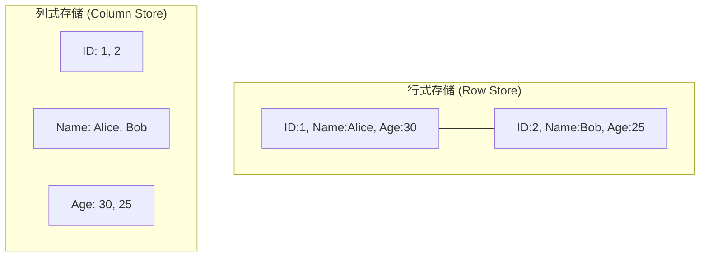
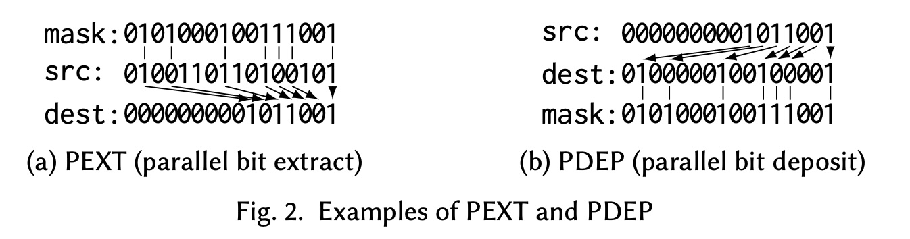
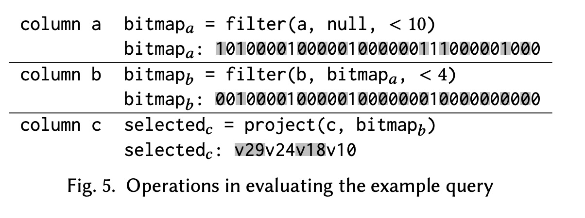
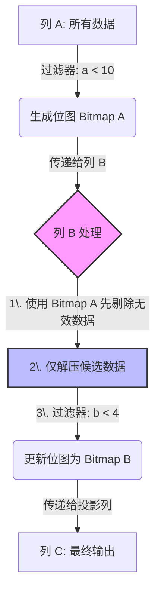
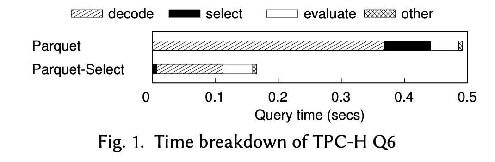
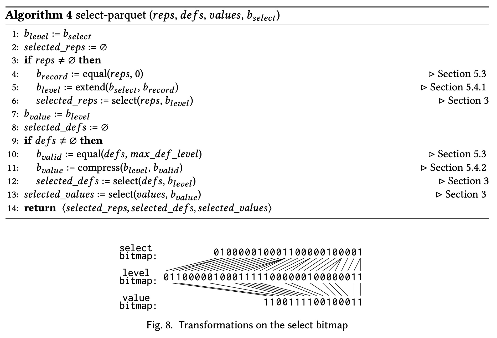
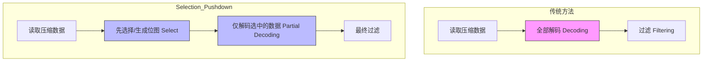
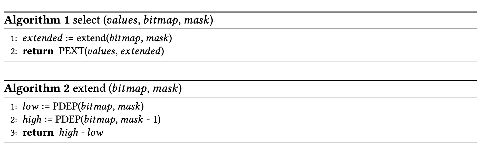
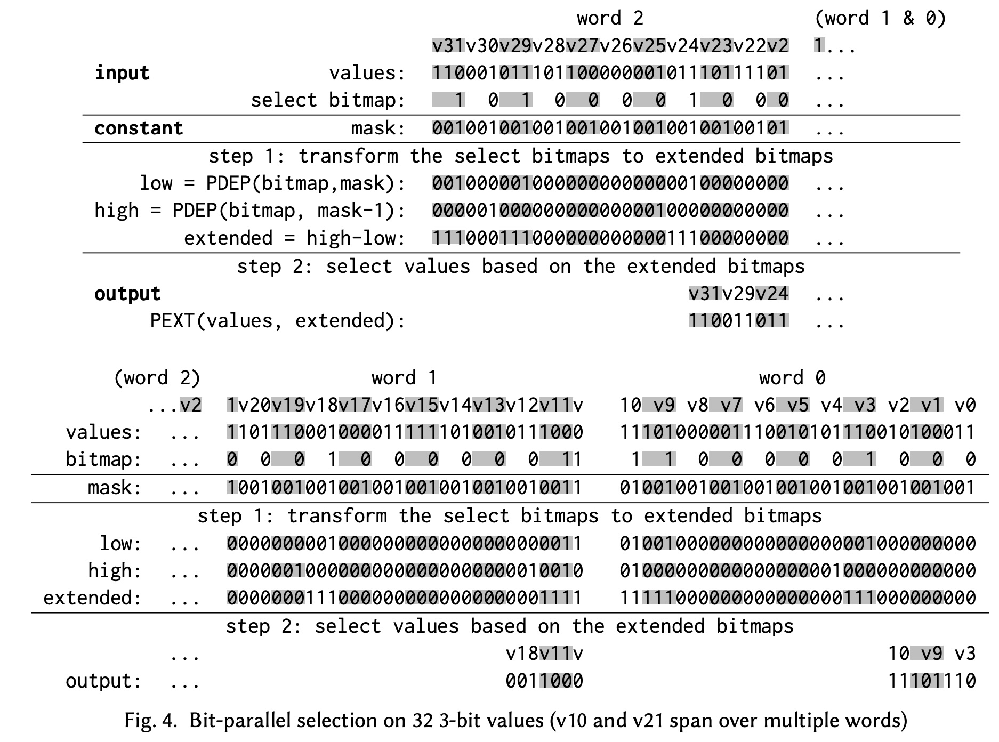

## AI论文解读 | Selection Pushdown in Column Stores using Bit Manipulation Instructions
        
### 作者        
digoal        
        
### 日期        
2025-11-21        
        
### 标签        
PostgreSQL , PolarDB , DuckDB , AI , 论文解读        
        
----        
        
## 背景  
      
https://www.microsoft.com/en-us/research/wp-content/uploads/2023/06/parquet-select-sigmod23.pdf        
  
提示:          
```          
读懂《Selection Pushdown in Column Stores using Bit Manipulation Instructions》这篇论文需要提前掌握哪些基础知识, 请使用中文通熟易懂的讲解这些基础知识, 可以引用论文中的图、表或使用Markdown支持的图形(text,mermaid等)增加解释性. 
  
使用中文通熟易懂的解读《Selection Pushdown in Column Stores using Bit Manipulation Instructions》这篇论文, 其中的关键内容请着重讲解, 可以引用论文中的图、表或使用Markdown支持的图形(text,mermaid等)增加解释性. 
  
提取《Selection Pushdown in Column Stores using Bit Manipulation Instructions》这篇论文中的重要术语, 使用中文对这些术语进行通熟易懂的讲解, 可以引用论文中的图、表或使用Markdown支持的图形(text,mermaid等)增加解释性. 
```     
  
## 1 前置知识 
  
阅读这篇题为《Selection Pushdown in Column Stores using Bit Manipulation Instructions》（使用位操作指令在列式存储中进行选择下推）的论文，你需要掌握四大块基础知识：**数据库存储模型、查询优化技术、数据压缩编码、以及底层CPU指令集**。

以下我将用通俗易懂的语言为你拆解这些概念，并结合论文中的图表进行说明。

-----

### 1\. 列式存储 (Column-Oriented Storage)

**概念：**
传统数据库（如 MySQL）通常是**行式存储**，即将一行记录的所有字段连续存储。而分析型数据库（如数据仓库）常用**列式存储**，即将同一列的所有数据连续存储。

**为什么这很重要？**

  * **只读所需：** 分析查询通常只涉及少数几列（例如：“计算原本所有用户的平均年龄”）。列存只需要读取“年龄”这一列，而不需要读取“姓名”、“地址”等无关数据，I/O 效率极高 。
  * **压缩率高：** 同一列的数据类型相同，值也相似（例如“国家”列会有很多重复的“China”），因此更容易被压缩 。




### 2\. 谓词下推 (Predicate Pushdown)

**概念：**
这是一种查询优化技术。它的核心思想是“**尽早过滤**”。
如果不使用下推，数据库引擎需要先把所有数据从磁盘读进内存，解压后，再检查是否符合条件（例如 `WHERE age > 18`）。
使用下推，引擎会尝试在读取数据或解压数据的过程中就进行过滤，不符合条件的数据直接跳过，不进入后续昂贵的计算环节 。

**论文的突破点：**
现有的下推技术通常需要先把压缩的数据“解压”成整数或字符串，然后再过滤。但这篇论文提出在**解压之前**（直接在编码数据上）就进行过滤，从而大大加速 。

### 3\. 数据编码与压缩 (Encoding & Compression)

论文重点讨论了 Apache Parquet 文件格式中使用的两种关键编码：

#### A. 字典编码 (Dictionary Encoding)

把重复出现的长字符串映射成短整数。

  * 例如：`["Apple", "Banana", "Apple"]`
  * 字典：`0 -> "Apple", 1 -> "Banana"`
  * 编码后数据：`[0, 1, 0]`
    这能极大减少存储空间，但查询时通常需要“解码”回字符串 。

#### B. 位打包 (Bit-Packing)

这是论文最核心的操作对象。字典编码后生成的整数通常很小（比如 0 到 3 只需要 2 个比特就能表示）。为了节省空间，Parquet 会把这些小整数紧紧地“挤”在一起，不留空隙。

  * **挑战：** 这种“挤”在一起的数据（例如 3-bit 的整数）跨越了字节边界，CPU 很难直接处理，通常必须先拆解（Unpack）成标准的 32位或 64位整数才能计算。论文正是要解决“拆解太慢”的问题 。

### 4\. CPU 指令集：BMI (Bit Manipulation Instructions)

这是理解论文技术细节最关键的部分。你需要知道 CPU 除了做加减乘除，还有专门处理“位”（Bit）的指令。

**论文主要利用了两个“黑科技”指令：**

#### A. PEXT (Parallel Bit Extract) - 并行位提取

  * **作用：** 就像一个筛子。给你一串二进制数（源），再给你一个掩码（Mask，哪里是1就选哪里）。PEXT 会把掩码为 1 对应位置的位“提取”出来，并挤压到低位 。
  * **图解（引用论文 Fig 2a）：**    
      * 源数据 (Src): `...1 0 1 1...` (分散的位)
      * 掩码 (Mask): `...1 0 1 0...` (选中第1、3位)
      * 结果 (Dest): `...0 0 1 1` (提取出的位被连续放置)

#### B. PDEP (Parallel Bit Deposit) - 并行位存入

  * **作用：** PEXT 的反向操作。把一串连续的位，“发散”地填回到掩码指定的位置上去 。
  * **图解（引用论文 Fig 2b）：**
      * 源数据 (Src): `...0 0 1 1` (连续的位)
      * 掩码 (Mask): `...1 0 1 0...` (目标位置)
      * 结果 (Dest): `...1 0 1 0...` (位被“弹射”回了原来的位置)

> **关键背景：** 在没有这两个硬件指令之前，用软件模拟这些操作非常慢。论文发现现代 CPU（Intel/AMD）都有了这两个指令，且速度极快，于是利用它们来加速数据库的过滤操作 。

### 5\. Apache Parquet 的嵌套结构 (Nested Data Structure)

论文的第 5 节专门处理 Parquet 的复杂结构。Parquet 借用了 Google Dremel 的模型来存储嵌套数据（比如 JSON 那样的层级数据）。

你需要理解两个概念 ：

  * **Repetition Level (重复层级):** 标记这个值是在当前列表中是一个新元素，还是属于上一个列表的延续。用来处理数组（Repeated fields）。
  * **Definition Level (定义层级):** 标记这个值在路径上哪一层是空的。用来处理空值（Nulls）。

**通俗理解：**
在平铺的列式存储中，我们丢失了树状结构的信息。这两个 Level 就是额外的“记号”，帮我们把平铺的数据还原回树状结构。论文提出用位操作（BMI）来快速处理这些“记号”，从而快速过滤掉空值或不需要的层级 。

### 总结：这一连串知识如何串联？

1.  **场景：** 你在用 **列式数据库** (Parquet) 查数据。
2.  **瓶颈：** 数据是被 **字典编码** 和 **位打包** 压缩过的。传统方法是：`解压 -> 还原成整数 -> 过滤`。这太慢了。
3.  **思路：** **谓词下推**。能不能不完全解压，直接看一眼压缩数据就决定要不要？
4.  **工具：** 使用 CPU 的 **BMI 指令 (PEXT/PDEP)**。
5.  **魔法：** 论文发明了一种方法，用 PEXT/PDEP 把符合条件的数据位直接“提取”出来，或者把过滤结果“映射”回去，从而实现了极速的查询 。

掌握以上知识，你阅读这篇论文的障碍将被扫除 80%。
  
## 2 解读论文 
  
这是一篇非常精彩的数据库系统底层优化论文，发表于 **SIGMOD 2023**。论文的核心目标是解决现代列式存储（如 Apache Parquet）在查询处理时的一个痛点：**解压（Decoding）开销太大**。

作者团队（来自微软研究院和普林斯顿大学）提出了一种利用 CPU 现代指令集（**BMI**）来实现**无需完全解压即可过滤数据**的技术，称为 **"Selection Pushdown" (选择下推)**。

以下是对这篇论文的通俗解读，我将其分为核心痛点、解决方案（魔法）、关键技术实现和效果展示四个部分。

-----

### 1\. 核心痛点：压缩越好，查询越慢？

**背景：**
在大数据分析中，Apache Parquet 是最主流的列式存储格式 。为了节省空间，Parquet 会对数据进行高强度的压缩，最常用的是 **字典编码（Dictionary Encoding）** 配合 **位打包（Bit-packing）** 。

**问题：**
当你执行一个查询（例如 `SELECT * FROM table WHERE a < 10`）时，传统的流程是：

1.  **读取** 压缩的数据块。
2.  **全部解压**（Decode）：把位打包的小整数还原成 32位/64位整数。
3.  **过滤**（Filter）：检查解压后的数字是否 `< 10`。

**瓶颈：**
论文指出，即使使用了 SIMD（单指令多数据）加速，**解压过程依然占据了绝大部分的查询时间** 。这就好比你为了找行李箱里的一双红袜子，必须把整个箱子的衣服都拿出来烫平、折好，然后再去找袜子，效率极低。

-----

### 2\. 解决方案：带着“透视镜”去挑选 (Selection Pushdown)

作者提出的思路是 **Selection Pushdown（选择下推）** 。

**核心思想：**
不要先解压再过滤，而是**先在压缩数据上直接挑选**，只把挑中的数据解压出来 。

这面临两个挑战：

1.  **压缩数据很难操作：** 数据被塞在 64位 寄存器的各个角落（比如 3-bit 一个数，一个 64-bit 字里塞了 21 个数），很难直接把想要的那几个数“抠”出来 。
2.  **通用性差：** 以前的方法要求编码必须保序（Order-preserving），但 Parquet 的字典编码通常不保序 。

**秘密武器：BMI 指令集**
作者发现，Intel 和 AMD 处理器中早已普及但长期被数据库领域忽视的一套指令集——**Bit Manipulation Instructions (BMI)**，是解决这个问题的神器 。

特别是以下两条指令（如图所示）：

  * **PEXT (Parallel Bit Extract):** “并行提取”。给你一个掩码（Mask），把数据中对应位置的比特“吸”出来，挤在一起放在结果的低位 。
  * **PDEP (Parallel Bit Deposit):** “并行投放”。PEXT 的逆操作。把低位的比特分散“撒”到掩码指定的位置上去 。

**[图解 BMI 指令]** (基于论文 Figure 2 )

  

**PEXT (提取):** 就像用筛子筛沙子，只留下你要的。

```text
源数据 (Src):  0 1 0 0 1 1 0 1 ... (杂乱的数据)
掩码 (Mask):   0 1 0 1 0 0 0 1 ... (1代表我要保留这位)
               ↓ ↓   ↓       ↓
结果 (Dest):   0 0 0 0 0 ... 1 1 1 (被选中的位紧凑排列)
```

**PDEP (投放):** 就像把子弹填回弹夹的特定位置。

```text
源数据 (Src):  0 0 0 ... 1 0 1 (紧凑的数据)
掩码 (Mask):   0 1 0 0 0 1 0 0 (1代表要把数据放这里)
               ↓       ↓
结果 (Dest):   0 1 0 0 0 1 0 0 (分散到指定位置)
```

-----

### 3\. 关键技术实现：Parquet-Select

作者构建了一个名为 `Parquet-Select` 的库，包含三大核心技术：

#### 技术一：位并行的 Select 操作符 (Bit-Parallel Select Operator)

这是最底层的原子操作。给定一串压缩的整数（比如每个占 3-bit）和一个选择位图（Bitmap，1表示选中），如何快速把选中的数提取出来？

**传统做法：** 循环遍历，非常慢。
**BMI 做法：**
利用 PEXT 和 PDEP，可以在 **4条机器指令** 内，处理完一个 64位 处理器字（Word）里的所有数据，无论里面塞了多少个压缩整数 。

  * **步骤简述：**
    1.  先把选择位图（Selection Bitmap）“膨胀”成适合数据宽度的掩码（使用 PDEP 和减法技巧）。
    2.  直接用 PEXT 把压缩数值提取出来 。

#### 技术二：选择下推框架 (Selection Pushdown Framework)

在处理多列查询时（例如 `WHERE a < 10 AND b < 4`），可以利用“短路”效应。

**流程图解：** (基于论文 Figure 5 )

  



  * **关键点：** 当我们处理列 B 时，不需要读取所有数据，只需要读取列 A 筛选剩下的那部分。
  * **位图变换 (Bitmap Transform):** 这里的难点是，列 B 筛选出的结果是“稀疏”的，怎么映射回原始的行号？作者再次使用了 **PDEP** 指令，将过滤后的结果完美还原回原始位图中 。

#### 技术三：支持复杂嵌套结构 (Complex Structures)

Parquet 支持嵌套和重复字段（通过 Repetition Levels 和 Definition Levels 实现）。这意味着“物理上的值”和“逻辑上的行”不是一一对应的（比如一行可能有 3 个值，也可能是 null）。

  * **创新：** 作者设计了一套算法，利用 BMI 将“选择位图”在“记录（Record）”、“层级（Level）”和“值（Value）”三种视角之间高效转换 。
  * 这意味着 `Parquet-Select` 不仅支持简单的 `int` 列，也能加速复杂的嵌套数据查询，这在之前的研究中很难做到。

-----

### 4\. 效果展示：快了多少？

作者在 micro-benchmarks 和 TPC-H 基准测试上进行了评估（对比标准 Apache Parquet C++ 库）：

1.  **纯扫描性能：**

      * 在选择率（Selectivity）较低时（即过滤掉大部分数据），**性能提升高达 10 倍以上**。
      * 数据位宽越小（压缩越狠），提升越明显 。

2.  **端到端查询 (Spark 集成)：**

      * 作者将该库集成到了 **Apache Spark** 中。
      * 在涉及复杂 Join 的 TPC-H 查询中，整体查询速度提升了 **1.1倍 到 5.5倍** 。
      * 对于 TPC-H Q6 这种典型扫描查询，单线程提升了 **13.7倍**（针对含 Null 列的情况）甚至 **20倍**（针对重复列的情况）。

3.  **图表解读 (基于 Figure 1 ):**    

      * **Parquet (原版):** 时间主要花在 `decode` (解压) 上，蓝条非常长。
      * **Parquet-Select (新版):** `decode` 时间极短（因为只解压了一点点数据），虽然多了 `select` 开销，但总时间大幅缩短。

-----

### 总结：下一步可以为你做什么？

这篇论文的核心贡献在于证明了 **BMI 指令集是数据库操作的“宝藏”** ，它将原本昂贵的位操作变成了极低成本的硬件指令，从而彻底改变了列式存储的读取路径。

**我可以为你做以下后续步骤：**

1.  **代码示例：** 如果你对 C++ 实现感兴趣，我可以尝试写一段伪代码，演示如何使用 `_pdep_u64` 和 `_pext_u64` 来实现论文中的 `Select` 操作。
2.  **深入算法：** 详细解释论文中关于处理 Parquet 嵌套数据（Repetition/Definition Levels）的具体算法逻辑（Algorithm 4）。    
3.  **环境配置：** 如果你想复现，我可以帮你检查你的 CPU 是否支持 BMI2 指令集。

你想先了解哪一部分？
  
## 3 术语 
  
这篇论文提出了一种利用现代 CPU 硬件特性来加速数据库查询的技术。为了帮助你更好地理解，我提取了其中的核心术语，并用通俗易懂的语言、图表和类比进行解读。

-----

### 1\. Selection Pushdown (选择下推)

**通俗解释：**
想象你在超市买苹果，你需要从一堆包装好的箱子里挑出“红色的苹果”。

  * **传统做法 (无下推)：** 把所有箱子都拆开（解压/解码），拿出苹果，一个个看是不是红色的。这非常慢，因为拆箱子很费劲。
  * **选择下推 (本论文做法)：** 先不拆箱子，直接透过包装或者上面的标签（编码后的值）看一眼。只把那些看起来像红色苹果的箱子拆开。如果箱子里显然是青苹果，就直接扔一边，完全不拆。

**专业定义：**
在列式存储中，数据通常是压缩存放的。传统方法需要先将数据完全解码（Decode）成原始数值（如 32位/64位整数），然后再进行谓词过滤（如 `x < 10`）。
**Selection Pushdown** 的核心思想是把“选择（Select）”操作推迟到解码之前，或者利用位图（Bitmap）在解码前先过滤掉无关数据，只解码被选中的数据 。

**流程对比图：**



-----

### 2\. BMI (Bit Manipulation Instructions)

**通俗解释：**
这是 CPU 的一套“微操”工具包。以前 CPU 处理数据像戴着拳击手套拿硬币，很笨拙。BMI 指令集（特别是 BMI2）就像给了 CPU 一把精密镊子，可以一次性精准地把 64位 数据里你想要的那些微小比特（bit）“夹”出来或者“放”进去 。

**核心指令：PEXT 和 PDEP**
这是论文实现加速的“魔法”指令。

  * **PEXT (Parallel Bit Extract - 并行提取):**

      * **作用：** 像筛沙子一样。给你一个掩码（筛子），把数据（沙土）里对应掩码为 `1` 的位置提取出来，并把它们紧紧地挤在一起 。
      * **图解 (基于论文 Figure 2a):**    
        ```text
        源数据:   0 1 0 0 1 1 0 1 ... (分散的数据)
        掩码:     0 1 0 1 0 0 0 1 ... (1代表我想留下的位置)
                  ↓ ↓   ↓       ↓
        结果:     0 0 0 0 ... 1 1 1   (被选中的位连续排列在低位)
        ```

  * **PDEP (Parallel Bit Deposit - 并行投放):**

      * **作用：** PEXT 的逆操作。把紧凑排列的数据，按照掩码指定的空位，分散地“填”回去 。
      * **用途：** 在论文中，这常用于把过滤后的结果（变少了）还原回原始的行号位置（变稀疏了）。

-----

### 3\. Bit-Parallel Select Operator (位并行选择算子)

**通俗解释：**
这是一个极其高效的算法，用来从一串压缩得很紧的数据中“抠”出我们需要的那几个。
在列式存储中，为了省空间，数字可能只占 3 个比特（bit），一个 64 位的 CPU 寄存器里可能挤了 21 个数字。
传统方法要写个循环，一个个读。**位并行选择算子** 利用 BMI 指令，能在 **4 条指令** 内，把这 21 个数字里我们需要的那几个瞬间提取出来，不管它们塞得有多紧 。

**论文中的实现逻辑 (基于 Algorithm 1 & 2)：**

    

1.  **输入：** 一串压缩的值，和一个选择位图（告诉我们需要第几个值）。
2.  **变换：** 利用 `PDEP` 把简单的选择位图“膨胀”成一个复杂的掩码 。
3.  **提取：** 利用 `PEXT` 一次性把所有选中的值拷贝到输出区域 。

-----

### 4\. Dictionary Encoding & Bit-packing (字典编码与位打包)

**通俗解释：**
这是 Parquet 等格式为了压缩数据用的手段。

  * **字典编码：** 比如有一列数据是 `["Apple", "Banana", "Apple"]`。建立一个字典 `0: Apple, 1: Banana`。存储时只存 `[0, 1, 0]`。
  * **位打包：** `0` 和 `1` 其实只需要 1 个比特就能存下。Parquet 会把这些极小的数字紧紧挨着存，不浪费任何空间 。

**挑战：**
这种存法虽然省空间，但读取时必须“解包”，CPU 处理起来很麻烦。这也正是本论文要解决的核心瓶颈 。

-----

### 5\. Parquet Levels (Repetition & Definition Levels)

**通俗解释：**
Parquet 格式支持嵌套结构（比如一个格子里放了一个列表）和空值（Null）。它不直接存 Null，而是用两个小整数来标记结构：

  * **Definition Level (定义层级):** 告诉你这个值是不是 Null，或者它上面的父节点是不是 Null 。
  * **Repetition Level (重复层级):** 告诉你这个值是不是属于一个新的记录，还是接着上一行记录的列表里的值 。

**论文的贡献：**
由于有了这些层级，物理上存储的数据个数和逻辑上的行数**对不上**（比如有些行是空的，就不存值）。
论文利用 BMI 技术，能快速处理这些层级信息，把“逻辑上的选择”转换成“物理上的选择”，从而支持对复杂嵌套数据的快速过滤 。

### 6\. Bitmap Transformation (位图变换)

**通俗解释：**
在多列查询（如 `WHERE A < 10 AND B < 5`）中，过滤像接力赛。

1.  **列A** 过滤完，生成一个“名单”（Bitmap A），上面写着第 1, 3, 5 行通过了。
2.  当我们去查 **列B** 时，只查第 1, 3, 5 行的值。
3.  假设 **列B** 发现第 3 行不满足条件。此时我们得到的结果是基于“1, 3, 5”这三行的相对结果（即：通过，不通过，通过）。
4.  **位图变换** 就是把这个相对结果 `[1, 0, 1]`，准确地映射回原始的行号位置，变成 `[1, 0, 0, 0, 1]`（第3行变成了0）。

**关键技术：**
论文发现 `PDEP` 指令天然适合做这种“把紧凑的过滤结果映射回稀疏的原始位置”的工作，性能比软件实现快两个数量级 。
  
## 参考        
         
https://www.microsoft.com/en-us/research/wp-content/uploads/2023/06/parquet-select-sigmod23.pdf      
        
<b> 以上内容基于DeepSeek、Qwen、Gemini及诸多AI生成, 轻微人工调整, 感谢杭州深度求索人工智能、阿里云、Google等公司. </b>        
        
<b> AI 生成的内容请自行辨别正确性, 当然也多了些许踩坑的乐趣, 毕竟冒险是每个男人的天性.  </b>        
    
#### [PolarDB 学习图谱](https://www.aliyun.com/database/openpolardb/activity "8642f60e04ed0c814bf9cb9677976bd4")
  
  
#### [PostgreSQL 解决方案集合](../201706/20170601_02.md "40cff096e9ed7122c512b35d8561d9c8")
  
  
#### [德哥 / digoal's Github - 公益是一辈子的事.](https://github.com/digoal/blog/blob/master/README.md "22709685feb7cab07d30f30387f0a9ae")
  
  
#### [About 德哥](https://github.com/digoal/blog/blob/master/me/readme.md "a37735981e7704886ffd590565582dd0")
  
  

  
