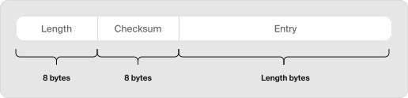
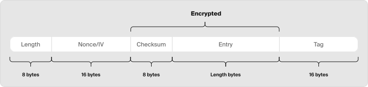

## 安全方面, PG和SQLite都不如DuckDB? 为什么?   
                            
### 作者                            
digoal                            
                            
### 日期                            
2025-11-21                            
                            
### 标签                            
PostgreSQL , SQLite3 , DuckDB , 数据文件加密 , WAL , 临时文件 , 加密算法 , 加密密钥 , 块级加密 , 性能损耗 , 审计日志 , parquet                                
                            
----                            
                            
## 背景     
DuckDB产品定位决定了可能要经常在网络上传输、对象存储中共享DuckDB的数据文件, 或者共享parquet文件, 但是这样做安全吗?   
  
如果数据文件被拷贝走, 数据是不是就泄露了?  
  
数据文件有自己的组织形式, 不能像打开文本一样打开, 那数据是怎么泄露的?  
  
为了防止数据泄露, 数据文件加密技术应运而生.   
  
数据加密算法的健壮性怎么样? 会不会被破解?   
  
数据加密到底会给数据库的性能带来多大的影响?   
  
如何配置既能保证健壮性, 又能保证性能?  
  
除了数据文件加密, REDO日志要不要加密? 数据库审计日志要不要加密? 临时文件(例如外部排序用到的临时文件)要不要加密?  
  
加密数据文件的密钥如何进行管理? 在内存中的加密密钥安全吗?   
  
为什么SQLite3和PostgreSQL使用这么广泛的数据库, 居然没有提供内置的数据文件加密功能?   
  
来看看DuckDB怎么做的? 《DuckDB 中的静态数据加密（Data-at-Rest Encryption）》 翻译自: https://duckdb.org/2025/11/19/encryption-in-duckdb   
  
读完本篇, 你能学到:   
  
为了获得最佳的**安全性和性能平衡**，我在使用 DuckDB 的加密功能时，应该 **选择哪种加密密码（cipher）** ，以及需要特别注意加载 **OpenSSL** 等**哪些关键配置**？  
  
数据加密通常会带来显著的**性能开销**，但文章的**性能测试**部分却指出，在启用 **OpenSSL** 硬件加速（Hardware Acceleration）后，加密和解密的**总体开销（overall overhead）几乎可以忽略不计**。DuckDB 是如何克服传统加密瓶颈，实现这一性能目标的？  
  
## 原文: DuckDB 中的静态数据加密（Data-at-Rest Encryption）  
  
**TL;DR（简而言之）:**  
  
DuckDB v1.4 版本发布了数据库加密功能（database encryption capabilities）。在这篇博客文章中，我们将深入探讨加密的**实现细节**（implementation details），展示如何使用它，并说明它对**性能的影响**（performance implications）。  
  
如果您想在 DuckDB 中使用加密功能，我们建议使用最新的稳定版本 v1.4.2。更多详情，请参阅最新的发布博客文章( https://duckdb.org/2025/11/12/announcing-duckdb-142.html#vulnerabilities )。  
  
多年前，我们阅读了 Simon Singh 撰写的优秀著作《密码书》（ Code Book: https://en.wikipedia.org/wiki/The_Code_Book ）。您知道吗，苏格兰女王玛丽曾使用一种可以追溯到尤利乌斯·凯撒（Julius Caesar）时代的加密方法来加密她那些“更大胆”的信件？但可惜的是：该**密码** （cipher）被破解了，信件内容最终导致了她被处决。  
  
如今，强大的加密软件和硬件已成为一种**商品**（commodity）。现代 CPU 带有专门的**密码学指令**（cryptography instructions），而大大小小的操作系统都包含大多健壮的**密码学软件**（cryptography software），例如 **OpenSSL**。  
  
数据库存储任意信息，很明显，许多（如果不是大多数）有价值的**数据集**（datasets）可能不应该完全向所有人公开。即使数据存储在像云虚拟机（cloud virtual machine）这样受到严格控制的硬件上，也发生过许多通过各种**权限提升**（privilege escalations）导致文件丢失的案例。毫不奇怪，像常见的 **SOC 2** 等**合规性框架**（compliance frameworks）“强烈建议”在硬盘等存储介质上存储数据时进行加密。  
  
然而，数据库系统和加密的历史记录有些问题。即使是自称“世界上最先进的开源关系数据库”的 **PostgreSQL**，其数据加密选项也十分有限。**SQLite**，世界上“部署最广泛、使用最多的数据库引擎”，**不**支持**开箱即用**（out-of-the-box）的数据加密，其加密**扩展**（extension）是一个价值 2000 美元的**附加组件**（add-on）。   
  
DuckDB 一段时间以来一直支持 **Parquet 模块化加密**（Parquet Modular Encryption）。此功能允许读取和写入带有加密列的 Parquet 文件。然而，尽管 Parquet 文件很棒，而且关于其“即将消亡”的报告被大大夸大了，但它们无法进行**原地更新**（updated in place），而原地更新是**数据库管理系统**（database management system）的一个基本功能。  
  
从 DuckDB 1.4.0 开始，DuckDB 支持使用行业标准的 **AES**（Advanced Encryption Standard，高级加密标准）对**静态数据**（data-at-rest）进行**透明数据加密**（transparent data encryption）。  
  
> DuckDB 的加密功能尚未满足官方 **NIST**（美国国家标准与技术研究院）的要求。  
  
### 加密的一些基础知识  
  
有很多不同的加密数据的方法，有些比其他的更安全。在数据库系统和其他地方，标准是 **AES**（Advanced Encryption Standard，高级加密标准），这是一种由美国 NIST 标准化的**分组密码算法**（block cipher algorithm）。AES 是一种**对称加密算法**（symmetric encryption algorithm），这意味着加密和解密数据使用相同的**密钥**（key）。  
  
因此，大多数系统选择仅支持**随机化加密**（randomized encryption），这意味着（如果使用正确！）相同的**明文**（plaintexts）将始终产生不同的**密文**（ciphertexts）。最常用的行业标准和推荐的加密算法是 **AES – Galois Counter Mode**（AES-GCM，高级加密标准 - 伽罗瓦/计数器模式）。这是因为它除了具有随机化加密的能力外，还通过计算一个**标签**（tag）来**验证**（authenticates）数据，以确保数据没有被**篡改**（tampered with）。  
  
DuckDB v1.4 支持使用 **AES-GCM-256** 和 **AES-CTR-256**（Counter Mode，计数器模式） **密码**（ciphers）进行静态数据加密。**AES-CTR** 是 AES-GCM 的一个更简单、更快版本，但安全性较低，因为它不通过计算**标签**（tag）来提供**验证**（authentication）。其中的 **256** 指的是密钥的**比特**（bits）大小，这意味着 DuckDB 现在仅支持 32 字节密钥的 GCM。  
  
GCM 和 CTR 都需要以下输入：  
- (1) **明文**（plaintext），  
- (2) 一个**初始化向量**（IV，initialization vector）和   
- (3) 一个**加密密钥**（encryption key）。  
  
明文是用户想要加密的文本。**IV** 是一个通常为 16 字节的**唯一字节流**（unique bytestream），它确保相同的明文被加密成不同的密文。一个**一次性随机数**（nonce）是一个通常为 12 字节的字节流，它与一个 4 字节的**计数器**（counter）一起构造 **IV**。请注意，IV 需要对每个加密块都是**唯一**的，但不一定必须是**随机**的。重复使用相同的 IV 是有问题的，因为攻击者可以对两个密文进行 **XOR** 运算并提取两条消息。AES-GCM 中的**标签**（tag）是在所有块加密后计算的，很像一个**校验和**（checksum），但它增加了一个**完整性检查**（integrity check），可以安全地**验证**（authenticates）整个密文。  
  
### DuckDB 中的实现  
  
在深入探讨我们如何在 DuckDB 中实际实现加密之前，我们将解释一些关于 DuckDB **文件格式**（file format）的内容。  
  
DuckDB 有一个主**数据库头**（main database header），它存储能够正确加载和验证 DuckDB 数据库的数据。在每个 DuckDB 主数据库头部的开头，存储着**魔术字节**（magic bytes，即 “DUCKDB”），并在初始化时读取以验证文件是否为有效的 DuckDB 数据库文件。魔术字节后面是四个 8 字节的**标志**（flags），可用于不同的目的。  
  
当 DuckDB 中的数据库被加密时，主**数据库头**（main database header）始终保持**明文**（plaintext），因为主头部不包含有关数据库文件内容的敏感数据。在初始化加密数据库时，DuckDB 会设置第一个标志的第一个**比特位**（bit）以指示该数据库已加密。设置此比特位后，将存储加密所需的额外**元数据**（metadata）。此元数据包括   
- (1) **数据库标识符**（database identifier），  
- (2) 用于例如所使用的加密**密码**（encryption cipher）的 8 字节额外元数据，以及   
- (3) 加密的**金丝雀值**（encrypted canary）。  
  
**数据库标识符**被用作一个**盐值**（salt），由每个数据库初始化时创建的 16 个随机生成的字节组成。**盐值**通常用于确保**唯一性**（uniqueness），即它确保相同的输入密钥或密码被转换为不同的**派生密钥**（derived keys）。这 8 字节的**元数据**包括**密钥派生函数**（Key Derivation Function, **kdf**）(第一字节)、**附加认证数据**（additional authenticated data）的使用 (第二字节)、加密**密码**（encryption cipher）(第三字节) 和**密钥长度**（key length）(第五字节)。在元数据之后，主头部使用加密的**金丝雀值**来检查输入密钥是否正确。  
  
### 加密密钥管理  
  
要在 DuckDB 中加密数据，您几乎可以使用任何**明文**（plaintext）或 **Base64** 编码的字符串，但我们建议使用安全的 32 字节 Base64 密钥。用户自己负责**密钥管理**（key management），因此也负责使用安全的密钥。DuckDB 不会直接使用用户提供的**明文密钥**（plain key），而是始终通过**密钥派生函数**（kdf）派生出一个更安全的密钥。**kdf** 是一个将输入密钥缩减或扩展为 32 字节安全密钥的函数。  
  
如果通过派生安全密钥和解密**金丝雀值**（canary）来检查输入密钥的正确性，那么该**派生密钥**（derived key）将在安全的**加密密钥缓存**（secure encryption key cache）中进行管理。此**缓存**（cache）管理当前 DuckDB 上下文的加密密钥，并通过锁定其内存来确保派生密钥永远不会**交换到磁盘**（swapped to disk）。  
  
为了进一步加强安全性，原始**输入密钥**（original input keys）在转换为安全**派生密钥**时会立即从内存中**清除**（wiped）。  
  
### DuckDB 块结构  
  
在主**数据库头**（main database header）之后，DuckDB 存储两个 4KB 的**数据库头**，其中包含有关例如**块**（block）(头) 大小和使用的**存储版本**（storage version）的更多信息。在保持主数据库头为**明文**（plaintext）之后，使用加密时，所有剩余的头部和**块**（blocks）都会被加密。  
  
DuckDB 中的**块**默认为 256KB，但其大小是可配置的。在每个**明文块**（plaintext block）的开头，有一个 8 字节的**块头**（block header），它存储一个 8 字节的**校验和**（checksum）。**校验和**是一种简单的计算，常用于数据库系统中，以检查任何**损坏的数据**（corrupted data）。  
  
  
  
（图片：明文块示意图）  
  
然而，对于**加密块**（encrypted blocks），其**块头**（block header）由 40 字节而不是 8 字节的**校验和**组成。加密块的块头包含一个 16 字节的 **nonce/IV**，以及一个可选的 16 字节**标签**（tag），具体取决于所使用的加密**密码**（encryption cipher）。**nonce** 和**标签**以**明文**（plaintext）形式存储，但**校验和**被加密以提高安全性。请注意，**块头**始终需要 8 字节**对齐**（aligned）才能计算**校验和**。  
  
按前面的说法, 为了安全性, 每个块的 **nonce/IV** 都不一样, 所以每个块头部都存储了一个 **nonce/IV** , 否则全局存一个就够了 .  
  
  
  
（图片：加密块示意图）  
  
### 预写式日志加密（Write-Ahead-Log Encryption）  
  
数据库系统中的**预写式日志**（Write-Ahead-Log, **WAL**）是一种**崩溃恢复机制**（crash recovery mechanism），用于确保**持久性**（durability）。它是一个**仅追加文件**（append-only file），用于数据库崩溃或突然关闭，且并非所有更改都已写入主数据库文件的情况。**WAL** 确保这些更改可以**重放**（replayed）到上一个**检查点**（checkpoint）；**检查点**是数据库在特定时间点的一致**快照**（snapshot）。这意味着，当强制执行**检查点**时（在 DuckDB 中，这通过 (1) 关闭数据库或 (2) 达到某个存储**阈值**（threshold）来实现），WAL 就会被写入主数据库文件。  
  
在 DuckDB 中，您可以通过设置以下 **PRAGMA** 来强制创建 WAL：  
  
```sql  
PRAGMA disable_checkpoint_on_shutdown;  
PRAGMA wal_autocheckpoint = '1TB';  
```  
  
这样，您将**禁用**（disable）在关闭数据库时的**检查点**（checkpointing），这意味着 WAL 不会合并到主数据库文件中。此外，通过将 `wal_autocheckpoint` 设置为一个高**阈值**，这将**避免**发生**中间检查点**（intermediate checkpoints），并且 WAL 将**持久化**（persist）。例如，我们可以通过首先设置上述 PRAGMA，然后**附加**（attach）一个加密数据库，再创建一个表并插入 3 个值来创建一个**持久的 WAL 文件**（persistent WAL file）。  
  
```sql  
ATTACH 'encrypted.db' AS enc (  
    ENCRYPTION_KEY 'asdf',  
    ENCRYPTION_CIPHER 'GCM'  
);  
CREATE TABLE enc.test (a INTEGER, b INTEGER);  
INSERT INTO enc.test VALUES (11, 22), (13, 22), (12, 21)  
```  
  
如果此时我们关闭 DuckDB 进程，可以看到一个名为 `encrypted.db.wal` 的 **.wal** 文件。但是 **WAL** 在内部是如何创建的呢？  
  
在向数据库写入新**条目**（entries，如插入、更新、删除）之前，这些**条目**本质上被**记录**（logged）并**追加**（appended）到 **WAL** 中。只有在**记录的条目**被**刷新到磁盘**（flushed to disk）后，**事务**（transaction）才被视为**已提交**（committed）。一个**明文 WAL 条目**具有以下结构：  
  
  
  
（图片：明文块示意图）  
  
由于 **WAL** 是**仅追加**（append-only）的，我们**按值**（per value）加密一个 **WAL 条目**。对于 **AES-GCM**，这意味着我们在每个**条目**后面**追加**一个 **nonce** 和一个**标签**（tag）。我们执行此操作的结构如下图所示。当我们**序列化**（serialize）一个**加密条目**到**加密 WAL** 时，我们首先以**明文**（plaintext）形式存储**长度**（length），因为我们需要知道应该解密多少字节。**长度**后面是一个 **nonce**，接着是**加密的校验和**（encrypted checksum）和**加密条目**本身。在**条目**之后，存储一个 16 字节的**标签**用于**验证**（verification）。  
  
  
  
（图片：加密块示意图）  
  
默认情况下，当为任何（未）加密的数据库提供**加密密钥**时，**加密 WAL** 就会被**触发**（triggered）。  
  
### 临时文件加密（Temporary File Encryption）  
  
**临时文件**（Temporary files）用于存储**中间数据**（intermediate data），这些数据通常对于**大型的核外操作**（large, out-of-core operations）是必需的，例如**排序**（sorting）、大型**连接**（joins）和**窗口函数**（window functions）。这些数据可能包含**敏感信息**（sensitive information），并在**崩溃**（crash）的情况下保留在磁盘上。为了保护这些**残留数据**（leftover data），DuckDB 也会自动加密**临时文件**。  
  
#### 临时文件的结构  
  
DuckDB 中有**三种**不同类型的**临时文件**：  
- (1) 具有与常规 256KB **块**（block）相同布局的**临时文件**，  
- (2) **压缩临时文件**（compressed temporary files），以及   
- (3) 超过标准 256KB 块大小的**临时文件**。  
  
前两种以 **.tmp** 为后缀，而后者通过以 **.block** 为后缀来区分。为了跟踪 **.block** **临时文件**的大小，它们总是以其**长度**（length）作为**前缀**（prefixed）。与常规数据库**块**不同，**临时文件**不包含用于检查数据损坏的**校验和**（checksum），因为**校验和**的计算有些**昂贵**（expensive）。  
  
#### 加密临时文件  
  
**临时文件**的加密是**自动触发**的：  
- (1) 当您**附加**（attach）一个**加密数据库**时，或   
- (2) 当您使用设置 `SET temp_file_encryption = true` 时。  
  
在后一种情况下，主数据库文件是**明文**（plaintext），但**临时文件**将被加密。对于**临时文件**的加密，DuckDB 在内部生成**临时密钥**（temporary keys）。这意味着当数据库**崩溃**（crashes）时，**临时密钥**也会丢失。在这种情况下，**临时文件**无法解密，本质上就变成了**垃圾**（garbage）。  
  
要强制 DuckDB 产生**临时文件**，您可以使用一个简单的技巧，即将**内存限制**（memory limit）设置得很低。一旦**内存限制**被**超过**（exceeded），就会创建**临时文件**。例如，我们可以创建一个新的**加密数据库**，用 **TPC-H** 数据 (SF 1) **加载**（load）该数据库，然后将**内存限制**设置为 1 GB。如果我们随后执行一个大型**连接**（join），我们就会强制 DuckDB 将**中间数据**（intermediate data） **溢出** （spill）到磁盘。例如：  
  
```sql  
SET memory_limit = '1GB';  
ATTACH 'tpch_encrypted.db' AS enc (  
    ENCRYPTION_KEY 'asdf',  
    ENCRYPTION_CIPHER 'cipher'  
);  
USE enc;  
CALL dbgen(sf = 1);  
  
ALTER TABLE lineitem  
    RENAME TO lineitem1;  
CREATE TABLE lineitem2 AS  
    FROM lineitem1;  
CREATE OR REPLACE TABLE ans AS  
    SELECT l1.* , l2.*  
    FROM lineitem1 l1  
    JOIN lineitem2 l2 USING (l_orderkey , l_linenumber);  
```  
  
这一系列命令将导致**加密的临时文件**被写入磁盘。一旦**查询**完成或 DuckDB **Shell** 退出，**临时文件**将**自动清除**（automatically cleaned up）。然而，在**崩溃**（crash）的情况下，**临时文件**可能会残留在磁盘上，需要手动清除。  
  
### 如何在 DuckDB 中使用加密  
  
在 DuckDB 中，您可以   
- (1) **加密一个现有数据库**，  
- (2) **初始化一个新的、空的加密数据库**，或    
- (3) **重新加密一个数据库**（reencrypt）。  
  
1、加密数据库  
  
让我们创建一个新的数据库，用 **TPC-H** **比例因子**（scale factor）为 1 的数据**加载**（load）该数据库，然后**加密**它。  
  
```sql  
INSTALL tpch;  
LOAD tpch;  
ATTACH 'encrypted.duckdb' AS encrypted (ENCRYPTION_KEY 'asdf');  
ATTACH 'unencrypted.duckdb' AS unencrypted;  
USE unencrypted;  
CALL dbgen(sf = 1);  
COPY FROM DATABASE unencrypted TO encrypted;  
```  
  
证明数据库已加密并非**易事**（trivial），但正确加密的数据应看起来像**随机噪声**（random noise），并具有较高的**熵**（**entropy**）。因此，要检查数据库是否实际加密，我们可以使用计算**熵**或**可视化二进制**（visualize the binary）的工具，例如 `ent` 和 `binocle`。  
  
当我们在执行上述 SQL 片段后使用 `ent`，即运行 `ent encrypted.duckdb`，结果将是 **7.99999 比特/字节**（bits per byte）的**熵**。如果我们对**明文**（plaintext，即未加密）数据库执行相同的操作，结果是 **7.65876 比特/字节**。请注意，**明文**数据库也具有较高的**熵**，但这归因于**压缩**（compression）。  
  
现在，让我们使用 `binocle` **可视化**（visualize）**明文**和**加密**数据。为了进行可视化，我们创建了一个使用 **TPC-H** 数据（**比例因子**为 0.001）的**明文 DuckDB 数据库**和一个**加密数据库**：  
  
明文/未加密数据库可视化:  
  
  
  
加密数据库可视化:  
  
  
  
在这些图（指上文中的可视化图表）中，我们可以清楚地观察到，**加密数据库文件**看起来是完全**随机**的（completely random），而**明文数据库文件**在其**二进制数据**（binary data）中显示出一些清晰的**结构**。  
  
2、解密数据库（Decrypting）  
  
要**解密**一个已加密的数据库，我们可以使用以下 **SQL** 命令：  
  
```sql  
ATTACH 'encrypted.duckdb' AS encrypted (ENCRYPTION_KEY 'asdf');  
ATTACH 'new_unencrypted.duckdb' AS unencrypted;  
COPY FROM DATABASE encrypted TO unencrypted;  
```  
  
3、重新加密数据库（Reencrypting）  
  
要**重新加密**（reencrypt）一个现有数据库，我们可以简单地将旧的加密数据库复制到一个新的数据库中，如下所示：  
  
```sql  
ATTACH 'encrypted.duckdb' AS encrypted (ENCRYPTION_KEY 'asdf');  
ATTACH 'new_encrypted.duckdb' AS new_encrypted (ENCRYPTION_KEY 'xxxx');  
COPY FROM DATABASE encrypted TO new_encrypted;  
```  
  
4、加密算法选择  
  
默认的加密算法是 **AES GCM**（高级加密标准 - 伽罗瓦/计数器模式）。推荐使用此算法，因为它通过计算一个**标签**（tag）来**验证**（authenticates）数据。根据不同的**用例**（use case），您也可以使用 **AES CTR**（高级加密标准 - 计数器模式）。**AES CTR** 比 **AES GCM** 更快，因为它在加密所有数据后**跳过了标签的计算**。您可以如下指定使用 **CTR 密码**（cipher）：  
  
```sql  
ATTACH 'encrypted.duckdb' AS encrypted (  
    ENCRYPTION_KEY 'asdf',  
    ENCRYPTION_CIPHER 'CTR'  
);  
```  
  
5、跟踪数据库加密状态  
  
为了跟踪哪些数据库已加密，您可以通过运行以下命令来**查询**：  
  
```sql  
FROM duckdb_databases();  
```  
  
这将显示哪些数据库已加密，以及使用了哪个**密码**（cipher）：  
  
| database\_name | database\_oid | path | … | encrypted | cipher |  
| :--- | :--- | :--- | :--- | :--- | :--- |  
| encrypted | 2103 | encrypted.duckdb | … | true | GCM |  
| unencrypted | 2050 | unencrypted.duckdb | … | false | NULL |  
| memory | 592 | NULL | … | false | NULL |  
| system | 0 | NULL | … | false | NULL |  
| temp | 1995 | NULL | … | false | NULL |  
  
### 实现和性能  
  
在 DuckDB，我们致力于实现良好的**开箱即用体验**（out-of-the-box experience），**零外部依赖**（zero external dependencies）和**小巧的占用空间**（small footprint）。然而，**加密**和**解密**通常由像 **OpenSSL** 这样相当**重量级**（heavy）的**外部库**执行。我们宁愿不依赖**外部库**或**静态链接**（statically linking）巨大的**代码库**，只是为了让人们可以在没有额外步骤的情况下在 DuckDB 中使用加密。这就是为什么我们在 DuckDB 中实际**实现了两次加密**：一次使用（优秀的） **Mbed TLS 库**，一次使用**无处不在**（ubiquitous）的 **OpenSSL 库**。  
  
DuckDB 已经**附带**（shipped）了 **Mbed TLS** 的部分代码，因为我们使用它来**验证**（verify） **RSA 扩展签名**（extension signatures）。然而，为了获得最大的**兼容性**（compatibility），我们实际上**禁用了**（disabled）Mbed TLS 的**硬件加速**（hardware acceleration），这会带来**性能影响**（performance impact）。此外，Mbed TLS 并没有特别针对像**恶意时间攻击**（nasty timing attacks）之类的东西进行**加固**（hardened）。另一方面，**OpenSSL** 包含经过严格审查和**硬件加速**的代码来执行 **AES 操作**，这也是我们可以用它来加密的原因。  
  
在 DuckDB 领域，**OpenSSL** 是 **httpfs 扩展**的一部分。一旦您**加载**（load）该**扩展**，加密将自动切换为使用 **OpenSSL**。在我们发布 DuckDB 1.4.0 中的加密功能后，**安全专家**实际上发现了我们在 **Mbed TLS 模式**下使用的**随机数生成器**（random number generator）存在问题。尽管这很难被实际**利用**（exploit），但我们从 DuckDB 1.4.1 开始**禁用**了在 **MbedTLS 模式**下写入数据库的功能。相反，DuckDB 现在（v1.4.2+）会尝试在尝试写入时**自动安装**并**自动加载** **httpfs 扩展**。我们将来可能会**重新审视**（revisit）这一点，但就目前而言，这似乎是**最安全**的前进路径，同时仍允许**高兼容性**用于**读取**。在 **OpenSSL 模式**下，我们始终使用**密码学安全**（cryptographically-safe）的**随机数生成**，因此该模式不受影响。  
  
加密和解密数据库文件是在将表写入磁盘时的一个**额外步骤**，因此我们自然会认为存在一些**性能影响**。让我们用一个非常基本的**实验**来研究 DuckDB 新加密功能的**性能影响**。  
  
我们首先创建两个 DuckDB 数据库文件，一个**加密**，一个**未加密**。我们再次使用 **TPC-H 基准测试生成器**来创建表数据，特别是（有点老旧的）`lineitem` 表。  
  
```sql  
INSTALL httpfs;  
INSTALL tpch;  
LOAD tpch;  
  
ATTACH 'unencrypted.duckdb' AS unencrypted;  
CALL dbgen(sf = 10, catalog = 'unencrypted');  
  
ATTACH 'encrypted.duckdb' AS encrypted (ENCRYPTION_KEY 'asdf');  
CREATE TABLE encrypted.lineitem AS FROM unencrypted.lineitem;  
```  
  
现在我们使用 DuckDB 简洁的 **SUMMARIZE** 命令**三次**：一次在**未加密**数据库上，一次在**使用 MbedTLS 的加密数据库**上，另一次在**使用 OpenSSL 的加密数据库**上。我们设置了一个非常低的**内存限制**以强制进行更多的磁盘读取和写入。  
  
```sql  
SET memory_limit = '200MB';  
.timer on  
  
SUMMARIZE unencrypted.lineitem;  
SUMMARIZE encrypted.lineitem;  
  
LOAD httpfs; -- use OpenSSL  
SUMMARIZE encrypted.lineitem;  
```  
  
以下是最近的 **MacBook** 上的结果：在**未加密**表上执行 **SUMMARIZE** 大约花费了 5.4 秒。使用 **Mbed TLS**，时间上升到约 6.2 秒。然而，在**启用 OpenSSL** 后，**端到端**（end-to-end）时间立即回到了 5.4 秒。这怎么可能？难道**解密**不昂贵吗？嗯，**查询处理**中发生的事情比从存储中**读取块**要多得多。因此，**解密**的影响并没有那么大，即使使用了较慢的**实现**。其次，当在 **OpenSSL** 中使用**硬件加速**时，**加密**和**解密**的**总体开销**（overall overhead）变得几乎**可以忽略不计**（negligible）。  
  
但仅仅运行**汇总**（summarization）是**过于简化**（overly simplistic）的。**真实™数据库工作负载**包括对数据的**修改**（modifications）、新行的**插入**（insertion）、行的**更新**（updates）、行的**删除**（deletion）等。此外，多个**客户端**（clients）将同时**更新**和**查询**。因此，我们**重新启用**（re-surrected）了我们之前博客文章《带着**信心**和 **ACID** **更改数据**》（Changing Data with Confidence and ACID）中的完整 **TPC-H “Power” 测试**。我们稍微**调整**（tweaked）了**基准测试脚本**以启用新的**数据库加密**。对于这个实验，由于上述问题，我们使用了 **OpenSSL** **加密实现**。我们观察了 **Power@Size** 和 **Throughput@Size**。前者是**原始的顺序查询性能**（raw sequential query performance），而后者衡量在存在**更新**的情况下**多个并行查询流**。  
  
在同一台 **MacBook** 上运行 DuckDB 1.4.1 且**比例因子**（scale factor）为 100 时，**未加密**的情况下，我们得到的 **Power@Size** 指标为 624,296，**Throughput@Size** 指标为 450,409。  
  
当我们**启用加密**时，结果几乎**没有变化**，证实了上述**小型微基准测试**（small microbenchmark）的观察结果。然而，**可用内存**和**基准测试大小**之间的关系意味着我们**没有给临时文件加密带来压力**。因此，我们用 8GB 的**内存限制**重新运行了所有内容。通过观察**操作系统统计数据**（operating system statistics），我们证实了在这种配置下，持续的磁盘**读取和写入**。对于**未加密**的情况，**Power@Size** 指标可预测地下降到 591,841，**Throughput@Size** 下降到 153,690。最后，我们可以观察到 **Power@Size** 略有性能下降至 571,985，**Throughput@Size** 略有下降至 145,353。然而，这种差异也不是很大，在**实际操作场景**（real operational scenarios）中可能**不重要**（not very great）。  
  
### 结论  
  
借助新的**加密数据库功能**，我们现在可以安全地传递 **DuckDB 数据库文件**，其中包含的所有信息对于**窥探者**（prying eyes）来说是完全**不透明**（opaque）的。这为 DuckDB 带来了一些**有趣的新部署模型**（new deployment models），例如，我们现在可以将一个**加密的 DuckDB 数据库文件**放在**内容分发网络**（Content Delivery Network, **CDN**）上。一个 **DuckDB 实例集群**可以使用**解密密钥**以**只读**（read-only）方式**附加**到此文件。这优雅地允许**高效分发**（efficient distribution） **私有后台数据** （private background data）。  
       
#### [PolarDB 学习图谱](https://www.aliyun.com/database/openpolardb/activity "8642f60e04ed0c814bf9cb9677976bd4")
  
  
#### [PostgreSQL 解决方案集合](../201706/20170601_02.md "40cff096e9ed7122c512b35d8561d9c8")
  
  
#### [德哥 / digoal's Github - 公益是一辈子的事.](https://github.com/digoal/blog/blob/master/README.md "22709685feb7cab07d30f30387f0a9ae")
  
  
#### [About 德哥](https://github.com/digoal/blog/blob/master/me/readme.md "a37735981e7704886ffd590565582dd0")
  
  

  
