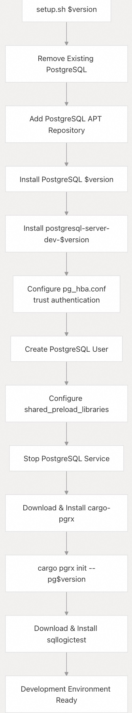
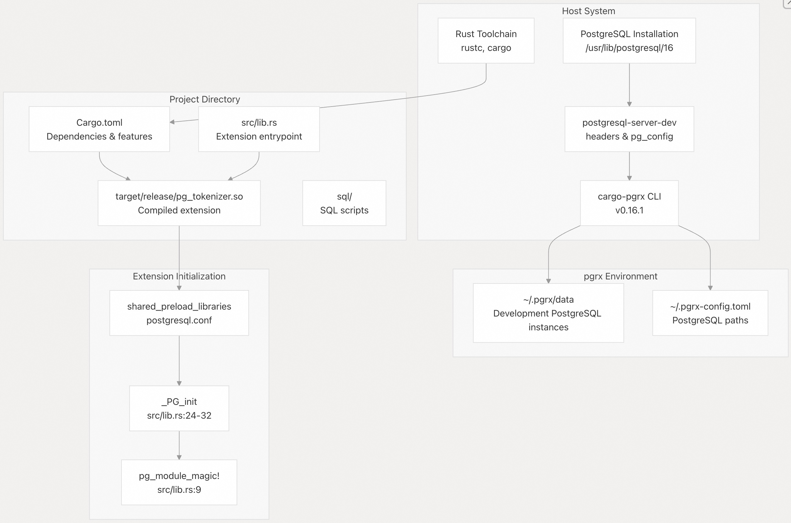
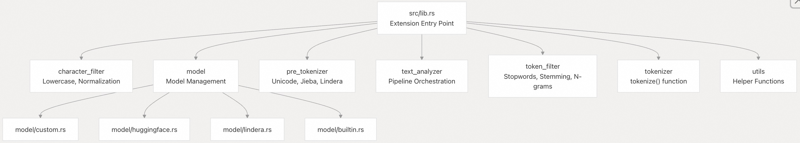

## pg_tokenizer 源码学习: 8.1 开发环境设置 (Development Setup)  
                            
### 作者                            
digoal                            
                            
### 日期                            
2025-11-21                            
                            
### 标签                            
pg\_tokenizer , 词化 , bert , 标记化 , Tokenization                            
                            
----                            
                            
## 背景     
本文介绍如何设置用于**贡献 (contributing)** `pg_tokenizer` 的**开发环境 (development environment)**。它涵盖了所需工具的安装、开发用 **PostgreSQL** 实例的**配置 (configuration)**，以及项目**初始设置 (initial project setup)**。  
  
## 概述 (Overview)  
  
开发 `pg_tokenizer` 需要：    
  
  * 兼容 **pgrx 框架 (framework)** 的 **Rust 工具链 (toolchain)**  
  * 带有**开发头文件 (development headers)** 的 **PostgreSQL 服务器 (server)** (支持版本 13-18)  
  * 用于管理 PostgreSQL 扩展开发 (extension development) 的 **pgrx 命令行工具 (CLI tool)**  
  * 可选: 用于运行**集成测试 (integration tests)** 的 **sqllogictest**  
  
## 先决条件 (Prerequisites)  
  
### 系统要求 (System Requirements)  
  
`pg_tokenizer` 需要一个 64 位**小端序 (little-endian)** 系统。此要求在**编译时 (compile time)** 强制执行 (enforced)：  
  
[`src/lib.rs` 11-12](https://github.com/tensorchord/pg_tokenizer.rs/blob/d3f7a577/src/lib.rs#L11-L12)  
  
该**扩展 (extension)** 支持 **PostgreSQL** 13 至 18 版本，通过 **Cargo 特性标志 (feature flags)** 进行选择：  
  
[`Cargo.toml` 13-19](https://github.com/tensorchord/pg_tokenizer.rs/blob/d3f7a577/Cargo.toml#L13-L19)  
  
### 所需工具 (Required Tools)  
  
| 工具 (Tool) | 最低版本 (Minimum Version) | 用途 (Purpose) |  
| :--- | :--- | :--- |  
| **Rust** | 1.70+ | **核心语言工具链 (Core language toolchain)** |  
| **cargo-pgrx** | 0.16.1 | **PostgreSQL 扩展开发框架 (PostgreSQL extension development framework)** |  
| **PostgreSQL** | 13-18 | **目标数据库服务器 (Target database server)** |  
| **postgresql-server-dev** | 匹配 PG 版本 | **开发头文件和库 (Development headers and libraries)** |  
| **sqllogictest** | 0.26.4 | **集成测试运行器 (Integration test runner)** (可选/optional) |  
  
## 自动化设置 (Automated Setup)  
  
该**仓库 (repository)** 包含一个针对 **Ubuntu/Debian** 系统的**自动化设置脚本 (automated setup script)**，位于 [`tools/setup.sh` 1-26](https://github.com/tensorchord/pg_tokenizer.rs/blob/d3f7a577/tools/setup.sh#L1-L26)。此脚本执行完整的**开发环境初始化 (development environment initialization)**。  
  
### 设置脚本工作流 (Setup Script Workflow)  
  
  
  
**来源:** [`tools/setup.sh` 1-26](https://github.com/tensorchord/pg_tokenizer.rs/blob/d3f7a577/tools/setup.sh#L1-L26)  
  
### 运行设置脚本 (Running the Setup Script)  
  
要设置 **PostgreSQL 16** 的**开发环境 (development environment)**：  
  
```bash  
./tools/setup.sh 16  
```  
  
该脚本执行以下操作：  
  
1.  **PostgreSQL 安装 (Installation)** [`tools/setup.sh` 6-12](https://github.com/tensorchord/pg_tokenizer.rs/blob/d3f7a577/tools/setup.sh#L6-L12) - 移除现有的 PostgreSQL 安装，并从官方 PostgreSQL **APT 仓库 (repository)** 安装指定版本  
2.  **认证配置 (Authentication Configuration)** [`tools/setup.sh` 14-16](https://github.com/tensorchord/pg_tokenizer.rs/blob/d3f7a577/tools/setup.sh#L14-L16) - 设置本地开发所需的 **trust 认证 (trust authentication)**  
3.  **用户设置 (User Setup)** [`tools/setup.sh` 17-18](https://github.com/tensorchord/pg_tokenizer.rs/blob/d3f7a577/tools/setup.sh#L17-L18) - 创建一个与您的系统用户名匹配的 **PostgreSQL 超级用户 (superuser)**  
4.  **共享库配置 (Shared Library Configuration)** [`tools/setup.sh` 19](https://github.com/tensorchord/pg_tokenizer.rs/blob/d3f7a577/tools/setup.sh#L19-L19) - 配置 `shared_preload_libraries` 以包含 `pg_tokenizer.so`  
5.  **pgrx 安装 (Installation)** [`tools/setup.sh` 22](https://github.com/tensorchord/pg_tokenizer.rs/blob/d3f7a577/tools/setup.sh#L22-L22) - 下载并安装项目所需的特定版本 **cargo-pgrx**  
6.  **pgrx 初始化 (Initialization)** [`tools/setup.sh` 23](https://github.com/tensorchord/pg_tokenizer.rs/blob/d3f7a577/tools/setup.sh#L23-L23) - 使用已安装的 PostgreSQL 版本**初始化 (Initializes)** **pgrx**  
7.  **测试工具安装 (Test Tool Installation)** [`tools/setup.sh` 25](https://github.com/tensorchord/pg_tokenizer.rs/blob/d3f7a577/tools/setup.sh#L25-L25) - 安装用于**集成测试 (integration testing)** 的 **sqllogictest**  
  
## 手动设置 (Manual Setup)  
  
### 安装 PostgreSQL (Installing PostgreSQL)  
  
为您的目标版本安装 **PostgreSQL** 及其**开发包 (development packages)**：  
  
```bash  
# Ubuntu/Debian  
sudo apt-get install postgresql-16 postgresql-server-dev-16  
  
# macOS (using Homebrew)  
brew install postgresql@16  
```  
  
配置 **PostgreSQL** 以信任本地连接用于开发。编辑 `pg_hba.conf`：  
  
```  
local   all   all   trust  
host    all   all   127.0.0.1/32   trust  
host    all   all   ::1/128        trust  
```  
  
创建一个**数据库用户 (database user)**：  
  
```bash  
sudo -u postgres createuser -s $USER  
sudo -u postgres createdb $USER  
```  
  
### 安装 Rust 工具链 (Installing the Rust Toolchain)  
  
使用 **rustup** 安装 **Rust**：  
  
```bash  
curl --proto '=https' --tlsv1.2 -sSf https://sh.rustup.rs | sh  
```  
  
该**扩展 (extension)** 使用 **stable Rust** 构建。不需要 **nightly 工具链 (toolchain)**。  
  
### 安装 pgrx (Installing pgrx)  
  
`pg_tokenizer` 要求 **pgrx 版本** 0.16.1，正如在 [`Cargo.toml` 32](https://github.com/tensorchord/pg_tokenizer.rs/blob/d3f7a577/Cargo.toml#L32-L32) 中指定的。安装匹配的 **cargo-pgrx 命令行工具 (CLI)**：  
  
```bash  
cargo install cargo-pgrx --version 0.16.1 --locked  
```  
  
使用您的 **PostgreSQL** 安装来**初始化 (Initialize)** **pgrx**：  
  
```bash  
cargo pgrx init --pg16=/usr/bin/pg_config  
```  
  
用适用于您的安装的相应版本标志替换 `--pg16`。**pgrx** 支持同时使用多个 **PostgreSQL** 版本。  
  
## 项目依赖 (Project Dependencies)  
  
### 核心依赖 (Core Dependencies)  
  
项目的**依赖项 (dependencies)** 定义在 [`Cargo.toml` 27-42](https://github.com/tensorchord/pg_tokenizer.rs/blob/d3f7a577/Cargo.toml#L27-L42)。主要依赖项包括：  
  
| 依赖 (Dependency) | 版本 (Version) | 用途 (Purpose) |  
| :--- | :--- | :--- |  
| **pgrx** | 0.16.1 | **PostgreSQL 扩展框架 (PostgreSQL extension framework)** |  
| **tokenizers** | 0.21.0 | **HuggingFace 分词器库 (tokenizers library)** |  
| **jieba-rs** | 0.7.2 | **中文文本分词 (Chinese text segmentation)** |  
| **lindera** | 0.42.2 | **日语形态分析 (Japanese morphological analysis)** |  
| **tocken** | 0.1.0 | **内置分词模型 (Built-in tokenization models)** |  
| **dashmap** | 6.1.0 | **并发哈希映射 (Concurrent hashmap)** 用于**模型缓存 (model caching)** |  
  
### 特性标志 (Feature Flags)  
  
`pg_tokenizer` 使用 **Cargo 特性标志 (feature flags)** 来实现可选功能 [`Cargo.toml` 13-25](https://github.com/tensorchord/pg_tokenizer.rs/blob/d3f7a577/Cargo.toml#L13-L25)：  
  
**PostgreSQL 版本特性 (PostgreSQL Version Features)** (必须且只能启用其中一个)：  
  
  * `pg13`, `pg14`, `pg15`, `pg16`, `pg17`, `pg18`  
  
**Lindera 字典特性 (Lindera Dictionary Features)** (可选，用于日语支持)：  
  
  * `lindera-ipadic` - 标准日语**字典 (Standard Japanese dictionary)**  
  * `lindera-ipadic-neologd` - 包含**新词 (neologisms)** 的扩展字典  
  * `lindera-unidic` - **UniDic 字典**  
  * `lindera-ko-dic` - **韩语字典 (Korean dictionary)**  
  * `lindera-cc-cedict` - **中文字典 (Chinese dictionary)**  
  
### 依赖项安装 (Dependency Installation)  
  
**依赖项 (Dependencies)** 会在您**构建 (build)** 项目时自动下载：  
  
```bash  
cargo build --features pg16  
```  
  
对于支持日语的开发：  
  
```bash  
cargo build --features pg16,lindera-ipadic  
```  
  
## 开发环境结构 (Development Environment Structure)  
  
  
  
**来源:** [`Cargo.toml` 1-57](https://github.com/tensorchord/pg_tokenizer.rs/blob/d3f7a577/Cargo.toml#L1-L57) [`src/lib.rs` 9-32](https://github.com/tensorchord/pg_tokenizer.rs/blob/d3f7a577/src/lib.rs#L9-L32) [`tools/setup.sh` 19-23](https://github.com/tensorchord/pg_tokenizer.rs/blob/d3f7a577/tools/setup.sh#L19-L23)  
  
## 扩展初始化要求 (Extension Initialization Requirements)  
  
`pg_tokenizer` 必须通过 `shared_preload_libraries` 加载，因为它在 `_PG_init` **钩子 (hook)** 期间执行**初始化 (initialization)** [`src/lib.rs` 24-32](https://github.com/tensorchord/pg_tokenizer.rs/blob/d3f7a577/src/lib.rs#L24-L32)：  
  
```rust  
#[pgrx::pg_guard]  
extern "C-unwind" fn _PG_init() {  
    if unsafe { pgrx::pg_sys::IsUnderPostmaster } {  
        pgrx::error!("pg_tokenizer must be loaded via shared_preload_libraries.");  
    }  
  
    pre_tokenizer::init();  
    model::init();  
}  
```  
  
**初始化序列 (Initialization sequence)**：  
  
1.  **保护检查 (Guard Check)** - 确保扩展在**服务器启动时 (server startup)** 加载，而非**运行时 (runtime)** [`src/lib.rs` 26-28](https://github.com/tensorchord/pg_tokenizer.rs/blob/d3f7a577/src/lib.rs#L26-L28)  
2.  **预分词器初始化 (Pre-tokenizer Initialization)** [`src/lib.rs` 30](https://github.com/tensorchord/pg_tokenizer.rs/blob/d3f7a577/src/lib.rs#L30-L30) - 注册 **Jieba** 和 **Lindera** 等**预分词器 (pre-tokenizers)**  
3.  **模型初始化 (Model Initialization)** [`src/lib.rs` 31](https://github.com/tensorchord/pg_tokenizer.rs/blob/d3f7a577/src/lib.rs#L31-L31) - 设置**模型对象池 (model object pool)** 和**预加载系统 (preloading system)**  
  
## 开发配置 (Configuration for Development)  
  
### postgresql.conf 设置 (Settings)  
  
对于使用 **pgrx** 进行开发，配置您的 **PostgreSQL** 实例：  
  
```sql  
ALTER SYSTEM SET shared_preload_libraries = 'pg_tokenizer.so';  
```  
  
对于测试环境，将 `tokenizer_catalog` **模式 (schema)** 添加到**搜索路径 (search path)** [`src/lib.rs` 42](https://github.com/tensorchord/pg_tokenizer.rs/blob/d3f7a577/src/lib.rs#L42-L42)：  
  
```sql  
ALTER SYSTEM SET search_path = '"$user", public, tokenizer_catalog';  
```  
  
### 开发构建配置文件 (Development Build Profiles)  
  
该项目定义了两个**构建配置文件 (build profiles)** [`Cargo.toml` 47-56](https://github.com/tensorchord/pg_tokenizer.rs/blob/d3f7a577/Cargo.toml#L47-L56)：  
  
**发布配置文件 (Release Profile)** [`Cargo.toml` 47-50](https://github.com/tensorchord/pg_tokenizer.rs/blob/d3f7a577/Cargo.toml#L47-L50)：  
  
  * 完全**优化 (optimization)** (`opt-level = 3`)  
  * **Fat LTO** 以实现最大**性能 (maximum performance)**  
  * 单个 **codegen 单元 (unit)** 以实现更好的优化  
  
**开发优化配置文件 (Dev-Opt Profile)** [`Cargo.toml` 52-56](https://github.com/tensorchord/pg_tokenizer.rs/blob/d3f7a577/Cargo.toml#L52-L56)：  
  
  * 优化的**调试构建 (debug builds)** (`opt-level = 3`)  
  * **Thin LTO** 以实现更快的**编译 (compilation)**  
  * 8 个 **codegen 单元 (units)** 以实现**并行编译 (parallel compilation)**  
  
使用 **dev-opt 配置文件**以加快开发迭代速度：  
  
```bash  
cargo build --profile dev-opt --features pg16  
```  
  
## 构建扩展 (Building the Extension)  
  
### 标准构建 (Standard Build)  
  
为您的 **PostgreSQL** 版本**构建扩展 (Build the extension)**：  
  
```bash  
cargo pgrx install --pg-config /usr/bin/pg_config --features pg16  
```  
  
这会**编译 (compiles)** 扩展并将其安装到 **PostgreSQL 扩展目录 (extensions directory)**。  
  
### pgrx 开发命令 (Development Commands)  
  
| 命令 (Command) | 用途 (Purpose) |  
| :--- | :--- |  
| `cargo pgrx init` | 使用 **PostgreSQL** 安装来**初始化 (Initialize)** **pgrx** |  
| `cargo pgrx run pg16` | 启动加载了**扩展 (extension)** 的开发 **PostgreSQL** 实例 |  
| `cargo pgrx install` | 将**扩展 (extension)** 安装到现有的 **PostgreSQL** 安装中 |  
| `cargo pgrx test` | 运行基于 **Rust** 的**单元测试 (unit tests)** |  
| `cargo pgrx schema` | 生成 **SQL 模式文件 (schema files)** |  
  
### 运行开发实例 (Running a Development Instance)  
  
启动一个加载了**扩展 (extension)** 的临时 **PostgreSQL** 实例：  
  
```bash  
cargo pgrx run pg16  
```  
  
这会在一个**随机端口 (random port)** 上启动 **PostgreSQL**，预安装了**扩展 (extension)** 并创建了一个 **psql** 会话。  
  
## 验证 (Verification)  
  
设置完成后，**验证安装 (verify the installation)**：  
  
```sql  
CREATE EXTENSION pg_tokenizer;  
  
-- Check that initialization succeeded  
SELECT * FROM tokenizer_catalog.model LIMIT 1;  
  
-- Test basic tokenization  
SELECT tokenize('simple', NULL, 'Hello world');  
```  
  
如果**扩展 (extension)** 加载失败，请检查：  
  
1.  `shared_preload_libraries` 是否包含 `pg_tokenizer.so`  
2.  配置更改后 **PostgreSQL** 是否已**重启 (restarted)**  
3.  **扩展库 (extension library)** 是否存在于 `$libdir` 中  
  
## 模块结构 (Module Structure)  
  
该**扩展 (extension)** 的**模块层次结构 (module hierarchy)** 定义在 [`src/lib.rs` 1-7](https://github.com/tensorchord/pg_tokenizer.rs/blob/d3f7a577/src/lib.rs#L1-L7)：  
  
  
  
**来源:** [`src/lib.rs` 1-7](https://github.com/tensorchord/pg_tokenizer.rs/blob/d3f7a577/src/lib.rs#L1-L7)  
  
## 开发工具 (Development Tools)  
  
### sqllogictest  
  
该项目使用 **sqllogictest** 进行**集成测试 (integration testing)**。安装它：  
  
```bash  
# Automated via setup.sh  
curl -fsSL https://github.com/risinglightdb/sqllogictest-rs/releases/download/v0.26.4/sqllogictest-bin-v0.26.4-$(uname -m)-unknown-linux-musl.tar.gz | tar -xOzf - ./sqllogictest | install -m 755 /dev/stdin /usr/local/bin/sqllogictest  
```  
  
**测试文件 (Test files)** 位于 `tests/` 目录中。有关用法详细信息，请参阅 Building and Testing 章节。  
  
### IDE 设置 (IDE Setup)  
  
对于在 **Visual Studio Code** 或其他 **IDE** 中的开发：  
  
1.  安装 **rust-analyzer 扩展 (extension)**  
  
2.  配置 **rust-analyzer** 以使用正确的**特性标志 (feature flags)**：  
  
    ```  
    {  
      "rust-analyzer.cargo.features": ["pg16"]  
    }  
    ```  
  
3.  在 `.vscode/settings.json` 中设置**构建配置文件 (build profile)**：  
  
    ```  
    {  
      "rust-analyzer.cargo.buildScripts.overrideCommand": [  
        "cargo", "check", "--features", "pg16", "--message-format=json"  
      ]  
    }  
    ```  
  
# 附录: 官方是否考虑给出用于开发环境的 Docker 容器化方案?  
鉴于**自动化设置脚本** (`tools/setup.sh`) 仅适用于 **Ubuntu/Debian** 系统，且项目对 **Rust 工具链 (toolchain)** (1.70+) 和 **`cargo-pgrx`** (0.16.1) 版本有严格的**依赖限制 (dependency constraint)**，对于使用非 Linux 发行版（如 macOS 或 Windows）的开发者来说，官方是否提供了或推荐使用 **Docker** 或其他**容器化 (containerization)** 方案来封装整个**开发环境 (development environment)**？  
  
这样做能最大程度地保证**环境一致性 (consistency)** 和**可移植性 (portability)**，并简化在不同操作系统上执行**手动设置 (Manual Setup)** 中复杂且容易出错的步骤。  
  
## Answer  
  
根据代码库的当前状态，**官方并未提供专门用于开发环境的 Docker 容器化方案**。  
  
项目确实提供了 Docker 镜像，但这是用于**生产部署和快速试用**的 `tensorchord/vchord-suite` 镜像  。该镜像预装了 `pg_tokenizer` 扩展及其他相关扩展（VectorChord-bm25、VectorChord、pgvector），主要用于运行已编译好的扩展，而非用于开发构建  。  
  
对于开发环境设置，文档仅提供了**手动安装步骤**  ：  
  
1. 安装 Rust 工具链  
2. 克隆仓库  
3. 安装 `cargo-pgrx` (版本必须与 `Cargo.toml` 中的 `pgrx = "=0.16.1"` 匹配  )  
4. 运行 `cargo pgrx init`  
  
CI/CD 流程中使用的 `tools/setup.sh` 脚本  确实仅针对 Ubuntu/Debian 系统设计，用于在 GitHub Actions 的 `ubuntu-24.04` 和 `ubuntu-24.04-arm` runner 上自动化设置  。  
  
**对于 macOS 或 Windows 开发者**，目前的选择是：  
  
1. **手动安装所有依赖**：按照 `docs/02-development.md` 的步骤操作，但需要自行解决平台特定的依赖问题  
2. **使用生产 Docker 镜像作为变通方案**：虽然不是为开发设计的，但可以在容器内进行开发，不过需要手动配置开发工具和挂载源代码目录  
  
项目的构建系统依赖 `pgrx` 框架  ，该框架本身支持跨平台开发，但 `pg_tokenizer` 项目没有提供官方的跨平台开发环境容器化方案。  
  
## Notes  
  
- 项目的 CI/CD 流程在 12 种配置（6 个 PostgreSQL 版本 × 2 种架构）上进行测试  ，但这些都是在 Linux 环境中运行的  
- 发布流程生成的构建产物（.deb 和 .zip 包）  也仅针对 Linux 平台  
- 如果需要在非 Linux 系统上开发，建议向项目维护者提出 feature request，请求提供官方的开发环境 Docker 镜像或 devcontainer 配置  
    
#### [PolarDB 学习图谱](https://www.aliyun.com/database/openpolardb/activity "8642f60e04ed0c814bf9cb9677976bd4")
  
  
#### [PostgreSQL 解决方案集合](../201706/20170601_02.md "40cff096e9ed7122c512b35d8561d9c8")
  
  
#### [德哥 / digoal's Github - 公益是一辈子的事.](https://github.com/digoal/blog/blob/master/README.md "22709685feb7cab07d30f30387f0a9ae")
  
  
#### [About 德哥](https://github.com/digoal/blog/blob/master/me/readme.md "a37735981e7704886ffd590565582dd0")
  
  

  
