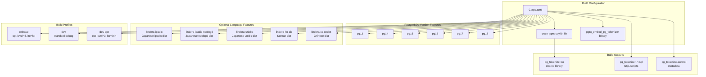
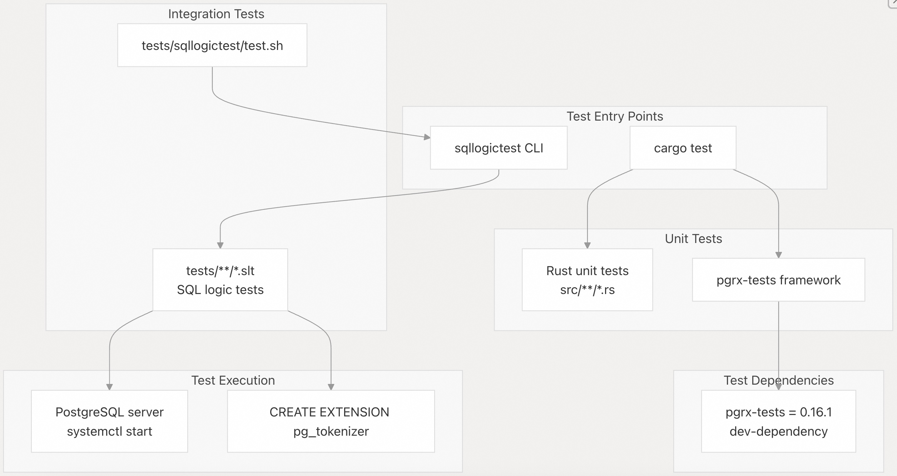
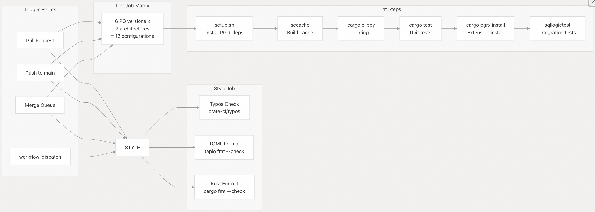
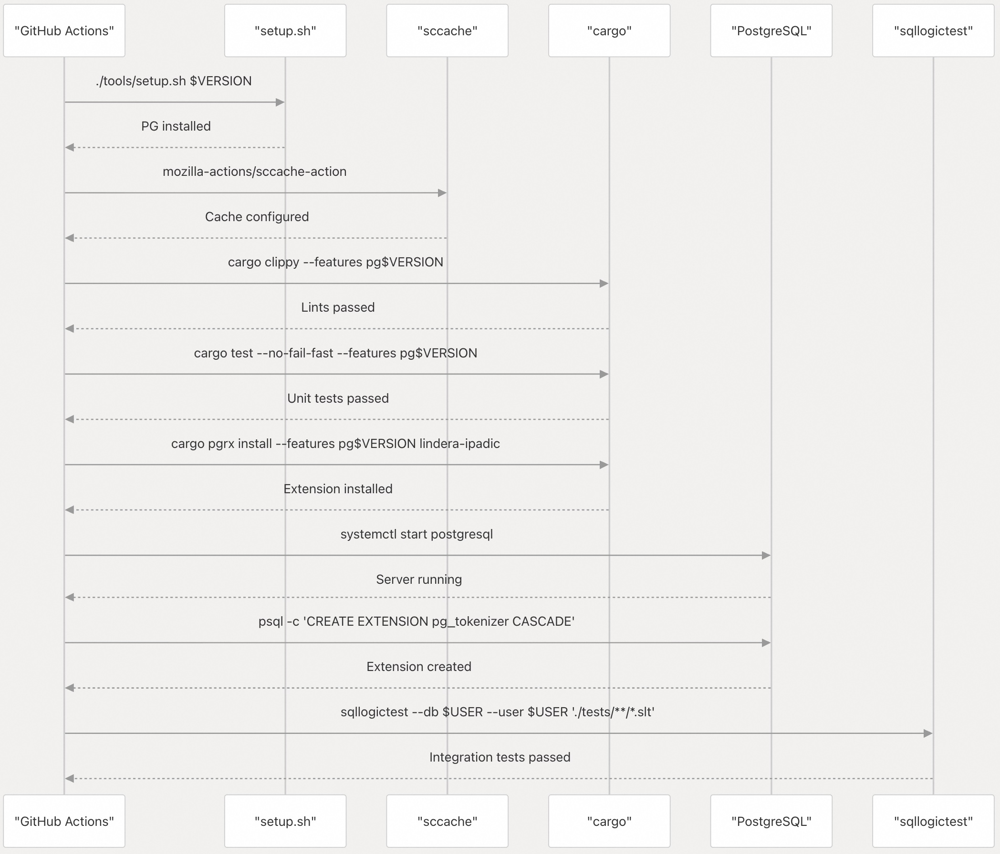
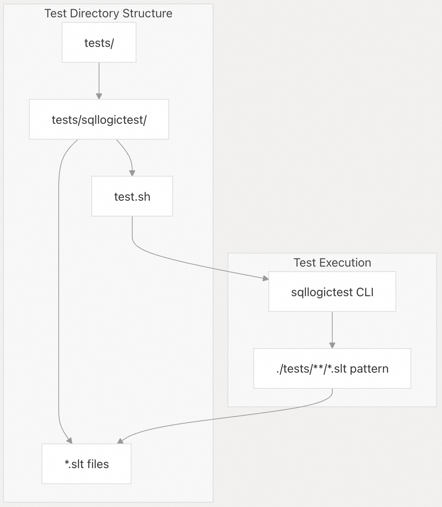

## pg_tokenizer 源码学习: 8.2 构建与测试 (Building and Testing)  
                              
### 作者                              
digoal                              
                              
### 日期                              
2025-11-21                              
                              
### 标签                              
pg\_tokenizer , 词化 , bert , 标记化 , Tokenization                              
                              
----                              
                              
## 背景       
本文涵盖了 `pg_tokenizer` 的**构建过程 (build process)** 和**测试流程 (testing procedures)**。解释了如何从**源代码 (source)** 编译该**扩展 (extension)**、运行**测试套件 (test suite)**，并理解**持续集成/持续部署 (CI/CD) 验证管线 (validation pipeline)**。  
  
## 构建系统概述 (Build System Overview)  
  
`pg_tokenizer` **扩展 (extension)** 使用基于 **Cargo** 的 **pgrx 框架 (framework)** **构建系统 (build system)**，支持多个 **PostgreSQL 版本 (versions)** 和**可选功能 (optional features)**。该**构建系统**会生成一个**共享库 (shared library)** (`pg_tokenizer.so`)，**PostgreSQL** 将其作为**扩展**加载。  
  
### 构建目标和功能 (Build Targets and Features)  
  

  
**来源:** [`Cargo.toml` 1-57](https://github.com/tensorchord/pg_tokenizer.rs/blob/d3f7a577/Cargo.toml#L1-L57)  
  
**构建配置 (build configuration)** 定义了：  
  
  * **Crate 类型 (Crate types)**：**`cdylib`**（用于 **PostgreSQL**）和 **`lib`**（用于 **Rust** 测试），位于 [`Cargo.toml` 7](https://github.com/tensorchord/pg_tokenizer.rs/blob/d3f7a577/Cargo.toml#L7-L7)  
  * **PostgreSQL 版本功能 (version features)**：用于 PG 13-18 的**互斥功能 (mutually exclusive features)**，位于 [`Cargo.toml` 14-19](https://github.com/tensorchord/pg_tokenizer.rs/blob/d3f7a577/Cargo.toml#L14-L19)  
  * **Lindera 字典功能 (dictionary features)**：可选的日语、韩语和中文**字典 (dictionaries)**，位于 [`Cargo.toml` 21-25](https://github.com/tensorchord/pg_tokenizer.rs/blob/d3f7a577/Cargo.toml#L21-L25)  
  * **构建配置 (Build profiles)**：具有**激进优化 (aggressive optimizations)**（`lto = "fat"`）的**发布版本 (Release)** 和**开发优化配置 (development-optimized profile)**，位于 [`Cargo.toml` 47-56](https://github.com/tensorchord/pg_tokenizer.rs/blob/d3f7a577/Cargo.toml#L47-L56)  
  
## 构建扩展 (Building the Extension)  
  
### 标准构建命令 (Standard Build Command)  
  
```bash  
cargo pgrx install --features "pg16 lindera-ipadic" --release --sudo  
```  
  
`cargo pgrx install` **命令 (command)**：  
  
1.  使用指定的 **PostgreSQL 版本功能 (version feature)** 编译 **Rust** 代码  
2.  从 **Rust** 代码**注解 (annotations)** 生成 **SQL 模式文件 (schema files)**  
3.  将**编译后的库 (compiled library)** 和 **SQL 文件 (SQL files)** 复制到 **PostgreSQL** **安装目录 (installation directory)**  
4.  对于**系统级 (system-level)** 的 **PostgreSQL** 安装，需要 `--sudo`  
  
**来源:** [`.github/workflows/check.yml` 78](https://github.com/tensorchord/pg_tokenizer.rs/blob/d3f7a577/.github/workflows/check.yml#L78-L78)  
  
### 构建功能选择 (Build Feature Selection)  
  
| 功能标志 (Feature Flag) | 用途 (Purpose) | 必需 (Required) |  
| :--- | :--- | :--- |  
| `pg13`, `pg14`, `pg15`, `pg16`, `pg17`, `pg18` | **PostgreSQL 版本兼容性 (version compatibility)** | 是（且仅启用一个） |  
| `lindera-ipadic` | 使用 **ipadic 字典 (dictionary)** 进行日语**文本处理 (text processing)** | 否 |  
| `lindera-ipadic-neologd` | 使用 **neologd 字典** 进行日语**文本处理** | 否 |  
| `lindera-unidic` | 使用 **unidic 字典** 进行日语**文本处理** | 否 |  
| `lindera-ko-dic` | 韩语**文本处理** | 否 |  
| `lindera-cc-cedict` | 中文**文本处理** | 否 |  
  
**PostgreSQL 版本功能 (version feature)** 一次只能启用一个。如果需要，可以组合多个 **Lindera 字典功能 (dictionary features)**。  
  
**来源:** [`Cargo.toml` 14-25](https://github.com/tensorchord/pg_tokenizer.rs/blob/d3f7a577/Cargo.toml#L14-L25)  
  
### 构建配置 (Build Profiles)  
  
```  
[profile.release]  
opt-level = 3  
lto = "fat"  
codegen-units = 1  
  
[profile.dev-opt]  
inherits = "dev"  
opt-level = 3  
lto = "thin"  
codegen-units = 8  
```  
  
  * **发布配置 (Release profile)**：具有**完全链接时优化 (full link-time optimization)** 和**单个代码生成单元 (single codegen unit)** 的**最大优化 (Maximum optimization)**，以实现最佳**性能 (performance)**，位于 [`Cargo.toml` 47-50](https://github.com/tensorchord/pg_tokenizer.rs/blob/d3f7a577/Cargo.toml#L47-L50)  
  * **开发优化配置 (Dev-opt profile)**：通过 **thin LTO** 实现**平衡优化 (Balanced optimization)**，以加快**开发构建 (development builds)**，位于 [`Cargo.toml` 52-56](https://github.com/tensorchord/pg_tokenizer.rs/blob/d3f7a577/Cargo.toml#L52-L56)  
  
**来源:** [`Cargo.toml` 47-56](https://github.com/tensorchord/pg_tokenizer.rs/blob/d3f7a577/Cargo.toml#L47-L56)  
  
## 测试框架架构 (Test Framework Architecture)  
  
    
  
**来源:** [`Cargo.toml` 44-45](https://github.com/tensorchord/pg_tokenizer.rs/blob/d3f7a577/Cargo.toml#L44-L45) [`.github/workflows/check.yml` 76-83](https://github.com/tensorchord/pg_tokenizer.rs/blob/d3f7a577/.github/workflows/check.yml#L76-L83) [`tests/sqllogictest/test.sh` 1-5](https://github.com/tensorchord/pg_tokenizer.rs/blob/d3f7a577/tests/sqllogictest/test.sh#L1-L5)  
  
### 运行单元测试 (Running Unit Tests)  
  
**单元测试 (Unit tests)** 使用**标准 Cargo 测试运行器 (test runner)** 执行：  
  
```bash  
cargo test --no-fail-fast --features pg16  
```  
  
`--no-fail-fast` **标志 (flag)** 确保即使某些测试失败，所有测试也会运行，从而提供完整的**测试覆盖信息 (test coverage information)**。位于 [`.github/workflows/check.yml` 76](https://github.com/tensorchord/pg_tokenizer.rs/blob/d3f7a577/.github/workflows/check.yml#L76-L76) 的**测试命令 (test command)** 针对选定的 **PostgreSQL 版本 (version)** 运行**单元测试**。  
  
**来源:** [`.github/workflows/check.yml` 76](https://github.com/tensorchord/pg_tokenizer.rs/blob/d3f7a577/.github/workflows/check.yml#L76-L76)  
  
### 运行集成测试 (Running Integration Tests)  
  
**集成测试 (Integration tests)** 使用 **sqllogictest 框架 (framework)** 来**验证 (validate)** **SQL 功能 (functionality)**：  
  
```bash  
# Start PostgreSQL  
sudo systemctl start postgresql  
  
# Create the extension  
psql -c 'CREATE EXTENSION IF NOT EXISTS pg_tokenizer CASCADE;'  
  
# Run sqllogictest  
sqllogictest --db $USER --user $USER './tests/**/*.slt'  
```  
  
位于 [`.github/workflows/check.yml` 80-83](https://github.com/tensorchord/pg_tokenizer.rs/blob/d3f7a577/.github/workflows/check.yml#L80-L83) 的**集成测试流程 (integration test process)** 验证了：  
  
1.  **扩展安装 (Extension installation)**  
2.  **SQL 函数行为 (function behavior)**  
3.  **数据处理管线 (Data processing pipelines)**  
4.  **模型加载和缓存 (Model loading and caching)**  
  
位于 [`tests/sqllogictest/test.sh` 1-5](https://github.com/tensorchord/pg_tokenizer.rs/blob/d3f7a577/tests/sqllogictest/test.sh#L1-L5) 的**测试脚本 (test script)** 提供了一个方便的**包装器 (wrapper)**，用于运行所有 `.slt` 文件。  
  
**来源:** [`.github/workflows/check.yml` 80-83](https://github.com/tensorchord/pg_tokenizer.rs/blob/d3f7a577/.github/workflows/check.yml#L80-L83) [`tests/sqllogictest/test.sh` 1-5](https://github.com/tensorchord/pg_tokenizer.rs/blob/d3f7a577/tests/sqllogictest/test.sh#L1-L5)  
  
## 持续集成/持续部署 (CI/CD) 验证管线 (Validation Pipeline)  
  
   
  
**来源:** [`.github/workflows/check.yml` 1-84](https://github.com/tensorchord/pg_tokenizer.rs/blob/d3f7a577/.github/workflows/check.yml#L1-L84)  
  
### CI 矩阵配置 (CI Matrix Configuration)  
  
**持续集成 (CI)** **管线 (pipeline)** 通过**全面构建矩阵 (comprehensive build matrix)** 来**验证 (validate)** 更改：  
  
| 维度 (Dimension) | 值 (Values) | 总组合数 (Total Combinations) |  
| :--- | :--- | :--- |  
| **PostgreSQL 版本 (Version)** | 13, 14, 15, 16, 17, 18 | 6 |  
| **架构 (Architecture)** | x86\_64, aarch64 | 2 |  
| **总配置 (Total Configurations)** | | **12** |  
  
该**矩阵 (matrix)** 定义于 [`.github/workflows/check.yml` 60-64](https://github.com/tensorchord/pg_tokenizer.rs/blob/d3f7a577/.github/workflows/check.yml#L60-L64)，确保了与所有支持的 **PostgreSQL 版本 (versions)** 和两个主要的 **CPU 架构 (architectures)** 之间的**兼容性 (compatibility)**。  
  
**来源:** [`.github/workflows/check.yml` 60-64](https://github.com/tensorchord/pg_tokenizer.rs/blob/d3f7a577/.github/workflows/check.yml#L60-L64)  
  
### 样式验证 (Style Validation)  
  
**样式作业 (style job)** 独立运行，并**验证 (validates)** **代码质量 (code quality)**：  
  
1.  **拼写错误 (Typos)**：使用 **`crate-ci/typos`** 进行**拼写检查 (Spell-checking)**，位于 [`.github/workflows/check.yml` 50-51](https://github.com/tensorchord/pg_tokenizer.rs/blob/d3f7a577/.github/workflows/check.yml#L50-L51)  
2.  **TOML 格式化 (Formatting)**：使用 **`taplo fmt --check`** 验证 `Cargo.toml` 和其他 **TOML 文件 (files)**，位于 [`.github/workflows/check.yml` 52-55](https://github.com/tensorchord/pg_tokenizer.rs/blob/d3f7a577/.github/workflows/check.yml#L52-L55)  
3.  **Rust 格式化 (Formatting)**：使用 **`cargo fmt --check`** **强制执行 (Enforces)** **代码样式 (code style)**，位于 [`.github/workflows/check.yml` 56-57](https://github.com/tensorchord/pg_tokenizer.rs/blob/d3f7a577/.github/workflows/check.yml#L56-L57)  
  
**来源:** [`.github/workflows/check.yml` 44-57](https://github.com/tensorchord/pg_tokenizer.rs/blob/d3f7a577/.github/workflows/check.yml#L44-L57)  
  
### Lint 管线步骤 (Lint Pipeline Steps)  
  
   
  
**来源:** [`.github/workflows/check.yml` 66-83](https://github.com/tensorchord/pg_tokenizer.rs/blob/d3f7a577/.github/workflows/check.yml#L66-L83)  
  
每个 **Lint 作业 (job)** 执行以下序列：  
  
1.  **环境设置 (Environment Setup)**：运行 `./tools/setup.sh $VERSION` 以安装 **PostgreSQL** 和**依赖项 (dependencies)**，位于 [`.github/workflows/check.yml` 70](https://github.com/tensorchord/pg_tokenizer.rs/blob/d3f7a577/.github/workflows/check.yml#L70-L70)  
2.  **构建缓存 (Build Cache)**：配置 **sccache** 以加快**重建 (rebuilds)** 速度，位于 [`.github/workflows/check.yml` 71-72](https://github.com/tensorchord/pg_tokenizer.rs/blob/d3f7a577/.github/workflows/check.yml#L71-L72)  
3.  **Clippy Linting**：使用 `cargo clippy` 运行**静态分析 (static analysis)**，位于 [`.github/workflows/check.yml` 73-74](https://github.com/tensorchord/pg_tokenizer.rs/blob/d3f7a577/.github/workflows/check.yml#L73-L74)  
4.  **单元测试 (Unit Testing)**：使用 `cargo test` 执行 **Rust 测试 (tests)**，位于 [`.github/workflows/check.yml` 75-76](https://github.com/tensorchord/pg_tokenizer.rs/blob/d3f7a577/.github/workflows/check.yml#L75-L76)  
5.  **扩展安装 (Extension Installation)**：使用 `cargo pgrx install --features "pg$VERSION lindera-ipadic"` 进行**构建 (Builds)** 和**安装 (installs)**，位于 [`.github/workflows/check.yml` 77-78](https://github.com/tensorchord/pg_tokenizer.rs/blob/d3f7a577/.github/workflows/check.yml#L77-L78)  
6.  **集成测试 (Integration Testing)**：启动 **PostgreSQL**，**创建扩展 (creates the extension)**，并运行 **sqllogictest**，位于 [`.github/workflows/check.yml` 79-83](https://github.com/tensorchord/pg_tokenizer.rs/blob/d3f7a577/.github/workflows/check.yml#L79-L83)  
  
**来源:** [`.github/workflows/check.yml` 66-83](https://github.com/tensorchord/pg_tokenizer.rs/blob/d3f7a577/.github/workflows/check.yml#L66-L83)  
  
## 构建环境配置 (Build Environment Configuration)  
  
### 环境变量 (Environment Variables)  
  
位于 [`.github/workflows/check.yml` 36-41](https://github.com/tensorchord/pg_tokenizer.rs/blob/d3f7a577/.github/workflows/check.yml#L36-L41) 的关键设置：  
  
```  
env:  
  CARGO_TERM_COLOR: always  
  RUST_BACKTRACE: 1  
  SCCACHE_GHA_ENABLED: true  
  RUSTC_WRAPPER: sccache  
  RUSTFLAGS: "-Dwarnings"  
```  
  
  * **CARGO\_TERM\_COLOR**：启用**彩色输出 (colored output)** 以提高**可读性 (readability)**  
  * **RUST\_BACKTRACE**：在**测试失败 (test failures)** 时提供**完整回溯 (full backtraces)**  
  * **SCCACHE\_GHA\_ENABLED**：启用 **GitHub Actions sccache 集成 (integration)**  
  * **RUSTC\_WRAPPER**：通过 **sccache** 路由**编译 (compilation)** 以进行**缓存 (caching)**  
  * **RUSTFLAGS**：将所有**警告 (warnings)** 视为**错误 (errors)**（`-Dwarnings`）  
  
**来源:** [`.github/workflows/check.yml` 36-41](https://github.com/tensorchord/pg_tokenizer.rs/blob/d3f7a577/.github/workflows/check.yml#L36-L41)  
  
### 并发控制 (Concurrency Control)  
  
```  
concurrency:  
  group: ${{ github.ref }}-${{ github.workflow }}  
  cancel-in-progress: true  
```    
  
位于 [`.github/workflows/check.yml` 32-34](https://github.com/tensorchord/pg_tokenizer.rs/blob/d3f7a577/.github/workflows/check.yml#L32-L34) 的**并发配置 (concurrency configuration)** 确保每个**分支/拉取请求 (branch/PR)** 只执行一次 **CI 运行 (CI run)**，并在推送新**提交 (commits)** 时**自动取消 (automatically canceling)** 过时的运行。  
  
**来源:** [`.github/workflows/check.yml` 32-34](https://github.com/tensorchord/pg_tokenizer.rs/blob/d3f7a577/.github/workflows/check.yml#L32-L34)  
  
## 测试文件组织 (Test File Organization)  
  
   
  
**来源:** [`tests/sqllogictest/test.sh` 1-5](https://github.com/tensorchord/pg_tokenizer.rs/blob/d3f7a577/tests/sqllogictest/test.sh#L1-L5) [`.github/workflows/check.yml` 83](https://github.com/tensorchord/pg_tokenizer.rs/blob/d3f7a577/.github/workflows/check.yml#L83-L83)  
  
**集成测试 (Integration tests)** 的组织方式如下：  
  
  * **测试目录 (Test directory)**：`tests/sqllogictest/` 包含 **SQL 逻辑测试文件 (SQL logic test files)**  
  * **测试文件 (Test files)**：`.slt` 文件，包含 **SQL 语句 (SQL statements)** 和**预期结果 (expected results)**  
  * **测试运行器 (Test runner)**：位于 [`tests/sqllogictest/test.sh` 4](https://github.com/tensorchord/pg_tokenizer.rs/blob/d3f7a577/tests/sqllogictest/test.sh#L4-L4) 的 `test.sh` **脚本 (script)** 执行所有测试  
  * **模式匹配 (Pattern matching)**：位于 [`.github/workflows/check.yml` 83](https://github.com/tensorchord/pg_tokenizer.rs/blob/d3f7a577/.github/workflows/check.yml#L83-L83) 的 **glob** `./tests/**/*.slt` **递归地 (recursively)** 查找所有**测试文件 (test files)**  
  
**来源:** [`tests/sqllogictest/test.sh` 1-5](https://github.com/tensorchord/pg_tokenizer.rs/blob/d3f7a577/tests/sqllogictest/test.sh#L1-L5) [`.github/workflows/check.yml` 83](https://github.com/tensorchord/pg_tokenizer.rs/blob/d3f7a577/.github/workflows/check.yml#L83-L83)  
  
## 构建优化 (Build Optimization)  
  
### 发布构建配置 (Release Build Configuration)  
  
位于 [`Cargo.toml` 47-50](https://github.com/tensorchord/pg_tokenizer.rs/blob/d3f7a577/Cargo.toml#L47-L50) 的**发布配置 (release profile)** 应用了**激进的优化 (aggressive optimizations)**：  
  
  * **opt-level = 3**：**最大优化级别 (Maximum optimization level)**  
  * **lto = "fat"**：跨所有 **crate** 的**完全链接时优化 (Full link-time optimization)**  
  * **codegen-units = 1**：**单个代码生成单元 (Single codegen unit)**，以实现更好的**跨函数优化 (cross-function optimization)**  
  
此**配置 (configuration)** 优先考虑**运行时性能 (runtime performance)** 而非**构建时间 (build time)**，适用于**生产部署 (production deployments)**。  
  
**来源:** [`Cargo.toml` 47-50](https://github.com/tensorchord/pg_tokenizer.rs/blob/d3f7a577/Cargo.toml#L47-L50)  
  
### 开发优化构建 (Development-Optimized Build)  
  
位于 [`Cargo.toml` 52-56](https://github.com/tensorchord/pg_tokenizer.rs/blob/d3f7a577/Cargo.toml#L52-L56) 的 **`dev-opt` 配置 (profile)** 平衡了**构建时间 (build time)** 和**性能 (performance)**：  
  
  * **inherits = "dev"**：基于**标准调试配置 (standard debug profile)**  
  * **opt-level = 3**：**高优化级别 (High optimization level)**  
  * **lto = "thin"**：**轻量级链接时优化 (Lightweight link-time optimization)**  
  * **codegen-units = 8**：**并行代码生成 (Parallel codegen)** 以加快构建速度  
  
此**配置 (profile)** 对**开发测试 (development testing)** 非常有用，即需要一定优化但**构建时间 (build time)** 很重要的情况。  
  
**来源:** [`Cargo.toml` 52-56](https://github.com/tensorchord/pg_tokenizer.rs/blob/d3f7a577/Cargo.toml#L52-L56)  
  
-----  
    
# 附录1: 定制化高性能部署 (Customized High-Performance Deployment)  
  
基于**构建功能选择 (Build Feature Selection)** 和**发布构建配置 (Release Build Configuration)**，如果我只需要在特定 **PostgreSQL 版本**（例如 **PG 16**）上使用**中文文本处理**功能（即 **`lindera-cc-cedict`**），并希望获得**最高的运行时性能 (runtime performance)**，我应该如何构建该扩展？  
  
具体来说，为了实现**最小化扩展体积 (minimal extension size)** 和**最大化速度 (maximum speed)**，我应该在 `cargo pgrx install` 命令中如何指定 **PostgreSQL 版本功能**、**Lindera 字典功能**，以及是否需要显式启用**发布配置 (Release profile)**？  
  
**价值分析：**  
  
* **痛点切中：** 抓住了用户在**生产环境 (production deployments)** 中最关心的两个核心要素：**性能**（通过**最大优化级别**和 **LTO** 实现）和**资源效率**（只编译所需的**互斥功能**，减少不必要的字典）。  
* **术语关联：** 这个问题有效地结合了以下三个关键部分的内容：  
    1.  **构建功能选择**：选择**恰好一个** `pgXX` 功能和一个**所需** `lindera-*` 功能。  
    2.  **构建配置**：确保使用了**最大优化**的 `Release profile`。  
    3.  **标准构建命令**：询问如何在实际命令 (`cargo pgrx install`) 中体现这些选择。  
* **实用性强：** 答案将直接指导用户如何执行一次**最优化的、针对特定需求的生产构建 (optimized, tailored production build)**。  
  
## Answer  
  
您需要使用以下命令来构建扩展以获得最高性能和最小体积：   
  
```bash  
cargo pgrx install --features "pg16 lindera-cc-cedict" --release --sudo  
```  
  
让我详细解释每个参数的作用：   
  
### PostgreSQL 版本功能  
  
您需要指定 `pg16` 功能标志。这是必需的，因为 PostgreSQL 版本功能是互斥的，必须恰好选择一个   。  
  
### Lindera 字典功能  
  
对于中文文本处理，您需要启用 `lindera-cc-cedict` 功能  。这个功能标志会启用 CC-CEDICT 中文词典支持  。  
  
### 发布配置 (Release Profile)  
  
`--release` 参数是**必需的**，它会启用发布构建配置以获得最高性能  。发布配置包含以下优化设置  ：  
  
- `opt-level = 3`：最高优化级别  
- `lto = "fat"`：完整的链接时优化，跨所有 crate 进行优化  
- `codegen-units = 1`：单个代码生成单元，实现更好的跨函数优化  
  
这些设置优先考虑运行时性能而非构建时间，非常适合生产部署  。  
  
### 为什么这样配置能实现最小体积和最大速度  
  
1. **只启用必需的功能**：仅启用 `pg16` 和 `lindera-cc-cedict`，避免包含其他不需要的字典（如 `lindera-ipadic`、`lindera-ko-dic` 等）    
  
2. **完整的 LTO 优化**：`lto = "fat"` 会在所有依赖项之间进行链接时优化，这可以显著减小二进制文件大小并提高性能    
  
3. **单个代码生成单元**：`codegen-units = 1` 允许编译器进行更激进的内联和优化    
  
## Notes  
  
CI 流程中也使用相同的构建命令来安装扩展  ，但它使用 `lindera-ipadic` 而不是 `lindera-cc-cedict`。发布构建流程同样使用 `--release` 标志来确保最佳性能  。  
  
如果您需要在开发过程中进行测试，可以使用 `dev-opt` 配置文件，它提供了构建时间和性能之间的平衡  ，但对于生产环境，应始终使用 `--release`。  
  
-----  
  
# 附录2: 中文不是用 jieba 吗?  
  
## Answer  
  
您的理解是正确的 —— **Jieba 确实是用于中文文本处理的** 。  
  
在 pg_tokenizer 中，**Jieba 和 Lindera 是两个不同的系统**，用于不同的场景：  
  
### Jieba（中文分词）  
  
Jieba 是一个**预分词器（pre-tokenizer）**，专门用于中文文本分词  。它在**文本分析器（text analyzer）**中使用，而不是作为独立的模型  。  
  
使用方式：  
```sql  
SELECT tokenizer_catalog.create_text_analyzer('text_analyzer1', $$  
[pre_tokenizer.jieba]  
$$);  
```    
  
Jieba 支持三种模式：`full`（全模式）、`precise`（精确模式）、`search`（搜索引擎模式）。  
  
### Lindera（日文和中文形态分析）  
  
Lindera 是一个**模型（model）**，主要用于日文形态分析，但也支持中文（通过 `lindera-cc-cedict` 字典）  。它提供了更完整的词法分析功能，包括词性标注等  。  
  
### 关键区别  
  
| 特性 | Jieba | Lindera |  
|------|-------|---------|  
| 类型 | 预分词器（Pre-tokenizer） | 模型（Model） |  
| 主要用途 | 中文分词 | 日文形态分析（也支持中文） |  
| 配置位置 | Text Analyzer 配置中 | 独立的 Model 配置 |  
| 功能 | 分词 | 分词 + 词性标注 + 词 ID 映射 |    
  
### 为什么之前的回答提到 Lindera  
  
之前的回答是基于您提到的 **`lindera-cc-cedict`** 功能标志。如果您实际上想使用 **Jieba 进行中文分词**，则**不需要**启用任何 Lindera 相关的功能标志。  
  
正确的构建命令应该是：  
```bash  
cargo pgrx install --features "pg16" --release --sudo  
```  
  
因为 Jieba 是内置的依赖项，不需要额外的功能标志。  
  
## Notes  
  
在实际使用中，中文文本处理通常使用 Jieba 作为预分词器。Lindera 的 `cc-cedict` 字典主要用于需要更详细的词法分析的场景，但对于一般的中文文本处理，Jieba 是更常见和推荐的选择。  
      
#### [PolarDB 学习图谱](https://www.aliyun.com/database/openpolardb/activity "8642f60e04ed0c814bf9cb9677976bd4")
  
  
#### [PostgreSQL 解决方案集合](../201706/20170601_02.md "40cff096e9ed7122c512b35d8561d9c8")
  
  
#### [德哥 / digoal's Github - 公益是一辈子的事.](https://github.com/digoal/blog/blob/master/README.md "22709685feb7cab07d30f30387f0a9ae")
  
  
#### [About 德哥](https://github.com/digoal/blog/blob/master/me/readme.md "a37735981e7704886ffd590565582dd0")
  
  

  
