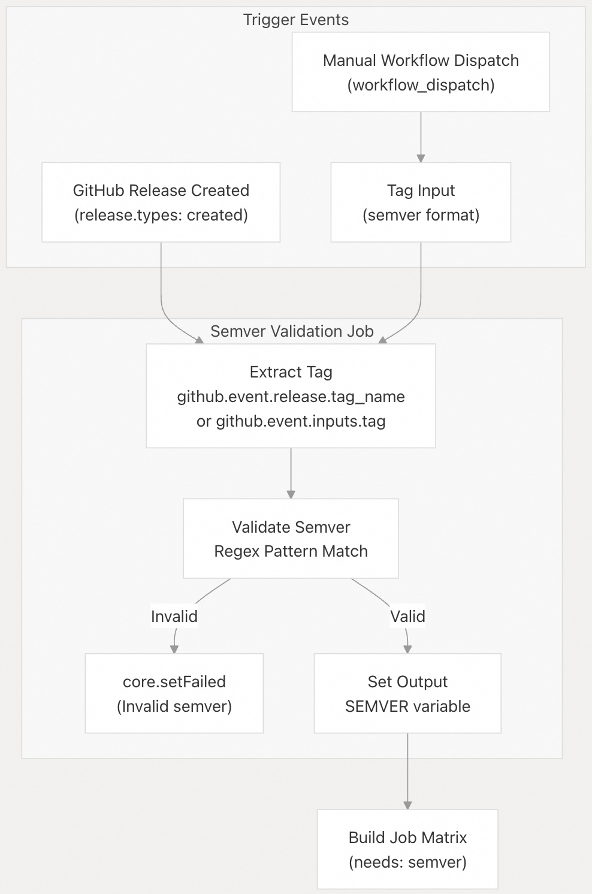
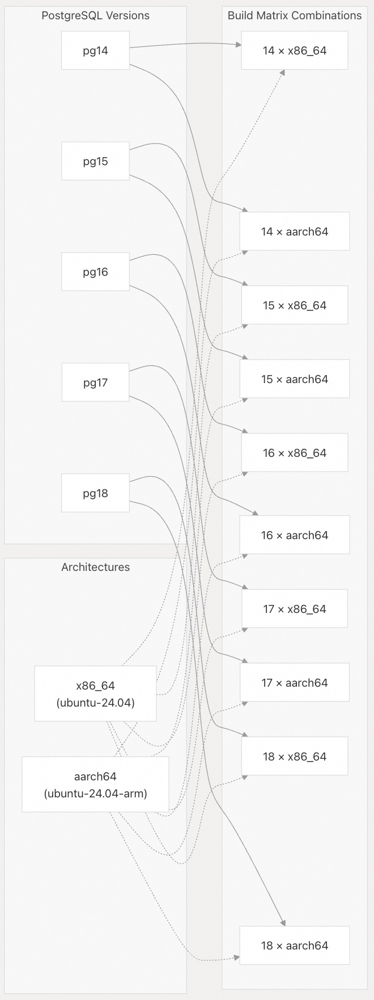
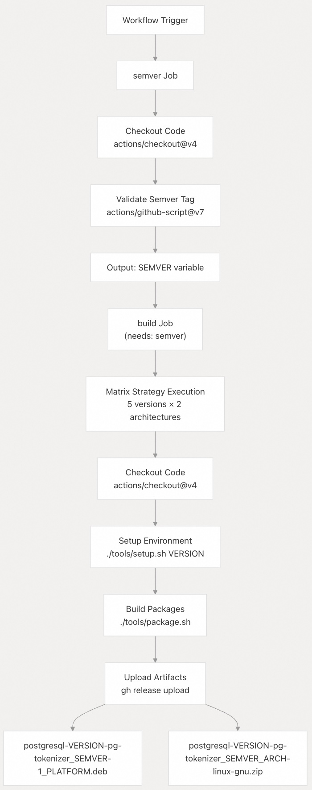
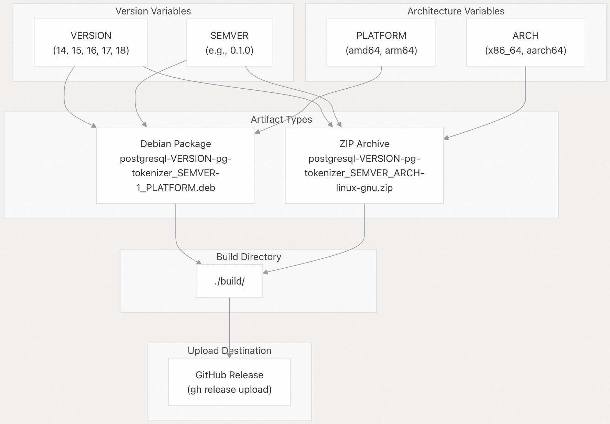
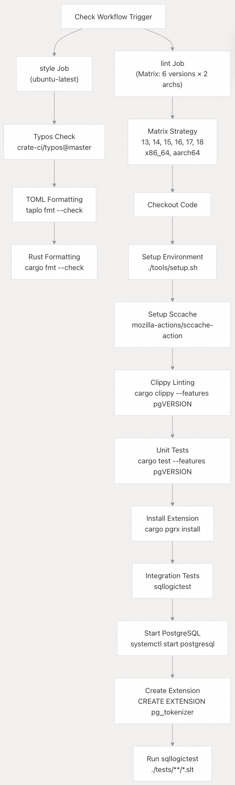
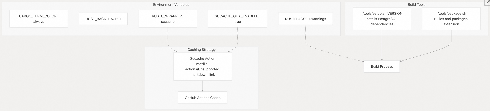
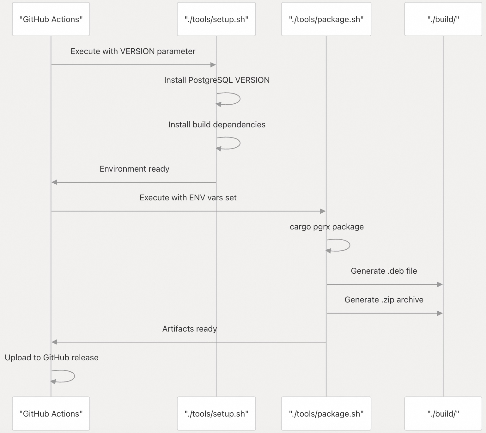

## pg_tokenizer 源码学习: 8.3 发布流程 (Release Process)  
                                
### 作者                                
digoal                                
                                
### 日期                                
2025-11-21                                
                                
### 标签                                
pg\_tokenizer , 词化 , bert , 标记化 , Tokenization                                
                                
----                                
                                
## 背景         
本文描述了 `pg_tokenizer` 的自动化 **CI/CD 流水线 (CI/CD pipeline)** 和 **发布工作流 (release workflow)**。它涵盖了 **GitHub Actions 工作流 (GitHub Actions workflows)**，这些工作流负责在多个 **PostgreSQL 版本 (PostgreSQL versions)** 和 **架构 (architectures)** 上构建、测试、打包和发布 **发布工件 (release artifacts)**。  
  
## 概述 (Overview)  
  
`pg_tokenizer` 的 **发布流程 (release process)** 通过 **GitHub Actions** 完全自动化，主要涉及两个工作流：  
  
  * **检查工作流 (Check Workflow)**（`.github/workflows/check.yml`）：验证代码质量、运行测试，并确保与所有支持的 **PostgreSQL 版本 (PostgreSQL versions)** 的兼容性。  
  * **发布工作流 (Release Workflow)**（`.github/workflows/release.yml`）：构建 **可分发包 (distributable packages)** 并将其上传到 **GitHub 发布 (GitHub releases)**。  
  
该系统在发布工作流中为 10 种配置（5 个 **PostgreSQL 版本 (PostgreSQL versions)** × 2 个 **架构 (architectures)**）构建工件，并在检查工作流中为 12 种配置（6 个 **PostgreSQL 版本 (PostgreSQL versions)** × 2 个 **架构 (architectures)**）进行验证。  
  
来源: [`.github/workflows/release.yml` 1-68](https://github.com/tensorchord/pg_tokenizer.rs/blob/d3f7a577/.github/workflows/release.yml#L1-L68) [`.github/workflows/check.yml` 1-84](https://github.com/tensorchord/pg_tokenizer.rs/blob/d3f7a577/.github/workflows/check.yml#L1-L84)  
  
## 发布触发器 (Release Triggers)  
  
### 发布工作流触发器 (Release Workflow Triggers)  
  
  
  
**发布触发机制 (Release Trigger Mechanisms)**  
  
发布工作流可以通过两种方式触发：  
  
1.  **自动 (Automatic)**：创建带有 **标签 (tag)** 的 **GitHub 发布 (GitHub release)** 会自动触发工作流。  
2.  **手动 (Manual)**：使用 **工作流调度 (workflow dispatch)** 功能并手动输入标签。  
  
两条触发路径都汇聚到 `semver` **任务 (job)**，该任务根据在 [`github/workflows/release.yml` 29](https://github.com/tensorchord/pg_tokenizer.rs/blob/d3f7a577/.github/workflows/release.yml#L29-L29) 中定义的严格 **语义版本控制正则表达式模式 (semantic versioning regex pattern)** 验证版本标签。无效的标签会导致工作流立即失败。  
  
来源: [`.github/workflows/release.yml` 3-11](https://github.com/tensorchord/pg_tokenizer.rs/blob/d3f7a577/.github/workflows/release.yml#L3-L11) [`.github/workflows/release.yml` 22-36](https://github.com/tensorchord/pg_tokenizer.rs/blob/d3f7a577/.github/workflows/release.yml#L22-L36)  
  
### 检查工作流触发器 (Check Workflow Triggers)  
  
检查工作流在以下情况运行：  
  
  * 影响相关路径的 **拉取请求 (Pull request)** 创建/更新  
  * 对主分支的 **推送事件 (Push events)**  
  * **合并队列操作 (Merge queue operations)**  
  * 手动 **工作流调度 (workflow dispatch)**  
  
该工作流使用 **路径过滤器 (path filters)**，仅在代码、配置或测试文件更改时运行，从而避免不必要的 **CI 运行 (CI runs)**。  
  
来源: [`.github/workflows/check.yml` 3-30](https://github.com/tensorchord/pg_tokenizer.rs/blob/d3f7a577/.github/workflows/check.yml#L3-L30)  
  
## 构建矩阵配置 (Build Matrix Configuration)  
  
### 发布构建矩阵 (Release Build Matrix)  
  
  
  
**构建矩阵详情 (Build Matrix Details)**  
  
| 配置 (Configuration) | PostgreSQL 版本 (PostgreSQL Versions) | 架构 (Architectures) | 总组合数 (Total Combinations) |  
| :--- | :--- | :--- | :--- |  
| Release (发布) | 14, 15, 16, 17, 18 | x86\_64, aarch64 | 10 |  
| Check (检查) | 13, 14, 15, 16, 17, 18 | x86\_64, aarch64 | 12 |  
  
发布工作流从构建矩阵中排除了 PostgreSQL 13，而检查工作流包含了它用于 **兼容性测试 (compatibility testing)**。每个架构都在专用的 **GitHub 托管运行器 (GitHub-hosted runners)** 上运行：  
  
  * `x86_64`: `ubuntu-24.04`  
  * `aarch64`: `ubuntu-24.04-arm`  
  
来源: [`.github/workflows/release.yml` 40-44](https://github.com/tensorchord/pg_tokenizer.rs/blob/d3f7a577/.github/workflows/release.yml#L40-L44) [`.github/workflows/check.yml` 60-64](https://github.com/tensorchord/pg_tokenizer.rs/blob/d3f7a577/.github/workflows/check.yml#L60-L64)  
  
## 发布工作流步骤 (Release Workflow Steps)  
  
### 完整发布流水线 (Complete Release Pipeline)  
  
  
  
**分步详解 (Step-by-Step Breakdown)**  
  
1.  **检出 (Checkout)**：使用 `actions/checkout@v4` 克隆 **仓库 (repository)**  
2.  **设置环境 (Setup Environment)**：使用 PostgreSQL 版本参数执行 `./tools/setup.sh`  
3.  **构建 (Build)**：运行 `./tools/package.sh` 编译和打包 **扩展 (extension)**  
4.  **上传工件 (Upload Artifacts)**：使用 **GitHub CLI** 将 `.deb` 和 `.zip` 文件上传到发布  
  
工作流设置了几个在整个过程中使用的 **环境变量 (Environment Variables)**：  
  
| 变量 (Variable) | 来源 (Source) | 用途 (Purpose) |  
| :--- | :--- | :--- |  
| `SEMVER` | `needs.semver.outputs.SEMVER` | 用于工件命名的 **版本标签 (Version tag)** |  
| `VERSION` | `matrix.version` | **PostgreSQL 主版本 (PostgreSQL major version)** |  
| `ARCH` | `matrix.arch` | **目标架构 (Target architecture)** (x86\_64/aarch64) |  
| `PLATFORM` | Derived from `ARCH` | **Debian 平台标识符 (Debian platform identifier)** (amd64/arm64) |  
| `RUSTFLAGS` | `-Dwarnings` | **在构建期间将警告视为错误 (Treat warnings as errors during build)** |  
  
来源: [`.github/workflows/release.yml` 46-68](https://github.com/tensorchord/pg_tokenizer.rs/blob/d3f7a577/.github/workflows/release.yml#L46-L68)  
  
## 工件生成 (Artifact Generation)  
  
### 工件命名约定 (Artifact Naming Convention)  
  
  
  
**工件示例 (Example Artifacts)**  
  
对于版本 `0.1.0` 和 PostgreSQL 16：  
  
| 架构 (Architecture) | Debian 包 (Debian Package) | ZIP 归档 (ZIP Archive) |  
| :--- | :--- | :--- |  
| x86\_64 | `postgresql-16-pg-tokenizer_0.1.0-1_amd64.deb` | `postgresql-16-pg-tokenizer_0.1.0_x86_64-linux-gnu.zip` |  
| aarch64 | `postgresql-16-pg-tokenizer_0.1.0-1_arm64.deb` | `postgresql-16-pg-tokenizer_0.1.0_aarch64-linux-gnu.zip` |  
  
上传命令中的 `--clobber` **标志 (flag)** 允许 **重新上传工件 (re-uploading artifacts)**，这对失败构建的 **手动重新运行 (manual re-runs)** 非常有用。  
  
来源: [`.github/workflows/release.yml` 63-67](https://github.com/tensorchord/pg_tokenizer.rs/blob/d3f7a577/.github/workflows/release.yml#L63-L67)  
  
## 质量保证流水线 (Quality Assurance Pipeline)  
  
### 检查工作流结构 (Check Workflow Structure)  
  
  
  
**质量门阶段 (Quality Gate Stages)**  
  
1.  **风格检查 (Style Checks)**（单个任务）：  
      * `typos`：**拼写检查 (Spell checking)** 整个代码库  
      * `taplo`：TOML 文件**格式验证 (formatting validation)**  
      * `rustfmt`：Rust 代码**格式验证 (formatting validation)**  
2.  **静态检查 (Lint Checks)**（矩阵任务）：  
      * `clippy`：Rust **静态分析器 (linter)**，将所有警告视为错误  
      * **单元测试 (Unit tests)**：Rust 测试套件执行  
      * **扩展安装 (Extension installation)**：带 `lindera-ipadic` **特性 (feature)** 的完整 `pgrx` 安装  
      * **集成测试 (Integration tests)**：针对运行中的 **PostgreSQL** 执行 `sqllogictest` **套件 (suite)**  
  
静态检查任务使用功能标志 `pg${{ matrix.version }}` 进行构建，以确保代码针对每个 PostgreSQL 版本正确编译。集成测试步骤会启动一个 **PostgreSQL 服务器 (PostgreSQL server)**，并在运行测试套件之前创建扩展。  
  
来源: [`.github/workflows/check.yml` 44-84](https://github.com/tensorchord/pg_tokenizer.rs/blob/d3f7a577/.github/workflows/check.yml#L44-L84)  
  
### 构建环境配置 (Build Environment Configuration)  
  
  
  
**环境变量 (Environment Variables)**  
  
检查工作流配置了几个 **环境变量 (environment variables)** 以优化构建并强制执行质量：  
  
  * `CARGO_TERM_COLOR: always`：确保 CI 日志中输出彩色  
  * `RUST_BACKTRACE: 1`：为调试测试失败启用完整的 **回溯 (backtraces)**  
  * `RUSTFLAGS: "-Dwarnings"`：将所有编译器警告视为错误  
  * `SCCACHE_GHA_ENABLED: true`：启用 **共享编译缓存 (shared compilation cache)**  
  * `RUSTC_WRAPPER: sccache`：用 `sccache` 包装 `rustc` 以实现更快的重新构建  
  
发布工作流使用相同的 `RUSTFLAGS` 设置，但未启用 `sccache`，因为发布构建优先考虑 **可重现性 (reproducibility)** 而非速度。  
  
来源: [`.github/workflows/check.yml` 36-42](https://github.com/tensorchord/pg_tokenizer.rs/blob/d3f7a577/.github/workflows/check.yml#L36-L42) [`.github/workflows/release.yml` 46-53](https://github.com/tensorchord/pg_tokenizer.rs/blob/d3f7a577/.github/workflows/release.yml#L46-L53)  
  
## 构建脚本 (Build Scripts)  
  
### 脚本调用序列 (Script Invocation Sequence)  
  
  
  
**设置脚本** (`./tools/setup.sh`)  
  
设置脚本以单个参数（PostgreSQL 主版本号）调用。它负责：  
  
  * 安装指定版本的 **PostgreSQL 服务器 (PostgreSQL server)** 和 **开发包 (development packages)**  
  * 设置 **构建环境 (build environment)**  
  * 准备任何特定于版本的 **依赖项 (dependencies)**  
  
**打包脚本** (`./tools/package.sh`)  
  
打包脚本使用工作流设置的 **环境变量 (environment variables)**：  
  
  * `SEMVER`：用于工件命名的版本标签  
  * `VERSION`：PostgreSQL 版本  
  * `ARCH`：目标架构  
  * `PLATFORM`：Debian 平台标识符  
  
它在 `./build/` 目录下生成 **Debian 包 (Debian packages)** 和 **ZIP 归档 (ZIP archives)**。  
  
来源: [`.github/workflows/release.yml` 59-61](https://github.com/tensorchord/pg_tokenizer.rs/blob/d3f7a577/.github/workflows/release.yml#L59-L61) [`.github/workflows/check.yml` 70](https://github.com/tensorchord/pg_tokenizer.rs/blob/d3f7a577/.github/workflows/check.yml#L70-L70)  
  
## 并发控制 (Concurrency Control)  
  
两个工作流都使用 **并发组 (concurrency groups)** 来防止多个实例同时运行：  
  
```  
concurrency:  
  group: ${{ github.ref }}-${{ github.workflow }}  
  cancel-in-progress: true  
```    
  
此配置：  
  
  * 按 **git 引用 (git ref)** 和工作流名称对工作流进行分组  
  * 当新的运行开始时，**取消正在进行的运行 (Cancels in-progress runs)**  
  * 防止资源浪费在 **被取代的提交 (superseded commits)** 上  
  
来源: [`.github/workflows/release.yml` 13-15](https://github.com/tensorchord/pg_tokenizer.rs/blob/d3f7a577/.github/workflows/release.yml#L13-L15) [`.github/workflows/check.yml` 32-34](https://github.com/tensorchord/pg_tokenizer.rs/blob/d3f7a577/.github/workflows/check.yml#L32-L34)  
  
## 发布清单 (Release Checklist)  
  
| 步骤 (Step) | 操作 (Action) | 验证 (Validation) |  
| :--- | :--- | :--- |  
| 1 | 确保主分支上所有测试通过 | **检查工作流通过 (Check workflow green)** |  
| 2 | 创建带有 **semver 标签 (semver tag)** 的 GitHub 发布 | **标签 (Tag)** 匹配 **正则表达式模式 (regex pattern)** |  
| 3 | 工作流自动触发 | **监控 release.yml 执行 (Monitor release.yml execution)** |  
| 4 | 所有 10 个**矩阵任务 (matrix jobs)** 完成 | 检查构建日志 |  
| 5 | **工件上传 (Artifacts uploaded)** 到发布 | 验证存在 20 个文件 |  
| 6 | 如果需要，更新**文档 (documentation)** | **版本兼容性矩阵 (Version compatibility matrix)** |  
  
发布流程旨在在创建 GitHub 发布后完全自动化。仅当构建任务失败时才需要**手动干预 (Manual intervention)**，在这种情况下，可以使用 **工作流调度 (workflow dispatch)** 重新运行工作流。  
  
来源: [`.github/workflows/release.yml` 1-68](https://github.com/tensorchord/pg_tokenizer.rs/blob/d3f7a577/.github/workflows/release.yml#L1-L68)  
  
-----  
  
# 附录: 关于多配置构建失败后的工件完整性  
文档指出 **发布工作流 (Release Workflow)** 会为 10 种不同的 PostgreSQL 版本和架构组合（例如 `postgresql-16-pg-tokenizer_0.1.0-1_amd64.deb`）生成工件。  
  
如果这 10 个 **矩阵任务 (matrix jobs)** 中有少数几个在构建或上传过程中失败（例如，`aarch64` 架构的某个包失败了），那么：  
  
1.  **工件状态：** 已经成功构建并上传的工件（例如，其他 9 个包）是否会立即对用户发布，还是会等待所有 10 个任务通过手动干预重新运行并成功后，才被视为一个完整的“合格发布 (Qualified Release)”？  
2.  **用户体验：** 用户应该如何判断一个 **GitHub Release** 是完整的且可以安全使用的？  
  
**价值点解析：**  
  
这个问题关系到用户在复杂的、多架构环境（如同时使用 `x86_64` 和 `aarch64`）中部署新版本时的信心。用户需要知道，如果他们依赖的特定包在首次发布中失败了，他们是否可以信任这次发布的其他包，以及他们何时能获得完整的修复。这比单纯询问流程故障更进一步，它聚焦于 **部分成功发布** 对用户的实际影响。  
  
这个问题涉及 `pg_tokenizer.rs` 项目的发布工作流中, 当部分矩阵任务失败时的工件状态和用户体验问题。  
  
## 工件状态  
  
根据发布工作流的配置, **已成功构建并上传的工件会立即对用户可见**, 而不会等待所有任务完成。    
  
这是因为:  
  
1. **矩阵任务独立执行**: 每个矩阵任务(PostgreSQL 版本 × 架构组合)独立运行,成功的任务会立即执行上传步骤。    
  
2. **`--clobber` 标志**: 上传命令使用 `gh release upload --clobber`,允许覆盖已存在的文件,这意味着每个任务成功后会立即上传,不需要等待其他任务。    
  
3. **无全局依赖**: 工作流中没有配置要求所有矩阵任务都成功才能发布的机制。`build` 任务只依赖于 `semver` 任务,而不依赖于其他矩阵任务的完成状态。    
  
因此, 如果 `aarch64` 架构的某个包失败, 其他 9 个成功的包会立即出现在 GitHub Release 中, **不会等待手动干预重新运行**。  
  
## 用户体验  
  
目前的工作流**没有提供明确的机制让用户判断 Release 是否完整**。用户需要:  
  
1. **手动检查工件数量**: 期望的完整发布应包含 20 个文件(10 个 `.deb` 包 + 10 个 `.zip` 包)。    
  
2. **查看 GitHub Actions 状态**: 用户需要访问 Actions 页面查看矩阵任务的执行状态,确认所有 10 个任务是否都成功。  
  
3. **检查工件命名**: 验证是否存在所有预期的版本和架构组合,例如 PostgreSQL 14-18 的 `amd64` 和 `arm64` 版本。    
  
## Notes  
  
当前的发布流程存在一个潜在问题:部分失败的发布会产生不完整的 Release,但没有明显的标识。建议的改进方向可能包括:  
- 添加一个汇总任务,只有在所有矩阵任务成功后才标记 Release 为"完整"  
- 在 Release 描述中自动生成工件清单  
- 使用 GitHub Release 的 draft 或 pre-release 功能, 只有在所有任务成功后才正式发布  
  
工作流使用了并发控制(`cancel-in-progress: true`), 这意味着如果在发布过程中触发新的发布,正在进行的任务会被取消。    
    
#### [PolarDB 学习图谱](https://www.aliyun.com/database/openpolardb/activity "8642f60e04ed0c814bf9cb9677976bd4")
  
  
#### [PostgreSQL 解决方案集合](../201706/20170601_02.md "40cff096e9ed7122c512b35d8561d9c8")
  
  
#### [德哥 / digoal's Github - 公益是一辈子的事.](https://github.com/digoal/blog/blob/master/README.md "22709685feb7cab07d30f30387f0a9ae")
  
  
#### [About 德哥](https://github.com/digoal/blog/blob/master/me/readme.md "a37735981e7704886ffd590565582dd0")
  
  

  
