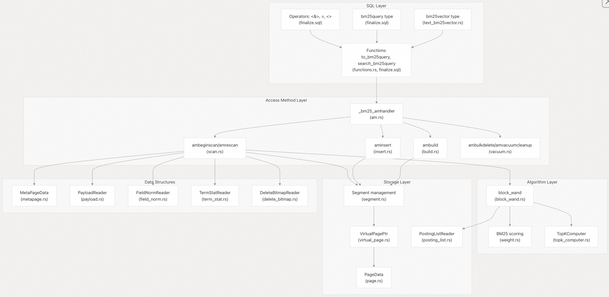
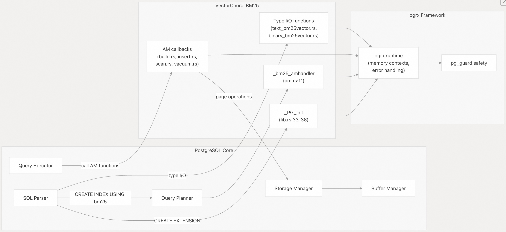

## VectorChord-bm25 源码学习: 1 概述  
                                  
### 作者                                  
digoal                                  
                                  
### 日期                                  
2025-11-21                                  
                                  
### 标签                                  
VectorChord-bm25 , 源码学习 , 全文检索 , 关键词检索 , TF , IDF , 相关性排序 , ranking , Block-WeakAnd , Block-WAND , tsvector , ts_rank                                    
                                  
----                                  
                                  
## 背景           
本文介绍了 **VectorChord-BM25**，这是一个实现了原生 **BM25 排序**（**BM25 ranking**）和 **Block-WeakAnd** 算法（**Block-WeakAnd algorithm**）的 **PostgreSQL 扩展**（**PostgreSQL extension**）。它涵盖了该扩展的用途、主要功能和高级系统组件。  
  
**来源:** [`README.md` 1-11](https://github.com/tensorchord/VectorChord-bm25/blob/da0908a6/README.md#L1-L11)  
  
## 什么是 VectorChord-BM25？  
  
**VectorChord-BM25** 是一个使用 **pgrx 框架**（**pgrx framework**）以 **Rust** 编写的 **PostgreSQL 扩展**（**PostgreSQL extension**），它将高效的 **BM25**（**Best Matching 25**，最佳匹配 25）排序功能直接引入 **PostgreSQL**。**BM25** 是一种**概率排序函数**（**probabilistic ranking function**），被搜索引擎广泛用于评估文档对于给定查询的**相关性**（**relevance**）。  
  
该扩展实现了 **Block-WeakAnd**（**Block-WAND**，块级弱与）算法，这是一种优化的 **top-k 检索**（**top-k retrieval**）技术，可以有效地识别最相关的文档，而无需对索引中的每个文档进行评分。这使得它适用于大型文档集合，因为在这些集合中，**暴力评分**（**brute-force scoring**）的成本会高得令人望而却步。  
  
与 **PostgreSQL** 内置的使用 `tsvector` 和 `ts_rank` 的**全文本搜索**（**full-text search**）不同，**VectorChord-BM25** 提供了一个**自定义索引访问方法**（**custom index access method**），它在索引遍历期间直接执行 **BM25** 评分，从而实现了对带有正确 **LIMIT** 支持的 **ORDER BY** 查询的高效处理。  
  
**来源:** [`README.md` 11-12](https://github.com/tensorchord/VectorChord-bm25/blob/da0908a6/README.md#L11-L12) [`README.md` 430-435](https://github.com/tensorchord/VectorChord-bm25/blob/da0908a6/README.md#L430-L435)  
  
## 主要功能（Key Features）  
  
| 功能（Feature） | 描述（Description） |  
| :--- | :--- |  
| **自定义数据类型**（**Custom Data Types**） | `bm25vector` 用于将分词后的文档存储为**稀疏向量**（**sparse vectors**，即**词项ID:频率对**），`bm25query` 用于查询表示。 |  
| **原生索引访问方法**（**Native Index Access Method**） | 集成到 **PostgreSQL** 访问方法 **API** 中的自定义 `bm25` 索引类型。 |  
| **Block-WeakAnd 算法**（**Block-WeakAnd Algorithm**） | 使用**块级分数边界**（**block-level score bounds**）来跳过不相关文档，实现高效的 **top-k 文档检索**。 |  
| **压缩**（**Compression**） | **倒排列表**（**posting lists**）采用 **Delta 位压缩**（**Delta-bitpacking compression**）以最小化存储开销。 |  
| **段架构**（**Segment Architecture**） | **增长中段**（**Growing segments**）和**已封存段**（**sealed segments**）用于平衡**写入吞吐量**（**write throughput**）和读取优化。 |  
| **可配置行为**（**Configurable Behavior**） | **GUC 参数**（**GUC parameters**）（`bm25_catalog.*`）用于调整索引行为、段大小和搜索限制。 |  
| **MVCC 支持**（**MVCC Support**） | 与 **PostgreSQL** 的**多版本并发控制**（**Multi-Version Concurrency Control**，**MVCC**）集成，以实现**事务一致性**（**transactional consistency**）。 |  
  
**来源:** [`README.md` 39-108](https://github.com/tensorchord/VectorChord-bm25/blob/da0908a6/README.md#L39-L108) [`README.md` 443-467](https://github.com/tensorchord/VectorChord-bm25/blob/da0908a6/README.md#L443-L467)  
  
## 系统组件（System Components）  
  
以下图表说明了 **VectorChord-BM25** 的主要组件及其关系：  
  
    
  
**按层划分的组件：**  
  
**SQL 层**（**SQL Layer**）- 定义面向用户的接口：  
  
  * `bm25vector`: 存储词项 **ID** 和频率的**稀疏向量**（**Sparse vector**）类型  
  * `bm25query`: 封装索引引用和查询向量的查询类型  
  * 用于比较（`=`、`<>`）和评分（`<&>`）的**运算符**（**Operators**）  
  * 用于查询构建和分数计算的**函数**（**Functions**）  
  
**访问方法层**（**Access Method Layer**）- 实现 **PostgreSQL** 的**索引访问方法回调**（**index access method callbacks**）：  
  
  * `_bm25_amhandler`: 返回 **IndexAmRoutine** 结构体的入口点  
  * `ambuild`: 在 `CREATE INDEX` 期间进行索引构建  
  * `aminsert`: 在 `INSERT/UPDATE` 期间进行增量插入  
  * `ambeginscan`/`amrescan`: 查询初始化和准备  
  * `ambulkdelete`/`amvacuumcleanup`: 维护操作  
  
**算法层**（**Algorithm Layer**）- 核心检索和排序逻辑：  
  
  * `block_wand`: 用于高效 **top-k 检索**的 **Block-WeakAnd** 算法  
  * 计算文档相关性的 **BM25 评分函数**（**BM25 scoring functions**）  
  * `TopKComputer`: 在扫描期间维护 **top-k 结果**  
  
**存储层**（**Storage Layer**）- 管理持久性数据结构：  
  
  * **段管理**（**Segment management**）：**增长中段**和**已封存段**的生命周期  
  * **虚拟页寻址**（**Virtual page addressing**）：多块数据结构抽象  
  * **页级操作**（**Page-level operations**）：读取/写入 **PostgreSQL** 数据页  
  * **倒排列表遍历**（**Posting list traversal**）：访问压缩后的**倒排索引**（**inverted index**）  
  
**数据结构**（**Data Structures**）- 索引组件：  
  
  * `MetaPageData`: 全局元数据（文档计数、平均文档长度）  
  * `PayloadReader`: 将内部文档 **ID** 映射到堆 **TID**  
  * `FieldNormReader`: **文档长度归一化因子**（**Document length normalization factors**）  
  * `TermStatReader`: 用于 **IDF**（**Inverse Document Frequency**，逆文档频率）计算的**词项统计信息**  
  * `DeleteBitmapReader`: 跟踪被删除的文档  
  
**来源:** [`src/lib.rs` 1-11](https://github.com/tensorchord/VectorChord-bm25/blob/da0908a6/src/lib.rs#L1-L11) [`src/sql/finalize.sql` 1-57](https://github.com/tensorchord/VectorChord-bm25/blob/da0908a6/src/sql/finalize.sql#L1-L57) [`README.md` 443-467](https://github.com/tensorchord/VectorChord-bm25/blob/da0908a6/README.md#L443-L467)  
  
## 扩展与 PostgreSQL 的集成（Extension Integration with PostgreSQL）  
  
**VectorChord-BM25** 通过 **pgrx 框架**（**pgrx framework**）与 **PostgreSQL** 集成，该框架为 **PostgreSQL** 基于 **C** 语言的内部结构提供了一个安全的 **Rust** 接口。以下图表展示了该扩展如何挂接到 **PostgreSQL** 的架构中：  
  
    
  
该扩展的生命周期遵循以下顺序：  
  
1.  **扩展加载**（**Extension Loading**）：当 **PostgreSQL** 加载扩展时，它会调用 `_PG_init`，通过 `index::init()` 初始化**索引访问方法**，并通过 `guc::init()` 初始化 **GUC 参数**。  
2.  **索引创建**（**Index Creation**）：当用户执行 `CREATE INDEX ... USING bm25` 时，**PostgreSQL** 的**规划器**（**planner**）会调用 `_bm25_amhandler`，它返回一个包含指向扩展回调函数指针的 **IndexAmRoutine** 结构体。  
3.  **查询执行**（**Query Execution**）：在查询执行期间，**执行器**（**executor**）调用适当的回调函数（例如 `ambeginscan`、`amrescan`、`amgettuple`）来扫描索引并检索结果。  
4.  **类型系统集成**（**Type System Integration**）：**自定义类型 I/O 函数**（**Custom type I/O functions**）在从磁盘读取或写入磁盘时处理 `bm25vector` 数据的**序列化**（**serialization**）和**反序列化**（**deserialization**）。  
  
**pgrx 框架**通过管理 **PostgreSQL** **内存上下文**（**memory contexts**）并使用 `pg_guard` 包装潜在会发生 **panic** 的 **Rust** 代码，提供了关键的**安全保证**（**safety guarantees**），`pg_guard` 将 **Rust panic** 转换为 **PostgreSQL** 错误处理。  
  
**来源:** [`src/lib.rs` 33-36](https://github.com/tensorchord/VectorChord-bm25/blob/da0908a6/src/lib.rs#L33-L36) [`src/index/am.rs` 11-87](https://github.com/tensorchord/VectorChord-bm25/blob/da0908a6/src/index/am.rs#L11-L87) [`README.md` 11-12](https://github.com/tensorchord/VectorChord-bm25/blob/da0908a6/README.md#L11-L12)  
  
## 依赖项（Dependencies）  
  
**VectorChord-BM25** 有一个关键的外部依赖项：  
  
### pg\_tokenizer.rs  
  
该扩展依赖于 [pg\_tokenizer.rs](https://github.com/tensorchord/VectorChord-bm25/blob/da0908a6/pg_tokenizer.rs)，这是一个单独的 **PostgreSQL 扩展**，提供**文本分词**（**text tokenization**）功能。该**分词器**（**tokenizer**）通过以下步骤将原始文本转换为 `bm25vector` 格式：  
  
1.  根据配置的规则分析文本（例如，**转为小写**（**lowercasing**）、**词干提取**（**stemming**）、**停用词移除**（**stopword removal**））  
2.  从**词汇表**（**vocabulary**）生成**词元 ID**（**token IDs**）  
3.  计算**词项频率**（**term frequencies**）  
4.  生成**稀疏向量表示**（**sparse vector representation**，即 **词项 ID:频率对**）  
  
该分词器至关重要，因为 **BM25** 评分要求在**索引**（**indexing**）和**查询**（**querying**）过程中保持**分词一致性**（**consistent tokenization**），以确保准确的**词项匹配**（**term matching**）。用户在使用 **VectorChord-BM25** 之前必须安装 `pg_tokenizer`：  
  
```sql  
CREATE EXTENSION IF NOT EXISTS pg_tokenizer CASCADE;  
CREATE EXTENSION IF NOT EXISTS vchord_bm25 CASCADE;  
```  
  
该分词器支持多种**预训练模型**（**pre-trained models**）（例如 `bert_base_uncased`、`gemma2b`、`llmlingua2`），并允许用户创建在其特定**语料库**（**corpus**）上训练的**自定义模型**。对于多语言文本，还提供专门的分词器，如 `jieba`（中文）和 `lindera`（日文）。  
  
**来源:** [`README.md` 34-37](https://github.com/tensorchord/VectorChord-bm25/blob/da0908a6/README.md#L34-L37) [`README.md` 43-57](https://github.com/tensorchord/VectorChord-bm25/blob/da0908a6/README.md#L43-L57) [`README.md` 346-384](https://github.com/tensorchord/VectorChord-bm25/blob/da0908a6/README.md#L346-L384)  
  
## 性能特征（Performance Characteristics）  
  
**VectorChord-BM25** 专为高效的**大规模文本检索**（**large-scale text retrieval**）而设计：  
  
  * **Block-WeakAnd 优化**（**Block-WeakAnd Optimization**）：通过维护**块级最大分数**（**block-level maximum scores**），跳过对不可能出现在 **top-k 结果**中的文档进行评分。与**暴力方法**（**brute-force approaches**）相比，这显著减少了评估的文档数量。  
  * **压缩存储**（**Compressed Storage**）：**Delta 位压缩**（**Delta-bitpacking compression**）在减小**倒排列表**（**posting list**）大小的同时，保持了查询期间的快速解压缩。  
  * **可配置限制**（**Configurable Limits**）：`bm25_catalog.bm25_limit` 参数（默认值：100）控制索引返回的最大结果数量。将其设置为 **-1** 可启用**暴力模式**（**brute-force mode**）以获取完整的检索结果集。 ( GIN索引也有类似参数 )  
  * **段架构**（**Segment Architecture**）：**增长中段**（**Growing segments**）高效处理增量写入，而**已封存段**（**sealed segments**）通过压缩的、**块结构化的倒排列表**（**block-structured posting lists**）提供优化的读取性能。  
  
该扩展有意返回**负的 BM25 分数**（**negative BM25 scores**），其中**负值越大表示相关性越高**。这种设计选择允许用户使用 **PostgreSQL** 默认的**升序**（**ascending**）`ORDER BY` 来首先检索最相关的文档。    
  
**来源:** [`README.md` 91-108](https://github.com/tensorchord/VectorChord-bm25/blob/da0908a6/README.md#L91-L108) [`README.md` 437-439](https://github.com/tensorchord/VectorChord-bm25/blob/da0908a6/README.md#L437-L439) [`README.md` 462-467](https://github.com/tensorchord/VectorChord-bm25/blob/da0908a6/README.md#L462-L467)  
  
-----  
  
# 附录: 架构与性能平衡问题  
VectorChord-BM25 的“增长中段”（Growing segments）和“已封存段”（sealed segments）架构是如何在确保 PostgreSQL 的 MVCC 事务一致性（transactional consistency）的同时，平衡大规模文档的 **写入吞吐量** （write throughput）和 **top-k 检索性能** （read optimization）的？用户或数据库管理员在日常维护中是否需要手动干预或优化段的生命周期？  
  
### **该问题的价值点：**  
  
1.  **核心架构理解：** 它直接探究了该扩展的自定义存储层（Storage Layer）如何通过独特的**段架构**（Segment Architecture）来解决搜索系统面临的经典写入/读取冲突问题。  
2.  **与 PostgreSQL 集成：** 它将扩展的内部机制（段管理）与 **PostgreSQL** 的核心机制（**MVCC**）联系起来，这对于确保数据在并发操作下的正确性和一致性至关重要。  
3.  **实用维护意义：** 它提出了一个实际操作问题——用户是否需要像管理某些其他搜索引擎那样，手动去**合并**或**优化**这些段（即干预生命周期），这直接影响了系统的运维成本和复杂性。  
4.  **性能优化：** 深入了解其工作原理有助于用户在 `INSERT`/`UPDATE` 频率较高或查询压力较大的场景下，做出更明智的配置决策（例如调整 **GUC 参数**）。  
  
关于这个问题: VectorChord-BM25 中**增长中段**（Growing segments）和**已封存段**（Sealed segments）的架构设计，具体涉及：  
  
1. 如何在保证 PostgreSQL MVCC 事务一致性的同时平衡写入吞吐量和 top-k 检索性能  
2. 是否需要手动干预或优化段的生命周期  
  
## 架构设计概述  
  
VectorChord-BM25 采用了类似 LSM-tree 的双段架构(和PostgreSQL GIN索引的pending list也类似)来平衡读写性能：  
  
- **Growing Segment（增长中段）**：可变的、使用简单链表结构的段，优化写入性能  
- **Sealed Segment（已封存段）**：不可变的、使用压缩倒排索引的段，优化查询性能  
  
## 写入吞吐量优化  
  
### Growing Segment 的快速写入机制  
  
Growing segment 通过简单的页面追加操作实现高吞吐量写入：  
  
1. **简单的数据结构**：使用链表连接的 PostgreSQL 页面，避免复杂的索引维护  
2. **直接追加**：新文档直接序列化并追加到最后一页    
3. **无压缩开销**：写入时不需要构建压缩的倒排索引或 block-max 分数  
  
### 批量封存机制  
  
系统通过批量封存来分摊索引构建成本：  
  
- 当 growing segment 达到 `segment_growing_max_page_size` 页数（默认 4096 页）时触发封存  
- 封存过程将累积的文档批量转换为优化的 sealed segment  
- 这种批处理方式显著降低了单次插入的平均成本  
  
## Top-K 检索性能优化  
  
### Sealed Segment 的查询优化  
  
Sealed segment 使用 Block-WAND 算法优化的数据结构：  
  
1. **压缩倒排索引**：使用 delta 编码和位打包减少存储空间  
2. **Block-max 分数**：每 128 个文档一个块，预计算最大 BM25 分数用于跳过  
3. **跳表结构**：支持高效的块级跳跃，避免扫描不相关文档  
  
### 混合查询策略  
  
查询时同时扫描两种段：  
  
- **Growing segment**：线性扫描并计算 BM25 分数（数据量通常较小）  
- **Sealed segment**：使用 Block-WAND 算法高效检索    
  
## MVCC 事务一致性保证  
  
### 写入时的一致性  
  
每次插入操作都在单个事务中完成：  
  
1. **元数据更新**：原子性地更新 `doc_cnt`、`current_doc_id` 等计数器  
2. **辅助数据写入**：payload（heap TID）、field norm、term statistics 都在同一事务中写入    
3. **Delete bitmap 扩展**：为新文档添加可见性位    
  
### 封存过程的并发控制  
  
封存过程使用条件锁保证并发安全：  
  
- 使用 `ConditionalLockPage` 获取元页面的排他锁  
- 如果锁获取失败，说明其他进程正在封存，当前进程直接返回  
- 只有一个后端进程执行封存工作，避免重复计算  
  
### 查询时的 MVCC 检查  
  
系统支持两种 MVCC 检查模式：  
  
1. **Prefilter 模式**（`enable_prefilter=true`）：在 Block-WAND 执行期间提前检查元组可见性    
2. **延迟检查模式**：在返回最终结果时检查可见性  
  
Prefilter 模式通过提前过滤不可见元组来避免无效的分数计算，特别适合有大量更新/删除的表。  
  
### Vacuum 后的一致性维护  
  
Vacuum 操作会重新计算 term statistics 以保持统计信息准确：  
  
- 遍历 growing 和 sealed segments  
- 跳过已删除的文档（通过 delete bitmap）  
- 更新每个 term 的文档频率  
  
## 是否需要手动干预？  
  
**答案：通常不需要手动干预。**    
  
### 自动化的段生命周期管理  
  
1. **自动触发封存**：当 growing segment 达到配置的页数阈值时，`aminsert()` 自动触发封存    
  
2. **自动资源回收**：封存完成后自动释放旧的 growing segment 页面    
  
3. **透明的并发控制**：多个后端进程的并发插入由锁机制自动协调    
  
### 可选的性能调优  
  
虽然不需要手动干预，但您可以通过 GUC 参数调优性能：  
  
| 参数 | 默认值 | 用途 |  
|------|--------|------|  
| `segment_growing_max_page_size` | 4096 | 控制封存频率 |  
| `bm25_limit` | 100 | 控制 top-k 结果数量 |  
| `enable_prefilter` | true | 控制 MVCC 预过滤 |  
  
**调优建议**：  
  
- **写入密集型工作负载**：增大 `segment_growing_max_page_size`（如 8192-100000）以减少封存开销  
- **查询密集型工作负载**：减小 `segment_growing_max_page_size`（如 1024-2048）以更快获得优化的 sealed segments  
- **批量加载场景**：临时设置很大的值（如 100000），加载完成后恢复默认值  
    
#### [PolarDB 学习图谱](https://www.aliyun.com/database/openpolardb/activity "8642f60e04ed0c814bf9cb9677976bd4")
  
  
#### [PostgreSQL 解决方案集合](../201706/20170601_02.md "40cff096e9ed7122c512b35d8561d9c8")
  
  
#### [德哥 / digoal's Github - 公益是一辈子的事.](https://github.com/digoal/blog/blob/master/README.md "22709685feb7cab07d30f30387f0a9ae")
  
  
#### [About 德哥](https://github.com/digoal/blog/blob/master/me/readme.md "a37735981e7704886ffd590565582dd0")
  
  

  
