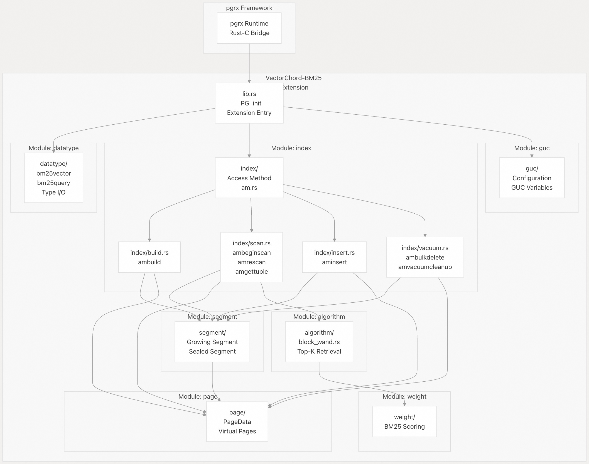
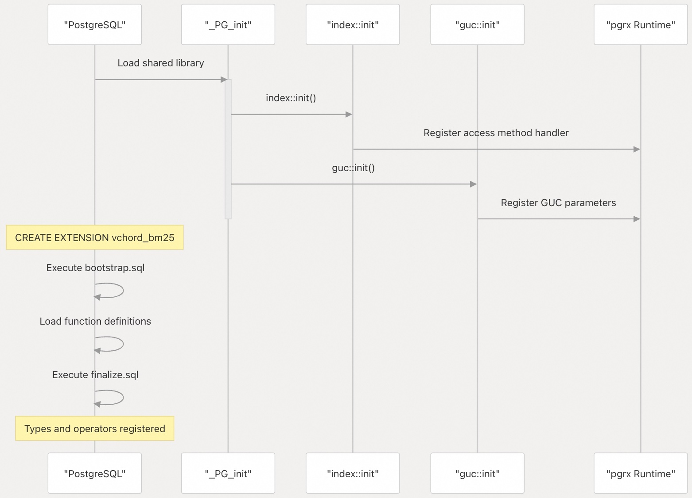
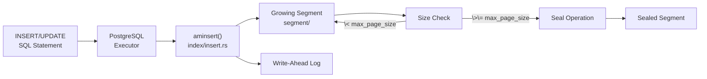
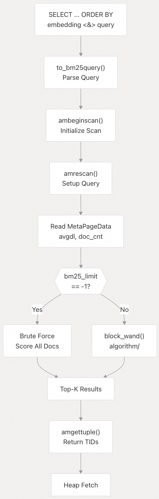
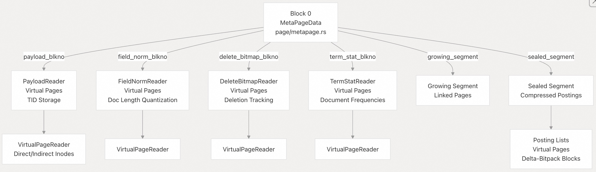

## VectorChord-bm25 源码学习: 1.1 架构 (Architecture)    
                                    
### 作者                                    
digoal                                    
                                    
### 日期                                    
2025-11-21                                    
                                    
### 标签                                    
VectorChord-bm25 , 源码学习 , 全文检索 , 关键词检索 , TF , IDF , 相关性排序 , ranking , Block-WeakAnd , Block-WAND , tsvector , ts_rank                                      
                                    
----                                    
                                    
## 背景             
本文描述了 **VectorChord-BM25** 的**高层架构 (high-level architecture)**，包括**模块组织 (module organization)**、与 **PostgreSQL** 的**集成 (integration)** 以及**主要组件 (major components)** 之间的交互。它涵盖了代码库的结构设计以及组件如何在 **PostgreSQL** **扩展 (extension)** 框架内协同工作。  
  
## 系统概览 (System Overview)  
  
**VectorChord-BM25** 是一个使用 **pgrx** 框架以 **Rust** 编写的 **PostgreSQL** 扩展 (extension)。它提供了一个自定义的**索引存取方法 (index access method)** (`bm25`)，该方法实现了 **BM25 排名 (ranking)**，并采用 **Block-WeakAnd 算法 (algorithm)** 来实现高效的 **top-k 检索 (retrieval)**。  
  
系统组织为六个**主要模块 (primary modules)**，每个模块处理一个不同的架构关注点 (architectural concern)：  
  
**模块组织图 (Module Organization Diagram)**  
  
  
  
来源: [`src/lib.rs` 1-65](https://github.com/tensorchord/VectorChord-bm25/blob/da0908a6/src/lib.rs#L1-L65) [`Cargo.toml` 1-59](https://github.com/tensorchord/VectorChord-bm25/blob/da0908a6/Cargo.toml#L1-L59)  
  
## PostgreSQL 扩展集成 (Extension Integration)  
  
**VectorChord-BM25** 通过 `pgrx` 框架与 **PostgreSQL** 集成 (integrates)，并实现了**索引存取方法 (Index Access Method, AM) API**。扩展的**生命周期 (lifecycle)** 遵循 **PostgreSQL** 的标准**扩展加载过程 (extension loading process)**。  
  
**扩展初始化流程 (Initialization Flow)**  
  
  
  
扩展的**入口点 (entry point)** 是位于 [`src/lib.rs` 32-36](https://github.com/tensorchord/VectorChord-bm25/blob/da0908a6/src/lib.rs#L32-L36) 中的 `_PG_init`，它调用：  
  
  * `index::init()` 注册存取方法处理程序 (**access method handler**)  
  * `guc::init()` 注册配置参数 (**configuration parameters**)  
  
**SQL** **类型系统 (type system)** 通过两个阶段 (phases) 进行**引导 (bootstrapped)**：  
  
1.  **引导阶段 (Bootstrap phase)** ([`src/sql/bootstrap.sql`](https://github.com/tensorchord/VectorChord-bm25/blob/da0908a6/src/sql/bootstrap.sql)): 创建**占位符类型 (placeholder types)** `bm25vector` 和 `bm25query`  
2.  **定稿阶段 (Finalize phase)** ([`src/sql/finalize.sql` 1-57](https://github.com/tensorchord/VectorChord-bm25/blob/da0908a6/src/sql/finalize.sql#L1-L57)): 定义完整的**类型规范 (type specifications)**、操作符 (**operators**)、类型转换 (**casts**) 和存取方法 (access method)  
  
来源: [`src/lib.rs` 32-36](https://github.com/tensorchord/VectorChord-bm25/blob/da0908a6/src/lib.rs#L32-L36) [`src/sql/finalize.sql` 1-57](https://github.com/tensorchord/VectorChord-bm25/blob/da0908a6/src/sql/finalize.sql#L1-L57) [`README.md` 32-37](https://github.com/tensorchord/VectorChord-bm25/blob/da0908a6/README.md#L32-L37)  
  
## 核心模块职责 (Core Module Responsibilities)  
  
### datatype 模块 (Module)  
  
实现了自定义的 **PostgreSQL** 类型 (**custom types**) `bm25vector` 和 `bm25query`。`bm25vector` 类型将**分词后的文本 (tokenized text)** 存储为 `(term_id, frequency)` 对的**稀疏向量 (sparse vector)**。  
  
关键组件 (Key components):  
  
  * `memory_bm25vector.rs`: **内存中的表示 (In-memory representation)** 和**操作 (manipulation)**  
  * `text_bm25vector.rs`: **文本输入/输出函数 (Text input/output functions)** (`_bm25catalog_bm25vector_in`, `_bm25catalog_bm25vector_out`)  
  * `binary_bm25vector.rs`: 用于**网络协议 (wire protocol)** 的**二进制发送/接收函数 (Binary send/receive functions)**  
  * `cast.rs`: 从 `int[]` 到 `bm25vector` 的**类型强制转换 (Type coercion)**  
  * `functions.rs`: `search_bm25query()` **操作符 (operator)** 的实现  
  
来源: [`src/datatype/`](https://github.com/tensorchord/VectorChord-bm25/blob/da0908a6/src/datatype/) [`src/sql/finalize.sql` 1-9](https://github.com/tensorchord/VectorChord-bm25/blob/da0908a6/src/sql/finalize.sql#L1-L9) [`src/sql/finalize.sql` 31-42](https://github.com/tensorchord/VectorChord-bm25/blob/da0908a6/src/sql/finalize.sql#L31-L42)  
  
### index 模块 (Module)  
  
实现了 **PostgreSQL 索引存取方法 (Index Access Method, AM) API**。核心处理程序 (**central handler**) `_bm25_amhandler()` 返回一个填充了索引操作**函数指针 (function pointers)** 的 `IndexAmRoutine` 结构体。  
  
关键操作 (Key operations):  
  
  * **ambuild** ([`src/index/build.rs`](https://github.com/tensorchord/VectorChord-bm25/blob/da0908a6/src/index/build.rs))：扫描**堆表 (heap table)** 并构建**初始索引 (initial index)**  
  * **aminsert** ([`src/index/insert.rs`](https://github.com/tensorchord/VectorChord-bm25/blob/da0908a6/src/index/insert.rs))：处理**单元组插入 (single-tuple insertions)**  
  * **ambeginscan/amrescan/amgettuple** ([`src/index/scan.rs`](https://github.com/tensorchord/VectorChord-bm25/blob/da0908a6/src/index/scan.rs))：使用 **Block-WAND** 进行**查询执行 (Query execution)**  
  * **ambulkdelete/amvacuumcleanup** ([`src/index/vacuum.rs`](https://github.com/tensorchord/VectorChord-bm25/blob/da0908a6/src/index/vacuum.rs))：**维护操作 (Maintenance operations)**  
  
来源: [`src/index/am.rs`](https://github.com/tensorchord/VectorChord-bm25/blob/da0908a6/src/index/am.rs) [`src/index/build.rs`](https://github.com/tensorchord/VectorChord-bm25/blob/da0908a6/src/index/build.rs) [`src/index/scan.rs`](https://github.com/tensorchord/VectorChord-bm25/blob/da0908a6/src/index/scan.rs) [`src/index/insert.rs`](https://github.com/tensorchord/VectorChord-bm25/blob/da0908a6/src/index/insert.rs) [`src/index/vacuum.rs`](https://github.com/tensorchord/VectorChord-bm25/blob/da0908a6/src/index/vacuum.rs)  
  
### page 模块 (Module)  
  
提供了对 **PostgreSQL** **固定大小页 (fixed-size pages)**（通常为 **8KB**）的**低级页管理抽象 (low-level page management abstractions)**。实现了**虚拟页系统 (virtual page system)**，允许数据结构跨越多个**物理块 (physical blocks)**。  
  
关键结构 (Key structures):  
  
  * `PageData`: 用于 **PostgreSQL** **缓冲区页 (buffer pages)** 的 **RAII** **封装 (wrapper)**  
  * `VirtualPageReader/VirtualPageWriter`: 具有**直接/间接索引节点 (direct/indirect inodes)** 的**多块寻址 (Multi-block addressing)**  
  * 具有 **XLog** **集成 (integration)** 以实现**持久性 (durability)** 的**页级操作 (Page-level operations)**  
  
来源: [`src/page/`](https://github.com/tensorchord/VectorChord-bm25/blob/da0908a6/src/page/)    
  
### segment 模块 (Module)  
  
管理用于高效处理**插入 (inserts)** 和**查询 (queries)** 的**两层段架构 (two-tier segment architecture)**：  
  
  * **增长段 (Growing Segment)**: 用于近期插入的**可变段 (Mutable segment)**，使用简单的**链式页结构 (linked-page structure)**  
  * **密封段 (Sealed Segment)**: 包含使用 **delta-bitpack** 压缩优化的**倒排列表 (posting lists)** 的**不可变段 (Immutable segment)**  
  
当达到 `segment_growing_max_page_size` **阈值 (threshold)** 时，段从增长状态过渡到密封状态。  
  
来源: [`src/segment/`](https://github.com/tensorchord/VectorChord-bm25/blob/da0908a6/src/segment/) [`README.md` 466](https://github.com/tensorchord/VectorChord-bm25/blob/da0908a6/README.md#L466-L466)  
  
### algorithm 模块 (Module)  
  
在 `block_wand.rs` 中实现了 **Block-WeakAnd (Block-WAND) 算法 (algorithm)**。该算法通过以下方式高效地计算 **top-k** 结果：  
  
  * 维护一个**动态分数阈值 (dynamic score threshold)**  
  * 跳过最大分数不能超过阈值的块 (**Skipping blocks**)  
  * 有选择地**解码 (Selectively decoding)** 仅有潜力的**倒排列表块 (posting list blocks)**  
  
来源: [`src/algorithm/block_wand.rs`](https://github.com/tensorchord/VectorChord-bm25/blob/da0908a6/src/algorithm/block_wand.rs)    
  
### weight 模块 (Module)  
  
实现了 **BM25** **评分函数 (scoring functions)**。使用**词频 (term frequency)**、**文档频率 (document frequency)** 和**文档长度归一化 (document length normalization)** 来计算**相关性分数 (relevance scores)**。  
  
来源: [`src/weight/`](https://github.com/tensorchord/VectorChord-bm25/blob/da0908a6/src/weight/)  
  
### guc 模块 (Module)  
  
定义了控制索引行为的 **GUC (Grand Unified Configuration)** **参数 (parameters)**：  
  
| 参数 (Parameter) | 目的 (Purpose) |  
| :--- | :--- |  
| `bm25_catalog.bm25_limit` | 返回的**最大结果数 (Maximum results)**（-1 表示**暴力搜索 (brute force)**） |  
| `bm25_catalog.enable_index` | 启用/禁用**索引使用 (index usage)** |  
| `bm25_catalog.segment_growing_max_page_size` | **段密封阈值 (Segment sealing threshold)** |  
| `bm25_catalog.enable_prefilter` | **MVCC** **可见性预过滤 (visibility prefiltering)** |  
  
来源: [`src/guc/`](https://github.com/tensorchord/VectorChord-bm25/blob/da0908a6/src/guc/) [`README.md` 462-467](https://github.com/tensorchord/VectorChord-bm25/blob/da0908a6/README.md#L462-L467)  
  
## 数据流架构 (Data Flow Architecture)  
  
### 写入路径 (Write Path)  
  
**插入操作流程 (Insert Operation Flow)**  
  

  
数据流经以下步骤:  
  
1.  SQL **执行器 (executor)** 调用 `aminsert()`  
2.  插入操作附加到**增长段 (growing segment)**  
3.  当段达到大小阈值时，它被密封成**优化格式 (optimized format)**  
4.  **XLog** 确保**持久性 (durability)**  
  
来源: [`src/index/insert.rs`](https://github.com/tensorchord/VectorChord-bm25/blob/da0908a6/src/index/insert.rs) [`src/segment/`](https://github.com/tensorchord/VectorChord-bm25/blob/da0908a6/src/segment/)  
  
### 读取路径 (Read Path)  
  
**查询执行流程 (Query Execution Flow)**  
  
  
  
查询执行路径 (Query execution path):  
  
1.  `to_bm25query()` 使用**索引引用 (index reference)** 构建**查询对象 (query object)**  
2.  `ambeginscan()` 初始化**扫描状态 (scan state)**  
3.  `amrescan()` 读取**元数据 (metadata)** 并初始化**读取器 (readers)**  
4.  **Block-WAND** 或**暴力搜索 (brute force)** 选择 **top-k** 文档  
5.  `amgettuple()` 返回用于**堆访问 (heap access)** 的 **TIDs**  
  
来源: [`src/index/scan.rs`](https://github.com/tensorchord/VectorChord-bm25/blob/da0908a6/src/index/scan.rs) [`src/algorithm/block_wand.rs`](https://github.com/tensorchord/VectorChord-bm25/blob/da0908a6/src/algorithm/block_wand.rs) [`src/sql/finalize.sql` 39-42](https://github.com/tensorchord/VectorChord-bm25/blob/da0908a6/src/sql/finalize.sql#L39-L42)  
  
## 存储架构 (Storage Architecture)  
  
### 页级组织 (Page-Level Organization)  
  
**VectorChord-BM25** 使用一个以块 0 (block 0) 的**元数据页 (metadata page)** 为锚点的**分层存储模型 (hierarchical storage model)**：  
  
**存储层次结构 (Storage Hierarchy)**  
  
  
  
每个组件都使用**虚拟页 (virtual pages)** ([`src/page/virtual_page.rs`](https://github.com/tensorchord/VectorChord-bm25/blob/da0908a6/src/page/virtual_page.rs)) 来跨越多个 **PostgreSQL** 块 (blocks)：  
  
  * **直接寻址 (Direct addressing)**: 在**索引节点 (inode)** 中存储最多 509 个块 **ID**  
  * **间接寻址 (Indirect addressing)**: 对更大的结构使用额外的**索引节点页 (inode pages)**  
  
来源: [`src/page/metapage.rs`](https://github.com/tensorchord/VectorChord-bm25/blob/da0908a6/src/page/metapage.rs) [`src/page/virtual_page.rs`](https://github.com/tensorchord/VectorChord-bm25/blob/da0908a6/src/page/virtual_page.rs)    
  
### 段架构 (Segment Architecture)  
  
**两段模型 (two-segment model)** 平衡了**写入性能 (write performance)** 和**读取效率 (read efficiency)**:  
  
| 段类型 (Segment Type) | 结构 (Structure) | 优化 (Optimization) | 过渡 (Transition) |  
| :--- | :--- | :--- | :--- |  
| **增长段 (Growing)** | **链式页 (Linked pages)** | **快速附加 (Fast appends)** | 达到大小阈值时密封 (**Seals at size threshold**) |  
| **密封段 (Sealed)** | **压缩倒排列表 (Compressed postings)** | **Block-WAND** 查询 (**queries**) | **创建后不可变 (Immutable after creation)** |  
  
增长段使用简单的**页链 (page chains)** 来实现快速写入。当密封时，数据会被重组为带有**跳过信息 (skip information)** 的**压缩倒排列表 (compressed posting lists)**，以便进行高效的 **Block-WAND 遍历 (traversal)**。  
  
来源: [`src/segment/`](https://github.com/tensorchord/VectorChord-bm25/blob/da0908a6/src/segment/) [`README.md` 466](https://github.com/tensorchord/VectorChord-bm25/blob/da0908a6/README.md#L466-L466)  
  
## 关键架构模式 (Key Architectural Patterns)  
  
### 虚拟页抽象 (Virtual Page Abstraction)  
  
**虚拟页系统 (virtual page system)** ([`src/page/virtual_page.rs`](https://github.com/tensorchord/VectorChord-bm25/blob/da0908a6/src/page/virtual_page.rs)) 将**逻辑寻址 (logical addressing)** 从**物理页布局 (physical page layout)** 中**解耦 (decouples)**。这使得：  
  
  * 无需**预先分配 (pre-allocation)** 即可增长数据结构  
  * **高效的空间利用率 (Efficient space utilization)**  
  * 用于多块结构的**统一接口 (Uniform interface)**  
  
### RAII 资源管理 (Resource Management)  
  
**PostgreSQL** 集成广泛使用 **RAII** **守卫 (guards)**:  
  
  * `PageData` 确保**缓冲区解除锁定 (buffer unpinning)** 和 **XLog** 写入  
  * `pg_guard` (来自 `pgrx`) 提供了跨 **Rust-C** 边界的**异常安全 (exception safety)**  
  * **自动清理 (Automatic cleanup)** 防止**资源泄漏 (resource leaks)**  
  
来源: [`src/page/`](https://github.com/tensorchord/VectorChord-bm25/blob/da0908a6/src/page/)  
  
### 段生命周期 (Segment Lifecycle)  
  
增长到密封的过渡提供了：  
  
  * **写入优化 (Write optimization)**: 增长段在不阻塞的情况下接受插入  
  * **读取优化 (Read optimization)**: 密封段使用压缩和**跳过列表 (skip lists)**  
  * **内存效率 (Memory efficiency)**: 过渡根据大小自动发生  
  
来源: [`src/segment/`](https://github.com/tensorchord/VectorChord-bm25/blob/da0908a6/src/segment/)    
  
### 对外部**分词 (Tokenization)** 的依赖  
  
**VectorChord-BM25** 依赖于 `pg_tokenizer.rs` 进行**文本到向量的转换 (text-to-vector conversion)**。这种分离允许：  
  
  * **可插拔的**分词策略 (**tokenization strategies**)  
  * 特定语言的**分词器 (tokenizers)** (`jieba`, `lindera`)  
  * **自定义词汇模型 (Custom vocabulary models)**  
  
`bm25vector` 类型仅存储**词元 ID (token IDs)**，而不是文本，这使得它与分词选择**无关 (agnostic)**。  
  
来源: [`README.md` 11](https://github.com/tensorchord/VectorChord-bm25/blob/da0908a6/README.md#L11-L11) [`README.md` 43-47](https://github.com/tensorchord/VectorChord-bm25/blob/da0908a6/README.md#L43-L47) [`README.md` 346-383](https://github.com/tensorchord/VectorChord-bm25/blob/da0908a6/README.md#L346-L383)  
  
-----  
  
# 附录1: 如何通过配置分段阈值来优化其系统的吞吐量和延迟  
  
基于架构中对**两段模型 (two-segment model)**（增长段和密封段）和 **Block-WAND 算法**的描述，用户最关心的是如何通过配置来优化其系统的吞吐量和延迟。  
  
### **核心问题：分段大小阈值的性能权衡**  
  
鉴于 **VectorChord-BM25** 采用**两段模型**（**增长段 (Growing Segment)** 和**密封段 (Sealed Segment)**）来平衡写入性能和查询效率，并且段的**密封 (Sealing)** 阈值由 **GUC** 参数 `bm25_catalog.segment_growing_max_page_size` 控制，请问：  
  
1.  **调优权衡 (Tuning Trade-off):** 对于一个既有持续**写入 (Insert)** 负载（需要高写入吞吐量），又对 **top-k** **查询延迟 (query latency)** 高度敏感的生产应用场景，用户应该如何权衡和**调优** `segment_growing_max_page_size` 这个参数？  
2.  **参数影响分析 (Parameter Impact):**  
    * 将该值**设置得较大**（即允许增长段存在更久）会对**插入操作的性能**和**Block-WAND 检索的查询效率**分别产生什么具体影响？  
    * 将该值**设置得较小**（即更频繁地进行密封）会对**写入操作的阻塞程度**和**总体的查询效率**产生什么具体影响？  
  
### **价值分析**  
  
这个问题直接指向了系统的**核心性能瓶颈**和**可配置性**：  
  
* **写入路径 (Write Path):** 增长段（使用简单**链式页结构**）实现了**快速附加 (Fast appends)**。当达到阈值时，段被密封（重组为**压缩倒排列表**），这是一个昂贵的操作，可能会阻塞写入。  
* **读取路径 (Read Path):** Block-WAND 算法的效率高度依赖于**密封段**中经过优化的**压缩倒排列表**和**跳过信息 (skip information)**。如果查询需要扫描大量的非优化（增长段）数据，查询延迟会增加。  
  
因此，`segment_growing_max_page_size` 是一个决定系统是偏向**写入吞吐量**还是偏向**查询延迟**的关键旋钮。理解其影响机制，对用户而言具有最大的实践价值。  
  
  
## 问题重述  
  
您询问的是 VectorChord-BM25 中的**两段式索引架构**（Growing Segment 和 Sealed Segment）以及 GUC 参数 `bm25_catalog.segment_growing_max_page_size` 的调优策略  。具体涉及：  
  
1. 在高写入吞吐量和低查询延迟的场景下如何权衡该参数  
2. 该参数对插入性能、Block-WAND 查询效率的具体影响  
  
## 答案  
  
### 1. 调优权衡策略  
  
对于同时需要高写入吞吐量和低查询延迟的场景，`segment_growing_max_page_size` 的调优需要在**写入开销**和**查询性能**之间找到平衡点：  
  
**推荐策略：**  
- **中等偏大值**（如默认的 4096 或更高）适合写入密集型场景    
- **监控指标**：观察段密封时的锁等待时间和查询延迟变化  
- **动态调整**：根据写入/查询比例调整，写入占比高时增大该值  
  
### 2. 参数影响分析  
  
#### 设置较大值的影响  
  
**对插入性能的影响：**  
  
**正面影响** - 减少密封频率，降低写入阻塞：  
- Growing segment 可以累积更多文档（最多 `segment_growing_max_page_size` 页）    
- 密封操作需要获取元页面的排他锁，较大值意味着更少的锁竞争    
- 密封过程涉及读取整个 growing segment、构建倒排索引、写入 sealed segment，这是一个重量级操作    
  
**对 Block-WAND 查询效率的影响：**  
  
**负面影响** - Growing segment 线性扫描开销增大：  
- 查询时必须对 growing segment 中的所有文档进行线性扫描和评分    
- Growing segment 不支持 Block-WAND 算法的块级跳过优化  
- 随着 growing segment 增大，每次查询的线性扫描成本线性增长    
  
#### 设置较小值的影响  
  
**对写入操作的阻塞程度：**  
  
**负面影响** - 频繁密封导致写入阻塞：  
- 更频繁触发密封操作（当 `growing_full_page_count >= SEGMENT_GROWING_MAX_PAGE_SIZE` 时）    
- 密封过程需要排他锁，阻塞其他并发插入    
- 密封涉及构建 `InvertedWriter`、序列化倒排索引、更新元数据等重量级操作    
- 需要释放旧的 growing segment 页面，涉及递归页面释放    
  
**对总体查询效率的影响：**  
  
**正面影响** - 更多数据在 sealed segment 中，充分利用 Block-WAND：  
- Sealed segment 支持 Block-WAND 算法的块级跳过    
- 每个块存储 `block_max_score`，允许跳过整个块而无需解码    
- Growing segment 中的文档更少，线性扫描开销更小    
  
## Notes  
  
该参数的核心权衡在于：**写入时的密封成本** vs **查询时的线性扫描成本**。密封是一个同步阻塞操作，而 growing segment 的线性扫描在每次查询时都会发生  。  
  
对于查询密集型场景，建议使用较小值（如 1024-2048）以最大化 Block-WAND 效率。对于写入密集型场景，建议使用较大值（如 8192-16384）以减少密封频率。默认值 4096 是一个平衡点  。  
  
-----  
  
# 附录2: 同一条记录的不同版本是不是可能存在于不同的封存段中? 如果是这样, 那么如何访问到最新的版本? 还有一个问题, 封存段需要进行垃圾回收和压缩吗?  
  
您的问题是关于 VectorChord-BM25 索引中的**记录版本管理**和**封存段(sealed segment)的垃圾回收**。让我基于代码来回答这些问题。  
  
## 同一条记录的不同版本可能存在于不同的封存段中吗?  
  
**不会**。  在 VectorChord-BM25 的设计中,每条记录都有一个唯一的 `doc_id`,这个 ID 在插入时单调递增分配。    
  
系统使用两种段来存储数据:  
- **Growing Segment(增长段)**: 接收新插入的文档    
- **Sealed Segment(封存段)**: 不可变的只读段    
  
当 growing segment 达到容量上限(`SEGMENT_GROWING_MAX_PAGE_SIZE`,默认 4096 页)时,会被"封存"(sealed)转换为 sealed segment。  封存过程中,文档会被写入 sealed segment,但**每个 doc_id 只会出现在一个位置**。    
  
## 如何访问到最新的版本?  
  
VectorChord-BM25 使用 **delete bitmap(删除位图)** 来标记已删除的文档,而不是物理删除它们。    
  
查询时的处理流程:  
1. 扫描时会检查 delete bitmap,跳过已标记删除的文档    
2. Growing segment 中的文档会被线性扫描并评分    
3. Sealed segment 使用 Block-WAND 算法高效检索  
  
由于每个 doc_id 是唯一的,不存在"不同版本"的问题。如果需要更新文档,PostgreSQL 的 MVCC 机制会在堆表(heap table)层面处理版本控制,索引只是引用堆表中的 TID(tuple identifier)。    
  
## 封存段需要进行垃圾回收和压缩吗?  
  
**需要,但目前实现有限**。  
  
当前的垃圾回收机制:  
1. **ambulkdelete**: 在 VACUUM 期间标记删除的文档    
2. **amvacuumcleanup**: 重新计算词项统计信息    
  
但是,**当前实现不会物理回收空间或压缩 sealed segment**。删除的文档仍然占用存储空间,只是在查询时被跳过。  这意味着随着时间推移,如果有大量删除操作,索引可能会包含大量"死"数据。  
  
要真正回收空间,需要 REINDEX 操作来重建整个索引。  
  
## Notes  
  
- 系统使用 `MetaPageData` 跟踪 `current_doc_id` 和 `sealed_doc_id` 来管理文档 ID 的分配    
- Growing segment 的最大页数可通过 GUC 参数 `bm25_catalog.segment_growing_max_page_size` 配置    
- 封存过程使用条件锁(`ConditionalLockPage`)来避免并发封存冲突    
  
  
-----  
  
# 附录3: doc_id 对应的内容发生更新时呢? 如果这个ID已经封存, 是有其他文件存储已封存的删除标记吗?  
您的问题是关于**当 doc_id 对应的内容发生更新时的处理机制**,以及**删除标记的存储位置**。  
  
## 更新操作的处理  
  
在 VectorChord-BM25 中,**索引不支持原地更新**。当堆表中的记录被更新时,PostgreSQL 的 MVCC 机制会创建一个新的 tuple 版本,而索引的处理方式如下:  
  
1. **旧版本标记删除**: 在 VACUUM 期间,`ambulkdelete` 函数会通过回调检查每个 doc_id 对应的 TID 是否仍然可见  。如果旧版本不再可见,会在 delete bitmap 中标记该 doc_id 为已删除  。  
  
2. **新版本插入**: 更新操作会触发 `aminsert`,为新版本分配一个**新的 doc_id**  。新的 doc_id 是单调递增的,与旧版本的 doc_id 完全独立。  
  
因此,**同一条记录的不同版本会有不同的 doc_id**,它们可能分别存在于 growing segment 或 sealed segment 中,但通过 delete bitmap 和 MVCC 机制确保查询时只返回可见的版本。  
  
## 删除标记的存储  
  
**Delete Bitmap 是一个独立的存储结构**, 用于跟踪所有已删除的 doc_id:  
  
### 存储位置  
  
Delete bitmap 存储在虚拟页(virtual pages)中, 其起始块号记录在 `MetaPageData.delete_bitmap_blkno` 字段中  。  
  
在索引构建时, delete bitmap 被初始化为全零(所有文档都是活跃的)  :  
  
```rust  
let mut delete_bitmap_writer = VirtualPageWriter::new(state.index, PageFlags::DELETE, true);  
for _ in 0..(doc_cnt.div_ceil(8)) {  
    delete_bitmap_writer.write(&[0u8]);  
}  
let delete_bitmap_blkno = delete_bitmap_writer.finalize();  
```  
  
### 访问方式  
  
Delete bitmap 通过 `DeleteBitmapReader` 访问  :  
  
- **检查删除状态**: `is_delete(doc_id)` 检查某个 doc_id 是否已被标记删除    
- **标记删除**: `delete(doc_id)` 在 VACUUM 期间标记 doc_id 为已删除    
  
### 与 Sealed Segment 的关系  
  
**Delete bitmap 是全局的**,不区分 growing segment 还是 sealed segment。无论 doc_id 位于哪个段中,删除标记都存储在同一个 delete bitmap 中。  
  
在查询时:  
- Growing segment 扫描会检查 delete bitmap    
- Sealed segment 的 Block-WAND 算法也会检查 delete bitmap    
  
### 扩展机制  
  
每次插入新文档时,delete bitmap 会自动扩展以容纳新的 doc_id  :  
  
```rust  
extend_delete_bit(index, delete_bitmap_blkno, current_doc_id);  
```  
  
## Notes  
  
- Delete bitmap 使用位向量(bit vector)存储,每个 doc_id 占用 1 位,空间效率很高  
- 即使 doc_id 已经在 sealed segment 中,其删除标记仍然可以被修改,因为 delete bitmap 是独立存储的  
- VACUUM 操作会更新 delete bitmap 和重新计算词项统计,但不会物理移除 sealed segment 中的数据    
- 要真正回收空间,需要执行 REINDEX 重建整个索引  
  
    
#### [PolarDB 学习图谱](https://www.aliyun.com/database/openpolardb/activity "8642f60e04ed0c814bf9cb9677976bd4")
  
  
#### [PostgreSQL 解决方案集合](../201706/20170601_02.md "40cff096e9ed7122c512b35d8561d9c8")
  
  
#### [德哥 / digoal's Github - 公益是一辈子的事.](https://github.com/digoal/blog/blob/master/README.md "22709685feb7cab07d30f30387f0a9ae")
  
  
#### [About 德哥](https://github.com/digoal/blog/blob/master/me/readme.md "a37735981e7704886ffd590565582dd0")
  
  

  
