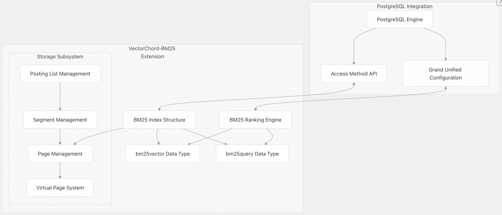
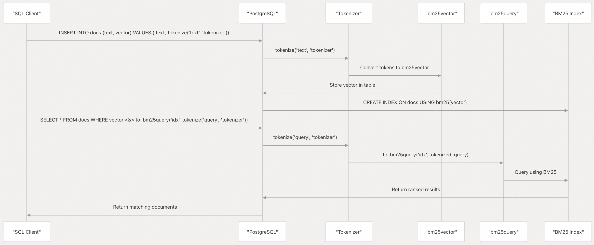
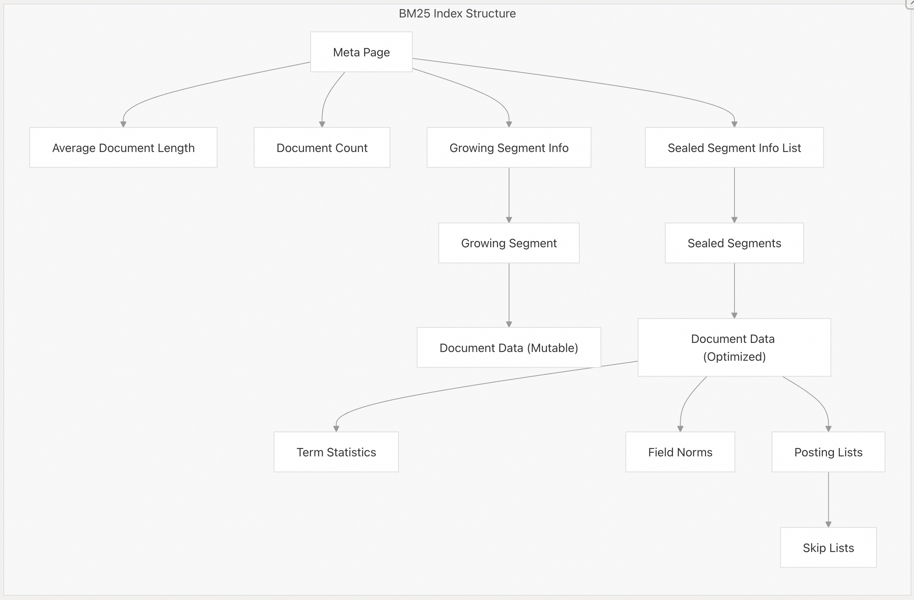
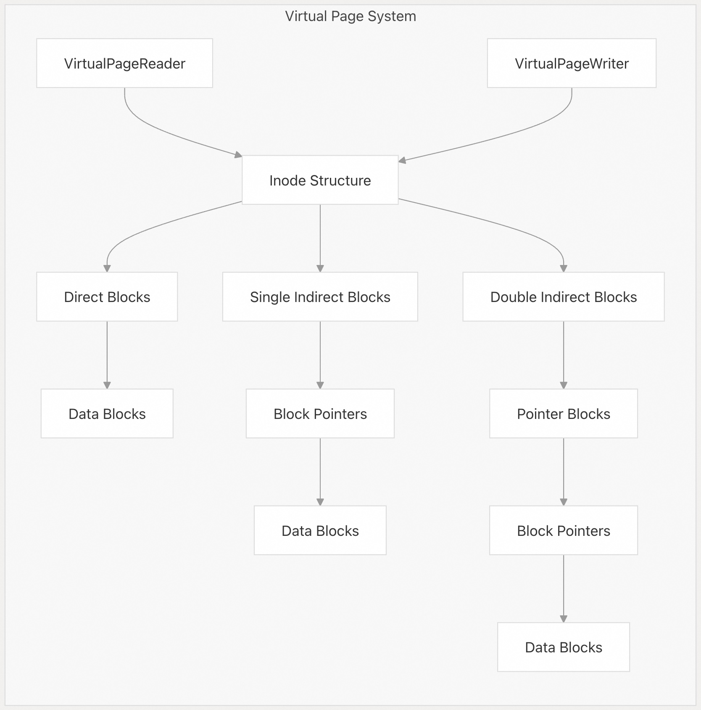
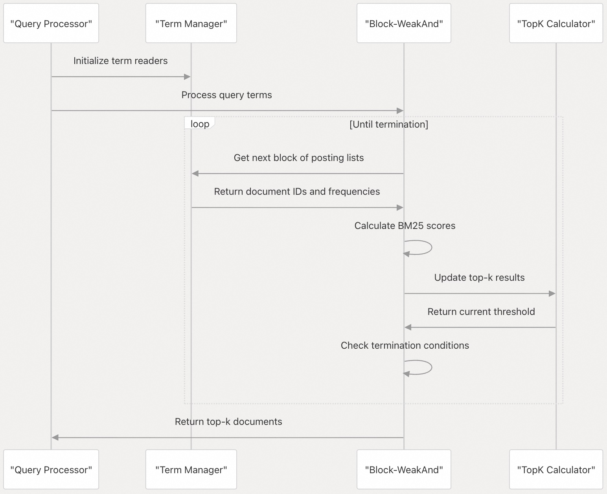
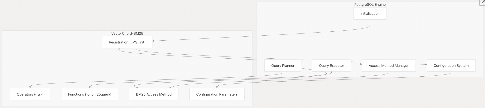

## VectorChord-bm25 源码学习: 2 核心组件 (`Core Components`)  
                                      
### 作者                                      
digoal                                      
                                      
### 日期                                      
2025-11-21                                      
                                      
### 标签                                      
VectorChord-bm25 , 源码学习 , 全文检索 , 关键词检索 , TF , IDF , 相关性排序 , ranking , Block-WeakAnd , Block-WAND , tsvector , ts_rank                                        
                                      
----                                      
                                      
## 背景               
本文概述了构成 VectorChord-BM25 系统的主要组件（components）。它涵盖了核心架构元素，这些元素使得在 PostgreSQL 中实现高效的 BM25 文本排序（text ranking）功能成为可能。  
  
## 系统架构概览 (`System Architecture Overview`)  
  
VectorChord-BM25 由几个相互关联的组件组成，它们协同工作，作为 PostgreSQL 扩展（extension）提供 BM25 排序（ranking）能力。该扩展在 PostgreSQL 内部直接实现了 Block-WeakAnd 算法（Block-WeakAnd algorithm），以实现高效的 BM25 排序。  
  
下图展示了系统的高级架构：  
  
  
  
来源:  
[`src/lib.rs` 3-10](https://github.com/tensorchord/VectorChord-bm25/blob/da0908a6/src/lib.rs#L3-L10)  
  
## 核心模块 (`Core Modules`)  
  
VectorChord-BM25 扩展（extension）组织成几个关键模块（modules），每个模块负责系统的特定方面：  
  
| 模块 (`Module`) | 描述 (`Description`) |  
| :--- | :--- |  
| `algorithm` | 实现用于 BM25 排序的 Block-WeakAnd 算法（Block-WeakAnd algorithm） |  
| `datatype` | 定义 `bm25vector` 和 `bm25query` 数据类型（data types） |  
| `guc` | 管理 PostgreSQL 配置参数（configuration parameters） |  
| `index` | 实现 BM25 索引访问方法（index access method） |  
| `page` | 处理页级存储管理（page-level storage management） |  
| `segment` | 管理文档存储的分段（segments） |  
| `utils` | 提供实用函数（utility functions） |  
| `weight` | 实现 BM25 评分函数（scoring functions） |  
  
来源:  
[`src/lib.rs` 3-10](https://github.com/tensorchord/VectorChord-bm25/blob/da0908a6/src/lib.rs#L3-L10)  
  
## 数据类型 (`Data Types`)  
  
VectorChord-BM25 定义了两种用于表示文档（documents）和查询（queries）的专用数据类型（data types）：  
  
1.  **bm25vector**: 一种稀疏向量（sparse vector）类型，用于表示分词后的文本（tokenized text）。它存储词元 ID（token IDs）及其对应的频率（frequencies）。例如，`{1:2, 2:1}` 表示词元 ID 1 在文档中出现两次，词元 ID 2 出现一次。  
2.  **bm25query**: 一种查询表示类型（query representation type），用于 BM25 排序操作。通过 `to_bm25query()` 函数创建。  
  
这些数据类型是系统中文档表示和查询处理的基础。  
  
下图说明了使用这些类型时的数据流：  
  
  
  
来源:  
[`README.md` 445-466](https://github.com/tensorchord/VectorChord-bm25/blob/da0908a6/README.md#L445-L466)  
  
## BM25 索引结构 (`BM25 Index Structure`)  
  
BM25 索引（index）是一种自定义的访问方法（custom access method），它组织文档数据以实现高效的搜索和排序（ranking）。它管理以下内容：  
  
  * 文档统计信息（Document statistics）（多少篇文档计数、文档的平均长度）  
  * 词项统计信息（Term statistics）（每个词项出现的不同文档频率）  
  * 倒排列表（Posting lists）（每个词项被哪些文档包含）  
  * 字段规范（Field norms）（文档长度归一化）  
  
该索引采用分段（segmented）方法，包含两种类型的分段（segments）：  
  
1.  **Growing Segment (增长分段)**: 一个可变（mutable）分段，用于添加新文档。  
2.  **Sealed Segments (密封分段)**: 不可变（Immutable），经过优化，用于高效搜索的分段。  
  
当增长分段达到可配置的大小限制时，它将被密封，并创建一个新的增长分段。  
  
  
  
来源:  
[`README.md` 93-97](https://github.com/tensorchord/VectorChord-bm25/blob/da0908a6/README.md#L93-L97) [`src/lib.rs` 6](https://github.com/tensorchord/VectorChord-bm25/blob/da0908a6/src/lib.rs#L6-L6)  
  
## 虚拟页系统 (`Virtual Page System`)  
  
虚拟页系统（Virtual Page System）提供了用于管理物理存储（physical storage）的抽象层（abstraction layer）。它负责：  
  
1.  **页分配（Page Allocation）**: 管理物理页的分配和释放（deallocation）  
2.  **块寻址（Block Addressing）**: 为数据块（data blocks）提供逻辑寻址方案（logical addressing scheme）  
3.  **I/O 优化（I/O Optimization）**: 高效的读写操作  
  
该系统采用类似于文件系统的基于 inode（inode-based）的方法，具有直接和间接块寻址（direct and indirect block addressing）。这使得可变大小的数据和不断增长的倒排列表（posting lists）能够得到高效处理。  
  
  
  
来源:  
[`src/lib.rs` 8](https://github.com/tensorchord/VectorChord-bm25/blob/da0908a6/src/lib.rs#L8-L8)  
  
## Block-WeakAnd 算法 (`Block-WeakAnd Algorithm`)  
  
Block-WeakAnd 算法（Block-WeakAnd algorithm）是 VectorChord-BM25 高效排序实现（ranking implementation）的核心。它以块（blocks）为单位处理倒排列表（posting lists），从而无需扫描整个集合即可高效地识别最相关的文档。  
  
主要特性包括：  
  
1.  **基于块的处理（Block-Based Processing）**: 以块为单位处理文档以提高效率  
2.  **跳表（Skip Lists）**: 使用跳表来高效地导航倒排列表  
3.  **提前终止（Early Termination）**: 在找到足够的结果时可以停止处理  
4.  **分数边界（Score Bounds）**: 使用分数上限（score upper bounds）来优先处理  
  
  
  
来源:  
[`README.md` 11](https://github.com/tensorchord/VectorChord-bm25/blob/da0908a6/README.md#L11-L11) [`src/lib.rs` 3](https://github.com/tensorchord/VectorChord-bm25/blob/da0908a6/src/lib.rs#L3-L3)  
  
## 与 PostgreSQL 的集成 (`Integration with PostgreSQL`)  
  
VectorChord-BM25 通过多种机制与 PostgreSQL 集成（integrates）：  
  
1.  **自定义访问方法（Custom Access Method）**: 为 PostgreSQL 实现了一个自定义的索引访问方法（`bm25`）  
2.  **自定义运算符（Custom Operators）**: 提供 `<&>` 等运算符用于 BM25 评分（scoring）  
3.  **配置参数（Configuration Parameters）**: 通过 PostgreSQL 的 GUC 系统暴露可调参数（tunable parameters）  
  
该扩展（extension）挂钩到 PostgreSQL 的初始化过程，以注册这些组件。  
  
  
  
来源:  
[`src/lib.rs` 25-29](https://github.com/tensorchord/VectorChord-bm25/blob/da0908a6/src/lib.rs#L25-L29)  
  
## 配置参数 (`Configuration Parameters`)  
  
VectorChord-BM25 提供了几个配置参数（configuration parameters）来调整其行为：  
  
| 参数 (`Parameter`) | 描述 (`Description`) | 默认值 (`Default`) | 范围 (`Range`) |  
| :--- | :--- | :--- | :--- |  
| `bm25_catalog.bm25_limit` | 返回文档的最大数量 | 100 | -1 至 65535 |  
| `bm25_catalog.enable_index` | 是否启用 BM25 索引（index） | true | boolean（布尔值） |  
| `bm25_catalog.segment_growing_max_page_size` | 增长分段（growing segment）的最大页数 | 4,096 | 1 至 1,000,000 |  
  
这些参数可以使用 PostgreSQL 的 `SET` 命令在系统级、数据库级或会话级（session level）进行设置。  
  
来源:  
[`README.md` 467-472](https://github.com/tensorchord/VectorChord-bm25/blob/da0908a6/README.md#L467-L472) [`src/lib.rs` 5](https://github.com/tensorchord/VectorChord-bm25/blob/da0908a6/src/lib.rs#L5-L5)  
  
## 组件交互 (`Component Interactions`)  
  
下图说明了在典型的搜索操作期间组件是如何交互的：  
  
  
  
来源:  
[`README.md` 93-113](https://github.com/tensorchord/VectorChord-bm25/blob/da0908a6/README.md#L93-L113)  
  
## 总结 (`Summary`)  
  
VectorChord-BM25 的核心组件协同工作，以在 PostgreSQL 中提供高效的 BM25 文本排序（text ranking）：  
  
1.  **数据类型（Data Types）**（`bm25vector` 和 `bm25query`）为表示文档和查询提供了基础  
2.  **BM25 索引（BM25 Index）** 组织和存储文档信息，以便高效检索  
3.  **虚拟页系统（Virtual Page System）** 管理索引数据的物理存储  
4.  **Block-WeakAnd 算法（Block-WeakAnd Algorithm）** 高效处理查询以找到最相关的文档  
5.  **PostgreSQL 集成（PostgreSQL Integration）** 实现了在 SQL 查询中无缝使用 BM25 排序  
  
来源:  
[`src/lib.rs` 3-10](https://github.com/tensorchord/VectorChord-bm25/blob/da0908a6/src/lib.rs#L3-L10)  
  
-----  
  
# 附录1: VectorChord-BM25 中 `bm25vector` 和 `bm25query` 数据类型的分词灵活性和性能开销  
既然 VectorChord-BM25 依赖于 **`bm25vector`**（稀疏向量）和 **`bm25query`** 这两种特殊数据类型来表示文档和查询，那么：  
  
1.  **分词灵活性（Tokenization Flexibility）：** 在将原始文本转换为 `bm25vector` 的过程中，系统使用的是预设的、不可变的词元化（Tokenization）方法，还是允许用户（例如通过配置或自定义函数）接入不同的分词器或调整分词规则（例如针对中文、日文等非拉丁语系）？  
2.  **数据准备开销（Data Preparation Overhead）：** 将文档（例如原始文本）转换为 `bm25vector` 的索引过程，以及查询时使用 `to_bm25query()` 函数创建查询表示，这两种**数据准备操作**的性能开销（Performance Overhead）如何？这在整个索引和查询流程中是否可能成为性能瓶颈？  
  
### **💡 价值分析：**  
  
这个问题将焦点从存储结构（分段）转移到了**数据输入**和**处理成本**，对于实际应用至关重要：  
  
1.  **语言支持的灵活度：** `bm25vector` 依赖于词元（token）和频率。对于全球化应用或中文等复杂语言， **分词器（Tokenization）** 的选择和自定义能力是决定 BM25 搜索质量的关键。用户需要知道这部分是否可控。  
2.  **隐藏的性能瓶颈：** 数据库扩展的性能不仅取决于其核心算法（Block-WeakAnd），还取决于数据在进入和离开核心算法前的准备工作。了解自定义数据类型转换的计算成本，有助于用户在高并发或大数据量场景下规划资源。  
     
## Answer  
  
您的问题涉及 VectorChord-BM25 中 `bm25vector` 和 `bm25query` 数据类型的分词灵活性和性能开销。  
  
### 1. 分词灵活性（Tokenization Flexibility）  
  
VectorChord-BM25 **支持高度灵活的分词配置**，允许用户通过多种方式自定义分词器。    
  
系统提供以下分词选项：  
  
**预训练模型**：可以使用如 `bert_base_uncased` 等预训练模型进行分词。    
  
**自定义模型**：用户可以基于自己的语料库训练自定义模型，通过 `create_custom_model_tokenizer_and_trigger()` 函数配置文本分析器（text analyzer），包括预分词器（pre-tokenizer）、字符过滤器（character filters）和词元过滤器（token filters）。    
  
**非拉丁语系支持**：  
- **中文**：支持使用 `jieba` 预分词器进行中文分词。    
- **日文**：支持使用 `lindera` 模型及其配置进行日文分词。    
  
分词器通过 `create_tokenizer()` 函数创建，配置存储在 `bm25_catalog.tokenizers` 表中。   用户可以通过 TOML 格式的配置字符串完全控制分词行为。    
  
### 2. 数据准备开销（Data Preparation Overhead）  
  
关于性能开销，代码库中提供了以下信息：  
  
**索引时的 `tokenize()` 操作**：`tokenize()` 函数被标记为 `STABLE PARALLEL SAFE`，这意味着它可以在并行查询中安全使用。   该函数将文本转换为 `bm25vector`，这是一个稀疏向量结构，存储词元 ID 和频率。    
  
**查询时的 `to_bm25query()` 操作**：`to_bm25query()` 函数同样标记为 `STABLE STRICT PARALLEL SAFE`，它内部调用 `tokenize()` 函数。   这是一个轻量级的 SQL 函数，仅执行分词并构造查询结构。  
  
**性能优化建议**：为了减少首次查询延迟，系统提供了 `add_preload_model()` 函数，可以在服务器启动时预加载模型。   这表明模型加载可能是一个潜在的性能考虑点，但可以通过预加载来缓解。  
  
代码库中没有提供具体的性能基准测试数据来量化这些操作的开销。 不过，从设计上看，`bm25vector` 使用稀疏向量表示，只存储非零词元，这应该能够高效处理大多数文本。 预训练模型（如 `gemma2b` 和 `llmlingua2`）可能占用较多内存（100-200MB），但这主要是一次性加载成本。    
  
## Notes  
  
VectorChord-BM25 的分词系统实际上是由独立的扩展 `pg_tokenizer.rs` 提供的。   更详细的分词配置和性能调优信息可以在该项目的文档中找到。    
  
关于性能瓶颈的具体评估，需要根据您的实际使用场景（文档大小、查询频率、并发量等）进行测试。系统提供的并行安全特性和预加载机制表明开发者已经考虑了性能优化，但没有公开的基准测试数据来量化具体开销。  
  
-----  
  
# 附录2: 详细描述跳表在导航倒排列表过程中的使用  
  
您询问的是**跳表(Skip List)在导航倒排列表(Posting List)过程中的使用**。    
  
## 跳表结构  
  
在VectorChord-BM25中, 跳表通过`SkipBlock`结构实现, 每个`SkipBlock`对应一个128文档的压缩块。    
  
跳表信息存储在链式页面中,`PostingTermMetaData`维护`skip_info_blkno`(首页)和`skip_info_last_blkno`(尾页)。    
  
## 导航过程  
  
### 1. 初始化  
`PostingCursor::new()`创建游标时, 从`PostingTermMetaData`读取跳表起始位置, 并调用`update_skip_info()`加载第一个`SkipBlock`。   
  
### 2. 块级跳转 (shallow_seek)  
`shallow_seek(docid)`使用跳表快速跳过不包含目标文档的块, 通过检查`cur_skip_info.last_doc`判断是否需要前进到下一块。    
  
### 3. 块间移动 (next_block)  
`next_block()`前进到下一个块时:  
- 更新`decode_offset`为当前块的`last_doc`  
- 增加`skip_info_offset`读取下一个`SkipBlock`  
- 如果跳表页已满,通过`opaque.next_blkno`跳转到链表下一页  
- 检查`PAGE_CHANGED`标志判断是否需要切换VirtualPage    
  
### 4. 精确定位 (seek)  
`seek(docid)`结合跳表和块内二分查找:  
- 先用`shallow_seek()`跳到包含目标文档的块  
- 解码该块  
- 在未填充块中使用`partition_point()`二分查找, 或在已解码块中调用`block_decode.seek()`   
  
## Block-WAND优化中的应用  
  
在Block-WAND算法中,跳表的`blockwand_tf`和`blockwand_fieldnorm_id`字段存储每个块的BM25分数上界。    
  
`block_max_score()`使用这些值计算上界,允许算法跳过不可能进入top-k结果的整个块,避免解压缩开销。    
  
在多词查询中,`shallow_seek(pivot)`将所有scorer对齐到pivot文档,然后检查所有块上界之和是否超过阈值。    
  
## Notes  
  
跳表设计的关键优势:  
- **固定块大小(128文档)** 平衡了压缩效率和访问粒度  
- **链式页面存储**支持高效追加和遍历  
- **BlockWand元数据**实现了块级剪枝优化  
- **PAGE_CHANGED标志**优化了跨VirtualPage的导航  
  
    
#### [PolarDB 学习图谱](https://www.aliyun.com/database/openpolardb/activity "8642f60e04ed0c814bf9cb9677976bd4")
  
  
#### [PostgreSQL 解决方案集合](../201706/20170601_02.md "40cff096e9ed7122c512b35d8561d9c8")
  
  
#### [德哥 / digoal's Github - 公益是一辈子的事.](https://github.com/digoal/blog/blob/master/README.md "22709685feb7cab07d30f30387f0a9ae")
  
  
#### [About 德哥](https://github.com/digoal/blog/blob/master/me/readme.md "a37735981e7704886ffd590565582dd0")
  
  

  
