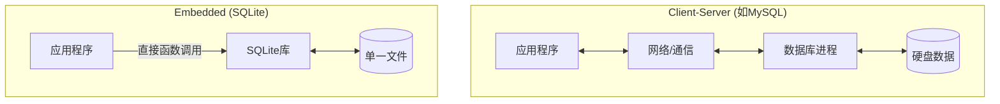
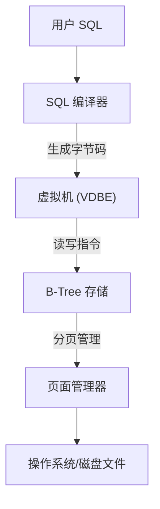
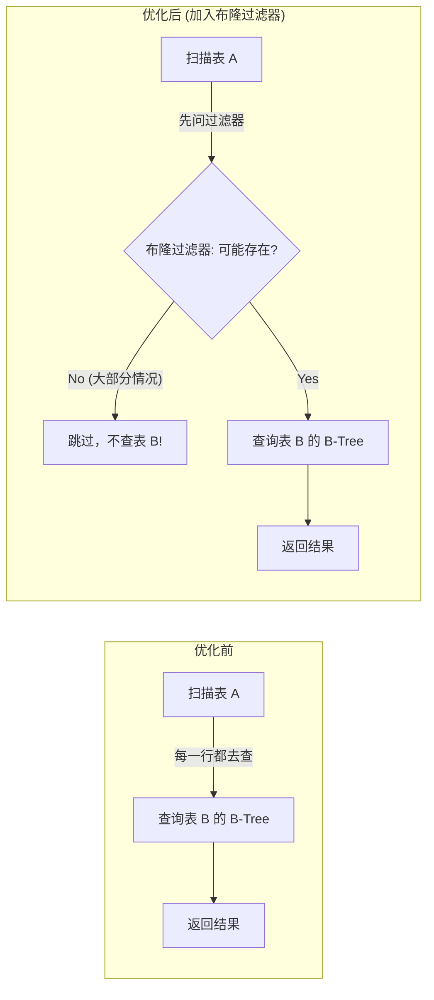
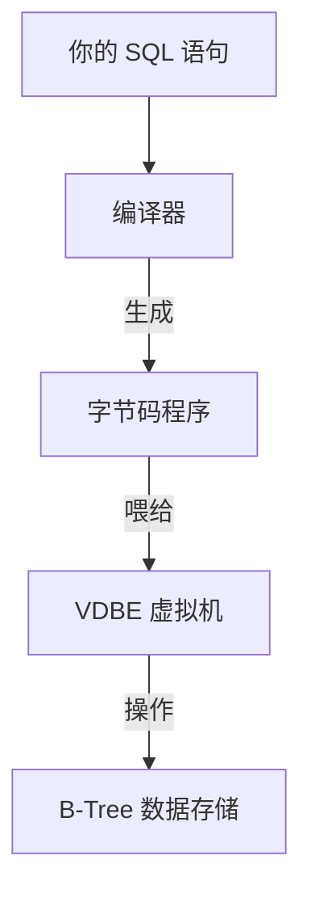

## AI论文解读 | SQLite: Past, Present, and Future
        
### 作者        
digoal        
        
### 日期        
2025-11-21        
        
### 标签        
PostgreSQL , PolarDB , DuckDB , AI , 论文解读        
        
----        
        
## 背景  
      
https://www.vldb.org/pvldb/vol15/p3535-gaffney.pdf        
  
提示:          
```          
读懂《SQLite: Past, Present, and Future》这篇论文需要提前掌握哪些基础知识, 请使用中文通熟易懂的讲解这些基础知识, 可以引用论文中的图、表或使用Markdown支持的图形(text,mermaid等)增加解释性. 
  
使用中文通熟易懂的解读《SQLite: Past, Present, and Future》这篇论文, 其中的关键内容请着重讲解, 可以引用论文中的图、表或使用Markdown支持的图形(text,mermaid等)增加解释性. 
  
提取《SQLite: Past, Present, and Future》这篇论文中的重要术语, 使用中文对这些术语进行通熟易懂的讲解, 可以引用论文中的图、表或使用Markdown支持的图形(text,mermaid等)增加解释性. 
```     
  
## 1 前置知识 
  
阅读这篇名为《SQLite: Past, Present, and Future》的论文，通过回顾SQLite的历史、架构并将其与新兴的分析型数据库DuckDB进行对比，探讨了SQLite在现代数据处理中的定位。

为了能够轻松读懂这篇论文，你需要掌握以下几个核心的基础概念。我会用通俗的语言为你讲解，并结合图表帮助理解。

### 1\. 嵌入式数据库 (Embedded Database) vs. 客户端-服务器 (Client-Server)

这是理解SQLite核心定位的关键。

  * **传统的客户端-服务器模式 (如 MySQL, PostgreSQL):** 数据库是一个独立的**进程**（Process），应用程序通过网络或进程间通信（Shared Memory）向数据库发送请求。就像你去餐厅吃饭，你（应用程序）坐在座位上，告诉服务员（网络/通信协议）你要什么，服务员告诉厨房（数据库服务器）去做 。
  * **嵌入式模式 (SQLite):** SQLite没有独立的进程，它直接作为**库**（Library）链接在你的应用程序里。就像你在家里做饭，你（应用程序）直接走进厨房（SQLite）自己拿食材处理。没有中间商，速度快，没有复杂的配置 。




### 2\. OLTP vs. OLAP (两种不同的工作负载)

论文的核心冲突点在于：SQLite是为OLTP设计的，但现在大家想用它做OLAP 。

  * **OLTP (联机事务处理 - Online Transaction Processing):**
      * **场景:** 比如银行转账、电商下单。
      * **特点:** 操作频繁，但每次只读写少量数据（一行或几行）。要求**快**且**绝对可靠**（ACID）。
      * **SQLite的强项:** SQLite主要是为了这种快速的行级处理设计的 。
  * **OLAP (联机分析处理 - Online Analytical Processing):**
      * **场景:** 数据分析师做报表，计算“过去一年所有用户的总消费额”。
      * **特点:** 查询复杂，通常不修改数据，但一次要扫描几百万行数据进行聚合计算。
      * **现状:** 随着边缘计算和数据科学的发展，大家希望在本地（嵌入式环境）也能高效做OLAP 。

### 3\. 行式存储 (Row-Oriented) vs. 列式存储 (Column-Oriented)

这是论文解释为什么DuckDB在分析任务上比SQLite快的主要原因。

  * **行式存储 (SQLite):** 数据是按“行”连在一起存的。
      * *例子:* `[ID:1, Name:张三, Age:25], [ID:2, Name:李四, Age:30]`
      * *优点:* 想读取“张三”的所有信息时非常快 。
      * *缺点:* 如果只想算“所有人的平均年龄”，必须把每个人的名字、ID都读出来才能拿到年龄，浪费了IO带宽。
  * **列式存储 (DuckDB):** 数据是按“列”分开存的。
      * *例子:* `ID:[1, 2]`, `Name:[张三, 李四]`, `Age:[25, 30]`
      * *优点:* 算“平均年龄”时，只需要读取`Age`这一块数据，速度极快，且容易压缩 。

| 特性 | 行式 (SQLite) | 列式 (DuckDB) |
| :--- | :--- | :--- |
| **存储方式** | 同一行的数据紧挨着存  | 同一列的数据紧挨着存  |
| **优势场景** | 查单条记录 (OLTP) | 大规模统计分析 (OLAP) |

### 4\. B-Tree (B树)

论文提到SQLite主要使用B-Tree存储格式 。

  * **通俗解释:** 把B-Tree想象成一个**高度有序的索引系统**。就像图书馆的卡片目录。
  * **作用:** 当你想找 `ID = 100` 的数据时，B-Tree能让你通过几次跳转快速找到位置，而不需要从头翻到尾。
  * **论文中的痛点:** 在做复杂的分析（OLAP）时，如果需要把几个大表连接起来（Join），频繁地在B-Tree里跳来跳去查找（Seek）非常消耗CPU资源，这在论文的性能分析图表中是一个主要的瓶颈 。

### 5\. Join算法与布隆过滤器 (Bloom Filters)

论文用了很大篇幅介绍如何优化SQLite的性能，核心技术就是引入了**布隆过滤器**来优化Join操作 。

  * **Nested Loop Join (嵌套循环连接):** SQLite默认的连接方式 。
      * *逻辑:* 拿着A表的每一行，去B表里找匹配的行。如果表很大，这就像拿着一叠名单，去图书馆一本书一本书地翻，效率很低。
  * **Bloom Filter (布隆过滤器):** 一种内存效率极高的概率型数据结构。
      * *通俗解释:* 它像是一个 **极其快速的“守门员”** 。在去B表（图书馆）查书之前，先问守门员：“这本书**可能**在里面吗？”
          * 如果不和：守门员会说“绝对不在”，那你就可以直接跳过，不用去查B-Tree了（省了大量时间）。
          * 如果匹配：守门员会说“可能在”，那你再去查。
      * *效果:* 论文通过引入这个技术，减少了大量无用的B-Tree查找，让SQLite在分析基准测试（SSB）上快了4.2倍 。

### 6\. ACID 与 WAL (Write-Ahead Log)

论文在评估部分比较了不同模式的性能。

  * **ACID:** 数据库事务的四大特性（原子性、一致性、隔离性、持久性）。SQLite保证只要数据存进去了，断电也不会丢 。
  * **Rollback Journal (回滚日志):** SQLite的老模式。修改数据前，先把旧数据抄下来。提交时再删掉抄下来的旧数据 。这导致写操作很慢，因为要写两次。
  * **WAL (预写日志):** 新模式。
      * *逻辑:* 修改数据时，不直接改原文件，而是追加写到一个新的日志文件（WAL文件）末尾 。
      * *优点:* 追加写（Sequential Write）比随机写快得多；而且读和写可以并发进行（读主文件，写WAL文件），大大提高了并发性能 。

### 总结

掌握了以上概念，你在阅读这篇论文时就能明白：

1.  为什么SQLite以前只适合做简单的事务处理（OLTP）。
2.  为什么遇到大量数据分析（OLAP）时它会变慢（行式存储+B-Tree查找开销）。
3.  论文作者是如何通过“布隆过滤器”这种不需要改变底层文件格式的巧妙方法，来提升SQLite分析性能的。

-----

**我能为你做的下一步：**
如果你对论文中提到的**性能优化具体实现逻辑（如Lookahead Information Passing）感兴趣，或者想了解DuckDB和SQLite在具体基准测试（Benchmark）中的数据对比细节**，我可以为你深入解读相关章节。
  
## 2 解读论文 
  
这篇论文《SQLite: Past, Present, and Future》由威斯康星大学麦迪逊分校的研究人员与SQLite的核心开发者共同撰写。它不仅回顾了SQLite作为全球部署最广泛的数据库引擎的辉煌历史，更重要的是，它深入探讨了SQLite在面对现代 **分析型工作负载（OLAP）** 挑战时的表现，并给出了具体的优化方案。

以下是对这篇论文通俗易懂的深度解读：

-----

### 1\. SQLite 的前世今生：无处不在的“小巨人”

**过去 (Past):**
SQLite 诞生于 2000 年 8 月，最初只是为了解决在调试由于数据库运行在独立进程中而产生的麻烦 。

  * **核心差异：** 传统的数据库（如 MySQL）是“客户端-服务器”模式，数据库是一个独立的进程。而 SQLite 是 **嵌入式（In-process）** 的，它直接住在你的应用程序里，不仅没有网络开销，还是一个独立的单文件 。

**现在 (Present):**
SQLite 已经成为世界上部署最广泛的软件库之一，现在的智能手机、浏览器、电视甚至汽车里都有它的身影，活跃的 SQLite 数据库可能超过一万亿个 。

  * **成功的秘诀：** 可靠性（100% 分支测试覆盖率）、跨平台文件格式（美国国会图书馆推荐格式）、以及极小的体积（编译后仅约 750 KiB） 。

-----

### 2\. 架构解密：它为什么这么快？

为了理解论文的核心冲突，我们需要看一眼 SQLite 的内部构造。

SQLite 的架构非常模块化，主要分为三层：

1.  **SQL 编译器 (Compiler):** 把你的 SQL 语句翻译成字节码程序 。
2.  **核心虚拟机 (Core/VDBE):** 也就是虚拟数据库引擎（VDBE），它负责执行字节码 。
3.  **后端 (Backend):** 主要使用 **B-Tree**（B树）来存储数据 。




**关键点：** SQLite 是 **行式存储（Row-oriented）** 。这意味着一行数据的所有列都挨在一起存。这种设计非常适合 **事务处理（OLTP）** ，比如“读取用户ID为5的完整信息” 。

-----

### 3\. 现代挑战：当“事务王”遇到“分析热”

随着边缘计算和数据科学的兴起，大家开始希望在本地设备（如树莓派、手机）上直接做复杂的数据分析（OLAP），而不只是简单的存取数据 。

这就引出了论文的主要对比对象：**DuckDB**。

  * **SQLite:** 就像一把瑞士军刀，通用，擅长处理单行事务（OLTP）。
  * **DuckDB:** 被称为“分析版 SQLite”，专为分析设计，采用**列式存储**和向量化执行 。

**性能大比拼 (基准测试结果):**

1.  **OLTP 场景 (交易型任务):**

      * **赢家：SQLite。**
      * 在 TATP 基准测试中，SQLite（特别是开启 WAL 模式后）吊打 DuckDB。在云服务器上，SQLite 比 DuckDB 快 **10倍到 500倍** 。这是因为 DuckDB 不是为这种细碎的增删改查设计的。

2.  **OLAP 场景 (分析型任务):**

      * **赢家：DuckDB (优化前)。**
      * 在 SSB 基准测试（模拟数据仓库查询）中，DuckDB 完胜。对于某些复杂的连接查询（Join），DuckDB 比 SQLite 快 **30 到 50 倍** 。

-----

### 4\. 关键优化：如何让 SQLite 跑得更快？

论文最精彩的部分在于：**不仅发现了差距，还找到了根源并解决了它。**

#### **第一步：诊断 (Profiling)**

研究人员通过分析 SQLite 执行分析查询时的 CPU 周期，发现了一个惊人的事实：绝大多数时间都花在了一个叫 `SeekRowid` 的指令上 。

  * **原因：** 当 SQLite 做多表连接（Join）时，它使用嵌套循环。对于外表的每一行，它都要去内表的 **B-Tree** 索引里查一遍（Probe）。如果表很大，这种查找极其耗时，而且很多查找最后发现根本不匹配，是无用功 。

#### **第二步：药方 (Bloom Filters)**

为了解决这个问题，但又不能大改 SQLite 稳定的文件格式，他们引入了 **布隆过滤器 (Bloom Filters)** 。

> **通俗解释布隆过滤器：**  
> 想象你在很多本书里找资料。  
>  
>   * **优化前：** 你必须一本一本书翻开看（查 B-Tree），非常慢。  
>   * **优化后（加了布隆过滤器）：** 这里的书架管理员有一个神奇的清单。你先问管理员：“这本书里有我要的内容吗？”  
>       * 如果管理员说“**绝对没有**”：你就直接跳过这本书（省去了查 B-Tree 的昂贵开销）。  
>       * 如果管理员说“**可能有**”：你再翻开书确认。  

#### **第三步：疗效 (Result)**

通过实现这种“提前过滤”（Lookahead Information Passing, LIP）机制，SQLite 的性能大幅提升：

  * **SSB 基准测试速度提升了 4.2倍** 。
  * 特别是那些原本最慢的查询，速度提升了 **10倍** 。




-----

### 5\. 其他有趣的发现

除了上述核心内容，论文还提到了一些颠覆认知的点：

  * **SQLite 比文件系统还快？**
    是的。在读写 Blob（二进制大对象，如图片、文件片段）时，如果大小适中（如 100KB），SQLite 的读写速度实际上比直接用操作系统的 `fread/fwrite` 还要快 **35%** 。这是因为 SQLite 的页面缓存机制比操作系统的文件系统调用更高效。

  * **CSV 加载之痛：**
    虽然 DuckDB 跑查询很快，但把 CSV 数据加载进去却很慢。加载同样的数据，DuckDB 需要 100 秒，而 SQLite 只需要 82 秒。但这两种速度在作者看来都太慢了，是未来的优化方向 。

-----

### 6\. 总结与未来 (Future)

这篇论文不仅证明了 SQLite 在 OLTP 领域的霸主地位，也展示了它在分析领域的潜力。

  * **结论：** 虽然 DuckDB 在纯分析任务上依然更快（毕竟它是专门为此设计的列式存储），但 SQLite 通过引入布隆过滤器等现代技术，大大缩小了差距 。
  * **未来展望：** 开发者的目标是支持 SQLite 到 **2050年**。未来的优化将继续遵循三个原则：不破坏兼容性、保持库的轻量级、不牺牲可靠性 。

**一句话总结：** SQLite 依然是那个精悍的“全能选手”，通过引入布隆过滤器，它在处理复杂数据分析时变得更聪明、更敏捷了。
  
## 3 术语 
  
基于《SQLite: Past, Present, and Future》这篇论文，我为你提取了理解SQLite核心架构及未来发展方向的8个关键术语。以下是这些术语的通俗解读。

### 1\. In-process (进程内 / 嵌入式)

这是SQLite与MySQL、Oracle等传统数据库最大的区别。

  * **通俗解释：** 传统的数据库像是“餐厅”，你的程序是顾客，必须通过服务员（网络协议）把菜单传给厨房（数据库进程）。而 **In-process** 的SQLite像是“私家厨师”，它直接住在你的程序（进程）里面，你想吃什么直接告诉它，没有中间商赚差价，不需要网络通信，也没有复杂的配置 。
  * **优势：** 这种设计使得SQLite非常适合嵌入到手机、浏览器、电视甚至汽车中，因为它没有外部依赖，直接调用库函数即可 。

### 2\. OLTP vs. OLAP (两种不同的任务模式)

论文的核心冲突点在于SQLite是为OLTP设计的，但现在人们想用它做OLAP。

  * **OLTP (联机事务处理):** 就像**银行柜员**。任务短平快，比如“存100块钱”、“查询余额”。要求反应极快，数据绝对安全（ACID）。SQLite在这个领域表现极佳，处理速度极快 。
  * **OLAP (联机分析处理):** 就像**数据分析师**。任务繁重，比如“统计过去十年所有用户的总消费”。不怎么改数据，但要一次性扫描海量数据。这是SQLite的弱项，也是DuckDB（一种新兴的分析型数据库）的强项 。

### 3\. VDBE (Virtual Database Engine / 虚拟数据库引擎)

这是SQLite的心脏，位于架构的核心层。

  * **通俗解释：** 当你输入一句SQL（比如 `SELECT * FROM ...`），SQLite的编译器不会直接去硬盘找数据，而是先把这句话翻译成一种“字节码程序”（Bytecode）。**VDBE** 就是一个专门用来跑这些字节码的虚拟机。它像一个勤勤恳恳的工人，按照指令一步步去操作底层数据 。
  * **图解：** 论文中的架构图简化版：





### 4\. Row-oriented vs. Column-oriented (行式存储 vs. 列式存储)

这是理解为什么SQLite做分析比DuckDB慢的关键。

  * **Row-oriented (SQLite):** 数据是**按行**存的。
      * *例子：* `{ID:1, Name:张三, Age:20}, {ID:2, Name:李四, Age:25}`
      * *特点：* 读取一个人的完整信息很快，但如果要算“所有人的平均年龄”，必须把不需要的Name和ID也读出来，浪费资源 。
  * **Column-oriented (DuckDB):** 数据是**按列**存的。
      * *例子：* `ID:{1, 2}`, `Name:{张三, 李四}`, `Age:{20, 25}`
      * *特点：* 算平均年龄时，只读Age这一列，速度飞快，非常适合OLAP 。

### 5\. SeekRowid (查找行ID指令)

这是论文在性能分析中发现的“罪魁祸首”。

  * **通俗解释：** 这是一个VDBE的指令。在做多表连接（Join）时，SQLite会拿着一张表里的ID，去另一张表的索引树（B-Tree）里搜。这个动作就叫 **SeekRowid**。
  * **问题：** 论文发现，在做复杂分析时，SQLite花了大量时间在反复执行这个指令，导致CPU忙得不可开交，但很多时候查到的结果是“找不到”，白白浪费了时间 。

### 6\. Bloom Filter (布隆过滤器)

这是论文作者为了解决上述性能问题引入的“秘密武器”。

  * **通俗解释：** 想象你要去图书馆（数据库表）查一本书。
      * *没有它：* 你只能去书架上一本一本翻（执行 `SeekRowid`），效率很低。
      * *有了它：* 门口坐着一个记忆力超群的大爷（布隆过滤器）。你进门前问：“大爷，有《哈利波特》吗？”
          * 大爷说“**没见过**”：那你直接回家，不用进去了（省了查表的时间）。
          * 大爷说“**好像有**”：你再进去细查。
  * **效果：** 作者通过在SQLite中加入这个机制（称为 Lookahead Information Passing, LIP），成功过滤掉了大量无效查找，让分析性能提升了4.2倍 。

### 7\. WAL (Write-Ahead Log / 预写日志)

这是SQLite的一种高性能事务模式。

  * **通俗解释：**
      * *老模式 (Rollback Mode):* 修改数据前，先把旧数据抄到本子上（回滚日志），然后再改原件。因为要写两次，所以慢 。
      * *WAL模式:* 不改原件，直接把新的修改追加写到一张“便签条”（WAL文件）的末尾。读数据时，同时看原件和便签条。这种模式下，读和写可以同时进行，大大提高了并发量和速度 。
      * *实测：* 论文测试显示，开启WAL模式后，SQLite的每秒交易量（TPS）远超DuckDB 。

### 8\. Flexible Typing (灵活类型 / 动态类型)

SQLite的一大特色，但也导致它在分析时不如DuckDB快。

  * **通俗解释：** 大多数数据库要求“这一列必须全是整数”。但SQLite很随性，它允许你在同一列里存整数、文本甚至二进制数据。
  * **代价：** 为了实现这种灵活，SQLite必须在**每一行**数据里都记录这一格数据的类型（是整数还是文本？）。这使得读取数据时（Value Extraction）步骤繁琐，必须逐个解析头部信息，比列式存储那种整齐划一的读取要慢 。
  
## 参考        
         
https://www.vldb.org/pvldb/vol15/p3535-gaffney.pdf    
        
<b> 以上内容基于DeepSeek、Qwen、Gemini及诸多AI生成, 轻微人工调整, 感谢杭州深度求索人工智能、阿里云、Google等公司. </b>        
        
<b> AI 生成的内容请自行辨别正确性, 当然也多了些许踩坑的乐趣, 毕竟冒险是每个男人的天性.  </b>        
    
#### [PolarDB 学习图谱](https://www.aliyun.com/database/openpolardb/activity "8642f60e04ed0c814bf9cb9677976bd4")
  
  
#### [PostgreSQL 解决方案集合](../201706/20170601_02.md "40cff096e9ed7122c512b35d8561d9c8")
  
  
#### [德哥 / digoal's Github - 公益是一辈子的事.](https://github.com/digoal/blog/blob/master/README.md "22709685feb7cab07d30f30387f0a9ae")
  
  
#### [About 德哥](https://github.com/digoal/blog/blob/master/me/readme.md "a37735981e7704886ffd590565582dd0")
  
  

  
