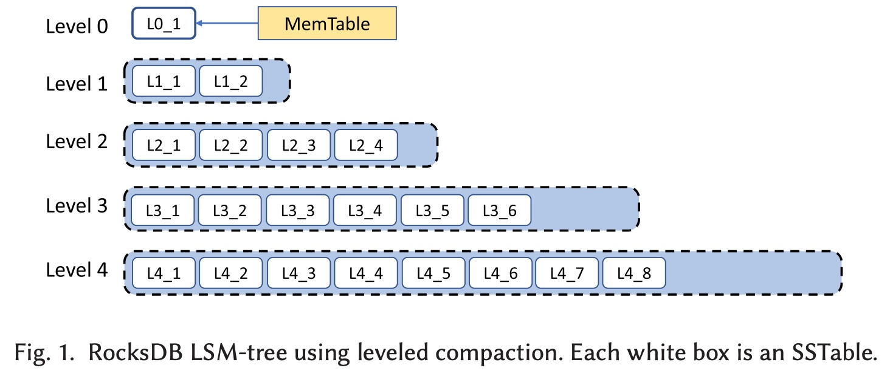
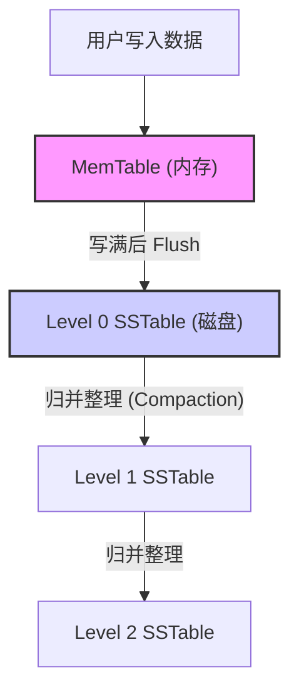
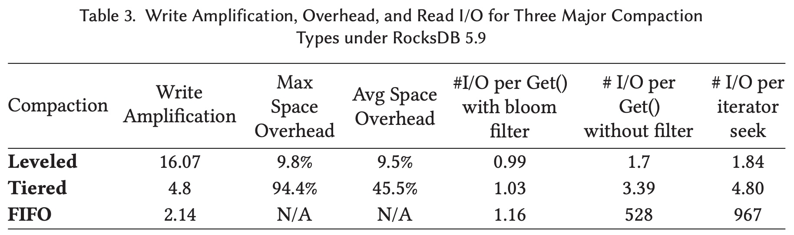
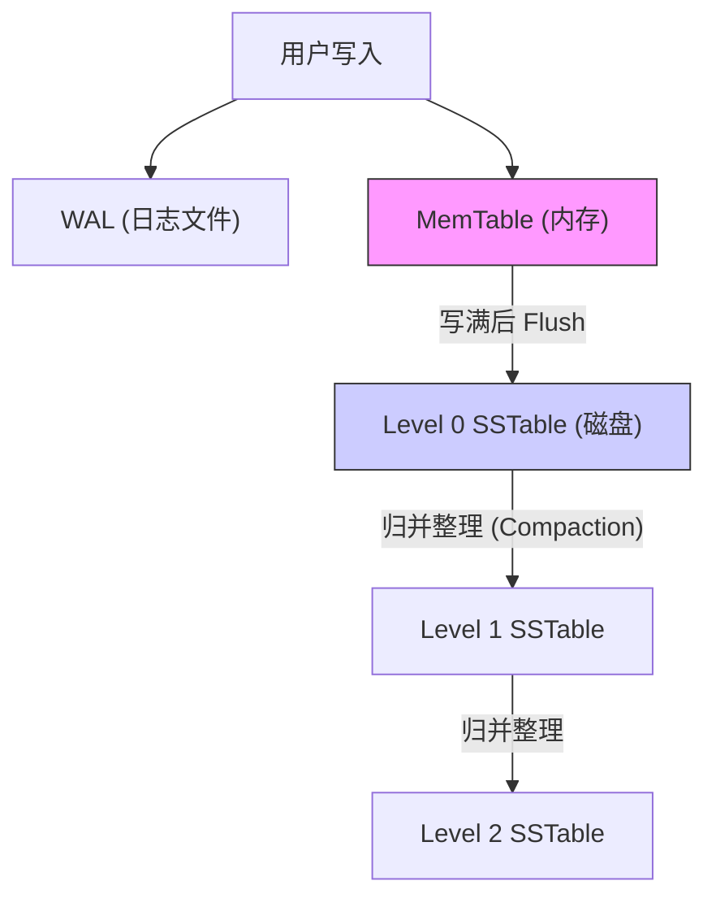
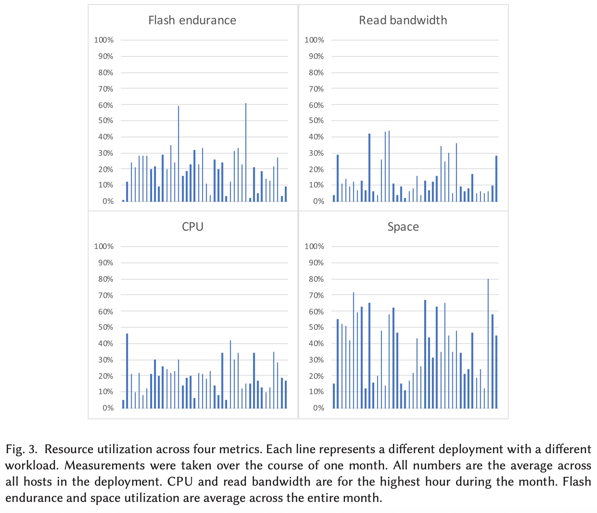
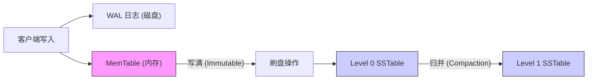

## AI论文解读 | RocksDB: Evolution of Development Priorities in a Key-value Store Serving Large-scale Applications
        
### 作者        
digoal        
        
### 日期        
2025-11-22        
        
### 标签        
PostgreSQL , PolarDB , DuckDB , AI , 论文解读        
        
----        
        
## 背景  
      
https://dl.acm.org/doi/pdf/10.1145/3483840        
  
提示:          
```          
读懂《RocksDB: Evolution of Development Priorities in a Key-value Store Serving Large-scale Applications》这篇论文需要提前掌握哪些基础知识, 请使用中文通熟易懂的讲解这些基础知识, 可以引用论文中的图、表或使用Markdown支持的图形(text,mermaid等)增加解释性. 
  
使用中文通熟易懂的解读《RocksDB: Evolution of Development Priorities in a Key-value Store Serving Large-scale Applications》这篇论文, 其中的关键内容请着重讲解, 可以引用论文中的图、表或使用Markdown支持的图形(text,mermaid等)增加解释性. 
  
提取《RocksDB: Evolution of Development Priorities in a Key-value Store Serving Large-scale Applications》这篇论文中的重要术语, 使用中文对这些术语进行通熟易懂的讲解, 可以引用论文中的图、表或使用Markdown支持的图形(text,mermaid等)增加解释性. 
```     
  
## 1 前置知识 
  
要读懂这篇关于 RocksDB 发展历程的论文，你需要掌握以下几个核心领域的“前置技能包”。我会用通俗易懂的语言为你拆解这些概念，并结合论文中的图表和简单的图示来辅助理解。

-----

### 1\. 核心数据结构：LSM-Tree (日志结构合并树)

这是理解 RocksDB 最根本的基础。传统的数据库（如 MySQL 的 InnoDB）通常使用 **B+树**，通过“原地更新”来修改数据。而 RocksDB 使用的是 **LSM-Tree (Log-Structured Merge-tree)**。

  * **通俗解释**：
    想象你在记账。

      * **B+树**：每次有新账，你都要翻开账本，找到那一页，擦掉旧数字，写上新数字。如果账本很厚，翻页（随机读写）很慢。
      * **LSM-Tree**：不管什么账，先写在一张随手贴（**MemTable**）上。写满了，就把随手贴钉在墙上（**SSTable**）。墙上钉满了，就把这一批随手贴拿下来，按顺序整理好，抄写进永久的大账本里（**Compaction**）。这使得写入速度极快，因为不管是新账还是改错，都是直接“追加”写在最后，不用回头翻。

  * **论文中的体现 (Figure 1)**：    
    论文中的 **Figure 1** 完美展示了 LSM-Tree 的层级结构。

      * **MemTable**：内存中的数据结构，写入的数据先到这里 。
      * **Level 0 (L0)**：MemTable 写满后“刷”到磁盘上形成的文件。L0 比较特殊，文件之间的时间范围可能重叠 。
      * **Level 1 \~ Level N**：更老的数据层。每一层的数据都经过了整理（Compaction），文件之间是有序且不重叠的 。




### 2\. 硬件背景：SSD (固态硬盘) 的特性

RocksDB 是专门为 SSD 优化的 。理解 SSD 和传统机械硬盘 (HDD) 的区别至关重要。

  * **关键点**：
    1.  **随机读写 vs. 顺序读写**：SSD 的随机读写性能远超 HDD，但顺序写入通常对寿命和性能更友好。RocksDB 将随机写转换为顺序写（Append-only），非常适合 SSD 。
    2.  **写放大与寿命**：SSD 的闪存颗粒有擦写次数限制（寿命）。如果软件层乱写数据，会导致 SSD 内部频繁搬运数据，加速磨损。RocksDB 的早期目标就是减少这种“写放大” 。
    3.  **空间成本**：SSD 比 HDD 贵。因此，如何把数据压缩得更小（Space Efficiency）后来成为了 RocksDB 的首要任务 。

### 3\. 性能评估的核心指标：三大“放大” (Amplification)

这是评估 LSM-Tree 存储引擎好坏的三个核心维度。论文中有大量篇幅在讨论如何在这些指标之间做权衡（Trade-off）。

| 指标名称 | 通俗解释 | 为什么不好？ |
| :--- | :--- | :--- |
| **写放大 (Write Amplification)** | 你只想写 1MB 数据，但数据库为了整理数据，实际在磁盘上写了 10MB。 | 浪费 SSD 寿命，占用 I/O 带宽 。 |
| **空间放大 (Space Amplification)** | 你存了 10GB 的有效数据，但数据库文件占用了 20GB 磁盘空间（包含了旧版本或已删除的数据）。 | SSD 很贵，浪费空间就是浪费钱 。 |
| **读放大 (Read Amplification)** | 你只想读 1 条数据，但数据库需要去查找 5 个不同的文件才能确定数据在哪。 | 读取变慢，增加 CPU 和 I/O 负担 。 |

  * **论文数据**：论文中的 **Table 3** 对比了不同策略下的这三个指标，例如 `Leveled` 策略写放大较高（16.07），但空间利用率好；而 `Tiered` 策略写放大低（4.8），但空间浪费严重 。

    

### 4\. 数据库基础机制

  * **WAL (Write Ahead Log，预写日志)**：
    为了防止断电丢数据，数据写入内存（MemTable）之前，会先顺序追加到一个日志文件中。如果机器挂了，重启时可以通过重放 WAL 恢复数据 。
  * **Bloom Filter (布隆过滤器)**：
    这是一个极其节省空间的数学工具，用于快速判断“某条数据**一定不存在**”或“**可能存在**”。RocksDB 用它来避免在磁盘文件中进行无意义的查找，从而减少“读放大” 。
  * **Key-Value (KV) 模型**：
    RocksDB 不像 MySQL 那样有表、行、列的概念，它只有 `Put(key, value)`（存）、`Get(key)`（取）、`Delete(key)`（删）和 `Scan`（扫描） 。所有复杂的数据结构（如 SQL 表）都需要上层应用自己把它们转换成 KV 对来存储。

### 5\. 高级概念：Compaction (压缩/整理)

这是 LSM-Tree 的“清洁工”。

  * **为什么需要 Compaction？**
    因为 LSM-Tree 是“追加写”的，当你修改一个 Key 的值时，旧值还在磁盘上；当你删除一个 Key 时，只是追加了一条“墓碑”记录（Tombstone）说这个 Key 删了，旧数据还在 。
  * **Compaction 做什么？**
    它在后台把多个旧文件读出来，合并成新文件，丢弃掉旧版本的数据和已删除的数据（真正的物理删除），从而释放空间并提高读取速度 。

### 6\. 总结：阅读路径建议

掌握了以上知识后，你可以按照以下逻辑阅读论文：

1.  **起因**：因为 SSD 普及和大规模系统需求，RocksDB 诞生了 。
2.  **核心矛盾**：早期担心 SSD 写坏了（关注写放大），后来发现 SSD 没坏但空间塞满了（转为关注空间放大），再后来发现 CPU 成了瓶颈（关注 CPU 效率）。
3.  **实战教训**：在大规模分布式系统中，如何处理配置管理、容灾备份、数据校验等“脏活累活” 。

如果你遇到文中提到的 **"Tiered Compaction"** 或 **"Leveled Compaction"**，只需要知道它们是两种不同的“整理文件”的策略，前者重写入性能（少整理），后者重读取性能和空间（勤整理）即可 。
  
## 2 解读论文 
  
这篇论文《RocksDB: Evolution of Development Priorities in a Key-value Store Serving Large-scale Applications》是对 RocksDB 过去八年开发历程的深度回顾 。作为 Facebook（现 Meta）核心的存储引擎，RocksDB 的发展反映了底层硬件（尤其是 SSD）和大规模分布式系统需求的变化。

以下是对这篇论文的通俗化解读，我们将重点放在**核心目标的演变**和**大规模生产环境的实战教训**上。

-----

### 1\. RocksDB 是什么？

RocksDB 是一个高性能、持久化的**键值（Key-Value）存储引擎**，最初基于 Google 的 LevelDB 开发 。

  * **定位**：它不是一个像 MySQL 那样的独立服务器，而是一个 **嵌入式库（Library）** 。它直接运行在应用进程内，管理单台服务器上的数据 。
  * **核心结构**：它使用 **LSM-Tree (Log-Structured Merge-tree)** 数据结构，专门为 SSD（固态硬盘）优化 。

#### RocksDB 的核心架构 (LSM-Tree)

为了理解后续的演变，我们需要看懂它的基本工作流 ：



  * **写入**：先写内存（MemTable）和日志（WAL）。
  * **Flush**：内存写满后变成不可变文件（SSTable）落盘到 Level 0。
  * **Compaction**：后台线程不断把上层文件和下层文件合并，清理无效数据，推向更深层（Level 1, Level 2...）。

-----

### 2\. 核心故事：三大优化目标的演变 (The Big Shift)

论文最精彩的部分在于描述了 RocksDB 团队如何根据硬件趋势和业务痛点，调整优化的“北极星”指标。

#### 第一阶段：死磕“写放大” (Write Amplification)

  * **背景**：2012-2014年。当时的共识是 SSD 的闪存擦写寿命有限，大家很担心把 SSD 写坏 。
  * **痛点**：LSM-Tree 的 Compaction 机制会反复重写数据，导致“写放大”。（例如：你写入 1MB 数据，硬盘实际承受了 10MB 的写入）。
  * **对策**：引入了 **Tiered Compaction (Universal Compaction)**。
      * 相比于默认的 Leveled Compaction（积极整理，写放大高），Tiered 策略通过推迟整理来减少写入，写放大可以从 \~16 倍降到 \~5 倍 。
      * **代价**：读性能变差，空间浪费增加 。

#### 第二阶段：转向“空间放大” (Space Amplification)

  * **背景**：运行几年后发现，SSD 的寿命其实很长，并没有那么容易坏。但在大规模集群中，**磁盘空间**成为了最贵的成本瓶颈 。
  * **痛点**：如果你存 1TB 数据，却占用了 2TB 磁盘（空间放大），在大规模下就是巨大的成本浪费。
  * **对策**：改进 Leveled Compaction，引入 **Dynamic Leveled Compaction**。
      * **原理**：根据最后一层（最老的数据）的大小动态调整前面几层的大小目标。
      * **效果**：更加稳定的空间利用率。例如在 Facebook 的 UDB 数据库中，替换原有引擎后空间节省了 50% 。

#### 第三阶段：关注“CPU 利用率” (CPU Utilization)

  * **背景**：现在的 SSD 速度非常快（IOPS 极高），反而是 CPU 处理不过来了。瓶颈从磁盘 I/O 转移到了 CPU 。
  * **痛点**：由于不再受限于 SSD 的读写速度，只要 CPU 足够强，就能压榨出更高的性能。且 CPU 和内存价格上涨，节省 CPU 变得重要 。
  * **对策**：优化布隆过滤器（Bloom Filter），减少不必要的 CPU 计算等 。

**生产环境资源瓶颈统计图 (基于论文 Figure 3)**    
论文调查了大量生产环境实例，发现绝大多数瓶颈依然在于**空间**，而非 IO 或 CPU 。

| 资源瓶颈 | 占比情况 | 结论 |
| :--- | :--- | :--- |
| **空间 (Space)** | **最高** | 大多数业务最缺磁盘空间 |
| CPU | 中等 | 部分高频读写业务受限于 CPU |
| 闪存寿命 (Endurance)| 极低 | 几乎不用担心把 SSD 写坏 |

-----

### 3\. 大规模系统带来的血泪教训

RocksDB 作为底层库，必须处理许多应用层无法处理的“脏活”。

#### A. 资源管理：不仅是单实例

一台物理服务器上通常运行着几十个 RocksDB 实例（服务于不同的分片）。

  * **教训**：必须全局管理资源。如果每个实例都独立申请线程，会导致线程数爆炸。
  * **方案**：引入**全局资源控制器**，限制整个进程（含所有实例）的总内存、总写入速率和总 Compaction 线程数 。

#### B. 故障处理：沉默的数据腐败 (Silent Corruption)

这是存储系统最可怕的噩梦：数据在传输或存储过程中变了，但没有报错。

  * **教训**：等到读数据时才发现错误就太晚了，且如果副本也被污染，数据就永久丢失了 。
  * **数据**：Facebook 统计发现，每 100PB 数据中，每 3 个月就会发生一次由 CPU 或内存导致的静默错误 。
  * **方案**：全链路校验（End-to-End Integrity）。
      * RocksDB 即使在数据传输给底层文件系统之前，就会生成**Handoff Checksum**（移交校验和）。
      * 除了文件级别的校验，现在正在做**每条 KV 数据**的校验 。

#### C. 配置管理的噩梦

RocksDB 以配置极其灵活（复杂）著称。

  * **教训**：太多的配置项让用户无所适从。ZippyDB（Facebook 内部数据库）的 39 个集群中竟然出现了 25 种不同的配置 。
  * **反思**：虽然灵活是好事，但未来需要更多的**自动适配**，而不是让用户手动调参 。

-----

### 4\. 关键功能与 API 的演进

#### 回调函数 (Callback Functions)

RocksDB 允许用户注入代码参与数据处理，这非常强大。

  * **Compaction Filter**：在数据整理时，应用层可以决定是否删除或修改某条数据（例如实现 TTL 数据过期）。
  * **Merge Operator**：允许“读-改-写”操作原子化。例如实现一个计数器，不需要先 Read 再 Write，只需发一个 Merge 指令，节省大量 I/O 。

#### 失败的尝试 (Failed Initiatives)

论文诚实地分享了走过的弯路 ：

1.  **纯内存存储 (Ramfs)**：试图做纯内存数据库，结果发现大部分业务用 SSD 就够了，或者直接用专门的内存缓存系统 。
2.  **混合存储 (SSD + HDD)**：试图在同一实例中混合使用 SSD 和 HDD，结果发现维护太复杂，用户很少使用 。
3.  **富接口 (Redis-like API)**：试图在 RocksDB 内部支持 List, Set 等复杂结构，结果发现不如把核心 KV 做快，让上层应用自己去封装 。

-----

### 5\. 未来展望

论文指出了 RocksDB 接下来的几个重要方向 ：

1.  **存算分离 (Disaggregated Storage)**：随着网络变快，数据不一定要存在本地 SSD，可以放在远程存储池中 。
2.  **用户定义时间戳 (User-defined Timestamps)**：为了更好地支持分布式事务和多版本控制（MVCC），RocksDB 将允许应用层显式管理数据版本时间戳 。

### 总结

这篇文章的核心思想是 **“实用主义”** 。RocksDB 并没有一味追求学术上的完美算法，而是根据大规模生产环境的真实数据（SSD 寿命没那么短、磁盘空间很贵、静默错误很可怕）不断调整开发优先级，从一个简单的 KV 库进化成了支撑 Facebook 数百 PB 数据的存储基石。
  
## 3 术语 
  
这篇论文深入探讨了 RocksDB 在支撑大规模系统时的演进历程。为了读懂它，我们需要理解其中涉及的核心技术术语。以下是按照逻辑分类的术语解读，配合图解和原文引用。

### 一、 核心架构术语 (Core Architecture)

RocksDB 的基础是 **LSM-Tree** 结构，这使得它与传统的 B+ 树数据库（如 MySQL InnoDB）在工作方式上有本质区别。

#### 1\. LSM-Tree (Log-Structured Merge-tree)

**通俗解释**：
传统的数据库像一本厚重的账本，每次改账都要翻到某一页去涂改（随机写）。LSM-Tree 则像是一叠便利贴。不管你是有新账、改旧账还是删账，你都只在一张新的便利贴上写下来（顺序写）。等便利贴攒多了，再后台把它们整理、合并，归档成新的册子。这种方式让写入速度极快。

**论文定义**：
RocksDB 使用 LSM-Tree 作为主要数据结构，以解决 SSD 读写性能不对称（读快写慢）和闪存耐用性有限的问题 。

#### 2\. MemTable (内存表)

**通俗解释**：
这就是上面提到的“当前正在写的便利贴”。所有新写入的数据首先都会进入内存中的 MemTable。
**技术细节**：
它通常是一个跳表（Skiplist），保持数据有序，插入和搜索复杂度为 $O(\log n)$ 。一旦写满，它就会变成不可修改的状态，并被“刷”到硬盘上 。

#### 3\. SSTable (Sorted String Table)

**通俗解释**：
这就是“归档后的册子”。当 MemTable 写满后，数据被写入磁盘形成 SSTable 文件。这些文件一旦生成，里面的内容就永远不会再被修改（Immutable） 。
**论文图示**：
论文中的 **Figure 1** 展示了 SSTable 是如何分层（Level）存放的。Level 0 是刚从内存刷下来的，Level 1 到 Level 4 是经过整理的更老的数据 。    

#### 4\. WAL (Write Ahead Log, 预写日志)

**通俗解释**：
为了防止断电导致内存里的 MemTable 数据丢失，RocksDB 会先把操作记录在一个日志文件里。如果系统崩溃，重启时可以照着这个日志把 MemTable 恢复出来。
**演进**：
论文提到，在大规模分布式系统中，因为有副本机制，WAL 有时可以被禁用或缓冲写入，以提高性能 。

**RocksDB 数据流向图**



-----

### 二、 性能评估术语 (Performance Metrics)

论文花费大量篇幅讨论如何在以下三个“放大”指标中做权衡（Trade-off）。

#### 5\. 写放大 (Write Amplification)

**通俗解释**：
你只想存 1MB 的数据，但数据库为了整理文件（把旧数据合并、删除无效数据），实际在硬盘上产生了 10MB 的写入量。这就叫 10 倍的写放大。
**论文数据**：
SSD 自身有写放大，数据库软件也有。在 Leveled Compaction 策略下，写放大通常在 10 到 30 倍之间 。

#### 6\. 空间放大 (Space Amplification)

**通俗解释**：
你存了 100GB 的有效数据，但硬盘却被占用了 120GB。多出来的 20GB 可能是还没来得及清理的旧版本数据或已删除数据的标记。
**论文观点**：
这是 RocksDB 后期优化的重点。在大规模系统中，SSD 空间比 CPU 或 IO 带宽更昂贵，因此降低空间放大（减少浪费）至关重要 。

#### 7\. 读放大 (Read Amplification)

**通俗解释**：
你只想查 1 条数据，但数据库不得不去查 5 个不同的文件才能确定这条数据在哪，或者确定它是不是被删除了。这不仅慢，还浪费 CPU。
**技术细节**：
RocksDB 使用 **Bloom Filter**（布隆过滤器）来减少读放大，它可以快速判断一个文件里“绝对没有”某个 Key，从而跳过不必要的查找 。

-----

### 三、 整理与压缩术语 (Compaction & Optimization)

Compaction 是 LSM-Tree 的核心后台操作，用于回收空间和合并数据。

#### 8\. Leveled Compaction (分层压缩)

**通俗解释**：
这是一种“强迫症”式的整理策略。每一层的大小都有严格限制（指数级增长）。一旦某一层满了，立刻触发整理，把数据推到下一层 。

  * **优点**：空间利用率高（空间放大低），读得快。
  * **缺点**：写放大高（为了保持整洁，反复重写数据）。
  * **改进**：论文提到了 **Dynamic Leveled Compaction**，它根据最后一层的大小动态调整前面层的大小，能更稳定地控制空间放大 。

#### 9\. Tiered Compaction (Universal Compaction)

**通俗解释**：
这是一种“懒人”策略。数据写下来先堆着，不到万不得已不整理。

  * **优点**：写放大极低（适合写多读少的场景，如日志系统）。
  * **缺点**：读得慢（文件多），空间浪费多（旧数据清理得慢）。

| 策略 | 写放大 | 空间放大 | 适用场景 |
| :--- | :--- | :--- | :--- |
| **Leveled** | 高 | 低 (省空间) | 数据库、通用查询 |
| **Tiered** | 低 | 高 (费空间) | 日志、消息队列 |

#### 10\. Column Family (列族)

**通俗解释**：
这个名字起得很糟糕（论文自己承认了 ）。它**不是**数据库表里的“列”。
它实际上是**独立的键值空间**（Key Space）。你可以把它理解为在同一个 RocksDB 数据库里划分出的“子数据库”或“分区”。它们共享同一个 WAL 日志，但有各自独立的 MemTable 和 SSTable 文件 。

  * **用途**：可以把“热数据”和“冷数据”放在不同的 Column Family 里，配置不同的压缩策略 。

#### 11\. Compaction Filter (压缩过滤器)

**通俗解释**：
这是给开发者开的一个“后门”。RocksDB 在后台整理文件时，会调用这个函数。开发者可以编写代码，告诉 RocksDB：“当看到这条数据时，把它改掉，或者直接扔掉”。

  * **用途**：实现数据过期（TTL）删除，或者在后台清理垃圾数据，而不需要前台发命令去删 。

#### 12\. Disaggregated Storage (存算分离/远程存储)

**通俗解释**：
这是 RocksDB 未来的方向。传统上 RocksDB 跑在本地 SSD 上。存算分离意味着 RocksDB 运行在计算节点，但数据存在通过网络连接的远程存储池中。

  * **挑战**：网络延迟比本地硬盘高，需要新的优化手段（如并行 I/O）。
  
## 参考        
         
https://dl.acm.org/doi/pdf/10.1145/3483840    
        
<b> 以上内容基于DeepSeek、Qwen、Gemini及诸多AI生成, 轻微人工调整, 感谢杭州深度求索人工智能、阿里云、Google等公司. </b>        
        
<b> AI 生成的内容请自行辨别正确性, 当然也多了些许踩坑的乐趣, 毕竟冒险是每个男人的天性.  </b>        
  
    
#### [PolarDB 学习图谱](https://www.aliyun.com/database/openpolardb/activity "8642f60e04ed0c814bf9cb9677976bd4")
  
  
#### [PostgreSQL 解决方案集合](../201706/20170601_02.md "40cff096e9ed7122c512b35d8561d9c8")
  
  
#### [德哥 / digoal's Github - 公益是一辈子的事.](https://github.com/digoal/blog/blob/master/README.md "22709685feb7cab07d30f30387f0a9ae")
  
  
#### [About 德哥](https://github.com/digoal/blog/blob/master/me/readme.md "a37735981e7704886ffd590565582dd0")
  
  

  
