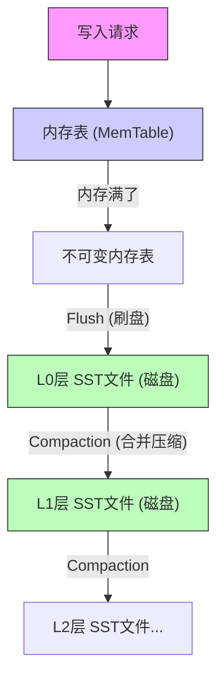
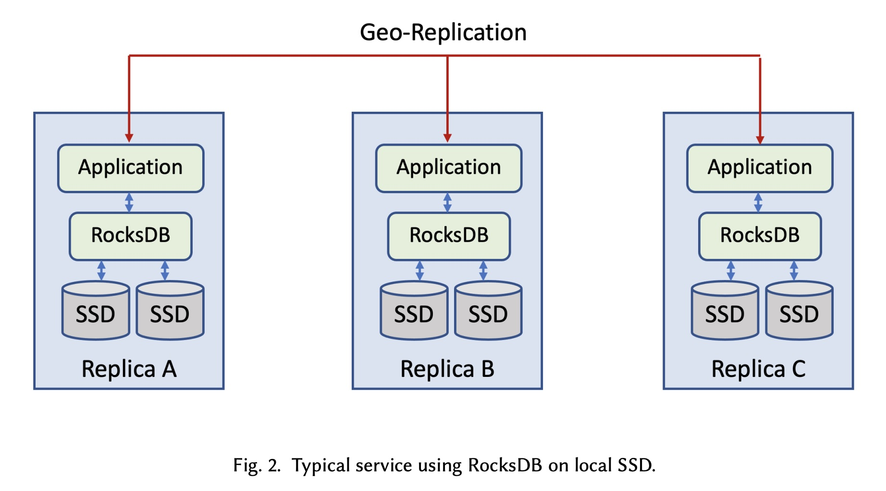
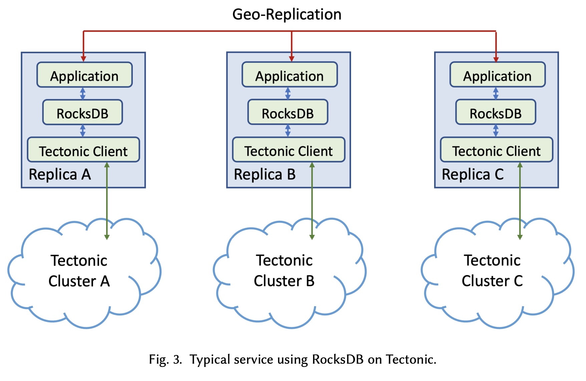
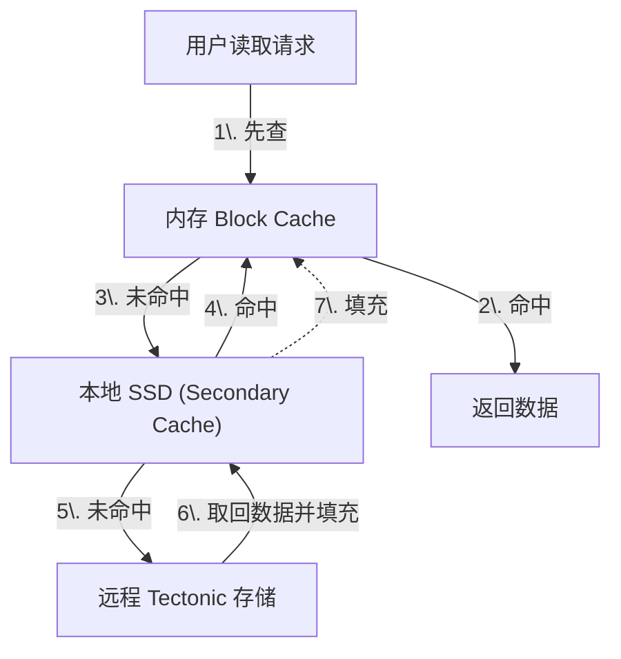
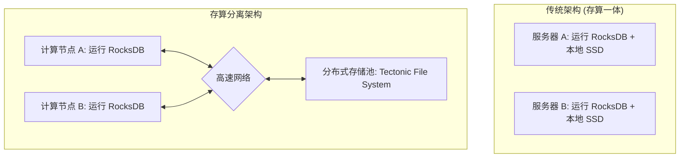
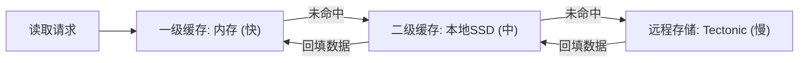

## AI论文解读 | Disaggregating RocksDB: A Production Experience
        
### 作者        
digoal        
        
### 日期        
2025-11-22        
        
### 标签        
PostgreSQL , PolarDB , DuckDB , AI , 论文解读        
        
----        
        
## 背景  
      
https://dl.acm.org/doi/pdf/10.1145/3589772        
  
提示:          
```          
读懂《Disaggregating RocksDB: A Production Experience》这篇论文需要提前掌握哪些基础知识, 请使用中文通熟易懂的讲解这些基础知识, 可以引用论文中的图、表或使用Markdown支持的图形(text,mermaid等)增加解释性. 
  
使用中文通熟易懂的解读《Disaggregating RocksDB: A Production Experience》这篇论文, 其中的关键内容请着重讲解, 可以引用论文中的图、表或使用Markdown支持的图形(text,mermaid等)增加解释性. 
  
提取《Disaggregating RocksDB: A Production Experience》这篇论文中的重要术语, 使用中文对这些术语进行通熟易懂的讲解, 可以引用论文中的图、表或使用Markdown支持的图形(text,mermaid等)增加解释性. 
```     
  
## 1 前置知识 
  
阅读这篇论文《Disaggregating RocksDB: A Production Experience》是一次深入了解现代云原生数据库架构的好机会。但这篇论文融合了**存储引擎原理**、**分布式系统架构**以及**硬件与网络特性**，确实有一定的门槛。

为了让你能轻松读懂，我将需要掌握的基础知识分为四个核心板块，并配合通俗的解释和图表。

-----

### 1\. 核心主角：LSM-Tree (日志结构合并树)

RocksDB 是基于 **LSM-Tree** 结构的。如果不理解它，你就无法理解为什么论文中反复提到“SST文件”、“Compaction（压缩）”以及“顺序写”。

  * **通俗解释**：
    传统的数据库（如使用 B+ 树的 MySQL）像是在图书馆的书架上插书，每次都要找到准确位置，这在机械硬盘或写操作频繁时很慢（随机写）。
    LSM-Tree 则像是**记账流水**。不管来什么数据，先在内存里记下来，内存满了就一次性把数据“刷”到磁盘末尾（顺序写）。随着时间推移，磁盘上的旧账本越来越多，系统会在后台把这些旧账本合并、清理（这就叫 **Compaction**），变成整齐的新账本。

  * **论文中的关联**：
    论文提到 Tectonic 文件系统是“Append-only”（仅追加写入）的 ，这正是 LSM-Tree 的天作之合，因为 LSM-Tree 生成的 SST 文件写完后就是不可变的（Immutable） 。

  * **核心流程图解 (Mermaid)**：




-----

### 2\. 架构演变：存算分离 (Disaggregated Storage)

这是论文的核心背景。你需要理解“本地存储”和“存算分离”的区别。

  * **通俗解释**：

      * **本地存储 (Local Storage)**：就像你的个人电脑，CPU（计算）和硬盘（存储）都装在一个机箱里。优点是读取快，缺点是如果你的硬盘满了但 CPU 很空闲，你也只能整机升级，很浪费。
      * **存算分离 (Disaggregated)**：就像你用网吧的电脑（计算节点）打游戏，但游戏存档都在云端网盘（存储集群）里。你可以随时换一台电脑（计算扩容），存档还在。虽然中间隔了网络（速度稍慢），但资源分配更灵活。

  * **图解对比 (引用论文插图)**：
    论文中的 **Figure 2** 和 **Figure 3** 非常直观地展示了这个变化 。      

| 架构模式 | 对应论文图示 | 特点 | 痛点/挑战 |
| :--- | :--- | :--- | :--- |
| **本地 SSD** | **Figure 2**  | RocksDB 直接读写本机 SSD。 | 资源浪费（CPU和磁盘无法独立扩容）。 |
| **存算分离** | **Figure 3**  | RocksDB 通过网络读写远程 Tectonic 集群。 | 网络延迟增加 ，由于多个节点可访问同一文件，需要处理多写冲突 。 |

-----

### 3\. 分布式文件系统 (DFS) 与数据编码

RocksDB 搬家到了 Tectonic（Meta 的分布式文件系统），你需要了解数据在分布式环境下是如何存放的。

  * **基础概念**：

      * **Replication (多副本)**：为了防止数据丢失，把一份数据拷贝 3 份（R3）。优点是恢复快，缺点是太占空间（200%的额外开销）。
      * **Erasure Coding (纠删码/EC)**：类似 RAID 技术。把数据切块并计算出校验块。比如 `[12, 8]` 编码，意思是 8 份数据块生成 4 份校验块。只要这 12 块里任意丢失不超过 4 块，数据都能找回。优点是省空间（比如只多占 50%），缺点是计算量大，读取稍慢。

  * **论文中的应用**：
    论文提到，对于体积大的 SST 文件，他们使用 **EC编码 [12, 8]** 来省钱 ；对于主要用于故障恢复的 WAL（预写日志），因为要求写入极快，他们依然使用 **3副本或5副本 (Replication)** 。

-----

### 4\. 性能指标：P99 延迟与长尾效应 (Tail Latency)

在本地磁盘上，读写速度很稳定。但在网络存储中，“长尾”是最大的敌人。

  * **通俗解释**：
    假设你要从远程读取数据，这需要经过 10 个网络节点。如果其中 9 个节点只要 1 毫秒，但第 10 个节点卡住了用了 100 毫秒。

      * **平均延迟**：看起来还行。
      * **P99 延迟**：指的是“最慢的那 1% 的请求”。在分布式系统中，P99 往往决定了用户的真实体验。

  * **论文中的对策**：
    论文花了很大篇幅讲如何解决这个问题，比如 **"Hedged Reads" (对冲读)** 。

      * *比喻*：你要去买奶茶，怕排队太慢，于是同时派了两个人去两家不同的分店买。谁先买到就用谁的，另一个人的取消。这样虽然浪费了一点资源，但能保证你最快喝到奶茶。

-----

### 总结：读论文前的“小抄”

在开始阅读前，请心中带着这三个问题，会让你事半功倍：

1.  **挑战是什么？** 从本地 SSD 搬到远程网络存储，RocksDB 变慢了（延迟高），该怎么办？(答案在论文 §4.1)
2.  **数据安全吗？** 如果计算节点挂了，或者存储节点坏了，数据怎么不丢？(答案在论文 §4.2 和 §4.3)
3.  **如何优化？** 既然远程读取慢，能不能在本地加一层缓存？(答案在论文 §4.1.3 关于 Secondary Cache)

建议你现在可以从论文的 **Introduction (第一章)** 和 **Architecture Overview (第三章)** 开始阅读，遇到具体技术细节再回头参考上面的知识点。
  
## 2 解读论文 
  
这篇论文《Disaggregating RocksDB: A Production Experience》分享了 Meta（Facebook）在生产环境中进行的一项重大架构改造： **将 RocksDB 从本地 SSD 迁移到分布式存储系统（存算分离架构）** 。

简单来说，以前数据库和硬盘是“绑”在一起的（存算一体），现在他们把硬盘“拆”到了云端（存算分离），并解决了一路上遇到的各种坑。

以下是对这篇论文的通俗解读。

-----

### 一、 为什么要折腾？（背景与动机）

在改造之前，Meta 的典型架构是 **RocksDB 直接运行在服务器的本地 SSD 上**。虽然这样速度很快，但有两个大问题：

1.  **资源浪费（不均匀）** ：有的服务 CPU 用满了但磁盘是空的；有的服务磁盘塞满了但 CPU 很闲。因为 CPU 和磁盘绑在一台物理机上，没法单独扩容 。
2.  **运维痛苦** ：如果一台机器坏了，数据就暂时不可用了，必须把数据复制到新机器上才能恢复，这需要很长时间 。

**目标架构（存算分离）：**
Meta 决定把数据存到他们自研的分布式文件系统 **Tectonic** 上。这样，计算节点（跑 RocksDB 的服务器）和存储节点（Tectonic 集群）就可以分开扩容了 。

> **为什么 RocksDB 适合这么做？**
> RocksDB 基于 **LSM-Tree** 结构，它的特点是生成的 SST 数据文件一旦写完就 **不再修改（Immutable）** ，只进行追加写（Append-only）。这天然契合分布式文件系统（通常不喜欢随机修改文件中间的内容）的特性 。

-----

### 二、 核心挑战与解决方案

把本地磁盘换成网络存储，最直接的后果就是**变慢了**。论文的核心篇幅都在讲如何解决“变慢”以及“变贵”的问题。

#### 1\. 性能挑战：如何对抗网络延迟？

网络 I/O 比本地 PCIe SSD 慢得多，尤其是长尾延迟（偶尔几个请求特别慢）。

**解决方案 A：二级缓存 (Secondary Cache)** 
既然远程读慢，那就把本地磁盘利用起来做缓存。

  * **L1 缓存**：内存（DRAM），速度最快。
  * **L2 缓存**：本地 Flash/SSD。
  * **存储层**：远程 Tectonic 文件系统。

当内存放不下时，数据会被淘汰到本地 SSD，而不是直接丢弃。这样下次读这块数据时，就不需要走网络了。**效果：ZippyDB 的读延迟降低了 30-40%** 。



**解决方案 B：并行 I/O (Parallel I/O)** 
以前读取多个 Key（`MultiGet`），是串行的：读 Key1 -\> 等待 -\> 读 Key2。在本地磁盘上这很快，但在网络上，等待时间累积起来很可怕。
优化后：**同时**发出 Key1, Key2, Key3 的请求。虽然 CPU 消耗稍微增加了一点，但总耗时大大缩短。

**解决方案 C：对冲读 (Hedged Reads)** 
分布式系统里总有几台机器比较慢。如果 RocksDB 发现某个请求超时没回来，它会**立刻向另一个存储副本发起同样的请求**，谁先回来用谁的。

#### 2\. 成本挑战：如何既省钱又安全？

分布式存储为了不丢数据，通常存 3 份（3 Replicas），这意味着 1TB 数据要占 3TB 空间，太贵了 。

**解决方案：区分对待** 

  * **大文件（SST 文件）** ：这是占用空间最大的部分。使用 **纠删码 (Erasure Coding, [12, 8])** 。把数据切分，只增加 **1.5倍** 的空间开销，就能容忍 4 台机器同时挂掉。
  * **小日志（WAL 文件）** ：这是为了救急用的，写入频繁且要求低延迟。依然使用 **3副本或 5副本** 模式，保证写入速度。

#### 3\. 数据一致性挑战：防止“脑裂”

在存算分离架构下，如果计算节点 A 挂了，系统会启动节点 B 接管。但如果 A 只是网络卡顿，其实没死，它突然醒来继续写数据，就会覆盖 B 写的数据，导致数据库损坏 。

**解决方案：I/O 栅栏 (IO Fencing)** 
类似于“令牌”机制。

1.  每个计算节点操作目录前，必须获得一个版本号（Token）。
2.  存储系统只认**版本号最大**的那个人的写入。
3.  如果旧节点 A 试图写入，Tectonic 会发现它的 Token 过期了，直接拒绝。

-----

### 三、 实战效果：ZippyDB 案例

Meta 内部的键值存储服务 ZippyDB 全面采用了这套架构。论文给出了非常诚实的对比数据 ：

| 指标 | 本地 SSD 方案 | 存算分离 (RocksDB on Tectonic) | 评价 |
| :--- | :--- | :--- | :--- |
| **空间利用率** | 35% | **75%** | **巨大提升**：不再需要为每个节点预留大量缓冲空间 。 |
| **故障恢复时间** | 51 分钟 | **49 秒** | **质的飞跃**：因为数据在云端，新节点启动只需“挂载”数据，不需要拷贝几百GB的数据 。 |
| **可用性** | 99.99993% | **99.99999%** | 提升了一个数量级 。 |
| **P99 读延迟** | 较低 | 稍高 | 这是一个妥协（Trade-off），但大部分业务可以接受 。 |

### 四、 总结与启示

这篇论文最核心的价值在于它证明了 **RocksDB 这种本来为本地磁盘设计的引擎，在经过适当改造后，完全可以适应云原生存储**。

**关键收获：**

1.  **存算分离是趋势**：虽然牺牲了一点点单次请求的延迟，但换来了极大的资源效率和运维灵活性。
2.  **不仅是换个盘**：不能只是简单地把文件写到网络磁盘，需要配合 **二级缓存**、**并行 I/O** 和 **智能的重试策略** 才能在生产环境中抗住流量。
3.  **LSM-Tree 的胜利**：追加写的特性使其成为分布式存储的最佳拍档。
  
## 3 术语 
  
这篇论文《Disaggregating RocksDB: A Production Experience》中涉及许多数据库和分布式系统的专业术语。为了帮助你更好地理解，我将这些关键术语提取出来，并配合通俗的解释和图解进行讲解。

-----

### 1\. 核心架构类术语

#### **存算分离 (Disaggregated Storage / Compute-Storage Disaggregation)**

  * **定义**：这是一种架构模式，指将“计算资源”（CPU、内存）和“存储资源”（硬盘数据）物理上分开，通过网络进行连接 。
  * **通俗解释**：
      * **过去（存算一体）** ：就像你的笔记本电脑，CPU 和硬盘都在一个机壳里。如果硬盘满了但 CPU 很闲，你没法只买个硬盘塞进去（受限于插槽），只能换台新电脑，很浪费 。
      * **现在（存算分离）** ：就像你去网吧打游戏。你用的是网吧的电脑（计算节点），但你的游戏存档保存在云盘里（存储节点）。你可以随时换一台电脑接着玩，云盘容量也可以独立扩容 。
  * **架构对比图**：




#### **Tectonic File System**

  * **定义**：Meta 内部的大规模分布式文件系统，支持“仅追加写入”（Append-only）。
  * **通俗解释**：这是 Meta 的“云硬盘”。它把成千上万块硬盘组合成一个巨大的存储池。RocksDB 不再把数据写在本地硬盘，而是写给 Tectonic，由 Tectonic 负责把数据打散存到不同的机柜里以保证安全 。

-----

### 2\. 数据结构与存储类术语

#### **LSM-Tree (Log-Structured Merge-tree)**

  * **定义**：RocksDB 的核心数据结构。它的特点是数据写入时先在内存缓存，然后“顺序追加”写入磁盘，生成的磁盘文件是不可修改的 。
  * **通俗解释**：
      * **传统数据库（B+树）** ：像在图书馆插书，新书来了要找到准确的位置插进去，经常需要挪动其他书（随机写），比较慢。
      * **LSM-Tree** ：像记流水账。新数据来了，直接写在当天的账本末尾（顺序写）。以前写好的旧账本（SST文件）封存不动。这非常适合分布式存储，因为分布式系统最怕回头去修改文件中间的内容 。

#### **SST (Sorted String Table)**

  * **定义**：RocksDB 在磁盘上存储数据的基本文件格式。文件内部是有序的，且一旦生成就不可变（Immutable）。
  * **通俗解释**：这是数据的“封存箱”。当内存里的数据攒够了，就会被打包成一个 SST 文件存到 Tectonic 上。因为它是不可变的，多个计算节点同时读取它也不会打架，非常安全 。

#### **WAL (Write Ahead Log)**

  * **定义**：预写日志。数据在写入内存表（MemTable）的同时，会先追加写到 WAL 文件中 。
  * **通俗解释**：这是“救命草稿”。如果服务器突然断电，内存里的数据就丢了。但因为我们在操作前先把步骤记在了 WAL 这个草稿本上，重启后可以照着草稿本把数据恢复出来。

-----

### 3\. 性能与优化类术语

#### **Secondary Cache (二级缓存)**

  * **定义**：在存算分离架构中，引入本地 Flash/SSD 作为第二层缓存，位于内存缓存（Block Cache）和远程存储（Tectonic）之间 。
  * **通俗解释**：
      * **问题**：从远程 Tectonic 拿数据要走网络，比读本地硬盘慢 。
      * **解决**：在计算节点的本地硬盘上开辟一块空间做缓存。内存里放不下的冷数据，先别扔，放到本地硬盘里。下次再用时，直接从本地硬盘读，就不用走网络了。
      * **效果**：ZippyDB 的读延迟因此降低了 30-40% 。




#### **Compaction (压缩/合并)**

  * **定义**：RocksDB 的后台维护过程，将多个小的、旧的 SST 文件合并成新的 SST 文件，并清理已删除或覆盖的数据 。
  * **通俗解释**：因为 LSM-Tree 是“记流水账”，如果你把 `Key=A` 的值改了 10 次，磁盘上就会有 10 条记录。Compaction 就像“年底对账”，把这 10 条记录合并成最后那 1 条正确的，把旧的垃圾清理掉，节省空间并提高查询速度。

-----

### 4\. 一致性与可靠性类术语

#### **IO Fencing (IO 栅栏/隔离)**

  * **定义**：一种并发控制机制，确保在故障转移（Failover）时，旧的计算节点无法再修改数据 。
  * **通俗解释**：
      * **场景**：节点 A 坏了，节点 B 接管了它的数据目录。突然节点 A 又“诈尸”醒了，试图写数据，这会把 B 写的数据搞乱 。
      * **解决**：引入“令牌”机制。
        1.  节点 B 接管时，向 Tectonic 申请一个更新的令牌（比如版本号 2）。
        2.  Tectonic 记录下“当前最大令牌是 2”。
        3.  节点 A（拿着旧令牌 1）试图写入时，Tectonic 发现它的令牌过期了，直接拒绝。这就像给数据加了一道栅栏，挡住了旧节点 。

#### **Erasure Coding (纠删码) vs. Replication (多副本)**

  * **定义**：Tectonic 提供的两种数据冗余保护方式 。
  * **对比讲解**：
      * **Replication (多副本)**：数据存 3 份（R3）或 5 份（R5）。
          * *优点*：读写快，逻辑简单。
          * *缺点*：太占空间（存 1TB 数据要占 3TB 磁盘）。
          * *论文应用*：用于 **WAL 日志**，因为日志小但要求写入极快 。
      * **Erasure Coding (纠删码)**：类似 RAID 技术。比如 `[12, 8]` 编码，将数据切块并计算校验块。
          * *优点*：省空间（只多占 1.5 倍空间）。
          * *缺点*：计算复杂，写入稍慢。
          * *论文应用*：用于 **SST 数据文件**，因为它们体积大且写完不改，省空间最重要 。
  
## 参考        
         
https://dl.acm.org/doi/pdf/10.1145/3589772    
        
<b> 以上内容基于DeepSeek、Qwen、Gemini及诸多AI生成, 轻微人工调整, 感谢杭州深度求索人工智能、阿里云、Google等公司. </b>        
        
<b> AI 生成的内容请自行辨别正确性, 当然也多了些许踩坑的乐趣, 毕竟冒险是每个男人的天性.  </b>        
  
    
#### [PolarDB 学习图谱](https://www.aliyun.com/database/openpolardb/activity "8642f60e04ed0c814bf9cb9677976bd4")
  
  
#### [PostgreSQL 解决方案集合](../201706/20170601_02.md "40cff096e9ed7122c512b35d8561d9c8")
  
  
#### [德哥 / digoal's Github - 公益是一辈子的事.](https://github.com/digoal/blog/blob/master/README.md "22709685feb7cab07d30f30387f0a9ae")
  
  
#### [About 德哥](https://github.com/digoal/blog/blob/master/me/readme.md "a37735981e7704886ffd590565582dd0")
  
  

  
