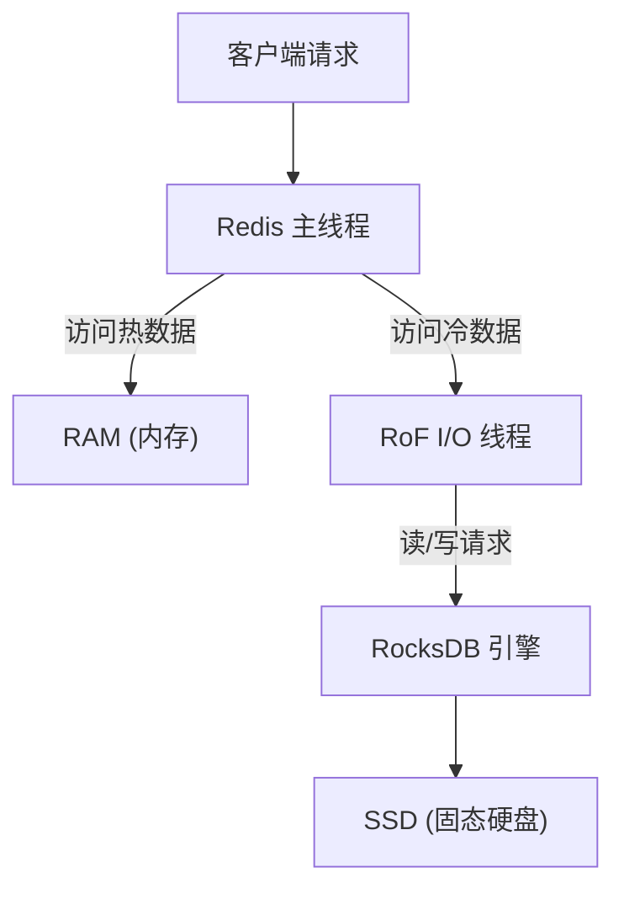
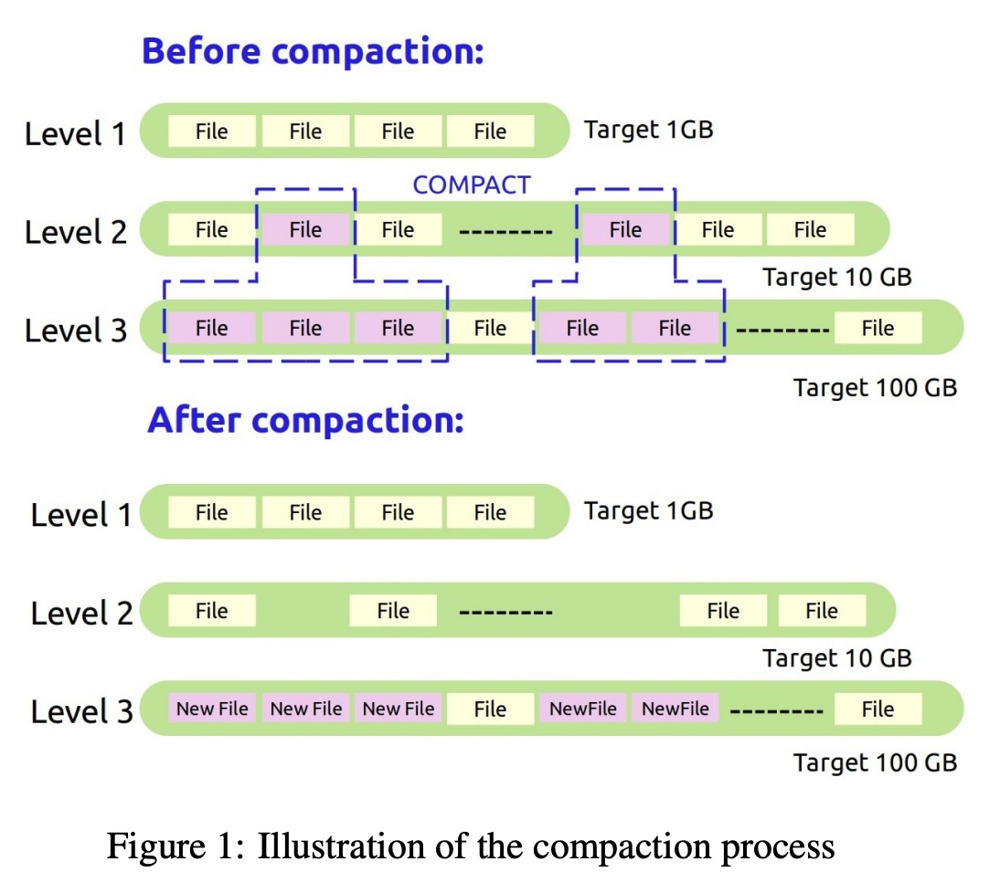
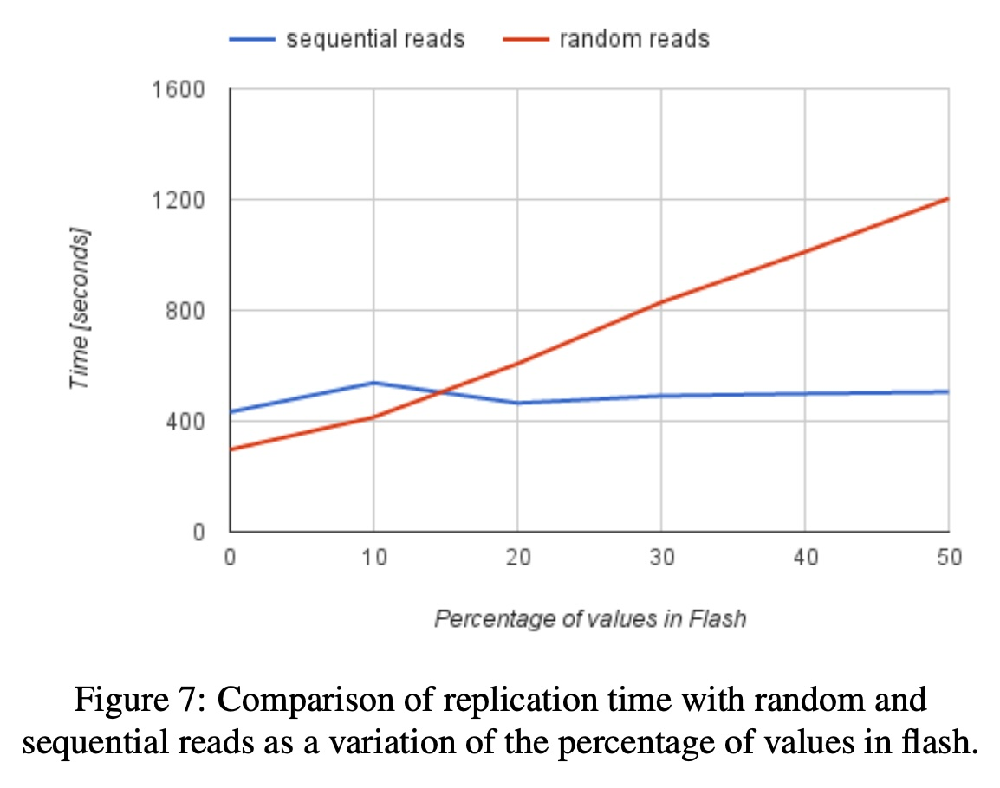
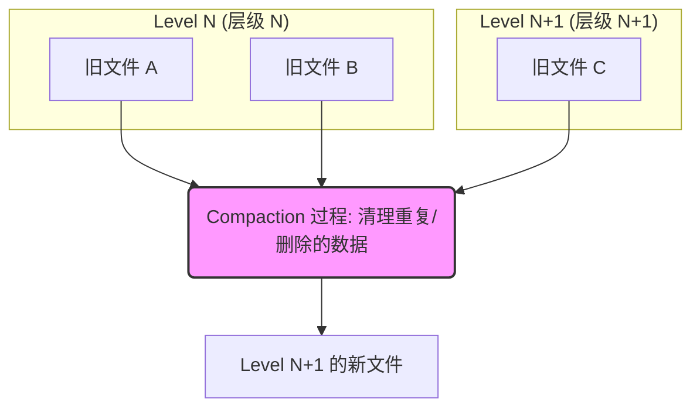

## AI论文解读 | Optimization of RocksDB for Redis on Flash
        
### 作者        
digoal        
        
### 日期        
2025-11-22        
        
### 标签        
PostgreSQL , PolarDB , DuckDB , AI , 论文解读        
        
----        
        
## 背景  
      
https://www.kereno.com/rocksdb-rof.pdf        
  
提示:          
```          
读懂《Optimization of RocksDB for Redis on Flash》这篇论文需要提前掌握哪些基础知识, 请使用中文通熟易懂的讲解这些基础知识, 可以引用论文中的图、表或使用Markdown支持的图形(text,mermaid等)增加解释性. 
  
使用中文通熟易懂的解读《Optimization of RocksDB for Redis on Flash》这篇论文, 其中的关键内容请着重讲解, 可以引用论文中的图、表或使用Markdown支持的图形(text,mermaid等)增加解释性. 
  
提取《Optimization of RocksDB for Redis on Flash》这篇论文中的重要术语, 使用中文对这些术语进行通熟易懂的讲解, 可以引用论文中的图、表或使用Markdown支持的图形(text,mermaid等)增加解释性. 
```     
  
## 1 前置知识 
  
阅读这篇论文《Optimization of RocksDB for Redis on Flash》前，你需要建立一个关于 **分层存储架构** 和 **LSM-Tree（日志结构合并树）** 的思维模型。

为了让你更轻松地读懂这篇论文，我将这些基础知识拆解为四个核心板块，并结合论文中的概念进行通俗讲解。

-----

### 1\. Redis 与 Redis on Flash (RoF) 的架构区别

**基础概念：**
通常我们熟知的 **Redis** 是一个纯内存（In-Memory）数据库，它的所有数据都在 DRAM（内存）里，速度极快但成本高且容量有限 。

**本文的核心背景 —— Redis on Flash (RoF)：**
这篇论文讨论的是一个商业化变体，叫 **Redis on Flash**。它的核心思想是 **“冷热数据分离”** ：

  * **热数据 (Hot Values)：** 经常被访问的数据，依然保存在 **RAM** 中，保持极速。
  * **冷数据 (Cold Values)：** 不常访问的数据，被挤出内存，存放到 **SSD (Flash)** 中。
  * **管理员：** 负责管理这些冷数据读写的引擎，就是 **RocksDB** 。

**图解 RoF 工作流：**



**为什么需要懂这个？**
论文中提到调整 `Redis IO threads`  和 `One writer` ，是因为当 Redis 需要去 SSD 读数据时，不能让主线程卡住（Redis 是单线程模型），所以必须有专门的 "跑腿小弟"（I/O 线程）去和 RocksDB 对接 。

-----

### 2\. RocksDB 的核心心脏：LSM-Tree

RocksDB 不是像传统数据库那样把数据直接改写在原来的位置，而是基于 **LSM-Tree (Log-Structured Merge Tree)** 结构的。这是读懂论文中“Compaction（压缩/合并）”、“Level（层级）”等术语的关键。

#### (1) 写入流程：从内存到磁盘

  * **Memtable (内存表)：** 所有新的写入首先进入内存中的 Memtable。这就好比你在草稿纸上快速记录。
  * **Immutable Memtable：** 写满后，这张草稿纸变成“只读”状态。
  * **Flush (刷盘)：** 只读的草稿纸被写入磁盘，变成一个 **SST 文件** (Sorted Static Table)。SST 文件一旦生成，就**永远不会被修改**（Immutable） 。

#### (2) SST 文件与分层 (Levels)

RocksDB 把磁盘上的文件分成不同的层级（Level 0 到 Level N）：

  * **Level 0 (L0)：** 这里是内存刚刚刷下来的数据，也是最新的数据。
  * **Level 1, 2, 3...：** 随着数据变老、变多，它们会被推到更深的层级。每一层的容量通常是上一层的 10 倍 。

#### (3) Compaction (压缩/合并) —— 论文优化的重头戏

因为文件是“只读”的，如果你要删除或更新一个 Key，RocksDB 不会去改老文件，而是写一条新记录。这会导致磁盘上有同一个 Key 的多个版本（比如“旧值”和“新值”）。

**Compaction** 就是后台的清洁工。它把上层（Level N）的文件和下层（Level N+1）的文件合并，丢弃旧版本和已删除的数据，整理成新的有序文件。

**引用论文图解 (Figure 1 重绘)：**    
论文中的 Figure 1 展示了 Level 2 的文件如何与 Level 3 的文件合并，生成新的 Level 3 文件 。

```text
[合并前]
Level 2:  [File A] [File B (包含 Key 1-100)] ...
Level 3:  [File X (包含 Key 50-150)] ...

       ⬇️ 触发 Compaction (合并) ⬇️

[合并后]
Level 2:  (File B 被清理掉)
Level 3:  [New File Y (包含 Key 1-150, 去除了重复和删除的)]
```

**为什么需要懂这个？**
论文花了大量篇幅讨论 `compaction threads` (合并线程数)  和 `level0_slowdown` (L0层文件太多时减速) 。如果你不懂 Compaction，就无法理解为什么文件多了会阻塞写入，或者为什么由于 Compaction 导致的 "Write Stall" (写入停顿) 会造成性能波动 。

-----

### 3\. 三大“放大因子” (Amplification Factors)

评估存储引擎好坏，不能只看读写速度，还要看它为了维持结构付出了多少“额外代价”。论文明确提到了这三个指标 。

  * **写放大 (Write Amplification)：**
      * *含义：* 你明明只写了 1MB 数据，但因为 RocksDB 后台不断地进行 Compaction（搬运、重写数据），最终磁盘可能实际写了 10MB。
      * *论文关联：* 
  * **读放大 (Read Amplification)：**
      * *含义：* 你想读 1 个 Key，但系统可能要去查找 Level 0, Level 1, Level 2... 中的多个文件才能找到它。读的文件越多，读放大越严重。
      * *论文关联：* 
  * **空间放大 (Space Amplification)：**
      * *含义：* 数据库实际存储的数据是 50GB，但因为旧版本的数据还没来得及被 Compaction 清理掉，占用了 100GB 的磁盘空间。
      * *论文关联：* 

**为什么需要懂这个？**
论文中提到调整 `block_size`（块大小）时，提到增加块大小会减少内存占用，但会增加“读放大”，因为为了读一个小数据必须加载更大的块 。这是一种典型的工程权衡（Trade-off）。

-----

### 4\. 布隆过滤器 (Bloom Filters)

RocksDB 如何快速知道一个 Key 是否在某个 SST 文件里，而不用把整个文件读一遍？答案是 **Bloom Filters**。

  * **原理：** 它是一个极其节省空间的概率型数据结构。
      * 它如果说“Key 不在文件里”，那**一定不在**（可以直接跳过这个文件）。
      * 它如果说“Key 在文件里”，那**可能在，也可能不在**（需要去读文件确认）。
  * **论文优化点：**
    通常每一层文件都有 Bloom Filter。但论文提到一个优化 `optimize_filters_for_hits` 。
      * *解释：* 在 RoF 场景下，Redis 知道哪些 Key 在磁盘上。如果请求打到 RocksDB，说明 Key **肯定存在**。因此，对于最底层的那些文件，也许不需要再去查 Bloom Filter 来判断“存不存在”了，这样可以节省操作。

-----

### 总结：读论文时的速查清单

当你读到以下术语时，请回想对应的解释：

1.  **Replication (主从复制)：** 论文的主要测试场景。指的是把 Master 的数据全量拷贝给 Slave 的过程。因为涉及大量读写，所以是测试性能的最佳场景 。
2.  **SATA vs NVMe：** 硬件基础知识。NVMe SSD 比 SATA SSD 快得多，并行度更高。论文在后半部分对比了这两种硬件的调优区别 。
3.  **WAL (Write-Ahead-Logging)：** 预写日志。通常为了防止断电丢数据，写内存前要先写 Log。但在 RoF 中，因为 Redis 层面已有保障，或者数据本身是冷数据，论文提到禁用了 WAL 以提升性能 。

掌握了这些，你就能明白作者为什么要疯狂调整“线程数”、“触发合并的文件数”以及“RAID 块大小”了——本质上都是为了让 RocksDB 这个“大管家”在 SSD 上跑得更顺畅，减少不必要的排队和打扫卫生时间。
  
## 2 解读论文 
  
这是一篇非常实用的工程实践论文，讲述了 Redis Labs 团队如何通过调优 **RocksDB**（作为存储引擎），将 **Redis on Flash (RoF)** 的数据库复制时间从 **212分钟缩短到18分钟**，性能提升了 **11倍** 。

以下是这篇论文的通俗解读。

-----

### 1\. 背景：当 Redis 遇上 Flash (SSD)

**Redis on Flash (RoF) 是什么？**
普通的 Redis 把所有数据都放在内存（RAM）里，虽然快但太贵且容量有限。RoF 采用了“冷热分离”的策略：

  * **热数据**：留在内存里（RAM）。
  * **冷数据**：被挤到 SSD（闪存）里，由 **RocksDB** 负责管理 。

**遇到的问题：**
RocksDB 虽然强，但如果不调优，性能很难看。在默认配置下，复制一个 50GB 的数据库（主从复制）竟然需要 **3.5小时**（212分钟），这在生产环境中是不可接受的 。

**目标：**
将这个复制时间压缩到 **30分钟以内**，同时不能影响正常的读写性能 。

-----

### 2\. 核心优化：到底改了什么？(干货部分)

作者在 AWS (EC2) 和 Google Cloud (GCE) 上做了大量实验，总结出了一套“组合拳”。

#### (1) 加大“清洁工”的人手 (Compaction Threads)

  * **原理：** RocksDB 写入数据时，会产生很多层级的文件（SST Files）。后台需要不断把这些文件合并、整理（这个过程叫 Compaction）。如果合并得太慢，写入就会被堵住。
  * **调整：** 默认只有 8 个后台线程在做合并，作者将其暴力提升到 **64 个线程** 。
  * **效果：** 性能提升了 **24%** 。
  * **图解：**
    ```mermaid
    graph LR
    A[大量写入请求] --> B{Compaction 线程池}
    B -- "8个线程 (默认)" --> C[处理不过来, 堵塞]
    B -- "64个线程 (优化)" --> D[处理顺畅, 吞吐量大增]
    ```

#### (2) 拒绝“急刹车” (Stabilizing Throughput)

  * **现象：** 在默认配置下，系统的吞吐量像过山车一样。因为当 Level 0 的文件积压到一定数量（默认12个）时，RocksDB 会触发“减速（Slowdown）”甚至“停车（Stop）”来保护系统 。
  * **调整：** 调大容忍度。
      * 开始减速的阈值：`level0_slowdown_writes_trigger` 从 12 调到 **24** 。
      * 完全停车的阈值：`level0_stop_writes_trigger` 从 20 调到 **40** 。
  * **效果：** 这种“宽容”策略避免了频繁的起停，性能提升了 **10%** 。

#### (3) 开启“预读”雷达 (Compaction Readahead)

  * **原理：** 在合并文件时，需要从磁盘读旧数据。如果每次只读一点点，磁盘磁头就要乱跳。
  * **调整：** 开启 `compaction_readahead_size`，设置为 **2MB** 。
  * **效果：** 让磁盘进行更有序的大块读取，这是一个巨大的提升点，对复制时间有显著改善 。

#### (4) RAID 切片：越小越好 (Small RAID Chunks)

  * **反直觉发现：** 通常 RocksDB 官方建议在 RAID（磁盘阵列）上使用较大的切片（Stripe Size）。但作者实测发现，**切得越碎，并行度越高**。
  * **调整：** 将 RAID 的 Chunk Size 从默认的 512KB 减小到 **16KB** 。
  * **效果：** 性能提升了 **68%** 。

#### (5) 解决“多线程打架” (The "One Writer" Rule)

  * **问题：** Redis 通过多个 I/O 线程去操作 RocksDB。如果所有线程都去写，会导致锁竞争太激烈（大家都想往 Memtable 里写）。
  * **调整：** 实行“**一写多读**”策略。只分配 **1个** 专门的 I/O 线程负责写 RocksDB，其他线程只负责读 。
  * **效果：** 减少了竞争，写性能提升了 **5倍** 。

-----

### 3\. 复制策略：顺瓜摸藤 vs. 随机乱抓

在做主从复制（把数据从 Master 拷给 Slave）时，有两种读盘方式：

1.  **随机读 (Random Reads)：** 缺什么读什么。
2.  **顺序读 (Sequential Reads)：** 利用 RocksDB 的迭代器，从头到尾把整个数据库扫一遍。

**结论：**
除非你的数据绝大部分（85%以上）都在内存里，否则**顺序读（全盘扫描）永远比随机读要快** 。因为顺序读能充分利用磁盘的预读机制。

*(注：上图是对论文 Figure 7 的概念化重绘，蓝线代表顺序读，耗时稳定；红线代表随机读，随着冷数据增多，耗时直线上升)* 

  

-----

### 4\. 避坑指南：失败的尝试 (Negative Results)

论文非常诚实地列出了那些“看起来很美，实际上是个坑”的优化：

1.  **Bulk Load Mode (批量导入模式)：**

      * *尝试：* 开启这个模式可以禁掉 Compaction，写入飞快。
      * *后果：* 它是“管杀不管埋”。虽然写得快，但数据杂乱无章，导致后续的**读性能**极其低下。为了恢复读性能，需要手动触发一次全量 Compaction，结果耗时比省下的时间还长。**放弃。** 

2.  **加大 Block Size：**

      * *尝试：* 把存储块大小从 4KB 加到 16KB，为了减少索引占用的内存。
      * *后果：* 虽然写入快了 60%，但读性能下降了。因为为了读一个小数据，必须加载一个更大的块（读放大），得不偿失。**放弃。** 

-----

### 5\. 总结：最终战果

通过上述一系列调整（尤其是增加并发线程、调小 RAID 切片、开启预读），作者达成了惊人的效果：

| 平台 | 硬盘类型 | 优化前耗时 | 优化后耗时 | 提升倍数 |
| :--- | :--- | :--- | :--- | :--- |
| **AWS EC2** | SATA SSD | 212 分钟 | **18 分钟** | **\~11倍** |
| **Google GCE** | NVMe SSD | (未提及基线) | **12 分钟 50秒** | **极速** |


**一句话总结：**
调优 RocksDB 就像治理交通。你需要拓宽道路（RAID 优化），增加交警（线程数），理顺红绿灯（减少 Stop/Start），并保证车流尽量走直线（顺序读/预读），而不是让车乱钻胡同（随机读）。
  
## 3 术语 
  
这篇论文《Optimization of RocksDB for Redis on Flash》充满了存储领域的专业术语。为了让你彻底理解 Redis Labs 是如何把性能提升 11 倍的，我提取了其中的核心术语，并用通俗的语言配合图解进行讲解。

-----

### 1\. 核心架构术语

#### **Redis on Flash (RoF)**

  * **通俗解释：** 这是一个给 Redis "扩容"的技术。普通的 Redis 把所有数据都放在昂贵的内存（RAM）里。RoF 则是把数据分成两类：
      * **热数据 (Hot Values)：** 经常用的，依然放在内存里，保持极速 。
      * **冷数据 (Cold Values)：** 不常用的，被挤到 SSD（闪存）里 。
      * **关键点：** 它用 **RocksDB** 作为管理员来管理 SSD 上的数据 。

#### **RocksDB**

  * **通俗解释：** 这是一个专门为快速存储（特别是 SSD）设计的数据库引擎 。在 RoF 架构中，它就是那个负责在底层硬盘上读写数据的“苦力”。它的特点是写入速度极快，但配置非常复杂，有一百多个参数可以调 。

-----

### 2\. 内部机制术语（RocksDB 的心脏）

#### **Memtable (内存表)**

  * **通俗解释：** 这是数据写入硬盘前的“第一站”。RocksDB 为了快，不会直接写硬盘，而是先把新数据写在内存里的 Memtable 中 。
  * **比喻：** 就像你在工作时，先随手记在便利贴（内存）上，等便利贴写满了，再统一整理到档案柜（硬盘）里。

#### **SST Files (Sorted Static Tables / 排序静态表)**

  * **通俗解释：** 当 Memtable（便利贴）写满后，就会被“冲刷”到硬盘上，变成 SST 文件。
  * **重要特性：** 这些文件是**不可修改**（Immutable）的 。一旦生成，就不会再动它。如果要修改数据，RocksDB 会生成一个新的 SST 文件，而不是去改旧文件。

#### **Compaction (压实 / 合并)**

  * **通俗解释：** 这是 RocksDB 最重要的“大扫除”机制。因为 SST 文件只增不改，硬盘上会有很多重复的、过期的“垃圾数据”。Compaction 负责把多个旧文件合并成新文件，丢弃无效数据，并把数据整理到下一层级 。
  * **图解 (参考论文 Figure 1)：**

  



-----

### 3\. 性能瓶颈与调优术语

#### **Write Stalls (写入停顿 / Stop-Start)**

  * **通俗解释：** 这是系统“卡死”的现象。如果写入速度太快，而后台的 Compaction（大扫除）太慢，Level 0 的文件就会堆积。为了防止撑爆，RocksDB 会强制让写入“减速”甚至“停车” 。
  * **论文中的解决：** 这种“起起停停”会导致性能像心电图一样剧烈波动（Stop-Start phenomenon）。作者通过调大触发停顿的阈值（从 20 调到 40），让系统更宽容，从而稳定了吞吐量 。

#### **Amplification Factors (放大因子)**

这是衡量 RocksDB 效率的三个“坏指标”，越低越好：

1.  **写放大 (Write Amplification)：** 你只写了 1MB 数据，但因为 Compaction 不断地搬运和重写，硬盘实际可能写了 10MB 。
2.  **读放大 (Read Amplification)：** 你只想读 1 个数据，但系统可能要去 5 个不同的文件里查找才能找到，读了很多不该读的数据 。
3.  **空间放大 (Space Amplification)：** 数据库实际只有 50GB 有用数据，但硬盘上占了 100GB，因为旧版本还没被清理掉 。

#### **Bloom Filter (布隆过滤器)**

  * **通俗解释：** 一个非常节省空间的“探测器”。它能快速告诉你：“这个 Key 肯定不在这个文件里”或者“可能在”。这样 RocksDB 就不用把整个文件读出来检查了 。
  * **论文优化：** 作者开启了 `optimize_filters_for_hits`。因为在 RoF 场景下，如果请求发给了 RocksDB，说明 Redis 已经确认数据就在磁盘上（Hits），所以不需要最底层的过滤器再去探测“在不在”，直接读就行，省了一步操作 。

#### **Readahead (预读)**

  * **通俗解释：** 当系统在做 Compaction 时，需要读旧文件。默认是一点一点读。开启 Readahead 后，系统会以此读一大块数据（比如 2MB）放到缓存里，以此减少磁盘寻道时间 。
  * **效果：** 这是一个神奇的参数，开启后复制速度直接提升了 300% 。

#### **Replication (数据库复制)**

  * **通俗解释：** 把数据从主节点（Master）拷贝到从节点（Slave）的过程，用于备份和故障恢复 。
  * **背景：** 这篇论文的所有优化目标，就是为了缩短这个过程的时间（从 212 分钟缩短到 18 分钟）。

#### **RAID Stripe/Chunk Size (磁盘阵列切片大小)**

  * **通俗解释：** 当使用多个 SSD 组成 RAID（磁盘阵列）时，数据是被切成小块（Chunk）分散存的。
  * **反直觉发现：** 官方建议切大块，但作者发现切成 **16KB 的小块** 性能最好 。因为切得越碎，多个硬盘同时工作的并行度就越高。
  
## 参考        
         
https://www.kereno.com/rocksdb-rof.pdf    
        
<b> 以上内容基于DeepSeek、Qwen、Gemini及诸多AI生成, 轻微人工调整, 感谢杭州深度求索人工智能、阿里云、Google等公司. </b>        
        
<b> AI 生成的内容请自行辨别正确性, 当然也多了些许踩坑的乐趣, 毕竟冒险是每个男人的天性.  </b>        
  
    
#### [PolarDB 学习图谱](https://www.aliyun.com/database/openpolardb/activity "8642f60e04ed0c814bf9cb9677976bd4")
  
  
#### [PostgreSQL 解决方案集合](../201706/20170601_02.md "40cff096e9ed7122c512b35d8561d9c8")
  
  
#### [德哥 / digoal's Github - 公益是一辈子的事.](https://github.com/digoal/blog/blob/master/README.md "22709685feb7cab07d30f30387f0a9ae")
  
  
#### [About 德哥](https://github.com/digoal/blog/blob/master/me/readme.md "a37735981e7704886ffd590565582dd0")
  
  

  
