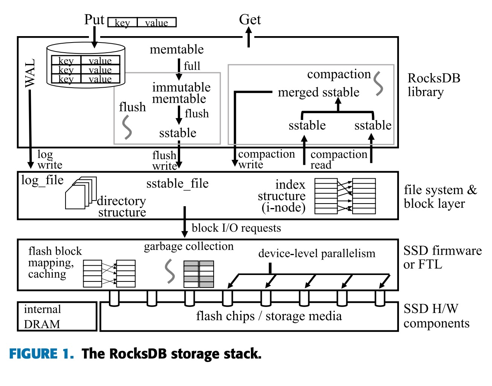
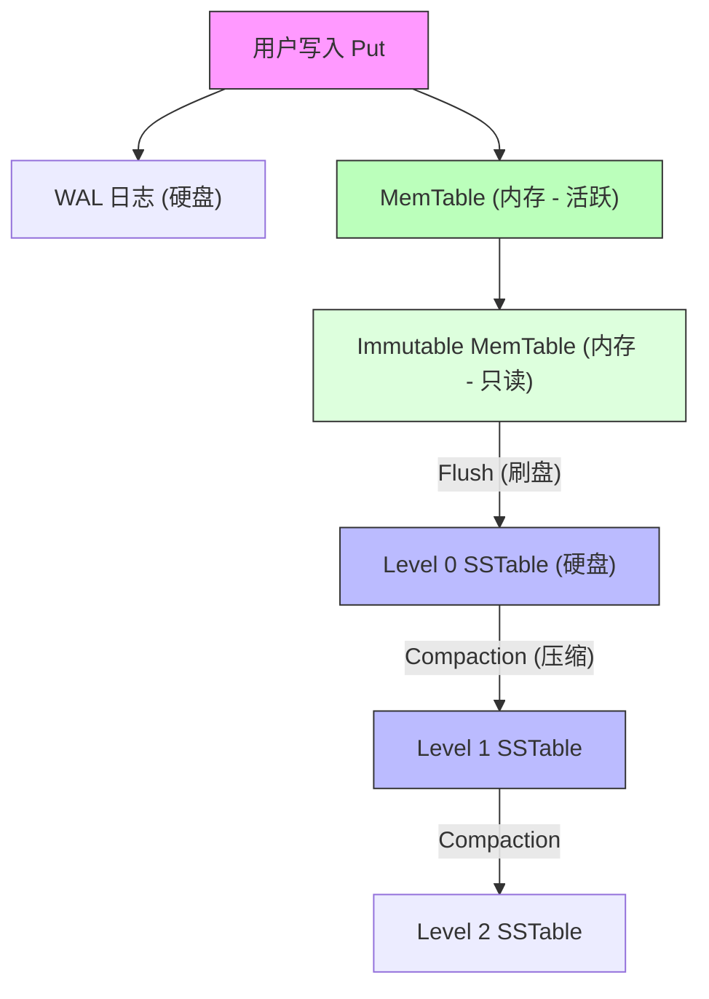
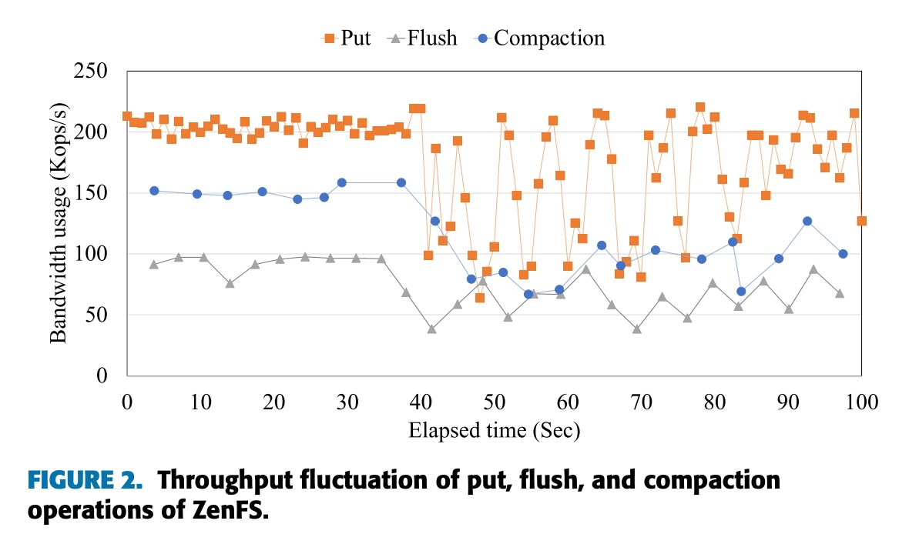
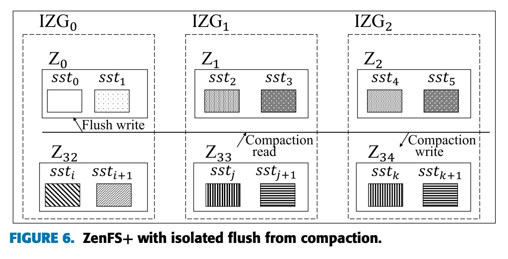
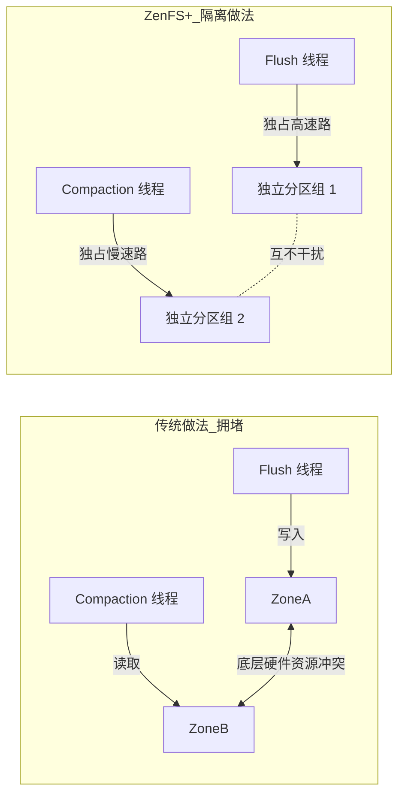
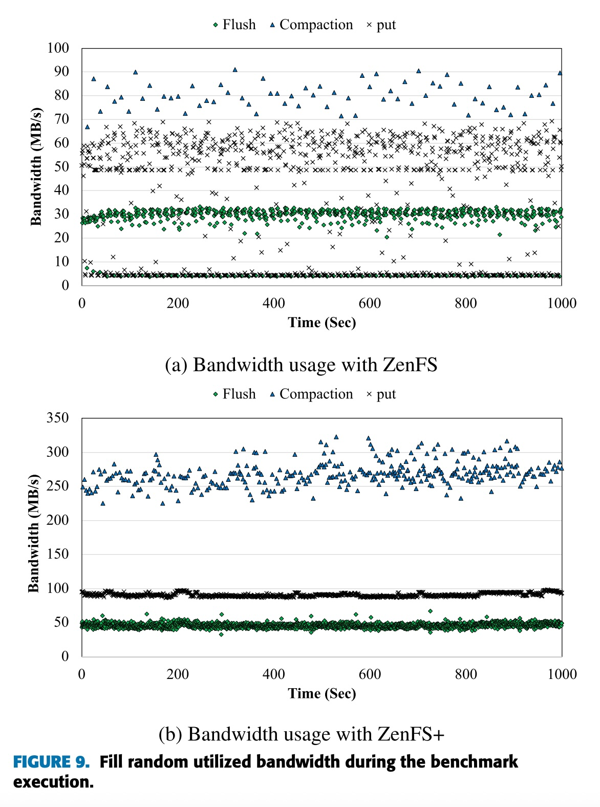
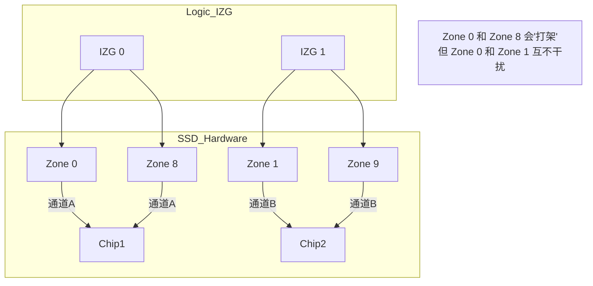
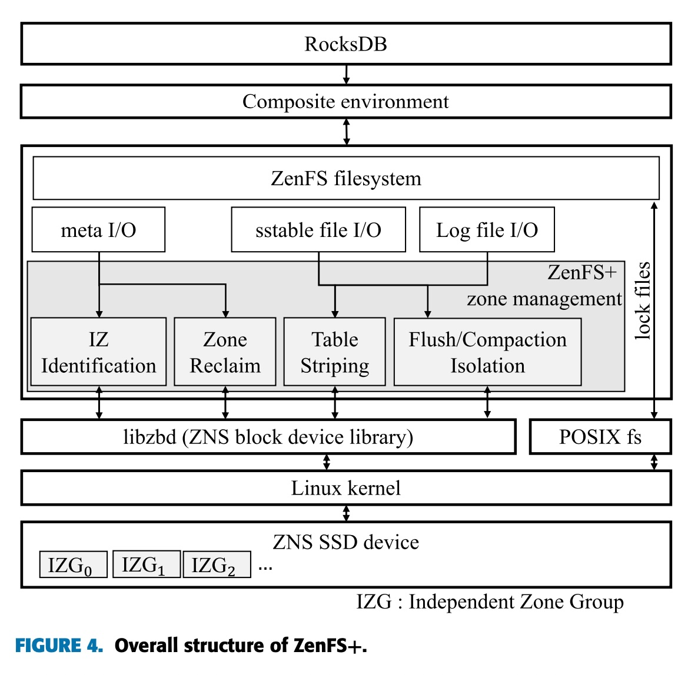

## AI论文解读 | ZenFS+: Nurturing Performance and Isolation to ZenFS
        
### 作者        
digoal        
        
### 日期        
2025-11-22        
        
### 标签        
PostgreSQL , PolarDB , DuckDB , AI , 论文解读        
        
----        
        
## 背景  
      
https://ieeexplore.ieee.org/stamp/stamp.jsp?tp=&arnumber=10070767        
  
提示:          
```          
读懂《ZenFS+: Nurturing Performance and Isolation to ZenFS》这篇论文需要提前掌握哪些基础知识, 请使用中文通熟易懂的讲解这些基础知识, 可以引用论文中的图、表或使用Markdown支持的图形(text,mermaid等)增加解释性. 
  
使用中文通熟易懂的解读《ZenFS+: Nurturing Performance and Isolation to ZenFS》这篇论文, 其中的关键内容请着重讲解, 可以引用论文中的图、表或使用Markdown支持的图形(text,mermaid等)增加解释性. 
  
提取《ZenFS+: Nurturing Performance and Isolation to ZenFS》这篇论文中的重要术语, 使用中文对这些术语进行通熟易懂的讲解, 可以引用论文中的图、表或使用Markdown支持的图形(text,mermaid等)增加解释性. 
```     
  
## 1 前置知识 
  
要深入理解《ZenFS+: Nurturing Performance and Isolation to ZenFS》这篇论文，你需要掌握三大块核心基础知识： **RocksDB 的存储引擎原理（LSM-Tree）** 、**新型存储硬件 ZNS SSD 的特性**，以及**并发控制中的“隔离性”概念**。

以下是为你整理的通俗易懂的背景知识讲解：

-----

### 1\. 核心软件：RocksDB 与 LSM-Tree (Log-Structured Merge Tree)

RocksDB 是目前最流行的键值对（Key-Value）存储引擎之一。它的核心数据结构叫 LSM-Tree。想象你在经营一个繁忙的档案室，为了写得快，你采取了以下策略：

  * **MemTable (内存表 - "临时记事本")**：
    所有新的数据写入（Put）首先都写在内存里。因为是写内存，所以速度极快。
  * **WAL (Write-Ahead Log - "流水账")**：
    为了防止断电丢失数据，写内存的同时会在硬盘上记一笔流水账。
  * **Flush (刷盘 - "归档")**：
    当内存里的“记事本”写满了，就会变成**不可变（Immutable）状态，然后被一次性顺序写入**到硬盘上，生成一个文件，叫做 **SSTable**。
      * *论文关联*：论文中多次提到 Flush 操作，这是将数据持久化到硬盘的关键步骤 。
  * **Compaction (压缩/合并 - "整理档案")**：
    随着时间推移，硬盘上的 SSTable 文件越来越多，且可能有重复或删除的数据。RocksDB 会在后台启动线程，把几个小的 SSTable 读出来，合并、排序、清理无效数据，然后写成一个新的大 SSTable。
      * *痛点*：Compaction 需要大量的读写操作，会占用硬盘带宽，这就好比“保洁阿姨在打扫卫生时挡住了正在工作的员工”，会影响正常的写入性能。

**图解 RocksDB 架构 (参考论文 Figure 1 ):**    



-----

### 2\. 核心硬件：ZNS SSD (分区命名空间固态硬盘)

这篇论文是专门针对 ZNS SSD 优化的，因此必须理解它和普通 SSD 的区别。

  * **传统 SSD (Block Interface SSD)**：
      * **黑盒管理**：软件（如 RocksDB）只管把数据发给 SSD，SSD 内部有一个复杂的“大管家”叫 **FTL (Flash Translation Layer)**。
      * **内部 GC (垃圾回收)**：SSD 不能直接覆盖写，必须先擦除再写。FTL 会自己在后台搬运数据、擦除旧块。这个过程不仅不可控，还会导致性能忽快忽慢（抖动）。
  * **ZNS SSD (Zoned Namespace SSD)**：
      * **白盒/开放式**：SSD 把管理权交给了软件。它把存储空间划分成一个个 **Zone (分区)**。
      * **顺序写入限制**：每个 Zone 必须**顺序写入**，不能随机乱写。这正好完美契合 RocksDB 的 LSM-Tree 特性（SSTable 也是顺序写的）。
      * **无内部 GC**：因为是顺序写，SSD 内部不需要做复杂的垃圾回收，性能更稳定。
      * **Small-Zone vs. Large-Zone**：
          * **Large-Zone (大分区)**：一个区很大（如 1GB），内部并发能力强，但难以隔离。
          * **Small-Zone (小分区)**：一个区很小（如 72MB），单个区的读写速度慢，但数量多，适合精细化控制。**本文特指针对 Small-Zone ZNS SSD 的优化** 。

-----

### 3\. 核心问题：性能抖动与干扰 (Interference)

理解了上面两点，就能看懂论文要解决的“核心冲突”了：

  * **场景**：RocksDB 运行时，**Flush 线程**（急着把内存数据存硬盘）和 **Compaction 线程**（后台慢慢整理数据）会同时运行。
  * **冲突**：在 ZNS SSD 上，如果 Flush 和 Compaction 恰好用到了共享同一组硬件资源（比如同一个内部通道）的 Zone，它们就会“打架”。
      * *现象*：Flush 被 Compaction 堵住了，内存里的数据存不下去，导致用户的写入（Put）被卡住。这就是论文 Figure 2  展示的性能剧烈波动。     
  * **IZG (Independent Zone Group - 独立分区组)**：
    这是论文提出的关键概念。SSD 内部有很多 Zone，有些 Zone 之间是相互独立的（就像在高速公路的不同车道），有些则是共享资源的。
      * *目标*：找出哪些 Zone 是互不干扰的，把它们分组成 IZG 。

**图解冲突与隔离 (参考论文 Figure 6 ):**    



### 4\. 关键术语速查表

在阅读论文时，你经常会看到以下术语，这里提供简单的“人话”解释：

| 术语 | 英文 | 解释 |
| :--- | :--- | :--- |
| **写放大** | Write Amplification | 你本来只想写 1MB 数据，但因为整理档案（Compaction）或垃圾回收，硬盘实际默默写了 3MB。这个倍数越小越好。 |
| **尾延迟** | Tail Latency (99.9P) | 绝大多数请求都很快，但最慢的那 0.1% 的请求有多慢？这决定了系统的“卡顿感”。论文目标是消除这些偶尔出现的剧烈卡顿 。 |
| **SSTable Striping** | Striping | **条带化**。把一个文件切碎，同时写到多个 Zone 里。就像把一份作业分给 3 个人同时抄写，速度会变快 。 |
| **垃圾回收** | Garbage Collection (GC) | 在 ZNS 中，当一个 Zone 的数据都没用了，需要把它重置（Reset）以便再次使用。这也是需要消耗时间的。 |

掌握了以上知识，你就可以顺畅地理解论文的核心逻辑：**利用 ZNS SSD 的特性，通过软件（ZenFS+）来智能调度，让 RocksDB 的“前台写”（Flush）和“后台整理”（Compaction）各行其道，互不干扰，从而实现又快又稳的性能。**
  
## 2 解读论文 
  
这份论文 **《ZenFS+: Nurturing Performance and Isolation to ZenFS》**  提出了一种针对 **RocksDB** 存储引擎的优化方案，专门用于**小区域（Small-Zone）ZNS SSD**。

简单来说，作者发现现有的 ZenFS 在处理“小区域”硬件时，无法很好地隔离后台任务（如 Flush 和 Compaction），导致性能波动。ZenFS+ 通过“更懂硬件”的调度策略，实现了**性能翻倍**和**延迟骤降**。

以下是通俗易懂的深度解读：

-----

### 1\. 背景与痛点：为什么需要 ZenFS+？

#### 1.1 RocksDB 的“内斗”问题

RocksDB 是目前最流行的大数据键值存储（Key-Value Store）。它有两个核心后台任务 ：

  * **Flush（刷盘）：** 把内存里的数据写入硬盘。
  * **Compaction（压缩）：** 整理硬盘上的数据文件，删除旧数据。

这两个任务通常是并发运行的，它们会争抢硬盘资源，导致互相干扰，造成系统卡顿 。

#### 1.2 ZNS SSD 的“虚假承诺”

ZNS（Zoned Namespace）SSD 是一种新型硬盘，它允许软件直接管理数据写入位置，理论上应该能消除干扰 。

然而，作者在测试**小区域 ZNS SSD**（Zone大小为72MB，而非通常的1GB）时发现，即使是 ZNS，性能依然剧烈波动（如下图所示）。

> **根本原因：** 硬盘内部的并行单元（Channel/Way）是共享的。虽然软件上看似在写不同的 Zone，但物理上可能挤在同一条通道上，导致“堵车” 。

*(图注：在旧的 ZenFS 中，Flush、Compaction 和用户请求互相干扰，导致带宽忽高忽低)*

-----

### 2\. 核心解决方案：ZenFS+ 的四大法宝

为了解决上述问题，ZenFS+ 引入了四个核心技术，就像给繁忙的十字路口装上了智能红绿灯和专用车道。

#### 2.1 识别“独立车道” (IZG Identification)

这是 ZenFS+ 的基础。作者设计了一种探测机制，找出哪些 Zone 在物理上是真正独立的（不共用通道）。

  * **概念：** **IZG (Independent Zone Group)**，即“独立区域组” 。
  * **原理：** 如果两个 Zone 属于不同的 IZG，它们同时读写就不会互相干扰 。

#### 2.2 任务隔离 (Flush/Compaction Isolation)

有了 IZG 信息后，ZenFS+ 强制实行“分道扬镳”策略：

  * **Flush 专用道：** 当内存数据要刷盘时，分配一个空闲的 IZG 。
  * **Compaction 避让：** 如果 Compaction 需要读写数据，它必须避开 Flush 正在使用的 IZG。如果 Flush 要用路，Compaction 必须让路 。
  * **效果：** 保证了高优先级的 Flush（直接影响写入延迟）永远畅通无阻。

*(图注：参考论文图6，Flush 和 Compaction 被分配到物理上隔离的 Zone 组中，互不干扰 )*

  

#### 2.3 数据条带化 (SSTable Striping)

为了提升速度，ZenFS+ 不再像以前那样把一个文件写在一个 Zone 里，而是把文件切分，**同时写到多个 IZG 里** 。

  * **比喻：** 就像以前只有一条管子注水，现在把文件分流，用 4-16 条管子同时注水。
  * **收益：** 极大地提升了写入带宽，充分利用了 SSD 的内部并行性 。

#### 2.4 主动垃圾回收 (Proactive GC)

旧的 ZenFS 没有垃圾回收机制，直到空间耗尽才被动清理，导致巨大的延迟 。ZenFS+ 引入了两种主动清理模式：

1.  **小回收 (Minor GC)：** 针对第0层（L0）数据，通常全是垃圾数据，直接重置 Zone，无需拷贝，速度极快 。
2.  **全回收 (Full GC)：** 当空间不足时触发，智能挑选需要移动数据最少的 Zone 进行清理 。

<!-- end list -->

  * **策略：** 没事的时候每10秒做一次小扫除，不要等到家里堆满垃圾再清理 。

-----

### 3\. 性能评估：效果如何？

作者在真实的 2TB 小区域 ZNS SSD 上进行了测试，结果非常惊人。

#### 3.1 吞吐量（带宽）暴涨

  * **写入密集型负载：** ZenFS+ 的吞吐量比原版 ZenFS 高出 **4.8倍** 。
  * **混合负载：** 在 YCSB 基准测试中，性能普遍提升 50%\~100% 。

**论文图 9 对比解读：**

  

  * **原版 ZenFS (图9a)：** 只有 Flush（下层线）比较稳，Put（上层散点）波动极其剧烈，甚至跌到 0 。
  * **ZenFS+ (图9b)：** 所有任务的带宽都非常平稳，且带宽数值（Y轴）远高于原版 。

#### 3.2 尾延迟（Tail Latency）消失

这是最关键的改进。尾延迟是指那 1% 最慢的请求，它决定了用户的“卡顿感”。

| 指标 | ZenFS (原版) | ZenFS+ (优化版) | 提升幅度 |
| :--- | :--- | :--- | :--- |
| **99.9% 尾延迟** | **1166.2 ms** (1秒多\!) | **22.7 ms** | **降低约 51 倍**  |
| **99.999% 尾延迟** | 2121.9 ms | 258.4 ms | 降低约 8 倍 |

> **解读：** 原版 ZenFS 在高负载下会卡顿超过1秒，而 ZenFS+ 能将卡顿控制在 20毫秒左右，这对实时应用至关重要。

#### 3.3 长期运行稳定性

通过主动垃圾回收（Proactive GC），在写入量超过硬盘容量（3.5TB写入 / 1.5TB容量）的长期测试中，ZenFS+ 大幅减少了写放大，写入的数据量只有 ZenFS（模拟GC）的一半左右 。

-----

### 4\. 总结与结论

**ZenFS+ 的核心逻辑是：**
硬件（ZNS SSD）虽然提供了新的接口，但如果软件（RocksDB/ZenFS）不懂硬件内部的“车道规则”（共享通道限制），依然会造成拥堵。

**关键贡献：**

1.  **看清硬件：** 自动识别物理上独立的 Zone (IZG)。
2.  **隔离车道：** 让 Flush 和 Compaction 互不打架。
3.  **火力全开：** 利用多车道并发写入 (Striping)。
4.  **勤打扫：** 引入主动轻量级垃圾回收。

最终，ZenFS+ 成功兑现了 ZNS SSD 承诺的“稳定性能和低延迟” 。
  
## 3 术语 
  
这篇论文《ZenFS+: Nurturing Performance and Isolation to ZenFS》充满了存储系统和数据库领域的专业术语。为了帮助你更好地理解，我提取了其中的核心术语，并用通俗的语言、类比和图表进行了解读。

以下是关键术语的分类详解：

-----

### 1\. 核心硬件概念

#### **ZNS SSD (Zoned Namespace SSD)**

  * **定义**：一种新型固态硬盘。它不像传统硬盘那样是一个“大黑盒”（随便往哪里写都可以），而是将存储空间划分成一个个独立的区域，称为 **Zone（分区）** 。
  * **通俗解释**：传统硬盘像一个**涂鸦本**，你想在任何一页的空白处随便写都行。ZNS SSD 像一本**横格笔记本**，你必须从每一页的第一行开始，按顺序一行一行往下写，写满一页才能换下一页。如果想修改，必须把整页撕掉（重置 Zone）重新写。
  * **优点**：消除了传统 SSD 内部复杂的垃圾回收（GC）开销，性能更稳定 。

#### **Small-Zone ZNS SSD (小区域 ZNS SSD)**

  * **定义**：这篇论文特指的一类 ZNS SSD，其特点是每个 Zone 的容量很小（例如 72MB），数量很多（约 30,000 个） 。相比之下，通常的 ZNS SSD 每个 Zone 可能有 1GB-2GB。
  * **痛点**：单个小 Zone 内部的并行度很低（通道少），写入速度慢。但因为 Zone 多，更方便做精细化的管理 。
  * **论文观点**：作者认为小 Zone 虽然单体弱，但更适合用来做**性能隔离**，只要管理得当，能比大 Zone 更好用 。

-----

### 2\. 论文核心创新术语

#### **IZG (Independent Zone Group, 独立区域组)**

  * **定义**：这是 ZenFS+ 最核心的发明。IZG 是一组在物理硬件资源（如通道、芯片）上互不冲突的 Zone 的集合 。
  * **通俗解释**：想象 SSD 内部有很多条“高速公路”（通道）。
      * 有些 Zone 共享同一条公路，如果同时用它们，就会堵车（干扰）。
      * **IZG** 就是把那些走“不同高速公路”的 Zone 分好组。
      * **效果**：只要我操作 Zone A（属于第一组）和 Zone B（属于第二组），它们走的是不同的路，完全不会互相影响。




#### **Flush / Compaction Isolation (刷盘/压缩 隔离)**

  * **定义**：利用 IZG 信息，将 RocksDB 的两个主要后台任务（Flush 和 Compaction）在物理空间上隔离开 。
  * **通俗解释**：
      * **Flush（刷盘）** 是VIP任务（把内存数据存入硬盘），直接影响写入速度，不能等。
      * **Compaction（压缩）** 是保洁任务（整理硬盘碎片），很繁重但优先级较低。
      * **隔离**：ZenFS+ 规定，如果保洁阿姨（Compaction）正在打扫“1号房间”，VIP客人（Flush）就绝不去“1号房间”，而是直接去空闲的“2号房间”。这样VIP永远不用排队 。

#### **SSTable Striping (SSTable 条带化)**

  * **定义**：为了解决“小 Zone”写入慢的问题，ZenFS+ 将一个数据文件（SSTable）切分，同时写入到多个属于不同 IZG 的 Zone 中 。
  * **通俗解释**：
      * 原本：用**1根水管**往水桶里注水（受限于小 Zone 的低带宽）。
      * 条带化：用**4根水管**同时往水桶里注水（利用多个 IZG 的并行能力）。
      * **结果**：写入速度提升了 4.8 倍 。

-----

### 3\. 软件与操作术语

#### **RocksDB**

  * **定义**：Facebook 开发的高性能键值存储引擎，是 ZenFS+ 优化的目标对象 。它使用 LSM-Tree 结构存储数据。
  * **论文中的角色**：ZenFS+ 是 RocksDB 的一个文件系统后端插件，专门负责替 RocksDB 管理 ZNS SSD 。

#### **Memtable / Immutable Memtable**

  * **定义**：RocksDB 在内存中的数据结构。
      * **Memtable**：用户新写入的数据先存在这里 。
      * **Immutable Memtable**：写满了变成“只读”状态，准备刷到硬盘上 。
  * **重要性**：如果在硬盘上写入太慢（Flush 慢），内存里的 Memtable 就会堵塞，导致用户写入卡顿（Write Stall）。ZenFS+ 的目标就是让这步变快。

#### **SSTable (Sorted String Table)**

  * **定义**：RocksDB 在硬盘上存储数据的文件格式。数据是排序的，分层级存放（L0, L1, L2...） 。
  * **在 ZenFS+ 中**：传统的 ZenFS 把一个 SSTable 放在一个 Zone 里。ZenFS+ 把一个 SSTable 拆散放在多个 Zone 里（即条带化） 。

#### **Proactive Garbage Collection (主动垃圾回收)**

  * **定义**：ZenFS+ 引入的一种机制，主动清理无效数据以释放 Zone 。
  * **两种模式**：
    1.  **Minor GC (小回收)**：针对 L0 层（生命周期短的数据），如果发现整个 Zone 的数据都无效了，直接重置（Reset），不需要拷贝数据，速度极快 。
    2.  **Full GC (全回收)**：当空间不足时触发，需要把有效数据搬运到新地方，再重置旧 Zone 。
  * **通俗解释**：
      * **ZenFS (旧版)**：类似于“直到房间彻底没地方下脚了，才开始大扫除”，导致当时系统极卡 。
      * **ZenFS+ (新版)**：类似于“每隔10秒就顺手扔个垃圾（Minor GC）”，保持房间一直整洁，避免了突发的大扫除 。

### 总结图表 (ZenFS+ 架构)

利用论文图 4 的概念，我们可以这样概括这些术语的关系：

  

| 层次 | 术语 | 作用 |
| :--- | :--- | :--- |
| **应用层** | **RocksDB** | 产生 Flush (VIP任务) 和 Compaction (保洁任务) |
| **中间层 (ZenFS+)** | **IZG Identification** | 识别哪些车道互不干扰 |
| | **Isolation** | 指挥 Flush 走 VIP 车道，Compaction 走普通车道 |
| | **Striping** | 把大文件拆散，同时占多条车道以加速 |
| | **Proactive GC** | 定时清理车道上的垃圾 |
| **硬件层** | **Small-Zone ZNS SSD** | 提供大量细粒度的物理存储区域 |

希望这些通俗的解释能帮你读懂这篇论文的核心思想！
  
## 参考        
         
https://ieeexplore.ieee.org/stamp/stamp.jsp?tp=&arnumber=10070767    
        
<b> 以上内容基于DeepSeek、Qwen、Gemini及诸多AI生成, 轻微人工调整, 感谢杭州深度求索人工智能、阿里云、Google等公司. </b>        
        
<b> AI 生成的内容请自行辨别正确性, 当然也多了些许踩坑的乐趣, 毕竟冒险是每个男人的天性.  </b>        
  
    
#### [PolarDB 学习图谱](https://www.aliyun.com/database/openpolardb/activity "8642f60e04ed0c814bf9cb9677976bd4")
  
  
#### [PostgreSQL 解决方案集合](../201706/20170601_02.md "40cff096e9ed7122c512b35d8561d9c8")
  
  
#### [德哥 / digoal's Github - 公益是一辈子的事.](https://github.com/digoal/blog/blob/master/README.md "22709685feb7cab07d30f30387f0a9ae")
  
  
#### [About 德哥](https://github.com/digoal/blog/blob/master/me/readme.md "a37735981e7704886ffd590565582dd0")
  
  

  
