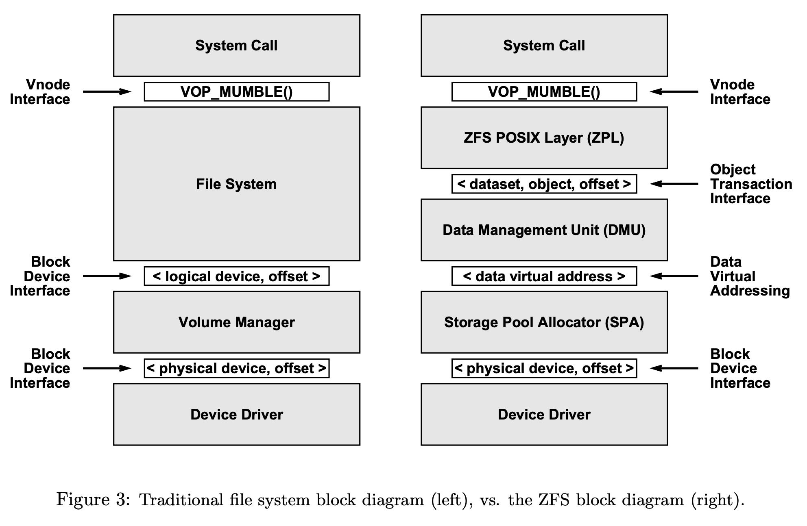
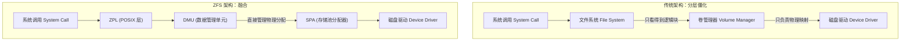
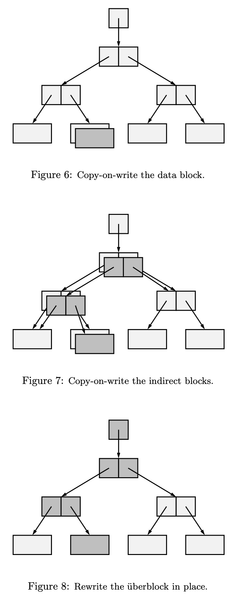
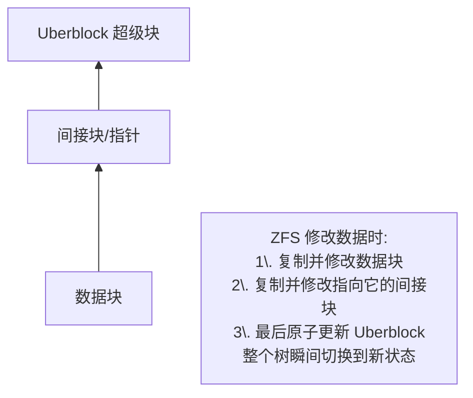
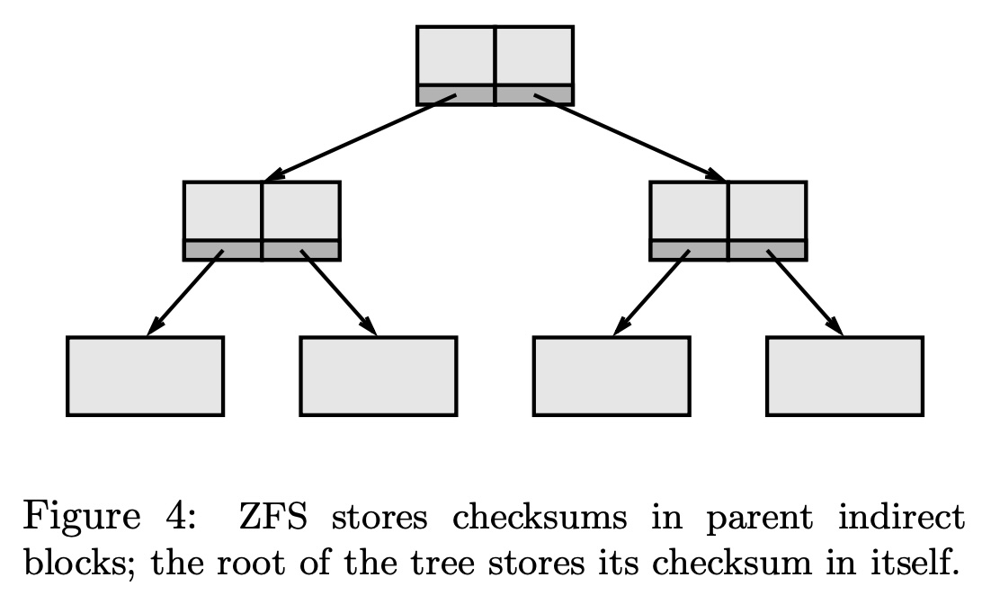
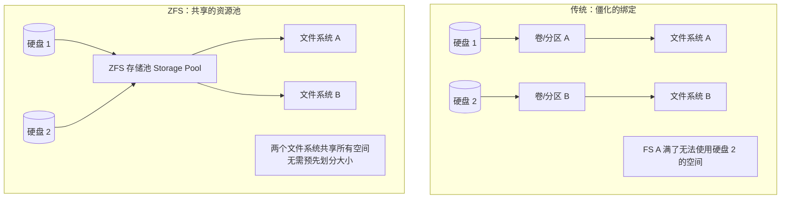
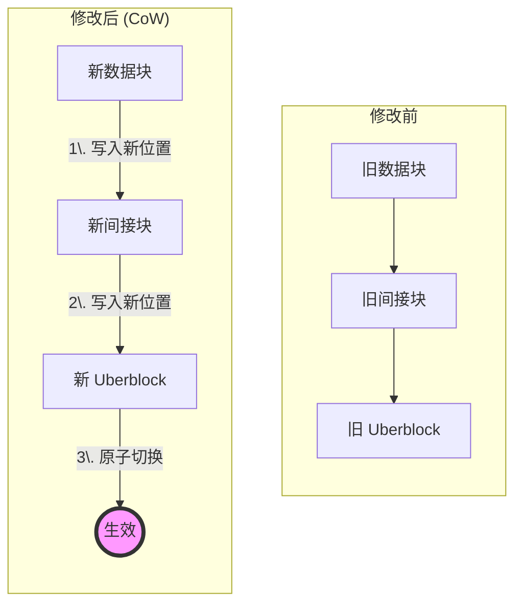
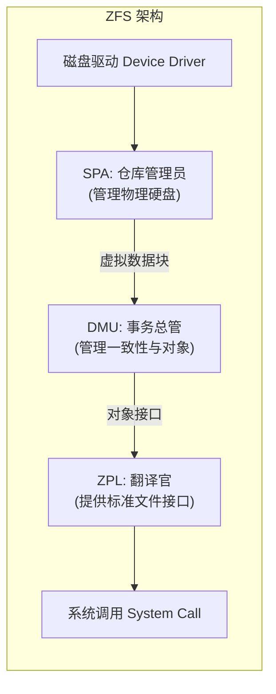
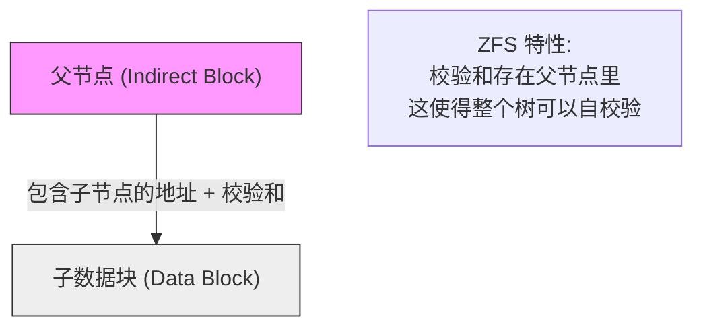

## AI论文解读 | The Zettabyte File System
        
### 作者        
digoal        
        
### 日期        
2025-11-22        
        
### 标签        
PostgreSQL , PolarDB , DuckDB , AI , 论文解读        
        
----        
        
## 背景  
      
https://www.cs.hmc.edu/~rhodes/cs134/readings/The%20Zettabyte%20File%20System.pdf        
  
提示:          
```          
读懂《The Zettabyte File System》这篇论文需要提前掌握哪些基础知识, 请使用中文通熟易懂的讲解这些基础知识, 可以引用论文中的图、表或使用Markdown支持的图形(text,mermaid等)增加解释性. 
  
使用中文通熟易懂的解读《The Zettabyte File System》这篇论文, 其中的关键内容请着重讲解, 可以引用论文中的图、表或使用Markdown支持的图形(text,mermaid等)增加解释性. 
  
提取《The Zettabyte File System》这篇论文中的重要术语, 使用中文对这些术语进行通熟易懂的讲解, 可以引用论文中的图、表或使用Markdown支持的图形(text,mermaid等)增加解释性. 
```     
  
## 1 前置知识 
  
要真正读懂《The Zettabyte File System》(ZFS) 这篇论文，你需要理解它试图解决的历史痛点。ZFS 不仅仅是一个文件系统，它实际上是一场**存储架构的革命**。

为了让你能通俗易懂地理解这篇论文，我总结了以下几个核心的基础知识模块。掌握这些，你就能明白为什么论文作者会说 ZFS 是从零开始重新设计的 。

-----

### 1\. 传统存储的“千层饼”架构 (The Storage Stack)

在 ZFS 出现之前，存储系统像是一个分工明确但沟通不畅的“千层饼”。你需要了解这一层的关系，才能看懂论文中 **图 3 (Figure 3)** 的对比。    

  * **基础概念**：

      * **硬盘 (Disk)**：物理存储设备。
      * **卷管理器 (Volume Manager)**：这是一个“中间商”。它把物理硬盘组合起来（比如把两个 50GB 的硬盘拼成一个 100GB 的“虚拟硬盘”），然后把这个“虚拟硬盘”交给上层的文件系统 。
      * **文件系统 (File System)**：负责管理文件、目录和权限（如 ext4, UFS, NTFS）。它通常只看到卷管理器给它的那个“虚拟硬盘”，却不知道底下到底有几个物理盘 。

  * **痛点（论文试图解决的问题）** ：
    这种分层导致了信息隔阂。文件系统不知道底层的物理状况，卷管理器不知道上层存了什么数据。

    > **比喻**：就像你（文件系统）在租房。房东（卷管理器）给你一个房间（卷）。如果你想给房间扩建（动态扩容），房东得先把墙砸了，你还得重新规划家具摆放，非常麻烦且容易出错 。

  * **图解：传统架构 vs ZFS**
    (基于论文 Figure 3)




### 2\. 什么是元数据 (Metadata) 与 Inode

论文中多次提到“动态分配 inode”  和“POSIX 兼容性” ，你需要理解这两个概念。

  * **基础概念**：

      * **数据 (Data)**：你写在文件里的实际内容（比如文档里的文字）。
      * **元数据 (Metadata)**：关于数据的数据。比如：这文件叫什么？谁创建的？多大？存在硬盘的哪个位置？
      * **Inode (索引节点)**：在 Unix/Linux 系统中，专门用来存元数据的一个小结构体 。

  * **传统痛点**：
    传统文件系统在创建时（格式化时），会预先切分出一部分空间专门放 Inode。

    > **比喻**：就像买一本电话簿，如果预印的格子（Inode）用完了，哪怕纸张（数据空间）还有大量空白，你也没法存新电话号码了。论文指出 ZFS 废除了这种静态分配，Inode 是随用随造的 。

### 3\. 数据一致性与写时复制 (Copy-on-Write, CoW)

这是 ZFS 最核心的机制。论文中提到“Always consistent on-disk data”  和 “Transactional” 。

  * **基础概念**：

      * **原地覆写 (Overwrite)**：传统修改文件的方式。比如你要把 "A" 改成 "B"，你会直接在硬盘原来的位置把 "A" 擦掉写上 "B"。
      * **风险**：如果在擦掉 "A" 但还没写完 "B" 的瞬间断电了，数据就坏了（既不是 A 也不是 B）。这就是为什么老式电脑强行关机后需要漫长的 `fsck` (文件系统检查) 。

  * **ZFS 的做法 (CoW)**：
    ZFS 永远不覆盖旧数据。它会找个新地方写 "B"，写好确认无误后，再把指向 "A" 的指针指到 "B"。

    > **比喻**：就像写作业。传统方式是用橡皮擦掉旧答案写新的（容易把纸擦破）。ZFS 是在旁边贴一张便利贴写新答案，确认写对了，再把目光移过去。旧数据依然完好，直到确认不再需要才回收。

  * **图解：Uberblock 的原子性**
    论文 Figure 6-8 描述了这个过程。所有的修改最终汇聚到根节点的更新 。

  



### 4\. 校验和 (Checksum) 与静默损坏

论文花了很大篇幅讲“数据完整性” 。

  * **基础知识**：

      * **静默损坏 (Silent Data Corruption)**：硬盘虽然没坏，但偶尔会因为磁性衰减或固件Bug，把 "0" 读成了 "1"。传统的硬盘和文件系统通常**默认信任**读出来的数据 。
      * **校验和**：像是一个“数字指纹”。写入数据时算出指纹存下来，读取时再算一遍，如果对不上，就知道数据坏了。

  * **ZFS 的突破**：
    ZFS 不把校验和放在数据旁边，而是放在**指向数据的指针里**（即父节点中，见论文 **Figure 4**）。    

    > **为什么这很重要？**：如果校验和跟数据放在一起（比如存在同一个扇区），一旦这个扇区坏了，数据和校验和可能一起坏掉，你就发现不了了。ZFS 这种结构叫 **Merkle Tree**，它能保证从根节点一路校验到底层数据，具有“自验证”属性 。

### 5\. 存储池 (Storage Pool) vs 分区 (Partition)

这是论文标题 "Zettabyte" 能够实现的基础，也是为了解决“易于管理”  的目标。

  * **传统做法 (分区)**：
    买来硬盘 -\> 切割成几个分区 -\> 每个分区格式化成一个文件系统。

      * *缺点*：分区 A 满了，分区 B 还空着，但 A 借不到 B 的空间 。

  * **ZFS 做法 (存储池)**：
    把所有硬盘扔进一个大池子 (Pool)。所有的文件系统都在这个池子里“游泳”，大家共享所有空间。

    > **比喻 (论文中的比喻)**： 就像**内存 (RAM)**。你打开浏览器、打开 Word，并不需要预先给浏览器划分 "100MB内存区"。系统会自动从内存池里分配。ZFS 把这个概念带到了硬盘管理上。

### 总结：你需要关注的三个关键词

在阅读论文时，请时刻带着这三个概念去理解 ZFS 的设计决策：

1.  **Pooled Storage (池化存储)**：解决管理难、空间浪费的问题。
2.  **Transactional CoW (事务性写时复制)**：解决断电数据损坏、不再需要 `fsck` 的问题。
3.  **End-to-End Checksum (端到端校验)**：解决数据静默腐败的问题。

-----

**下一步建议：**
既然你已经有了这些背景知识，建议你从论文的 **Section 3.2.1 (Error detection and correction)** 开始阅读，结合上面的“校验和”知识，你会发现 ZFS 能够“自修复 (Self-healing)”  是多么精妙的设计。需要我为你详细拆解那一部分的逻辑吗？
  
## 2 解读论文 
  
这也是一篇在计算机存储领域具有里程碑意义的论文。ZFS（Zettabyte File System）的设计初衷不仅仅是做一个更大的文件系统，而是要**彻底解决**过去几十年管理员和开发者在存储管理上的噩梦。

以下是对这篇论文的通俗解读，我会将其核心理念拆解为三个关键支柱：**池化存储**、**写时复制（CoW）** 和 **端到端校验**。

-----

### 1\. 为什么要重新发明轮子？（背景与痛点）

论文开篇就很犀利地指出，虽然现在的硬盘越来越大，但文件系统的设计思路还停留在 1980 年代 。传统的系统面临三大痛点：

  * **管理极其痛苦**：你需要分区、格式化、调整卷大小、修改 `/etc/fstab`。一旦估算错了空间，扩容非常麻烦 。
  * **数据不一致**：断电可能导致文件系统损坏，开机必须跑漫长的 `fsck`（文件系统检查）来修复，甚至可能修不好 。
  * **静默数据损坏**：硬盘可能会骗人（Phantom writes），或者发生位翻转。传统文件系统通常默认读回来的数据是正确的，导致用户拿到坏数据都不自知 。

ZFS 的目标就是：**简单的管理、始终如一的数据完整性、以及巨大的容量** 。

-----

### 2\. 核心创新一：池化存储 (Pooled Storage)

这是 ZFS 对管理员最直观的改变。

  * **传统做法（分区模型）** ：
    就像买房子。你买了一个硬盘，把它隔成“厨房（分区1）”和“卧室（分区2）”。如果“卧室”满了而“厨房”还空着，你也无法把厨房的空间借给卧室用，必须砸墙重修（重新分区）。

  * **ZFS 的做法（池化模型）** ：
    ZFS 引入了 **存储池（Storage Pool）** 的概念。所有的硬盘都被扔进一个大池子里。文件系统不再绑定在某个物理盘上，而是像海绵吸水一样，需要多少空间就从池子里取多少 。

    > **形象的比喻**：论文中把这比作 **虚拟内存**。当你打开浏览器时，你不需要预先手动分配“100MB 物理内存条”给它。操作系统会自动从总内存池里分配空间。ZFS 就是把这种自动分配机制带到了硬盘管理上 。




-----

### 3\. 核心创新二：写时复制 (Transactional Copy-on-Write)

ZFS 宣称从此**不再需要 `fsck`** ，它是如何做到的？答案是：永远不覆盖旧数据。

  * **机制**：
    在传统文件系统中，修改数据通常是“原地覆写”。如果在写的过程中断电，数据就烂了。
    ZFS 采用 **Copy-on-Write (CoW)**。当你修改数据块 A 时，ZFS 不会动 A，而是找个新地方写下新的数据 B。只有当 B 写好并校验无误后，它才会修改指针，让它指向 B 。

  * **事务性更新（原子性）** ：
    ZFS 的数据结构是一棵树。当你修改叶子节点（数据）时，因为位置变了，指向它的父节点也得变；父节点变了，祖父节点也得变……这个变化会一路“涟漪”般传递到根节点，叫做 **Uberblock** 。

    最终的切换只发生在一个瞬间：**原子更新 Uberblock**。这就好比玩游戏存档，要么存档成功（新状态），要么存档失败（回滚到旧状态），永远不会有“存了一半”的坏档 。




-----

### 4\. 核心创新三：端到端校验 (End-to-End Checksum)

这是 ZFS 保证数据“坚不可摧”的秘诀。

  * **不要信任硬盘**：
    ZFS 假设硬盘和控制器都是会犯错的 。
  * **父节点校验子节点**：
    传统文件系统把校验和（指纹）跟数据存在一起。如果那一块磁盘坏了，数据和校验和一起坏，你就发现不了。
    ZFS 采用 **Merkle Tree** 结构：**数据块的校验和存在它的父节点里** 。
      * 读数据时，ZFS 会先读父节点里的校验和，再读数据，计算对比。如果不一致，说明数据坏了。
  * **自愈功能 (Self-Healing)**：
    如果是镜像（Mirror）模式，ZFS 发现一边的数据校验不对，它不仅仅是报错，还会自动从另一块好盘读取正确数据，并**反手把坏盘上的数据修好** 。

-----

### 5\. 简洁的系统架构

论文通过图表展示了 ZFS 如何通过分层简化了传统的存储栈 。

| 层次 | 名称 | 职责 | 通俗解释 |
| :--- | :--- | :--- | :--- |
| **顶层** | **ZPL** (ZFS POSIX Layer) | 提供标准文件接口 | 它是“翻译官”，把 ZFS 的对象翻译成我们熟悉的文件、文件夹、权限 。 |
| **中层** | **DMU** (Data Management Unit) | 管理对象与事务 | 它是“大管家”，负责 Copy-on-Write 逻辑，确保数据在磁盘上永远是一棵一致的树 。 |
| **底层** | **SPA** (Storage Pool Allocator) | 硬盘与块分配 | 它是“仓库管理员”，不管什么是文件，只管把硬盘上的数据块分配出去（类似内存的 `malloc`）。 |

### 总结

《The Zettabyte File System》之所以经典，是因为它用软件定义的思路重构了存储。

1.  **容量**：128位寻址，理论上可以存 $2^{128}$ 字节，作者打趣说根据量子力学计算，要把这个空间填满需要把海洋烧干来提供能量，足够人类用几十年了 。
2.  **完整性**：通过父节点校验和，确保存进去的数据和读出来的一模一样。
3.  **易用性**：一条命令 `zpool create` 就能搞定以前一天的活 。

这是一篇宣示“文件系统不仅仅是把文件存进盘里，而是要管理数据的全生命周期”的檄文。
  
## 3 术语 
  
基于《The Zettabyte File System》这篇论文，我为你提取了 ZFS 中最核心的术语。为了让你通过一次阅读就能理解这套系统的精髓，我将这些术语分成了 **“三层架构”、“数据保护”和“存储管理”** 三个模块来讲解。

-----

### 1\. 核心架构层 (The Layered Architecture)

ZFS 将传统文件系统杂乱的功能拆解成了三个清晰的层次，每一层各司其职。

#### **SPA (Storage Pool Allocator) - 存储池分配器**

  * **原文定义**：SPA 从存储池的所有设备中分配数据块 。它向上一层提供“虚拟地址”的数据块，类似于内存管理中的 `malloc()` 和 `free()` 。
  * **通俗解读**：它是 ZFS 的 **“仓库管理员”** 。
      * 它不管你存的是图片还是文档，它只看得到一个个的数据块。
      * 它的工作就是把硬盘上的物理空间（比如 /dev/dsk/a）包装成通用的虚拟空间借给上层用 。
      * **好处**：因为这层抽象，增加或删除硬盘时，上层的文件系统根本不需要知道数据具体搬到了哪块盘上 。

#### **DMU (Data Management Unit) - 数据管理单元**

  * **原文定义**：DMU 从 SPA 获取数据块，并向上层提供“对象（Objects）”接口 。它负责维护数据的一致性，执行写时复制（Copy-on-Write）机制 。
  * **通俗解读**：它是 ZFS 的 **“事务总管”** 。
      * 它把下面散乱的数据块整合成一个个“对象”（类似于一个个小文件包） 。
      * 它最重要的工作是保证“原子性”：你要么把数据存完，要么一点别存，绝不能存一半。它通过管理事务（Transaction）来确保即使断电，磁盘数据也不会乱 。

#### **ZPL (ZFS POSIX Layer) - ZFS POSIX 层**

  * **原文定义**：ZPL 将 DMU 的对象包装成符合 POSIX 标准的文件系统接口（如文件、目录、权限等） 。
  * **通俗解读**：它是 ZFS 的 **“翻译官”** 。
      * 它让我们熟悉的操作（如 `ls`, `mkdir`, `chmod`）能够在这个新系统上运行。
      * 它把我们对文件的操作翻译成对 DMU 对象的操作 。比如创建一个文件，其实就是告诉 DMU 创建一个对象 。

**图解：ZFS 的三层架构 vs 传统架构**
(基于论文 Figure 3 )     



-----

### 2\. 数据保护机制 (Data Integrity)

这是 ZFS 最引以为傲的部分，彻底解决了数据损坏的问题。

#### **Copy-on-Write (CoW) - 写时复制**

  * **原文定义**：所有块的更新都是事务性的写时复制。当数据被修改时，ZFS 分配一个新块并写入修改后的数据，而不是覆盖原数据 。
  * **通俗解读**： **“绝不涂改”原则** 。
      * 传统文件系统修改文件像是在用橡皮擦：擦掉旧的，写上新的。如果擦了一半停电了，数据就毁了。
      * ZFS 修改文件像是写新的一页纸：保留旧纸张不动，找张白纸写下新内容。确认写好后，把目录指到新纸张上 。

#### **Uberblock - 超级块**

  * **原文定义**：数据树的根节点。整个文件系统的一致性状态最终由 Uberblock 的原子重写决定 。
  * **通俗解读**： **“世界的锚点”** 。
      * ZFS 的所有数据像一棵大树，Uberblock 就是树根。
      * 当你修改了叶子（文件数据），树枝（间接块）也会变，最后树根（Uberblock）也会变。
      * ZFS 会在所有数据都写好后，瞬间更新这个树根。只要树根更新成功，所有修改就生效了；如果失败，树根还指向旧状态，数据依然完好 。

#### **Checksum (in Parent) - 父节点校验和**

  * **原文定义**：每个块的校验和不存储在块本身，而是存储在指向它的父级间接块中 。
  * **通俗解读**： **“端到端的指纹验证”** 。
      * 传统系统把数据和它的指纹（校验和）放在一起。如果那个位置的磁盘坏了，数据和指纹一起坏，你就无法发现数据被篡改了。
      * ZFS 采用 **“我不信任我自己，我信任我的上级”** 的策略。读取数据块 A 时，ZFS 会去查 A 的父亲 B，问：“你手里存的 A 的指纹是多少？”然后对比。这种结构构成了自验证的树（Merkle Tree） 。

**图解：校验和存储位置**
(基于论文 Figure 4 )     



-----

### 3\. 存储管理概念 (Storage Management)

ZFS 改变了我们管理硬盘的方式。

#### **Pooled Storage - 池化存储**

  * **原文定义**：将文件系统与物理存储解耦。所有文件系统共享同一个存储池，按需分配空间 。
  * **通俗解读**： **“大锅饭”模式** 。
      * 以前（卷管理模式）是分餐制：给 C 盘 50G，给 D 盘 50G。C 盘满了哪怕 D 盘是空的也用不了。
      * ZFS 是自助餐：把所有硬盘加到一个大池子（Pool）。大家都在这个池子里取用，谁要用多少就拿多少，不需要预先切分 。

#### **Vdev (Virtual Device) - 虚拟设备**

  * **原文定义**：构建存储池的基本模块，是一个小型的虚拟设备驱动程序树 。它可以是物理磁盘、镜像（mirror）或条带（stripe）的组合 。
  * **通俗解读**： **“乐高积木”** 。
      * ZFS 不直接操作裸硬盘，而是操作 Vdev。
      * 你可以把两个硬盘拼成一个“镜像 Vdev”（互相备份），然后把这个 Vdev 扔进存储池。
      * Vdev 的设计非常模块化，只有大约 100 行代码就能实现一种新的组合方式 。

#### **DVA (Data Virtual Address) - 数据虚拟地址**

  * **原文定义**：磁盘块的虚拟地址，由 SPA 使用。ZFS 使用 128 位的块地址 。
  * **通俗解读**： **“超大门牌号”** 。
      * 为了防止未来空间不够用，ZFS 设计了 128 位的地址系统。
      * 这个数字大到什么程度？论文里打趣说，要填满 128 位地址所需的硬盘设备，其质量将比地球大得多，甚至需要烧干海洋来提供能量 。这意味着在未来几十年内我们都不用担心地址不够用了。
  
## 参考        
         
https://www.cs.hmc.edu/~rhodes/cs134/readings/The%20Zettabyte%20File%20System.pdf    
        
<b> 以上内容基于DeepSeek、Qwen、Gemini及诸多AI生成, 轻微人工调整, 感谢杭州深度求索人工智能、阿里云、Google等公司. </b>        
        
<b> AI 生成的内容请自行辨别正确性, 当然也多了些许踩坑的乐趣, 毕竟冒险是每个男人的天性.  </b>        
  
    
#### [PolarDB 学习图谱](https://www.aliyun.com/database/openpolardb/activity "8642f60e04ed0c814bf9cb9677976bd4")
  
  
#### [PostgreSQL 解决方案集合](../201706/20170601_02.md "40cff096e9ed7122c512b35d8561d9c8")
  
  
#### [德哥 / digoal's Github - 公益是一辈子的事.](https://github.com/digoal/blog/blob/master/README.md "22709685feb7cab07d30f30387f0a9ae")
  
  
#### [About 德哥](https://github.com/digoal/blog/blob/master/me/readme.md "a37735981e7704886ffd590565582dd0")
  
  

  
