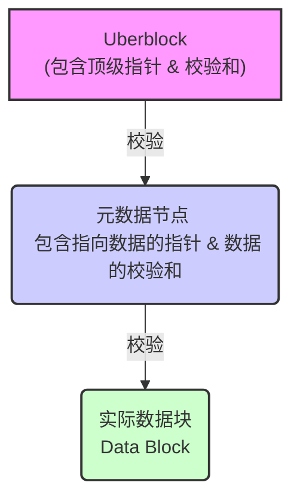
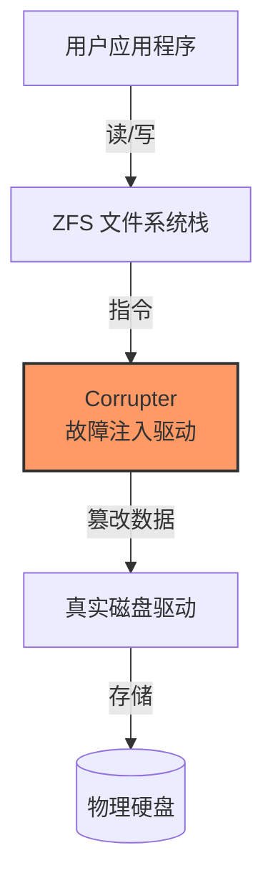
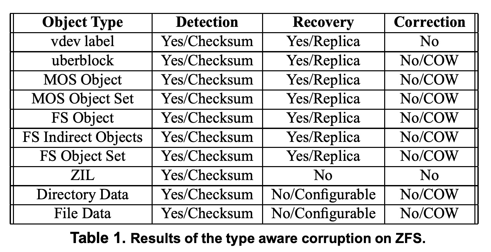
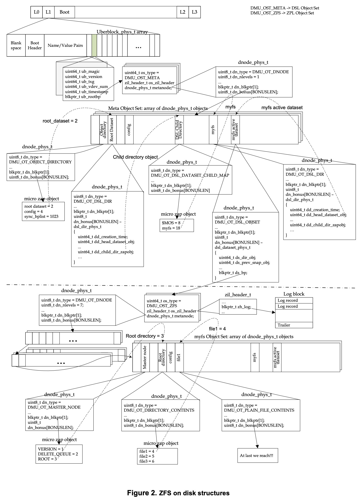
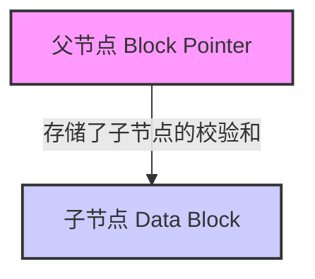

## AI论文解读 | Reliability Analysis of ZFS
        
### 作者        
digoal        
        
### 日期        
2025-11-22        
        
### 标签        
PostgreSQL , PolarDB , DuckDB , AI , 论文解读        
        
----        
        
## 背景  
      
https://pages.cs.wisc.edu/~kadav/zfs/zfsrel.pdf        
  
提示:          
```          
读懂《Reliability Analysis of ZFS》这篇论文需要提前掌握哪些基础知识, 请使用中文通熟易懂的讲解这些基础知识, 可以引用论文中的图、表或使用Markdown支持的图形(text,mermaid等)增加解释性. 
  
使用中文通熟易懂的解读《Reliability Analysis of ZFS》这篇论文, 其中的关键内容请着重讲解, 可以引用论文中的图、表或使用Markdown支持的图形(text,mermaid等)增加解释性. 
  
提取《Reliability Analysis of ZFS》这篇论文中的重要术语, 使用中文对这些术语进行通熟易懂的讲解, 可以引用论文中的图、表或使用Markdown支持的图形(text,mermaid等)增加解释性. 
```     
  
## 1 前置知识 
  
要深入读懂这篇《Reliability Analysis of ZFS》（ZFS可靠性分析）论文，你需要建立几个核心领域的“心智模型”。这篇论文主要探讨的是 ZFS 文件系统如何应对磁盘上的 **数据损坏（Data Corruption）** 。

以下是阅读该论文前需要掌握的基础知识，我将其分为**存储基础**、**ZFS 核心机制**和**系统测试/内核知识**三个模块进行通俗讲解。

-----

### 1\. 存储与文件系统基础 (Storage & File System Basics)

在理解 ZFS 之前，你需要先理解普通文件系统是如何工作的。

  * **元数据 (Metadata) vs. 数据 (Data)**
      * **概念**：
          * **数据**：是你真正保存的文件内容（例如一张照片、一个文档）。
          * **元数据**：是关于数据的信息（例如文件名、文件大小、创建时间、数据块在磁盘的哪个位置）。
      * **论文关联**：ZFS 对元数据和数据有不同的保护策略。例如，论文提到 ZFS 的元数据（Metadata）默认是压缩且有冗余副本的，而普通数据则未必 。
  * **块 (Block) 与 块指针 (Block Pointer)**
      * **概念**：硬盘像一个巨大的方格纸，每个格子叫一个“块”（Block）。文件系统通过“指针”记录文件存在哪些格子里。
      * **传统痛点**：如果指针坏了，你不仅找不到文件，甚至不知道文件坏了。

### 2\. ZFS 独有的核心机制 (The "ZFS Way")

这是理解这篇论文最关键的部分。ZFS 与传统文件系统（如 Ext4, NTFS）的设计哲学完全不同。

#### A. 默克尔树 (Merkle Tree / Checksum Tree)

ZFS 被描述为一个“巨大的树形结构” 。

  * **通俗解释**：
    传统的校验和（Checksum，一种用于检查数据是否出错的数字指纹）通常和数据放在一起。ZFS 不一样，它把**子节点的校验和放在父节点里** 。
  * **原理图解**：
    当你读取最底层的数据时，ZFS 会算出它的指纹，并向上层比对。如果数据坏了，父节点会立刻知道。这也意味着，如果你拥有根节点（Uberblock）的正确指纹，你就能验证整个文件系统树的完整性。




  * **论文引用**：这种机制消除了单独读取校验和的 I/O 开销，并实现了故障隔离 。

#### B. 写时复制 (Copy-on-Write, COW)

  * **概念**：
    在传统文件系统中，修改文件通常是“原地覆盖”（Overwrite）。如果覆盖到一半断电了，数据就坏了。
    ZFS 使用 **COW**。当你修改数据块 A 时，ZFS **不会**去覆盖 A，而是找个新地方写下 A'，然后修改指向上层的指针。
  * **论文关联**：论文中多次提到 ZFS 总是保持“磁盘上一致性”（Always on-disk consistent）。
  * **示意图**：
    ```text
    [旧状态]  指针 -> [数据块 A (旧)]

    [写操作]  (不碰数据块 A) -> 在新位置写入 [数据块 A' (新)]

    [提交后]  指针(更新) -> [数据块 A' (新)] ... [数据块 A (旧) 变为垃圾等待回收]
    ```

#### C. Ditto Blocks (同位块/冗余副本)

  * **概念**：
    ZFS 不仅仅依赖 RAID（磁盘阵列），它还能在单个磁盘上通过保存多份副本来防止数据丢失。这些副本被称为 **Ditto Blocks**。
  * **论文中的策略**：
      * **Pool 元数据**：存 3 份 。
      * **文件系统元数据**：存 2 份 。
      * **普通用户数据**：默认存 1 份（无冗余）。
  * **关键点**：Block Pointer（块指针）知道它指向的数据有几个副本（由 Wideness 决定）。如果读第一份发现校验和不对，它会自动去读第二份 。

#### D. Uberblock (超级块)

  * **概念**：整个 ZFS 存储池的“根”或“入口点”。它就像一本书的目录页。
  * **论文关联**：硬盘上有 128 个 Uberblock 插槽 。ZFS 通过事务编号（TXG）来寻找最新的那个 Uberblock 。这是 ZFS 启动时读取的第一个东西。

### 3\. 故障注入与系统编程 (Fault Injection & Systems)

论文采用了**故障注入**的方法来测试 ZFS 。你需要理解他们是怎么“搞破坏”的。

  * **驱动层 (Driver Layer) 与 I/O 栈**

      * **知识点**：操作系统访问硬盘是分层的。
        `应用程序 -> 文件系统 (ZFS) -> 虚拟设备 (VDEV) -> 物理磁盘驱动`
      * **论文的做法**：作者写了一个“伪驱动程序”（Pseudo Device Driver）叫 `corrupter` 。它插在 ZFS 和真实磁盘驱动之间（中间人攻击模式）。
      * **目的**：当 ZFS 想要读写数据时，这个驱动程序会故意把数据改坏（比如把某些字节改成 0），以此来观察 ZFS 能不能发现并修复错误 。

  * **内存缓存 (In-Memory Cache/ARC)**

      * **知识点**：文件系统通常会把刚读写过的数据放在内存（RAM）里，因为 RAM 比硬盘快得多。
      * **论文中的陷阱**：论文发现，有时候明明把磁盘上的数据改坏了，ZFS 却没报错。为什么？因为 ZFS 还在用内存里缓存的“好”数据 。为了测试真实的磁盘恢复能力，研究人员必须强制卸载（Unmount）再重新挂载文件系统，清除内存缓存 。

### 总结：阅读路线图

在阅读论文时，建议按照以下逻辑串联知识点：

1.  **结构 (Structure)**: ZFS 是棵树，从 Uberblock -\> MOS -\> Object Set -\> Directories -\> Files 。
2.  **保护 (Protection)**: 每个指针里都有校验和 (Checksum) 。
3.  **冗余 (Redundancy)**: 重要的东西（元数据）存多份 (Ditto Blocks) 。
4.  **实验 (Experiment)**: 作者在写入磁盘的瞬间故意改坏数据，看 ZFS 读回来时：
      * 能不能**发现**？（靠 Checksum）
      * 能不能**恢复**？（靠 Ditto Blocks）

掌握了这些，你就能够理解论文中关于“ZFS 为什么有时候静默修复，有时候报错 I/O Error”的分析了。
  
## 2 解读论文 
  
这篇名为《Reliability Analysis of ZFS》（ZFS 可靠性分析）的论文，由威斯康星大学麦迪逊分校的研究人员撰写。他们的目标非常直接：**ZFS 号称是世界上最可靠的文件系统，我们来通过“搞破坏”验证一下它是否名副其实。**

以下是对这篇论文的通俗解读。

-----

### 1\. 核心背景：ZFS 凭什么说自己可靠？

在深入实验之前，你需要理解 ZFS 的三个“护身符”，这也是论文分析的基础：

1.  **校验和树 (Checksum Tree)**：
    传统文件系统把校验和（指纹）跟数据放在一起。ZFS 不同，它把数据的校验和存在**父节点的指针里** 。

      * 这意味着：如果你读数据算出校验和不对，说明数据坏了；如果校验和本身坏了，因为它是存在父节点里的，这也是一种不匹配。这实现了端到端的完整性 。

2.  **同位块 (Ditto Blocks) / 冗余**：
    ZFS 哪怕在单块硬盘上，也会对重要数据存多份副本。

      * **Pool 元数据**：存 3 份 。
      * **文件系统元数据**：存 2 份 。
      * **用户数据**：默认存 1 份（不冗余） 。

3.  **写时复制 (Copy-on-Write, COW)**：
    ZFS 永远不会覆盖旧数据。它总是把新数据写到新地方，然后更新指针。这意味着磁盘状态总是“一致”的，不会因为断电导致数据写了一半 。

-----

### 2\. 实验方法：如何“谋杀”文件系统？

作者没有使用随机乱写的低级手段，而是开发了一种 **“类型感知” (Type-aware)** 的攻击方式 。

#### 攻击工具：Corrupter

他们写了一个假的驱动程序（Layered Driver），夹在 ZFS 和真实磁盘驱动之间 。

  * **流程**：
    1.  **分析器 (Analyzer)** 读取磁盘，告诉用户：“这里是元数据，那里是文件 A 的数据” 。
    2.  **用户** 选择：“把这个元数据搞坏！”
    3.  **Corrupter** 拦截读写请求，精准地修改磁盘上的特定字节 。




-----

### 3\. 实验结果与关键发现 (Key Findings)

作者进行了 90 次实验，攻击了 10 种不同的 ZFS 对象 。以下是战况汇总：

#### A. 攻击“地基”：Vdev Labels 和 Uberblocks

  * **对象**：硬盘最开头的标签（Label）和超级块（Uberblock，整个文件系统的入口）。
  * **结果**：**极难攻破**。
      * **现象**：即使作者改坏了磁盘上的 Uberblock，ZFS 依然运行正常。
      * **原因**：ZFS 极其依赖内存缓存。只要系统没重启，它就用内存里的好数据。一旦发生写操作（COW），它会把好的数据写到磁盘的新位置，完全绕过了刚才被损坏的旧块 。
      * **极限测试**：只有当所有 4 个 Label 都被破坏且重启系统时，ZFS 才会挂掉（Panic） 。

#### B. 攻击“骨架”：元数据 (Metadata)

  * **对象**：管理文件结构的节点（如 MOS, Object Sets）。
  * **结果**：**检测并自动修复**。
      * **现象**：作者破坏了一份元数据副本。ZFS 读取时发现校验和不对，立刻去读第二份副本（Ditto block），然后返回正确数据 。
      * **极限测试**：如果把所有副本（2份或3份）全改坏了，ZFS 会报 I/O 错误，无法挂载 。

#### C. 攻击“血肉”：用户数据 (User Data)

  * **对象**：普通文件的内容。
  * **结果**：**能检测，但无法修复**。
      * **现象**：默认配置下，用户数据没有冗余副本。ZFS 发现校验和不匹配，知道数据坏了，但因为它没有备胎，只能抛出 `I/O Error` 。
      * **对比**：相比传统文件系统直接把坏数据读给你（让你看到一张花屏的图片），ZFS 宁愿报错也不给你坏数据，这被认为更安全。

#### D. 攻击目录 (Directories)

  * **对象**：文件夹结构。
  * **结果**：**甚至无法删除**。
      * 如果目录的两个副本都坏了，ZFS 会报错。你甚至无法删除这个目录，因为它本质上已经不可读了 。

-----

### 4\. 核心洞察：ZFS 的“懒惰”修复策略

这是论文中最有趣的发现之一。

  * **现象**：
    当 ZFS 读到一个坏块（Checksum Error）并利用副本（Ditto block）成功读取数据后，**它并没有立即去修复磁盘上那个坏掉的块** 。
  * **机制**：
    ZFS 利用了 COW（写时复制）特性。它只是在内存里拿着正确的数据继续跑。只有当这个数据块下次需要被修改并写入磁盘时（Transaction Group Commit），它才会把正确的数据写到一个**全新的位置** 。
  * **评价**：
    这种策略虽然“懒”，但性能更好（减少了立即回写的 I/O），且利用 COW 机制自然地规避了坏块 。

### 5\. 总结表 (根据论文 Table 1 改编)

  

| 被攻击对象 | 能检测到错误吗? (Detection) | 能恢复数据吗? (Recovery) | 备注 |
| :--- | :--- | :--- | :--- |
| **Pool 元数据** | ✅ 是 (校验和) | ✅ 是 (3份副本) | 核心结构极难破坏 |
| **文件系统元数据** | ✅ 是 (校验和) | ✅ 是 (2份副本) | 只要有一份副本在就好 |
| **用户数据 (文件)** | ✅ 是 (校验和) | ❌ 否 (默认无副本) | 会报 I/O Error  |
| **目录数据** | ✅ 是 (校验和) | ✅ 是 (2份副本) | 副本全坏则目录不可用 |

### 6\. 结论 (Conclusion)

论文最终得出结论，ZFS 的确构建了一个非常健壮的文件系统，主要归功于：

1.  **通用的指针结构**：所有东西都用 `blkptr_t` 指针，里面自带校验和，构成了坚固的 Merkle Tree 。
2.  **激进的冗余**：元数据存多份，这是普通商用文件系统以前舍不得做的（为了省空间），但 ZFS 结合压缩技术让这变得可行 。
3.  **COW 机制**：不仅保证了一致性，还提供了一种“惰性但有效”的错误规避方式 。

一句话总结：**ZFS 确实能发现所有错误；对于元数据，它能自我修复；对于用户数据，它能报错止损（除非你开启了额外的副本或 RAID 功能）。**
  
## 3 术语 
  
这篇论文《Reliability Analysis of ZFS》深入探讨了 ZFS 文件系统的可靠性机制。为了读懂作者是如何进行“破坏测试”以及 ZFS 是如何“自我修复”的，我们需要掌握以下核心术语。

我将这些术语分为**核心架构**、**可靠性机制**和**磁盘结构**三类进行讲解。

-----

### 1\. 核心架构术语

#### **Storage Pool (存储池)**

  * **通俗解释**：传统的磁盘管理像切蛋糕，把硬盘切成一块块给不同的分区（Volume）。ZFS 的存储池像一个大水桶。你把所有硬盘都扔进这个桶里，然后所有的文件系统（File Systems）都从这个同一个大桶里按需取水（分配空间）。
  * **论文中的地位**：ZFS 的所有数据和元数据都住在这个池子里，池子由一个巨大的树形结构管理 。

#### **Object-based File System (基于对象的文件系统)**

  * **通俗解释**：在 ZFS 眼里，万物皆“对象”（Object）。无论是你的照片文件、文件夹，还是管理这些文件的元数据，都是一个个对象 。
  * **技术细节**：这些对象在磁盘上由 `dnode_phys_t` 结构表示 。你可以把它想象成编程语言里的“类”和“对象”，每个对象都有自己的属性和数据 。

#### **Vdev (Virtual Device, 虚拟设备)**

  * **通俗解释**：这是 ZFS 对底层硬盘的抽象。它可以是一块物理硬盘，也可以是几块硬盘组成的镜像或 RAID 组。
  * **论文图解**：论文中的图 2 展示了数据结构的最顶层就是 Vdev Labels（虚拟设备标签）。    
  * **重要性**：ZFS 通过 Vdev 与物理磁盘驱动程序对话 。

-----

### 2\. 核心可靠性机制 (论文分析的重点)

#### **Checksum (校验和 / 指纹)**

  * **通俗解释**：这是数据的“数字指纹”。
  * **ZFS 的绝招**：传统系统把指纹和数据放一起（比如写在同一页纸上）。ZFS 把指纹**存在父节点的指针里** 。
      * 这意味着：当你通过父节点去读子节点的数据时，你会先拿到“正确指纹”，算一下读出来的“实际指纹”。如果不匹配，ZFS 立马知道数据坏了 。这形成了一棵能够自我验证的树（Merkle Tree）。




#### **COW (Copy-on-Write, 写时复制)**

  * **通俗解释**：ZFS 也是个“强迫症”，它永远不覆盖旧数据。
      * **场景**：你要修改文件 A。
      * **传统做法**：直接擦掉旧的 A，在原位置写新的 A。（如果写一半断电，A 就废了）。
      * **ZFS 做法**：找个新地方写下新的 A'，然后修改指针指向新地方。旧的 A 在那一刻还是完好的 。
  * **论文发现**：作者发现 ZFS 检测到错误时，不会立即原地修复，而是等到下一次事务提交时，利用 COW 机制把正确数据写到新位置 。

#### **Ditto Blocks (同位块 / 冗余副本)**

  * **通俗解释**：就是“备胎”。ZFS 会自动把重要数据在磁盘上多存几份。
  * **分级保护**：
      * **Pool 级元数据**（最重要）：存 3 份 。
      * **文件系统元数据**（次重要）：存 2 份 。
      * **普通用户数据**：默认只存 1 份（无备胎）。
  * **Wideness (宽度)**：指一个块指针（Block Pointer）能指向多少个副本。例如，元数据的指针宽度是 3，意味着它能指向 3 个不同的磁盘地址（DVA, Data Virtual Address）。

-----

### 3\. 关键磁盘结构 (被“搞破坏”的对象)

#### **Uberblock (超级块)**

  * **通俗解释**：这是 ZFS 的“树根”，是访问整个存储池的入口 。
  * **特殊机制**：它不像其他数据那样到处跑（COW），它住在磁盘固定的位置（Vdev Labels里）。那里有 128 个插槽，是一个环形数组 。
  * **更新方式**：ZFS 每次更新（TXG Commit）都会写入一个新的 Uberblock 到下一个插槽，拥有最大事务号（TXG）的那个就是当前生效的“国王” 。

#### **MOS (Meta Object Set, 元对象集)**

  * **通俗解释**：如果说 Uberblock 是入口，MOS 就是“总账本”。它记录了存储池里有哪些文件系统、它们的关系以及属性 。
  * **唯一性**：每个存储池只有一个 MOS 。如果 MOS 坏了，整个池子都打不开。

#### **ZAP (ZFS Attribute Processor)**

  * **通俗解释**：这是 ZFS 用来存“键值对”（Key-Value）的一种特殊对象格式 。
  * **用途**：它主要用来存目录内容（文件名 -\> 文件对象ID）或者系统属性 。论文中作者尝试破坏目录数据，其实就是在破坏 ZAP 对象 。

#### **ZIL (ZFS Intent Log, 意图日志)**

  * **通俗解释**：这是为了保证同步写入速度的“便签本”。
  * **工作原理**：当应用要求“必须马上写盘”时，ZFS 不会立刻整理整个文件系统树（那太慢了），而是先把变动快速记在 ZIL 这个便签本上 。
  * **论文发现**：ZIL 的块没有压缩，也没有副本（Ditto Blocks），比较脆弱 。

-----

### 4\. 实验方法术语

#### **Type-aware Corruption (类型感知损坏)**

  * **通俗解释**：这是作者发明的攻击方法。与其闭着眼随机改写磁盘（瞎猫碰死耗子），他们先读取 ZFS 的结构，弄清楚“这块是元数据，那块是文件数据”，然后**有的放矢**地进行破坏 。
  * **工具**：他们开发了一个叫 `Analyzer` 的工具来分析结构，和一个叫 `Corrupter` 的伪驱动来执行破坏 。

通过理解这些术语，你就能看懂论文中的核心博弈：**攻击者（作者）试图通过修改物理磁盘上的特定字节来破坏系统，而 ZFS 利用校验和（发现错误）、同位块（找回数据）和 COW（安全更新）来进行防御。**
  
## 参考        
         
https://pages.cs.wisc.edu/~kadav/zfs/zfsrel.pdf    
        
<b> 以上内容基于DeepSeek、Qwen、Gemini及诸多AI生成, 轻微人工调整, 感谢杭州深度求索人工智能、阿里云、Google等公司. </b>        
        
<b> AI 生成的内容请自行辨别正确性, 当然也多了些许踩坑的乐趣, 毕竟冒险是每个男人的天性.  </b>        
  
    
#### [PolarDB 学习图谱](https://www.aliyun.com/database/openpolardb/activity "8642f60e04ed0c814bf9cb9677976bd4")
  
  
#### [PostgreSQL 解决方案集合](../201706/20170601_02.md "40cff096e9ed7122c512b35d8561d9c8")
  
  
#### [德哥 / digoal's Github - 公益是一辈子的事.](https://github.com/digoal/blog/blob/master/README.md "22709685feb7cab07d30f30387f0a9ae")
  
  
#### [About 德哥](https://github.com/digoal/blog/blob/master/me/readme.md "a37735981e7704886ffd590565582dd0")
  
  

  
