## AI论文解读 | ZFS The Zettabyte File System
        
### 作者        
digoal        
        
### 日期        
2025-11-22        
        
### 标签        
PostgreSQL , PolarDB , DuckDB , AI , 论文解读        
        
----        
        
## 背景  
      
https://courses.cs.washington.edu/courses/cse451/20sp/lectures/14.0-zfs.pdf        
  
提示:          
```          
读懂《ZFS The Zettabyte File System》这篇论文需要提前掌握哪些基础知识, 请使用中文通熟易懂的讲解这些基础知识, 可以引用论文中的图、表或使用Markdown支持的图形(text,mermaid等)增加解释性. 
  
使用中文通熟易懂的解读《ZFS The Zettabyte File System》这篇论文, 其中的关键内容请着重讲解, 可以引用论文中的图、表或使用Markdown支持的图形(text,mermaid等)增加解释性. 
  
提取《ZFS The Zettabyte File System》这篇论文中的重要术语, 使用中文对这些术语进行通熟易懂的讲解, 可以引用论文中的图、表或使用Markdown支持的图形(text,mermaid等)增加解释性. 
```     
  
## 1 前置知识 
  
要深入理解《ZFS: The Zettabyte File System》这篇文档（实际上是基于Module 14.0的课程幻灯片），你需要先了解传统存储架构的“痛点”。ZFS的设计初衷就是为了解决传统文件系统、卷管理器（LVM）和硬件RAID之间复杂的交互问题。

以下是读懂这篇文档必备的四大基础知识模块，我将结合文档内容和图表为你通俗易懂地讲解。

-----

### 1\. 传统存储架构的分层 (The Traditional Stack)

在ZFS出现之前，存储系统是像千层饼一样分层的。你需要理解每一层是做什么的，才能明白ZFS为什么要“打破”这些界限。

  * **文件系统 (File System, FS):** 负责管理文件、目录树，决定数据存在磁盘的哪个块（Block）上。常见的有FAT、NTFS、FFS（Fast File System）。
  * **卷管理器 (Volume Manager, LVM):** 负责把多个物理磁盘（Physical Volumes）“骗”过操作系统，伪装成一个巨大的逻辑磁盘（Logical Volume）。
  * **物理磁盘/RAID:** 最底层的硬件存储。

**痛点：**
文档第7页指出，这种分层导致了严重的“沟通障碍”。例如，当你给LVM增加了一个新磁盘，上面的文件系统并不会自动变大，它甚至不知道下面发生了变化 。

**对比图解 (基于文档 Slide 9 ):**

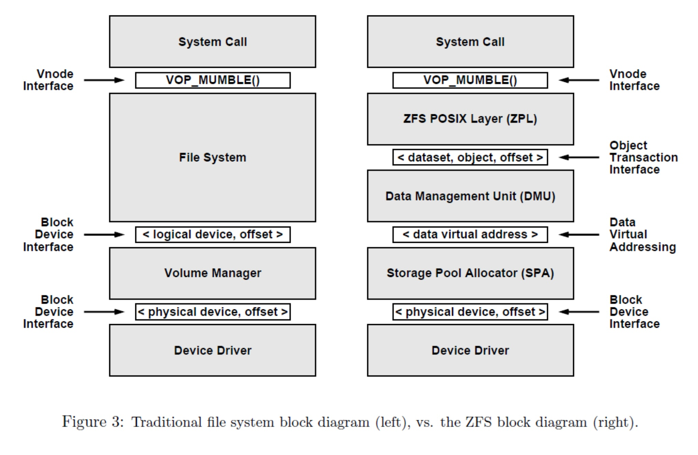  

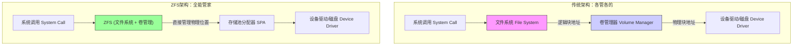

-----

### 2\. RAID 与 “写漏洞” (RAID & The Write Hole)

你需要了解RAID（独立磁盘冗余阵列）的基本概念，即通过多块磁盘实现速度提升或数据冗余 。

  * **关键概念：**
      * **Striping (条带化):** 把数据切分存到不同盘，提速。
      * **Redundancy (冗余):** 存多份数据或校验码，防坏盘。
      * **JBOD (Just a Bunch of Disks):** 仅仅是一堆磁盘的集合，没有RAID保护 。

**核心痛点 - Write Hole (写漏洞):**
这是理解ZFS为何强大的关键。在传统RAID 5中，写入数据需要更新“数据块”和“校验块”。如果在写完数据块但还没来得及写校验块时突然断电，数据就不一致了。传统RAID无法原子性地（Atomically）完成这两步操作 。

> **ZFS的解法：** ZFS引入了 **RAID-Z**，这是一种通过变长条带（variable stripe width）来彻底解决写漏洞的软件RAID方案 。

-----

### 3\. 数据完整性与静默错误 (Data Integrity & Silent Corruption)

许多人认为硬盘只有“坏了”和“没坏”两种状态。但实际上，你需要了解一种可怕的情况：**静默错误 (Silent Data Corruption)**。

  * **什么是静默错误？** 磁盘可能会发生位翻转（Bit rot），或者固件由于Bug把数据写到了错误的地方，甚至读取时返回了错误的数据，而操作系统通常并不知道 。
  * **传统做法：** 依靠硬盘自带的扇区校验。但这不够，因为它防不住控制器错误或传输错误 。

**ZFS的核心机制 - 默克尔树 (Merkle Tree):**
文档第12页展示了ZFS如何解决这个问题。ZFS不仅校验数据本身，还把校验和（Checksum）保存在 **父块（Parent Block）** 中 。

**图解校验机制 (基于 Slide 12 ):**

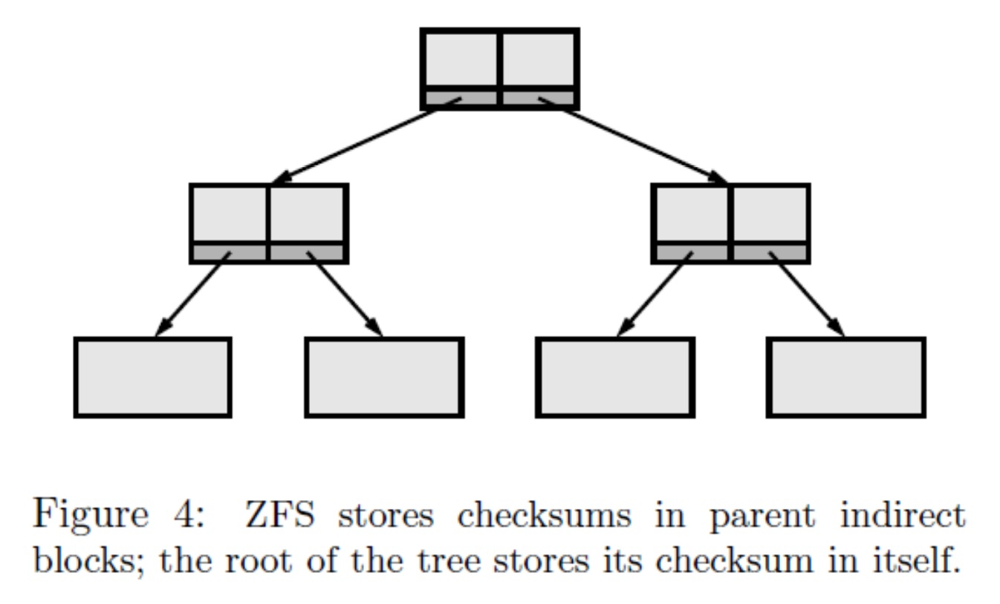  

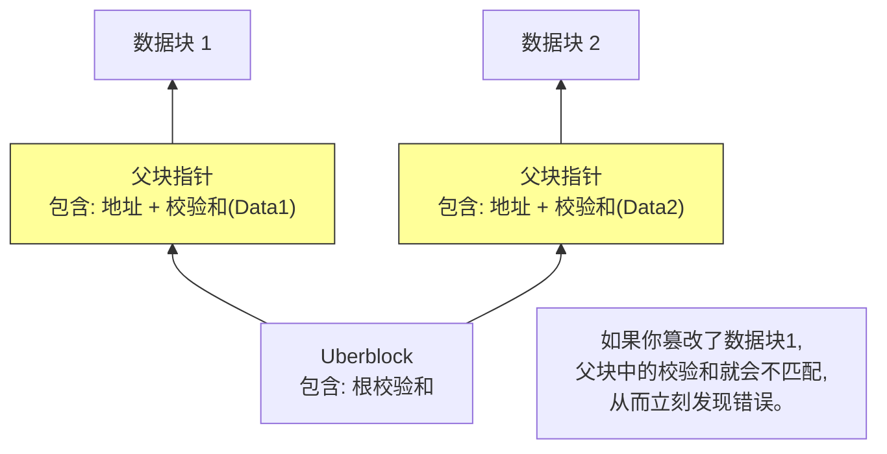

-----

### 4\. 写时复制 (Copy-on-Write, CoW) 与 事务 (Transaction)

这是ZFS最颠覆性的概念。在传统文件系统中，修改文件通常是“覆盖”旧数据（Overwrite）。为了防止覆盖一半断电导致损坏，传统系统使用**日志 (Journaling)** 。

**基础知识：**

  * **Journaling:** 先把“我要改什么”记在小本本（日志）上，然后再去改数据。如果崩溃了，重启时查小本本重做。
  * **Copy-on-Write (CoW):** ZFS不使用传统的覆盖写，也不完全依赖日志。

**通俗解释 CoW (基于 Slide 17 ):**  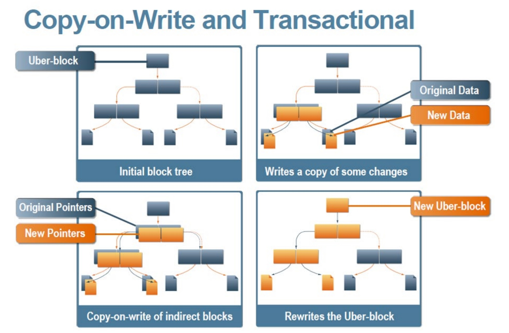  
想象你在编辑一份文档：

1.  **传统方式：** 直接在原件上涂改。如果涂改一半停电，原件就废了。
2.  **ZFS (CoW) 方式：**
      * 你不碰原件。
      * 你把要修改的内容复制一份到新的空白纸上进行修改。
      * 修改完成后，你把“目录”指向这张新纸。
      * 这一步“切换指针”是瞬间完成的（原子性操作），要么成功，要么失败，不会有“半成”状态 。

**CoW带来的额外福利 - 快照 (Snapshots):**
因为旧数据没有被覆盖，如果你保留指向旧数据的指针，你就免费得到了一个“快照”（Snapshot）。这在ZFS中几乎不占用额外空间，且速度极快 。

-----

### 总结

要在阅读这篇论文时游刃有余，请确保你脑海中有这幅对比画面：

| 特性 | 传统系统 (Old School) | ZFS (The New Way) |
| :--- | :--- | :--- |
| **管理方式** | 它是拼装积木 (FS + LVM + RAID) | 它是整体成型 (FS与卷管理融合) |
| **修改数据** | 原地覆盖 (Overwrite) + 日志救急 | 写到新位置 (CoW) + 原子切换 |
| **信任机制** | 信任硬盘硬件 | 谁都不信，全盘校验 (Checksum) |
| **扩容** | 痛苦，层级之间难协调 | 轻松，向池子(Pool)里扔硬盘即可 |

**下一步建议：**
如果你准备好了，我可以为你详细解读文档中关于 **“ZFS Block Pointer (ZFS块指针)”** 的结构图（Slide 13），这是ZFS实现上述所有神奇功能的最底层数据结构。需要我这样做吗？  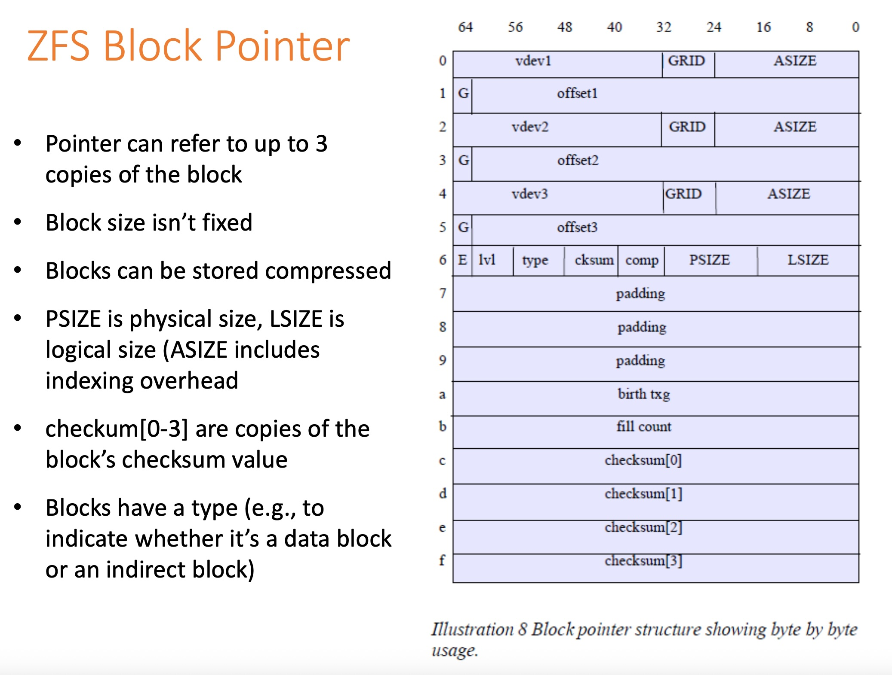  
  
## 2 解读论文 
  
这份文档（基于Module 14.0的课程幻灯片）介绍了 **ZFS (Zettabyte File System)** 的设计理念和核心架构。ZFS 不仅仅是一个文件系统，它是一次对传统存储架构的彻底重构。

为了让你通俗易懂地理解这篇论文/课件，我将内容拆解为四个最核心的“颠覆性”设计，并配合图解进行说明。

### 1\. 架构革命：打破“千层饼”模式 (Merged Layering)

**传统痛点：**
在 ZFS 出现之前（约2003年），存储系统像千层饼一样分层：最底层是物理硬盘，中间是卷管理器（LVM，用来把几个硬盘拼成一个大的逻辑盘），最上层才是文件系统（如 ext4, NTFS）。
这种分层导致了沟通障碍：文件系统不知道底层的硬盘结构，LVM 也不知道上层存了什么文件。当你扩容或调整大小时，往往非常痛苦且容易出错 。

**ZFS 的解法：**
ZFS **同时扮演了文件系统和卷管理器** 的角色 。它直接管理物理硬盘，并将它们整合成一个巨大的“存储池”（Storage Pool）。

  * **传统架构 vs. ZFS架构：**


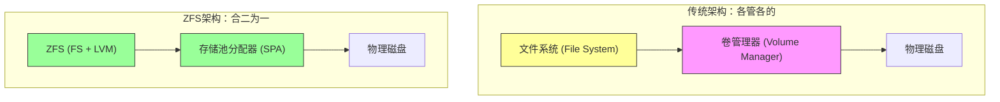

文档指出，ZFS 的目标之一就是解决物理设备、逻辑设备和文件系统之间复杂的相互作用 。在 ZFS 中，你不再需要通过繁琐的 LVM 命令来扩容，只需向池中添加硬盘，文件系统空间就会自动增长。

### 2\. 数据完整性：连硬盘自己都不信 (End-to-End Data Integrity)

**传统痛点：**
传统的 RAID 或硬盘只能检测简单的错误。如果硬盘悄悄地把数据写错了（位翻转），或者读的时候读错了位置（静默错误），传统文件系统是完全不知道的，直到你打开文件发现乱码 。

**ZFS 的解法：**
ZFS 假设硬盘是不可靠的。它引入了 **端到端校验（End-to-End Checksums）** 。

  * **校验和存在哪里？**
    这是 ZFS 最天才的设计：**数据块的校验和（Checksum）不保存在数据块自己里面，而是保存在指向它的“父块指针”里** 。
    这就构成了一棵 **默克尔树（Merkle Tree）** 。只有最顶层的“Uberblock”（超级块）保存自己的校验和。

  * **校验流程图解：**


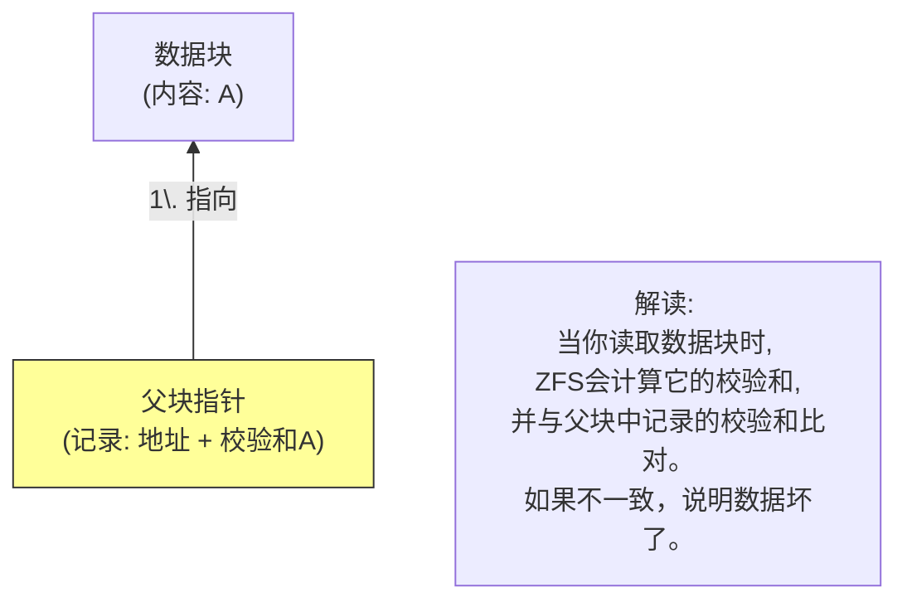

如果 ZFS 发现校验和不匹配，且你做了冗余（比如镜像 Mirror 或 RAID-Z），它不仅会报错，还会**自动修复**（Self-healing），从好的副本读取正确数据并覆盖坏的数据 。

### 3\. 事务模型：写时复制 (Copy-on-Write, CoW)

**传统痛点：**
传统文件系统修改文件时，通常是直接覆盖（Overwrite）旧数据。如果覆盖到一半突然断电，数据就损坏了。为了防止即使，传统系统需要复杂的日志（Journaling）机制，重启后还要跑很久的 `fsck` 来修复文件系统 。

**ZFS 的解法：**
ZFS **永远不覆盖（Never Overwrite）** 正在使用的数据 。它使用 **写时复制（Copy-on-Write）** 机制。

  * **如何修改数据？**

    1.  **写新地盘：** 当你要修改数据块 A，ZFS 会找一块新的空白区域写入新数据 A'。
    2.  **改父节点：** 因为 A' 的位置变了，指向它的父节点也需要更新指针和校验和。父节点也通过 CoW 复制一份新的。
    3.  **一路向上：** 这种变化会一直向上传递到根节点。
    4.  **原子切换 (Uberblock Update)：** 最后，ZFS 只需要更新最顶层的 **Uberblock** 指向新的根节点。这个操作是原子的（瞬间完成）。

  * **CoW 流程图解：**


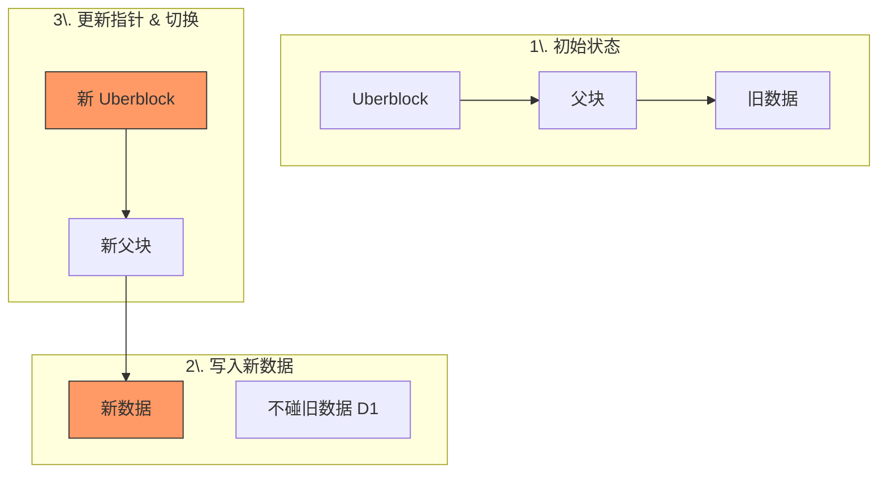

这种机制保证了**文件系统在磁盘上永远是一致的** 。无论何时断电，旧的 Uberblock 指向的仍然是一棵完整有效的旧树，完全不需要运行 `fsck`。

### 4\. 免费的“时间机器”：快照 (Snapshots)

基于 CoW 机制，ZFS 的**快照（Snapshot）** 功能变得极其强大。

  * **原理：**
    既然修改数据时旧数据没有被覆盖，那么只要我们保留旧的 Uberblock 不删，我们就拥有了过去那个时刻的文件系统视图 。
  * **优势：**
      * **瞬间创建：** 不需要拷贝数据，只需要记录一下当前的根节点。
      * **初始不占空间：** 快照刚创建时大小为 0。只有当你修改了现有数据，新数据写入新块，旧数据因为被快照引用而保留时，空间才会增加 。

### 总结 (Summary)

《ZFS The Zettabyte File System》这篇文档展示了 ZFS 如何通过以下关键技术重新定义了存储：

1.  **存储池 (Pooling)：** 像管理内存一样管理磁盘空间，彻底解决了分区和扩容的烦恼。
2.  **数据校验 (Checksums)：** 以前所未有的严格程度保护数据，防止静默腐烂。
3.  **写时复制 (CoW)：** 让文件系统天然具备事务性，无需 `fsck`，并带来了极其高效的快照功能。

正如文档标题所言，ZFS 是为**Zettabyte（泽字节）** 时代设计的，它的架构（128位文件系统）足以应对未来呈指数级增长的存储需求 。
  
## 3 术语 
  
基于提供的文档《ZFS: The Zettabyte File System》，我为你提取了 ZFS 中最核心的术语。为了让你轻松理解，我将它们分为了**核心机制**、**数据完整性**和**架构组件**三个部分进行通俗讲解。

-----

### 一、 核心机制类术语

#### 1\. Copy-on-Write (CoW, 写时复制)

这是 ZFS 的灵魂。传统文件系统修改文件时，通常是直接在原来的位置“涂改”旧数据（Overwrite），如果涂改到一半断电，数据就坏了。

  * **通俗解释：** ZFS 从不修改旧数据。当你保存文件时，ZFS 会找一片新的空白区域把新数据写进去，然后把“指针”指向新位置。旧数据要么被丢弃（垃圾回收），要么保留下来作为“快照”。
  * **文档佐证：** ZFS 的更新就像原子操作一样，要么全成功，要么像没发生过一样 。


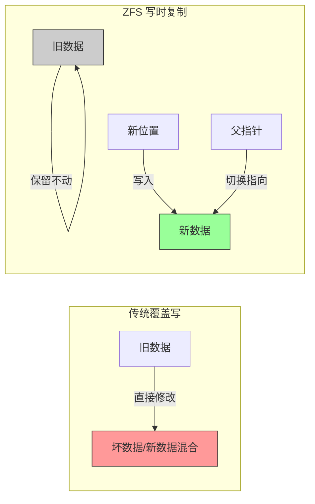

#### 2\. Snapshot (快照)

得益于 CoW 机制，ZFS 的快照极其廉价且迅速。

  * **通俗解释：** 快照就是一张“时间冻结”的照片。因为 ZFS 修改数据时不覆盖旧块，只要我们命令 ZFS “不要释放那些旧块”，你就瞬间得到了一个历史备份。
  * **特点：** 创建快照是常数时间操作（瞬间完成），且初始不占用额外磁盘空间 。只有当原来的文件被修改，新数据占用了新空间，旧数据占用的空间才会被计入快照大小 。

#### 3\. RAID-Z

这是 ZFS 特有的类似 RAID-5 的数据保护机制，但专门修复了传统 RAID 的致命弱点。

  * **关键痛点：** 传统 RAID 存在“写漏洞”（Write Hole），即断电可能导致数据与校验码不一致 。
  * **通俗解释：** RAID-Z 使用变长条带（Variable Stripe Width）写入数据。它不需要像传统 RAID 那样“读取-修改-写入”，而是将新数据和校验码作为一次完整的事务写入新位置，彻底解决了断电导致的数据不一致问题 。

-----

### 二、 数据完整性类术语

#### 4\. Checksum (校验和) & Merkle Tree (默克尔树)

ZFS 对数据的信任度为零，它假设硬盘随时可能骗它。

  * **关键设计：** 传统文件系统的校验和通常放在数据块内部。ZFS 不同，**它把校验和放在指向这个块的“父块”里** 。
  * **通俗解释：**
      * 这就好比发快递：传统方式是包裹里有一张纸条写着“重量1kg”，小偷可以换了东西重写纸条。
      * ZFS 的方式是：**你手里**（父块）拿着一张单子，写着“包裹应该是1kg”。等你收到包裹（子块）一称，发现不对，立马就知道出问题了。
  * **自我修复：** 当发现校验错误时，ZFS 会利用镜像或 RAID-Z 中的冗余副本自动修复数据 。

**图解校验树结构 ：**

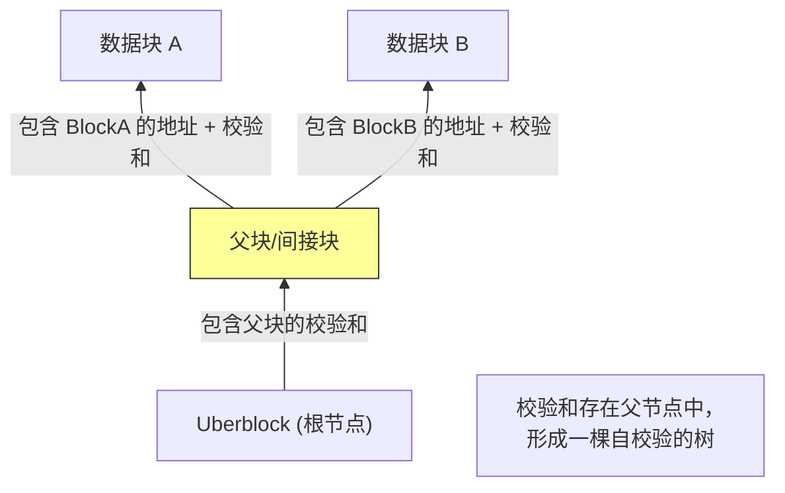

#### 5\. Uberblock (超级块)

整个 ZFS 文件系统的“树根”。

  * **通俗解释：** 它是进入 ZFS 文件系统的唯一入口。由于 ZFS 使用写时复制，每次写入都会生成新的数据块和新的父块，最终导致生成一个新的 Uberblock。
  * **机制：** 硬盘上保留了多个 Uberblock 槽位，更新时会轮询写入 。系统启动时，ZFS 会寻找那个最新的、校验通过的 Uberblock 来加载文件系统。

-----

### 三、 架构组件类术语

文档第 9 页展示了 ZFS 独特的软件架构，打破了传统文件系统和卷管理器（LVM）的界限 。

  

#### 6\. SPA (Storage Pool Allocator, 存储池分配器)

  * **位置：** ZFS 的最底层 。
  * **通俗解释：** 它是硬盘的大管家。在传统系统中，你需要决定把文件存到“C盘”还是“D盘”。在 ZFS 中，SPA 把所有硬盘（物理卷）通过镜像、拼接等方式揉成一个巨大的“水池”（Pool）。上层只需要从池子里舀水（申请空间），完全不用关心水是从哪个水龙头（硬盘）流出来的 。

#### 7\. DMU (Data Management Unit, 数据管理单元)

  * **位置：** 位于 SPA 之上 。
  * **通俗解释：** 它是对象管理器。SPA 只管硬盘块，DMU 则把这些块组织成“对象”（Object）。它负责处理事务、快照、克隆等高级功能。它不关心这些对象是文件还是文件夹，它只把它们看作一堆有结构的数据。

#### 8\. ZPL (ZFS POSIX Layer)

  * **位置：** 最上层，直接与操作系统接口对接 。
  * **通俗解释：** 它是翻译官。操作系统（如 Linux/Unix）习惯用 POSIX 标准（打开文件、读写文件）来交流。ZPL 把这些标准的指令翻译成 DMU 能听懂的“对象操作”指令。我们平时看到的“文件”和“目录”，就是 ZPL 呈现给我们的样子。

#### 9\. vdev (Virtual Device, 虚拟设备)

  * **通俗解释：** 构成存储池的基本积木。一个 vdev 可以是一块物理硬盘，也可以是一个由两块硬盘组成的“镜像组合”，或者是由多块硬盘组成的“RAID-Z 组合” 。
  * **层级关系：** 硬盘 (Disk) ➜ 虚拟设备 (vdev) ➜ 存储池 (Pool) ➜ 文件系统 (ZFS)。
  
## 参考        
         
https://courses.cs.washington.edu/courses/cse451/20sp/lectures/14.0-zfs.pdf    
        
<b> 以上内容基于DeepSeek、Qwen、Gemini及诸多AI生成, 轻微人工调整, 感谢杭州深度求索人工智能、阿里云、Google等公司. </b>        
        
<b> AI 生成的内容请自行辨别正确性, 当然也多了些许踩坑的乐趣, 毕竟冒险是每个男人的天性.  </b>        
  
    
#### [PolarDB 学习图谱](https://www.aliyun.com/database/openpolardb/activity "8642f60e04ed0c814bf9cb9677976bd4")
  
  
#### [PostgreSQL 解决方案集合](../201706/20170601_02.md "40cff096e9ed7122c512b35d8561d9c8")
  
  
#### [德哥 / digoal's Github - 公益是一辈子的事.](https://github.com/digoal/blog/blob/master/README.md "22709685feb7cab07d30f30387f0a9ae")
  
  
#### [About 德哥](https://github.com/digoal/blog/blob/master/me/readme.md "a37735981e7704886ffd590565582dd0")
  
  

  
