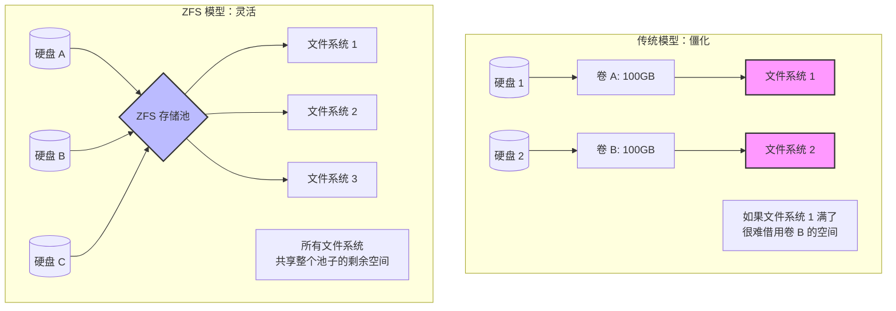
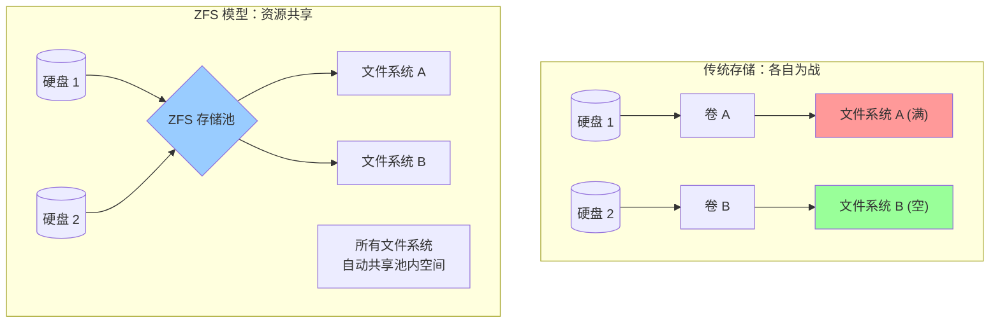
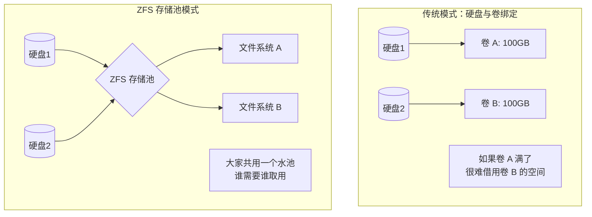
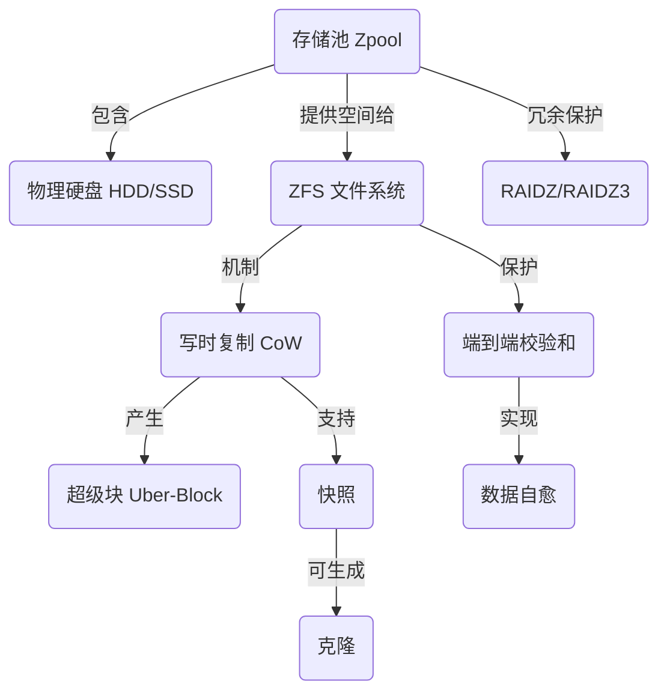

## AI论文解读 | Oracle Solaris ZFS Data Management
        
### 作者        
digoal        
        
### 日期        
2025-11-22        
        
### 标签        
PostgreSQL , PolarDB , DuckDB , AI , 论文解读        
        
----        
        
## 背景  
      
https://www.oracle.com/technetwork/server-storage/solaris11/documentation/oraclesolariszfsstoragemanagement-360232.pdf        
  
提示:          
```          
读懂《Oracle Solaris ZFS Data Management》这篇论文需要提前掌握哪些基础知识, 请使用中文通熟易懂的讲解这些基础知识, 可以引用论文中的图、表或使用Markdown支持的图形(text,mermaid等)增加解释性. 
  
使用中文通熟易懂的解读《Oracle Solaris ZFS Data Management》这篇论文, 其中的关键内容请着重讲解, 可以引用论文中的图、表或使用Markdown支持的图形(text,mermaid等)增加解释性. 
  
提取《Oracle Solaris ZFS Data Management》这篇论文中的重要术语, 使用中文对这些术语进行通熟易懂的讲解, 可以引用论文中的图、表或使用Markdown支持的图形(text,mermaid等)增加解释性. 
```     
  
## 1 前置知识 
  
要读懂《Oracle Solaris ZFS Data Management》这篇白皮书，你需要理解 ZFS 旨在解决传统存储痛点的设计理念。这篇文档主要讨论了 ZFS 如何将文件系统与卷管理器结合 ，以及它如何保证数据完整性 。

为了让你更轻松地理解，我整理了以下五个核心基础知识模块：

### 1\. 传统存储架构 vs. 存储池模型 (Pooled Storage)

**基础概念：**
在 ZFS 出现之前，管理存储就像“切蛋糕”。你需要先把物理硬盘划分成固定的分区（Partition）或卷（Volume），然后在上面创建文件系统。如果你分给某个数据库的卷空间不够了，想要扩容是非常麻烦且有风险的 。

**ZFS 的创新：**
ZFS 引入了“存储池”（Storage Pool）的概念。它不再预先划分空间，而是把所有硬盘扔进一个大水池里，所有文件系统共享这个池子的空间。



  * **文档对应点：** 论文提到 ZFS 只需要两个命令就能创建池和文件系统 ，并且不仅简化了管理，还消除了传统卷管理器的复杂层级 。

-----

### 2\. 写时复制 (Copy-on-Write, CoW)

**基础概念：**
大多数传统文件系统在修改文件时，是直接覆盖旧数据（Overwrite）。

  * **风险：** 如果在覆盖写入的过程中突然断电，数据就会损坏，处于“不新不旧”的中间状态 。

**ZFS 的创新：**
ZFS 永远不覆盖旧数据。当你修改数据时，它会把新数据写入到一块新的空白区域，然后把指针指向新位置。只有新数据确认为“写好了”，它才会更新引用。

  * **通俗解释：** 就像写作业，传统方式是用橡皮擦掉旧答案写新的（容易擦破纸）；ZFS 是在旁边空白处写新答案，写完确认无误后，再把目光移过去。
  * **文档对应点：** 论文明确指出 ZFS 修改数据时绝不覆盖现有数据 。

**论文中的图解逻辑 (参考 Figure 1 ):**    
ZFS 会创建一个新的数据块（New Data Block），然后创建一个新的父级块（Uber-Block）来指向这个新结构，从而保证数据始终一致 。

-----

### 3\. 数据完整性与校验和 (Checksums & Bit Rot)

**基础概念：**

  * **静默数据损坏 (Bit Rot)：** 硬盘上的磁性介质可能会随着时间衰退，导致“0”变成了“1”。传统文件系统通常无法察觉这种微小的错误，直到你打开文件发现乱码。
  * **RAID (磁盘阵列)：** 为了防止硬盘物理损坏，我们通常把多块硬盘组合起来（如镜像 Mirroring 或 RAID 5/6）。

**ZFS 的创新：**
ZFS 不仅使用 RAID 保护硬盘故障，还使用“端到端校验和” (End-to-End Checksums) 来防止静默损坏。

  * **主要区别：** 传统系统把校验码和数据放在一起。ZFS 把校验码放在**父块**（Parent Block）中 。这就像是一棵树，树枝（父块）手里拿着树叶（数据块）的指纹，如果树叶变了，树枝马上就能发现。
  * **自愈 (Self-Healing)：** 如果 ZFS 发现读取的数据校验对不上，它会自动从镜像盘里读取正确的数据，并修复那个损坏的块 。

-----

### 4\. 快照与克隆 (Snapshots & Clones)

**基础概念：**

  * **快照：** 系统的“时间冻结”备份。
  * **痛点：** 在传统系统中，做快照可能需要把所有数据复制一遍，非常占空间且慢。

**ZFS 的创新：**
得益于前面提到的 **CoW (写时复制)**，ZFS 的快照几乎是瞬间完成的，而且一开始不占任何额外空间 。

  * **原理：** 因为旧数据本身就不被覆盖，ZFS 只需要告诉系统：“别释放这些旧数据块，我要留着做快照”。
  * **克隆：** 克隆就是把快照变成一个可写的系统。这对云环境、开发测试环境非常有用，可以瞬间复制出几十个操作系统供开发人员使用 。

-----

### 5\. 存储分层 (SSD 缓存与混合存储)

**基础概念：**

  * **RAM (内存)：** 极快，断电数据丢失，昂贵。
  * **SSD (固态硬盘)：** 很快，断电数据保留，较贵。
  * **HDD (机械硬盘)：** 较慢，容量大，便宜。

**ZFS 的创新：**
ZFS 能够智能地利用 SSD。

  * **L2ARC (读缓存)：** 把经常读取的热数据自动放到 SSD 上，加速读取 。
  * **ZIL (写日志)：** 把需要快速写入的数据先扔给 SSD（就像把急件先扔进快速通道），然后再慢慢整理到机械硬盘上 。
  * **文档对应点：** 论文提到 ZFS 不仅仅把 SSD 当作快一点的磁盘，而是将其作为智能的读写缓存集成在存储池中 。

-----

### 总结：你需要关注的关键词

在阅读论文时，当你看到以下词汇，请联想上述的基础知识：

| 论文关键词 | 对应的基础知识 | 简单理解 |
| :--- | :--- | :--- |
| **Pooled Storage** | 存储池模型 | 像用水池里的水一样使用硬盘空间，不再切蛋糕。 |
| **Copy-on-Write (CoW)** | 写时复制 | 永远不覆盖旧数据，保证断电也不坏，快照秒级完成。 |
| **Checksum / End-to-End** | 校验和 | 给数据按指纹，防止数据偷偷变质。 |
| **RAIDZ / RAIDZ3** | ZFS 版的 RAID | ZFS 特有的硬盘冗余技术，允许坏 1-3 块盘 。 |
| **Deduplication** | 重复数据删除 | 自动发现并删除重复的数据块以节省空间 。 |

### 下一步建议

**您希望我为您详细拆解论文中关于“ZFS 如何在发生故障时自动修复数据（Self-Healing）”的具体流程吗？** 这可以帮助您更深入理解 ZFS 相比传统 RAID 的核心优势。
  
## 2 解读论文 
  
这份白皮书《Oracle Solaris ZFS Data Management》主要介绍了 Oracle Solaris ZFS 文件系统的核心架构、设计理念以及它如何解决现代数据中心面临的存储难题。

简单来说，ZFS 不仅仅是一个文件系统，它通过“降维打击”，将传统的**卷管理器（Volume Manager）和文件系统**合二为一，彻底改变了数据管理的方式 。

以下是这份文档的深度解读，我将其拆解为几个核心模块来讲解：

### 1\. 核心理念：存储池模型 (Simplified Pooled Storage)

这是 ZFS 与传统存储最大的区别。

  * **传统方式的痛点**：
    以前，管理存储像“切蛋糕”。你需要先把物理硬盘划分成固定的卷（Volume），然后在卷上建立文件系统。如果某个文件系统空间不够了，但另一个卷还有空闲，你很难把空间“借”过来，扩容非常麻烦且容易出错 。

  * **ZFS 的“水池”方案**：
    ZFS 引入了 **Zpool（存储池）** 的概念。它不预先划分空间，而是把所有硬盘扔进一个大池子里。所有的文件系统都浮在这个池子上，共享底层的存储空间 。

      * **优势**：增加硬盘就像往池子里倒水，所有文件系统都能立即利用新增的空间 。




### 2\. 核心技术：写时复制 (Copy-on-Write, CoW)

ZFS 保证数据永远不会“写坏”，靠的就是这个机制。

  * **原理**：当你修改数据时，ZFS **绝对不会覆盖**旧数据块 。
    1.  它会在磁盘空白处写入新数据。
    2.  写入成功后，它会修改指向数据的指针，使其指向新位置。
    3.  最后更新最顶层的“超级块”（Uber-Block） 。
  * **好处**：即使在写入瞬间断电，旧数据依然完好无损，系统不需要漫长的磁盘检查（fsck） 。这也让“快照”功能变得极其高效。

### 3\. 数据完整性：端到端校验 (End-to-End Checksums)

这是 ZFS 的“杀手锏”，用于防止 **静默数据损坏（Silent Data Corruption）** 。

  * **传统做法**：校验码通常和数据放在一起，如果有错误，可能无法发现是数据坏了还是校验码坏了 。
  * **ZFS 做法**：ZFS 采用“父块校验子块”的树状结构。
      * **树状校验**：每一个数据块的校验和，都保存在它的**父块**（Parent Block）中，一直向上追溯到根节点 。
      * **自愈能力 (Self-Healing)**：当 ZFS 读取数据时，会计算校验和并与父块对比。如果发现不一致（说明数据坏了），它会自动从镜像盘或校验盘中读取正确副本，并**自动修复**那个损坏的块 。

**图解 ZFS 树状校验结构 (基于论文 Figure 1 )**    

ZFS 的数据像一棵倒立的树，最上面的 Uber-Block 锁定了整棵树的正确性。

```text
[ Uber-Block (包含指向下级的校验和) ]
        |
   [ 指针块 (包含数据块的校验和) ]  <-- 校验和存在这里，而不是数据块里
        |
   [ 数据块 Data ]
```

### 4\. 强大的数据服务 (Data Services)

ZFS 自带了许多昂贵存储阵列才有的高级功能：

#### A. 快照与克隆 (Snapshots & Clones)

  * **快照**：因为是“写时复制”，创建快照不需要复制数据，只是记录一下当前的时间点引用。因此，快照几乎是**瞬时**的，且一开始**不占空间** 。
  * **克隆**：可以将快照变成一个可读写的新文件系统，非常适合云环境和开发测试（例如瞬间克隆出几十个测试环境） 。

#### B. 启动环境 (Boot Environments)

  * 这是 Oracle Solaris 11 的一大特色。利用 ZFS 快照，你可以在系统升级前瞬间创建一个备份。如果升级失败，重启并选择旧的启动环境即可回滚，风险极低 。

#### C. 数据缩减 (Data Reduction)

  * **压缩 (Compression)**：ZFS 提供透明压缩，通常能节省 3 倍的空间，甚至因为写入的数据量变少了，反而能提高 I/O 性能 。
  * **重复数据删除 (Deduplication)**：自动识别并只存储一份相同的数据块。虽然能极大省空间，但文档建议要确保系统有足够的内存才开启，因为这对性能有要求 。

### 5\. 扩展性与 SSD 混合存储

  * **无限扩展**：ZFS 是 128 位文件系统，理论上几乎没有容量限制 。
  * **SSD 智能加速**：ZFS 不仅仅把 SSD 当作快一点的硬盘，而是将其用作**缓存** 。
      * **读缓存 (L2ARC)**：把热数据自动存入 SSD，加速读取 。
      * **写日志 (ZIL)**：利用 SSD 低延迟特性加速同步写入操作 。

### 6\. RAIDZ：更安全的磁盘阵列

随着硬盘容量越来越大（例如 10TB+），通过校验重建数据的时间变得很长，这期间如果再坏一块盘就全完了 。

  * ZFS 支持 **RAIDZ3**（三重奇偶校验），允许同时损坏 **3块** 硬盘而不丢失数据，比传统的 RAID 5 或 RAID 6 更安全 。

### 总结

**《Oracle Solaris ZFS Data Management》** 的核心思想是：
通过**软件定义存储**的方式，用通过简单的命令（如 `zpool create` 和 `zfs create` ），替代了复杂的硬件控制器和卷管理层。它提供了端到端的**数据完整性保护**、极高的**扩展性**以及内建的**快照、压缩、加密**  功能，是构建企业级云存储和数据中心的坚实基础。

**下一步建议：**
如果您是系统管理员，文档最后建议您可以尝试使用 Oracle ZFS Storage Appliance，它将上述 ZFS 功能封装成了带有图形化界面的存储设备，并集成了 DTrace 分析工具 。
  
## 3 术语 
  
这份文档《Oracle Solaris ZFS Data Management》中包含许多核心技术术语。为了帮助您透彻理解，我提取了最重要的术语，并结合生活中的类比与图解为您进行通俗解读。

### 1\. 存储池 (Storage Pool / Zpool)

  * **通俗解释**：
    传统的存储管理像是在“切蛋糕”，你必须先把硬盘切成一块块固定的分区（卷），如果哪一块不够吃了，很难从别处补。
    **存储池**则像是把所有硬盘的水都倒进一个“大水缸”里。文件系统不再直接对应某块硬盘，而是浮在这个水缸上。只要水缸里还有水（空间），所有的文件系统都可以随意取用，不需要预先分配大小 。

  * **核心优势**：简化管理。只需一条命令即可创建池，且所有文件系统共享池内的物理存储与性能资源 。




### 2\. 写时复制 (Copy-on-Write, CoW)

  * **通俗解释**：
    大多数文件系统修改文件时，是直接在原位置“涂改”（覆盖旧数据）。如果涂改到一半停电了，数据就坏了。
    **ZFS 的写时复制**则是“另起一行”。当你修改数据时，ZFS 会找一块新的空白区域写下新数据。只有新数据写完并确认无误后，它才会把目录的指针指向新位置 。

  * **核心优势**：数据永远不会处于“不新不旧”的损坏状态，保证了极高的数据完整性 。

  * **图解逻辑 (基于文档 Figure 1)**：    

    1.  **不覆盖**：修改数据块时，创建新块。
    2.  **更新链条**：因为子块变了，父块也必须更新（指向新地址），一直更新到最顶层的“超级块” (Uber-Block) 。

### 3\. 超级块 (Uber-Block)

  * **通俗解释**：
    它是 ZFS 文件系统的“总目录”或“根节点”。你可以把它想象成一棵大树的树根。只要树根是好的，且指向了正确的树枝（数据结构），整棵树就是有效的。
    由于写时复制机制，ZFS 更新数据时会生成一个新的 Uber-Block。系统会保留旧的 Uber-Block 不删，这就自然形成了“时光机”功能，随时可以跳回旧的状态 。

### 4\. 端到端校验和 (End-to-End Checksums)

  * **通俗解释**：
    传统系统也会检查数据是否损坏，但通常把校验码（指纹）和数据放在一起。如果整个柜子都被破坏了，你连指纹也是错的，就发现不了问题。
    **ZFS 的做法**是“父管子”。每一个数据块的校验码，都保存在它的**父块**（上一级目录）里，而不是它自己身上。这就形成了一棵校验树 。

  * **核心优势**：完全杜绝了“静默数据损坏”（即数据偷偷变质了但系统不知道）。ZFS 读取数据时会计算指纹，如果不匹配，它不仅能发现，还能自动修复 。

### 5\. 自愈数据 (Self-Healing Data)

  * **通俗解释**：
    这是 ZFS 的“自动纠错”功能。当你读取一个文件时，ZFS 会核对校验和。如果发现数据块坏了（校验不通过），它不会报错让你崩溃，而是自动去寻找镜像盘（备份盘）里的正确副本，把正确的数据给你，顺便把坏掉的那个块修好 。

### 6\. RAIDZ / RAIDZ3

  * **通俗解释**：
    这是 ZFS 特有的磁盘阵列技术，比传统 RAID 更强大。
    **RAIDZ3** 是其中的极致版本，它通过三重奇偶校验保护数据。简单来说，即使你的存储池里**同时坏了 3 块硬盘**，数据依然是安全的，系统还能正常运行 。这对于超大容量硬盘（修复时间长，修复期间容易再坏盘）非常重要 。

### 7\. ZFS 快照 (Snapshots) 与 克隆 (Clones)

  * **快照 (Snapshot)**：
      * **解释**：给文件系统拍一张“定妆照”。因为 ZFS 从不覆盖旧数据，拍快照只是记录一下“这一刻所有的旧数据块别删”。
      * **特点**：速度极快，一开始**不占任何空间** 。
  * **克隆 (Clone)**：
      * **解释**：把快照变成一个可以“读写”的新文件系统。
      * **场景**：适合云环境。比如你要给 100 个开发人员每人一个测试环境，不需要复制 100 份系统，只需 1 个快照生成 100 个克隆，瞬间完成且极省空间 。

### 8\. 重复数据删除 (Deduplication)

  * **通俗解释**：
    ZFS 会在数据写入时进行检查。如果你存了 10 份完全相同的文档，ZFS 在硬盘上只会存 **1 份** 物理数据，然后做 10 个标记指向它 。
  * **注意**：这是一个“在线” (Inline) 过程，数据写入时实时去重，不需要等写完后再处理 。

### 9\. 混合存储池 (Hybrid Storage / SSD Caching)

虽然论文未直接使用“混合存储”这个词，但描述了 ZFS 如何智能利用 SSD：

  * **通俗解释**：
    ZFS 不单纯把 SSD 当硬盘用，而是把它当作**加速器**。
      * **写加速**：把需要快速写入的数据先扔进 SSD（写缓存），给应用极低的延迟，然后再慢慢整理到机械硬盘上 。
      * **读加速**：系统会自动学习，把你经常访问的数据预先加载到 SSD（读缓存）里，让你读取飞快 。

### 总结术语关系图


  
## 参考        
         
https://www.oracle.com/technetwork/server-storage/solaris11/documentation/oraclesolariszfsstoragemanagement-360232.pdf    
        
<b> 以上内容基于DeepSeek、Qwen、Gemini及诸多AI生成, 轻微人工调整, 感谢杭州深度求索人工智能、阿里云、Google等公司. </b>        
        
<b> AI 生成的内容请自行辨别正确性, 当然也多了些许踩坑的乐趣, 毕竟冒险是每个男人的天性.  </b>        
  
    
#### [PolarDB 学习图谱](https://www.aliyun.com/database/openpolardb/activity "8642f60e04ed0c814bf9cb9677976bd4")
  
  
#### [PostgreSQL 解决方案集合](../201706/20170601_02.md "40cff096e9ed7122c512b35d8561d9c8")
  
  
#### [德哥 / digoal's Github - 公益是一辈子的事.](https://github.com/digoal/blog/blob/master/README.md "22709685feb7cab07d30f30387f0a9ae")
  
  
#### [About 德哥](https://github.com/digoal/blog/blob/master/me/readme.md "a37735981e7704886ffd590565582dd0")
  
  

  
