## AI论文解读 | The ZFS filesystem on FreeBSD
        
### 作者        
digoal        
        
### 日期        
2025-11-22        
        
### 标签        
PostgreSQL , PolarDB , DuckDB , AI , 论文解读        
        
----        
        
## 背景  
      
https://papers.freebsd.org/2019/COSCUP/philip-ZFS-filesystem.files/The%20ZFS%20filesystem.pdf        
  
提示:          
```          
读懂《The ZFS filesystem on FreeBSD》这篇论文需要提前掌握哪些基础知识, 请使用中文通熟易懂的讲解这些基础知识, 可以引用论文中的图、表或使用Markdown支持的图形(text,mermaid等)增加解释性. 
  
使用中文通熟易懂的解读《The ZFS filesystem on FreeBSD》这篇论文, 其中的关键内容请着重讲解, 可以引用论文中的图、表或使用Markdown支持的图形(text,mermaid等)增加解释性. 
  
提取《The ZFS filesystem on FreeBSD》这篇论文中的重要术语, 使用中文对这些术语进行通熟易懂的讲解, 可以引用论文中的图、表或使用Markdown支持的图形(text,mermaid等)增加解释性. 
```     
  
## 1 前置知识 
  
要读懂 Philip Paeps 的这就名为《The ZFS filesystem》的演讲幻灯片，你并不需要成为一名内核黑客，但理解 ZFS 解决什么问题需要一些**操作系统**和**存储原理**的背景知识。

这份文档主要讨论了 ZFS 如何颠覆了传统的存储架构 。为了让你能顺畅地理解这份材料，我将核心基础知识拆解为以下五个通俗易懂的部分。

-----

### 1\. 文件系统与存储的基本关系

**基础概念**：电脑硬盘像一个巨大的笔记本，**文件系统 (Filesystem)** 就是管理员，决定如何在笔记本上写字（存数据）以及记录哪一页写了什么（元数据）。

  * **传统方式 (Old Way)**：
    在 ZFS 出现之前，我们需要先将硬盘“切蛋糕”一样切成**分区 (Partitions)**，然后在每个分区上建立文件系统。这种方式很死板，想把一块蛋糕变大很难 。
  * **ZFS 的方式 (Storage Pools)**：
    ZFS 不切蛋糕，而是把所有硬盘丢进一个大水池里，叫做**存储池 (Storage Pool)**。文件系统就像是从池子里取水的勺子，想取多少取多少，不需要预先划定界限。

**关联幻灯片**：请查看 **Page 10** 和 **Page 11**。     
* **Page 10** 展示了传统架构的碎片化 。  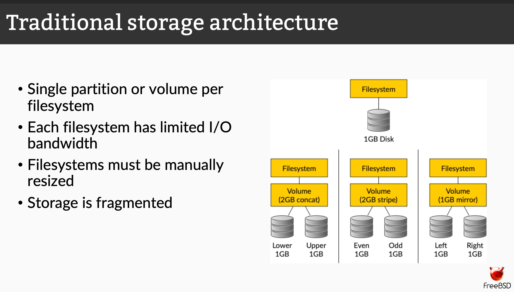   
* **Page 11** 展示了 ZFS 将所有硬盘整合成一个共享带宽和空间的资源池 。  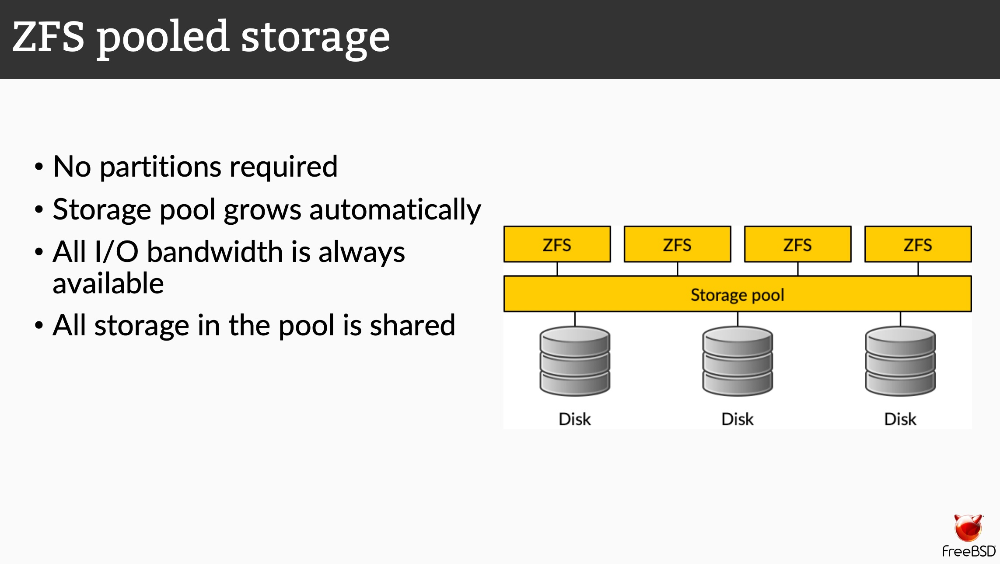   

-----

### 2\. 数据完整性与“静默腐败” (Silent Data Corruption)

**基础概念**：硬盘是不可靠的。虽然硬盘控制器会告诉你“写入成功”，但由于磁介质衰减、固件Bug或线缆干扰，读取出来的数据可能已经变成了乱码（比如 0 变成了 1）。这叫做**比特翻转 (Bit rot)** 。

  * **为什么这很可怕**：传统的 RAID（磁盘阵列）通常无法察觉这种错误。如果你做镜像备份（Mirror），主盘坏了一个比特，控制器单纯地把这个坏比特复制到了备份盘，或者读取时无法判断**哪一个盘的数据才是真的**。
  * **校验和 (Checksum)**：就像给每段数据按个“指纹”。读取数据时，如果指纹对不上，就知道数据坏了。

**ZFS 的绝招：Merkle Tree（默克尔树）**
普通的校验和是把指纹和数据放在一起（就像把答案写在试卷背面），如果整块区域坏了，指纹也坏了，你就发现不了。
ZFS 把指纹存放在**父节点**（上一级目录）中 。

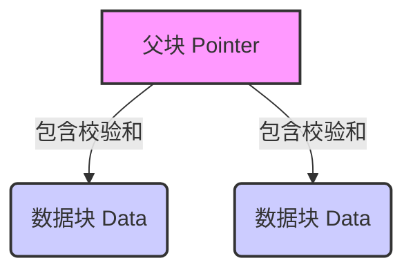

*图解：你必须读取父块 A 才知道 B 的校验和。如果 B 坏了，A 会立刻告诉你不对，而不是 B 自己撒谎说“我是对的”。*

> **关联幻灯片**：请对比 **Page 8**（传统校验，指纹和数据在一起 ）与 **Page 9**（ZFS 校验，指纹在父指针里 ）。

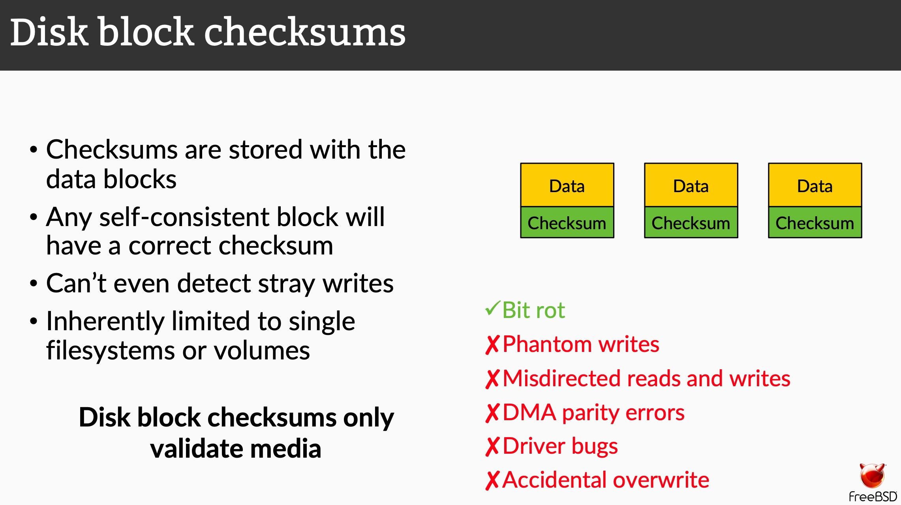   

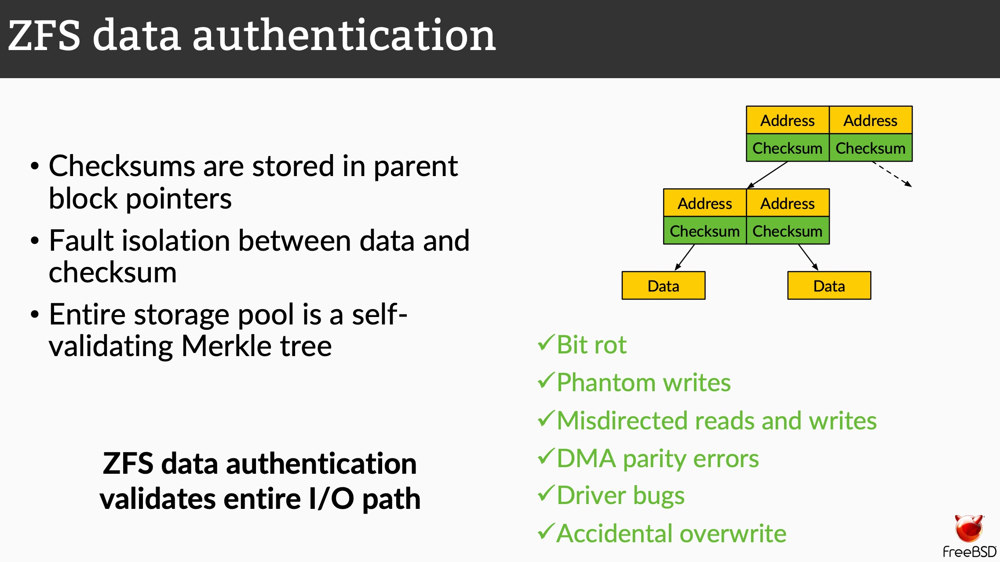   

-----

### 3\. Copy-on-Write (写时复制/COW)

**基础概念**：当你修改一个文件时，传统文件系统通常是直接覆盖旧数据（Overwrite）。

  * **风险**：如果在覆盖的过程中突然断电，新数据没写完，旧数据也被破坏了，文件就彻底损坏了。
  * **COW (ZFS 的核心机制)**：
    ZFS 永远不覆盖旧数据。它会找一块新地方写新数据，等写完确认无误后，再把“指针”指向新地方 。


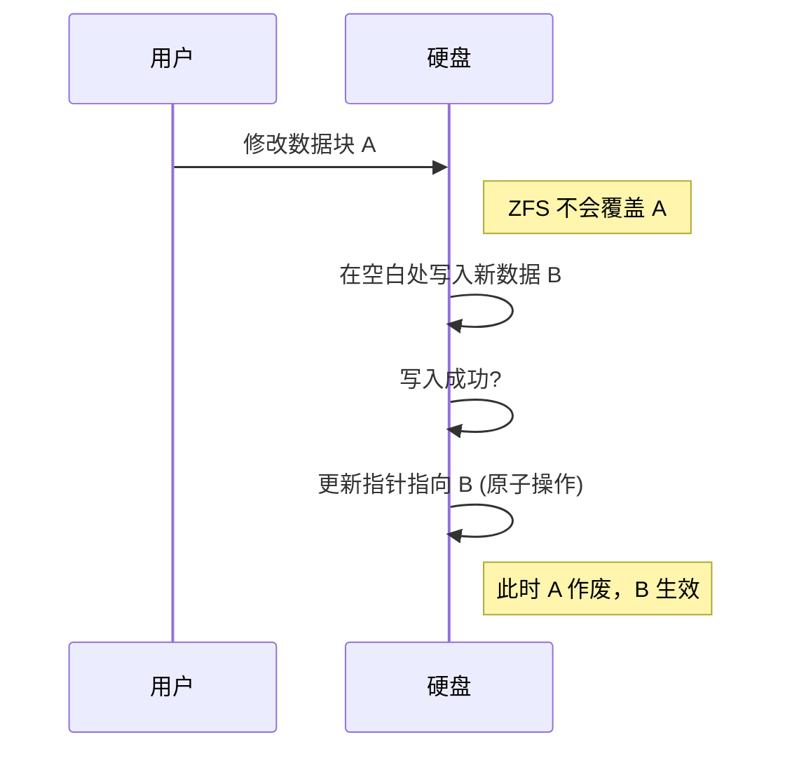

> **关联幻灯片**：**Page 12** 展示了这一过程。哪怕是修改根节点（Uberblock），也是最后一步原子操作，确保文件系统**永远一致** 。

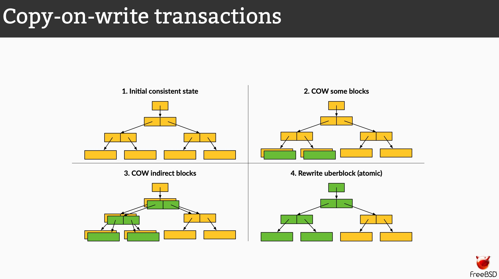   

-----

### 4\. RAID 与 自愈 (Self-Healing)

**基础知识**：RAID 是为了防止硬盘物理损坏而将多块硬盘组合的技术。

  * **RAID 1 (镜像)**：两块盘存一样的数据。
  * **RAID 5/6 (奇偶校验)**：N块盘存数据，1-2块盘存校验信息。

**ZFS 的不同之处**：
传统 RAID 控制器是“瞎”的，它只管硬盘死没死，不管数据对不对。
ZFS 既是文件系统也是卷管理器 。当你读取数据时，如果 ZFS 发现主盘数据校验失败（指纹对不上），它不仅会自动从镜像盘读取正确数据，还会**反手把主盘上的错误数据修好**。

**关联幻灯片**：请重点看 **Page 15** 和 **Page 16** 的对比。
* **Page 15 (传统)**：应用读到坏数据，文件系统崩溃或不仅没发现，还把坏数据给了应用 。  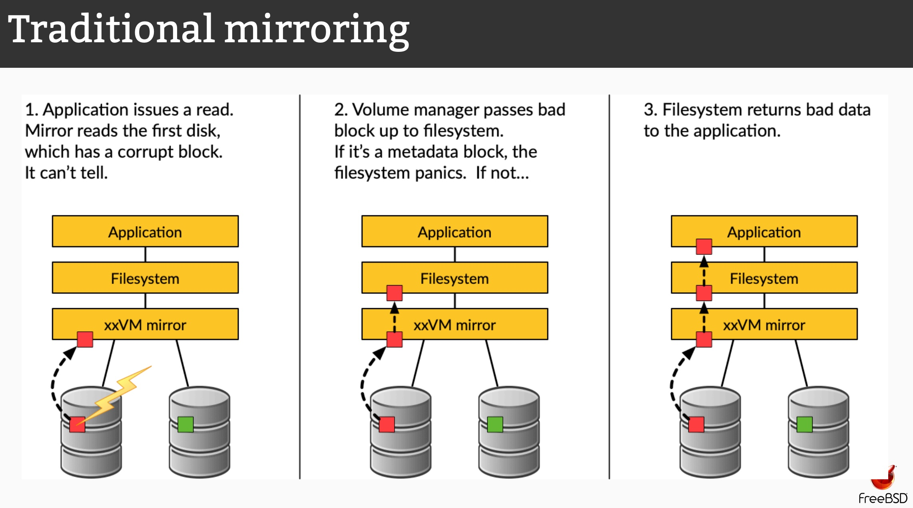   
* **Page 16 (ZFS)**：ZFS 发现坏块 -\> 从好盘读数据 -\> 返回给应用 -\> **修复坏盘** 。  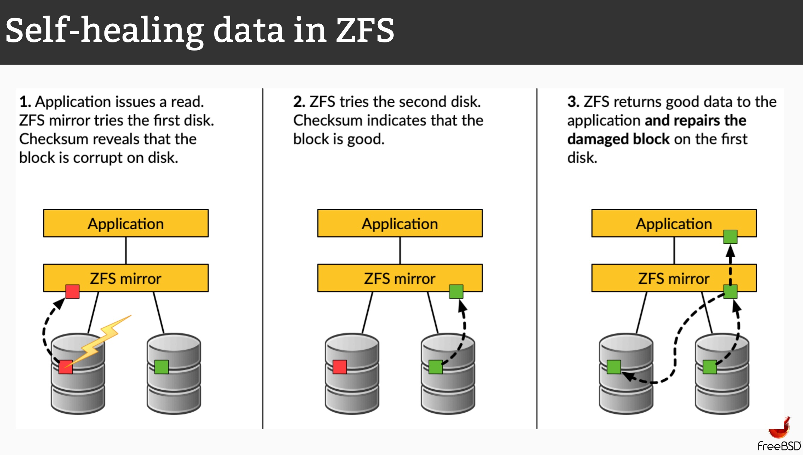   

-----

### 5\. FreeBSD 与 OpenZFS 社区背景

**基础知识**：

  * **FreeBSD**：这是一个历史悠久、以稳定著称的开源操作系统（类似于 Linux，但血统不同，源自伯克利 UNIX）。Netflix 和 Sony PlayStation 都在用它 。
  * **OpenZFS**：ZFS 最初由 Sun 公司开发，后来 Oracle 收购 Sun 并闭源。于是社区分裂出了开源的 OpenZFS 项目。
  * **现状**：FreeBSD 是最早完美支持 ZFS 的开源系统之一 。这篇演讲正是强调在 FreeBSD 上使用 ZFS 的优势。

> **关联幻灯片**：**Page 5** 简述了这段历史 ，**Page 26-28** 讲述了 OpenZFS 项目如何团结各平台防止分裂 。

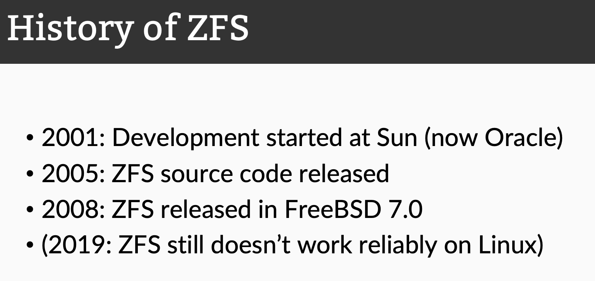   

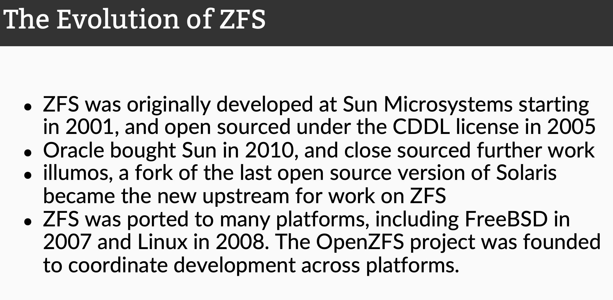   

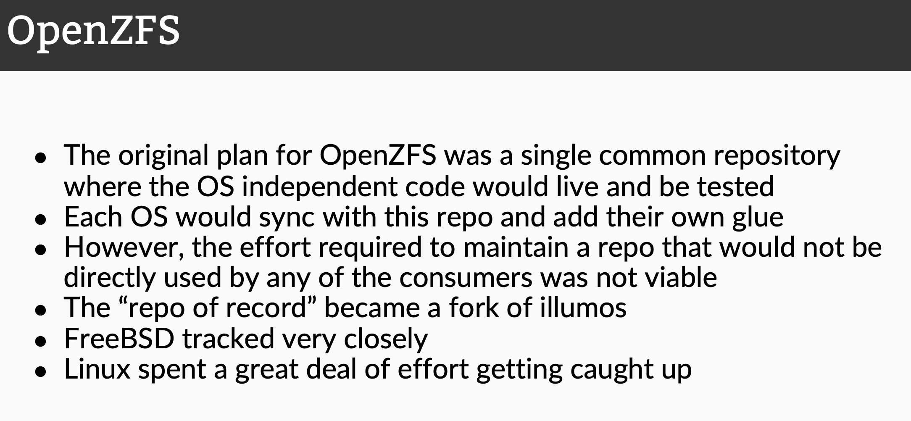   

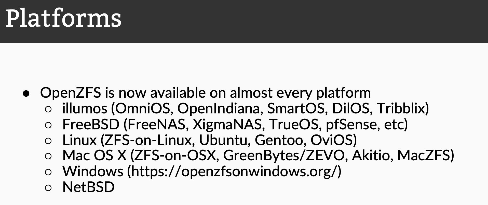   

-----

### 总结：阅读建议

现在你已经具备了基础知识，建议按照以下顺序阅读 PDF：

1.  **浏览 Page 6-7**：快速了解 ZFS 的核心卖点（完整性、池化存储）。  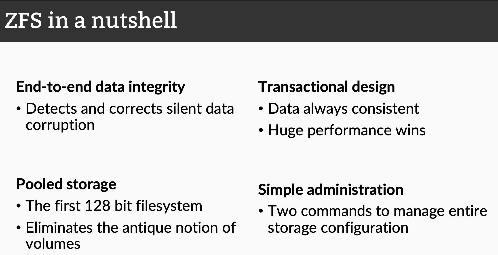   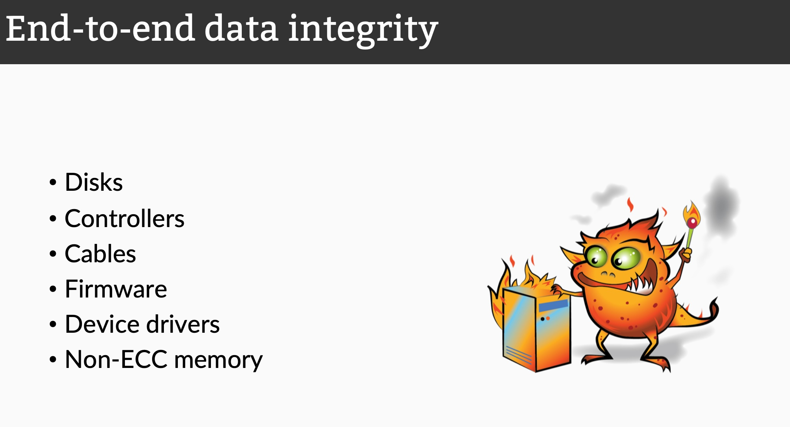   
2.  **精读 Page 8-9 & 15-16**：这是最核心的技术原理（校验与自愈），结合上面的解释看图。               
3.  **略读 Page 17-25**：这是一段演示（Demo）的截图，展示了 `zpool status` 命令如何报告错误。有了上面的知识，你会看懂 `CKSUM` 错误列代表什么 。   
4.  **浏览 Page 26+**：了解 ZFS 的历史和社区现状，知道为什么它被称为 OpenZFS。   

**下一步**：如果你想看具体的实操命令，可以查看 **Page 13**，那里对比了传统复杂的命令（`fdisk`, `newfs`, `fsck`）与 ZFS 简化的命令（`zpool`, `zfs`）。  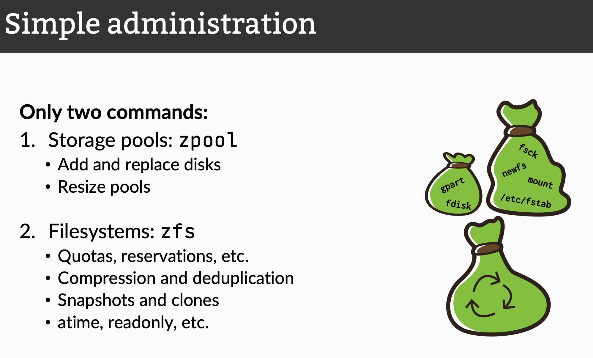  
  
## 2 解读论文 
  
这份名为《The ZFS filesystem》的演示文稿非常精彩，它实际上讲述了一个关于 **“数据信任”** 的故事。这篇文档由 Philip Paeps 在 COSCUP 2019 上展示，主要依托 FreeBSD 操作系统来讲解 ZFS 文件系统的核心理念、强大功能以及 OpenZFS 社区的发展 。

为了让你更轻松地理解，我不照本宣科，而是用通俗的语言带你拆解它的核心逻辑。你可以把 ZFS 想象成一个 **“极度洁癖且强迫症的图书管理员”** 。

-----

### 1\. 为什么我们需要 ZFS？（传统痛点）

在 ZFS 出现之前，存储数据是很麻烦的：

  * **管理复杂：** 你需要先给硬盘分区（Partition），再做逻辑卷（Volume），最后格式化文件系统。如果某个分区空间不够了，调整起来非常痛苦 。
  * **数据不可靠：** 硬盘可能会发生“静默错误”（Bit rot），即数据在磁盘上坏了，但操作系统根本不知道，读出来给你的是乱码，甚至导致系统崩溃 。
  * **RAID 的局限：** 传统的 RAID 只能保护硬盘层面的损坏，但如果损坏发生在控制器、线缆或者驱动程序里，RAID 也救不了你 。

### 2\. ZFS 的三大“黑科技”

ZFS 不仅仅是一个文件系统，它也是卷管理器。文档中着重介绍了以下三个核心概念：

#### A. 存储池 (Pooled Storage) —— "把硬盘丢进大水池"

ZFS 抛弃了传统的“分区”概念。它把所有硬盘聚合成一个大的 **存储池（Storage Pool）** 。所有的文件系统（Dataset）都共享这个池子的空间 。

  * **通俗解释：** 以前你买房子（硬盘），每个房间（分区）大小是定死的，厨房小了不能借厕所的空间。ZFS 就像是把墙都打通，所有房间共享整个房子的面积，谁需要空间就自动用，不用手动调整。


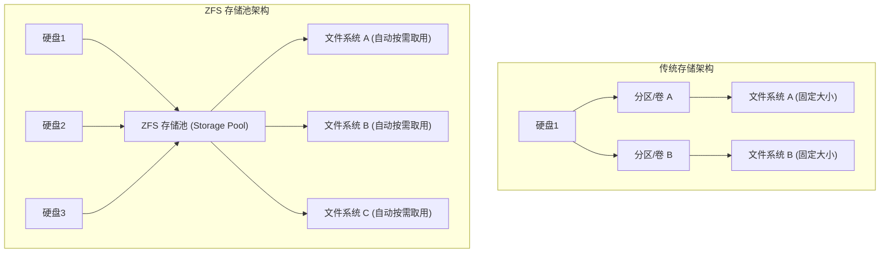

*(基于文档第 10-11 页概念重绘)*

   

   

#### B. 端到端数据完整性 (End-to-end Data Integrity) —— "极度强迫症的校验"

这是 ZFS 最核心的功能。普通文件系统的校验和（Checksum）通常和数据放在一起，如果两个都坏了，你就没救了。**ZFS 把校验和放在“父块指针”里** 。

这就形成了一棵 **Merkle Tree（默克尔树）** 结构：

1.  根节点（Uberblock）存着子节点的校验和。
2.  子节点存着孙节点的校验和。
3.  ...直到最底层的数据块。

当你读取一个数据块时，ZFS 会向上核对整条链路的校验和。如果任何环节（硬盘、线缆、控制器）篡改了数据，ZFS 瞬间就能发现 。

> **关键点：** 这种机制可以检测并防御：位翻转（Bit rot）、幻影写入（Phantom writes）、驱动 Bug、甚至 DMA 奇偶校验错误。

#### C. 写时复制 (Copy-On-Write, COW) —— "绝不覆盖原稿"

ZFS 永远不会直接覆盖旧数据。

  * **修改数据时：** 它会在磁盘的**新位置**写入新数据。
  * **写入完成后：** 它会修改指针，指向新数据的位置 。

这意味着数据永远是一致的。如果写入途中断电，旧数据还在，新数据没生效，文件系统不会损坏。这也让 ZFS 的 **快照（Snapshot）** 功能变得极快且不占额外空间（直到数据发生变化）。

-----

### 3\. 现场演示：ZFS 的“自我修复”能力

文档中记录了一个非常震撼的演示（Demo），展示了 ZFS 如何在硬盘损坏时拯救数据：

1.  **建立环境：** 创建了一个名为 `tank` 的存储池，包含两个镜像（Mirror）的硬盘（类似 RAID 1）。
2.  **写入重要数据：** 拷贝了一些文件进去。
3.  **人为搞破坏：** 使用 `dd` 命令向其中一块硬盘写入随机垃圾数据（模拟硬盘严重损坏）。
      * *注：如果是普通文件系统，此时数据已经损坏或系统已经崩溃。*
4.  **读取与修复：** 当 ZFS 读取数据时，它发现 checksum 对不上（数据坏了）。
      * 它会自动去镜像的另一块好硬盘读取正确数据。
      * **最关键的是：** 它不仅给用户返回正确数据，还会**自动反向修复**那块坏掉的硬盘上的数据 。
5.  **Scrub（清洗）：** 运行 `zpool scrub` 命令，系统会主动扫描整个磁盘，发现并修复了所有被 `dd` 破坏的错误 。

-----

### 4\. OpenZFS 社区与未来

文档的后半部分讲述了 ZFS 的前世今生：

  * **历史：** ZFS 最初由 Sun Microsystems（现在的 Oracle）开发。后来 Oracle 闭源了，但开源版本（OpenZFS）基于 illumos 分支继续发展 。
  * **跨平台统一：** 曾经 ZFS 在 FreeBSD、Linux、macOS 上各自为战，导致版本分裂。后来成立了 OpenZFS 社区，开始统一代码库（Repo of Record），主要基于 OpenZFS on Linux (ZoL) 进行统一 。
  * **现状：** 现在 OpenZFS 几乎可以在所有主流平台上运行（除了 Windows 还在完善中，Linux 虽有许可争议但技术上已成熟）。

-----

### 5\. 总结：为什么 ZFS 被称为“文件系统的终结者”？

文档最后引用了 Jeff Bonwick（ZFS 之父）的一句话："The last word in filesystems" 。

这意味着 ZFS 解决的问题不仅仅是“存文件”，而是构建了一个**不可变、可验证、自修复**的底层存储信任机制。

**最简便的指令概览 ：**
你只需要记住两个主要命令就能管理庞大的存储系统：

  * `zpool`：管理物理硬盘（建池、扩容、替换硬盘）。
  * `zfs`：管理数据集（创建文件系统、快照、压缩、配额）。

-----

**作为你的 AI 伙伴，如果你想在自己的服务器或 NAS 上尝试 ZFS，或者对某个具体的命令（比如如何做快照）感兴趣，我可以为你提供具体的操作步骤。**
  
## 3 术语 
  
这篇文档《The ZFS filesystem》通过一系列核心术语构建了 ZFS 强大的数据保护逻辑。为了让你更直观地理解，我将这些术语提炼出来，用通俗的语言配合图示进行讲解。

### 1\. Pooled Storage（存储池）

  * **定义：** ZFS 不使用传统的“分区”概念，而是将所有物理硬盘聚合在一起形成一个大的资源池 。
  * **通俗解读：**
      * **传统方式（像切蛋糕）：** 你买了一块 1TB 的硬盘，必须先把它切成几块（分区 C盘、D盘）。如果 C 盘满了而 D 盘还空着，你想把 D 盘的空间借给 C 盘非常麻烦，甚至需要格式化。
      * **ZFS 方式（像自助餐）：** 你把所有硬盘（甚至不同大小的）都丢进一个“大桶”里（Pool）。在这个桶上创建的文件系统（Filesystem）就像是拿盘子去盛菜，大家共享桶里的所有空间。谁需要更多空间，就自动多占一点，完全不需要手动调整分区大小 。


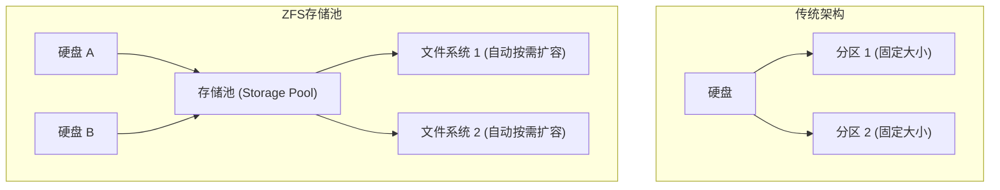

*(参考文档第 10-11 页 )*

   

   

-----

### 2\. Merkle Tree & Checksum（默克尔树与校验和）

  * **定义：** ZFS 是一种“自验证”的文件系统。它不像传统系统那样把校验和（数据的指纹）跟数据放在一起，而是放在**父块指针**中，形成一棵校验树 。
  * **通俗解读：**
      * **传统系统：** 就像把备用钥匙藏在门口地毯下。如果小偷（数据损坏）把门和地毯一起破坏了，你就没办法验证钥匙是不是原本那把了 。
      * **ZFS：** 就像“层层汇报”的信任链。
          * 最顶层的 **Uberblock**（超级块）拿着下一层的指纹。
          * 下一层目录拿着文件的指纹。
          * 文件拿着数据块的指纹。
      * 当你读取数据时，ZFS 会从树根一路向下核对。如果硬盘撒谎给了你坏数据，ZFS 马上就会发现指纹对不上，从而发现“位翻转”（Bit rot）或“静默损坏” 。


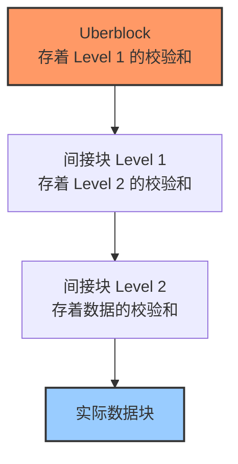

*(参考文档第 9 页)*

   

-----

### 3\. Copy-On-Write / COW（写时复制）

  * **定义：** ZFS 永远不会覆盖现有的数据。当需要修改数据时，它会将新数据写入到一个**新的位置**，然后更新指向数据的指针 。
  * **通俗解读：**
      * **传统系统（原地修改）：** 就像你在修改一份纸质合同，直接用涂改液涂掉旧字写新字。如果写到一半停电了（断电），这行字就毁了，合同作废。
      * **ZFS（另起一行）：** 你要改合同？ZFS 会复印一份或者在空白处写上新条款。
        1.  先把新数据写在空白的磁盘区域。
        2.  确认写好了，再把目录的指针从“旧位置”指到“新位置”。
      * **好处：** 无论何时断电，旧数据永远是完整的，文件系统永远不会因为意外关机而损坏 。这也让 ZFS 的 **快照（Snapshot）** 功能瞬间就能完成，因为只需要记录一下当前的指针位置即可。

-----

### 4\. Self-Healing（自我修复）

  * **定义：** 在拥有冗余（如镜像 Mirror）的存储池中，如果 ZFS 检测到某个数据块校验和错误，它会自动读取好的副本，并**修复**那个坏掉的数据块 。
  * **通俗解读：**
      * 假设你存了两份一模一样的文件（镜像）。
      * 当你读取文件时，ZFS 发现 A 硬盘上的数据坏了（校验和不对）。
      * 传统 RAID 可能会傻傻地把坏数据读给你，或者系统崩溃。
      * **ZFS 的做法：**
        1.  "A 硬盘的数据不对！"
        2.  "悄悄去 B 硬盘读一份，校验通过，是对的。"
        3.  "把正确数据返回给用户（应用程序完全无感知）。"
        4.  **"反手把 A 硬盘上那个坏掉的地方重写一遍，修好它。"** 

-----

### 5\. Scrub（清洗/巡检）

  * **定义：** 一个用于主动检查数据完整性的操作命令 `zpool scrub` 。
  * **通俗解读：**
      * 硬盘上的数据如果长期不读，可能会因为磁性衰减而悄悄变坏（静默腐烂）。
      * **Scrub** 就像是一个勤劳的保安，他不会等有人报警才动，而是定期把大楼里每一个房间（数据块）都巡视一遍。
      * 它会读取所有数据，计算校验和。如果发现有坏的且有冗余副本，就在后台自动修好它，防患于未然 。

-----

### 6\. Transactional Design（事务性设计）

  * **定义：** 所有的文件系统操作都是原子性的事务。数据要么完全写入，要么完全不写入，不会有“半写入”的中间状态 。
  * **通俗解读：**
      * 就像银行转账。A 转给 B 一百块。
      * 要么 A 扣了钱且 B 收到了钱（成功）。
      * 要么 A 没扣钱且 B 没收到钱（失败）。
      * 绝对不会出现“A 扣了钱，但 B 没收到，钱丢了”的情况。ZFS 保证磁盘上的数据状态始终是一致的 。

-----

### 7\. Zpool vs ZFS Commands

文档中特别提到 ZFS 的管理非常简单，主要依靠两个命令 ：

| 术语/命令 | 职责范围 | 通俗比喻 |
| :--- | :--- | :--- |
| **zpool** | 管理**物理硬件**（硬盘、扩展、替换） | 像是**基建部**，负责把地基打好，把房子（存储池）盖大。 |
| **zfs** | 管理**逻辑数据**（创建文件系统、配额、压缩、快照） | 像是**物业部**，负责把房子里的房间分配好，决定谁能住，能不能养宠物（压缩/加密）。 |
  
## 参考        
         
https://papers.freebsd.org/2019/COSCUP/philip-ZFS-filesystem.files/The%20ZFS%20filesystem.pdf    
        
<b> 以上内容基于DeepSeek、Qwen、Gemini及诸多AI生成, 轻微人工调整, 感谢杭州深度求索人工智能、阿里云、Google等公司. </b>        
        
<b> AI 生成的内容请自行辨别正确性, 当然也多了些许踩坑的乐趣, 毕竟冒险是每个男人的天性.  </b>        
  
    
#### [PolarDB 学习图谱](https://www.aliyun.com/database/openpolardb/activity "8642f60e04ed0c814bf9cb9677976bd4")
  
  
#### [PostgreSQL 解决方案集合](../201706/20170601_02.md "40cff096e9ed7122c512b35d8561d9c8")
  
  
#### [德哥 / digoal's Github - 公益是一辈子的事.](https://github.com/digoal/blog/blob/master/README.md "22709685feb7cab07d30f30387f0a9ae")
  
  
#### [About 德哥](https://github.com/digoal/blog/blob/master/me/readme.md "a37735981e7704886ffd590565582dd0")
  
  

  
