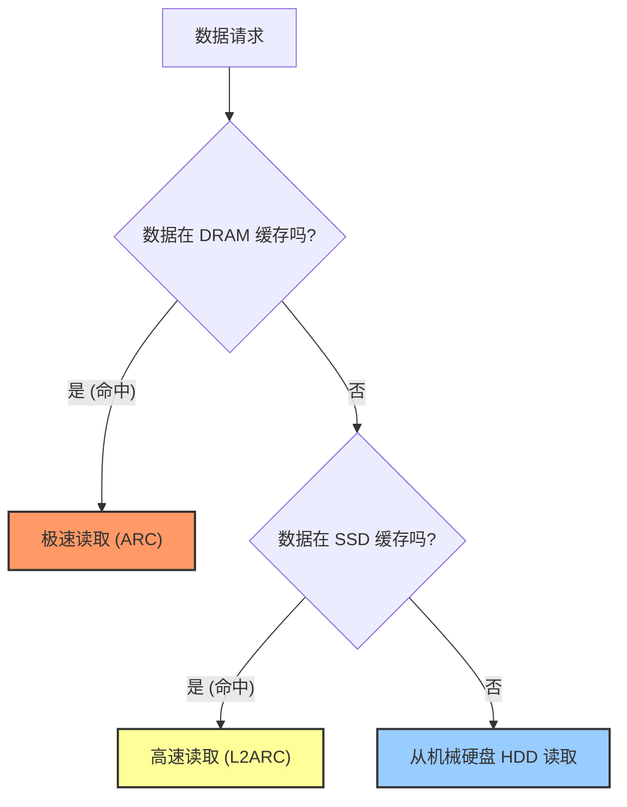
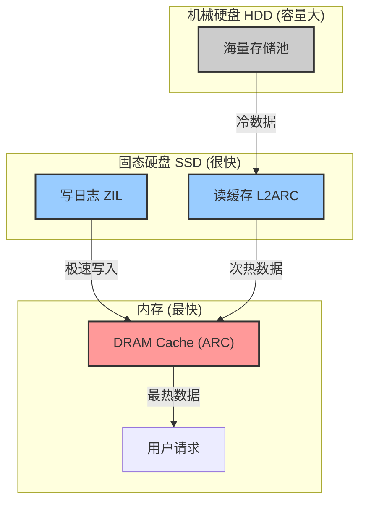
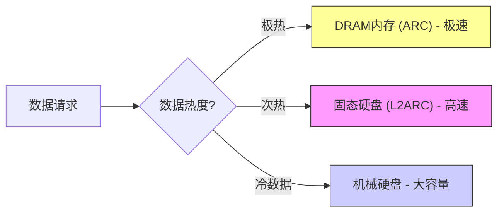

## AI论文解读 | Oracle ZFS Storage: The Bestof-Breed Solution for Highly Scalable Oracle Cloud
        
### 作者        
digoal        
        
### 日期        
2025-11-22        
        
### 标签        
PostgreSQL , PolarDB , DuckDB , AI , 论文解读        
        
----        
        
## 背景  
      
https://www.oracle.com/a/otn/docs/oracle-zfs-storage-best-breed-solution.pdf        
  
提示:          
```          
读懂《Oracle ZFS Storage: The Bestof-Breed Solution for Highly Scalable Oracle Cloud》这篇论文需要提前掌握哪些基础知识, 请使用中文通熟易懂的讲解这些基础知识, 可以引用论文中的图、表或使用Markdown支持的图形(text,mermaid等)增加解释性. 
  
使用中文通熟易懂的解读《Oracle ZFS Storage: The Bestof-Breed Solution for Highly Scalable Oracle Cloud》这篇论文, 其中的关键内容请着重讲解, 可以引用论文中的图、表或使用Markdown支持的图形(text,mermaid等)增加解释性. 
  
提取《Oracle ZFS Storage: The Bestof-Breed Solution for Highly Scalable Oracle Cloud》这篇论文中的重要术语, 使用中文对这些术语进行通熟易懂的讲解, 可以引用论文中的图、表或使用Markdown支持的图形(text,mermaid等)增加解释性. 
```     
  
## 1 前置知识 
  
要读懂《Oracle ZFS Storage: The Best-of-Breed Solution for Highly Scalable Oracle Cloud》这篇白皮书，你需要建立一个关于**企业级存储架构**、**Oracle 数据库生态**以及**云基础设施**的基础知识框架。

为了让你更轻松地理解，我将这些基础知识拆解为五个核心模块，并使用通俗易懂的语言配合图表进行讲解。

-----

### 1\. 三种基本存储类型（“停车场”理论）

在阅读该文档之前，你需要明白企业存储数据主要有三种方式：**块存储 (Block)**、**文件存储 (File)** 和 **对象存储 (Object)**。文中巧妙地用“停车”来比喻这三种类型 。

  * **块存储 (Block Storage) —— “专用预留车位”** 
      * **特点：** 就像你在公司楼下有一个写着你车牌号的专属车位。它速度最快，结构最严谨。
      * **用途：** 主要是给**数据库**用的。数据库需要极快的速度和极其精准的位置来读写数据。
      * **协议：** iSCSI, Fibre Channel (FC)。
  * **文件存储 (File Storage) —— “多层立体停车楼”** 
      * **特点：** 就像一个有楼层、有分区（A区、B区）的公共停车楼。你需要按照层级（文件夹/目录）去找数据。
      * **用途：** 适合存文档、图片、医疗记录等，方便人类理解和整理。
      * **协议：** NFS (Linux/Unix常用), SMB (Windows常用)。
  * **对象存储 (Object Storage) —— “代客泊车”** 
      * **特点：** 你把车（数据）交给服务员，拿到一个票据（ID）。你不需要知道车具体停在哪层哪号，下次凭票据取车。
      * **用途：** 适合存海量的、不经常修改的数据（非结构化数据），比如备份、视频监控录像、物联网数据。
      * **协议：** S3 API, OCI Object Storage API。

**Oracle ZFS Storage 的厉害之处：** 它是一个“统一存储”，也就是一台设备同时搞定以上三种模式，不用买三台不同的机器 。

-----

### 2\. 混合存储池架构（快慢搭配，干活不累）

这是 ZFS 性能的核心秘密。你需要理解计算机存储硬件的速度层级：**内存 (DRAM) \> 固态硬盘 (SSD) \> 机械硬盘 (HDD)**。

  * **DRAM (最快，极贵)：** 类似你的办公桌桌面，东西随手拿，但空间小，断电数据就没了。
  * **SSD (快，贵)：** 类似身边的文件柜。
  * **HDD (慢，便宜)：** 类似地下室的仓库。

**ZFS 的“混合存储池 (Hybrid Storage Pool)”技术：**
它把这些硬件组合起来，利用算法自动把“最热”（最常用）的数据放在最快的地方。



  * **ARC (Adaptive Replacement Cache)：**  位于内存中，存放最近或最常使用的数据，速度最快。
  * **L2ARC (Level 2 ARC)：**  位于 SSD 中，作为内存的补充，存放次常用的数据。
  * **ZIL (ZFS Intent Log)：**  用于处理写入操作。为了防止断电丢数据，写操作会先快速记录在这里（通常是高速 SSD），保证安全后再慢慢落盘。

-----

### 3\. 两个关键的数据“瘦身”与“保护”技术

文中多次提到 **CoW** 和 **HCC**，这是理解其高效率和低成本的关键。

#### A. 写时复制 (Copy-on-Write, CoW)

传统文件系统修改文件时，往往是直接覆盖旧数据。而 ZFS 使用 CoW ：

  * **原理：** 当你要修改数据块 A 时，它不会覆盖 A，而是找个新地方写下新数据 A'，然后把指针指向 A'。
  * **好处：**
    1.  **瞬间快照 (Snapshot)：**  如果你想给系统做个备份（快照），只需要记录当时的指针即可，不需要拷贝实际数据，瞬间完成，且不占空间（直到有新数据写入）。
    2.  **克隆 (Clone)：**  可以基于快照瞬间生成一个“克隆版”数据库供测试使用，且几乎不占额外空间。

#### B. 混合列式压缩 (HCC - Hybrid Columnar Compression)

这是 Oracle 数据库的独门绝技 。

  * **行式存储 (传统)：** 数据按行存。适合你要读取某一个人的所有信息（姓名、年龄、地址）。
  * **列式存储：** 数据按列存。适合你要统计所有人的“年龄”。
  * **HCC (混合)：** 结合两者优点。因为同一列的数据往往很相似（比如“国家”这一列可能都是“China”），压缩起来效率极高，能达到 10倍到 50倍的压缩率 。

-----

### 4\. Oracle 生态的“近水楼台先得月”

你需要明白，为什么要把存储和数据库都买 Oracle 的？因为它们能“互相通话”。

  * **OISP (Oracle Intelligent Storage Protocol)：** 

      * **通俗解释：** 普通存储是“哑巴”，不知道存的是数据库还是电影。OISP 让 Oracle 数据库能直接告诉 ZFS 存储：“喂，我现在传的是非常重要的日志文件，请用最快速度处理！”或者“这是不常用的归档，随便存存就行。”
      * **作用：** 减少中间沟通环节，自动优化性能，甚至能让存储帮数据库干活（卸载操作）。

  * **Direct NFS (dNFS)：** 

      * **通俗解释：** 传统的 NFS 像是一条单车道，所有数据都要排队走操作系统的内核。dNFS 像是给数据库开了一条“多车道高速公路”，绕过操作系统内核，直接多路径并行传输数据，速度大增。

-----

### 5\. 本地与云 (On-Premises vs. OCI)

这篇文档强调了 **OCI (Oracle Cloud Infrastructure)**。你需要理解三种部署场景：

1.  **On-Premises (本地部署)：** 买了 ZFS 物理机柜（如 ZS11-2）放在自家机房 。
2.  **OCI Marketplace (云端镜像)：** 在 Oracle 的公有云上，租用虚拟机或裸金属服务器，安装 ZFS 的软件系统。虽然没有物理机柜，但功能和代码是一模一样的 。
3.  **Hybrid Cloud (混合云)：**  本地有一台 ZFS，云上也有一台 ZFS。它们之间可以实时同步数据，用于灾难恢复 (DR)。如果本地机房着火了，云上的 ZFS 可以立马接手工作。

### 总结：读这篇论文的思维导图

在阅读时，请时刻带着这张图：

  * **这台机器是什么？** -\> 一台能同时存块、文件、对象的超级存储服务器。
  * **为什么它快？** -\> 因为它有 DRAM/SSD 分层缓存 (HSP)，还有 OISP 这种“开后门”的协议。
  * **为什么它省钱？** -\> 因为 CoW 技术让备份和克隆不占空间，HCC 技术把数据压缩得很小。
  * **为什么适合云？** -\> 因为它的软件可以直接运行在 OCI 云上，跟本地体验一致。
  
## 2 解读论文 
  
这篇白皮书《Oracle ZFS Storage: The Best-of-Breed Solution for Highly Scalable Oracle Cloud》主要阐述了 Oracle ZFS Storage（ZFS 存储）如何作为一款“混合云”时代的存储利器，既能在企业自家机房（On-Premises）发光发热，也能在 Oracle 云（OCI）上无缝运行。

为了让你轻松读懂，我将其核心逻辑拆解为四个部分：**架构原理**、**与 Oracle 数据库的独家默契**、**云端能力**以及**关键应用场景**。

-----

### 一、 核心架构：一机多能，快慢结合

Oracle ZFS Storage 的设计初衷是“多面手”和“高性能”。

#### 1\. 统一存储架构（一机多能）

这就好比一辆全能型卡车，不需要为了运不同的东西买三辆车。ZFS Storage 在一台设备上同时支持三种存储方式 ：

  * **文件存储 (File):** 像文件夹一样存文档、图片 (NFS, SMB)。
  * **块存储 (Block):** 像硬盘一样给数据库用 (iSCSI, FC)。
  * **对象存储 (Object):** 像仓库一样存海量数据 (S3, OCI Object Storage)。

文中用了一个非常形象的 **“停车场”** 比喻来解释这三种类型 ：

| 存储类型 | 比喻 | 特点 | 适用场景 |
| :--- | :--- | :--- | :--- |
| **块存储** | **专用预留车位** | 结构固定，位置精准，速度最快 | 数据库、高性能应用 |
| **文件存储** | **多层立体停车楼** | 有层级（目录），按区停车，方便查找 | 部门文档、图形设计、医疗记录 |
| **对象存储** | **代客泊车** | 只要交钥匙（ID），不用管车停哪，无限扩容 | 备份、归档、视频监控、IoT数据 |

#### 2\. 混合存储池 (Hybrid Storage Pool) —— 性能加速引擎

为了既要速度快（像内存），又要容量大且便宜（像机械硬盘），ZFS 设计了一套**智能分层**架构 。

它利用智能算法自动将数据在不同介质间流动，如下图所示：



  * **DRAM (ARC):** 内存缓存，处理最频繁的数据 。
  * **SSD (L2ARC):** 二级缓存，内存放不下但又常用的数据放这里 。
  * **SSD (ZIL):** 专门用来快速记录“写入动作”，防止断电丢数据 。

-----

### 二、 独门绝技：与 Oracle 数据库的“亲密关系”

这是该论文的重中之重。因为存储和数据库都是 Oracle 自家的，它们之间有很多“私有通道”，这是其他厂商（如 EMC, NetApp）做不到的。

#### 1\. OISP (Oracle 智能存储协议) —— “打破哑巴式沟通”

  * **传统模式：** 存储不知道数据库发来的是什么，一视同仁。
  * **OISP 模式：** 数据库会给存储发“小纸条”（Hints），告诉存储：“这是重要的日志文件，请优先处理！”或者“这是垃圾临时文件，不用缓存。” 。这能显著降低延迟 。

#### 2\. HCC (混合列式压缩) —— “数据瘦身术”

Oracle 数据库能以特殊的**列式格式**压缩数据，压缩比可达 **10倍到50倍** 。

  * **好处：** 既节省了极其昂贵的存储空间，又因为读取的数据量变小了，查询速度反而提升了 **3到8倍** 。

#### 3\. dNFS (直接 NFS) —— “数据高速公路”

绕过操作系统内核的繁琐步骤，建立数据库到存储的**多条并行通道**，自动负载均衡，大幅提升数据传输效率 。

#### 4\. ADO (自动数据优化) —— “智能搬运工”

根据数据的使用热度（Heat Map），自动把没人看的数据压缩并移动到便宜的存储层，把热门数据留在高性能层，全程自动化 。

-----

### 三、 云端战略：本地与云端无缝衔接

Oracle ZFS Storage 不仅仅是个物理铁盒子，它也可以作为软件运行在 Oracle 云 (OCI) 上。

  * **相同的软件基因：** 云上的 ZFS (OCI Marketplace Image) 和本地机房的 ZFS 使用完全相同的代码库 。这意味着你在本地怎么用，在云上就怎么用，不需要重新学习。
  * **数据自由流动：**
      * 可以轻松把本地数据**复制 (Replication)** 到云端进行容灾 。
      * 可以在云端利用 OCI 的**高可用 (HA)** 架构，防止单点故障 。
  * **灵活付费：** 云端支持按需付费，还可以根据负载自动调整性能（Shape Migration）。

-----

### 四、 关键应用场景 (Use Cases)

论文列举了多个场景，以下三个最值得关注：

#### 1\. 极速备份与恢复 (尤其是 Exadata)

  * ZFS Storage 可以直接连接 Oracle Exadata（最强的数据库一体机），通过 **100Gb** 的高速网络进行备份 。
  * 相比传统方式，备份速度极快，且不占用数据库服务器的 CPU 资源。

#### 2\. 开发/测试环境克隆 (Test/Dev)

  * **痛点：** 开发人员想要一份生产数据库的拷贝来做测试，通常需要很久来复制，还占一倍的空间。
  * **ZFS 方案：** 利用 **写时复制 (Copy-on-Write)** 技术，可以瞬间创建数据库的“克隆” 。
  * **优势：** 这些克隆**几乎不占空间**（直到你有新修改），且创建是秒级的 。

#### 3\. 防勒索病毒与合规

  * **不可变快照 (Immutable Snapshots)：** 一旦设定，在规定时间内（比如3年），连管理员都删不掉这些快照。黑客的勒索软件也无法加密或删除它们，确保有“后悔药”可吃 。
  * **合规：** 满足 SEC、FINRA 等严格的金融监管要求 。

### 总结

**Oracle ZFS Storage** 是一款“软硬通吃”的存储方案。它的核心竞争力在于：**懂数据库**（OISP, HCC）、**架构先进**（混合存储池）、**云地一体**（本地和 OCI 体验一致）。对于使用 Oracle 数据库的企业来说，它是能榨干数据库性能、降低存储成本的“最佳拍档”。
  
## 3 术语 
  
这篇白皮书《Oracle ZFS Storage: The Best-of-Breed Solution for Highly Scalable Oracle Cloud》中包含了大量存储技术和 Oracle 专有技术的术语。为了帮助你理解，我将这些术语归纳为**核心架构**、**Oracle 独家加速技术**、**数据保护与管理**以及**云端部署**四个类别，并使用通俗的语言和图形进行讲解。

-----

### 一、 核心架构术语 (底层引擎)

#### 1\. 统一存储 (Unified Storage)

  * **通俗解释：** 想象如果你去买车，不需要分别买一辆轿车运人、一辆卡车运货、一辆房车旅行。这一台设备就能同时搞定所有需求。ZFS Storage 就是这样一台设备，它能同时处理文件、数据块和对象数据，不需要购买不同的存储阵列。
  * **论文中的生动比喻：停车场**
    论文中使用“停车”来解释它支持的三种数据类型：

| 数据类型 | 论文比喻 | 含义解读 | 典型用途 |
| :--- | :--- | :--- | :--- |
| **块存储 (Block)** | **专用预留车位** | 就像老板的专属车位，位置固定，进出速度最快。 | 数据库 (Database) |
| **文件存储 (File)** | **立体停车楼** | 有层数、有分区（A区/B区），需要按路径（目录）去找车。 | 文档、图片、共享文件 |
| **对象存储 (Object)** | **代客泊车** | 你把车交给服务员拿到一张票（ID），不用管车停哪，凭票取车。 | 备份、归档、视频监控 |

#### 2\. 混合存储池 (Hybrid Storage Pool - HSP)

  * **通俗解释：** 这是一个“嫌贫爱富”的智能系统。它把最快但最贵的硬件（内存 DRAM）和最慢但最便宜的硬件（机械硬盘 HDD）组合在一起。系统会自动把大家最抢着要看的数据放在内存里，把偶尔才看一眼的数据扔到硬盘里 。
  * **关键组件：**
      * **ARC (Adaptive Replacement Cache)：** 最快的一级缓存（内存），放最热的数据 。
      * **L2ARC (Level 2 ARC)：** 二级缓存（SSD），放次热的数据，是内存的补充 。
      * **ZIL (ZFS Intent Log)：** 专门用来记录“写操作”的小本子（通常是高速 SSD），防止突然断电导致刚才写的数据丢了 。




-----

### 二、 Oracle 独家加速技术 (这也叫“不仅能用，而且好用”)

这些术语解释了为什么 Oracle 数据库配 Oracle 存储会特别快。

#### 3\. OISP (Oracle Intelligent Storage Protocol)

  * **通俗解释：** 在普通存储中，存储设备是“盲人”，不知道数据库发来的是什么。OISP 就像是给数据库和存储之间装了“专用电话”。数据库会提前告诉存储：“喂，我现在传的是非常重要的日志，请优先处理！”或者“这是垃圾数据，随便存存就行” 。
  * **效果：** 减少了互相猜测的时间，不仅速度快，还能自动优化数据块的大小 。

#### 4\. HCC (Hybrid Columnar Compression - 混合列式压缩)

  * **通俗解释：** 传统压缩是按“行”压的（比如存一个人的简历）。HCC 是按“列”压的（比如把全公司的“性别”这一列放在一起压）。因为同一列的数据往往很重复（都是“男”或“女”），所以能压得非常小。
  * **威力：** 数据体积能缩小 **10倍到50倍**，查询速度还能提升 **3到8倍** 。这就像把一屋子的文件压缩成了一个文件柜，找起来还更快了。

#### 5\. Direct NFS (dNFS)

  * **通俗解释：** 传统的数据传输就像走城市道路，要经过红绿灯（操作系统内核的各种检查）。dNFS 就像是给数据库开了一条**直达高速公路**，绕过操作系统的繁琐步骤，直接多通道并行传输数据 。

-----

### 三、 数据保护与管理 (后悔药与复制术)

#### 6\. 写时复制 (Copy-on-Write, CoW)

  * **通俗解释：** 当你想修改一个文件时，传统做法是把旧的擦掉写新的。CoW 的做法是：旧的我不动，我在旁边找个空白地写新的，然后把“指针”指过去。
  * **好处：** 这让**快照 (Snapshot)** 变得极快且不占空间。因为快照只需要记录那一瞬间所有数据的“指针”位置即可，不需要真的拷贝数据 。

#### 7\. 不可变快照 (Immutable Snapshots)

  * **通俗解释：** 这是一种防勒索病毒的“超级锁”。一旦给快照加上这个锁，在设定的时间（比如3年）内，连管理员都无法删除或修改它。就算黑客攻破了系统，也无法破坏这些备份数据，确保你能有干净的数据来恢复 。

#### 8\. DTrace 分析 (Analytics)

  * **通俗解释：** 这是一套通过类似X光扫描的深度监控工具。它能极其精细地看到存储系统内部发生了什么，甚至能精确到每一个读写操作花了多少微秒。这让管理员能一眼看出系统哪里卡顿了 。

-----

### 四、 云端部署 (从地面到天空)

#### 9\. OCI ZFS-HA (High Availability in OCI Marketplace)

  * **通俗解释：** 这是把本地那个物理的 ZFS 存储柜，“搬”到了 Oracle 的公有云 (OCI) 上变成了软件版。
  * **HA (高可用)：** 它在云上是成对出现的（双节点集群）。如果其中一个虚拟节点坏了，另一个立马接手，保证业务不断线 。
  * **用途：** 你可以用它在云上做灾难恢复，或者把本地的数据实时复制到云上 。

#### 10\. 自动容量扩展 (Automatic Capacity Scaling)

  * **通俗解释：** 在云端，当你的存储空间快用完时，系统会自动给你“加硬盘”，扩充存储池的大小，不需要人工干预，也不需要停机 。
  
## 参考        
         
https://www.oracle.com/a/otn/docs/oracle-zfs-storage-best-breed-solution.pdf    
        
<b> 以上内容基于DeepSeek、Qwen、Gemini及诸多AI生成, 轻微人工调整, 感谢杭州深度求索人工智能、阿里云、Google等公司. </b>        
        
<b> AI 生成的内容请自行辨别正确性, 当然也多了些许踩坑的乐趣, 毕竟冒险是每个男人的天性.  </b>        
  
    
#### [PolarDB 学习图谱](https://www.aliyun.com/database/openpolardb/activity "8642f60e04ed0c814bf9cb9677976bd4")
  
  
#### [PostgreSQL 解决方案集合](../201706/20170601_02.md "40cff096e9ed7122c512b35d8561d9c8")
  
  
#### [德哥 / digoal's Github - 公益是一辈子的事.](https://github.com/digoal/blog/blob/master/README.md "22709685feb7cab07d30f30387f0a9ae")
  
  
#### [About 德哥](https://github.com/digoal/blog/blob/master/me/readme.md "a37735981e7704886ffd590565582dd0")
  
  

  
