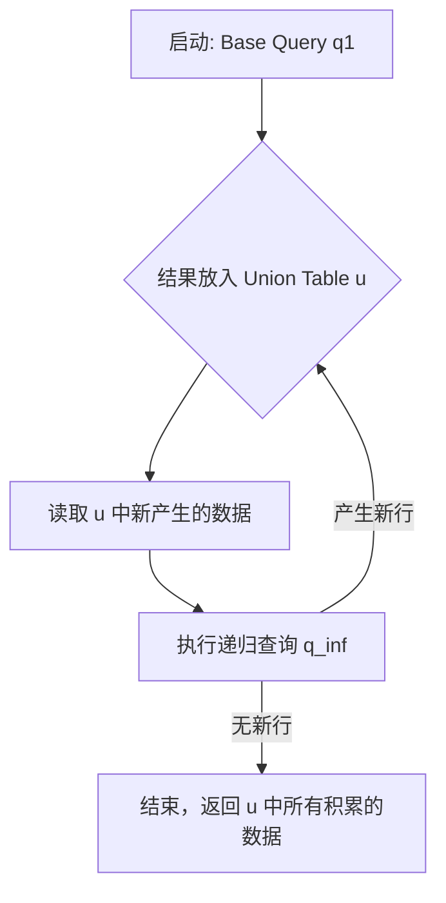
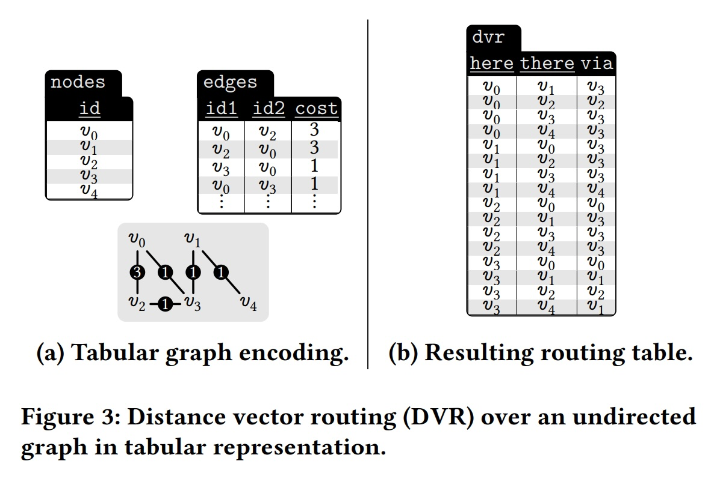
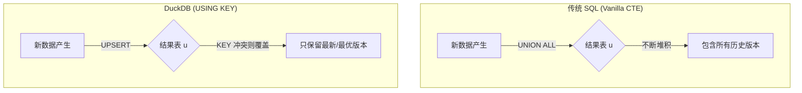
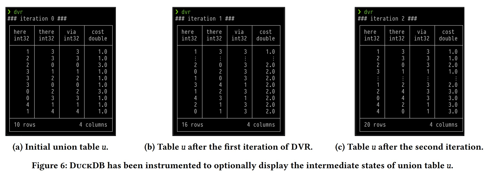
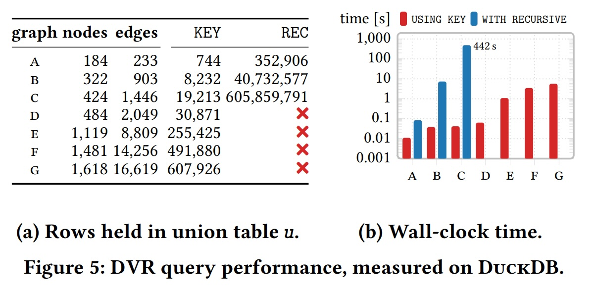
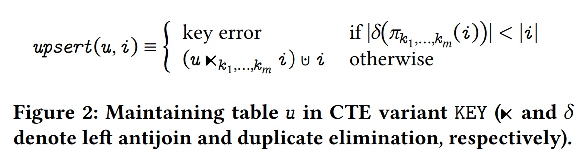
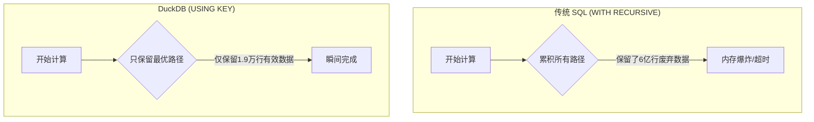

## AI论文解读 | How DuckDB is USING KEY to Unlock Recursive Query Performance
        
### 作者        
digoal        
        
### 日期        
2025-11-24        
        
### 标签        
PostgreSQL , PolarDB , DuckDB , AI , 论文解读        
        
----        
        
## 背景  
      
https://db.cs.uni-tuebingen.de/publications/2025/using-key/how-duckdb-is-using-key-to-unlock-recursive-query-performance.pdf        
  
提示:          
```          
读懂《How DuckDB is USING KEY to Unlock Recursive Query Performance》这篇论文需要提前掌握哪些基础知识, 请使用中文通熟易懂的讲解这些基础知识, 可以引用论文中的图、表或使用Markdown支持的图形(text,mermaid等)增加解释性. 
  
使用中文通熟易懂的解读《How DuckDB is USING KEY to Unlock Recursive Query Performance》这篇论文, 其中的关键内容请着重讲解, 可以引用论文中的图、表或使用Markdown支持的图形(text,mermaid等)增加解释性. 
  
提取《How DuckDB is USING KEY to Unlock Recursive Query Performance》这篇论文中的重要术语, 使用中文对这些术语进行通熟易懂的讲解, 可以引用论文中的图、表或使用Markdown支持的图形(text,mermaid等)增加解释性. 
```     
  
## 1 前置知识 
  
要读懂这篇关于 DuckDB `USING KEY` 语法的论文，你不需要是数据库内核专家，但需要掌握以下几个核心基础概念。这篇论文的核心在于**如何让 SQL 处理图算法（Graph Algorithms）更高效**。

以下是通俗易懂的基础知识讲解：

-----

### 1\. 递归公用表表达式 (Recursive CTEs)

这是论文讨论的主角。在 SQL 中，通常我们一次只查询一次数据。但如果你要查询“朋友的朋友的朋友...”，或者在一个地图网络中找路线，就需要“循环”查询。SQL 使用 `WITH RECURSIVE` 来实现这种循环。

  * **基本结构**：它由两部分组成。
    1.  **初始查询 ( Base Case / $q_1$ )** ：循环的起点（例如：我的直接朋友）。
    2.  **递归查询 ( Recursive Step / $q_{\infty}$ )** ：循环体（例如：根据刚才找到的朋友，再找他们的朋友）。
  * **停止条件**：当递归查询不再产生新数据时，循环停止。

**通俗理解**：
想象你在剥洋葱。`WITH RECURSIVE` 让你写一条规则：“剥掉一层皮，如果还有皮，就继续剥”。

**论文中的痛点**：
标准的递归 CTE 是**累积性（Accumulative）的 。
这意味着：每次循环产生的新数据（剥下来的皮），都会被扔进一个巨大的“结果堆”里。如果你在第 3 轮找到一条“A到B”距离为 10 的路，第 5 轮找到一条距离为 5 的路，标准 SQL 会同时保留**这两条记录。这会导致内存爆炸 。



### 2\. 图算法与“最短路径” (Graph & Shortest Path)

论文为了演示性能，使用了一个经典的图算法案例： **距离向量路由 (Distance Vector Routing, DVR)** 。

  * **图 (Graph)** ：由节点（Nodes，如城市）和边（Edges，如道路）组成的数据结构。
  * **表结构表示**：在数据库中，图通常用两张表表示：`nodes` 表存地点，`edges` 表存连接和成本（距离）。

> **参考论文图示 Figure 3(a)** :  
> 这是一个简单的图，节点 $v_0$ 到 $v_2$ 有连接，成本是 3。  

  * **目标**：找到从起点到终点的最短路径。
  * **状态更新**：在算法运行过程中，我们会不断发现“更好的路线”。
      * *第一次发现*：A 到 B 距离 100。
      * *第二次发现*：A 经过 C 到 B 距离只有 80。
      * *算法逻辑*：应该把 B 的距离从 100 **更新** 为 80。

  

### 3\. Union（并集） vs. Upsert（更新插入）

这是理解论文核心创新的关键。

  * **Standard SQL (Vanilla CTE)** ：使用 `UNION`。它像写日志一样，只能往后追加。它**没有记忆**，记不住“当前A到B的最短距离是80”，它只知道“曾经有过100，现在又来个80” 。
  * **Imperative Code (Python/C++等)** ：使用变量或字典（Map）。你可以写 `distance[B] = 80`，直接**覆盖**旧值。

**论文的解决方案 (`USING KEY`)** ：
DuckDB 引入了 `USING KEY` 语法，允许 SQL 在递归时执行 **Upsert** (Update + Insert) 操作 。

  * 如果你指定 `(起点, 终点)` 作为 **KEY**。
  * 当发现一条新路线时，如果 Key 相同（起点终点一样），就直接**覆盖**旧数据（如果新路线更短），而不是追加新行 。

> **可视化对比**：
>
>   * **传统 SQL**: 表 `u` 越来越大，存了所有历史废弃数据。
>     \* **DuckDB `USING KEY`**: 表 `u` 维持在最小规模，像一个哈希表（Dictionary）一样只存当前最优解 。

### 4\. 半朴素求值 (Semi-naive Evaluation)

这是一个稍高级的概念，但文中提到了它的局限性 。

  * **为了省内存**：标准 SQL 为了防止数据无限膨胀，规定递归查询只能读取“上一轮刚刚产生的数据”（Short term memory）。
  * **副作用**：这导致你很难在 SQL 里做复杂的算法，因为你无法回头看“全局状态”。
  * **DuckDB的突破**：因为 `USING KEY` 极大地压缩了数据量（只存最优解），DuckDB 允许你在递归中读取**整个**当前的路由表（使用 `RECURRING` 关键字），这让 SQL 写法更像普通编程语言 。

### 总结：如何串联这些知识读论文？

当你阅读这篇论文时，请带着这个逻辑链条：

1.  **问题**：标准 SQL 的 `WITH RECURSIVE` 是“只增不减”的（Accumulative），跑图算法时会存大量垃圾数据，内存爆炸且慢 。
2.  **灵感**：常规编程（如 Python）做这事很快，因为它们用字典（Map）直接更新变量值 。
3.  **方案**：DuckDB 加了 `USING KEY`。
      * 把“追加”变成了“更新”（Upsert）。
      * 就像给表加了主键，重复的 Key 会被新值覆盖。
4.  **结果**：内存占用极低（Table $u$ 很小），速度极快（因为不需要处理废弃的历史数据）。

掌握了“递归CTE的累积性缺陷”和“Upsert覆盖更新的概念”，你就能轻松看懂这篇论文的精髓了。
  
## 2 解读论文 
  
这篇论文介绍了一项让 DuckDB 能够高效运行复杂图算法（如最短路径、PageRank）的关键技术。核心在于它打破了传统 SQL 递归查询“只增不减”的限制，引入了类似编程语言中“更新变量”的能力。

以下是对这篇论文的通俗解读：

### 1\. 核心痛点：传统 SQL 的“囤积癖”

在标准 SQL 中，我们使用 `WITH RECURSIVE` 来处理递归问题（比如查族谱、找地图路线）。

  * **它的工作方式**：它是 **累积性（Accumulative）** 的。每一轮递归产生的新结果，都会被扔进一个巨大的“结果池”（Union Table）里。
  * **问题**：这就像写日记，你不能修改之前的日记，只能往后写。
      * 如果你在计算“从北京到上海的最短路线”，第 1 轮算出来是 1500 公里，第 5 轮发现一条近路只有 1200 公里。
      * **传统 SQL**：它会**同时保留** “1500 公里”和“1200 公里”这两条记录 。
      * **后果**：随着计算进行，废弃的“脏数据”堆积如山，内存爆炸，速度极慢。

### 2\. DuckDB 的解法：`USING KEY` 实现“断舍离”

DuckDB 引入了一个新语法：`USING KEY (...)`。它的核心思想是**Upsert（更新插入）** 。

  * **它的工作方式**：它允许你指定一个“主键”（Key）。当新计算出的结果拥有相同的 Key 时，它会直接**覆盖**旧结果 。
  * **比喻**：这就像现在的记账软件。
      * **传统 SQL**：是流水账，显示你修改了 100 次余额。
      * **DuckDB `USING KEY`**：是余额表，只显示你当前最新的余额。

#### 图解对比：处理数据的逻辑

我使用一个 Mermaid 图来展示这两种模式的区别（基于论文图 1 的逻辑 ）：    



### 3\. 关键案例：最短路径算法 (DVR)

论文用**距离向量路由 (DVR)** 算法来演示这个功能 。这其实就是找图中两点间的最短路径。

#### 场景设定

假设我们有几个城市（节点 Nodes）和道路（边 Edges）。我们要维护一张表，记录“从 A 到 B 怎么走最近”。

  * **表结构**：`dvr(here, there, via, cost)`。意思是从 `here` 到 `there`，经过 `via`，距离是 `cost` 。
  * **Key 的设定**：`USING KEY (here, there)`。这意味着：对于每一对起点和终点，我们只需要保留**一条**最好的路线 。

#### 运行过程

1.  **初始状态**：只知道直达的城市距离。
2.  **递归发现**：如果发现“从 A 经过 C 到 B”比“从 A 直接到 B”更近（Cost 更小）。
3.  **触发更新**：DuckDB 会用这条新路线的数据，**替换**掉表中原来那条旧路线 。

> **论文中的数据证据** ：  
> 在论文图 6 中，作者展示了一个 5 个节点的微型网络。  
>  
>   * **传统 SQL**：会产生大量的行，包含所有尝试过的路线。  
>   * **USING KEY**：每一轮迭代，表格行数始终保持在很小的范围内（最多 `N*N` 行），非常干净。  

  

### 4\. 性能提升：简直是降维打击

论文在 LDBC 社交网络数据集上进行了“大比武”（Bake-off），结果非常惊人。

#### (1) 内存占用（结果表行数）

请看论文图 5(a) 的对比数据 ：    

| 图规模 (Graph) | 传统 SQL (REC) 行数 | DuckDB (KEY) 行数 | 结论 |
| :--- | :--- | :--- | :--- |
| **小图 (C)** | 6.05 亿行 (605,859,791) | 1.9 万行 (19,213) | **相差 3 万倍！** |
| **大图 (G)** | **崩溃 (❌)** | 60 万行 (607,926) | 传统 SQL 直接跑不动了 |

  * **解读**：传统 SQL 为了存那些没用的中间数据，生成了 6 亿行数据；而 DuckDB 用 `USING KEY` 随时清理垃圾，只存了 1.9 万行有用的数据 。

#### (2) 运行时间

请看论文图 5(b) ：

  * 在图表上，蓝色柱子（传统 SQL）高耸入云，而红色柱子（DuckDB）几乎贴地。
  * 传统 SQL 经常因为超时或内存不足无法完成任务（图中标红叉 ❌ 的部分），而 DuckDB 依然能在秒级或亚秒级完成 。

### 5\. 一个新的关键字：`RECURRING`

配合 `USING KEY`，DuckDB 还引入了一个很酷的关键字：`RECURRING`。

  * **背景**：标准 SQL 为了防止无限循环，通常只允许你读取“上一轮刚刚产生的新数据”（这叫半朴素求值 Semi-naive evaluation）。
  * **DuckDB 的突破**：因为 `USING KEY` 保证了表不会无限膨胀，DuckDB 允许你在递归查询中使用 `FROM RECURRING dvr`。
  * **意义**：这意味着你可以读取**当前整个结果表**的最新状态 。这让 SQL 写起来更像 Python 或 C++ 中的 `while` 循环，可以直接读取和更新全局状态（字典/数组）。

### 总结

这篇论文的核心贡献在于：它通过引入 `USING KEY`，把 SQL 从一个 **只能“记流水账”** 的查询语言，变成了一个 **能高效管理“状态”** 的计算引擎。

1.  **省空间**：用 Upsert 代替 Append，抛弃废弃数据。
2.  **提速度**：数据量小了，Join 和计算自然就快了。
3.  **更灵活**：`RECURRING` 关键字让 SQL 能像普通编程语言一样写复杂的图算法。
  
## 3 术语 
  
这篇论文介绍了一项旨在优化 DuckDB 中递归查询性能的新技术。为了让你轻松读懂，我提取了文中的关键术语，并用通俗的语言配合图表进行解读。

### 1\. Recursive CTEs (递归公用表表达式)

  * **通俗解释**：
    在 SQL 中，通常我们是一次性查出数据。但有时候任务像“剥洋葱”或“查族谱”，需要一层一层往下查（例如：找朋友的朋友，再找朋友的朋友的朋友）。`Recursive CTE` 就是 SQL 用来处理这种“循环任务”的语法工具 。
  * **它是怎么工作的**：
    它像一个循环机器，每一轮都会产生新数据，直到没有新数据产生为止 。

### 2\. Accumulative Semantics (累积语义) & Union Table (联合表 `u`)

这是传统 SQL 递归查询的“老毛病”，也是论文要解决的核心问题。

  * **通俗解释**：
    **累积语义**意味着“只增不减”。传统 SQL 在做递归时，会把每一轮产生的所有结果都扔进一个叫 **Union Table (`u`)** 的大池子里 。
      * **比喻**：就像写日记。即使你发现昨天的记录写错了（比如路走远了），你也不能擦掉，只能在今天的新页面上重写。结果就是日记本变得极厚，里面充满了过时的废话。
  * **论文中的后果**：
    这导致表格 `u` 变得非常巨大，占用大量内存，而且运行速度极慢 。
    如下图所示，传统方法（Vanilla）会将中间结果不断堆积到表 `u` 中：     
    ```mermaid
    graph LR
        A[新计算出的行] -->|全部追加| B[(Union Table u)]
        B -->|越来越大| C{内存膨胀}
    ```
    *参考论文 Figure 1(a)*   

### 3\. USING KEY (使用键) & Upsert (更新插入)

这是 DuckDB 引入的“杀手锏”功能。

  * **通俗解释**：
    **USING KEY** 允许你指定一个“唯一标识”（Key）。当新计算出的数据与旧数据有相同的 Key 时，DuckDB 不会单纯地追加，而是执行 **Upsert**（更新或插入）操作 。
      * **Upsert = Update + Insert**。
      * **比喻**：就像写“黑板报”或“记分牌”。如果你发现某个人的分数变了，你直接擦掉旧分数，写上新分数。黑板的大小始终是固定的，不会无限膨胀。
  * **效果**：
    通过覆盖旧数据，表 `u` 被当成了一个“字典”或“哈希表”来维护，只保留当前最优或最新的状态 。
    > *参考论文 Figure 1(b) 和 Figure 2*     

### 4\. Semi-naive Evaluation (半朴素求值) vs. RECURRING

  * **半朴素求值 (传统限制)** ：
    标准 SQL 为了防止数据爆炸，规定在递归时，你只能读取“上一轮刚刚产生的那一小撮数据”，这被称为“短期记忆” 。这让很多复杂的算法（如全局最优路径）很难写。
  * **RECURRING (DuckDB的新能力)** ：
    因为 `USING KEY` 保证了表格不会无限变大，DuckDB 允许使用 `RECURRING` 关键字。这让你在递归过程中，可以回头去读**整个**当前的联合表 `u` 。
      * **通俗解释**：你可以拥有“全局视野”，而不是只有“金鱼的记忆”。

### 5\. DVR (Distance Vector Routing / 距离向量路由)

这是论文用来演示性能的具体案例。

  * **通俗解释**：
    这是一个寻找网络中节点之间“最短路径”的算法 。
      * 想象你要在地图上找从 A 到 B 的路。
      * 第 1 轮：发现一条路距离是 100 公里。
      * 第 2 轮：发现经过 C 点只要 80 公里。
      * **使用 USING KEY**：DuckDB 会直接把 A-\>B 的距离从 100 改写为 80 。
      * **传统 SQL**：会同时保留 100 和 80 两条记录，导致数据冗余 。

### 6\. Aggregate Hash Table (聚合哈希表)

这是 DuckDB 在底层实现 `USING KEY` 时用到的技术。

  * **通俗解释**：
    为了快速判断“这个 Key 以前有没有出现过”，DuckDB 在底层复用了数据库中用于去重（比如 `GROUP BY`）的哈希表技术 。
      * 不同的是，普通的哈希表发现重复就扔掉，而这里的哈希表发现重复 Key 时，会更新里面的内容（Payload） 。

-----

### 总结图示：性能差异为何如此巨大？

基于论文 Figure 5 的数据 ，我们可以对比一下处理大图（Graph C）时的差异：    



*(数据来源：论文 Figure 5a, Graph C 行数对比: 605,859,791 vs 19,213 )*
  
## 参考        
         
https://db.cs.uni-tuebingen.de/publications/2025/using-key/how-duckdb-is-using-key-to-unlock-recursive-query-performance.pdf    
        
<b> 以上内容基于DeepSeek、Qwen、Gemini及诸多AI生成, 轻微人工调整, 感谢杭州深度求索人工智能、阿里云、Google等公司. </b>        
        
<b> AI 生成的内容请自行辨别正确性, 当然也多了些许踩坑的乐趣, 毕竟冒险是每个男人的天性.  </b>        
    
#### [PolarDB 学习图谱](https://www.aliyun.com/database/openpolardb/activity "8642f60e04ed0c814bf9cb9677976bd4")
  
  
#### [PostgreSQL 解决方案集合](../201706/20170601_02.md "40cff096e9ed7122c512b35d8561d9c8")
  
  
#### [德哥 / digoal's Github - 公益是一辈子的事.](https://github.com/digoal/blog/blob/master/README.md "22709685feb7cab07d30f30387f0a9ae")
  
  
#### [About 德哥](https://github.com/digoal/blog/blob/master/me/readme.md "a37735981e7704886ffd590565582dd0")
  
  

  
